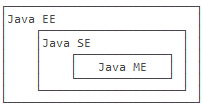
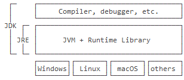

# Java

---

**推荐工具/资源书籍**
- [JAVACORE](https://dunwu.github.io/javacore/)
- [Java Web安全](https://javasec.org/) - 一个不定期更新的免费开源的 Java Web 安全相关知识归纳总结、培训的项目。
- [jenv/jenv](https://github.com/jenv/jenv) - Manage your Java environment

**推荐的 IntelliJ IDEA 插件**
- Material Theme UI
- Rainbow Brackets
- codeGlance

---

## 常见报错

**Error:java: 源发行版 13 与 --enable-preview 一起使用时无效   （仅发行版 14 支持预览语言功能）**
* 修改 Project Structure 中的 Project SDK 或 Language Level.
* 点击"Settings"-->"Bulid, Execution,Deployment"-->"Compiler"-->"Java Compiler"，Target bytecode version设为本地Java版本。
* 在 maven地址\conf\settings.xml中设置默认jdk版本
    ```xml
    <profile>
      <id>development</id>
      <activation>
        <jdk>11</jdk>
        <activeByDefault>true</activeByDefault>
      </activation>
      <properties>
        <maven.compiler.source>11</maven.compiler.source>
        <maven.compiler.target>11</maven.compiler.target>
        <maven.compiler.compilerVersion>11</maven.compiler.compilerVersion>
      </properties>
    </profile>
    ```

**Windows不能用鼠标双击运行jar文件**
* https://jingyan.baidu.com/article/200957617c3619cb0621b44d.html

--

## 简介

Java 最早是由 SUN 公司（已被 Oracle 收购）的詹姆斯·高斯林（高司令，人称 Java 之父）在上个世纪90年代初开发的一种编程语言，最初被命名为 Oak，目标是针对小型家电设备的嵌入式应用，结果市场没啥反响。谁料到互联网的崛起，让 Oak 重新焕发了生机，于是 SUN 公司改造了 Oak，在 1995 年以 Java 的名称正式发布，原因是 Oak 已经被人注册了，因此 SUN 注册了 Java 这个商标。随着互联网的高速发展，Java 逐渐成为最重要的网络编程语言。

Java 介于编译型语言和解释型语言之间。编译型语言如 C、C++，代码是直接编译成机器码执行，但是不同的平台（x86、ARM 等）CPU 的指令集不同，因此，需要编译出每一种平台的对应机器码。解释型语言如 Python、Ruby 没有这个问题，可以由解释器直接加载源码然后运行，代价是运行效率太低。而 Java 是将代码编译成一种“字节码”，它类似于抽象的 CPU 指令，然后，针对不同平台编写虚拟机，不同平台的虚拟机负责加载字节码并执行，这样就实现了“一次编写，到处运行”的效果。当然，这是针对 Java 开发者而言。对于虚拟机，需要为每个平台分别开发。为了保证不同平台、不同公司开发的虚拟机都能正确执行 Java 字节码，SUN 公司制定了一系列的 Java 虚拟机规范。从实践的角度看，JVM 的兼容性做得非常好，低版本的 Java 字节码完全可以正常运行在高版本的 JVM 上。

随着 Java 的发展，SUN 给 Java 又分出了三个不同版本：
- Java EE(Java Platform Enterprise Edition-Java 平台企业版)
    - Java EE 指的是 Java 平台企业版（Java Platform Enterprise Edition），之前称为 Java 2 Platform, Enterprise Edition(J2EE)，2017年的9月 Oracle 将 Java EE 捐赠给 Eclipse 基金会，由于 Oracle 持有 Java 商标原因，Eclipse 基金于2018年3月将 Java EE 更名为 Jakarta EE。

- Java SE(Java Platform, Standard Edition-Java 平台标准版)
    - Java SE 是 JDK 自带的标准 API，内容涉及范围甚广

- Java ME(Java Platform, Micro Edition-Java 平台微型版)。



简单来说，Java SE 就是标准版，包含标准的 JVM 和标准库，而 Java EE 是企业版，它只是在 Java SE 的基础上加上了大量的 API 和库，以便方便开发 Web 应用、数据库、消息服务等，Java EE 的应用使用的虚拟机和 Java SE 完全相同。

Java ME 就和 Java SE 不同，它是一个针对嵌入式设备的“瘦身版”，Java SE 的标准库无法在 Java ME 上使用，Java ME 的虚拟机也是“瘦身版”。

毫无疑问，Java SE 是整个 Java 平台的核心，而 Java EE 是进一步学习 Web 应用所必须的。我们熟悉的 Spring 等框架都是 Java EE 开源生态系统的一部分。不幸的是，Java ME 从来没有真正流行起来，反而是 Android 开发成为了移动平台的标准之一，因此，没有特殊需求，不建议学习 Java ME。

---

## Java 版本

从1995年发布1.0版本开始，到目前为止，版本如下:
| 时间	    | 版本 |
| - | - |
| 1995	    | 1.0 |
| 1998	    | 1.2 |
| 2000	    | 1.3 |
| 2002	    | 1.4 |
| 2004	    | 1.5 / 5.0 |
| 2005	    | 1.6 / 6.0 |
| 2011	    | 1.7 / 7.0 |
| 2014	    | 1.8 / 8.0 |
| 2017/9	| 1.9 / 9.0 |
| 2018/3	| 10 |
| 2018/9	| 11 |
| 2019/3	| 12 |
| 2019/9	| 13 |
| 2020/3	| 14 |

---

## JDK 和 JRE

- JDK：Java Development Kit
- JRE：Java Runtime Environment

简单地说，JRE 就是运行 Java 字节码的虚拟机。但是，如果只有 Java 源码，要编译成 Java 字节码，就需要 JDK，因为 JDK 除了包含 JRE，还提供了编译器、调试器等开发工具。

二者关系如下：



---

## JSR 和 JCP

- JSR 规范：Java Specification Request
    - 为了保证 Java 语言的规范性，SUN 公司搞了一个 JSR 规范，凡是想给 Java 平台加一个功能，比如说访问数据库的功能，大家要先创建一个 JSR 规范，定义好接口，这样，各个数据库厂商都按照规范写出 Java 驱动程序，开发者就不用担心自己写的数据库代码在 MySQL 上能跑，却不能跑在 PostgreSQ L上。所以 JSR 是一系列的规范，从 JVM 的内存模型到 Web 程序接口，全部都标准化了。

- JCP 组织：Java Community Process
    - 负责审核 JSR 的组织就是 JCP。


一个 JSR 规范发布时，为了让大家有个参考，还要同时发布一个“参考实现”，以及一个“兼容性测试套件”：
- RI：Reference Implementation
- TCK：Technology Compatibility Kit

比如有人提议要搞一个基于 Java 开发的消息服务器，这个提议很好啊，但是光有提议还不行，得贴出真正能跑的代码，这就是 RI。如果有其他人也想开发这样一个消息服务器，如何保证这些消息服务器对开发者来说接口、功能都是相同的？所以还得提供 TCK。

通常来说，RI 只是一个“能跑”的正确的代码，它不追求速度，所以，如果真正要选择一个 Java 的消息服务器，一般是没人用 RI 的，大家都会选择一个有竞争力的商用或开源产品。

---

## 一些项目

- [HaberHe/pdf-export](https://github.com/HaberHe/pdf-export) - pdf转jpg
