# 字节码

---

Java 之所以可以“一次编译，到处运行”，一是因为 JVM 针对各种操作系统、平台都进行了定制，二是因为无论在什么平台，都可以编译生成固定格式的字节码（.class 文件）供 JVM 使用。

`.class` 文件是一组以 8 位字节为基础单位的二进制流，各个数据项严格按照顺序紧凑地排列在 `.class` 文件中，中间没有添加任何分隔符。整个 `.class` 文件本质上就是一张表。

---

## 字节码

### 什么是字节码

之所以被称之为字节码，是因为字节码文件由十六进制值组成，而 JVM 以两个十六进制值为一组，即以字节为单位进行读取。在 Java 中一般是用 javac 命令编译源代码为字节码文件，一个 `.java` 文件从编译到运行的示例如下图所示。

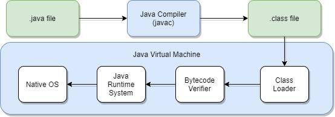

对于开发人员，了解字节码可以更准确、直观地理解 Java 语言中更深层次的东西，比如通过字节码，可以很直观地看到 Volatile 关键字如何在字节码上生效。另外，字节码增强技术在 Spring AOP、各种 ORM 框架、热部署中的应用屡见不鲜，深入理解其原理对于我们来说大有裨益。除此之外，由于 JVM 规范的存在，只要最终可以生成符合规范的字节码就可以在 JVM 上运行，因此这就给了各种运行在 JVM 上的语言（如 Scala、Groovy、Kotlin）一种契机，可以扩展 Java 所没有的特性或者实现各种语法糖。理解字节码后再学习这些语言，可以“逆流而上”，从字节码视角看它的设计思路，学习起来也“易如反掌”。

### 字节码结构

.java 文件通过 javac 编译后将得到一个.class 文件，如下：

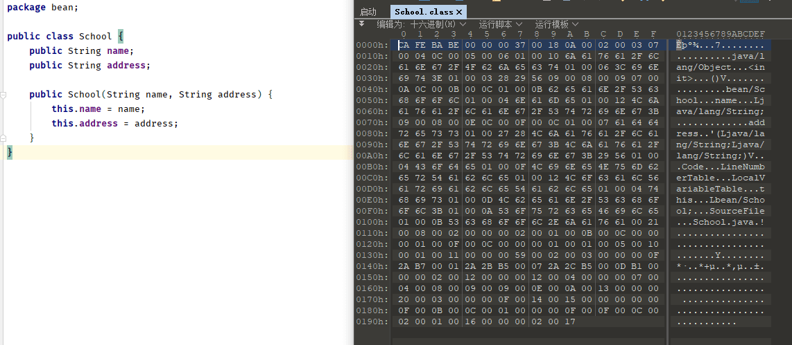

编译后生成 .class 文件，打开后是一堆十六进制数，按字节为单位进行分割后展示如图右侧部分所示。

JVM 对于字节码是有规范要求的，那么看似杂乱的十六进制符合什么结构呢？

JVM 规范要求每一个字节码文件都要由十部分按照固定的顺序组成，整体结构如下所示。接下来我们将一一介绍这十部分：

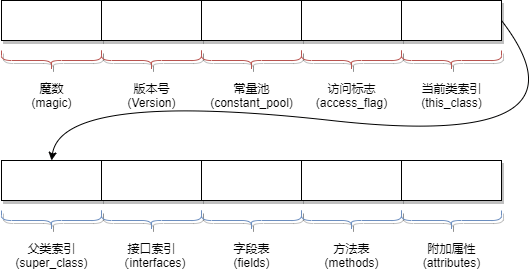

#### 魔数（Magic Number）

每个 `.class` 文件的头 4 个字节称为 魔数（magic number），它的唯一作用是确定这个文件是否为一个能被虚拟机接收的 `.class` 文件。魔数的固定值为：`0xCAFEBABE`。

有趣的是，魔数的固定值是 Java 之父 James Gosling 制定的，为 CafeBabe（咖啡宝贝），而 Java 的图标为一杯咖啡。

#### 版本号（Version）

版本号为魔数之后的 4 个字节，前两个字节表示次版本号（Minor Version），后两个字节表示主版本号（Major Version）。

举例来说，如果版本号为：“00 00 00 34”。那么，次版本号转化为十进制为 0，主版本号转化为十进制为 52，在 Oracle 官网中查询序号 52 对应的主版本号为 1.8，所以编译该文件的 Java 版本号为 1.8.0。

#### 常量池（Constant Pool）

紧接着主版本号之后的字节为常量池入口。

常量池主要存放两类常量：

* 字面量 - 如文本字符串、声明为 final 的常量值。
* 符号引用
    * 类和接口的全限定名
    * 字段的名称和描述符
    * 方法的名称和描述符

常量池整体上分为两部分：常量池计数器以及常量池数据区，如下图

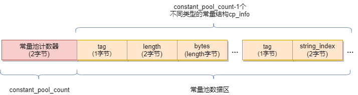

* 常量池计数器（constant_pool_count） - 由于常量的数量不固定，所以需要先放置两个字节来表示常量池容量计数值。图中示例代码的字节码前 10 个字节如下图所示，将十六进制的 24 转化为十进制值为 36，排除掉下标“0”，也就是说，这个类文件中共有 35 个常量。

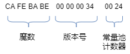

* 常量池数据区 - 数据区是由（constant_pool_count-1）个 cp_info 结构组成，一个 cp_info 结构对应一个常量。在字节码中共有 14 种类型的 cp_info，每种类型的结构都是固定的。

具体以 CONSTANT_utf8_info 为例。首先一个字节“tag”，它的值取自上图中对应项的 Tag，由于它的类型是 utf8_info，所以值为“01”。接下来两个字节标识该字符串的长度 Length，然后 Length 个字节为这个字符串具体的值。从字节码摘取一个 cp_info 结构，如下图所示。将它翻译过来后，其含义为：该常量类型为 utf8 字符串，长度为一字节，数据为“a”。

| 长度 | 名称 | 值 |
| - | - | - |
| 1字节 | tag | 01 表示 utf8 类型 |
| 2字节 | length | 该 utf8 字符串的长度 |
| length个字节 | bytes | length 个字节的具体数据 |

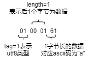

其他类型的 cp_info 结构不再赘述，整体结构大同小异，都是先通过 Tag 来标识类型，然后后续 n 个字节来描述长度和（或）数据。

先知其所以然，以后可以通过 javap -verbose xxx 命令，查看 JVM 反编译后的完整常量池，如下图所示。可以看到反编译结果将每一个 cp_info 结构的类型和值都很明确地呈现了出来。

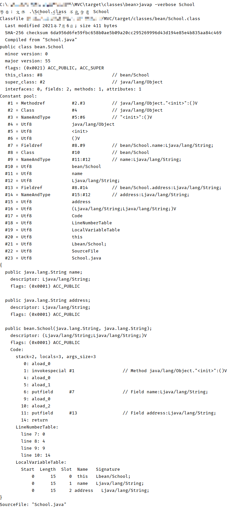

#### 访问标志

紧接着的 2 个字节代表访问标志，这个标志用于识别一些类或者接口的访问信息，描述该 Class 是类还是接口，以及是否被 public、abstract、final 等修饰符修饰。

JVM 规范规定了如下图的访问标志（Access_Flag）。需要注意的是，JVM 并没有穷举所有的访问标志，而是使用按位或操作来进行描述的，比如某个类的修饰符为 Public Final，则对应的访问修饰符的值为 ACC_PUBLIC | ACC_FINAL，即 0x0001 | 0x0010=0x0011。

#### 当前类名

访问标志后的 2 个字节，描述的是当前类的全限定名。这两个字节保存的值为常量池中的索引值，根据索引值就能在常量池中找到这个类的全限定名。

#### 父类名称

当前类名后的 2 个字节，描述父类的全限定名，同上，保存的也是常量池中的索引值。

#### 接口信息

父类名称后为 2 字节的接口计数器，描述了该类或父类实现的接口数量。紧接着的 n 个字节是所有接口名称的字符串常量的索引值。

#### 字段表

字段表用于描述类和接口中声明的变量，包含类级别的变量以及实例变量，但是不包含方法内部声明的局部变量。字段表也分为两部分，第一部分为两个字节，描述字段个数；第二部分是每个字段的详细信息 fields_info。字段表结构如下图所示：

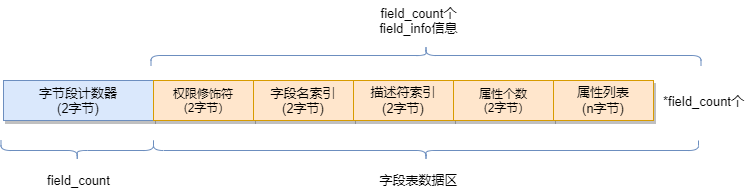

以字节码的字段表为例，如下图所示。其中字段的访问标志查图 9，0002 对应为 Private。通过索引下标在图 8 中常量池分别得到字段名为“a”，描述符为“I”（代表 int）。综上，就可以唯一确定出一个类中声明的变量 private int a。

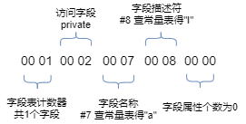

#### 方法表

字段表结束后为方法表，方法表也是由两部分组成，第一部分为两个字节描述方法的个数；第二部分为每个方法的详细信息。方法的详细信息较为复杂，包括方法的访问标志、方法名、方法的描述符以及方法的属性，如下图所示：

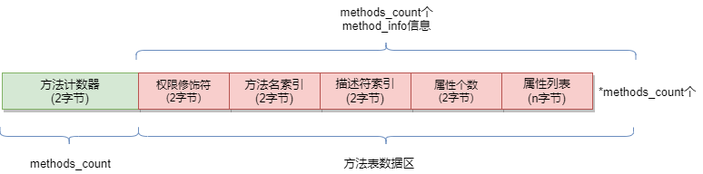

方法名和方法的描述符都是常量池中的索引值，可以通过索引值在常量池中找到。而“方法的属性”这一部分较为复杂，直接借助 javap -verbose 将其反编译为人可以读懂的信息进行解读，如下图所示。可以看到属性中包括以下三个部分：

“Code 区”：源代码对应的 JVM 指令操作码，在进行字节码增强时重点操作的就是“Code 区”这一部分。
“LineNumberTable”：行号表，将 Code 区的操作码和源代码中的行号对应，Debug 时会起到作用（源代码走一行，需要走多少个 JVM 指令操作码）。
“LocalVariableTable”：本地变量表，包含 This 和局部变量，之所以可以在每一个方法内部都可以调用 This，是因为 JVM 将 This 作为每一个方法的第一个参数隐式进行传入。当然，这是针对非 Static 方法而言。

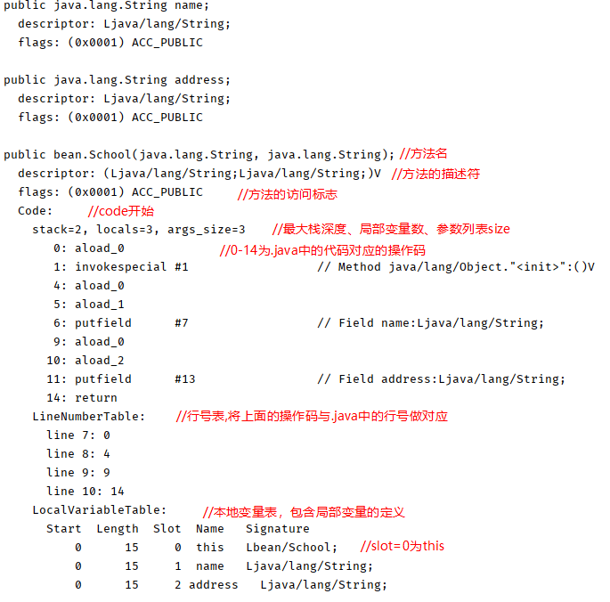

#### 附加属性表

字节码的最后一部分，该项存放了在该文件中类或接口所定义属性的基本信息。

### 字节码操作集合

在上图中，Code 区的红色编号 0 ～ 14，就是.java 中的方法源代码编译后让 JVM 真正执行的操作码。为了帮助人们理解，反编译后看到的是十六进制操作码所对应的助记符，十六进制值操作码与助记符的对应关系，以及每一个操作码的用处可以查看 Oracle 官方文档进行了解，在需要用到时进行查阅即可。

比如第一个助记符为 iconst_2，对应到字节码为 0x05，用处是将 int 值 2 压入操作数栈中。以此类推，对 0~17 的助记符理解后，就是完整的 `add()` 方法的实现。

### 操作数栈和字节码

JVM 的指令集是基于栈而不是寄存器，基于栈可以具备很好的跨平台性（因为寄存器指令集往往和硬件挂钩），但缺点在于，要完成同样的操作，基于栈的实现需要更多指令才能完成（因为栈只是一个 FILO 结构，需要频繁压栈出栈）。另外，由于栈是在内存实现的，而寄存器是在 CPU 的高速缓存区，相较而言，基于栈的速度要慢很多，这也是为了跨平台性而做出的牺牲。

上文所说的操作码或者操作集合，其实控制的就是这个 JVM 的操作数栈。

### 字节码工具

* Idea 插件 : [jclasslib](https://plugins.jetbrains.com/plugin/9248-jclasslib-bytecode-viewer)

代码编译后在菜单栏"View"中选择"Show Bytecode With jclasslib"，可以很直观地看到当前字节码文件的类信息、常量池、方法区等信息。

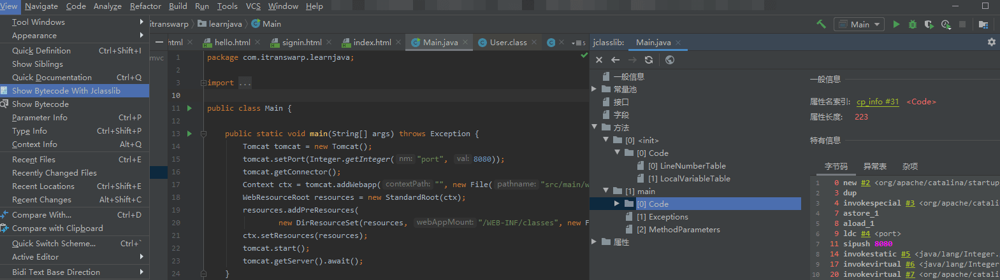

---

## 字节码增强

### Asm

对于需要手动操纵字节码的需求，可以使用 Asm，它可以直接生产 .class字节码文件，也可以在类被加载入 JVM 之前动态修改类行为。

Asm 的应用场景有 AOP（Cglib 就是基于 Asm）、热部署、修改其他 jar 包中的类等。当然，涉及到如此底层的步骤，实现起来也比较麻烦。

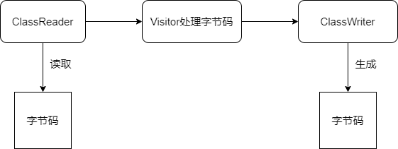

Asm 有两类 API：核心 API 和树形 API

#### 核心 API

Asm Core API 可以类比解析 XML 文件中的 SAX 方式，不需要把这个类的整个结构读取进来，就可以用流式的方法来处理字节码文件。好处是非常节约内存，但是编程难度较大。然而出于性能考虑，一般情况下编程都使用 Core API。在 Core API 中有以下几个关键类：
* ClassReader：用于读取已经编译好的 .class 文件。
* ClassWriter：用于重新构建编译后的类，如修改类名、属性以及方法，也可以生成新的类的字节码文件。
* 各种 Visitor 类：如上所述，CoreAPI 根据字节码从上到下依次处理，对于字节码文件中不同的区域有不同的 Visitor，比如用于访问方法的 MethodVisitor、用于访问类变量的 FieldVisitor、用于访问注解的 AnnotationVisitor 等。为了实现 AOP，重点要使用的是 MethodVisitor。

#### #树形 API

Asm Tree API 可以类比解析 XML 文件中的 DOM 方式，把整个类的结构读取到内存中，缺点是消耗内存多，但是编程比较简单。TreeApi 不同于 CoreAPI，TreeAPI 通过各种 Node 类来映射字节码的各个区域，类比 DOM 节点，就可以很好地理解这种编程方式。

### Javassist

利用 Javassist 实现字节码增强时，可以无须关注字节码刻板的结构，其优点就在于编程简单。直接使用 java 编码的形式，而不需要了解虚拟机指令，就能动态改变类的结构或者动态生成类。

其中最重要的是 ClassPool、CtClass、CtMethod、CtField 这四个类：

* `CtClass（compile-time class）` - 编译时类信息，它是一个 class 文件在代码中的抽象表现形式，可以通过一个类的全限定名来获取一个 CtClass 对象，用来表示这个类文件。
* `ClassPool` - 从开发视角来看，ClassPool 是一张保存 CtClass 信息的 HashTable，key 为类名，value 为类名对应的 CtClass 对象。当我们需要对某个类进行修改时，就是通过 pool.getCtClass("className")方法从 pool 中获取到相应的 CtClass。
* `CtMethod`、`CtField` - 这两个比较好理解，对应的是类中的方法和属性。

---

## Source & Reference

- https://dunwu.github.io/javacore/jvm/jvm-bytecode.html
