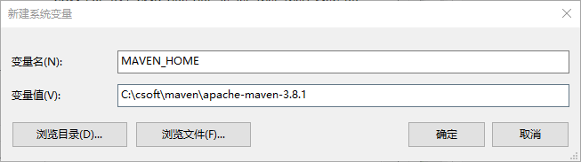
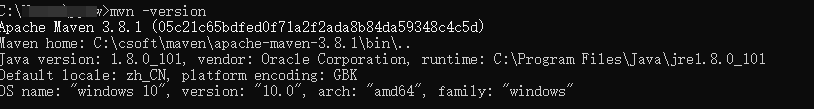
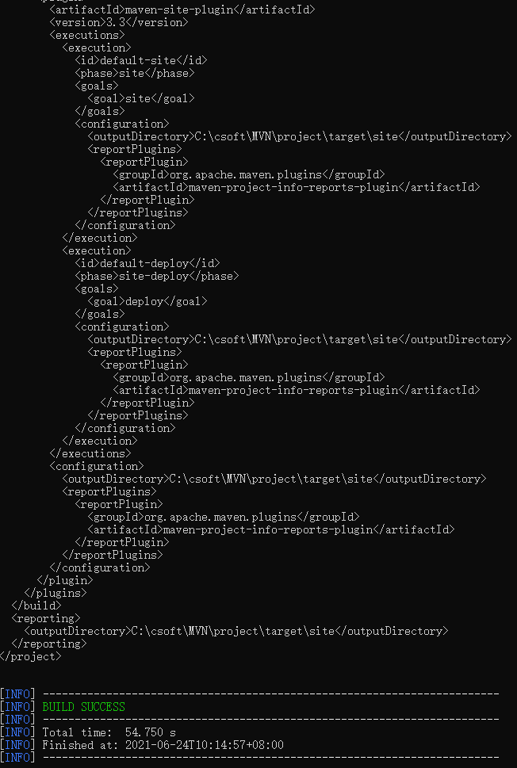
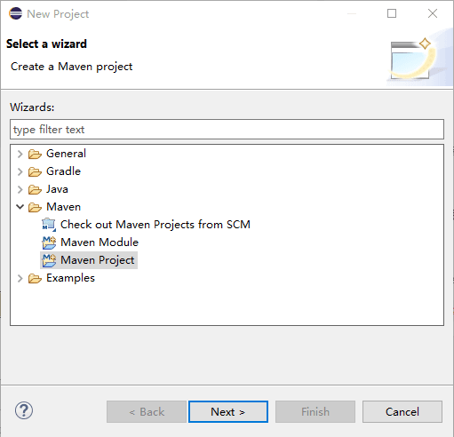
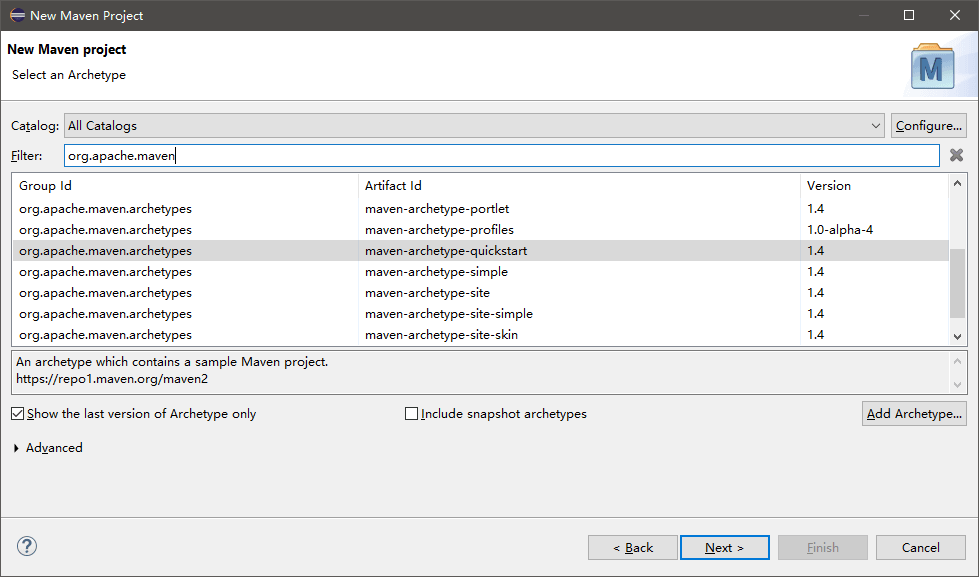
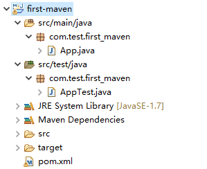
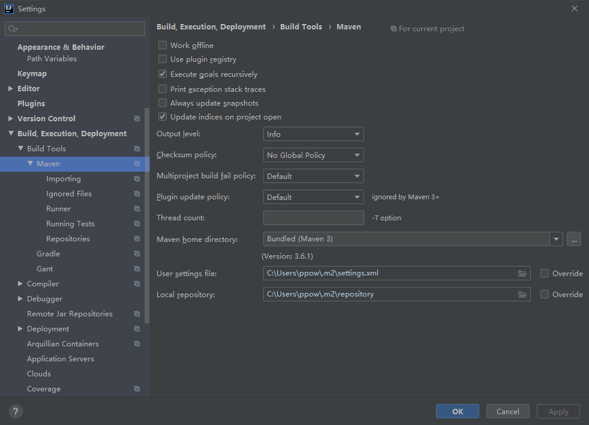

# Maven

---

## 简介

Maven 翻译为"专家"、"内行"，是 Apache 下的一个纯 Java 开发的开源项目。基于项目对象模型（缩写：POM）概念，Maven利用一个中央信息片断能管理一个项目的构建、报告和文档等步骤。

Maven 是一个项目管理工具，可以对 Java 项目进行构建、依赖管理。

Maven 也可被用于构建和管理各种项目，例如 C#，Ruby，Scala 和其他语言编写的项目。Maven 曾是 Jakarta 项目的子项目，现为由 Apache 软件基金会主持的独立 Apache 项目。

一个 Java 项目需要确定引入哪些依赖包。例如，如果我们需要用到 commons logging，我们就必须把 commons logging 的 jar 包放入 classpath。如果我们还需要 log4j，就需要把 log4j 相关的 jar 包都放到 classpath 中。这些就是依赖包的管理。

其次，我们要确定项目的目录结构。例如，src 目录存放 Java 源码，resources 目录存放配置文件，bin 目录存放编译生成的. class 文件。

此外，我们还需要配置环境，例如 JDK 的版本，编译打包的流程，当前代码的版本号。

最后，除了使用 Eclipse 这样的 IDE 进行编译外，我们还必须能通过命令行工具进行编译，才能够让项目在一个独立的服务器上编译、测试、部署。

这些工作难度不大，但是非常琐碎且耗时。如果每一个项目都自己搞一套配置，肯定会一团糟。我们需要的是一个标准化的 Java 项目管理和构建工具。

Maven 就是是专门为 Java 项目打造的管理和构建工具，它的主要功能有：
* 提供了一套标准化的项目结构；
* 提供了一套标准化的构建流程（编译，测试，打包，发布……）；
* 提供了一套依赖管理机制。

---

## Maven 特点

* 项目设置遵循统一的规则。
* 任意工程中共享。
* 依赖管理包括自动更新。
* 一个庞大且不断增长的库。
* 可扩展，能够轻松编写 Java 或脚本语言的插件。
* 只需很少或不需要额外配置即可即时访问新功能。
* `基于模型的构建` − Maven能够将任意数量的项目构建到预定义的输出类型中，如 JAR，WAR 或基于项目元数据的分发，而不需要在大多数情况下执行任何脚本。
* `项目信息的一致性站点` − 使用与构建过程相同的元数据，Maven 能够生成一个网站或PDF，包括您要添加的任何文档，并添加到关于项目开发状态的标准报告中。
* `发布管理和发布单独的输出` − Maven 将不需要额外的配置，就可以与源代码管理系统（如 Subversion 或 Git）集成，并可以基于某个标签管理项目的发布。它也可以将其发布到分发位置供其他项目使用。Maven 能够发布单独的输出，如 JAR，包含其他依赖和文档的归档，或者作为源代码发布。
* `向后兼容性` − 您可以很轻松的从旧版本 Maven 的多个模块移植到 Maven 3 中。
* 子项目使用父项目依赖时，正常情况子项目应该继承父项目依赖，无需使用版本号，
* `并行构建` − 编译的速度能普遍提高20 - 50 %。
* `更好的错误报告` − Maven 改进了错误报告，它为您提供了 Maven wiki 页面的链接，您可以点击链接查看错误的完整描述。

---

## 约定配置

Maven 提倡使用一个共同的标准目录结构，Maven 使用约定优于配置的原则，大家尽可能的遵守这样的目录结构。如下所示：

| 目录	| 目的 |
| - | - |
| ${basedir}	                        | 存放 pom.xml 和所有的子目录 |
| ${basedir}/src/main/java	            | 项目的 java 源代码 |
| ${basedir}/src/main/resources	        | 项目的资源，比如说 property 文件，springmvc.xml |
| ${basedir}/src/test/java	            | 项目的测试类，比如说 Junit 代码 |
| ${basedir}/src/test/resources	        | 测试用的资源 |
| ${basedir}/src/main/webapp/WEB-INF	| web 应用文件目录，web 项目的信息，比如存放 web.xml、本地图片、jsp 视图页面 |
| ${basedir}/target	                    | 打包输出目录 |
| ${basedir}/target/classes	            | 编译输出目录 |
| ${basedir}/target/test-classes	    | 测试编译输出目录 |
| Test.java	                            | Maven 只会自动运行符合该命名规则的测试类 |
| ~/.m2/repository	                    | Maven 默认的本地仓库目录位置 |

---

## Maven 环境配置

Maven 下载地址：http://maven.apache.org/download.cgi

下载包后解压

添加系统变量 MAVEN_HOME



编辑系统变量 Path，添加变量值：%MAVEN_HOME%\bin

输入 mvn -version，查看 Maven 的版本信息



---

## Maven 项目结构

一个使用 Maven 管理的普通的 Java 项目，它的目录结构默认如下：
```
a-maven-project
├── pom.xml
├── src
│   ├── main
│   │   ├── java
│   │   └── resources
│   └── test
│       ├── java
│       └── resources
└── target
```

项目的根目录 a-maven-project 是项目名，它有一个项目描述文件 pom.xml，存放 Java 源码的目录是 src/main/java，存放资源文件的目录是 src/main/resources，存放测试源码的目录是 src/test/java，存放测试资源的目录是 src/test/resources，最后，所有编译、打包生成的文件都放在 target 目录里。这些就是一个 Maven 项目的标准目录结构。

所有的目录结构都是约定好的标准结构，我们千万不要随意修改目录结构。使用标准结构不需要做任何配置，Maven 就可以正常使用。

最关键是项目描述文件 pom.xml

---

## Maven POM

POM(Project Object Model，项目对象模型) 是 Maven 工程的基本工作单元，是一个 XML 文件，包含了项目的基本信息，用于描述项目如何构建，声明项目依赖，等等。

执行任务或目标时，Maven 会在当前目录中查找 POM。它读取 POM，获取所需的配置信息，然后执行目标。

POM 中可以指定以下配置：
* 项目依赖
* 插件
* 执行目标
* 项目构建 profile
* 项目版本
* 项目开发者列表
* 相关邮件列表信息

所有 POM 文件都需要 project 元素和三个必需字段：groupId，artifactId，version。
* project	    工程的根标签。
* modelVersion	模型版本需要设置为 4.0。
* groupId	    这是工程组的标识。它在一个组织或者项目中通常是唯一的。例如，一个银行组织 com.bank.project 拥有和银行相关的项目。
* artifactId	这是工程的标识。它通常是工程的名称。例如，消费者银行。groupId 和 artifactId 一起定义了 artifact 在仓库中的位置。
* version       这是工程的版本号。在 artifact 的仓库中，它用来区分不同的版本。

```xml
<project xmlns = "http://maven.apache.org/POM/4.0.0"
    xmlns:xsi = "http://www.w3.org/2001/XMLSchema-instance"
    xsi:schemaLocation = "http://maven.apache.org/POM/4.0.0
    http://maven.apache.org/xsd/maven-4.0.0.xsd">

    <!-- 模型版本 -->
    <modelVersion>4.0.0</modelVersion>
    <!-- 公司或者组织的唯一标志，并且配置时生成的路径也是由此生成， 如com.bank.project，maven会将该项目打成的jar包放本地路径：/com/bank/project -->
    <groupId>com.bank.project</groupId>

    <!-- 项目的唯一ID，一个groupId下面可能多个项目，就是靠artifactId来区分的 -->
    <artifactId>project</artifactId>

    <!-- 版本号 -->
    <version>1.0</version>
</project>
```

groupId 类似于 Java 的包名，通常是公司或组织名称，artifactId 类似于 Java 的类名，通常是项目名称，再加上 version，一个 Maven 工程就是由 groupId，artifactId 和 version 作为唯一标识。我们在引用其他第三方库的时候，也是通过这 3 个变量确定。例如，依赖 commons-logging：
```xml
<dependency>
    <groupId>commons-logging</groupId>
    <artifactId>commons-logging</artifactId>
    <version>1.2</version>
</dependency>
```

使用 `<dependency>` 声明一个依赖后，Maven 就会自动下载这个依赖包并把它放到 classpath 中。

### Super POM

Super POM是 Maven 默认的 POM。所有的 POM 都继承自一个父 POM（无论是否显式定义了这个父 POM）。父 POM 包含了一些可以被继承的默认设置。因此，当 Maven 发现需要下载 POM 中的 依赖时，它会到 Super POM 中配置的默认仓库 http://repo1.maven.org/maven2 去下载。

Maven 使用 effective pom（Super pom 加上工程自己的配置）来执行相关的目标，它帮助开发者在 pom.xml 中做尽可能少的配置，当然这些配置可以被重写。

创建目录 MVN/project，在该目录下创建 pom.xml，内容如下：

在命令控制台，进入 MVN/project 目录，执行以下命令：
```
mvn help:effective-pom
```

Maven 将会开始处理并显示 effective-pom。



Maven 提供了大量的原型插件来创建工程，包括工程结构和 pom.xml。

---

## 依赖管理

如果我们的项目依赖第三方的 jar 包，例如 commons logging，那么问题来了：commons logging 发布的 jar 包在哪下载？

如果我们还希望依赖 log4j，那么使用 log4j 需要哪些 jar 包？

类似的依赖还包括：JUnit，JavaMail，MySQL 驱动等等，一个可行的方法是通过搜索引擎搜索到项目的官网，然后手动下载 zip 包，解压，放入 classpath。但是，这个过程非常繁琐。

Maven 解决了依赖管理问题。例如，我们的项目依赖 abc 这个 jar 包，而 abc 又依赖 xyz 这个 jar 包：
```
Sample Project -->  abc  -->  xyz
```
当我们声明了 abc 的依赖时，Maven 自动把 abc 和 xyz 都加入了我们的项目依赖，不需要我们自己去研究 abc 是否需要依赖 xyz。

因此，Maven 的第一个作用就是解决依赖管理。我们声明了自己的项目需要 abc，Maven 会自动导入 abc 的 jar 包，再判断出 abc 需要 xyz，又会自动导入 xyz 的 jar 包，这样，最终我们的项目会依赖 abc 和 xyz 两个 jar 包。

我们来看一个复杂依赖示例：

```xml
<dependency>
    <groupId>org.springframework.boot</groupId>
    <artifactId>spring-boot-starter-web</artifactId>
    <version>1.4.2.RELEASE</version>
</dependency>
```

当我们声明一个 spring-boot-starter-web 依赖时，Maven 会自动解析并判断最终需要大概二三十个其他依赖：

```
spring-boot-starter-web
  spring-boot-starter
    spring-boot
    sprint-boot-autoconfigure
    spring-boot-starter-logging
      logback-classic
        logback-core
        slf4j-api
      jcl-over-slf4j
        slf4j-api
      jul-to-slf4j
        slf4j-api
      log4j-over-slf4j
        slf4j-api
    spring-core
    snakeyaml
  spring-boot-starter-tomcat
    tomcat-embed-core
    tomcat-embed-el
    tomcat-embed-websocket
      tomcat-embed-core
  jackson-databind
  ...
```
如果我们自己去手动管理这些依赖是非常费时费力的，而且出错的概率很大。

### 依赖关系

Maven 定义了几种依赖关系，分别是 compile、test、runtime 和 provided：

| scope	        | 说明	                            | 示例 |
| - | - | - |
| compile	    | 编译时需要用到该 jar 包（默认）	        | commons-logging |
| test	        | 编译 Test 时需要用到该 jar 包	            | junit |
| runtime	    | 编译时不需要，但运行时需要用到      	    | mysql |
| provided	    | 编译时需要用到，但运行时由 JDK 或某个服务器提供	| servlet-api |

其中，默认的 compile 是最常用的，Maven 会把这种类型的依赖直接放入 classpath。

test 依赖表示仅在测试时使用，正常运行时并不需要。最常用的 test 依赖就是 JUnit：

```xml
<dependency>
    <groupId>org.junit.jupiter</groupId>
    <artifactId>junit-jupiter-api</artifactId>
    <version>5.3.2</version>
    <scope>test</scope>
</dependency>
```

runtime 依赖表示编译时不需要，但运行时需要。最典型的 runtime 依赖是 JDBC 驱动，例如 MySQL 驱动：

```xml
<dependency>
    <groupId>mysql</groupId>
    <artifactId>mysql-connector-java</artifactId>
    <version>5.1.48</version>
    <scope>runtime</scope>
</dependency>
```

provided 依赖表示编译时需要，但运行时不需要。最典型的 provided 依赖是 Servlet API，编译的时候需要，但是运行时，Servlet 服务器内置了相关的 jar，所以运行期不需要：

```xml
<dependency>
    <groupId>javax.servlet</groupId>
    <artifactId>javax.servlet-api</artifactId>
    <version>4.0.0</version>
    <scope>provided</scope>
</dependency>
```

Maven 如何知道从何处下载所需的依赖？也就是相关的 jar 包？答案是 Maven 维护了一个中央仓库（repo1.maven.org），所有第三方库将自身的 jar 以及相关信息上传至中央仓库，Maven 就可以从中央仓库把所需依赖下载到本地。

Maven 并不会每次都从中央仓库下载 jar 包。一个 jar 包一旦被下载过，就会被 Maven 自动缓存在本地目录（用户主目录的. m2 目录），所以，除了第一次编译时因为下载需要时间会比较慢，后续过程因为有本地缓存，并不会重复下载相同的 jar 包。

### 唯一ID

对于某个依赖，Maven 只需要 3 个变量即可唯一确定某个 jar 包：
* groupId：属于组织的名称，类似 Java 的包名；
* artifactId：该 jar 包自身的名称，类似 Java 的类名；
* version：该 jar 包的版本。

通过上述 3 个变量，即可唯一确定某个 jar 包。Maven 通过对 jar 包进行 PGP 签名确保任何一个 jar 包一经发布就无法修改。修改已发布 jar 包的唯一方法是发布一个新版本。

因此，某个 jar 包一旦被 Maven 下载过，即可永久地安全缓存在本地。

注：只有以 -SNAPSHOT 结尾的版本号会被 Maven 视为开发版本，开发版本每次都会重复下载，这种 SNAPSHOT 版本只能用于内部私有的 Maven repo，公开发布的版本不允许出现 SNAPSHOT。

---

## Maven镜像

国内用户可以使用阿里云提供的 Maven 镜像仓库。使用 Maven 镜像仓库需要一个配置，进入maven 的conf目录，编辑 settings.xml 配置文件，内容如下：

```xml
<mirror>
  <id>aliyunmaven</id>
  <mirrorOf>*</mirrorOf>
  <name>阿里云公共仓库</name>
  <url>https://maven.aliyun.com/repository/public</url>
</mirror>
```

配置镜像仓库后，Maven的下载速度就会非常快。

如果是 idea 自带的,根据 idea 里的配置来改

具体可以参考阿里云的教程
- https://developer.aliyun.com/mvn/guide

---

## 命令行编译

在命令中，进入到 pom.xml 所在目录，输入以下命令：

```
mvn clean package
```

如果一切顺利，即可在 target 目录下获得编译后自动打包的 jar。

---

## lifecycle

### phase

Maven 的生命周期由一系列阶段（phase）构成，以内置的生命周期 default 为例，它包含以下 phase：
* validate
* initialize
* generate-sources
* process-sources
* generate-resources
* process-resources
* compile
* process-classes
* generate-test-sources
* process-test-sources
* generate-test-resources
* process-test-resources
* test-compile
* process-test-classes
* test
* prepare-package
* package
* pre-integration-test
* integration-test
* post-integration-test
* verify
* install
* deploy

如果我们运行 mvn package，Maven 就会执行 default 生命周期，它会从开始一直运行到 package 这个 phase 为止：
* validate
* ...
* package

如果我们运行 mvn compile，Maven 也会执行 default 生命周期，但这次它只会运行到 compile，即以下几个 phase：
* validate
* ...
* compile

Maven 另一个常用的生命周期是 clean，它会执行 3 个 phase：
* pre-clean
* clean （注意这个clean不是lifecycle而是phase）
* post-clean

所以，我们使用 mvn 这个命令时，后面的参数是 phase，Maven 自动根据生命周期运行到指定的 phase。

更复杂的例子是指定多个 phase，例如，运行 mvn clean package，Maven 先执行 clean 生命周期并运行到 clean 这个 phase，然后执行 default 生命周期并运行到 package 这个 phase，实际执行的 phase 如下：
* pre-clean
* clean （注意这个 clean 是 phase）
* validate
* ...
* package

在实际开发过程中，经常使用的命令有：
```
mvn clean           清理所有生成的 class 和 jar；
mvn clean compile   先清理，再执行到 compile；
mvn clean test      先清理，再执行到 test，因为执行 test 前必须执行 compile，所以这里不必指定 compile；
mvn clean package   先清理，再执行到 package。
```
大多数 phase 在执行过程中，因为我们通常没有在 pom.xml 中配置相关的设置，所以这些 phase 什么事情都不做。

经常用到的 phase 其实只有几个：
* clean：清理
* compile：编译
* test：运行测试
* package：打包

### Goal

| 执行的 Phase	    | 对应执行的 Goal |
| - | - |
| compile	        | compiler:compile |
| test	            | compiler:testCompile && surefire:test |

goal 的命名总是 abc:xyz 这种形式。

lifecycle 相当于 Java 的 package，它包含一个或多个 phase；

phase 相当于 Java 的 class，它包含一个或多个 goal；

goal 相当于 class 的 method，它其实才是真正干活的。

大多数情况，我们只要指定 phase，就默认执行这些 phase 默认绑定的 goal，只有少数情况，我们可以直接指定运行一个 goal，例如，启动 Tomcat 服务器：
```
mvn tomcat:run
```

---

## 插件

使用 Maven 构建项目就是执行 lifecycle，执行到指定的 phase 为止。每个 phase 会执行自己默认的一个或多个 goal。goal 是最小任务单元。

我们以 compile 这个 phase 为例，如果执行：

```
mvn compile
```

Maven 将执行 compile 这个 phase，这个 phase 会调用 compiler 插件执行关联的 compiler:compile 这个 goal。

实际上，执行每个 phase，都是通过某个插件（plugin）来执行的，Maven 本身其实并不知道如何执行 compile，它只是负责找到对应的 compiler 插件，然后执行默认的 compiler:compile 这个 goal 来完成编译。

所以，使用 Maven，实际上就是配置好需要使用的插件，然后通过 phase 调用它们。

Maven已经内置了一些常用的标准插件：

| 插件名称	    | 对应执行的phase |
| - | - |
| clean	        | clean |
| compiler	    | compile |
| surefire	    | test |
| jar	        | package |

---

## 模块管理

在软件开发中，把一个大项目分拆为多个模块是降低软件复杂度的有效方法：

对于 Maven 工程来说，原来是一个大项目，现在可以分拆成 3 个模块：

```
mutiple-project
├── module-a
│   ├── pom.xml
│   └── src
├── module-b
│   ├── pom.xml
│   └── src
└── module-c
    ├── pom.xml
    └── src
```

如果模块 A 和模块 B 的 pom.xml 高度相似，那么，我们可以提取出共同部分作为 parent：

```
multiple-project
├── pom.xml
├── parent
│   └── pom.xml
├── module-a
│   ├── pom.xml
│   └── src
├── module-b
│   ├── pom.xml
│   └── src
└── module-c
    ├── pom.xml
    └── src
```

模块 B、模块 C 都可以直接从 parent 继承，大幅简化了 pom.xml 的编写。

如果模块 A 依赖模块 B，则模块 A 需要模块 B 的 jar 包才能正常编译，我们需要在模块 A 中引入模块 B

```xml
    ...
    <dependencies>
        <dependency>
            <groupId>com.itranswarp.learnjava</groupId>
            <artifactId>module-b</artifactId>
            <version>1.0</version>
        </dependency>
    </dependencies>
```

最后，在编译的时候，需要在根目录创建一个 pom.xml 统一编译：

```xml
<project xmlns="http://maven.apache.org/POM/4.0.0"
    xmlns:xsi="http://www.w3.org/2001/XMLSchema-instance"
    xsi:schemaLocation="http://maven.apache.org/POM/4.0.0 http://maven.apache.org/maven-v4_0_0.xsd">

    <modelVersion>4.0.0</modelVersion>
    <groupId>com.itranswarp.learnjava</groupId>
    <artifactId>build</artifactId>
    <version>1.0</version>
    <packaging>pom</packaging>
    <name>build</name>

    <modules>
        <module>parent</module>
        <module>module-a</module>
        <module>module-b</module>
        <module>module-c</module>
    </modules>
</project>
```

这样，在根目录执行 mvn clean package 时，Maven 根据根目录的 pom.xml 找到包括 parent 在内的共 4 个 `<module>`，一次性全部编译。

---

## eclipse使用maven

### 安装插件

从 Eclipse Marketplace 上获取 m2eclipse 并安装：

首先要在 Eclipse 中安装插件：在 Help->install new software, 输入下面地址 http://download.eclipse.org/technology/m2e/releases

像安装其他插件那样一路下一步就OK了。

### 配置插件

Preference --> maven

可以设置 Installations 和 User Setting

### 创建一个maven项目

new 一个 project ,选择 Maven Project



选择默认的工程位置

创建工程，这里可以选择 org.apache.maven.archetype



填写相关的groupId artifactId version等信息

点击完成就创建好了一个简单的maven工程。

### 目录结构

创建完毕后,目录结构如下



* pom.xml：用于定义或者添加 jar 包的依赖
* src-main：用于存放 java 源文件
* src-test：用于存放测试用例。

也许工程下还会出现 target 文件夹，这个是用来生成对应的 class 文件或发布的 jar 包。

### 常见报错

**XXX中没有主清单属性**

打包后的 jar 文件中的 MANIFEST.MF 缺少项目启动项，即没有 Main-Class 和 Start-Class

pom.xml 添加插件即可
```xml
		<plugin>
		    <groupId>org.apache.maven.plugins</groupId>
		    <artifactId>maven-jar-plugin</artifactId>
		    <version>3.0.2</version>
		    <configuration>
		        <archive>
		            <manifest>
		                <addClasspath>true</addClasspath>
		                <mainClass>com.test.first_maven.App</mainClass> <!-- 此处为主入口-->
		            </manifest>
		        </archive>
		    </configuration>
		</plugin>
```

---

## idea 使用 maven

setting --> Build,Execution,Deployment --> Build Tools --> Maven



---

## POM 文件样本

```xml
<?xml version="1.0" encoding="UTF-8"?>
<project xmlns="http://maven.apache.org/POM/4.0.0"
         xmlns:xsi="http://www.w3.org/2001/XMLSchema-instance"
         xsi:schemaLocation="http://maven.apache.org/POM/4.0.0 http://maven.apache.org/xsd/maven-4.0.0.xsd">
    <modelVersion>4.0.0</modelVersion>

    <groupId>BETA-Reptile</groupId>
    <artifactId>BETA-P</artifactId>
    <version>1.0-SNAPSHOT</version>
    <properties>
        <argLine>-Dfile.encoding=UTF-8</argLine>
        <project.build.sourceEncoding>UTF-8</project.build.sourceEncoding>
    </properties>
    <build>
        <plugins>
            <plugin>
                <groupId>org.apache.maven.plugins</groupId>
                <artifactId>maven-compiler-plugin</artifactId>
                <version>3.8.1</version>
                <configuration>
                    <source>1.8</source>
                    <target>1.8</target>
                </configuration>
            </plugin>
            <plugin>
                <groupId>org.apache.maven.plugins</groupId>
                <artifactId>maven-shade-plugin</artifactId>
                <version>1.2.1</version>
                <executions>
                    <execution>
                        <phase>package</phase>
                        <goals>
                            <goal>shade</goal>
                        </goals>
                        <configuration>
                            <transformers>
                                <transformer implementation="org.apache.maven.plugins.shade.resource.ManifestResourceTransformer">
                                    <mainClass>[主类]</mainClass>
                                </transformer>
                            </transformers>
                        </configuration>
                    </execution>
                </executions>
            </plugin>
        </plugins>
    </build>
    <dependencies>
        <dependency>
            <groupId>mysql</groupId>
            <artifactId>mysql-connector-java</artifactId>
            <version>5.1.47</version>
            <scope>runtime</scope>
        </dependency>
    </dependencies>
</project>
```

---

### JAVAFX

```xml
将布局 fxml 文件放在 target 文件夹中

 <build>
	<resources>
		<resource>
			<!-- 这里是放在 src/main/java-->
			<directory>src/main/java</directory>
			<includes>
				<include>**/*.properties</include>
				<include>**/*.fxml</include>
				<include>**/fxml/*.fxml</include>
				<!-- 如果想要弄个包名专门放fxml文件，像上一行这样添加设置 -->
				<!-- 之后，使用getResource("fxml/xx.fxml")这样子 -->
			</includes>
			<filtering>false</filtering>
		</resource>
	</resources>
</build>
```

---

## SpringBoot 打包插件

```xml
 <build>
    <plugins>
        <plugin>
            <groupId>org.springframework.boot</groupId>
            <artifactId>spring-boot-marven-plugin</artifactId>
        <plugin>
    <plugins>
 <build>

 <plugin>
    <groupId>org.springframework.boot</groupId>
    <artifactId>spring-boot-maven-plugin</artifactId>
    <version>2.3.7.RELEASE</version>
    <configuration>
        <mainClass>code.landgrey.Application</mainClass>
    </configuration>
    <executions>
        <execution>
            <id>repackage</id>
            <goals>
                <goal>repackage</goal>
            </goals>
        </execution>
    </executions>
</plugin>
```

---

## idea marven 添加本地 jar 到本地仓库

```
mvn install:install-file -Dfile=<Jar包的地址>
           -DgroupId=<Jar包的GroupId>
           -DartifactId=<Jar包的引用名称>
           -Dversion=<Jar包的版本>
           -Dpackaging=<Jar的打包方式>

mvn install:install-file -Dfile=ojdbc8.jar -DgroupId=com.github.noraui -DartifactId=ojdbc8  -Dversion=12.2.0.1 -Dpackaging=jar
```

---

## maven 打包加入本地 jar

我们需要将本地 jar 也加入到 pom.xml 的依赖配置项中，而本地 jar 最好是放在项目路径下，比如 lib 目录。

在 pom.xml 配置文件中增加一个 dependency 的配置，groupId,artifactId,version 均随意指定，因为最终起决定作用的是 scope 属性以及 systemPath 属性。

```xml
<dependency>
    <groupId>asnrt</groupId>
    <artifactId>javase</artifactId>
    <version>3.14.15</version>
    <scope>system</scope>
    <systemPath>${project.basedir}/lib/asnrt.jar</systemPath>
</dependency>
```

只需要这么配置，我们进行 mvn package 的时候，就不会报错，而且打出的 jar 包直接运行也不会报错。

本地运行没有报错，是有个警告，构建成功，放到 gitlab，自动构建，最后运行，出现了以下警告：

```
[WARNING] Some problems were encountered while building the effective model for com.huali.mec:mec-tcp-receiver:jar:1.0.0
[WARNING] 'dependencies.dependency.systemPath' for asnrt:javase:jar should not point at files within the project directory, ${project.basedir}/lib/asnrt.jar will be unresolvable by dependent projects @ line 99, column 17
```
意思是不能使用项目目录中的 jar，也有人遇到了这样的问题：https://www.phpsong.com/3536.html，根据他的提示，需要将 `${project.basedir}` 改为 `${pom.basedir}` 。

---

## Source & Reference

- https://www.liaoxuefeng.com/wiki/1252599548343744/1309301146648610
- https://www.runoob.com/maven/maven-tutorial.html
- https://www.cnblogs.com/xdp-gacl/p/3498271.html
- https://blog.csdn.net/u012052268/article/details/78916196
- https://blog.csdn.net/banjing_1993/article/details/83073210
- https://blog.csdn.net/qq_32588349/article/details/51461182
