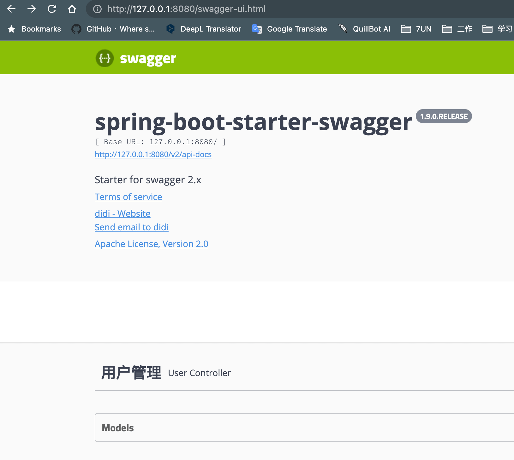
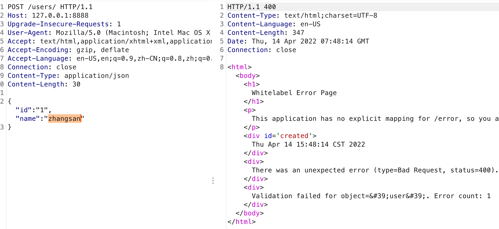
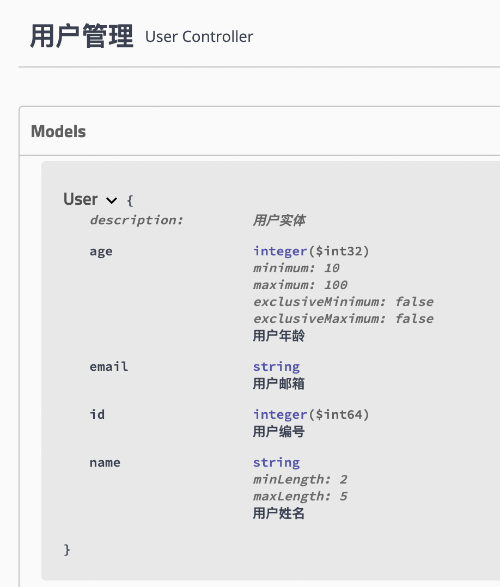
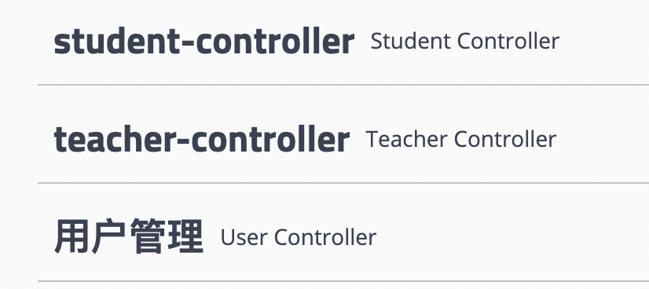
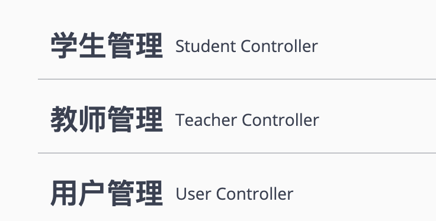
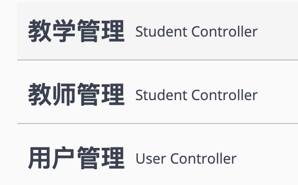
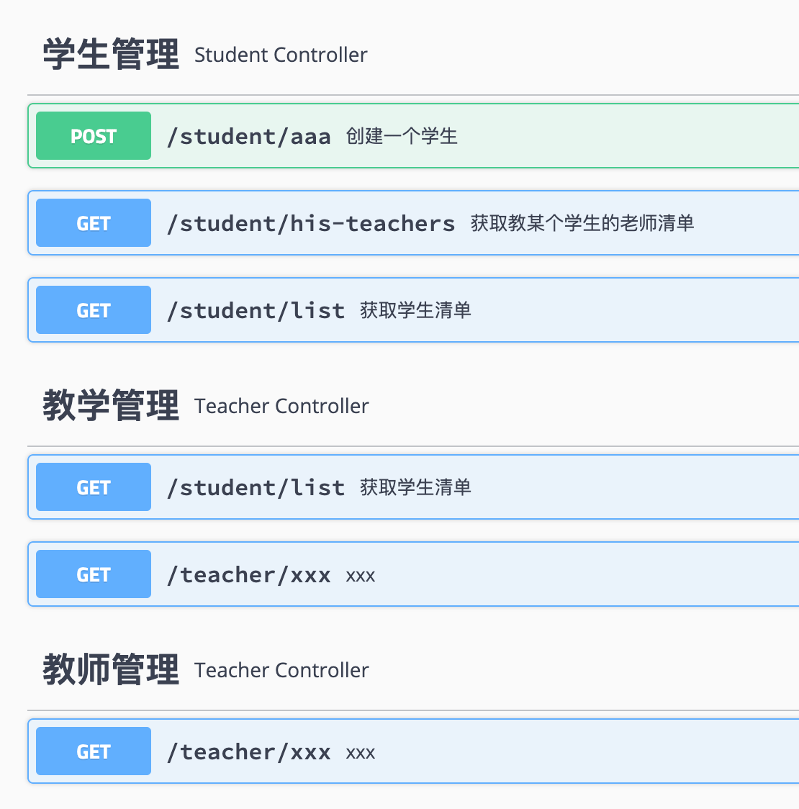
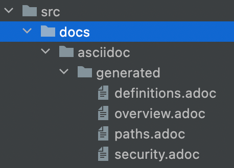
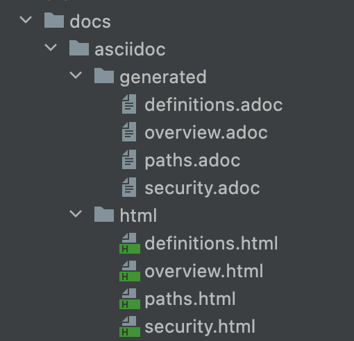
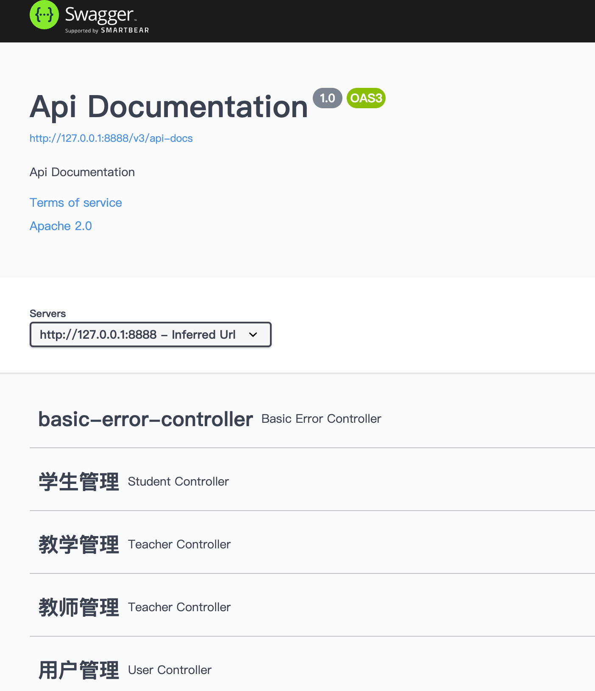

# API开发

---

## 构建 RESTful API 与单元测试

回顾在入门案例中使用的 @Controller、@RestController、@RequestMapping 注解。
- @Controller：修饰 class，用来创建处理 http 请求的对象
- @RestController：Spring4 之后加入的注解，原来在 @Controller 中返回 json 需要 @ResponseBody 来配合，如果直接用 @RestController 替代 @Controller 就不需要再配置 @ResponseBody，默认返回 json 格式
- @RequestMapping：配置 url 映射。现在更多的也会直接用以 Http Method 直接关联的映射注解来定义，比如：GetMapping、PostMapping、DeleteMapping、PutMapping 等

下面我们通过使用 Spring MVC 来实现一组对 User 对象操作的 RESTful API，配合注释详细说明在 Spring MVC 中如何映射 HTTP 请求、如何传参、如何编写单元测试。

RESTful API具体设计如下：
| 请求类型 | URL | 功能说明 |
| - | - | - |
| GET | /users | 查询用户列表 |
| POST | /users | 创建一个用户 |
| GET | /users/id | 根据 id 查询一个用户 |
| PUT | /users/id | 根据 id 更新一个用户 |
| DELETE | /users/id | 根据 id 删除一个用户 |

定义 User 实体
```java
@Data
public class User {

    private Long id;
    private String name;
    private Integer age;

}
```

注意：相比 1.x 版本中自定义 set 和 get 函数的方式，这里使用 @Data 注解可以实现在编译器自动添加 set 和 get 函数的效果。该注解是 lombok 提供的，只需要在 pom 中引入加入下面的依赖就可以支持：
```xml
<dependency>
    <groupId>org.projectlombok</groupId>
    <artifactId>lombok</artifactId>
</dependency>
```

实现对 User 对象的操作接口
```java
@RestController
@RequestMapping(value = "/users")     // 通过这里配置使下面的映射都在/users下
public class UserController {

    // 创建线程安全的Map，模拟users信息的存储
    static Map<Long, User> users = Collections.synchronizedMap(new HashMap<Long, User>());

    /**
     * 处理"/users/"的GET请求，用来获取用户列表
     *
     * @return
     */
    @GetMapping("/")
    public List<User> getUserList() {
        // 还可以通过@RequestParam从页面中传递参数来进行查询条件或者翻页信息的传递
        List<User> r = new ArrayList<User>(users.values());
        return r;
    }

    /**
     * 处理"/users/"的POST请求，用来创建User
     *
     * @param user
     * @return
     */
    @PostMapping("/")
    public String postUser(@RequestBody User user) {
        // @RequestBody注解用来绑定通过http请求中application/json类型上传的数据
        users.put(user.getId(), user);
        return "success";
    }

    /**
     * 处理"/users/{id}"的GET请求，用来获取url中id值的User信息
     *
     * @param id
     * @return
     */
    @GetMapping("/{id}")
    public User getUser(@PathVariable Long id) {
        // url中的id可通过@PathVariable绑定到函数的参数中
        return users.get(id);
    }

    /**
     * 处理"/users/{id}"的PUT请求，用来更新User信息
     *
     * @param id
     * @param user
     * @return
     */
    @PutMapping("/{id}")
    public String putUser(@PathVariable Long id, @RequestBody User user) {
        User u = users.get(id);
        u.setName(user.getName());
        u.setAge(user.getAge());
        users.put(id, u);
        return "success";
    }

    /**
     * 处理"/users/{id}"的DELETE请求，用来删除User
     *
     * @param id
     * @return
     */
    @DeleteMapping("/{id}")
    public String deleteUser(@PathVariable Long id) {
        users.remove(id);
        return "success";
    }

}
```

这里相较 1.x 版本，用更细化的 `@GetMapping` 、`@PostMapping` 等系列注解替换了以前的 `@RequestMaping` 注解；另外，还使用 `@RequestBody` 替换了 `@ModelAttribute` 的参数绑定。

至此，我们通过引入 web 模块（没有做其他的任何配置），就可以轻松利用 Spring MVC 的功能，以非常简洁的代码完成了对 User 对象的 RESTful API 的创建以及单元测试的编写。其中同时介绍了 Spring MVC 中最为常用的几个核心注解：@RestController,RequestMapping 以及一些参数绑定的注解：@PathVariable,@RequestBody 等。

---

## 使用 Swagger

随着前后端分离架构和微服务架构的流行，我们使用 Spring Boot 来构建 RESTful API 项目的场景越来越多。通常我们的一个 RESTful API 就有可能要服务于多个不同的开发人员或开发团队：IOS 开发、Android 开发、Web 开发甚至其他的后端服务等。为了减少与其他团队平时开发期间的频繁沟通成本，传统做法就是创建一份 RESTful API 文档来记录所有接口细节，然而这样的做法有以下几个问题：
- 由于接口众多，并且细节复杂（需要考虑不同的 HTTP 请求类型、HTTP 头部信息、HTTP 请求内容等），高质量地创建这份文档本身就是件非常吃力的事，下游的抱怨声不绝于耳。
- 随着时间推移，不断修改接口实现的时候都必须同步修改接口文档，而文档与代码又处于两个不同的媒介，除非有严格的管理机制，不然很容易导致不一致现象。

为了解决上面这样的问题，可以使用 Swagger2，它可以轻松的整合到 Spring Boot 中，并与 Spring MVC 程序配合组织出强大 RESTful API 文档。它既可以减少我们创建文档的工作量，同时说明内容又整合入实现代码中，让维护文档和修改代码整合为一体，可以让我们在修改代码逻辑的同时方便的修改文档说明。另外 Swagger2 也提供了强大的页面测试功能来调试每个 RESTful API。

首先，需要一个 Spring Boot 实现的 RESTful API 工程, 可以用上面的内容

整合 Swagger2, 添加 swagger-spring-boot-starter 依赖
- https://github.com/SpringForAll/spring-boot-starter-swagger

在 pom.xml 中加入依赖，具体如下：
```xml
<dependency>
    <groupId>com.spring4all</groupId>
    <artifactId>swagger-spring-boot-starter</artifactId>
    <version>1.9.0.RELEASE</version>
</dependency>
```

应用主类中添加 @EnableSwagger2Doc 注解，具体如下
```java
@EnableSwagger2Doc
@SpringBootApplication
public class testApplication {

    public static void main(String[] args) {
        SpringApplication.run(testApplication.class, args);
    }

}
```

application.properties 中配置文档相关内容，比如
```conf
swagger.title=spring-boot-starter-swagger
swagger.description=Starter for swagger 2.x
swagger.version=1.4.0.RELEASE
swagger.license=Apache License, Version 2.0
swagger.licenseUrl=https://www.apache.org/licenses/LICENSE-2.0.html
swagger.termsOfServiceUrl=https://github.com/dyc87112/spring-boot-starter-swagger
swagger.contact.name=test
swagger.contact.url=http://blog.test.com
swagger.contact.email=test@qq.com
swagger.base-package=com.test
swagger.base-path=/**
```

各参数配置含义如下：
- swagger.title：标题
- swagger.description：描述
- swagger.version：版本
- swagger.license：许可证
- swagger.licenseUrl：许可证URL
- swagger.termsOfServiceUrl：服务条款URL
- swagger.contact.name：维护人
- swagger.contact.url：维护人URL
- swagger.contact.email：维护人email
- swagger.base-package：swagger扫描的基础包，默认：全扫描
- swagger.base-path：需要处理的基础URL规则，默认：/**

启动应用，访问：http://localhost:8080/swagger-ui.html



如果启动失败可以看下这几个链接,大部分情况是 spring boot 版本问题
- https://github.com/springfox/springfox/issues/3791
- https://gitee.com/didispace/SpringBoot-Learning/tree/master/2.x/chapter2-2
- https://cloud.tencent.com/developer/article/1815129
- https://www.cnblogs.com/rainbow70626/p/15680184.html

**添加文档内容**

在整合完 Swagger 之后，在 http://localhost:8080/swagger-ui.html 页面中可以看到，关于各个接口的描述还都是英文或遵循代码定义的名称产生的。这些内容对用户并不友好，所以我们需要自己增加一些说明来丰富文档内容。如下所示，我们通过 @Api，@ApiOperation 注解来给 API 增加说明、通过 @ApiImplicitParam、@ApiModel、@ApiModelProperty 注解来给参数增加说明。
```java
@Api(tags = "用户管理")
@RestController
@RequestMapping(value = "/users")     // 通过这里配置使下面的映射都在/users下
public class UserController {

    // 创建线程安全的Map，模拟users信息的存储
    static Map<Long, User> users = Collections.synchronizedMap(new HashMap<>());

    @GetMapping("/")
    @ApiOperation(value = "获取用户列表")
    public List<User> getUserList() {
        List<User> r = new ArrayList<>(users.values());
        return r;
    }

    @PostMapping("/")
    @ApiOperation(value = "创建用户", notes = "根据User对象创建用户")
    public String postUser(@RequestBody User user) {
        users.put(user.getId(), user);
        return "success";
    }

    @GetMapping("/{id}")
    @ApiOperation(value = "获取用户详细信息", notes = "根据url的id来获取用户详细信息")
    public User getUser(@PathVariable Long id) {
        return users.get(id);
    }
    @PutMapping("/{id}")
    @ApiImplicitParam(paramType = "path", dataType = "Long", name = "id", value = "用户编号", required = true, example = "1")
    @ApiOperation(value = "更新用户详细信息", notes = "根据url的id来指定更新对象，并根据传过来的user信息来更新用户详细信息")
    public String putUser(@PathVariable Long id, @RequestBody User user) {
        User u = users.get(id);
        u.setName(user.getName());
        u.setAge(user.getAge());
        users.put(id, u);
        return "success";
    }

    @DeleteMapping("/{id}")
    @ApiOperation(value = "删除用户", notes = "根据url的id来指定删除对象")
    public String deleteUser(@PathVariable Long id) {
        users.remove(id);
        return "success";
    }

}

@Data
@ApiModel(description="用户实体")
public class User {

    @ApiModelProperty("用户编号")
    private Long id;
    @ApiModelProperty("用户姓名")
    private String name;
    @ApiModelProperty("用户年龄")
    private Integer age;

}
```

完成上述代码添加后，启动Spring Boot程序，访问：http://localhost:8080/swagger-ui.html，就能看到下面这样带中文说明的文档了

---

## JSR-303 实现请求参数校验

请求参数的校验是很多新手开发非常容易犯错，或存在较多改进点的常见场景。比较常见的问题主要表现在以下几个方面：
- 仅依靠前端框架解决参数校验，缺失服务端的校验。这种情况常见于需要同时开发前后端的时候，虽然程序的正常使用不会有问题，但是开发者忽略了非正常操作。比如绕过前端程序，直接模拟客户端请求，这时候就会突然在前端预设的各种限制，直击各种数据访问接口，使得我们的系统存在安全隐患。
- 大量地使用if/else语句嵌套实现，校验逻辑晦涩难通，不利于长期维护。

所以，针对上面的问题，建议服务端开发在实现接口的时候，对于请求参数必须要有服务端校验以保障数据安全与稳定的系统运行。同时，对于参数的校验实现需要足够优雅，要满足逻辑易读、易维护的基本特点。

**什么是 JSR-303**

JSR 是 Java Specification Requests 的缩写，意思是 Java 规范提案。是指向 JCP(Java Community Process) 提出新增一个标准化技术规范的正式请求。任何人都可以提交 JSR，以向 Java 平台增添新的 API 和服务。JSR 已成为 Java 界的一个重要标准。

**JSR-303定义的是什么标准**

JSR-303 是 JAVA EE 6 中的一项子规范，叫做 Bean Validation，Hibernate Validator 是 Bean Validation 的参考实现 . Hibernate Validator 提供了 JSR 303 规范中所有内置 constraint 的实现，除此之外还有一些附加的 constraint。

例如:
- @AssertFalse	被注释的元素必须为 false
- @AssertTrue	被注释的元素必须为 true
- @DecimalMax	被注释的元素必须是一个数字，其值必须小于等于指定的最大值
- @DecimalMin	被注释的元素必须是一个数字，其值必须大于等于指定的最小值

等

在JSR-303的标准之下，可以通过这些注解，优雅的定义各个请求参数的校验。

**手动实现参数的校验**

拿任何一个使用Spring Boot 2.x构建的提供RESTful API的项目作为基础

先来做一个简单的例子，比如：定义字段不能为Null

在要校验的字段上添加上@NotNull注解
```java
@Data
@ApiModel(description="用户实体")
public class User {

    @ApiModelProperty("用户编号")
    private Long id;

    @NotNull
    @ApiModelProperty("用户姓名")
    private String name;

    @NotNull
    @ApiModelProperty("用户年龄")
    private Integer age;

}
```

在需要校验的参数实体前添加 @Valid 注解
```java
@PostMapping("/")
@ApiOperation(value = "创建用户", notes = "根据User对象创建用户")
public String postUser(@Valid @RequestBody User user) {
    users.put(user.getId(), user);
    return "success";
}
```

完成上面配置之后，启动应用，并用POST请求访问localhost:8080/users/接口，body中不包含 age 参数



**尝试一些其他校验**

在完成了上面的例子之后，我们还可以增加一些校验规则，比如：校验字符串的长度、校验数字的大小、校验字符串格式是否为邮箱等。下面我们就来定义一些复杂的校验定义，比如：
```java
@Data
@ApiModel(description="用户实体")
public class User {

    @ApiModelProperty("用户编号")
    private Long id;

    @NotNull
    @Size(min = 2, max = 5)
    @ApiModelProperty("用户姓名")
    private String name;

    @NotNull
    @Max(100)
    @Min(10)
    @ApiModelProperty("用户年龄")
    private Integer age;

    @NotNull
    @Email
    @ApiModelProperty("用户邮箱")
    private String email;

}
```

**Swagger 文档中的体现**

Swagger 自身对 JSR-303 有一定的支持，但是支持的并那么完善，并没有覆盖所有的注解的。

比如，上面我们使用的注解是可以自动生成的，启动上面我们的实验工程，然后访问 http://localhost:8080/swagger-ui.html，在 Models 不是，我们可以看到如下图所示的内容：



其中：name 和 age 字段相比上一篇教程中的文档描述，多了一些关于校验相关的说明；而 email 字段则没有体现相关校验说明。目前，Swagger 共支持以下几个注解：@NotNull、@Max、@Min、@Size、@Pattern。在实际开发过程中，我们需要分情况来处理，对于 Swagger 支自动生成的可以利用原生支持来产生，如果有部分字段无法产生，则可以在 @ApiModelProperty 注解的描述中他，添加相应的校验说明，以便于使用方查看。

**当请求参数校验出现错误信息的时候，错误格式可以修改吗？**

答案是肯定的。这里的错误信息实际上由 Spring Boot 的异常处理机制统一组织并返回的.

**spring-boot-starter-validation是必须的吗？**

在 Spring Boot 2.1 版本中，该依然其实已经包含在了 spring-boot-starter-web 依赖中.

---

## Swagger 接口的分组

我们在 Spring Boot 中定义各个接口是以 Controller 作为第一级维度来进行组织的，Controller 与具体接口之间的关系是一对多的关系。我们可以将同属一个模块的接口定义在一个 Controller 里。默认情况下，Swagger 是以 Controller 为单位，对接口进行分组管理的。这个分组的元素在 Swagger 中称为 Tag，但是这里的 Tag 与接口的关系并不是一对多的，它支持更丰富的多对多关系。

**默认分组**

首先，我们通过一个简单的例子，来看一下默认情况，Swagger 是如何根据 Controller 来组织 Tag 与接口关系的。定义两个 Controller，分别负责教师管理与学生管理接口，比如下面这样：
```java
@RestController
@RequestMapping(value = "/teacher")
static class TeacherController {

    @GetMapping("/xxx")
    public String xxx() {
        return "xxx";
    }

}

@RestController
@RequestMapping(value = "/student")
static class StudentController {

    @ApiOperation("获取学生清单")
    @GetMapping("/list")
    public String bbb() {
        return "bbb";
    }

    @ApiOperation("获取教某个学生的老师清单")
    @GetMapping("/his-teachers")
    public String ccc() {
        return "ccc";
    }

    @ApiOperation("创建一个学生")
    @PostMapping("/aaa")
    public String aaa() {
        return "aaa";
    }

}
```

启动应用之后，我们可以看到 Swagger 中这两个 Controller 是这样组织的：



**自定义默认分组的名称**

通过 @Api 注解来自定义 Tag
```java
@Api(tags = "教师管理")
@RestController
@RequestMapping(value = "/teacher")
static class TeacherController {

    // ...

}

@Api(tags = "学生管理")
@RestController
@RequestMapping(value = "/student")
static class StudentController {

    // ...

}
```

再次启动应用之后，我们就看到了如下的分组内容，代码中 @Api 定义的 tags 内容替代了默认产生的 teacher-controller 和 student-controller。



**合并 Controller 分组**

到这里，我们还都只是使用了 Tag 与 Controller 一一对应的情况，Swagger 中还支持更灵活的分组！

我们可以通过定义同名的 Tag 来汇总 Controller 中的接口，比如我们可以定义一个 Tag 为 “教学管理”，让这个分组同时包含教师管理和学生管理的所有接口，可以这样来实现：
```java
@Api(tags = {"教师管理", "教学管理"})
@RestController
@RequestMapping(value = "/teacher")
static class TeacherController {

    // ...

}

@Api(tags = {"学生管理", "教学管理"})
@RestController
@RequestMapping(value = "/student")
static class StudentController {

    // ...

}
```



**更细粒度的接口分组**

通过 @Api 可以实现将 Controller 中的接口合并到一个 Tag 中，但是如果我们希望精确到某个接口的合并呢？比如这样的需求：“教学管理”包含 “教师管理” 中所有接口以及 “学生管理” 管理中的 “获取学生清单” 接口（不是全部接口）。

那么上面的实现方式就无法满足了。这时候发，我们可以通过使用 @ApiOperation 注解中的 tags 属性做更细粒度的接口分类定义，比如上面的需求就可以这样子写：
```java
@Api(tags = {"教师管理","教学管理"})
@RestController
@RequestMapping(value = "/teacher")
static class TeacherController {

    @ApiOperation(value = "xxx")
    @GetMapping("/xxx")
    public String xxx() {
        return "xxx";
    }

}

@Api(tags = {"学生管理"})
@RestController
@RequestMapping(value = "/student")
static class StudentController {

    @ApiOperation(value = "获取学生清单", tags = "教学管理")
    @GetMapping("/list")
    public String bbb() {
        return "bbb";
    }

    @ApiOperation("获取教某个学生的老师清单")
    @GetMapping("/his-teachers")
    public String ccc() {
        return "ccc";
    }

    @ApiOperation("创建一个学生")
    @PostMapping("/aaa")
    public String aaa() {
        return "aaa";
    }

}
```



---

## Swagger 元素排序

- https://blog.didispace.com/spring-boot-learning-21-2-4/

---

## Swagger 静态文档的生成

Swagger2Markup是Github上的一个开源项目。该项目主要用来将Swagger自动生成的文档转换成几种流行的格式以便于静态部署和使用，比如：AsciiDoc、Markdown、Confluence。
- https://github.com/Swagger2Markup/swagger2markup

准备一个使用了Swagger的Web项目

生成 AsciiDoc 文档

生成 AsciiDoc 文档的方式有两种：

**通过Java代码来生成**

编辑pom.xml增加需要使用的相关依赖和仓库
```xml
<dependencies>
    ...

    <dependency>
        <groupId>io.github.swagger2markup</groupId>
        <artifactId>swagger2markup</artifactId>
        <version>1.3.3</version>
        <scope>test</scope>
    </dependency>
</dependencies>

<repositories>
    <repository>
        <snapshots>
            <enabled>false</enabled>
        </snapshots>
        <id>jcenter-releases</id>
        <name>jcenter</name>
        <url>https://jcenter.bintray.com</url>
    </repository>
</repositories>
```

本身这个工具主要就临时用一下，所以这里我们把scope设置为test，这样这个依赖就不会打包到正常运行环境中去。

编写一个单元测试用例来生成执行生成文档的代码
```java
@RunWith(SpringRunner.class)
@SpringBootTest(webEnvironment = SpringBootTest.WebEnvironment.DEFINED_PORT)
public class DemoApplicationTests {

    @Test
    public void generateAsciiDocs() throws Exception {

        URL remoteSwaggerFile = new URL("http://localhost:8080/v2/api-docs");
        Path outputDirectory = Paths.get("src/docs/asciidoc/generated");

        //    输出Ascii格式
        Swagger2MarkupConfig config = new Swagger2MarkupConfigBuilder()
                .withMarkupLanguage(MarkupLanguage.ASCIIDOC)
                .build();


        Swagger2MarkupConverter.from(remoteSwaggerFile)
                .withConfig(config)
                .build()
                .toFolder(outputDirectory);
    }

}
```

以上代码内容很简单，大致说明几个关键内容：
- MarkupLanguage.ASCIIDOC：指定了要输出的最终格式。除了 ASCIIDOC 之外，还有 MARKDOWN 和 CONFLUENCE_MARKUP，分别定义了其他格式，后面会具体举例。
- from(remoteSwaggerFile)：指定了生成静态部署文档的源头配置，可以是这样的 URL 形式，也可以是符合 Swagger 规范的 String 类型或者从文件中读取的流。如果是对当前使用的 Swagger 项目，我们通过使用访问本地 Swagger 接口的方式，如果是从外部获取的 Swagger 文档配置文件，就可以通过字符串或读文件的方式
- toFolder(outputDirectory)：指定最终生成文件的具体目录位置

在执行了上面的测试用例之后，我们就能在当前项目的 src 目录下获得如下内容：



可以看到，这种方式在运行之后就生成出了4个不同的静态文件。

**输出到单个文件**

如果不想分割结果文件，也可以通过替换 toFolder(Paths.get("src/docs/asciidoc/generated")) 为 toFile(Paths.get("src/docs/asciidoc/generated/all"))，将转换结果输出到一个单一的文件中，这样可以最终生成 html 的也是单一的。

**通过 Maven 插件来生成**

除了通过上面编写 Java 代码来生成的方式之外，swagger2markup 还提供了对应的 Maven 插件来使用。对于上面的生成方式，完全可以通过在 pom.xml 中增加如下插件来完成静态内容的生成。
```xml
<plugin>
    <groupId>io.github.swagger2markup</groupId>
    <artifactId>swagger2markup-maven-plugin</artifactId>
    <version>1.3.3</version>
    <configuration>
        <swaggerInput>http://localhost:8080/v2/api-docs</swaggerInput>
        <outputDir>src/docs/asciidoc/generated-by-plugin</outputDir>
        <config>
            <swagger2markup.markupLanguage>ASCIIDOC</swagger2markup.markupLanguage>
        </config>
    </configuration>
</plugin>
```

在使用插件生成前，需要先启动应用。然后执行插件，就可以在 src/docs/asciidoc/generated-by-plugin 目录下看到也生成了上面一样的 adoc 文件了。

**生成HTML**

在完成了从 Swagger 文档配置文件到 AsciiDoc 的源文件转换之后，就是如何将 AsciiDoc 转换成可部署的 HTML 内容了。这里继续在上面的工程基础上，引入一个 Maven 插件来完成。
```xml
<plugin>
    <groupId>org.asciidoctor</groupId>
    <artifactId>asciidoctor-maven-plugin</artifactId>
    <version>1.5.6</version>
    <configuration>
   	    <sourceDirectory>src/docs/asciidoc/generated</sourceDirectory>
   	    <outputDirectory>src/docs/asciidoc/html</outputDirectory>
   	    <backend>html</backend>
   	    <sourceHighlighter>coderay</sourceHighlighter>
   	    <attributes>
            <toc>left</toc>
  	    </attributes>
  	</configuration>
</plugin>
```

通过上面的配置，执行该插件的 asciidoctor:process-asciidoc 命令之后，就能在 src/docs/asciidoc/html 目录下生成最终可用的静态部署 HTML 了。在完成生成之后，可以直接通过浏览器来看查看，你就能看到类似下图的静态部署结果：



## 找回启动日志中的请求路径列表

Spring构建的Web应用在启动的时候，都会输出当前应用创建的HTTP接口列表。

这些日志接口信息是由 org.springframework.web.servlet.mvc.method.annotation.RequestMappingHandlerMapping 类在启动的时候，通过扫描 Spring MVC 的 @Controller、@RequestMapping 等注解去发现应用提供的所有接口信息。然后在日志中打印，以方便开发者排查关于接口相关的启动是否正确。

从Spring Boot 2.1.0版本开始，就不再打印这些信息了，完整的启动日志变的非常少.

**找回日志中请求路径列表**

为什么在Spring Boot 2.1.x版本中不再打印请求路径列表呢？

主要是由于从该版本开始，将这些日志的打印级别做了调整：从原来的INFO调整为TRACE。所以，当我们希望在应用启动的时候打印这些信息的话，只需要在配置文件增增加对RequestMappingHandlerMapping类的打印级别设置即可，比如在application.properties中增加下面这行配置：
```conf
logging.level.org.springframework.web.servlet.mvc.method.annotation.RequestMappingHandlerMapping=trace
```

在增加了上面的配置之后重启应用，便可以看到更多的日志打印

---

## 使用SpringFox3生成Swagger文档

创建一个Spring Boot项目

pom.xml中添加依赖
```xml
<dependency>
    <groupId>io.springfox</groupId>
    <artifactId>springfox-boot-starter</artifactId>
    <version>3.0.0</version>
</dependency>
```

应用主类增加注解 @EnableOpenApi 和 @EnableWebMvc
```java
@EnableWebMvc
@EnableOpenApi
@SpringBootApplication
public class DemoApplication {

    public static void main(String[] args) {
        SpringApplication.run(DemoApplication.class, args);
    }

}
```

配置一些接口例子
```java
@Api(tags="用户管理")
@RestController
public class UserController {

    @ApiOperation("创建用户")
    @PostMapping("/users")
    public User create(@RequestBody @Valid User user) {
        return user;
    }

    @ApiOperation("用户详情")
    @GetMapping("/users/{id}")
    public User findById(@PathVariable Long id) {
        return new User("bbb", 21, "上海", "aaa@bbb.com");
    }

    @ApiOperation("用户列表")
    @GetMapping("/users")
    public List<User> list(@ApiParam("查看第几页") @RequestParam int pageIndex,
                           @ApiParam("每页多少条") @RequestParam int pageSize) {
        List<User> result = new ArrayList<>();
        result.add(new User("aaa", 50, "北京", "aaa@ccc.com"));
        result.add(new User("bbb", 21, "广州", "aaa@ddd.com"));
        return result;
    }

    @ApiIgnore
    @DeleteMapping("/users/{id}")
    public String deleteById(@PathVariable Long id) {
        return "delete user : " + id;
    }

}

@Data
@NoArgsConstructor
@AllArgsConstructor
@ApiModel("用户基本信息")
public class User {

    @ApiModelProperty("姓名")
    @Size(max = 20)
    private String name;
    @ApiModelProperty("年龄")
    @Max(150)
    @Min(1)
    private Integer age;
    @NotNull
    private String address;
    @Pattern(regexp = "^[a-zA-Z0-9_-]+@[a-zA-Z0-9_-]+(\\.[a-zA-Z0-9_-]+)+$")
    private String email;

}
```

启动应用！访问 swagger 页面：http://localhost:8080/swagger-ui/index.html



SpringFox3 移除了原来默认的 swagger 页面路径：http://host/context-path/swagger-ui.html，新增了两个可访问路径：http://host/context-path/swagger-ui/index.html 和 http://host/context-path/swagger-ui/

通过调整日志级别，还可以看到新版本的 swagger 文档接口也有新增，除了以前老版本的文档接口 /v2/api-docs 之外，还多了一个新版本的 /v3/api-docs 接口。

---

## 使用消息转换器扩展XML格式的请求和响应

Spring Boot 中处理 HTTP 请求的实现是采用的 Spring MVC。而在 Spring MVC 中有一个消息转换器这个概念，它主要负责处理各种不同格式的请求数据进行处理，并包转换成对象，以提供更好的编程体验。

在 Spring MVC 中定义了 HttpMessageConverter 接口，抽象了消息转换器对类型的判断、对读写的判断与操作，具体可见如下定义：
```java
public interface HttpMessageConverter<T> {
    boolean canRead(Class<?> clazz, @Nullable MediaType mediaType);
    boolean canWrite(Class<?> clazz, @Nullable MediaType mediaType);
    List<MediaType> getSupportedMediaTypes();
    T read(Class<? extends T> clazz, HttpInputMessage inputMessage) throws IOException, HttpMessageNotReadableException;
    void write(T t, @Nullable MediaType contentType, HttpOutputMessage outputMessage) throws IOException, HttpMessageNotWritableException;

}
```

HTTP 请求的 Content-Type 有各种不同格式定义，如果要支持 Xml 格式的消息转换，就必须要使用对应的转换器。Spring MVC 中默认已经有一套采用 Jackson 实现的转换器 MappingJackson2XmlHttpMessageConverter。

**引入Xml消息转换器**

在传统Spring应用中，我们可以通过如下配置加入对Xml格式数据的消息转换实现：
```java
@Configuration
public class MessageConverterConfig1 extends WebMvcConfigurerAdapter {
    @Override
    public void configureMessageConverters(List<HttpMessageConverter<?>> converters) {
        Jackson2ObjectMapperBuilder builder = Jackson2ObjectMapperBuilder.xml();
        builder.indentOutput(true);
        converters.add(new MappingJackson2XmlHttpMessageConverter(builder.build()));
    }
}
```

在 Spring Boot 应用不用像上面这么麻烦，只需要加入 jackson-dataformat-xml 依赖，Spring Boot 就会自动引入 MappingJackson2XmlHttpMessageConverter 的实现：
```xml
<dependency>
    <groupId>com.fasterxml.jackson.dataformat</groupId>
    <artifactId>jackson-dataformat-xml</artifactId>
</dependency>
```

同时，为了配置Xml数据与维护对象属性的关系所要使用的注解也在上述依赖中，所以这个依赖也是必须的。

**定义对象与Xml的关系**

做好了基础扩展之后，下面就可以定义Xml内容对应的Java对象了，比如：
```java
@Data
@NoArgsConstructor
@AllArgsConstructor
@JacksonXmlRootElement(localName = "User")
public class User {

    @JacksonXmlProperty(localName = "name")
    private String name;
    @JacksonXmlProperty(localName = "age")
    private Integer age;

}
```

其中：@Data、@NoArgsConstructor、@AllArgsConstructor是lombok简化代码的注解，主要用于生成get、set以及构造函数。@JacksonXmlRootElement、@JacksonXmlProperty注解是用来维护对象属性在xml中的对应关系。

上述配置的User对象，其可以映射的Xml样例如下
```xml
<User>
	<name>aaaa</name>
	<age>10</age>
</User>
```

**创建接收xml请求的接口**

完成了要转换的对象之后，可以编写一个接口来接收xml并返回xml，比如：
```java
@Controller
public class UserController {

    @PostMapping(value = "/user",
        consumes = MediaType.APPLICATION_XML_VALUE,
        produces = MediaType.APPLICATION_XML_VALUE)
    @ResponseBody
    public User create(@RequestBody User user) {
        user.setName("didispace.com : " + user.getName());
        user.setAge(user.getAge() + 100);
        return user;
    }

}
```

---

## Source & Reference

- [Spring Boot 2.x基础教程：构建RESTful API与单元测试](https://blog.didispace.com/spring-boot-learning-21-2-1/)
- [Spring Boot 2.x基础教程：使用Swagger2构建强大的API文档](https://blog.didispace.com/spring-boot-learning-21-2-2/)
- [Spring Boot 2.x基础教程：JSR-303实现请求参数校验](https://blog.didispace.com/spring-boot-learning-21-2-3/)
- [spring boot中使用Bean Validation做优雅的参数校验](https://blog.csdn.net/w57685321/article/details/106783433)
- [Spring Boot 2.x基础教程：Swagger接口分类与各元素排序问题详解](https://blog.didispace.com/spring-boot-learning-21-2-4/)
- [Spring Boot 2.x基础教程：Swagger静态文档的生成](https://blog.didispace.com/spring-boot-learning-21-2-5/)
- [Spring Boot 2.x基础教程：找回启动日志中的请求路径列表](https://blog.didispace.com/spring-boot-learning-21-2-6/)
- [Spring Boot 2.x基础教程：使用SpringFox 3生成Swagger文档](https://blog.didispace.com/spring-boot-learning-21-2-7/)
- [Spring Boot 2.x基础教程：如何扩展XML格式的请求和响应](https://blog.didispace.com/spring-boot-learning-21-2-8/)
