# 创建第一个项目

---

## 使用 IntelliJ IDEA 创建

> Intellij 中的 Spring Initializr 虽然还是基于官方 Web 实现，但是通过工具来进行调用并直接将结果构建到我们的本地文件系统中，让整个构建流程变得更加顺畅

创建一个空项目

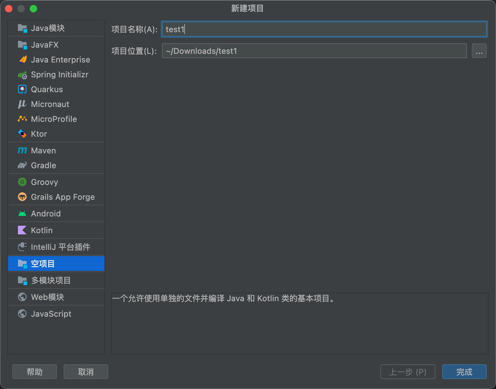

进入主界面, 新建 spring boot 模块

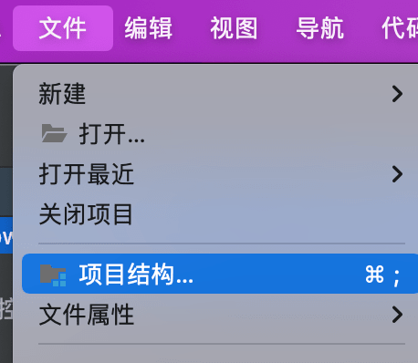

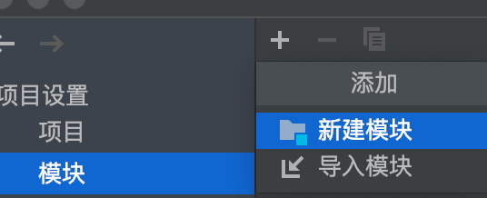

填写项目信息

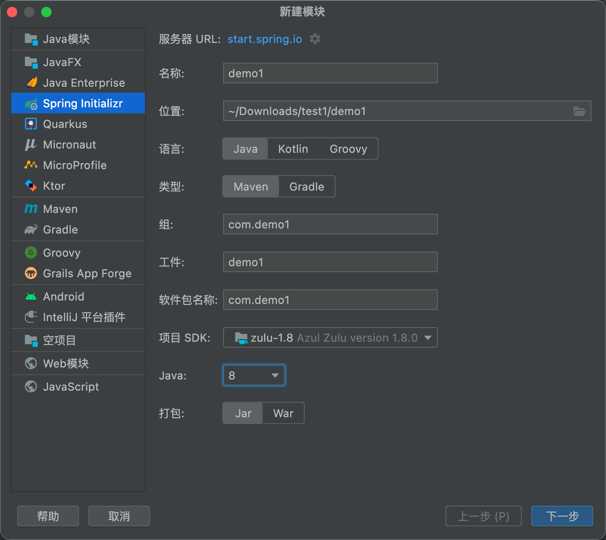

选择依赖

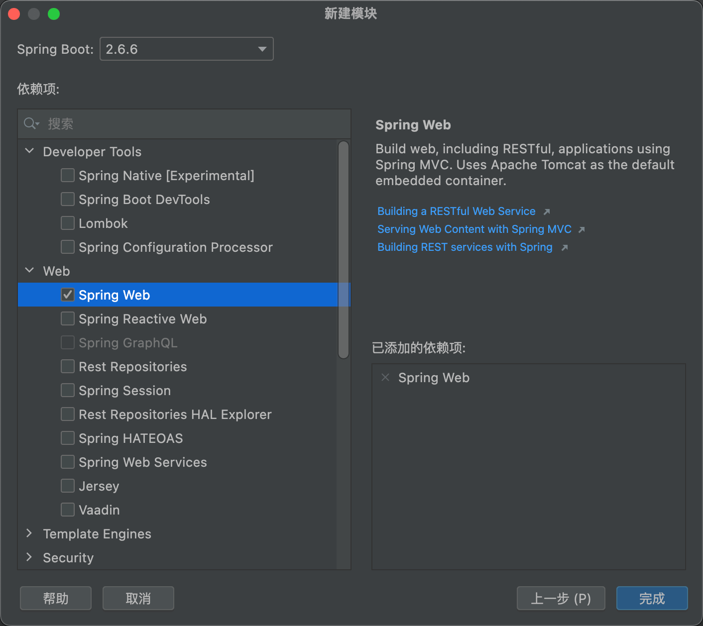

此时的项目结构

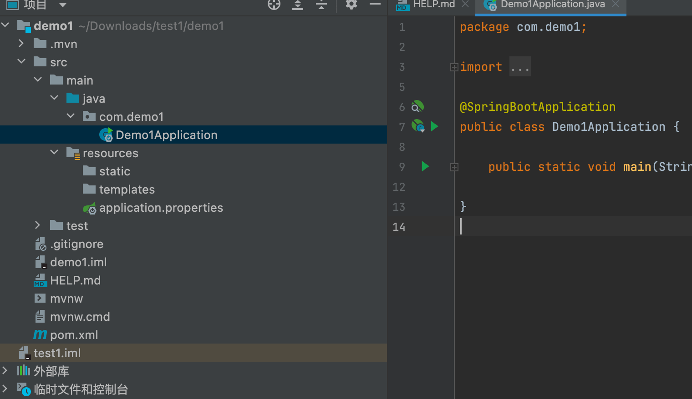

新建包 controller, 再新建类Hello

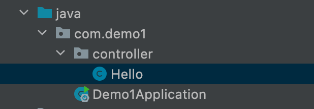

写入如下内容
```java
package com.demo1.controller;

import org.springframework.web.bind.annotation.RequestMapping;
import org.springframework.web.bind.annotation.RestController;

@RestController
public class Hello {
    @RequestMapping("/hello")
    public String hello() {
        return "Hello World !!!";
    }

}
```

到 Demo1Application 空白处右键，点击运行

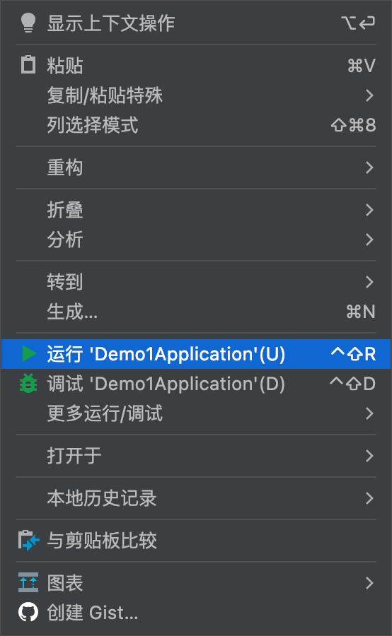

无误后，访问自己 127.0.0.1/hello 即可


---

## 通过访问 Spring Initializr 创建

访问 Spring Initializr：https://start.spring.io/

如图所示，几个选项说明：

- Project：使用什么构建工具，Maven 还是 Gradle；
- Language：使用什么编程语言，Java、Kotlin 还是 Groovy；
- Spring Boot：选用的 Spring Boot 版本；
- Project Metadata：项目的元数据；其实就是 Maven 项目的基本元素；
- Dependencies：选择要加入的 Spring Boot 组件；

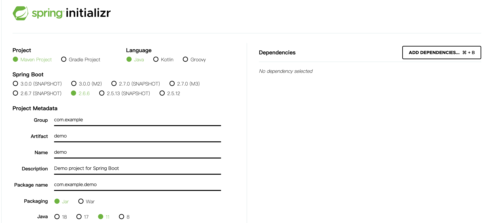

选择 web 组件

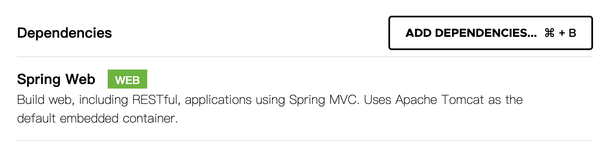

点击 "Generate" 按钮生成项目；此时浏览器会下载一个与上面 Artifact 名称一样的压缩包。

解压项目包，并用编译器以 Maven 项目导入，以 IntelliJ IDEA 为例：

菜单中选择：File -> New -> Project from Existing Sources…

选择解压后的项目文件夹，点击 OK

点击：Import project from external model，并选择 Maven，点击 Next 到底为止。

若你的环境有多个版本的 JDK，注意到选择 Java SDK 的时候请选择相应的 java 版本（具体根据你在第一步中选择的 Java 版本为准）

通过上面步骤完成了基础项目的创建。

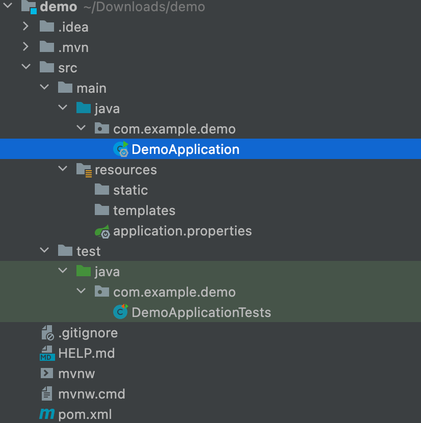

Spring Boot 的基础结构共三个文件（具体路径根据用户生成项目时填写的 Group 所有差异）
- src/main/java 下的程序入口: DemoApplication
- src/main/resources 下的配置文件: application.properties
- src/test/ 下的测试入口: DemoApplicationTests

生成的 DemoApplication 和 DemoApplicationTests 类都可以直接运行来启动当前创建的项目，由于目前该项目未配合任何数据访问或 Web 模块，程序会在加载完 Spring 之后结束运行。

项目依赖解析

打开pom.xml，看看Spring Boot项目的依赖：
```xml
<?xml version="1.0" encoding="UTF-8"?>
<project xmlns="http://maven.apache.org/POM/4.0.0" xmlns:xsi="http://www.w3.org/2001/XMLSchema-instance"
	xsi:schemaLocation="http://maven.apache.org/POM/4.0.0 https://maven.apache.org/xsd/maven-4.0.0.xsd">
	<modelVersion>4.0.0</modelVersion>
	<parent>
		<groupId>org.springframework.boot</groupId>
		<artifactId>spring-boot-starter-parent</artifactId>
		<version>2.6.6</version>
		<relativePath/> <!-- lookup parent from repository -->
	</parent>
	<groupId>com.example</groupId>
	<artifactId>demo</artifactId>
	<version>0.0.1-SNAPSHOT</version>
	<name>demo</name>
	<description>Demo project for Spring Boot</description>
	<properties>
		<java.version>11</java.version>
	</properties>
	<dependencies>
		<dependency>
			<groupId>org.springframework.boot</groupId>
			<artifactId>spring-boot-starter-web</artifactId>
		</dependency>

		<dependency>
			<groupId>org.springframework.boot</groupId>
			<artifactId>spring-boot-starter-test</artifactId>
			<scope>test</scope>
		</dependency>
	</dependencies>

	<build>
		<plugins>
			<plugin>
				<groupId>org.springframework.boot</groupId>
				<artifactId>spring-boot-maven-plugin</artifactId>
			</plugin>
		</plugins>
	</build>

</project>
```

如上所示，主要有四个部分：
- 项目元数据：创建时候输入的 Project Metadata 部分，也就是 Maven 项目的基本元素，包括：groupId、artifactId、version、name、description 等
- parent：继承 spring-boot-starter-parent 的依赖管理，控制版本与打包等内容
- dependencies：项目具体依赖，这里包含了 spring-boot-starter-web 用于实现 HTTP 接口（该依赖中包含了 Spring MVC）；spring-boot-starter-test 用于编写单元测试的依赖包。更多功能模块的使用我们将在后面的教程中逐步展开。
- build：构建配置部分。默认使用了 spring-boot-maven-plugin，配合 spring-boot-starter-parent 就可以把 Spring Boot 应用打包成 JAR 来直接运行。

编写一个 HTTP 接口

创建 package 命名为 com.example.demo.web（根据实际情况修改）


创建 HelloController 类，内容如下：

```java
@RestController
public class HelloController {

    @RequestMapping("/hello")
    public String index() {
        return "Hello World";
    }

}
```

在 DemoApplication 启动主程序,发起请求：http://localhost:8080/hello ，可以看到页面返回：Hello World

---

## Source & Reference

- https://blog.csdn.net/m0_52559040/article/details/123284034
- https://blog.didispace.com/spring-boot-learning-21-1-1/