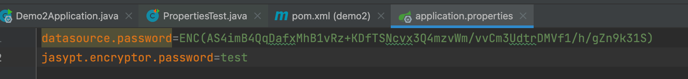
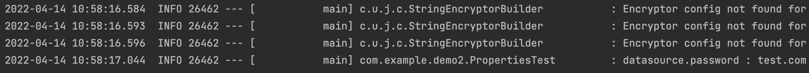

# 配置文件

---

Spring Boot 针对我们常用的开发场景提供了一系列自动化配置来减少原本复杂而又几乎很少改动的模板化配置内容。但是，我们还是需要去了解如何在 Spring Boot 中修改这些自动化的配置内容，以应对一些特殊的场景需求，比如：我们在同一台主机上需要启动多个基于 Spring Boot 的 web 应用，若我们不为每个应用指定特别的端口号，那么默认的 8080 端口必将导致冲突。

## 配置基础

src/main/resources 目录是 Spring Boot 的配置目录，所以我们要为应用创建配置个性化配置时，就是在该目录之下。

Spring Boot 的默认配置文件位置为： src/main/resources/application.properties。

关于 Spring Boot 应用的配置内容都集中在该文件中，根据我们引入的不同 Starter 模块，可以在这里定义诸如：容器端口名、数据库链接信息、日志级别等各种配置信息。

比如，我们需要自定义 web 模块的服务端口号，可以在 application.properties 中添加 `server.port=8888` 来指定服务端口为 8888，也可以通过 `spring.application.name=hello` 来指定应用名（该名字在 Spring Cloud 应用中会被注册为服务名）。

Spring Boot 的配置文件除了可以使用传统的 properties 文件之外，还支持现在被广泛推荐使用的 YAML 文件。

如下
```yaml
environments:
    dev:
        url: http://dev.bar.com
        name: Developer Setup
    prod:
        url: http://foo.bar.com
        name: My Cool App
```

与其等价的properties配置如下。
```conf
environments.dev.url=http://dev.bar.com
environments.dev.name=Developer Setup
environments.prod.url=http://foo.bar.com
environments.prod.name=My Cool App
```

通过 YAML 的配置方式，我们可以看到配置信息利用阶梯化缩进的方式，其结构显得更为清晰易读，同时配置内容的字符量也得到显著的减少。除此之外，YAML 还可以在一个单个文件中通过使用 spring.profiles 属性来定义多个不同的环境配置。

例如下面的内容，在指定为 test 环境时，server.port 将使用 8882 端口；而在 prod 环境，server.port 将使用 8883 端口；如果没有指定环境，server.port 将使用 8881 端口。
```yaml
server:
  port: 8881
---
spring:
  profiles: test
server:
  port: 8882
---
spring:
  profiles: prod
server:
  port: 8883
```

---

## 自定义参数

我们除了可以在 Spring Boot 的配置文件中设置各个 Starter 模块中预定义的配置属性，也可以在配置文件中定义一些我们需要的自定义属性。比如在 application.properties 中添加：
```conf
book.name=SpringCloudInAction
book.author=zhangsan
```

然后，在应用中我们可以通过 @Value 注解来加载这些自定义的参数，比如：
```java
@Component
public class Book {

    @Value("${book.name}")
    private String name;
    @Value("${book.author}")
    private String author;

    // 省略getter和setter
}
```

@Value 注解加载属性值的时候可以支持两种表达式来进行配置：
- 一种是我们上面介绍的 PlaceHolder 方式，格式为 `${...}` ，大括号内为 PlaceHolder
- 另外还可以使用 SpEL 表达式（Spring Expression Language）， 格式为 `#{...}` ，大括号内为 SpEL 表达式

---

## 参数引用

在 application.properties 中的各个参数之间，我们也可以直接通过使用 PlaceHolder 的方式来进行引用，就像下面的设置：
```
book.name=SpringCloud
book.author=zhangsan
book.desc=${book.author}  is writing《${book.name}》
```

book.desc 参数引用了上文中定义的 book.name 和 book.author 属性，最后该属性的值就是 zhangsan is writing《SpringCloud》。

---

## 使用随机数

在一些特殊情况下，有些参数我们希望它每次加载的时候不是一个固定的值，比如：密钥、服务端口等。在 Spring Boot 的属性配置文件中，我们可以通过使用 `${random}` 配置来产生随机的 int 值、long 值或者 string 字符串，这样我们就可以容易的通过配置来属性的随机生成，而不是在程序中通过编码来实现这些逻辑。

`${random}` 的配置方式主要有以下几种

```conf
# 随机字符串
com.example.blog.value=${random.value}
# 随机int
com.example.blog.number=${random.int}
# 随机long
com.example.blog.bignumber=${random.long}
# 10以内的随机数
com.example.blog.test1=${random.int(10)}
# 10-20的随机数
com.example.blog.test2=${random.int[10,20]}
```

---

## 命令行参数

我们可以使用命令 java -jar 命令来启动的方式启动 Spring Boot 应用。该命令除了启动应用之外，还可以在命令行中来指定应用的参数，比如：`java -jar xxx.jar --server.port=8888` ，直接以命令行的方式，来设置 server.port 属性，另启动应用的端口设为 8888。

在命令行方式启动 Spring Boot 应用时，连续的两个减号 `--` 就是对 application.properties 中的属性值进行赋值的标识。所以，`java -jar xxx.jar --server.port=8888` 命令，等价于我们在 application.properties 中添加属性 `server.port=8888`。

通过命令行来修改属性值是 Spring Boot 非常重要的一个特性，通过此特性，理论上已经使得我们应用的属性在启动前是可变的，所以其中端口号也好、数据库连接也好，都是可以在应用启动时发生改变，而不同于以往的 Spring 应用通过 Maven 的 Profile 在编译器进行不同环境的构建。其最大的区别就是，Spring Boot 的这种方式，可以让应用程序的打包内容，贯穿开发、测试以及线上部署，而 Maven 不同 Profile 的方案每个环境所构建的包，其内容本质上是不同的。但是，如果每个参数都需要通过命令行来指定，这显然也不是一个好的方案，所以我们可以在 Spring Boot 中实现多环境的配置。

---

## 多环境配置

我们在开发任何应用的时候，通常同一套程序会被应用和安装到几个不同的环境，比如：开发、测试、生产等。其中每个环境的数据库地址、服务器端口等等配置都会不同，如果在为不同环境打包时都要频繁修改配置文件的话，那必将是个非常繁琐且容易发生错误的事。

对于多环境的配置，各种项目构建工具或是框架的基本思路是一致的，通过配置多份不同环境的配置文件，再通过打包命令指定需要打包的内容之后进行区分打包，Spring Boot也不例外，或者说更加简单。

在 Spring Boot 中多环境配置文件名需要满足 `application-{profile}.properties` 的格式，其中 `{profile}` 对应你的环境标识，比如：
- application-dev.properties：开发环境
- application-test.properties：测试环境
- application-prod.properties：生产环境

至于哪个具体的配置文件会被加载，需要在 application.properties 文件中通过 spring.profiles.active 属性来设置，其值对应配置文件中的 `{profile}` 值。如：spring.profiles.active=test 就会加载 application-test.properties 配置文件内容。

下面，以不同环境配置不同的服务端口为例，进行样例实验。

针对各环境新建不同的配置文件 application-dev.properties、application-test.properties、application-prod.properties

在这三个文件均都设置不同的 server.port 属性，如：dev 环境设置为 1111，test 环境设置为 2222，prod 环境设置为 3333

application.properties 中设置 `spring.profiles.active=dev` ，就是说默认以 dev 环境设置

测试不同配置的加载
- 执行 java -jar xxx.jar，可以观察到服务端口被设置为 1111，也就是默认的开发环境（dev）
- 执行 java -jar xxx.jar --spring.profiles.active=test，可以观察到服务端口被设置为 2222，也就是测试环境的配置（test）
- 执行 java -jar xxx.jar --spring.profiles.active=prod，可以观察到服务端口被设置为 3333，也就是生产环境的配置（prod）

按照上面的实验，可以如下总结多环境的配置思路：
- application.properties中配置通用内容，并设置spring.profiles.active=dev，以开发环境为默认配置
- application-{profile}.properties中配置各个环境不同的内容
- 通过命令行方式去激活不同环境的配置

---

## 加载顺序

在上面的例子中，我们将 Spring Boot 应用需要的配置内容都放在了项目工程中，虽然我们已经能够通过 spring.profiles.active 或是通过 Maven 来实现多环境的支持。但是，当我们的团队逐渐壮大，分工越来越细致之后，往往我们不需要让开发人员知道测试或是生成环境的细节，而是希望由每个环境各自的负责人（QA 或是运维）来集中维护这些信息。那么如果还是以这样的方式存储配置内容，对于不同环境配置的修改就不得不去获取工程内容来修改这些配置内容，当应用非常多的时候就变得非常不方便。同时，配置内容都对开发人员可见，本身这也是一种安全隐患。对此，现在出现了很多将配置内容外部化的框架和工具，后续将要介绍的 Spring Cloud Config 就是其中之一，为了后续能更好的理解 Spring Cloud Config 的加载机制，我们需要对 Spring Boot 对数据文件的加载机制有一定的了解。

Spring Boot 为了能够更合理的重写各属性的值，使用了下面这种较为特别的属性加载顺序：
1. 命令行中传入的参数。
2. SPRING_APPLICATION_JSON 中的属性. SPRING_APPLICATION_JSON 是以 JSON 格式配置在系统环境变量中的内容。
3. java:comp/env 中的 JNDI 属性。
4. Java 的系统属性，可以通过 `System.getProperties()` 获得的内容。
5. 操作系统的环境变量
6. 通过 random.* 配置的随机属性
7. 位于当前应用 jar 包之外，针对不同 `{profile}` 环境的配置文件内容，例如：`application-{profile}.properties` 或是 YAML 定义的配置文件
8. 位于当前应用 jar 包之内，针对不同 `{profile}` 环境的配置文件内容，例如：`application-{profile}.properties` 或是 YAML 定义的配置文件
9. 位于当前应用 jar 包之外的 application.properties 和 YAML 配置内容
10. 位于当前应用 jar 包之内的 application.properties 和 YAML 配置内容
11. 在 `@Configuration` 注解修改的类中，通过 `@PropertySource` 注解定义的属性
12. 应用默认属性，使用 `SpringApplication.setDefaultProperties` 定义的内容

优先级按上面的顺序有高到低，数字越小优先级越高。

可以看到，其中第 7 项和第 9 项都是从应用 jar 包之外读取配置文件，所以，实现外部化配置的原理就是从此切入，为其指定外部配置文件的加载位置来取代 jar 包之内的配置内容。通过这样的实现，我们的工程在配置中就变的非常干净，我们只需要在本地放置开发需要的配置即可，而其他环境的配置就可以不用关心，由其对应环境的负责人去维护即可。

---

## 配置元数据

元数据信息,可以帮助IDE来完成配置联想和配置提示的展示

配置元数据的自动生成

第一步：创建一个配置类，定义一个自定义配置
```java
@Data
@Configuration
@ConfigurationProperties(prefix = "com.test")
public class testProperties {

    /**
     * 这是一个测试配置
     */
    private String from;

}
```

第二步：在pom.xml中添加自动生成配置元数据的依赖
```xml
<dependency>
    <groupId>org.springframework.boot</groupId>
    <artifactId>spring-boot-configuration-processor</artifactId>
</dependency>
```

第三步：mvn install下这个项目。

此时我们可以在工程target目录下找到元数据文件.

---

## 加密配置中的敏感信息

**为什么要加密**

可能很多初学者，对于配置信息的加密并不敏感，因为开始主要接触本地的开发，对于很多安全问题并没有太多的考虑。而现实中，我们的配置文件中，其实包含着大量与安全相关的敏感信息，比如：数据库的账号密码、一些服务的密钥等。这些信息一旦泄露，对于企业的重要数据资产，那是相当危险的。 所以，对于这些配置文件中存在的敏感信息进行加密，是每个成熟开发团队都一定会去的事。

**jasypt-spring-boot**

- https://github.com/ulisesbocchio/jasypt-spring-boot

先创建一个基础的Spring Boot项目

设计一个参数和单元测试，用来输出这个配置信息

准备加密的配置：
```
datasource.password=test.com
```

用来输出配置信息的单元测试：
```java
@Slf4j
@SpringBootTest
public class PropertiesTest {

    @Value("${datasource.password:}")
    private String password;

    @Test
    public void test() {
        log.info("datasource.password : {}", password);
    }

}
```

执行这个单元测试，会输出：
```
2022-04-14 10:46:05.808  INFO 25707 --- [           main] com.example.demo2.PropertiesTest         : datasource.password : test.com
```

这里没加密，下面开始引入加密的操作

在 pom.xml 中引入 jasypt 提供的 Spring Boot Starter
```xml
<dependency>
    <groupId>com.github.ulisesbocchio</groupId>
    <artifactId>jasypt-spring-boot-starter</artifactId>
    <version>3.0.3</version>
</dependency>
```

在插件配置中加入：
```xml
<plugin>
    <groupId>com.github.ulisesbocchio</groupId>
    <artifactId>jasypt-maven-plugin</artifactId>
    <version>3.0.3</version>
</plugin>
```

在配置文件中加入加密需要使用的密码
```
jasypt.encryptor.password=test
```

同时，修改要加密的内容，用 DEC() 将待加密内容包裹起来，比如：
```
datasource.password=DEC(test.com)
```

使用 jasypt-maven-plugin 插件来给 DEC() 包裹的内容实现批量加密。
```
mvn jasypt:encrypt -Djasypt.encryptor.password=test
```

> 注意：这里 -Djasypt.encryptor.password 参数必须与配置文件中的一致，不然后面会解密失败。

执行之后，重新查看配置文件，可以看到，自动变成了



其中，ENC() 跟 DEC() 一样都是 jasypt 提供的标识，分别用来标识括号内的是加密后的内容和待加密的内容。

如果当前配置文件已经都是 ENC() 内容了，那么我们可以通过下面的命令来解密配置文件，查看原始信息：
```
mvn jasypt:decrypt -Djasypt.encryptor.password=test
```

该操作不会修改配置文件，只会在控制台输出解密结果，比如：


此时，我们的配置文件中的敏感信息已经被 ENC() 修饰了，再执行一下单元测试，不出意外的话，依然可以得到之前一样的结果：



而此时，配置文件中已经是加密内容了，敏感信息得到了保护。

---

## 2.x 新特性

在Spring Boot 2.0中推出了Relaxed Binding 2.0，对原有的属性绑定功能做了非常多的改进以帮助我们更容易的在Spring应用中加载和读取配置信息。下面本文就来说说Spring Boot 2.0中对配置的改进。

### 配置文件绑定

**简单类型**

在Spring Boot 2.0中对配置属性加载的时候会除了像1.x版本时候那样移除特殊字符外，还会将配置均以全小写的方式进行匹配和加载。所以，下面的4种配置方式都是等价的：

properties格式：
```conf
spring.jpa.databaseplatform=mysql
spring.jpa.database-platform=mysql
spring.jpa.databasePlatform=mysql
spring.JPA.database_platform=mysql
```

yaml格式：
```yaml
spring:
  jpa:
    databaseplatform: mysql
    database-platform: mysql
    databasePlatform: mysql
    database_platform: mysql
```

推荐使用全小写配合-分隔符的方式来配置，比如: `spring.jpa.database-platform=mysql`

**List类型**

在properties文件中使用[]来定位列表类型，比如：
```conf
spring.my-example.url[0]=http://example.com
spring.my-example.url[1]=http://spring.io
```
也支持使用逗号分割的配置方式，上面与下面的配置是等价的：
```conf
spring.my-example.url=http://example.com,http://spring.io
```

而在yaml文件中使用可以使用如下配置：
```yaml
spring:
  my-example:
    url:
      - http://example.com
      - http://spring.io
```

也支持逗号分割的方式：
```yaml
spring:
  my-example:
    url: http://example.com, http://spring.io
```

注意：在Spring Boot 2.0中对于List类型的配置必须是连续的，不然会抛出UnboundConfigurationPropertiesException异常，所以如下配置是不允许的：
```
foo[0]=a
foo[2]=b
```

在Spring Boot 1.x中上述配置是可以的，foo[1]由于没有配置，它的值会是null

**Map类型**

Map类型在properties和yaml中的标准配置方式如下：

properties格式：
```conf
spring.my-example.foo=bar
spring.my-example.hello=world
```

yaml格式：
```yaml
spring:
  my-example:
    foo: bar
    hello: world
```

注意：如果Map类型的key包含非字母数字和-的字符，需要用[]括起来，比如：
```yaml
spring:
  my-example:
    '[foo.baz]': bar
```

### 环境属性绑定

**简单类型**

在环境变量中通过小写转换与 `.` 替换 `_` 来映射配置文件中的内容，比如：环境变量 `SPRING_JPA_DATABASEPLATFORM=mysql` 的配置会产生与在配置文件中设置 `spring.jpa.databaseplatform=mysql` 一样的效果。

**List类型**

由于环境变量中无法使用 `[` 和 `]` 符号，所以使用 `_` 来替代。任何由下划线包围的数字都会被认为是 `[]` 的数组形式。比如：
```conf
MY_FOO_1_ = my.foo[1]
MY_FOO_1_BAR = my.foo[1].bar
MY_FOO_1_2_ = my.foo[1][2]
```
另外，最后环境变量最后是以数字和下划线结尾的话，最后的下划线可以省略，比如上面例子中的第一条和第三条等价于下面的配置：
```conf
MY_FOO_1 = my.foo[1]
MY_FOO_1_2 = my.foo[1][2]
```

### 系统属性绑定

**简单类型**

系统属性与文件配置中的类似，都以移除特殊字符并转化小写后实现绑定，比如下面的命令行参数都会实现配置 spring.jpa.databaseplatform=mysql 的效果：
```
-Dspring.jpa.database-platform=mysql
-Dspring.jpa.databasePlatform=mysql
-Dspring.JPA.database_platform=mysql
```

**List类型**

系统属性的绑定也与文件属性的绑定类似，通过 `[]` 来标示，比如：

```
-D"spring.my-example.url[0]=http://example.com"
-D"spring.my-example.url[1]=http://spring.io"
```

同样的，他也支持逗号分割的方式，比如：
```
-Dspring.my-example.url=http://example.com,http://spring.io
```

### 属性的读取

上文介绍了 Spring Boot 2.0 中对属性绑定的内容，可以看到对于一个属性我们可以有多种不同的表达，但是如果我们要在 Spring 应用程序的 environment 中读取属性的时候，每个属性的唯一名称符合如下规则：
- 通过 `.` 分离各个元素
- 最后一个 `.` 将前缀与属性名称分开
- 必须是字母（a-z）和数字 (0-9)
- 必须是小写字母
- 用连字符 `-` 来分隔单词
- 唯一允许的其他字符是 `[` 和 `]`，用于 List 的索引
- 不能以数字开头

所以，如果我们要读取配置文件中 spring.jpa.database-platform 的配置，可以这样写：
```
this.environment.containsProperty("spring.jpa.database-platform")
```

而下面的方式是无法获取到 spring.jpa.database-platform 配置内容的：
```
this.environment.containsProperty("spring.jpa.databasePlatform")
```
注意：使用 @Value 获取配置内容的时候也需要这样的特点

### 全新的绑定API

在 Spring Boot 2.0 中增加了新的绑定 API 来帮助我们更容易的获取配置信息。

**例子一：简单类型**

假设在 propertes 配置中有这样一个配置：com.example.foo=bar

我们为它创建对应的配置类：
```java
@Data
@ConfigurationProperties(prefix = "com.example")
public class FooProperties {

    private String foo;

}
```

接下来，通过最新的 Binder 就可以这样来拿配置信息了：
```java
@SpringBootApplication
public class Application {

    public static void main(String[] args) {
        ApplicationContext context = SpringApplication.run(Application.class, args);

        Binder binder = Binder.get(context.getEnvironment());

        // 绑定简单配置
        FooProperties foo = binder.bind("com.example", Bindable.of(FooProperties.class)).get();
        System.out.println(foo.getFoo());
    }
}
```

**例子二：List类型**

如果配置内容是 List 类型呢？比如：
```conf
com.example.post[0]=Why Spring Boot
com.example.post[1]=Why Spring Cloud

com.example.posts[0].title=Why Spring Boot
com.example.posts[0].content=It is perfect!
com.example.posts[1].title=Why Spring Cloud
com.example.posts[1].content=It is perfect too!
```

要获取这些配置依然很简单，可以这样实现：
```java
ApplicationContext context = SpringApplication.run(Application.class, args);

Binder binder = Binder.get(context.getEnvironment());

// 绑定List配置
List<String> post = binder.bind("com.example.post", Bindable.listOf(String.class)).get();
System.out.println(post);

List<PostInfo> posts = binder.bind("com.example.posts", Bindable.listOf(PostInfo.class)).get();
System.out.println(posts);
```

---

## Source & Reference

- [Spring Boot 2.x基础教程：配置文件详解](https://blog.didispace.com/spring-boot-learning-21-1-3/)
- [Spring Boot 2.x基础教程：配置元数据的应用](https://blog.didispace.com/spring-boot-learning-24-1-6/)
- [Spring Boot 2.x基础教程：加密配置中的敏感信息](https://blog.didispace.com/spring-boot-learning-2-1-5/)
