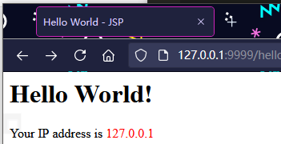

# jsp

---

## 什么是 JavaServer Pages？

JavaServer Pages(JSP) 是一种技术，能够开发支持动态内容的网页，可以帮助开发人员在 HTML 页面中利用特殊的 JSP 标签插入 Java 代码，其中大部分标签是以 `<%` 开始，以 `%>` 结束的。

JavaServer Pages 组件是 Java Servlet 的一种，旨在为 Java web 应用程序实现一个用户界面。Web 开发人员编写 JSP 作为文本文件，结合 HTML 或 XHTML 代码，XML 元素，并嵌入 JSP 操作和命令。

使用 JSP，你可以通过 web 页面的形式收集来自用户的输入，来自数据库或其他资源的当前记录并动态地创建 web 页面。

JSP 标签可用于各种用途，如从数据库检索信息或注册用户首选项，访问 javabean 组件，在页面之间传递控制，在请求、页面之间共享信息等。

---

## 为什么使用 JSP？

JavaServer Pages 的服务通常与通用网关接口(CGI)实现程序一样。但 JSP 与 CGI 相比，有几个优势。

性能更好，因为 JSP 允许在 HTML 页面本身嵌入动态元素而不需要创建一个单独的 CGI 文件。

JSP 总是在服务器处理之前进行编译，不像 CGI/Perl，每次请求页面时都需要服务器加载一个解释器和目标脚本。

JavaServer Pages 是建立在 Java servlet API 之上的，就像 servlet，JSP 也可以访问所有强大的 Enterprise Java API，包括 JDBC，JNDI，EJB，JAXP 等等。

JSP 页面可以与 servlet 结合使用，来处理业务逻辑，该模型是由 Java servlet 模板引擎支持的。
最后，JSP 还是 Java EE 不可分割的一部分，是 enterprise 级别应用程序的一个完整平台。这意味着 JSP 可以用于从最简单的应用程序到最复杂的应用程序中，并实现要求。

---

## JSP 的优点

下列是 JSP 优于其他技术的另外的优点：

* 与 Active Server Pages(ASP) 相比： JSP 的优点是双重的。首先，动态的部分是用 Java 编写的，而不是用 Visual Basic 或其他特定的语言编写，所以它使用起来更强大并且更容易。第二，它可以移植到其他操作系统和非 microsoft 的 Web 服务器中。
* 与 Pure Servlets 相比： 与用大量的 println 语句生成 HTML 相比，JSP 能够更方便的写 (和修改!) 常规的 HTML。
* 与 Server-Side Includes(SSI)相比： SSI 只是用于简单的包含物，而不是用于使用表单数据、创建数据库链接等的 “真正的” 程序。
* 与 JavaScript 相比： JavaScript 可以在客户端动态地生成 HTML，但很难与 web 服务器交互来执行复杂的任务，如数据库访问、图像处理等。

与 Static HTML 相比： 当然，常规的 HTML 不能包含动态的信息。

---

## JSP 案例

Servlet 就是一个能处理 HTTP 请求，发送 HTTP 响应的小程序，而发送响应无非就是获取 PrintWriter，然后输出 HTML：
```
PrintWriter pw = resp.getWriter();
pw.write("<html>");
pw.write("<body>");
pw.write("<h1>Welcome, " + name + "!</h1>");
pw.write("</body>");
pw.write("</html>");
pw.flush();
```
只不过，用 PrintWriter 输出 HTML 比较痛苦，因为不但要正确编写 HTML，还需要插入各种变量。如果想在 Servlet 中输出一个类似新浪首页的 HTML，写对 HTML 基本上不太可能。

JSP 是 Java Server Pages 的缩写，它的文件必须放到 `/src/main/webapp` 下，文件名必须以. jsp 结尾，整个文件与 HTML 并无太大区别，但需要插入变量，或者动态输出的地方，使用特殊指令 `<% ... %>`。

我们来编写一个 hello.jsp，内容如下：
```java
<html>
<head>
    <title>Hello World - JSP</title>
</head>
<body>
    <%-- JSP Comment --%>
    <h1>Hello World!</h1>
    <p>
    <%
         out.println("Your IP address is ");
    %>
    <span style="color:red">
        <%= request.getRemoteAddr() %>
    </span>
    </p>
</body>
</html>
```

整个 JSP 的内容实际上是一个 HTML，但是稍有不同：

包含在 `<%--` 和 `--%>` 之间的是 JSP 的注释，它们会被完全忽略；
包含在 `<%` 和 `%>` 之间的是 Java 代码，可以编写任意 Java 代码；
如果使用 `<%= xxx %>` 则可以快捷输出一个变量的值。

JSP 页面内置了几个变量：
* out：表示 HttpServletResponse 的 PrintWriter；
* session：表示当前 HttpSession 对象；
* request：表示 HttpServletRequest 对象。

这几个变量可以直接使用。

访问 JSP 页面时，直接指定完整路径。例如，http://localhost:8080/hello.jsp，浏览器显示如下：



JSP 和 Servlet 有什么区别？其实它们没有任何区别，因为 JSP 在执行前首先被编译成一个 Servlet。在 Tomcat 的临时目录下，可以找到一个 hello_jsp.java 的源文件，这个文件就是 Tomcat 把 JSP 自动转换成的 Servlet 源码

可见 JSP 本质上就是一个 Servlet，只不过无需配置映射路径，Web Server 会根据路径查找对应的 .jsp 文件，如果找到了，就自动编译成 Servlet 再执行。在服务器运行过程中，如果修改了 JSP 的内容，那么服务器会自动重新编译。

---

## JSP 高级功能

JSP 的指令非常复杂，除了 <% ... %> 外，JSP 页面本身可以通过 page 指令引入 Java 类：

```java
<%@ page import="java.io.*" %>
<%@ page import="java.util.*" %>
```

这样后续的 Java 代码才能引用简单类名而不是完整类名。

使用 include 指令可以引入另一个 JSP 文件：
```java
<html>
<body>
    <%@ include file="header.jsp"%>
    <h1>Index Page</h1>
    <%@ include file="footer.jsp"%>
</body>
```

**Jsp 的定义格式：**

1. `<%  代码 %>`：定义的 java 代码，在 service 方法中。service 方法中可以定义什么，该脚本中就可以定义什么。
2. `<%! 代码 %>`：定义的 java 代码，在 jsp 转换后的 java 类的成员位置。
3. `<%= 代码 %>`：定义的 java 代码，会输出到页面上。输出语句中可以定义什么，该脚本中就可以定义什么。

```
<%@ 指令名称 属性名1=属性值1 属性名2=属性值2 ... %>
```

**Jsp 指令：**

1. page ：配置 JSP 页面的
	* contentType：等同于 `response.setContentType()`
		1. 设置响应体的 mime 类型以及字符集
		2. 设置当前 jsp 页面的编码（只能是高级的 IDE 才能生效，如果使用低级工具，则需要设置 pageEncoding 属性设置当前页面的字符集）
	* import：导包
	* errorPage：当前页面发生异常后，会自动跳转到指定的错误页面
	* isErrorPage：标识当前也是是否是错误页面。
		* true：是，可以使用内置对象 exception
		* false：否。默认值。不可以使用内置对象 exception

2. include ：页面包含的。导入页面的资源文件
	* `<%@include file="top.jsp"%>`

3. taglib ：导入资源
	* `<%@ taglib prefix="c" uri="http://java.sun.com/jsp/jstl/core" %>`
		* prefix：前缀，自定义的

---

## JSP Tag

JSP 还允许自定义输出的 tag，例如：
```java
<c:out value = "${sessionScope.user.name}"/>
```

JSP Tag 需要正确引入 taglib 的 jar 包，并且还需要正确声明，使用起来非常复杂，对于页面开发来说，不推荐使用 JSP Tag，因为我们后续会介绍更简单的模板引擎，这里我们不再介绍如何使用 taglib。

---

## Source & Reference

- https://www.liaoxuefeng.com/wiki/1252599548343744/1266262958498784
- https://www.cnblogs.com/nice0e3/p/13544145.html
