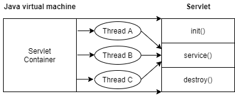
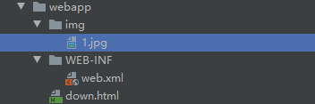
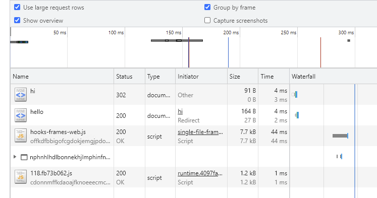
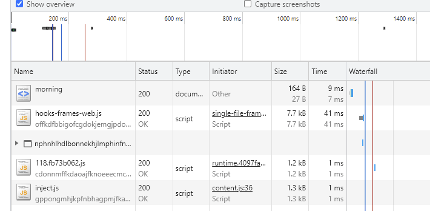
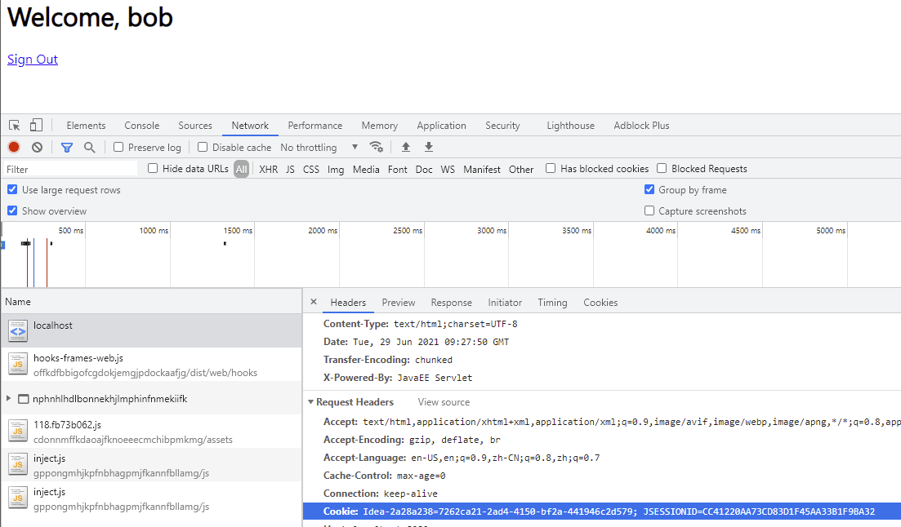
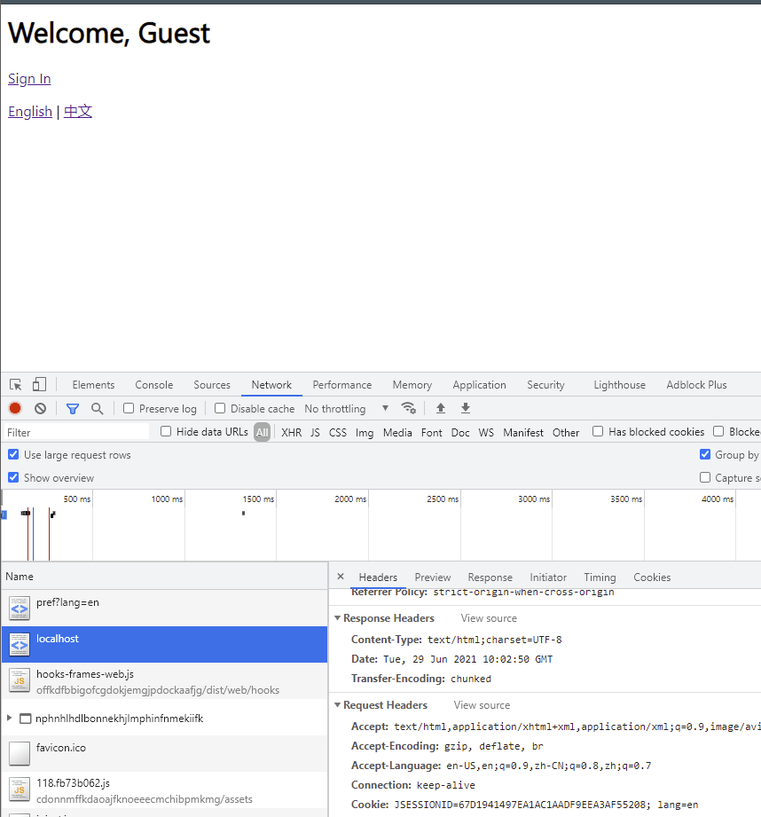

# servlet-1

---

## 基础概念

Java servlet 是运行在 Web 或应用服务器上的程序，作为在来自 Web 浏览器或其他 HTTP 客户机的请求和在 HTTP 服务器上的数据库或应用程序的中间层。

Servlet 其实就是一个接口，定义了 Java 的类被浏览器访问到 tomcat 的规则，后面会定义一个实现类，来实现 Servlet 接口的方法。

Servlet 为构建基于 Web 的应用程序提供了一个基于组件的、独立于平台的方法，没有 CGI 程序的性能限制。Servlet 访问 Java API 的整个家族，包括 JDBC API 来访问企业数据库。

代码文件不能放在 WEB-INF 文件目录下，放在该文件目录下是无法执行的。

在我们部署 jsp 网站的时候通常都是将文件打包成 war 包，然后再进行上传，上传后会自动进行解压，那么我们来看看 war 包的结构。

```
WebContent                  站点根目录
|
|--META-INF                 META-INF文件夹
|   |---MANIFEST.MF         配置清单文件
|---WEB-INF                 WEB-INF文件夹
|   |---web.xml             站点配置文件
|   |---lib                 第三方库文件夹
|   |   |---*.jar           程序需要的jar包
|   |---classes             放置字节码文件的目录
|       |---*.class         class文件
|---<userdir>               自定义的目录
|   |---*.jsp,*.js,*.css    自定义的资源文件
|---<userfiles>             自定义的资源文件
```

tomcat网站虚拟路径配置
```xml
配置conf/server.xml文件
在<Host>标签体中配置

<Context docBase="D:\hello" path="/hehe" />

* docBase:项目存放的路径
* path：虚拟目录
```

配置完成后，我们访问 127.0.0.1:8080/hehe 的时候，tomcat 中间件会查找本机 d 盘下的 hello 目录。

还有种方法是直接写 xx.xml 到 tomcat\conf\Catalina\localhost 目录下，这样也能实现同样的效果。
```xml
在conf\Catalina\localhost创建任意名称的xml文件。在文件中编写
<Context docBase="D:\hello" />
* 虚拟目录：xml文件的名称
```

**Servlets 任务**

Servlet 执行以下主要任务：

* 读取由客户端（浏览器）发送的显式数据。这包括网页上的 HTML 表单，或者也可以是来自 applet 或自定义的 HTTP 客户端程序的表单。

* 读取由客户端（浏览器）发送的隐式 HTTP 请求数据。这包括 cookies、媒体类型和浏览器能理解的压缩格式等等。

* 处理数据并生成结果。这个过程可能需要访问数据库，执行 RMI 或 CORBA 调用，调用 Web 服务，或者直接计算响应。

* 发送显式数据（即文档）到客户端（浏览器）。该文档可以以多种多样的格式被发送，包括文本文件（HTML 或 XML）、二进制文件（GIF 图像）、Excel 等。

* 发送隐式的 HTTP 响应到客户端（浏览器）。这包括告诉浏览器或其他客户端被返回的文档类型（例如 HTML），设置 cookies 和缓存参数，以及其他类似的任务。

---

## 环境配置

设置 Java 开发工具包,确保 `java`、`javac` 都可以正常输出

如果你运行的是 Windows 操作系统且 SDK 安装在 C:\jdk1.6.0_20 中，那么在你的 C:\autoexec.bat 文件中放入下列的行：
```bash
set PATH=C:\jdk1.5.0_20\bin;%PATH%
set JAVA_HOME=C:\jdk1.5.0_20
```

在 Linux 操作系统中，如果 SDK 安装在 /usr/local/jdk1.6.0_20 中,则在你的 ~/.bash_profile 文件中放入下列的行：
```bash
PATH=$PATH:/usr/local/jdk1.6.0_20/bin
JAVA_HOME=/usr/local/jdk1.6.0_20
```

设置 Web 服务器：Tomcat

Apache Tomcat 是 Java Servlet 和 JavaServer Pages 技术的开源软件实现，可以作为测试 servlets 的独立服务器，而且可以用 Apache Web 服务器集成。下面是在你的电脑上安装 Tomcat 的步骤：

从 http://tomcat.apache.org/ 上下载最新版本的 Tomcat。

一旦你下载了 Tomcat，将该二进制发布包解压缩到一个方便的位置。例如，如果你使用的是 Windows操作系统，则解压缩到 C:\apache-tomcat-5.5.29 中，如果你使用的是 Linux/Unix 操作系统，则解压缩到 /usr/local/apache-tomcat-5.5.29 中，并创建指向这些位置的 CATALINA_HOME 环境变量。

在 Windows 操作系统的计算机上，可以通过执行下述命令来启动 Tomcat：
```bash
%CATALINA_HOME%\bin\startup.bat

or

C:\apache-tomcat-5.5.29\bin\startup.bat
```

在 Unix（Solaris、Linux 等）操作系统的计算机上，可以通过执行下述命令来启动 Tomcat：
```bash
$CATALINA_HOME/bin/startup.sh

or
chmod 777 -R /root/apache-tomcat-5.5.29/bin/
/root/apache-tomcat-5.5.29/bin/startup.sh
```

Tomcat 启动后，通过访问 http://localhost:8080/，Tomcat 包含的默认 web 应用程序会变得可用。如果一切顺利，那么启动后会显示默认页面

在 Windows 操作系统的计算机上，可以通过执行下面的命令来停止 Tomcat：
```bash
C:\apache-tomcat-5.5.29\bin\shutdown
```

在 Unix（Solaris、Linux 等）操作系统的计算机上，可以通过执行下面的命令来停止 Tomcat：
```bash
/root/apache-tomcat-5.5.29/bin/shutdown.sh
```

**设置 CLASSPATH**

由于 servlets 不是 Java 平台标准版的组成部分，所以你必须为编译器指定 servlet 类。

如果你运行的是 Windows 操作系统，则需要在你的 C:\autoexec.bat 文件中放入下列的行：
```
set CATALINA=C:\apache-tomcat-5.5.29
set CLASSPATH=%CATALINA%\lib\servlet-api.jar;%CLASSPATH%
```

在 Unix（Solaris、Linux 等）操作系统中，如果你使用的是 C shell，则需要在你的 .cshrc 文件中放入下列的行：
```
CATALINA=/root/apache-tomcat-8.5.68
CLASSPATH=$CLASSPATH:$CATALINA/lib/servlet-api.jar
```
注意：假设你的开发目录是 C:\ServletDevel（Windows 操作系统中）或 /user/ServletDevel（UNIX 操作系统中），那么你还需要在 CLASSPATH 中添加这些目录，添加方式与上面的添加方式类似。

---

## 生命周期

Servlet 生命周期可被定义为从它被创建直到被销毁的整个过程。以下是 servlet 遵循的过程：
* 通过调用 `init()` 方法 servlet 被初始化。
* Servlet 调用 `service()` 方法来处理客户端的请求。
* 通过调用 `destroy()` 方法 servlet 终止。
* 最后，servlet 是由 JVM 的垃圾回收器进行垃圾回收的。



上图显示了一个典型的 servlet 生命周期场景。

最先到达服务器的 HTTP 请求被委派到 servlet 容器。

在调用 `service()` 方法之前 servlet 容器加载 servlet。

然后 servlet 容器通过产生多个线程来处理多个请求，每个线程执行 servlet 的单个实例的 `service()` 方法。

### init() 方法

init 方法被设计成只调用一次。它在第一次创建 servlet 时被调用，在后续每次用户请求时不再调用。因此，它用于一次性初始化，与 applets 的 init 方法一样。

通常情况下，当用户第一次调用对应于该 servlet 的 URL 时，servlet 被创建，但是当服务器第一次启动时，你也可以指定 servlet 被加载。

当用户调用 servlet 时，每个 servlet 的一个实例就会被创建，并且每一个用户请求都会产生一个新的线程，该线程在适当的时候移交给 doGet 或 doPost 方法。`init()` 方法简单地创建或加载一些数据，这些数据将被用于 servlet 的整个生命周期。

init 方法的定义如下：
```java
public void init() throws ServletException {
  // Initialization code...
}
```

### service() 方法

`service()` 方法是执行实际任务的主要方法。Servlet 容器（即 web 服务器）调用 `service()` 方法来处理来自客户端（浏览器）的请求，并将格式化的响应写回到客户端。

每次服务器接收到一个 servlet 请求时，服务器会产生一个新的线程并调用服务。`service()` 方法检查 HTTP 请求类型（GET、POST、PUT、DELETE 等），并在适当的时候调用 doGet、doPost、doPut、doDelete 等方法。

下面是该方法的特征：
```java
public void service(ServletRequest request,
                    ServletResponse response)
      throws ServletException, IOException{
}
```

`service()` 方法由容器调用，且 service 方法在适当的时候调用 doGet、doPost、doPut、doDelete 等。所以对 `service()` 方法你什么都不需要做，只是根据你接收到的来自客户端的请求类型来重写 `doGet()` 或 `doPost()`。

`doGet()` 和 `doPost()` 方法在每次服务请求中是最常用的方法。下面是这两种方法的特征。

### doGet() 方法

GET 请求来自于一个 URL 的正常请求，或者来自于一个没有 METHOD 指定的 HTML 表单，且它由 `doGet()` 方法处理。

```java
public void doGet(HttpServletRequest request,
                  HttpServletResponse response)
    throws ServletException, IOException {
    // Servlet code
}
```

### doPost() 方法

POST 请求来自于一个 HTML 表单，该表单特别的将 POST 列为 METHOD 且它由 `doPost()` 方法处理。

```java
public void doPost(HttpServletRequest request,
                   HttpServletResponse response)
    throws ServletException, IOException {
    // Servlet code
}
```

### destroy() 方法

`destroy()` 方法只在 servlet 生命周期结束时被调用一次。`destroy()` 方法可以让你的 servlet 关闭数据库连接、停止后台线程、将 cookie 列表或点击计数器写入磁盘，并执行其他类似的清理活动。

在调用 `destroy()` 方法之后，servlet 对象被标记用于垃圾回收。destroy 方法的定义如下所示：
```java
public void destroy() {
    // Finalization code...
  }
```

---

## 实例

Servlets 是 Java 类，服务于 HTTP 请求并实现了 javax.servlet.Servlet 接口。Web 应用程序开发人员通常编写扩展 javax.servlet.http.HttpServlet 的 servlets，它是一个实现了 Servlet 接口的抽象类并且是为处理 HTTP 请求专门设计的。

我们来实现一个最简单的Servlet：
```java
// WebServlet注解表示这是一个Servlet，并映射到地址/:
@WebServlet(urlPatterns = "/")
public class HelloServlet extends HttpServlet {
    protected void doGet(HttpServletRequest req, HttpServletResponse resp)
            throws ServletException, IOException {
        // 设置响应类型:
        resp.setContentType("text/html");
        // 获取输出流:
        PrintWriter pw = resp.getWriter();
        // 写入响应:
        pw.write("<h1>Hello, world!</h1>");
        // 最后不要忘记flush强制输出:
        pw.flush();
    }
}
```

一个 Servlet 总是继承自 HttpServlet，然后覆写 `doGet()` 或 `doPost()` 方法。注意到 `doGet()` 方法传入了 HttpServletRequest 和 HttpServletResponse 两个对象，分别代表 HTTP 请求和响应。我们使用 Servlet API 时，并不直接与底层 TCP 交互，也不需要解析 HTTP 协议，因为 HttpServletRequest 和 HttpServletResponse 就已经封装好了请求和响应。以发送响应为例，我们只需要设置正确的响应类型，然后获取 PrintWriter，写入响应即可。

Servlet API 是一个 jar 包，我们需要通过 Maven 来引入它，才能正常编译。编写 pom.xml 文件如下：
```xml
<project xmlns="http://maven.apache.org/POM/4.0.0"
    xmlns:xsi="http://www.w3.org/2001/XMLSchema-instance"
    xsi:schemaLocation="http://maven.apache.org/POM/4.0.0 http://maven.apache.org/maven-v4_0_0.xsd">
    <modelVersion>4.0.0</modelVersion>
    <groupId>com.itranswarp.learnjava</groupId>
    <artifactId>web-servlet-hello</artifactId>
    <packaging>war</packaging>
    <version>1.0-SNAPSHOT</version>

    <properties>
        <project.build.sourceEncoding>UTF-8</project.build.sourceEncoding>
        <project.reporting.outputEncoding>UTF-8</project.reporting.outputEncoding>
        <maven.compiler.source>11</maven.compiler.source>
        <maven.compiler.target>11</maven.compiler.target>
        <java.version>11</java.version>
    </properties>

    <dependencies>
        <dependency>
            <groupId>javax.servlet</groupId>
            <artifactId>javax.servlet-api</artifactId>
            <version>4.0.0</version>
            <scope>provided</scope>
        </dependency>
    </dependencies>

    <build>
        <finalName>hello</finalName>
    </build>
</project>
```

注意到这个 pom.xml 与前面我们讲到的普通 Java 程序有个区别，打包类型不是 jar，而是 war，表示 Java Web Application Archive：
```xml
<packaging>war</packaging>
```

引入的 Servlet API 如下：
```xml
<dependency>
    <groupId>javax.servlet</groupId>
    <artifactId>javax.servlet-api</artifactId>
    <version>4.0.0</version>
    <scope>provided</scope>
</dependency>
```

注意到 `<scope>` 指定为 provided，表示编译时使用，但不会打包到 .war 文件中，因为运行期 Web 服务器本身已经提供了 Servlet API 相关的 jar 包。

我们还需要在工程目录下创建一个 web.xml 描述文件，放到 src/main/webapp/WEB-INF 目录下（固定目录结构，不要修改路径，注意大小写）。文件内容可以固定如下：
```xml
<!DOCTYPE web-app PUBLIC
 "-//Sun Microsystems, Inc.//DTD Web Application 2.3//EN"
 "http://java.sun.com/dtd/web-app_2_3.dtd">
<web-app>
  <display-name>Archetype Created Web Application</display-name>
</web-app>
```

整个工程结构如下：
```
web-servlet-hello
├── pom.xml
└── src
    └── main
        ├── java
        │   └── com
        │        └── test
        │               └── servlet
        │                      └── HelloServlet.java
        ├── resources
        └── webapp
            └── WEB-INF
                └── web.xml
```

运行 Maven 命令 mvn clean package，在 target 目录下得到一个 hello.war 文件，这个文件就是我们编译打包后的 Web 应用程序。

普通的 Java 程序是通过启动 JVM，然后执行 `main()` 方法开始运行。但是 Web 应用程序有所不同，我们无法直接运行 war 文件，必须先启动 Web 服务器，再由 Web 服务器加载我们编写的 HelloServlet，这样就可以让 HelloServlet 处理浏览器发送的请求。

把 hello.war 复制到 Tomcat 的 webapps 目录下，然后切换到 bin 目录，执行 startup.sh 或 startup.bat 启动 Tomcat 服务器

在浏览器输入 http://localhost:8080/hello/ 即可看到 HelloServlet 的输出

---

## Maven tomcat 插件

- http://tomcat.apache.org/maven-plugin-2.2/index.html

```xml
<project xmlns="http://maven.apache.org/POM/4.0.0"
         xmlns:xsi="http://www.w3.org/2001/XMLSchema-instance"
         xsi:schemaLocation="http://maven.apache.org/POM/4.0.0 http://maven.apache.org/maven-v4_0_0.xsd">
    <modelVersion>4.0.0</modelVersion>
    <groupId>com.itranswarp.learnjava</groupId>
    <artifactId>web-servlet-hello</artifactId>
    <packaging>war</packaging>
    <version>1.0-SNAPSHOT</version>

    <properties>
        <project.build.sourceEncoding>UTF-8</project.build.sourceEncoding>
        <project.reporting.outputEncoding>UTF-8</project.reporting.outputEncoding>
        <maven.compiler.source>8</maven.compiler.source>
        <maven.compiler.target>8</maven.compiler.target>
        <java.version>8</java.version>
    </properties>

    <dependencies>
        <dependency>
            <groupId>javax.servlet</groupId>
            <artifactId>javax.servlet-api</artifactId>
            <version>3.1.0</version>
            <scope>provided</scope>
        </dependency>
    </dependencies>

    <build>
        <finalName>hello</finalName>
        <plugins>
            <plugin>
                <groupId>org.apache.tomcat.maven</groupId>
                <artifactId>tomcat7-maven-plugin</artifactId>
                <version>2.2</version>
                <configuration>
                    <hostName>localhost</hostName>
                    <port>8080</port>
                    <path>/hello</path>
                    <uriEncoding>UTF-8</uriEncoding>
                </configuration>
            </plugin>
        </plugins>
    </build>

</project>
```

```
tomcat7:deploy --部署web war包
tomcat7:redeploy --重新部署web war包
tomcat7:undeploy --停止该项目运行，并删除部署的war包
tomcat7:run --启动嵌入式tomcat ，并运行当前项目
tomcat7:exec-war --创建一个可执行的jar文件，允许使用java -jar mywebapp.jar 运行web项目
tomcat7:help --在tomcat7-maven-plugin显示帮助信息
```

Tomcat 实际上也是一个 Java 程序，我们看看 Tomcat 的启动流程：
* 启动 JVM 并执行 Tomcat 的 `main()` 方法；
* 加载 war 并初始化 Servlet；
* 正常服务。

启动 Tomcat 无非就是设置好 classpath 并执行 Tomcat 某个 jar 包的 main() 方法，我们完全可以把 Tomcat 的 jar 包全部引入进来，然后自己编写一个 main() 方法，先启动 Tomcat，然后让它加载我们的 webapp 就行。

我们新建一个web-servlet-embedded工程，编写pom.xml如下：
```xml
<project xmlns="http://maven.apache.org/POM/4.0.0"
    xmlns:xsi="http://www.w3.org/2001/XMLSchema-instance"
    xsi:schemaLocation="http://maven.apache.org/POM/4.0.0 http://maven.apache.org/xsd/maven-4.0.0.xsd">
    <modelVersion>4.0.0</modelVersion>

    <groupId>com.itranswarp.learnjava</groupId>
    <artifactId>web-servlet-embedded</artifactId>
    <version>1.0-SNAPSHOT</version>
    <packaging>war</packaging>

    <properties>
        <project.build.sourceEncoding>UTF-8</project.build.sourceEncoding>
        <project.reporting.outputEncoding>UTF-8</project.reporting.outputEncoding>
        <maven.compiler.source>11</maven.compiler.source>
        <maven.compiler.target>11</maven.compiler.target>
        <java.version>11</java.version>
        <tomcat.version>9.0.26</tomcat.version>
    </properties>

    <dependencies>
        <dependency>
            <groupId>org.apache.tomcat.embed</groupId>
            <artifactId>tomcat-embed-core</artifactId>
            <version>${tomcat.version}</version>
            <scope>provided</scope>
        </dependency>
        <dependency>
            <groupId>org.apache.tomcat.embed</groupId>
            <artifactId>tomcat-embed-jasper</artifactId>
            <version>${tomcat.version}</version>
            <scope>provided</scope>
        </dependency>
    </dependencies>
</project>
```

其中，`<packaging>` 类型仍然为 war，引入依赖 tomcat-embed-core 和 tomcat-embed-jasper，引入的 Tomcat 版本 `<tomcat.version>` 为 9.0.26。

不必引入 Servlet API，因为引入 Tomcat 依赖后自动引入了 Servlet API。因此，我们可以正常编写 Servlet 如下：
```java
@WebServlet(urlPatterns = "/")
public class HelloServlet extends HttpServlet {
    protected void doGet(HttpServletRequest req, HttpServletResponse resp) throws ServletException, IOException {
        resp.setContentType("text/html");
        String name = req.getParameter("name");
        if (name == null) {
            name = "world";
        }
        PrintWriter pw = resp.getWriter();
        pw.write("<h1>Hello, " + name + "!</h1>");
        pw.flush();
    }
}
```

编写一个 main() 方法，启动 Tomcat 服务器
```java
public class Main {
    public static void main(String[] args) throws Exception {
        // 启动Tomcat:
        Tomcat tomcat = new Tomcat();
        tomcat.setPort(Integer.getInteger("port", 8080));
        tomcat.getConnector();
        // 创建webapp:
        Context ctx = tomcat.addWebapp("", new File("src/main/webapp").getAbsolutePath());
        WebResourceRoot resources = new StandardRoot(ctx);
        resources.addPreResources(
                new DirResourceSet(resources, "/WEB-INF/classes", new File("target/classes").getAbsolutePath(), "/"));
        ctx.setResources(resources);
        tomcat.start();
        tomcat.getServer().await();
    }
}
```

这样，我们直接运行 `main()` 方法，即可启动嵌入式 Tomcat 服务器，然后，通过预设的 `tomcat.addWebapp("", new File("src/main/webapp")` ，Tomcat 会自动加载当前工程作为根 webapp，可直接在浏览器访问 http://localhost:8080/

记得创建 webapp 目录并创建 WEB-INF 文件夹,创建 web.xml 文件
```
<!DOCTYPE web-app PUBLIC
 "-//Sun Microsystems, Inc.//DTD Web Application 2.3//EN"
 "http://java.sun.com/dtd/web-app_2_3.dtd" >

<web-app>
  <display-name>Web Application</display-name>
</web-app>

```

启动 main() 方法 报错解决方案如下:
```
错误: 无法初始化主类 Main

原因: java.lang.NoClassDefFoundError: org/apache/catalina/WebResourceRoot

解决
打开idea的Run/Debug Configurations:
选择Application - Main
右侧Configuration：Use classpath of module
钩上☑︎Include dependencies with "Provided" scope
```

通过 `main()` 方法启动 Tomcat 服务器并加载我们自己的 webapp 有如下好处：
1. 启动简单，无需下载 Tomcat 或安装任何 IDE 插件；
2. 调试方便，可在 IDE 中使用断点调试；
3. 使用 Maven 创建 war 包后，也可以正常部署到独立的 Tomcat 服务器中。

SpringBoot 也支持在 `main()` 方法中一行代码直接启动 Tomcat，并且还能方便地更换成 Jetty 等其他服务器。它的启动方式和我们介绍的是基本一样的，后续涉及到 SpringBoot 的部分我们还会详细讲解。

开发 Servlet 时，推荐使用 `main()` 方法启动嵌入式 Tomcat 服务器并加载当前工程的 webapp，便于开发调试，且不影响打包部署，能极大地提升开发效率。

---

一个 Web App 就是由一个或多个 Servlet 组成的，每个 Servlet 通过注解说明自己能处理的路径。例如：
```java
@WebServlet(urlPatterns = "/hello")
public class HelloServlet extends HttpServlet {
    ...
}
```
上述 HelloServlet 能处理 /hello 这个路径的请求。

> 早期的 Servlet 需要在 web.xml 中配置映射路径，但最新 Servlet 版本只需要通过注解就可以完成映射。

因为浏览器发送请求的时候，还会有请求方法（HTTP Method）：即 GET、POST、PUT 等不同类型的请求。因此，要处理 GET 请求，我们要覆写 doGet() 方法：
```java
@WebServlet(urlPatterns = "/hello")
public class HelloServlet extends HttpServlet {
    @Override
    protected void doGet(HttpServletRequest req, HttpServletResponse resp) throws ServletException, IOException {
        ...
    }
}
```

类似的，要处理 POST 请求，就需要覆写 `doPost()` 方法。

如果没有覆写 `doPost()` 方法，那么 HelloServlet 能不能处理 POST /hello 请求呢？

我们查看一下 HttpServlet 的 `doPost()` 方法就一目了然了：它会直接返回 405 或 400 错误。因此，一个 Servlet 如果映射到 /hello，那么所有请求方法都会由这个 Servlet 处理，至于能不能返回 200 成功响应，要看有没有覆写对应的请求方法。

一个 Webapp 完全可以有多个 Servlet，分别映射不同的路径。例如：
```java
@WebServlet(urlPatterns = "/hello")
public class HelloServlet extends HttpServlet {
    ...
}

@WebServlet(urlPatterns = "/signin")
public class SignInServlet extends HttpServlet {
    ...
}

@WebServlet(urlPatterns = "/")
public class IndexServlet extends HttpServlet {
    ...
}
```

浏览器发出的 HTTP 请求总是由 Web Server 先接收，然后，根据 Servlet 配置的映射，不同的路径转发到不同的 Servlet：
```
               ┌ ─ ─ ─ ─ ─ ─ ─ ─ ─ ─ ─ ─ ─ ─ ─ ─ ─ ─ ─ ┐

               │            /hello    ┌───────────────┐│
                          ┌──────────>│ HelloServlet  │
               │          │           └───────────────┘│
┌───────┐    ┌──────────┐ │ /signin   ┌───────────────┐
│Browser│───>│Dispatcher│─┼──────────>│ SignInServlet ││
└───────┘    └──────────┘ │           └───────────────┘
               │          │ /         ┌───────────────┐│
                          └──────────>│ IndexServlet  │
               │                      └───────────────┘│
                              Web Server
               └ ─ ─ ─ ─ ─ ─ ─ ─ ─ ─ ─ ─ ─ ─ ─ ─ ─ ─ ─ ┘
```

这种根据路径转发的功能我们一般称为 Dispatch。映射到 / 的 IndexServlet 比较特殊，它实际上会接收所有未匹配的路径，相当于 /*，因为 Dispatcher 的逻辑可以用伪代码实现如下：
```java
String path = ...
if (path.equals("/hello")) {
    dispatchTo(helloServlet);
} else if (path.equals("/signin")) {
    dispatchTo(signinServlet);
} else {
    // 所有未匹配的路径均转发到"/"
    dispatchTo(indexServlet);
}
```

所以我们在浏览器输入一个 http://localhost:8080/abc 也会看到 IndexServlet 生成的页面。

---

## Request和Response

在 b/s 架构里面，请求和响应是必不可少的。访问网页时，会发出一个 request 请求，服务器接收到请求后，根据设定代码，给我们响应对应的内容。

request对象是来获取请求消息，response对象是来设置响应消息

### HttpServletRequest

`HttpServletRequest` 封装了一个 HTTP 请求，它实际上是从 ServletRequest 继承而来。最早设计 Servlet 时，设计者希望 Servlet 不仅能处理 HTTP，也能处理类似 SMTP 等其他协议，因此，单独抽出了 ServletRequest 接口，但实际上除了 HTTP 外，并没有其他协议会用 Servlet 处理，所以这是一个过度设计。

我们通过 `HttpServletRequest` 提供的接口方法可以拿到 HTTP 请求的几乎全部信息，常用的方法有：
* getMethod()：返回请求方法，例如，`"GET"`，`"POST"`；
* getRequestURI()：返回请求路径，但不包括请求参数，例如，`"/hello"`；
* getQueryString()：返回请求参数，例如，`"name=Bob&a=1&b=2"`；
* getParameter(name)：返回请求参数，GET 请求从 URL 读取参数，POST 请求从 Body 中读取参数；
* getContentType()：获取请求 Body 的类型，例如，`"application/x-www-form-urlencoded"`；
* getContextPath()：获取当前 Webapp 挂载的路径，对于 ROOT 来说，总是返回空字符串 `""`；
* getCookies()：返回请求携带的所有 Cookie；
* getHeader(name)：获取指定的 Header，对 Header 名称不区分大小写；
* getHeaderNames()：返回所有 Header 名称；
* getInputStream()：如果该请求带有 HTTP Body，该方法将打开一个输入流用于读取 Body；
* getReader()：和 getInputStream() 类似，但打开的是 Reader；
* getRemoteAddr()：返回客户端的 IP 地址；
* getScheme()：返回协议类型，例如，`"http"`，`"https"`；

此外，HttpServletRequest 还有两个方法：`setAttribute()` 和 `getAttribute()`，可以给当前 HttpServletRequest 对象附加多个 Key-Value，相当于把 HttpServletRequest 当作一个 `Map<String, Object>` 使用。

调用 HttpServletRequest 的方法时，注意务必阅读接口方法的文档说明，因为有的方法会返回 null，例如 `getQueryString()` 的文档就写了：
```
... This method returns null if the URL does not have a query string...
```

---

### HttpServletResponse

HttpServletResponse 封装了一个 HTTP 响应。由于 HTTP 响应必须先发送 Header，再发送 Body，所以，操作 HttpServletResponse 对象时，必须先调用设置 Header 的方法，最后调用发送 Body 的方法。

常用的设置 Header 的方法有：
* setStatus(sc)：设置响应代码，默认是 `200`；
* setContentType(type)：设置 Body 的类型，例如，`"text/html"`；
* setCharacterEncoding(charset)：设置字符编码，例如，`"UTF-8"`；
* setHeader(name, value)：设置一个 Header 的值；
* addCookie(cookie)：给响应添加一个 Cookie；
* addHeader(name, value)：给响应添加一个 Header，因为 HTTP 协议允许有多个相同的 Header；

写入响应时，需要通过 `getOutputStream()` 获取写入流，或者通过 `getWriter()` 获取字符流，二者只能获取其中一个。

写入响应前，无需设置 `setContentLength()`，因为底层服务器会根据写入的字节数自动设置，如果写入的数据量很小，实际上会先写入缓冲区，如果写入的数据量很大，服务器会自动采用 Chunked 编码让浏览器能识别数据结束符而不需要设置 Content-Length 头。

但是，写入完毕后调用 `flush()` 却是必须的，因为大部分 Web 服务器都基于 HTTP/1.1 协议，会复用 TCP 连接。如果没有调用 `flush()`，将导致缓冲区的内容无法及时发送到客户端。此外，写入完毕后千万不要调用 `close()`，原因同样是因为会复用 TCP 连接，如果关闭写入流，将关闭 TCP 连接，使得 Web 服务器无法复用此 TCP 连接。

> 写入完毕后对输出流调用 `flush()` 而不是 `close()` 方法！

有了 `HttpServletRequest` 和 `HttpServletResponse` 这两个高级接口，我们就不需要直接处理 HTTP 协议。注意到具体的实现类是由各服务器提供的，而我们编写的 Web 应用程序只关心接口方法，并不需要关心具体实现的子类。

---

### ServletContext

ServletContext: 代表整个web应用，可以和程序的容器(服务器)来通信

常用方法：
```java
request.getServletContext();   : 通过request对象获取
this.getServletContext();     : 通过HttpServlet获取

String getMimeType(String file)  : 获取MIME对象


域对象：共享数据

1. setAttribute(String name,Object value)
2. getAttribute(String name)
3. removeAttribute(String name)

获取文件的真实(服务器)路径：

String getRealPath(String path)
```

文件下载案例
```html
<!DOCTYPE html>
<html lang="en">
<head>
    <meta charset="UTF-8">
    <title>downlaod</title>
</head>
<body>

<a href="/demo/img/1.jpg">图片查看</a>

<a href="downloadServlet?filename=1.jpg">图片下载</a>

</body>
</html>
```

downloadSerlet类
```java
@WebServlet("/downloadServlet")
public class downloadServlet extends HttpServlet {
    protected void doPost(HttpServletRequest request, HttpServletResponse response) throws ServletException, IOException {

        this.doGet(request,response);
    }

    protected void doGet(HttpServletRequest request, HttpServletResponse response) throws ServletException, IOException {

        String filename = request.getParameter("filename");  //接收filename传参的值
        ServletContext servletContext = this.getServletContext();   //创建servletContext 对象
        String Path = servletContext.getRealPath("/img/" + filename);  //获取文件真实路径

        String mimeType = servletContext.getMimeType(filename);//获取mimel类型

        FileInputStream fis = new FileInputStream(Path);   //路径参数文件输入流对象中
        response.setHeader("content-type",mimeType);  //响应头设置mime类型
        response.setHeader("content-disposition","attachment;filename="+filename); //设置为附件类型
            ServletOutputStream outputStream = response.getOutputStream();   //获取文件输出流
            byte[] buff = new byte[1024];   //设置每次读取的字节大小
            int len =0;
            while ((len = fis.read(buff))!=-1){

                outputStream.write(buff,0,len);
            }

    }
}
```



---

## Servlet 多线程模型

一个 Servlet 类在服务器中只有一个实例，但对于每个 HTTP 请求，Web 服务器会使用多线程执行请求。因此，一个 Servlet 的 `doGet()`、`doPost()` 等处理请求的方法是多线程并发执行的。如果 Servlet 中定义了字段，要注意多线程并发访问的问题：

```java
public class HelloServlet extends HttpServlet {
    private Map<String, String> map = new ConcurrentHashMap<>();

    protected void doGet(HttpServletRequest req, HttpServletResponse resp) throws ServletException, IOException {
        // 注意读写map字段是多线程并发的:
        this.map.put(key, value);
    }
}
```

对于每个请求，Web 服务器会创建唯一的 `HttpServletRequest` 和 `HttpServletResponse` `实例，因此，HttpServletRequest` 和 `HttpServletResponse` 实例只有在当前处理线程中有效，它们总是局部变量，不存在多线程共享的问题。

一个 Webapp 中的多个 Servlet 依靠路径映射来处理不同的请求；

映射为 `/` 的 Servlet 可处理所有 “未匹配” 的请求；

如何处理请求取决于 Servlet 覆写的对应方法；

Web 服务器通过多线程处理 HTTP 请求，一个 Servlet 的处理方法可以由多线程并发执行。

---

## 重定向与转发

### Redirect

重定向是指当浏览器请求一个 URL 时，服务器返回一个重定向指令，告诉浏览器地址已经变了，麻烦使用新的 URL 再重新发送新请求。

例如，我们已经编写了一个能处理 `/hello` 的 `HelloServlet`，如果收到的路径为 `/hi`，希望能重定向到 `/hello`，可以再编写一个 `RedirectServlet`：
```java
@WebServlet(urlPatterns = "/hi")
public class RedirectServlet extends HttpServlet {
    protected void doGet(HttpServletRequest req, HttpServletResponse resp) throws ServletException, IOException {
        // 构造重定向的路径:
        String name = req.getParameter("name");
        String redirectToUrl = "/hello" + (name == null ? "" : "?name=" + name);
        // 发送重定向响应:
        resp.sendRedirect(redirectToUrl);
    }
}
```

如果浏览器发送 `GET /hi` 请求，`RedirectServlet` 将处理此请求。由于 `RedirectServlet` 在内部又发送了重定向响应，因此，浏览器会收到如下响应：
```
HTTP/1.1 302 Found
Location: /hello
```

当浏览器收到 302 响应后，它会立刻根据 `Location` 的指示发送一个新的 `GET /hello` 请求，这个过程就是重定向：

```
┌───────┐   GET /hi     ┌───────────────┐
│Browser│ ────────────> │RedirectServlet│
│       │ <──────────── │               │
└───────┘   302         └───────────────┘


┌───────┐  GET /hello   ┌───────────────┐
│Browser│ ────────────> │ HelloServlet  │
│       │ <──────────── │               │
└───────┘   200 <html>  └───────────────┘
```

观察Chrome浏览器的网络请求，可以看到两次HTTP请求：



并且浏览器的地址栏路径自动更新为 /hello。

重定向有两种：一种是302响应，称为临时重定向，一种是301响应，称为永久重定向。两者的区别是，如果服务器发送301永久重定向响应，浏览器会缓存 /hi 到 /hello 这个重定向的关联，下次请求 /hi 的时候，浏览器就直接发送 /hello 请求了。

重定向有什么作用？重定向的目的是当 Web 应用升级后，如果请求路径发生了变化，可以将原来的路径重定向到新路径，从而避免浏览器请求原路径找不到资源。

HttpServletResponse 提供了快捷的 `redirect()` 方法实现 302 重定向。如果要实现 301 永久重定向，可以这么写：
```java
resp.setStatus(HttpServletResponse.SC_MOVED_PERMANENTLY); // 301
resp.setHeader("Location", "/hello");
```

### Forward

Forward 是指内部转发。当一个 Servlet 处理请求的时候，它可以决定自己不继续处理，而是转发给另一个 Servlet 处理。

例如，我们已经编写了一个能处理 /hello 的 HelloServlet，继续编写一个能处理 /morning 的 ForwardServlet：

```java
@WebServlet(urlPatterns = "/morning")
public class ForwardServlet extends HttpServlet {
    protected void doGet(HttpServletRequest req, HttpServletResponse resp) throws ServletException, IOException {
        req.getRequestDispatcher("/hello").forward(req, resp);
    }
}
```

ForwardServlet 在收到请求后，它并不自己发送响应，而是把请求和响应都转发给路径为 /hello 的 Servlet，即下面的代码：
```java
req.getRequestDispatcher("/hello").forward(req, resp);
```

后续请求的处理实际上是由 HelloServlet 完成的。这种处理方式称为转发（Forward），我们用流程图画出来如下：

```
                          ┌────────────────────────┐
                          │      ┌───────────────┐ │
                          │ ────>│ForwardServlet │ │
┌───────┐  GET /morning   │      └───────────────┘ │
│Browser│ ──────────────> │              │         │
│       │ <────────────── │              ▼         │
└───────┘    200 <html>   │      ┌───────────────┐ │
                          │ <────│ HelloServlet  │ │
                          │      └───────────────┘ │
                          │       Web Server       │
                          └────────────────────────┘
```

转发和重定向的区别在于，转发是在Web服务器内部完成的，对浏览器来说，它只发出了一个HTTP请求：



注意到使用转发的时候，浏览器的地址栏路径仍然是 /morning，浏览器并不知道该请求在 Web 服务器内部实际上做了一次转发。

---

## 使用 Session 和 Cookie

在 Web 应用程序中，我们经常要跟踪用户身份。当一个用户登录成功后，如果他继续访问其他页面，Web 程序如何才能识别出该用户身份？

因为 HTTP 协议是一个无状态协议，即 Web 应用程序无法区分收到的两个 HTTP 请求是否是同一个浏览器发出的。为了跟踪用户状态，服务器可以向浏览器分配一个唯一 ID，并以 Cookie 的形式发送到浏览器，浏览器在后续访问时总是附带此 Cookie，这样，服务器就可以识别用户身份。

Cookie 和 Session 不同的地方是 cookie 是存在于客户端，而 session 是存在于服务器上。

如果客户端关闭后，服务端不关闭，session 需要相同，则可以创建 Cookie, 键为 JSESSIONID，设置最大存活时间，让 cookie 持久化保存。

### Session

服务器端会话技术，在一次会话的多次请求间共享数据，将数据保存在服务器端的对象中。

我们把这种基于唯一 ID 识别用户身份的机制称为 Session。每个用户第一次访问服务器后，会自动获得一个 Session ID。如果用户在一段时间内没有访问服务器，那么 Session 会自动失效，下次即使带着上次分配的 Session ID 访问，服务器也认为这是一个新用户，会分配新的 Session ID。

JavaEE 的 Servlet 机制内建了对 Session 的支持。我们以登录为例，当一个用户登录成功后，我们就可以把这个用户的名字放入一个 `HttpSession` 对象，以便后续访问其他页面的时候，能直接从 `HttpSession` 取出用户名：

```java
@WebServlet(urlPatterns = "/signin")
public class SignInServlet extends HttpServlet {
    // 模拟一个数据库:
    private Map<String, String> users = Map.of("bob", "bob123", "alice", "alice123", "tom", "tomcat");

    // GET请求时显示登录页:
    protected void doGet(HttpServletRequest req, HttpServletResponse resp) throws ServletException, IOException {
        resp.setContentType("text/html");
        PrintWriter pw = resp.getWriter();
        pw.write("<h1>Sign In</h1>");
        pw.write("<form action=\"/signin\" method=\"post\">");
        pw.write("<p>Username: <input name=\"username\"></p>");
        pw.write("<p>Password: <input name=\"password\" type=\"password\"></p>");
        pw.write("<p><button type=\"submit\">Sign In</button> <a href=\"/\">Cancel</a></p>");
        pw.write("</form>");
        pw.flush();
    }

    // POST请求时处理用户登录:
    protected void doPost(HttpServletRequest req, HttpServletResponse resp) throws ServletException, IOException {
        String name = req.getParameter("username");
        String password = req.getParameter("password");
        String expectedPassword = users.get(name.toLowerCase());
        if (expectedPassword != null && expectedPassword.equals(password)) {
            // 登录成功:
            req.getSession().setAttribute("user", name);
            resp.sendRedirect("/");
        } else {
            resp.sendError(HttpServletResponse.SC_FORBIDDEN);
        }
    }
}
```

上述 `SignInServlet` 在判断用户登录成功后，立刻将用户名放入当前 `HttpSession` 中：

```java
HttpSession session = req.getSession();
session.setAttribute("user", name);
```

在 `IndexServlet` 中，可以从 `HttpSession` 取出用户名：

```java
@WebServlet(urlPatterns = "/")
public class IndexServlet extends HttpServlet {
    protected void doGet(HttpServletRequest req, HttpServletResponse resp) throws ServletException, IOException {
        // 从HttpSession获取当前用户名:
        String user = (String) req.getSession().getAttribute("user");
        resp.setContentType("text/html");
        resp.setCharacterEncoding("UTF-8");
        resp.setHeader("X-Powered-By", "JavaEE Servlet");
        PrintWriter pw = resp.getWriter();
        pw.write("<h1>Welcome, " + (user != null ? user : "Guest") + "</h1>");
        if (user == null) {
            // 未登录，显示登录链接:
            pw.write("<p><a href=\"/signin\">Sign In</a></p>");
        } else {
            // 已登录，显示登出链接:
            pw.write("<p><a href=\"/signout\">Sign Out</a></p>");
        }
        pw.flush();
    }
}
```

如果用户已登录，可以通过访问 `/signout` 登出。登出逻辑就是从 `HttpSession` 中移除用户相关信息：
```java
@WebServlet(urlPatterns = "/signout")
public class SignOutServlet extends HttpServlet {
    protected void doGet(HttpServletRequest req, HttpServletResponse resp) throws ServletException, IOException {
        // 从HttpSession移除用户名:
        req.getSession().removeAttribute("user");
        resp.sendRedirect("/");
    }
}
```

对于 Web 应用程序来说，我们总是通过 `HttpSession` 这个高级接口访问当前 Session。如果要深入理解 Session 原理，可以认为 Web 服务器在内存中自动维护了一个 ID 到 `HttpSession` 的映射表，我们可以用下图表示：

```

           ┌ ─ ─ ─ ─ ─ ─ ─ ─ ─ ─ ─ ─ ─ ─ ─ ─ ─ ─ ─ ┐

           │      ┌───────────────┐                │
             ┌───>│ IndexServlet  │<──────────┐
           │ │    └───────────────┘           ▼    │
┌───────┐    │    ┌───────────────┐      ┌────────┐
│Browser│──┼─┼───>│ SignInServlet │<────>│Sessions││
└───────┘    │    └───────────────┘      └────────┘
           │ │    ┌───────────────┐           ▲    │
             └───>│SignOutServlet │<──────────┘
           │      └───────────────┘                │

           └ ─ ─ ─ ─ ─ ─ ─ ─ ─ ─ ─ ─ ─ ─ ─ ─ ─ ─ ─ ┘
```

而服务器识别 Session 的关键就是依靠一个名为 `JSESSIONID` 的 Cookie。在 Servlet 中第一次调用 `req.getSession()` 时，Servlet 容器自动创建一个 Session ID，然后通过一个名为 `JSESSIONID` 的 Cookie 发送给浏览器：



这里要注意的几点是：
* `JSESSIONID` 是由 Servlet 容器自动创建的，目的是维护一个浏览器会话，它和我们的登录逻辑没有关系；
* 登录和登出的业务逻辑是我们自己根据 `HttpSession` 是否存在一个 `"user"` 的 Key 判断的，登出后，Session ID 并不会改变；
* 即使没有登录功能，仍然可以使用 `HttpSession` 追踪用户，例如，放入一些用户配置信息等。

除了使用 Cookie 机制可以实现 Session 外，还可以通过隐藏表单、URL 末尾附加 ID 来追踪 Session。这些机制很少使用，最常用的 Session 机制仍然是 Cookie。

使用 Session 时，由于服务器把所有用户的 Session 都存储在内存中，如果遇到内存不足的情况，就需要把部分不活动的 Session 序列化到磁盘上，这会大大降低服务器的运行效率，因此，放入 Session 的对象要小，通常我们放入一个简单的 `User` 对象就足够了：
```java
public class User {
    public long id; // 唯一标识
    public String email;
    public String name;
}
```

在使用多台服务器构成集群时，使用Session会遇到一些额外的问题。通常，多台服务器集群使用反向代理作为网站入口：
```
                                     ┌────────────┐
                                ┌───>│Web Server 1│
                                │    └────────────┘
┌───────┐     ┌─────────────┐   │    ┌────────────┐
│Browser│────>│Reverse Proxy│───┼───>│Web Server 2│
└───────┘     └─────────────┘   │    └────────────┘
                                │    ┌────────────┐
                                └───>│Web Server 3│
                                     └────────────┘
```

如果多台 Web Server 采用无状态集群，那么反向代理总是以轮询方式将请求依次转发给每台 Web Server，这会造成一个用户在 Web Server 1 存储的 Session 信息，在 Web Server 2 和 3 上并不存在，即从 Web Server 1 登录后，如果后续请求被转发到 Web Server 2 或 3，那么用户看到的仍然是未登录状态。

要解决这个问题，方案一是在所有 Web Server 之间进行 Session 复制，但这样会严重消耗网络带宽，并且，每个 Web Server 的内存均存储所有用户的 Session，内存使用率很低。

另一个方案是采用粘滞会话（Sticky Session）机制，即反向代理在转发请求的时候，总是根据 JSESSIONID 的值判断，相同的 JSESSIONID 总是转发到固定的 Web Server，但这需要反向代理的支持。

无论采用何种方案，使用 Session 机制，会使得 Web Server 的集群很难扩展，因此，Session 适用于中小型 Web 应用程序。对于大型 Web 应用程序来说，通常需要避免使用 Session 机制。

session是依赖于cookie的。

当服务器关闭后，会将session序列化到硬盘里面，重启的时候seesion文件会转换为内存中的session对象。

session默认的过期时间是30秒，如果需要设置可以到tomcat/conf/web.xml文件里面修改。

```xml
<session-config>
<session-timeout>60</session-timeout>
</session-config>
```

### Cookie

cookie 概念：客户端会话技术，将数据保存到客户端

实际上，Servlet 提供的 `HttpSession` 本质上就是通过一个名为 `JSESSIONID` 的 Cookie 来跟踪用户会话的。除了这个名称外，其他名称的 Cookie 我们可以任意使用。

如果我们想要设置一个 Cookie，例如，记录用户选择的语言，可以编写一个 `LanguageServlet`：
```java
@WebServlet(urlPatterns = "/pref")
public class LanguageServlet extends HttpServlet {

    private static final Set<String> LANGUAGES = Set.of("en", "zh");

    protected void doGet(HttpServletRequest req, HttpServletResponse resp) throws ServletException, IOException {
        String lang = req.getParameter("lang");
        if (LANGUAGES.contains(lang)) {
            // 创建一个新的Cookie:
            Cookie cookie = new Cookie("lang", lang);
            // 该Cookie生效的路径范围:
            cookie.setPath("/");
            // 该Cookie有效期:
            cookie.setMaxAge(8640000); // 8640000秒=100天
            // 将该Cookie添加到响应:
            resp.addCookie(cookie);
        }
        resp.sendRedirect("/");
    }
}
```

更新 IndexServlet
```java
import java.io.IOException;
import java.io.PrintWriter;

import javax.servlet.ServletException;
import javax.servlet.annotation.WebServlet;
import javax.servlet.http.Cookie;
import javax.servlet.http.HttpServlet;
import javax.servlet.http.HttpServletRequest;
import javax.servlet.http.HttpServletResponse;

@WebServlet(urlPatterns = "/")
public class IndexServlet extends HttpServlet {

	@Override
	protected void doGet(HttpServletRequest req, HttpServletResponse resp) throws ServletException, IOException {
		String user = (String) req.getSession().getAttribute("user");
		String lang = parseLanguageFromCookie(req);
		resp.setContentType("text/html");
		resp.setCharacterEncoding("UTF-8");
		PrintWriter pw = resp.getWriter();
		if (lang.equals("zh")) {
			pw.write("<h1>你好, " + (user != null ? user : "Guest") + "</h1>");
			if (user == null) {
				pw.write("<p><a href=\"/signin\">登录</a></p>");
			} else {
				pw.write("<p><a href=\"/signout\">登出</a></p>");
			}
		} else {
			pw.write("<h1>Welcome, " + (user != null ? user : "Guest") + "</h1>");
			if (user == null) {
				pw.write("<p><a href=\"/signin\">Sign In</a></p>");
			} else {
				pw.write("<p><a href=\"/signout\">Sign Out</a></p>");
			}
		}
		pw.write("<p><a href=\"/pref?lang=en\">English</a> | <a href=\"/pref?lang=zh\">中文</a>");
		pw.flush();
	}

	private String parseLanguageFromCookie(HttpServletRequest req) {
		Cookie[] cookies = req.getCookies();
		if (cookies != null) {
			for (Cookie cookie : cookies) {
				if (cookie.getName().equals("lang")) {
					return cookie.getValue();
				}
			}
		}
		return "en";
	}
}
```

创建一个新 Cookie 时，除了指定名称和值以外，通常需要设置 `setPath("/")`，浏览器根据此前缀决定是否发送 Cookie。如果一个 Cookie 调用了 `setPath("/user/")`，那么浏览器只有在请求以 / user / 开头的路径时才会附加此 Cookie。通过 `setMaxAge()` 设置 Cookie 的有效期，单位为秒，最后通过 `resp.addCookie()` 把它添加到响应。

如果访问的是 https 网页，还需要调用 `setSecure(true)`，否则浏览器不会发送该 Cookie。

因此，务必注意：浏览器在请求某个 URL 时，是否携带指定的 Cookie，取决于 Cookie 是否满足以下所有要求：
* URL 前缀是设置 Cookie 时的 Path；
* Cookie 在有效期内；
* Cookie 设置了 secure 时必须以 https 访问。
* 我们可以在浏览器看到服务器发送的 Cookie：

我们可以在浏览器看到服务器发送的Cookie：



如果我们要读取 Cookie，例如，在 `IndexServlet` 中，读取名为 `lang` 的 Cookie 以获取用户设置的语言，可以写一个方法如下：

```java
private String parseLanguageFromCookie(HttpServletRequest req) {
    // 获取请求附带的所有Cookie:
    Cookie[] cookies = req.getCookies();
    // 如果获取到Cookie:
    if (cookies != null) {
        // 循环每个Cookie:
        for (Cookie cookie : cookies) {
            // 如果Cookie名称为lang:
            if (cookie.getName().equals("lang")) {
                // 返回Cookie的值:
                return cookie.getValue();
            }
        }
    }
    // 返回默认值:
    return "en";
}
```

可见，读取 Cookie 主要依靠遍历 `HttpServletRequest` 附带的所有 Cookie。

---

## Source & Reference

- [Java学习之servlet篇](https://www.cnblogs.com/nice0e3/p/13515458.html)
- https://wiki.jikexueyuan.com/project/servlet/environment-setup.html
- https://www.cnblogs.com/Dhouse/p/5795338.html
- https://www.liaoxuefeng.com/wiki/1252599548343744/1304265949708322
- https://cloud.tencent.com/developer/article/1604809
- https://www.cnblogs.com/hongdada/p/10123128.html
- https://www.yiibai.com/maven/deploy-maven-based-war-file-to-tomcat.html
- https://www.liaoxuefeng.com/wiki/1252599548343744/1328705066500130
- https://www.cnblogs.com/nice0e3/p/13515458.html
- https://www.cnblogs.com/nice0e3/p/13527094.html
- https://www.cnblogs.com/nice0e3/p/13532864.html
