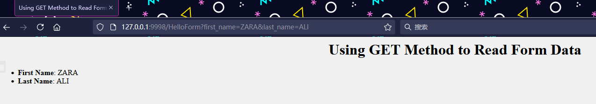
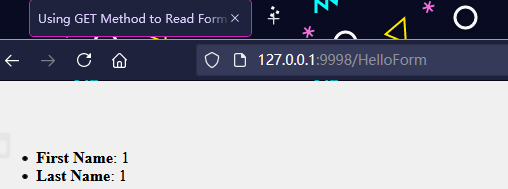
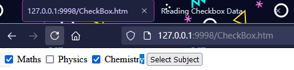
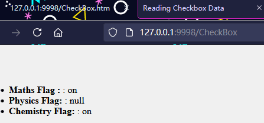
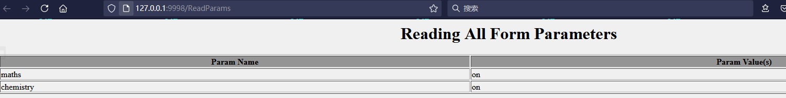
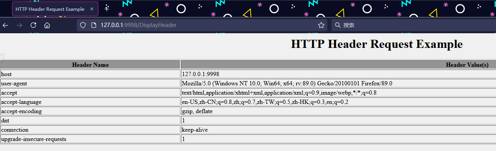
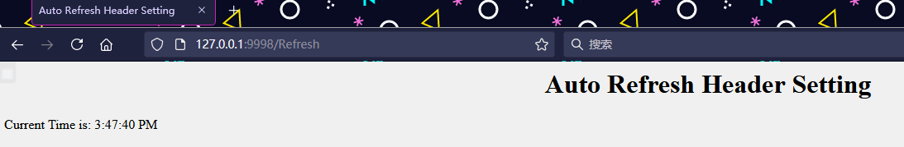
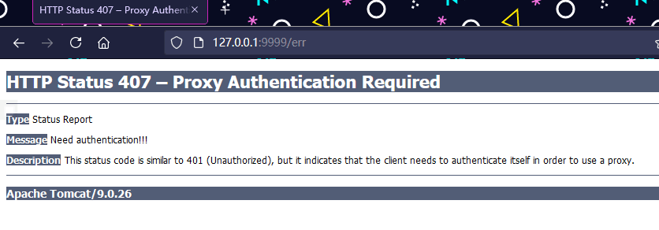
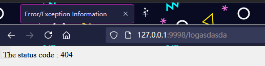

# servlet-2

---

## 表单数据

当你需要从浏览器到 Web 服务器传递一些信息并最终传回到后台程序时，你一定遇到了许多情况。浏览器使用两种方法向 Web 服务器传递信息。这些方法是 GET 方法和 POST 方法。

**GET 方法**

GET 方法向页面请求发送已编码的用户信息。页面和已编码的信息用 ? 字符分隔，如下所示：
- http://www.test.com/hello?key1=value1&key2=value2

GET 方法是从浏览器向 web 服务器传递信息的默认的方法，且它会在你的浏览器的地址栏中产生一个很长的字符串。如果你向服务器传递密码或其他敏感信息，请不要使用 GET 方法。GET 方法有大小限制：请求字符串中最多只能有 1024 个字符。

这些信息使用 QUERY_STRING 头传递，并通过 QUERY_STRING 环境变量访问，Servlet 使用 `doGet()` 方法处理这种类型的请求。

**POST 方法**

一般情况下，将信息传递给后台程序的一种更可靠的方法是 POST 方法。POST 方法打包信息的方式与 GET 方法相同，但是 POST 方法不是把信息作为 URL 中 ? 字符之后的文本字符串进行发送，而是把它作为一个单独的消息发送。消息以标准输出的形式传到后台程序，你可以在你的处理过程中解析并使用这些标准输出。Servlet 使用 `doPost()` 方法处理这种类型的请求。

使用 Servlet 读取表单数据

Servlet 以自动解析的方式处理表单数据，根据不同的情况使用如下不同的方法：
* getParameter()：你可以调用 request.getParameter() 方法来获取表单参数的值。
* getParameterValues()：如果参数出现不止一次，那么调用该方法并返回多个值，例如复选框。
* getParameterNames()：如果你想要得到一个当前请求的所有参数的完整列表，那么调用该方法。

### 使用 URL 的 GET 方法实例

这是一个简单的 URL，使用 GET 方法将两个值传递给 HelloForm 程序。
- http://localhost:8080/HelloForm?first_name=ZARA&last_name=ALI

下面是 HelloForm.java servlet 程序，处理由 web 浏览器给定的输入。我们将使用 getParameter() 方法，使访问传递的信息变得非常容易：
```java
// Import required java libraries
import java.io.*;
import javax.servlet.*;
import javax.servlet.http.*;
// Extend HttpServlet class
public class HelloForm extends HttpServlet {
  public void doGet(HttpServletRequest request,
                    HttpServletResponse response)
            throws ServletException, IOException
  {
      // Set response content type
      response.setContentType("text/html");
      PrintWriter out = response.getWriter();
      String title = "Using GET Method to Read Form Data";
      String docType =
      "<!doctype html public \"-//w3c//dtd html 4.0 " +
      "transitional//en\">\n";
      out.println(docType +
                "<html>\n" +
                "<head><title>" + title + "</title></head>\n" +
                "<body bgcolor=\"#f0f0f0\">\n" +
                "<h1 align=\"center\">" + title + "</h1>\n" +
                "<ul>\n" +
                "  <li><b>First Name</b>: "
                + request.getParameter("first_name") + "\n" +
                "  <li><b>Last Name</b>: "
                + request.getParameter("last_name") + "\n" +
                "</ul>\n" +
                "</body></html>");
  }
}
```

在 web.xml 文件中创建以下条目：
```xml
    <servlet>
        <servlet-name>HelloForm</servlet-name>
        <servlet-class>HelloForm</servlet-class>
    </servlet>
    <servlet-mapping>
        <servlet-name>HelloForm</servlet-name>
        <url-pattern>/HelloForm</url-pattern>
    </servlet-mapping>
```
现在在你浏览器的地址栏中输入 http://localhost:8080/HelloForm?first_name=ZARA&last_name=ALI ，并在浏览器中触发上述命令之前，确保你已经启动 Tomcat 服务器。这将产生如下所示的结果：



### 使用表单的 GET 方法实例

下面是一个简单的实例，使用 HTML 表单和提交按钮传递两个值。我们将使用相同的 Servlet HelloForm 来处理这个输入。

```html
<html>
<body>
<form action="HelloForm" method="GET">
First Name: <input type="text" name="first_name">
<br />
Last Name: <input type="text" name="last_name" />
<input type="submit" value="Submit" />
</form>
</body>
</html>
```

将这个 HTML 保存到 hello.htm 文件中，并把它放在 /webapps/ROOT 目录下。当你访问 http://localhost:8080/Hello.htm 时，下面是上述表单的实际输出。


尝试输入姓名，然后点击提交按钮来在 tomcat 运行的本地计算机上查看结果。基于提供的输入，它会产生与上述例子中相似的结果。

### 使用表单的 POST 方法实例

让我们对上述 servlet 做一点修改，以便它可以处理 GET 方法和 POST 方法。下面是 HelloForm.java servlet 程序，使用 GET 和 POST 方法处理由 web 浏览器给出的输入。
```java
// Import required java libraries
import java.io.*;
import javax.servlet.*;
import javax.servlet.http.*;
// Extend HttpServlet class
public class HelloForm extends HttpServlet {
  public void doGet(HttpServletRequest request,
                    HttpServletResponse response)
            throws ServletException, IOException
  {
      // Set response content type
      response.setContentType("text/html");
      PrintWriter out = response.getWriter();
      String title = "Using GET Method to Read Form Data";
      String docType =
      "<!doctype html public \"-//w3c//dtd html 4.0 " +
      "transitional//en\">\n";
      out.println(docType +
                "<html>\n" +
                "<head><title>" + title + "</title></head>\n" +
                "<body bgcolor=\"#f0f0f0\">\n" +
                "<h1 align=\"center\">" + title + "</h1>\n" +
                "<ul>\n" +
                "  <li><b>First Name</b>: "
                + request.getParameter("first_name") + "\n" +
                "  <li><b>Last Name</b>: "
                + request.getParameter("last_name") + "\n" +
                "</ul>\n" +
                "</body></html>");
  }
  // Method to handle POST method request.
  public void doPost(HttpServletRequest request,
                     HttpServletResponse response)
      throws ServletException, IOException {
     doGet(request, response);
  }
}
```

现在编译，部署上述 Servlet，并使用带有 POST 方法的 Hello.htm 测试它，如下所示：
```html
<html>
<body>
<form action="HelloForm" method="POST">
First Name: <input type="text" name="first_name">
<br />
Last Name: <input type="text" name="last_name" />
<input type="submit" value="Submit" />
</form>
</body>
</html>
```
这是上述表单的实际输出，尝试输入姓名，然后点击提交按钮，在 tomcat 运行的本地计算机上查看结果。



### 将复选框数据传递到 Servlet 程序

这是一个 HTML 代码实例，CheckBox.htm，一个表单带有两个复选框。
```html
<html>
<body>
<form action="CheckBox" method="POST" target="_blank">
<input type="checkbox" name="maths" checked="checked" /> Maths
<input type="checkbox" name="physics"  /> Physics
<input type="checkbox" name="chemistry" checked="checked" />
                                                Chemistry
<input type="submit" value="Select Subject" />
</form>
</body>
</html>
```

下面是 CheckBox.java servlet 程序，来为复选框按钮处理 web 浏览器给定的输入。
```java
// Import required java libraries
import java.io.*;
import javax.servlet.*;
import javax.servlet.http.*;
// Extend HttpServlet class
public class CheckBox extends HttpServlet {
  // Method to handle GET method request.
  public void doGet(HttpServletRequest request,
                    HttpServletResponse response)
            throws ServletException, IOException
  {
      // Set response content type
      response.setContentType("text/html");
      PrintWriter out = response.getWriter();
      String title = "Reading Checkbox Data";
      String docType =
      "<!doctype html public \"-//w3c//dtd html 4.0 " +
      "transitional//en\">\n";
      out.println(docType +
                "<html>\n" +
                "<head><title>" + title + "</title></head>\n" +
                "<body bgcolor=\"#f0f0f0\">\n" +
                "<h1 align=\"center\">" + title + "</h1>\n" +
                "<ul>\n" +
                "  <li><b>Maths Flag : </b>: "
                + request.getParameter("maths") + "\n" +
                "  <li><b>Physics Flag: </b>: "
                + request.getParameter("physics") + "\n" +
                "  <li><b>Chemistry Flag: </b>: "
                + request.getParameter("chemistry") + "\n" +
                "</ul>\n" +
                "</body></html>");
  }
  // Method to handle POST method request.
  public void doPost(HttpServletRequest request,
                     HttpServletResponse response)
      throws ServletException, IOException {
     doGet(request, response);
  }
}
```





---

### 读取所有的表单参数

以下是使用 HttpServletRequest 的 `getParameterNames()` 方法的通用实例来读取所有可用的表单参数。该方法返回一个枚举，包含了未指定顺序的参数名称。

一旦我们得到一个枚举，我们可以以标准方式循环这个枚举，使用 `hasMoreElements()` 方法来确定何时停止循环，使用 `nextElement()` 方法来获取每个参数的名称。

```java
// Import required java libraries
import java.io.*;
import javax.servlet.*;
import javax.servlet.http.*;
import java.util.*;
// Extend HttpServlet class
public class ReadParams extends HttpServlet {
  // Method to handle GET method request.
  public void doGet(HttpServletRequest request,
                    HttpServletResponse response)
            throws ServletException, IOException
  {
      // Set response content type
      response.setContentType("text/html");
      PrintWriter out = response.getWriter();
      String title = "Reading All Form Parameters";
      String docType =
      "<!doctype html public \"-//w3c//dtd html 4.0 " +
      "transitional//en\">\n";
      out.println(docType +
        "<html>\n" +
        "<head><title>" + title + "</title></head>\n" +
        "<body bgcolor=\"#f0f0f0\">\n" +
        "<h1 align=\"center\">" + title + "</h1>\n" +
        "<table width=\"100%\" border=\"1\" align=\"center\">\n" +
        "<tr bgcolor=\"#949494\">\n" +
        "<th>Param Name</th><th>Param Value(s)</th>\n"+
        "</tr>\n");
      Enumeration paramNames = request.getParameterNames();
      while(paramNames.hasMoreElements()) {
         String paramName = (String)paramNames.nextElement();
         out.print("<tr><td>" + paramName + "</td>\n<td>");
         String[] paramValues =
                request.getParameterValues(paramName);
         // Read single valued data
         if (paramValues.length == 1) {
           String paramValue = paramValues[0];
           if (paramValue.length() == 0)
             out.println("<i>No Value</i>");
           else
             out.println(paramValue);
         } else {
             // Read multiple valued data
             out.println("<ul>");
             for(int i=0; i < paramValues.length; i++) {
                out.println("<li>" + paramValues[i]);
             }
             out.println("</ul>");
         }
      }
      out.println("</tr>\n</table>\n</body></html>");
  }
  // Method to handle POST method request.
  public void doPost(HttpServletRequest request,
                     HttpServletResponse response)
      throws ServletException, IOException {
     doGet(request, response);
  }
}
```

现在，用下面的表单尝试上述 servlet：

```html
<html>
<body>
<form action="ReadParams" method="POST" target="_blank">
<input type="checkbox" name="maths" checked="checked" /> Maths
<input type="checkbox" name="physics"  /> Physics
<input type="checkbox" name="chemistry" checked="checked" /> Chem
<input type="submit" value="Select Subject" />
</form>
</body>
</html>
```

现在使用上述表单调用 servlet 将产生如下所示结果：




---

## 客户端 HTTP 请求

当浏览器请求网页时，它会向 web 服务器发送大量信息，这些信息不能被直接读取，因为这些信息是作为 HTTP 请求头的一部分行进的。

下述方法可以用于读取 servlet 程序中的 HTTP 头信息。通过 HttpServletRequest 对象这些方法是可用的。

```
Cookie[] getCookies()
返回一个数组，包含客户端发送该请求的所有的 Cookie 对象。
```
```
Enumeration getAttributeNames()
返回一个枚举，包含提供给该请求可用的属性名称。
```
```
Enumeration getHeaderNames()
返回一个枚举，包含在该请求中包含的所有的头名。
```
```
Enumeration getParameterNames()
返回一个 String 对象的枚举，包含在该请求中包含的参数的名称。
```
```
HttpSession getSession()
返回与该请求关联的当前 session 会话，或者如果请求没有 session 会话，则创建一个。
```
```
HttpSession getSession(boolean create)
返回与该请求关联的当前 HttpSession，或者如果没有当前会话，且创建是真的，则返回一个新的 session 会话。
```
```
Locale getLocale()
基于 Accept-Language 头，返回客户端接受内容的首选的区域设置。
```
```
Object getAttribute(String name)
以对象形式返回已命名属性的值，如果没有给定名称的属性存在，则返回 null。
```
```
ServletInputStream getInputStream()
使用 ServletInputStream，以二进制数据形式检索请求的主体。
```
```
String getAuthType()
返回用于保护 Servlet 的身份验证方案的名称，例如，“BASIC” 或 “SSL”，如果JSP没有受到保护则返回 null。
```
```
String getCharacterEncoding()
返回请求主体中使用的字符编码的名称。
```
```
String getContentType()
返回请求主体的 MIME 类型，如果不知道类型则返回 null。
```
```
String getContextPath()
返回指示请求上下文的请求 URI 部分。
```
```
String getHeader(String name)
以字符串形式返回指定的请求头的值。
```
```
String getMethod()
返回请求的 HTTP 方法的名称，例如，GET、POST 或 PUT。
```
```
String getParameter(String name)
以字符串形式返回请求参数的值，或者如果参数不存在则返回 null。
```
```
String getPathInfo()
当请求发出时，返回与客户端发送的 URL 相关的任何额外的路径信息。
```
```
String getProtocol()
返回请求协议的名称和版本。
```
```
String getQueryString()
返回包含在路径后的请求 URL 中的查询字符串。
```
```
String getRemoteAddr()
返回发送请求的客户端的互联网协议（IP）地址。
```
```
String getRemoteHost()
返回发送请求的客户端的完全限定名称。
```
```
String getRemoteUser()
如果用户已通过身份验证，则返回发出请求的登录用户，或者如果用户未通过身份验证，则返回 null。
```
```
String getRequestURI()
从协议名称直到 HTTP 请求的第一行的查询字符串中，返回该请求的 URL 的一部分。
```
```
String getRequestedSessionId()
返回由客户端指定的 session 会话 ID。
```
```
String getServletPath()
返回调用 JSP 的请求的 URL 的一部分。
```
```
String[] getParameterValues(String name)
返回一个字符串对象的数组，包含所有给定的请求参数的值，如果参数不存在则返回 null。
```
```
boolean isSecure()
返回一个布尔值，指示请求是否使用安全通道，如 HTTPS。
```
```
int getContentLength()
以字节为单位返回请求主体的长度，并提供输入流，或者如果长度未知则返回 -1。
```
```
int getIntHeader(String name)
返回指定的请求头的值为一个 int 值。
```
```
int getServerPort()
返回接收到这个请求的端口号。
```

下述例子使用了 HttpServletRequest 的 `getHeaderNames()` 方法来读取 HTTP 头信息。该方法返回了一个枚举，包含与当前的 HTTP 请求相关的头信息。

一旦我们得到一个枚举，我们可以以标准方式循环这个枚举，使用 `hasMoreElements()` 方法来确定何时停止循环，使用 `nextElement()` 方法来获取每个参数的名称。

```java
// Import required java libraries
import java.io.*;
import javax.servlet.*;
import javax.servlet.http.*;
import java.util.*;
// Extend HttpServlet class
import javax.servlet.annotation.WebServlet;
// Extend HttpServlet class

@WebServlet(urlPatterns = "/DisplayHeader")
public class DisplayHeader extends HttpServlet {
  // Method to handle GET method request.
  public void doGet(HttpServletRequest request,
                    HttpServletResponse response)
            throws ServletException, IOException
  {
      // Set response content type
      response.setContentType("text/html"); 
      PrintWriter out = response.getWriter();
      String title = "HTTP Header Request Example";
      String docType =
      "<!doctype html public \"-//w3c//dtd html 4.0 " +
      "transitional//en\">\n";
      out.println(docType +
        "<html>\n" +
        "<head><title>" + title + "</title></head>\n"+
        "<body bgcolor=\"#f0f0f0\">\n" +
        "<h1 align=\"center\">" + title + "</h1>\n" +
        "<table width=\"100%\" border=\"1\" align=\"center\">\n" +
        "<tr bgcolor=\"#949494\">\n" +
        "<th>Header Name</th><th>Header Value(s)</th>\n"+
        "</tr>\n"); 
      Enumeration headerNames = request.getHeaderNames();
      while(headerNames.hasMoreElements()) {
         String paramName = (String)headerNames.nextElement();
         out.print("<tr><td>" + paramName + "</td>\n");
         String paramValue = request.getHeader(paramName);
         out.println("<td> " + paramValue + "</td></tr>\n");
      }
      out.println("</table>\n</body></html>");
  }
  // Method to handle POST method request.
  public void doPost(HttpServletRequest request,
                     HttpServletResponse response)
      throws ServletException, IOException {
     doGet(request, response);
  }
}
```

现在，调用上述 servlet 会产生如下所示的结果：



---

## 服务器 HTTP 响应

正如在前面的章节中讨论的一样，当一个 Web 服务器对浏览器响应一个 HTTP 请求时，响应通常包括一个状态行、一些响应头信息、一个空行和文档。一个典型的响应如下所示：

```
HTTP/1.1 200 OK
Content-Type: text/html
Header2: ...
...
HeaderN: ...
  (Blank Line)
<!doctype ...>
<html>
<head>...</head>
<body>
...
</body>
</html>
```

状态行包括 HTTP 版本（例子中的 HTTP/1.1）、一个状态码（例子中的 200）和一个对应于状态码的短消息（例子中的 OK）。

下面的方法可用于在 servlet 程序中设置 HTTP 响应头信息。通过 HttpServletResponse 对象这些方法是可用的。

```
String encodeRedirectURL(String url)
为 sendRedirect 方法中使用的指定的 URL 进行编码，或者如果编码不是必需的，则返回 URL 未改变。
```
```
String encodeURL(String url)
对包含 session 会话 ID 的指定 URL 进行编码，或者如果编码不是必需的，则返回 URL 未改变。
```
```
boolean containsHeader(String name)
返回一个布尔值，指示是否已经设置已命名的响应头信息。
```
```
boolean isCommitted()
返回一个布尔值，指示响应是否已经提交。
```
```
void addCookie(Cookie cookie)
把指定的 cookie 添加到响应。
```
```
void addDateHeader(String name, long date)
添加一个带有给定的名称和日期值的响应头信息。
```
```
void addHeader(String name, String value)
添加一个带有给定的名称和值的响应头信息。
```
```
void addIntHeader(String name, int value)
添加一个带有给定的名称和整数值的响应头信息。
```
```
void flushBuffer()
强制任何在缓冲区中的内容被写入到客户端。
```
```
void reset()
清除缓冲区中存在的任何数据，包括状态码和头信息。
```
```
void resetBuffer()
清除响应中基础缓冲区的内容，不清除状态码和头信息。
```
```
void sendError(int sc)
使用指定的状态码发送错误响应到客户端，并清除缓冲区。
```
```
void sendError(int sc, String msg)
使用指定的状态发送错误响应到客户端。
```
```
void sendRedirect(String location)
使用指定的重定向位置 URL 发送临时重定向响应到客户端。
```
```
void setBufferSize(int size)
为响应主体设置首选的缓冲区大小。
```
```
void setCharacterEncoding(String charset)
设置被发送到客户端的响应的字符编码（MIME 字符集）例如，UTF-8。
```
```
void setContentLength(int len)
设置在 HTTP Servlet 响应中的内容主体的长度，该方法设置 HTTP Content-Length 头信息。
```
```
void setContentType(String type)
如果响应还未被提交，设置被发送到客户端的响应的内容类型。
```
```
void setDateHeader(String name, long date)
设置一个带有给定的名称和日期值的响应头信息。
```
```
void setHeader(String name, String value)
设置一个带有给定的名称和值的响应头信息。
```
```
void setIntHeader(String name, int value)
设置一个带有给定的名称和整数值的响应头信息。
```
```
void setLocale(Locale loc)
如果响应还未被提交，设置响应的区域。
```
```
void setStatus(int sc)
为该响应设置状态码。
```

在前面的实例中你已经了解了 `setContentType()` 方法的工作方式，下面的实例也会用到同样的方法，此外，我们会用 `setIntHeader()` 方法来设置 Refresh 头信息。

```java
// Import required java libraries
import java.io.*;
import javax.servlet.*;
import javax.servlet.annotation.WebServlet;
import javax.servlet.http.*;
import java.util.*;
// Extend HttpServlet class

@WebServlet(urlPatterns = "/Refresh")
public class Refresh extends HttpServlet {
  // Method to handle GET method request.
  public void doGet(HttpServletRequest request,
                    HttpServletResponse response)
            throws ServletException, IOException
  {
      // Set refresh, autoload time as 5 seconds
      response.setIntHeader("Refresh", 5);
      // Set response content type
      response.setContentType("text/html");
      // Get current time
      Calendar calendar = new GregorianCalendar();
      String am_pm;
      int hour = calendar.get(Calendar.HOUR);
      int minute = calendar.get(Calendar.MINUTE);
      int second = calendar.get(Calendar.SECOND);
      if(calendar.get(Calendar.AM_PM) == 0)
        am_pm = "AM";
      else
        am_pm = "PM"; 
      String CT = hour+":"+ minute +":"+ second +" "+ am_pm;
      PrintWriter out = response.getWriter();
      String title = "Auto Refresh Header Setting";
      String docType =
      "<!doctype html public \"-//w3c//dtd html 4.0 " +
      "transitional//en\">\n";
      out.println(docType +
        "<html>\n" +
        "<head><title>" + title + "</title></head>\n"+
        "<body bgcolor=\"#f0f0f0\">\n" +
        "<h1 align=\"center\">" + title + "</h1>\n" +
        "<p>Current Time is: " + CT + "</p>\n");
  }
  // Method to handle POST method request.
  public void doPost(HttpServletRequest request,
                     HttpServletResponse response)
      throws ServletException, IOException {
     doGet(request, response);
  }
}
```

现在调用上述 servlet，每 5 秒后就会显示当前的系统时间，如下所示。运行 servlet 并等着看结果：



---

## HTTP 状态码

HTTP 状态码相关知识见 [HTTP状态码](../../Web/HTTP/HTTP状态码.md)

下面是在 servlet 程序中可以用于设置 HTTP 状态码的方法。通过 HttpServletResponse 对象这些方法是可用的。

java
public void setStatus ( int statusCode )
该方法设置一个任意的状态码。setStatus 方法接受一个 int（状态码）作为参数。如果您的反应包含了一个特殊的状态码和文档，请确保在使用 PrintWriter 实际返回任何内容之前调用 setStatus。
```

```java
public void sendRedirect(String url)
该方法生成一个 302 响应，连同一个带有新文档 URL 的 Location 头。
```

```java
public void sendError(int code, String message)
该方法发送一个状态码（通常为 404），连同一个在 HTML 文档内部自动格式化并发送到客户端的短消息。
```

HTTP 状态码实例：
下述例子将发送 407 错误代码到客户端浏览器，且浏览器会向你显示 “需要身份验证！！！”的消息。
```java
// Import required java libraries
import java.io.*;
import javax.servlet.*;
import javax.servlet.http.*;
import java.util.*;
// Extend HttpServlet class

@WebServlet(urlPatterns = "/err")
public class showError extends HttpServlet {
  // Method to handle GET method request.
  public void doGet(HttpServletRequest request,
                    HttpServletResponse response)
            throws ServletException, IOException
  {
      // Set error code and reason.
      response.sendError(407, "Need authentication!!!" );
  }
  // Method to handle POST method request.
  public void doPost(HttpServletRequest request,
                     HttpServletResponse response)
      throws ServletException, IOException {
     doGet(request, response);
  }
}
```



---

## 过滤器

Servlet 过滤器是 Java 类，可用于 Servlet 编程中的下述目的：
* 在它们访问后端资源之前，拦截这些来自客户端的请求。
* 在它们发送回客户端之前，处理这些来自服务器端的响应。

这是规范建议的各种类型的过滤器：
* 身份验证过滤器。
* 数据压缩过滤器。
* 加密过滤器。
* 触发访问事件资源的过滤器。
* 图像转换过滤器。
* 日志记录和审核过滤器。
* MIME-类型链过滤器。
* Tokenizing 过滤器。
* 转换 XML 内容的 XSL/T 过滤器。

过滤器在部署描述符文件 web.xml 中被部署，然后被映射到 servlet 名称或你的应用程序的部署描述符中的 URL 模式。

当 web 容器启动你的 web 应用程序时，它会为每个在部署描述符中已声明的过滤器创建一个实例。过滤器按照它们在部署描述符中声明的顺序执行。

过滤器仅仅是一个实现了 javax.servlet.Filter 接口的 Java 类。javax.servlet.Filter 接口定义了三种方法：

```java
public void doFilter (ServletRequest, ServletResponse, FilterChain)
该方法在每次一个请求/响应对因客户端在链的末端请求资源而通过链传递时由容器调用。
```

```java
public void init(FilterConfig filterConfig)
该方法由 Web 容器调用，指示一个过滤器被放入服务。
```

```java
public void destroy()
该方法由 Web 容器调用，指示一个过滤器从服务被去除。
```

Servlet 过滤器实例

以下是 Servlet 过滤器的实例，将输出客户端的 IP 地址和当前的日期时间。这个例子使你对 Servlet 过滤器有了基本的了解，但是你可以使用相同的概念编写更复杂的过滤器应用程序：

```java
// Import required java libraries
import java.io.*;
import javax.servlet.*;
import javax.servlet.http.*;
import java.util.*;
// Implements Filter class
public class LogFilter implements Filter  {
   public void  init(FilterConfig config)
                         throws ServletException{
      // Get init parameter
      String testParam = config.getInitParameter("test-param");
      //Print the init parameter
      System.out.println("Test Param: " + testParam);
   }
   public void  doFilter(ServletRequest request,
                 ServletResponse response,
                 FilterChain chain)
                 throws java.io.IOException, ServletException {
      // Get the IP address of client machine.
      String ipAddress = request.getRemoteAddr();
      // Log the IP address and current timestamp.
      System.out.println("IP "+ ipAddress + ", Time "
                                       + new Date().toString());
      // Pass request back down the filter chain
      chain.doFilter(request,response);
   }
   public void destroy( ){
      /* Called before the Filter instance is removed
      from service by the web container*/
   }
}
```

---

## 异常处理

当一个 servlet 抛出一个异常时，web 容器在使用了 exception-type 元素的 web.xml 中搜索与抛出的异常类型相匹配的配置。

你必须在 web.xml 中使用 error-page 元素来指定 servlet 调用，作为对特定的异常或 HTTP 状态码作出的响应。

考虑这种情况，你有一个 ErrorHandler servelt，当任何已定义的异常或错误出现时就会被调用。以下是要在 web.xml 中创建的条目。
```xml
<!-- servlet definition -->
<servlet>
        <servlet-name>ErrorHandler</servlet-name>
        <servlet-class>ErrorHandler</servlet-class>
</servlet>
<!-- servlet mappings -->
<servlet-mapping>
        <servlet-name>ErrorHandler</servlet-name>
        <url-pattern>/ErrorHandler</url-pattern>
</servlet-mapping>

<!-- error-code related error pages -->
<error-page>
    <error-code>404</error-code>
    <location>/ErrorHandler</location>
</error-page>
<error-page>
    <error-code>403</error-code>
    <location>/ErrorHandler</location>
</error-page>

<!-- exception-type related error pages -->
<error-page>
    <exception-type>
          javax.servlet.ServletException
    </exception-type >
    <location>/ErrorHandler</location>
</error-page>

<error-page>
    <exception-type>java.io.IOException</exception-type >
    <location>/ErrorHandler</location>
</error-page>
```

如果你想对所有的异常有一个通用的错误处理程序，那么你应该定义如下所示的 error-page，而不是为每个异常定义单独的 error-page 元素：

```xml
<error-page>
    <exception-type>java.lang.Throwable</exception-type >
    <location>/ErrorHandler</location>
</error-page>
```

以下是异常处理中有关上述 web.xml 需要注意的点：
* Servelt ErrorHandler 与其他的 servelt 的定义方式一样，且在 web.xml 中配置。
* 如果状态码有任何错误出现，不管是 404（未找到）还是 403（禁止），那么 ErrorHandler servlet 会被调用。
* 如果 web 应用程序抛出 ServletException 或 IOException，那么 web 容器就会调用 /ErrorHandler servlet。
* 你可以定义不同的错误处理程序来处理不同类型的错误或异常。上述例子非常通用，希望它达到了让你理解基本概念的目的。

以下是错误处理 servlet 可以访问的请求属性列表，用来分析错误/异常的性质。

```
javax.servlet.error.status_code
该属性给出状态码，状态码可被存储，并在存储为 java.lang.Integer 数据类型后可被分析。
```

```
javax.servlet.error.exception_type
该属性给出异常类型的信息，异常类型可被存储，并在存储为 java.lang.Class 数据类型后可被分析。
```

```
javax.servlet.error.message
该属性给出确切错误消息的信息，信息可被存储，并在存储为 java.lang.String 数据类型后可被分析。
```

```
javax.servlet.error.request_uri
该属性给出有关 URL 调用 Servlet 的信息，信息可被存储，并在存储为 java.lang.String 数据类型后可被分析。
```

```
javax.servlet.error.exception
该属性给出异常产生的信息，信息可被存储，并在存储为 java.lang.Throwable 数据类型后可被分析。
```

```
javax.servlet.error.servlet_name
该属性给出 servlet 的名称，名称可被存储，并在存储为 java.lang.String 数据类型后可被分析。
```

以下是 Servlet 实例，用于任何你定义的 servlet 出现任何错误或异常时的情况。

这个例子让你对 Servlet 中的异常处理有了基本的了解，但是你可以使用相同的概念编写更复杂的异常处理应用程序：
```java
// Import required java libraries
import java.io.*;
import javax.servlet.*;
import javax.servlet.http.*;
import java.util.*;
// Extend HttpServlet class
@WebServlet(urlPatterns = "/ErrorHandler")
public class ErrorHandler extends HttpServlet {
  // Method to handle GET method request.
  public void doGet(HttpServletRequest request,
                    HttpServletResponse response)
            throws ServletException, IOException
  {
      // Analyze the servlet exception
      Throwable throwable = (Throwable)
      request.getAttribute("javax.servlet.error.exception");
      Integer statusCode = (Integer)
      request.getAttribute("javax.servlet.error.status_code");
      String servletName = (String)
      request.getAttribute("javax.servlet.error.servlet_name");
      if (servletName == null){
         servletName = "Unknown";
      }
      String requestUri = (String)
      request.getAttribute("javax.servlet.error.request_uri");
      if (requestUri == null){
         requestUri = "Unknown";
      }
      // Set response content type
      response.setContentType("text/html");
      PrintWriter out = response.getWriter();
      String title = "Error/Exception Information";
      String docType =
      "<!doctype html public \"-//w3c//dtd html 4.0 " +
      "transitional//en\">\n";
      out.println(docType +
        "<html>\n" +
        "<head><title>" + title + "</title></head>\n" +
        "<body bgcolor=\"#f0f0f0\">\n");
      if (throwable == null && statusCode == null){
         out.println("<h2>Error information is missing</h2>");
         out.println("Please return to the <a href=\"" +
           response.encodeURL("http://localhost:8080/") +
           "\">Home Page</a>.");
      }else if (statusCode != null){
         out.println("The status code : " + statusCode);
      }else{
         out.println("<h2>Error information</h2>");
         out.println("Servlet Name : " + servletName +
                             "</br></br>");
         out.println("Exception Type : " +
                             throwable.getClass( ).getName( ) +
                             "</br></br>");
         out.println("The request URI: " + requestUri +
                             "<br><br>");
         out.println("The exception message: " +
                                 throwable.getMessage( ));
      }
      out.println("</body>");
      out.println("</html>");
  }
  // Method to handle POST method request.
  public void doPost(HttpServletRequest request,
                     HttpServletResponse response)
      throws ServletException, IOException {
     doGet(request, response);
  }
}
```

以常用的方式编译 ErrorHandler.java 并把你的类文件放入/webapps/ROOT/WEB-INF/classes 中。

让我们将下述配置添加到 web.xml 文件中来处理异常：
```xml
<servlet>
        <servlet-name>ErrorHandler</servlet-name>
        <servlet-class>ErrorHandler</servlet-class>
</servlet>
<!-- servlet mappings -->
<servlet-mapping>
        <servlet-name>ErrorHandler</servlet-name>
        <url-pattern>/ErrorHandler</url-pattern>
</servlet-mapping>
<error-page>
    <error-code>404</error-code>
    <location>/ErrorHandler</location>
</error-page>
<error-page>
    <exception-type>java.lang.Throwable</exception-type >
    <location>/ErrorHandler</location>
</error-page>
```

现在，尝试使用一个会产生任何异常的 servlet 或者输入一个错误的 URL，这将触发 Web 容器调用 ErrorHandler servlet 并显示适当的消息。例如，如果你输入了一个错误的 URL，那么它将显示如下所示的结果：
```
The status code : 404
```
上述代码在一些 web 浏览器中可能无法工作。因此请尝试使用 Mozilla 和 Safari 浏览器，这样上述代码应该能正常工作。



---

## Source & Reference

- https://wiki.jikexueyuan.com/project/servlet/writing-filters.html
- https://wiki.jikexueyuan.com/project/servlet/form-data.html
- https://wiki.jikexueyuan.com/project/servlet/cookies-handling.html
