# servlet-3

---

## Cookies 处理

Cookies 是存储在客户端计算机上的文本文件，用于各种信息的跟踪目的。Java Servlet 透明的支持 HTTP Cookies。

识别返回用户包括以下三个步骤：
* 服务器脚本向浏览器发送一组 cookies。例如姓名、年龄或身份证号码等。
* 浏览器将这些信息存储在本地计算机中以备将来使用。
* 当下次浏览器向 web 服务器发送任何请求时，它会把这些 cookies 信息发送到服务器，服务器使用这些信息来识别用户。

### Cookie 剖析

通常情况下，Cookies 设置在 HTTP 头信息中（尽管 JavaScript 也可以直接在浏览器上设置 cookie）。设置 cookie 的 servlet 可能会发送如下所示的头信息：

```
HTTP/1.1 200 OK
Date: Fri, 04 Feb 2000 21:03:38 GMT
Server: Apache/1.3.9 (UNIX) PHP/4.0b3
Set-Cookie: name=xyz; expires=Friday, 04-Feb-07 22:03:38 GMT;
                 path=/; domain=tutorialspoint.com
Connection: close
Content-Type: text/html
```

正如你所看到的，Set-Cookie 头信息包含了一个名称值对、一个 GMT 日期、一个路径和一个域。名称和值会被 URL 编码。有效期字段指示浏览器在给定的时间和日期之后“忘记”该 cookie。

如果浏览器被配置为存储 cookies，它将会把这个信息保留到截止日期。如果用户在任何与该 cookie 的路径和域匹配的页面点击浏览器，它就会将这个 cookie 重新发送到服务器。浏览器的头信息可能如下所示：

```
GET / HTTP/1.0
Connection: Keep-Alive
User-Agent: Mozilla/4.6 (X11; I; Linux 2.2.6-15apmac ppc)
Host: zink.demon.co.uk:1126
Accept: image/gif, */*
Accept-Encoding: gzip
Accept-Language: en
Accept-Charset: iso-8859-1,*,utf-8
Cookie: name=xyz
```

之后 servlet 就能够通过请求方法 `request.getCookies()` 访问 cookie，该方法将返回一个 Cookie 对象的数组。

### Servlet Cookies 方法

以下是在 servlet 中操作 cookies 时你可能会用到的有用的方法列表。

```
public void setDomain(String pattern)
该方法设置 cookie 适用的域，例如 tutorialspoint.com。
```
```
public String getDomain()
该方法获取 cookie 适用的域，例如 tutorialspoint.com。
```
```
public void setMaxAge(int expiry)
该方法设置 cookie 过期的时间（以秒为单位）。如果不这样设置，cookie 只会在当前 session 会话中持续有效。
```
```
public int getMaxAge()
该方法返回 cookie 的最大生存周期（以秒为单位），默认情况下，-1 表示 cookie 将持续下去，直到浏览器关闭。
```
```
public String getName()
该方法返回 cookie 的名称。名称在创建后不能改变。
```
```
public void setValue(String newValue)
该方法设置与 cookie 关联的值。
```
```
public String getValue()
该方法获取与 cookie 关联的值。
```
```
public void setPath(String uri)
该方法设置 cookie 适用的路径。如果您不指定路径，与当前页面相同目录下的（包括子目录下的）所有 URL 都会返回 cookie。
```
```
public String getPath()
该方法获取 cookie 适用的路径。
```
```
public void setSecure(boolean flag)
该方法设置布尔值，表示 cookie 是否应该只在加密的（即 SSL）连接上发送。
```
```
public void setComment(String purpose)
该方法规定了描述 cookie 目的的注释。该注释在浏览器向用户呈现 cookie 时非常有用。
```
```
public String getComment()
该方法返回了描述 cookie 目的的注释，如果 cookie 没有注释则返回 null。
```

### 用 Servlet 设置 Cookies

用 servlet 设置 cookies 包括三个步骤：

1. 创建一个 Cookie 对象：用 cookie 名和 cookie 值调用 Cookie 构造函数，cookie 名和 cookie 值都是字符串。

    ```java
    Cookie cookie = new Cookie("key","value");
    ```

    记住，无论是名字还是值，都不应该包含空格和以下任何字符：

    ```
    [ ] ( ) = , " / ? @ : ;
    ```

2. 设置最长有效期：你可以使用 setMaxAge 方法来指定 cookie 有效的时间（以秒为单位）。下面是设置了一个最长有效期为 24 小时的 cookie。

    ```java
    cookie.setMaxAge(60*60*24);
    ```

3. 发送 Cookie 到 HTTP 响应头：你可以使用 response.addCookie 来在 HTTP 响应头中添加 cookies，如下所示：

    ```java
    response.addCookie(cookie);
    ```

    让我们修改我们的 表单实例 来为姓名设置 cookies。

让我们修改我们的 表单实例 来为姓名设置 cookies。
```java
// Import required java libraries
import java.io.*;
import javax.servlet.*;
import javax.servlet.http.*;
// Extend HttpServlet class

@WebServlet(urlPatterns = "/HelloForm")
public class HelloForm extends HttpServlet {
  public void doGet(HttpServletRequest request,
                    HttpServletResponse response)
            throws ServletException, IOException
  {
      // Create cookies for first and last names.
      Cookie firstName = new Cookie("first_name",
                      request.getParameter("first_name"));
      Cookie lastName = new Cookie("last_name",
                      request.getParameter("last_name"));
      // Set expiry date after 24 Hrs for both the cookies.
      firstName.setMaxAge(60*60*24);
      lastName.setMaxAge(60*60*24);
      // Add both the cookies in the response header.
      response.addCookie( firstName );
      response.addCookie( lastName );
      // Set response content type
      response.setContentType("text/html");
      PrintWriter out = response.getWriter();
      String title = "Setting Cookies Example";
      String docType =
      "<!doctype html public \"-//w3c//dtd html 4.0 " +
      "transitional//en\">\n";
      out.println(docType +
                "<html>\n" +
                "<head><title>" + title + "</title></head>\n" +
                "<body bgcolor=\"#f0f0f0\">\n" +
                "<h1 align=\"center\">" + title + "</h1>\n" +
                "<ul>\n" +
                "  <li><b>First Name</b>: "
                + request.getParameter("first_name") + "\n" +
                "  <li><b>Last Name</b>: "
                + request.getParameter("last_name") + "\n" +
                "</ul>\n" +
                "</body></html>");
  }
}
```

编译上述 servlet HelloForm 并在 web.xml 文件中创建适当的条目，最后尝试使用下述 HTML 页面来调用 servlet。

```html
<html>
<body>
<form action="HelloForm" method="GET">
First Name: <input type="text" name="first_name">
<br />
Last Name: <input type="text" name="last_name" />
<input type="submit" value="Submit" />
</form>
</body>
</html>
```

将上述 HTML 内容保存到文件 hello.htm 中并把它放在 /webapps/ROOT 目录中。当你访问 http://localhost:8080/Hello.htm 时，上述表单的实际输出如下所示：

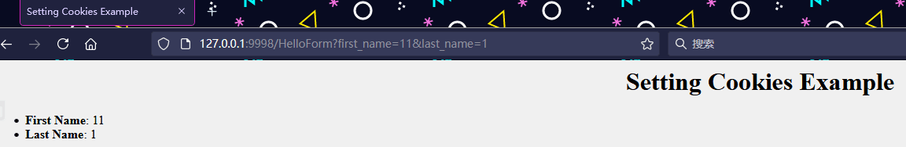

尝试输入姓名，然后点击提交按钮。这将在你的屏幕上显示姓名，同时会设置 firstName 和 lastName 这两个 cookies，当下次你点击提交按钮时，会将这两个 cookies 传回到服务器。

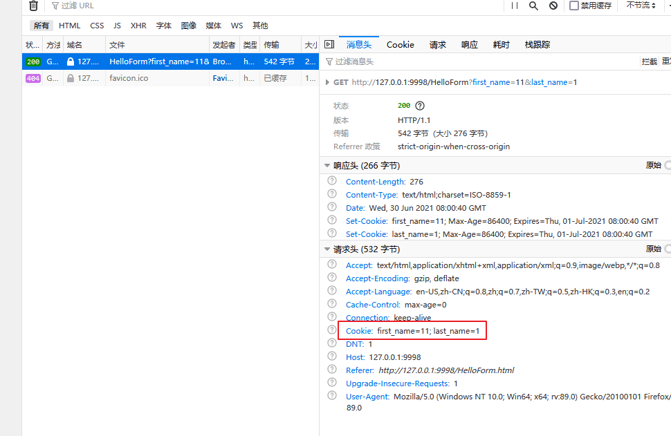

### 用 Servlet 读取 Cookies

要读取 cookies，你需要通过调用 HttpServletRequest 的 `getCookies()` 方法创建一个 javax.servlet.http.Cookie 对象的数组。然后循环遍历数组，并使用 `getName()` 和 `getValue()` 方法来访问每个 cookie 及其相关的值。

让我们读取上述例子中已经设置的 cookies：
```java
// Import required java libraries
import java.io.*;
import javax.servlet.*;
import javax.servlet.http.*;
// Extend HttpServlet class

@WebServlet(urlPatterns = "/ReadCookies")
public class ReadCookies extends HttpServlet {
  public void doGet(HttpServletRequest request,
                    HttpServletResponse response)
            throws ServletException, IOException
  {
      Cookie cookie = null;
      Cookie[] cookies = null;
      // Get an array of Cookies associated with this domain
      cookies = request.getCookies();
      // Set response content type
      response.setContentType("text/html");
      PrintWriter out = response.getWriter();
      String title = "Reading Cookies Example";
      String docType =
      "<!doctype html public \"-//w3c//dtd html 4.0 " +
      "transitional//en\">\n";
      out.println(docType +
                "<html>\n" +
                "<head><title>" + title + "</title></head>\n" +
                "<body bgcolor=\"#f0f0f0\">\n" );
      if( cookies != null ){
         out.println("<h2> Found Cookies Name and Value</h2>");
         for (int i = 0; i < cookies.length; i++){
            cookie = cookies[i];
            out.print("Name : " + cookie.getName( ) + ",  ");
            out.print("Value: " + cookie.getValue( )+" <br/>");
         }
      }else{
          out.println(
            "<h2>No cookies founds</h2>");
      }
      out.println("</body>");
      out.println("</html>");
   }
}
```

编译上述 servlet ReadCookies 并在 web.xml 文件中创建适当的条目。如果你已经设置了 first name cookie 为 “John”，last name cookie 为 “Player” ，那么尝试运行 http://localhost:8080/ReadCookies，将显示如下所示结果：

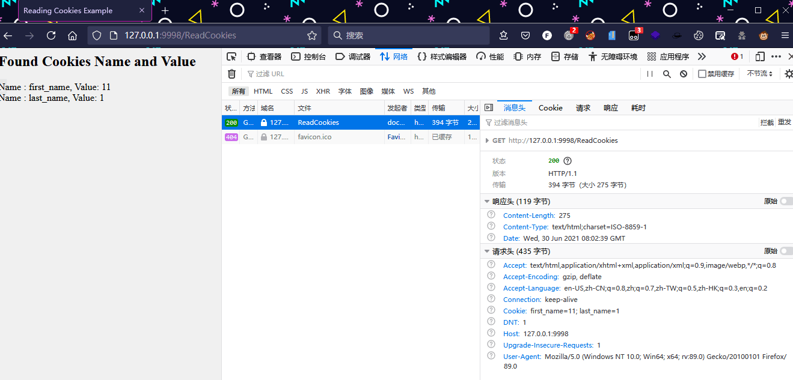

### 用 Servlet 删除 Cookies

删除 cookies 非常简单。如果你想删除一个 cookie，那么只需要按照如下所示的三个步骤进行：
* 读取一个现存的 cookie 并把它存储在 Cookie 对象中。
* 使用 `setMaxAge()` 方法设置 cookie 的年龄为零来删除一个现存的 cookie。
* 将这个 cookie 添加到响应z中。

下述例子将删除一个现存的命名为 “first name” 的 cookie，且当你下次运行 ReadCookies servlet 时，它会为 first name 返回空值。
```java
// Import required java libraries
import java.io.*;
import javax.servlet.*;
import javax.servlet.http.*;
// Extend HttpServlet class

@WebServlet(urlPatterns = "/DeleteCookies")
public class DeleteCookies extends HttpServlet {
  public void doGet(HttpServletRequest request,
                    HttpServletResponse response)
            throws ServletException, IOException
  {
      Cookie cookie = null;
      Cookie[] cookies = null;
      // Get an array of Cookies associated with this domain
      cookies = request.getCookies();
      // Set response content type
      response.setContentType("text/html");
      PrintWriter out = response.getWriter();
      String title = "Delete Cookies Example";
      String docType =
      "<!doctype html public \"-//w3c//dtd html 4.0 " +
      "transitional//en\">\n";
      out.println(docType +
                "<html>\n" +
                "<head><title>" + title + "</title></head>\n" +
                "<body bgcolor=\"#f0f0f0\">\n" );
       if( cookies != null ){
         out.println("<h2> Cookies Name and Value</h2>");
         for (int i = 0; i < cookies.length; i++){
            cookie = cookies[i];
            if((cookie.getName( )).compareTo("first_name") == 0 ){
                 cookie.setMaxAge(0);
                 response.addCookie(cookie);
                 out.print("Deleted cookie : " +
                              cookie.getName( ) + "<br/>");
            }
            out.print("Name : " + cookie.getName( ) + ",  ");
            out.print("Value: " + cookie.getValue( )+" <br/>");
         }
      }else{
          out.println(
            "<h2>No cookies founds</h2>");
      }
      out.println("</body>");
      out.println("</html>");
   }
}
```

编译上述 servlet DeleteCookies 并在 web.xml 文件中创建适当的条目。现在运行 http://localhost:8080/DeleteCookies，将显示如下所示的结果：

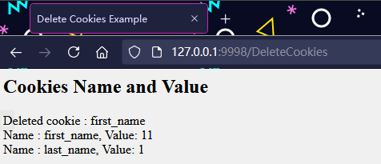

现在尝试运行 http://localhost:8080/ReadCookies，它将只显示一个 cookie，如下所示：


---

## 会话跟踪

HTTP 是一种“无状态”协议，这意味着每次客户端检索 Web 页面时，客户端打开一个单独的连接到 Web 服务器，服务器不会自动保存之前客户端请求的任何记录。

仍然有以下三种方式来维持 web 客户端和 web 服务器之间的会话：

### Cookies

一个 web 服务器可以分配一个唯一的会话 ID 作为每个 web 客户端的 cookie，并且对于来自客户端的后续请求，它们可以使用已接收的 cookie 来识别。

这可能不是一个有效的方法，因为很多时候浏览器不支持 cookie，所以我不建议使用这种方式来维持会话。

**隐藏的表单字段**

一个 web 服务器可以发送一个隐藏的 HTML 表单字段以及一个唯一的会话 ID，如下所示：

```html
<input type="hidden" name="sessionid" value="12345">
```

该条目意味着，当表单被提交时，指定的名称和值会被自动包含在 GET 或 POST 数据中。每次当 web 浏览器发送回请求时，`session_id` 的值可以用于跟踪不同的 web 浏览器。

这可能是保持会话跟踪的一种有效的方式，但是点击常规的 `<A HREF...>` 超文本链接不会导致表单提交，因此隐藏的表单字段也不支持常规的会话跟踪。

### URL 重写

你可以在每个标识会话的 URL 末尾追加一些额外的数据，且服务器会把该会话标识符与它已存储的有关会话的数据关联起来。

例如，http://aaa.com/file.htm;sessionid=12345，会话标识符被附加为 sessionid=12345，可能会在 web 服务器端被访问来识别客户端。

URL 重写是维持会话的一种更好的方式，当浏览器不支持 cookie 时为浏览器工作，但是它的缺点是会动态的生成每个 URL 来分配会话 ID，即使页面是简单的静态的 HTML 页面。

### HttpSession 对象

除了上述提到的三种方式，servlet 还提供了 HttpSession 接口，该接口提供了一种对网站的跨多个页面请求或访问的方法来识别用户并存储有关用户的信息。

Servlet 容器使用这个接口来创建在 HTTP 客户端和 HTTP 服务器之间的会话。会话在一个指定的时间段内持续，跨多个连接或来自用户的请求。

你可以通过调用 HttpServletRequest 的公共方法 `getSession()` 来获取 HttpSession 对象，如下所示：
```java
HttpSession session = request.getSession();
```
在向客户端发送任何文档内容之前，你需要调用 `request.getSession()`。这里是一些重要方法的总结，这些方法通过 HttpSession 对象是可用的：

```
public Object getAttribute(String name)
该方法返回在该 session 会话中具有指定名称的对象，如果没有指定名称的对象，则返回 null。
```
```
public Enumeration getAttributeNames()
该方法返回 String 对象的枚举，String 对象包含所有绑定到该 session 会话的对象的名称。
```
```
public long getCreationTime()
该方法返回该 session 会话被创建的时间，自格林尼治标准时间 1970 年 1 月 1 日凌晨零点算起，以毫秒为单位。
```
```
public String getId()
该方法返回一个包含分配给该 session 会话的唯一标识符的字符串。
```
```
public long getLastAccessedTime()
该方法返回客户端最后一次发送与该 session 会话相关的请求的时间自格林尼治标准时间 1970 年 1 月 1 日凌晨零点算起，以毫秒为单位。
```
```
public int getMaxInactiveInterval()
该方法返回 Servlet 容器在客户端访问时保持 session 会话打开的最大时间间隔，以秒为单位。
```
```
public void invalidate()
该方法指示该 session 会话无效，并解除绑定到它上面的任何对象。
```
```
public boolean isNew()
如果客户端还不知道该 session 会话，或者如果客户选择不参入该 session 会话，则该方法返回 true。
```
```
public void removeAttribute(String name)
该方法将从该 session 会话移除指定名称的对象。
```
```
public void setAttribute(String name, Object value)
该方法使用指定的名称绑定一个对象到该 session 会话。
```
```
public void setMaxInactiveInterval(int interval)
该方法在 Servlet 容器指示该 session 会话无效之前，指定客户端请求之间的时间，以秒为单位。
```

这个例子描述了如何使用 HttpSession 对象获取会话创建时间和上次访问的时间。如果不存在会话，我们将一个新的会话与请求联系起来。

```java
// Import required java libraries
import java.io.*;
import javax.servlet.*;
import javax.servlet.http.*;
import java.util.*;
// Extend HttpServlet class

@WebServlet(urlPatterns = "/SessionTrack")
public class SessionTrack extends HttpServlet {
  public void doGet(HttpServletRequest request,
                    HttpServletResponse response)
            throws ServletException, IOException
  {
      // Create a session object if it is already not  created.
      HttpSession session = request.getSession(true);
      // Get session creation time.
      Date createTime = new Date(session.getCreationTime());
      // Get last access time of this web page.
      Date lastAccessTime =
                        new Date(session.getLastAccessedTime());
      String title = "Welcome Back to my website";
      Integer visitCount = new Integer(0);
      String visitCountKey = new String("visitCount");
      String userIDKey = new String("userID");
      String userID = new String("ABCD");
      // Check if this is new comer on your web page.
      if (session.isNew()){
         title = "Welcome to my website";
         session.setAttribute(userIDKey, userID);
      } else {
         visitCount = (Integer)session.getAttribute(visitCountKey);
         visitCount = visitCount + 1;
         userID = (String)session.getAttribute(userIDKey);
      }
      session.setAttribute(visitCountKey,  visitCount);
      // Set response content type
      response.setContentType("text/html");
      PrintWriter out = response.getWriter();
      String docType =
      "<!doctype html public \"-//w3c//dtd html 4.0 " +
      "transitional//en\">\n";
      out.println(docType +
                "<html>\n" +
                "<head><title>" + title + "</title></head>\n" +
                "<body bgcolor=\"#f0f0f0\">\n" +
                "<h1 align=\"center\">" + title + "</h1>\n" +
                 "<h2 align=\"center\">Session Infomation</h2>\n" +
                "<table border=\"1\" align=\"center\">\n" +
                "<tr bgcolor=\"#949494\">\n" +
                "  <th>Session info</th><th>value</th></tr>\n" +
                "<tr>\n" +
                "  <td>id</td>\n" +
                "  <td>" + session.getId() + "</td></tr>\n" +
                "<tr>\n" +
                "  <td>Creation Time</td>\n" +
                "  <td>" + createTime +
                "  </td></tr>\n" +
                "<tr>\n" +
                "  <td>Time of Last Access</td>\n" +
                "  <td>" + lastAccessTime +
                "  </td></tr>\n" +
                "<tr>\n" +
                "  <td>User ID</td>\n" +
                "  <td>" + userID +
                "  </td></tr>\n" +
                "<tr>\n" +
                "  <td>Number of visits</td>\n" +
                "  <td>" + visitCount + "</td></tr>\n" +
                "</table>\n" +
                "</body></html>");
  }
}
```

编译上述 servlet SessionTrack 并在 web.xml 文件中创建适当的条目。在浏览器地址栏输入 http://localhost:8080/SessionTrack，当你第一次运行时将显示如下所示的结果：

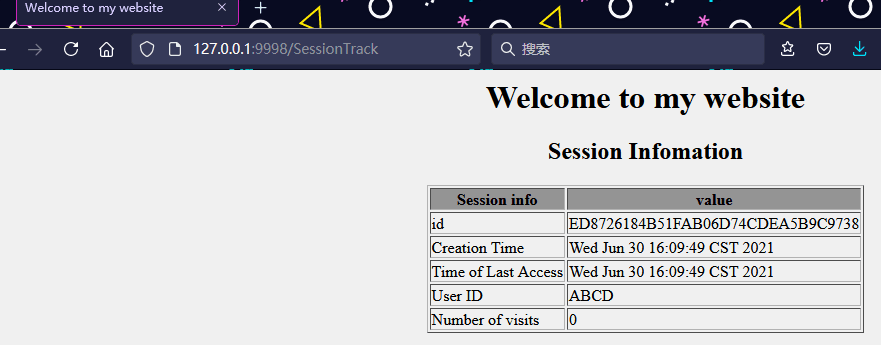

现在尝试再次运行相同的 servlet，它将显示如下所示的结果：

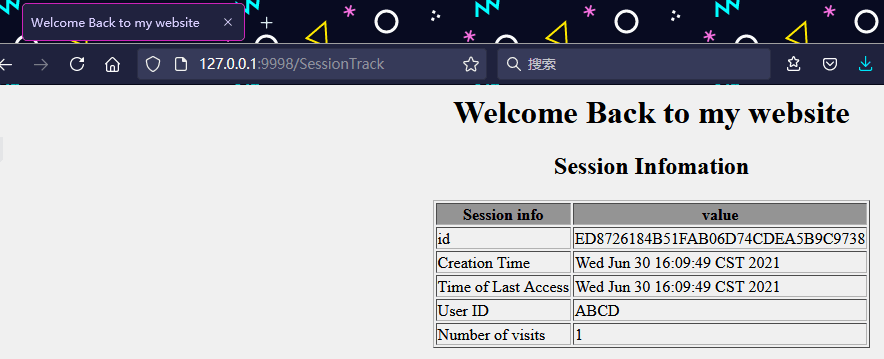

### 删除会话数据

当你完成了一个用户的会话数据，你有以下几种选择：
* 移除一个特定的属性：你可以调用 public void removeAttribute(String name) 方法来删除与特定的键相关联的值。
* 删除整个会话：你可以调用 public void invalidate() 方法来删除整个会话。
* 设置会话超时：你可以调用 public void setMaxInactiveInterval(int interval) 方法来单独设置会话超时。
* 注销用户：支持 servlet 2.4 的服务器，你可以调用 logout 来注销 Web 服务器的客户端，并把属于所有用户的所有会话设置为无效。

web.xml 配置：如果你使用的是 Tomcat，除了上述方法，你还可以在 web.xml 文件中配置会话超时，如下所示：
```xml
<session-config>
    <session-timeout>15</session-timeout>
</session-config>
```
超时时间是以分钟为单位的，并覆盖了 Tomcat 中默认的 30 分钟的超时时间。

Servlet 中的 `getMaxInactiveInterval()` 方法为会话返回的超时时间是以秒为单位的。所以如果在 web.xml 中配置会话超时时间为 15 分钟，那么 `getMaxInactiveInterval()` 会返回 900。

---

## 数据库访问

如何使用 JDBC 访问数据库及其环境配置的更多细节，可以查看 [JDBC](../存储/JDBC.md)

创建表
```sql
use test;
create table Employees
    (
     id int not null,
     age int not null,
     first varchar (255),
     last varchar (255)
    );

INSERT INTO Employees VALUES (100, 18, 'Zara', 'Ali');
INSERT INTO Employees VALUES (101, 25, 'Mahnaz', 'Fatma');
INSERT INTO Employees VALUES (102, 30, 'Zaid', 'Khan');
INSERT INTO Employees VALUES (103, 28, 'Sumit', 'Mittal');
```

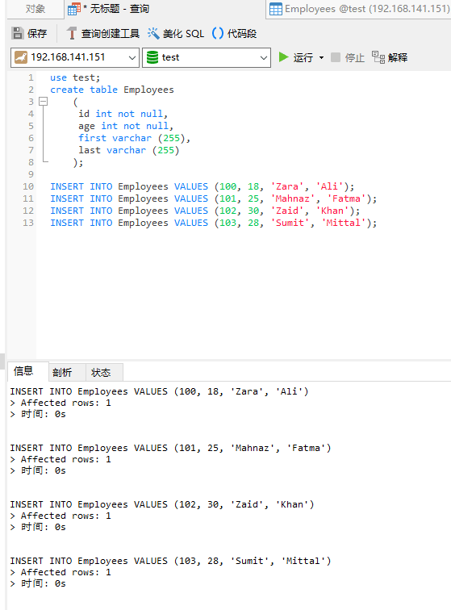

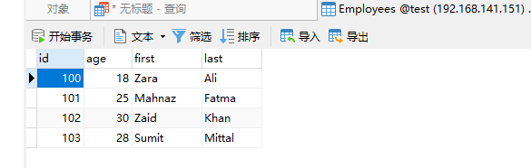

这里的例子演示了如何使用 Servlet 访问 test 数据库。
```java
// Loading required libraries
import java.io.*;
import java.util.*;
import javax.servlet.*;
import javax.servlet.annotation.WebServlet;
import javax.servlet.http.*;
import java.sql.*;

@WebServlet(urlPatterns = "/DatabaseAccess")
public class DatabaseAccess extends HttpServlet{
    private static JDBCUtils JDBCutiss;

    public void doGet(HttpServletRequest request,
                      HttpServletResponse response)
            throws ServletException, IOException
    {
        // Set response content type
        response.setContentType("text/html");
        PrintWriter out = response.getWriter();
        String title = "Database Result";
        String docType =
                "<!doctype html public \"-//w3c//dtd html 4.0 " +
                        "transitional//en\">\n";
        out.println(docType +
                "<html>\n" +
                "<head><title>" + title + "</title></head>\n" +
                "<body bgcolor=\"#f0f0f0\">\n" +
                "<h1 align=\"center\">" + title + "</h1>\n");
        try{
            // Register JDBC driver
            Class.forName("com.mysql.cj.jdbc.Driver");
            // Open a connection

            Connection conn = JDBCutiss.getConnection();

            // Execute SQL query
            Statement stmt = conn.createStatement();
            String sql;
            sql = "SELECT id, first, last, age FROM Employees";
            ResultSet rs = stmt.executeQuery(sql);
            // Extract data from result set
            while(rs.next()){
                //Retrieve by column name
                int id  = rs.getInt("id");
                int age = rs.getInt("age");
                String first = rs.getString("first");
                String last = rs.getString("last");
                //Display values
                out.println("ID: " + id + "<br>");
                out.println(", Age: " + age + "<br>");
                out.println(", First: " + first + "<br>");
                out.println(", Last: " + last + "<br>");
            }
            out.println("</body></html>");
            // Clean-up environment
            rs.close();
            JDBCutiss.close(stmt,conn);
            conn.close();
        }catch(SQLException se){
            //Handle errors for JDBC
            se.printStackTrace();
        }catch(Exception e){
            //Handle errors for Class.forName
            e.printStackTrace();
        }
    }
}
```

记得弄个 JDBCUtils 类
```java
import com.alibaba.druid.pool.DruidDataSourceFactory;

import javax.sql.DataSource;
import java.io.IOException;
import java.io.InputStream;
import java.sql.*;
import java.util.Properties;

public class JDBCUtils {
    private static DataSource ds;

    static {
        Properties pro = new Properties();
        InputStream rs = JDBCUtils.class.getClassLoader().getResourceAsStream("druid.properties");
        try {
            pro.load(rs);
            try {
                ds = DruidDataSourceFactory.createDataSource(pro);

            } catch (Exception e) {
                e.printStackTrace();
            }
        } catch (IOException e) {
            e.printStackTrace();
        }
    }
    //返回连接对象
    public static Connection getConnection() throws SQLException {
        return ds.getConnection();
    }
    public  static void close(Statement stmt, Connection conn){
        if (stmt!=null){
            try {
                stmt.close();
            } catch (SQLException throwables) {
                throwables.printStackTrace();
            }

        }
        if (conn!=null){
            try {
                conn.close();
            } catch (SQLException throwables) {
                throwables.printStackTrace();
            }
        }
    }
    //该方法返回定义好的DataSource对象
    public static DataSource getDataSource(){
        return ds;
    }
}
```

在 resources 创建 druid.properties

现在让我们来编译述 servlet 并在 web.xml 文件中创建以下条目：
```xml
 <servlet>
     <servlet-name>DatabaseAccess</servlet-name>
     <servlet-class>DatabaseAccess</servlet-class>
 </servlet>
 <servlet-mapping>
     <servlet-name>DatabaseAccess</servlet-name>
     <url-pattern>/DatabaseAccess</url-pattern>
 </servlet-mapping>
```

现在使用 URL http://localhost:8080/DatabaseAccess 调用这个 servlet，将显示如下所示响应：

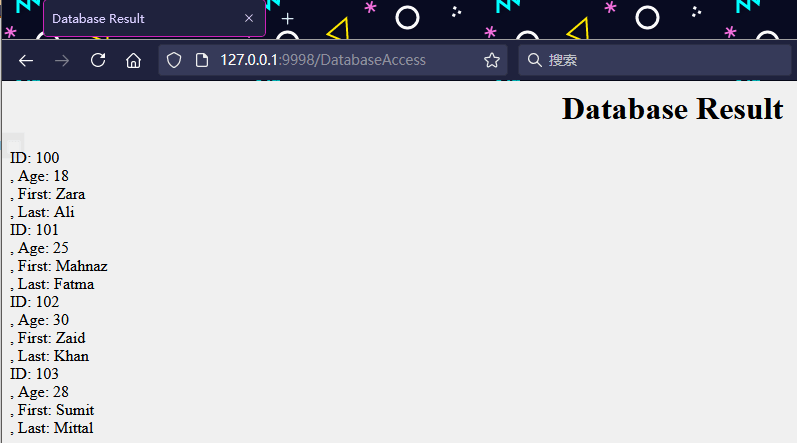

---

## 文件上传

Servlet 可以与 HTML form 标签一起使用允许用户将文件上传到服务器。上传的文件可以是文本文件或图像文件或任何文档。

### 创建一个文件上传表单

下述 HTML 代码创建了一个文件上传表单。以下是需要注意的几点：
* 表单 method 属性应该设置为 POST 方法且不能使用 GET 方法。
* 表单 enctype 属性应该设置为 multipart/form-data.
* 表单 action 属性应该设置为 servlet 文件，能够在后端服务器处理文件上传。下面的例子是使用 UploadServlet servlet 来上传文件的。
* 要上传单个文件，你应该使用单个带有属性 type=“file” 的 `<input .../>` 标签。为了允许多个文件上传，要包含多个带有 name 属性不同值的输入标签。浏览器将把一个浏览按钮和每个输入标签关联起来。

```html
<html>
<head>
<title>File Uploading Form</title>
</head>
<body>
<h3>File Upload:</h3>
Select a file to upload: <br />
<form action="UploadServlet" method="post"
                        enctype="multipart/form-data">
<input type="file" name="file" size="50" />
<br />
<input type="submit" value="Upload File" />
</form>
</body>
</html>
```

这将允许从本地计算机中选择一个文件，当用户点击“上传文件”时，表单会和选择的文件一起提交

### 编写后台 Servlet

以下是 servlet UploadServlet，会接受上传的文件并把它储存在目录 /webapps/data 中。使用外部配置，如 web.xml 中的 context-param 元素，这个目录名也可以被添加，如下所示：
```java
<web-app>
....
<context-param>
    <description>Location to store uploaded file</description>
    <param-name>file-upload</param-name>
    <param-value>
         c:\temp\save\
     </param-value>
</context-param>
....
</web-app>
```

以下是 UploadServlet 的源代码，可以一次处理多个文件的上传。在继续操作之前，请确认下列各项：

下述例子依赖于 FileUpload，所以一定要确保在你的 classpath 中有最新版本的 commons-fileupload.x.x.jar 文件。你可以从 http://commons.apache.org/fileupload/ 中下载。

FileUpload 依赖于 Commons IO，所以一定要确保在你的 classpath 中有最新版本的 commons-io-x.x.jar 文件。可以从 http://commons.apache.org/io/ 中下载。

在测试下面实例时，你上传的文件大小不能大于 maxFileSize，否则文件将无法上传。

请确保已经提前创建好目录 c:\temp and c:\apache-tomcat-5.5.29\webapps\data。
```java
// Import required java libraries
import java.io.*;
import java.util.*;
import javax.servlet.ServletConfig;
import javax.servlet.ServletException;
import javax.servlet.http.HttpServlet;
import javax.servlet.http.HttpServletRequest;
import javax.servlet.http.HttpServletResponse;
import org.apache.commons.fileupload.FileItem;
import org.apache.commons.fileupload.FileUploadException;
import org.apache.commons.fileupload.disk.DiskFileItemFactory;
import org.apache.commons.fileupload.servlet.ServletFileUpload;
import org.apache.commons.io.output.*;

@WebServlet(urlPatterns = "/UploadServlet")
public class UploadServlet extends HttpServlet {
   private boolean isMultipart;
   private String filePath;
   private int maxFileSize = 50 * 1024;
   private int maxMemSize = 4 * 1024;
   private File file ;
   public void init( ){
      // Get the file location where it would be stored.
      filePath =
             getServletContext().getInitParameter("file-upload");
   }
   public void doPost(HttpServletRequest request,
               HttpServletResponse response)
              throws ServletException, java.io.IOException {
      // Check that we have a file upload request
      isMultipart = ServletFileUpload.isMultipartContent(request);
      response.setContentType("text/html");
      java.io.PrintWriter out = response.getWriter( );
      if( !isMultipart ){
         out.println("<html>");
         out.println("<head>");
         out.println("<title>Servlet upload</title>");
         out.println("</head>");
         out.println("<body>");
         out.println("<p>No file uploaded</p>");
         out.println("</body>");
         out.println("</html>");
         return;
      }
      DiskFileItemFactory factory = new DiskFileItemFactory();
      // maximum size that will be stored in memory
      factory.setSizeThreshold(maxMemSize);
      // Location to save data that is larger than maxMemSize.
      factory.setRepository(new File("c:\\temp"));
      // Create a new file upload handler
      ServletFileUpload upload = new ServletFileUpload(factory);
      // maximum file size to be uploaded.
      upload.setSizeMax( maxFileSize );
      try{
      // Parse the request to get file items.
      List fileItems = upload.parseRequest(request);
      // Process the uploaded file items
      Iterator i = fileItems.iterator();
      out.println("<html>");
      out.println("<head>");
      out.println("<title>Servlet upload</title>");
      out.println("</head>");
      out.println("<body>");
      while ( i.hasNext () )
      {
         FileItem fi = (FileItem)i.next();
         if ( !fi.isFormField () )
         {
            // Get the uploaded file parameters
            String fieldName = fi.getFieldName();
            String fileName = fi.getName();
            String contentType = fi.getContentType();
            boolean isInMemory = fi.isInMemory();
            long sizeInBytes = fi.getSize();
            // Write the file
            if( fileName.lastIndexOf("\\") >= 0 ){
               file = new File( filePath +
               fileName.substring( fileName.lastIndexOf("\\"))) ;
            }else{
               file = new File( filePath +
               fileName.substring(fileName.lastIndexOf("\\")+1)) ;
            }
            fi.write( file ) ;
            out.println("Uploaded Filename: " + fileName + "<br>");
         }
      }
      out.println("</body>");
      out.println("</html>");
   }catch(Exception ex) {
       System.out.println(ex);
   }
   }
   public void doGet(HttpServletRequest request,
                       HttpServletResponse response)
        throws ServletException, java.io.IOException {
        throw new ServletException("GET method used with " +
                getClass( ).getName( )+": POST method required.");
   }
}
```

记得添加 maven 依赖
```xml
        <dependency>
            <groupId>commons-fileupload</groupId>
            <artifactId>commons-fileupload</artifactId>
            <version>1.4</version>
        </dependency>
        <!-- https://mvnrepository.com/artifact/commons-io/commons-io -->
        <dependency>
            <groupId>commons-io</groupId>
            <artifactId>commons-io</artifactId>
            <version>2.4</version>
        </dependency>
```

编译和运行 Servlet,现在尝试使用上面创建的 HTML 表单来上传文件。当你访问 http://localhost:8080/UploadFile.htm 时，它会显示如下所示的结果，这将有助于你从本地计算机中上传任何文件。

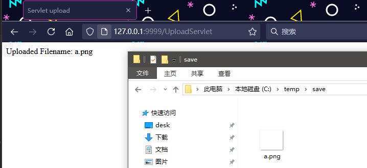

---

## 处理日期

使用 Servlet 的最重要的优势之一是你可以使用核心 Java 中的大多数可用的方法。本教程将讲解 Java 提供的 Date 类，该类在 java.util 包中是可用的，这个类封装了当前的日期和时间。

Date 类支持两个构造函数。第一个构造函数用当前日期和时间初始化对象。
```
Date( )
```
下面的构造函数接受一个参数，该参数等于自 1970 年 1 月 1 日凌晨零点以来经过的毫秒数。

```
Date(long millisec)
```

一旦你得到一个可用的 Date 对象，你可以调用下列任意支持的方法来使用日期：
```
boolean after(Date date)
如果调用的 Date 对象中包含的日期在 date 指定的日期之后，则返回 true，否则返回 false。
```
```
boolean before(Date date)
如果调用的 Date 对象中包含的日期在 date 指定的日期之前，则返回 true，否则返回 false。
```
```
Object clone( )
重复调用 Date 对象。
```
```
int compareTo(Date date)
把调用对象的值与 date 的值进行比较。如果两个值是相等的，则返回 0。如果调用对象在 date 之前，则返回一个负值。如果调用对象在 date 之后，则返回一个正值。
```
```
int compareTo(Object obj)
如果 obj 是 Date 类，则操作等同于 compareTo(Date)。否则，它会抛出一个 ClassCastException。
```
```
boolean equals(Object date)
如果调用的 Date 对象中包含的时间和日期与 date 指定的相同，则返回 true，否则返回 false。
```
```
long getTime( )
返回 1970 年 1 月 1 日以来经过的毫秒数。
```
```
int hashCode( )
为调用对象返回哈希代码。
```
```
void setTime(long time)
设置 time 指定的时间和日期，这表示从 1970 年 1 月 1 日凌晨零点以来经过的时间（以毫秒为单位）。
```
```
String toString( )
转换调用的 Date 对象为一个字符串，并返回结果。
```

### 获取当前的日期和时间

在 Java Servlet 中获取当前的日期和时间是非常容易的。你可以使用一个带有 `toString()` 方法的简单的 Date 对象来输出当前的日期和时间，如下所示：
```java
// Import required java libraries
import java.io.*;
import java.util.Date;
import javax.servlet.*;
import javax.servlet.http.*;
// Extend HttpServlet class

@WebServlet(urlPatterns = "/CurrentDate")
public class CurrentDate extends HttpServlet {
  public void doGet(HttpServletRequest request,
                    HttpServletResponse response)
            throws ServletException, IOException
  {
      // Set response content type
      response.setContentType("text/html");
      PrintWriter out = response.getWriter();
      String title = "Display Current Date & Time";
      Date date = new Date();
      String docType =
      "<!doctype html public \"-//w3c//dtd html 4.0 " +
      "transitional//en\">\n";
      out.println(docType +
        "<html>\n" +
        "<head><title>" + title + "</title></head>\n" +
        "<body bgcolor=\"#f0f0f0\">\n" +
        "<h1 align=\"center\">" + title + "</h1>\n" +
        "<h2 align=\"center\">" + date.toString() + "</h2>\n" +
        "</body></html>");
  }
}
```

现在，让我们来编译上述 servlet 并在 web.xml 文件中创建适当的条目，然后使用 URL http://localhost:8080/CurrentDate 来调用该 servlet。这将会产生如下所示的结果：

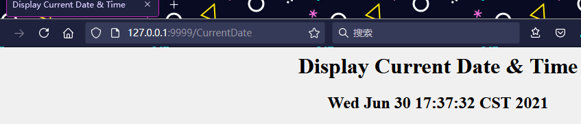

尝试刷新 URLhttp://localhost:8080/CurrentDate，每隔几秒刷新一次你都会发现显示时间的差异。

### 日期比较

正如我上面所提到的一样，你可以在 Servlet 中使用所有可用的 Java 方法。如果你需要比较两个日期，以下是方法：

* 你可以使用 `getTime()` 来获取两个对象自 1970 年 1 月 1 日凌晨零点以来经过的毫秒数，然后比较这两个值。
* 你可以使用方法 `before()`、`after()` 和 `equals()`。由于一个月里 12 号在 18 号之前，例如，new Date(99, 2, 12).before(new Date (99, 2, 18)) 返回 true。
* 你可以使用 `compareTo()` 方法，该方法由 Comparable 接口定义并由 Date 实现。

正如我上面所提到的一样，你可以在 Servlet 中使用所有可用的 Java 方法。如果你需要比较两个日期，以下是方法：

* 你可以使用 `getTime()` 来获取两个对象自 1970 年 1 月 1 日凌晨零点以来经过的毫秒数，然后比较这两个值。
* 你可以使用方法 `before()`、`after()` 和 `equals()`。由于一个月里 12 号在 18 号之前，例如，new Date(99, 2, 12).before(new Date (99, 2, 18)) 返回 true。
* 你可以使用 `compareTo()` 方法，该方法由 Comparable 接口定义并由 Date 实现。

SimpleDateFormat 是一个以语言环境敏感的方式来格式化和解析日期的具体类。 SimpleDateFormat 允许你通过为日期时间格式化选择任何用户定义的模式开始。
```java
// Import required java libraries
import java.io.*;
import java.text.*;
import java.util.Date;
import javax.servlet.*;
import javax.servlet.http.*;
// Extend HttpServlet class

@WebServlet(urlPatterns = "/CurrentDate")
public class CurrentDate extends HttpServlet {
  public void doGet(HttpServletRequest request,
                    HttpServletResponse response)
            throws ServletException, IOException
  {
      // Set response content type
      response.setContentType("text/html"); 
      PrintWriter out = response.getWriter();
      String title = "Display Current Date & Time";
      Date dNow = new Date( );
      SimpleDateFormat ft = 
      new SimpleDateFormat ("E yyyy.MM.dd 'at' hh:mm:ss a zzz");
      String docType =
      "<!doctype html public \"-//w3c//dtd html 4.0 " +
      "transitional//en\">\n";
      out.println(docType +
        "<html>\n" +
        "<head><title>" + title + "</title></head>\n" +
        "<body bgcolor=\"#f0f0f0\">\n" +
        "<h1 align=\"center\">" + title + "</h1>\n" +
        "<h2 align=\"center\">" + ft.format(dNow) + "</h2>\n" +
        "</body></html>");
  }
}
```

再次编译上述 servlet，然后使用 URL http://localhost:8080/CurrentDate 来调用该 servlet。这将会产生如下所示的结果：


要指定时间格式，那么使用时间模式的字符串。在这种模式下，所有的 ASCII 字母被保留为模式字母，这些字母定义如下：

| 字符	| 描述	    |    实例 |
| - | - | - |
| G	    | 时代指示器	                | AD |
| y	    | 四位数的年	                | 2001 |
| M	    | 一年中的月	                | July 或 07 |
| d	    | 一月中的第几天	            | 10 |
| h	    | 带有 A.M./P.M. 的小时（1~12）	| 12 |
| H	    | 一天中的第几小时（0~23）	     | 22 |
| m	    | 一小时中的第几分	             | 30 |
| s	    | 一分中的第几秒	             | 55 |
| S	    | 毫秒	234 |
| E	    | 一周中的星期几	| Tuesday |
| D	    | 一年中的第几天	| 360 |
| F	    | 一个月中的某一周的某一天	| 2 (second Wed. in July) |
| w	    | 一年中的第几周	| 40 |
| W	    | 一月中的第几周	| 1 |
| a	    | A.M./P.M. 标记	| PM |
| k	    | 一天中的第几小时（1~24）	| 24 |
| K	    | 带有 A.M./P.M. 的小时（0~11）	| 10 |
| z	    | 时区	| Eastern Standard Time |
| '	    | Escape for text	| 分隔符 |
| "	    | 单引号	| ` |

---

## Source & Reference

- http://wiki.jikexueyuan.com/project/servlet/cookies-handling.html
- https://wiki.jikexueyuan.com/project/servlet/session-tracking.html
- https://wiki.jikexueyuan.com/project/servlet/database-access.html
- https://wiki.jikexueyuan.com/project/servlet/file-uploading.html
- https://wiki.jikexueyuan.com/project/servlet/handling-date.html
