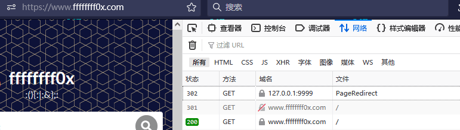
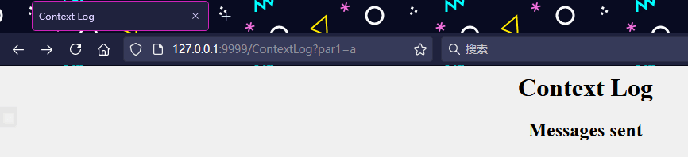
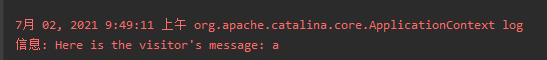

# servlet-4

---

## 页面重定向

当文档移动到一个新的位置时，通常会使用页面重定向，我们需要将客户端发送到这个新位置或者也可能是由于负载均衡，或者只是为了简单的随机。

重定向请求到另一个页面的最简单的方式是使用 response 对象的 `sendRedirect()` 方法。下面是该方法的特征：

```java
public void HttpServletResponse.sendRedirect(String location)
throws IOException
```

该方法将响应和状态码及新的页面位置发送回浏览器。你也可以通过一起使用 `setStatus()` 和 `setHeader()` 方法来达到同样的效果：
```java
....
String site = "http://www.newpage.com" ;
response.setStatus(response.SC_MOVED_TEMPORARILY);
response.setHeader("Location", site);
....
```

这个例子显示了 servlet 如何将页面重定向到另一个位置：

```java
import java.io.*;
import java.sql.Date;
import java.util.*;
import javax.servlet.*;
import javax.servlet.annotation.WebServlet;
import javax.servlet.http.*;

@WebServlet(urlPatterns = "/PageRedirect")
public class PageRedirect extends HttpServlet{
  public void doGet(HttpServletRequest request,
                    HttpServletResponse response)
            throws ServletException, IOException
  {
      // Set response content type
      response.setContentType("text/html");
      // New location to be redirected
      String site = new String("http://www.ffffffff0x.com");
      response.setStatus(response.SC_MOVED_TEMPORARILY);
      response.setHeader("Location", site);
    }
}
```

现在使用 URL http://localhost:8080/PageRedirect 来调用这个 servlet。这将使你跳转到给定的 URL http://www.ffffffff0x.com 中。



---

## 点击计数器

### Web 页面的点击计数器

很多时候，你可能有兴趣知道你网站的某个特定页面上的总点击量。使用 servlet 来计算这些点击量是非常简单的，因为一个 servlet 的生命周期是由它运行的容器控制的。

以下是基于 Servlet 生命周期实现一个简单的页面点击计数器需要的步骤：

* 在 `init()` 方法中初始化一个全局变量。
* 每次调用 `doGet()` 或 `doPost()` 方法时，增加全局变量。
* 如果需要，你可以使用一个数据库表来存储 `destroy()` 方法中的全局变量。在下次初始化 servlet 时，这个值可以在 `init()` 方法内被读取。这一步是可选的。
* 如果你想计算一个会话内一个页面的点量击，那么你可以使用 `isNew()` 方法来查看该会话内是否已点击过相同的页面。这一步是可选的。
* 你可以显示全局计数器的值来显示网站中的总点击量。这一步是可选的。

在这里我假设 web 容器不会被重新启动。如果 web 容器被重新启动或 servlet 被销毁，计数器将被重置。

这个例子演示了如何实现一个简单的页面点击计数器：
```java
import java.io.*;
import java.sql.Date;
import java.util.*;
import javax.servlet.*;
import javax.servlet.annotation.WebServlet;
import javax.servlet.http.*;

@WebServlet(urlPatterns = "/PageHitCounter")
public class PageHitCounter extends HttpServlet{
  private int hitCount;
  public void init()
  {
     // Reset hit counter.
     hitCount = 0;
  }
  public void doGet(HttpServletRequest request,
                    HttpServletResponse response)
            throws ServletException, IOException
  {
      // Set response content type
      response.setContentType("text/html");
      // This method executes whenever the servlet is hit
      // increment hitCount
      hitCount++;
      PrintWriter out = response.getWriter();
      String title = "Total Number of Hits";
      String docType =
      "<!doctype html public \"-//w3c//dtd html 4.0 " +
      "transitional//en\">\n";
      out.println(docType +
        "<html>\n" +
        "<head><title>" + title + "</title></head>\n" +
        "<body bgcolor=\"#f0f0f0\">\n" +
        "<h1 align=\"center\">" + title + "</h1>\n" +
        "<h2 align=\"center\">" + hitCount + "</h2>\n" +
        "</body></html>");
  }
  public void destroy()
  {
      // This is optional step but if you like you
      // can write hitCount value in your database.
  }
}
```

现在使用 URL http://localhost:8080/PageHitCounter 来调用这个 servlet。每次页面刷新时，计数器的值都会加 1，这将产生如下所示的结果：


### 网站点击计数器

很多时候，你可能有兴趣知道你整个网站的总点击量。在 Servlet 中，这也是非常简单的，我们可以使用过滤器实现这一点。

以下是实现一个基于过滤器生命周期的简单的网站点击计数器需要的步骤：
* 在过滤器的 init() 方法中初始化一个全局变量。
* 每次调用 doFilter 方法时，增加全局变量。
* 如果需要，你可以使用一个数据库表来存储过滤器的 destroy() 方法中的全局变量的值。在下次初始化过滤器时，该值可以在 init() 方法内被读取。这一步是可选的。

在这里我假设 web 容器不会被重新启动。如果 web 容器被重新启动或 servlet 被销毁，点击计数器将被重置。

这个例子演示了如何实现一个简单的网站点击计数器：
```java
// Import required java libraries
import java.io.*;
import javax.servlet.*;
import javax.servlet.http.*;
import java.util.*;

public class SiteHitCounter implements Filter{
  private int hitCount;
  public void  init(FilterConfig config)
                    throws ServletException{
     // Reset hit counter.
     hitCount = 0;
  }
  public void  doFilter(ServletRequest request,
              ServletResponse response,
              FilterChain chain)
              throws java.io.IOException, ServletException {
      // increase counter by one
      hitCount++;
      // Print the counter.
      System.out.println("Site visits count :"+ hitCount );
      // Pass request back down the filter chain
      chain.doFilter(request,response);
  }
  public void destroy()
  {
      // This is optional step but if you like you
      // can write hitCount value in your database.
  }
}
```

现在让我们来编译上述 servlet 并在 web.xml 文件中创建以下条目：

```xml
....
<filter>
   <filter-name>SiteHitCounter</filter-name>
   <filter-class>SiteHitCounter</filter-class>
</filter>
<filter-mapping>
   <filter-name>SiteHitCounter</filter-name>
   <url-pattern>/*</url-pattern>
</filter-mapping>
....
```

现在调用任意 URL 如 URLhttp://localhost:8080/。每次任意页面被点击时，计数器的值都会加 1 并且会在日志中显示如下所示的消息：


---

## 自动刷新页面

假设一个 web 页面，显示了现场比赛得分或股票市场状况或货币兑换率。对于所有这些类型的页面，你都需要使用你浏览器中的 refresh 或 reload 按钮来定期刷新 web 页面。

Java Servlet 提供给你一个机制使这项工作变得简单，可以使得 web 页面在给定的时间间隔自动刷新。

刷新一个 web 页面最简单的方式是使用响应对象的方法 `setIntHeader()`。以下是这种方法的特征：

```java
public void setIntHeader(String header, int headerValue)
```

此方法将头信息 “Refresh” 和一个表示时间间隔的整数值（以秒为单位）发送回浏览器。

---

## 包

涉及到 WEB-INF 子目录的 web 应用程序结构是所有的 Java web 应用程序的标准，并且是由 servlet API 规范指定的。给定一个 myapp 的顶级目录名，这里是目录结构，如下所示：

```
/myapp
    /images
    /WEB-INF
        /classes
        /lib
```

WEB-INF 子目录包含了应用程序的部署描述符，命名为 web.xml。所有的 HTML 文件都位于顶级目录 myapp 下。对于管理员用户，你会发现 ROOT 目录是和 myApp 一样的父目录。

### 创建包中的 Servlets

WEB-INF/classes 目录在与它们的包名称匹配的结构中包含了所有的 servlet 类和其他的类文件。例如，如果你有一个完全合格的类名称 com.myorg.MyServlet，那么这个 servlet 类必须被放置在如下所示的目录中：

```
/myapp/WEB-INF/classes/com/myorg/MyServlet.class
```

下面是创建包名为 com.myorg 的 MyServlet 类的例子
```java
// Name your package
package com.myorg;
// Import required java libraries
import java.io.*;
import javax.servlet.*;
import javax.servlet.http.*;
public class MyServlet extends HttpServlet {
  private String message;
  public void init() throws ServletException
  {
      // Do required initialization
      message = "Hello World";
  }
  public void doGet(HttpServletRequest request,
                    HttpServletResponse response)
            throws ServletException, IOException
  {
      // Set response content type
      response.setContentType("text/html");
      // Actual logic goes here.
      PrintWriter out = response.getWriter();
      out.println("<h1>" + message + "</h1>");
  }
  public void destroy()
  {
      // do nothing.
  }
}
```

### 编译包中的 Servlets

编译包中可用的类没有什么大的不同。最简单的方法是将你的 java 文件保存在完全限定路径中，正如上面所提到的一样，类将被保存在 com.myorg 中。你还需要将该目录添加到 CLASSPATH 中。

假设你的环境已正确设置，进入 `<Tomcat-installation-directory>/webapps/ROOT/WEB-INF/classes` 目录并编译 MyServlet.java，如下所示：
```
$ javac MyServlet.java
```

如果 servlet 依赖于任何其他的库，那么你必须在你的 CLASSPATH 中包含那些 JAR 文件。我只包含了 servlet-api.jar JAR 文件，因为我在 Hello World 程序中没有使用任何其他的库。

该命令行使用来自 Sun Microsystems Java 软件开发工具包（JDK）内置的 javac 编译器。为了让该命令正常工作，必须包括你在 PATH 环境变量中所使用的 Java SDK 的位置。

如果一切顺利，上述编译会在相同的目录下生成 MyServlet.class 文件。下一节将解释如何在生产中部署一个已编译的 servlet。

### 打包的 Servlet 部署

默认情况下，servlet 应用程序位于路径 `<Tomcat-installation-directory>/webapps/ROOT` 下且类文件放在 `<Tomcat-installation-directory>/webapps/ROOT/WEB-INF/classes` 中。

如果你有一个完全合格的类名称 com.myorg.MyServlet，那么这个 servlet 类必须位于 `WEB-INF/classes/com/myorg/MyServlet.class` 中，你需要在位于 `<Tomcat-installation-directory>/webapps/ROOT/WEB-INF/` 的 web.xml 文件中创建以下条目：

```xml
<servlet>
   <servlet-name>MyServlet</servlet-name>
   <servlet-class>com.myorg.MyServlet</servlet-class>
</servlet>
<servlet-mapping>
   <servlet-name>MyServlet</servlet-name>
   <url-pattern>/MyServlet</url-pattern>
</servlet-mapping>
```

上述条目要被创建在 web.xml 文件中的 `<web-app>...</web-app>` 标签内。在该文件中可能已经有各种可用的条目，但没有关系。

你基本上已经完成了，现在让我们使用 `<Tomcat-installation-directory>\bin\startup.bat`（Windows 操作系统中）或 `<Tomcat-installation-directory>/bin/startup.sh`（Linux/Solaris 等操作系统中）启动 tomcat 服务器，最后在浏览器的地址栏中输入 http://localhost:8080/MyServlet

---

## 调试

测试/调试 servlet 始终是困难的。Servlets 往往涉及大量的客户端/服务器交互，可能会出现错误但是又难以重现。

这里有一些提示和建议，可以帮助你调试。

### System.out.println()

`System.out.println()` 作为一个标记用来测试某一代码片段是否被执行，使用方法非常简单。我们也可以输出变量值。另外：

由于 System 对象是核心 Java 对象的一部分，它可以用于任何不需要安装任何额外类的地方。这包括 Servlets、JSP、RMI、EJB's、普通的 Beans 和类，以及独立的应用程序。

与在断点处停止相比，写入 System.out 不会对应用程序的正常执行流程有太多干扰，这使得它在时序重要的时候显得非常有价值。
以下使用 `System.out.println()` 的语法：

```
System.out.println("Debugging message");
```

通过上述语法生成的所有消息将被记录在 web 服务器的日志文件中。

### 消息记录

利用标准日志记录方法，使用适当的日志记录方法来记录所有调试、警告和错误消息是非常好的想法，我使用的是 log4J 来记录所有的消息。

Servlet API 还提供了一个简单的输出信息的方式，使用 `log()` 方法，如下所示：

```java
// Import required java libraries
import java.io.*;
import javax.servlet.*;
import javax.servlet.http.*;

@WebServlet(urlPatterns = "/ContextLog")
public class ContextLog extends HttpServlet {
  public void doGet(HttpServletRequest request,
      HttpServletResponse response) throws ServletException,
         java.io.IOException {
      String par = request.getParameter("par1");
      //Call the two ServletContext.log methods
      ServletContext context = getServletContext( );
      if (par == null || par.equals(""))
      //log version with Throwable parameter
      context.log("No message received:",
          new IllegalStateException("Missing parameter"));
      else
          context.log("Here is the visitor's message: " + par);
      response.setContentType("text/html");
      java.io.PrintWriter out = response.getWriter( );
      String title = "Context Log";
      String docType =
      "<!doctype html public \"-//w3c//dtd html 4.0 " +
      "transitional//en\">\n";
      out.println(docType +
        "<html>\n" +
        "<head><title>" + title + "</title></head>\n" +
        "<body bgcolor=\"#f0f0f0\">\n" +
        "<h1 align=\"center\">" + title + "</h1>\n" +
        "<h2 align=\"center\">Messages sent</h2>\n" +
        "</body></html>");
    } //doGet
}
```

ServletContext 把它的文本消息记录到 servlet 容器的日志文件中。使用 Tomcat，这些日志可以在 `<Tomcat-installation-directory>/logs` 目录中找到。

这些日志文件确实为新出现的错误或问题的频率给出了指示。正因为如此，在通常不会出现的异常 catch 子句中使用 `log()` 函数是很好的。





### 使用 JDB 调试器

你可以使用调试 applet 或应用程序的相同的 jdb 命令来调试 servlet。

为了调试一个 servlet，我们可以调试 sun.servlet.http.HttpServer，然后把它看成是 HttpServer 执行 servlet 来响应来自浏览器端的 HTTP 请求。这与调试 applet 小程序的方式非常相似。与调试 applet 不同的是，被调试的实际程序是 sun.applet.AppletViewer。

大多数调试器会自动隐藏了解如何调试 applet 的细节。直到他们为 servlet 做同样的事情，你必须做以下操作来帮助你的调试器：

* 设置你的调试器的类路径，以便它可以找到 sun.servlet.http.Http-Server 和相关的类。
* 设置你的调试器的类路径，以便它可以找到你的 servlet 和支持的类，通常是在 server_root/servlets 和 server_root/classes 中。

你通常不会希望 server_root/servlets 在你的 classpath 中，因为它会禁用 servlet 的重载。然而这种包含对于调试是有用的。在 HttpServer 中的自定义的 servlet 加载器加载 servlet 之前，它允许你的调试器在 servlet 中设置断点。

一旦你设置了正确的类路径，就可以开始调试 sun.servlet.http.HttpServer。你可以在任何你想要调试的 servlet 中设置断点，然后使用 web 浏览器为给定的 servlet（http://localhost:8080/servlet/ServletToDebug) 向 HttpServer 发出请求。你会看到程序执行到你设置的断点处停止。

#### 使用注释

代码中的注释有助于以各种方式调试程序。注释可用于调试过程中的许多其他方式中。

Servlet 使用 Java 注释，单行注释（//...）和多行注释（/ .../）可用于暂时移除部分 Java 代码。如果 bug 消失，仔细看看你之前注释的代码并找出问题所在。

#### 客户端和服务器端头信息

有时，当一个 servlet 并没有像预期那样工作时，查看原始的 HTTP 请求和响应是非常有用的。如果你对 HTTP 结构很熟悉，你可以阅读请求和响应，看看这些头信息中究竟是什么。

#### 重要的调试技巧

这里是 servlet 调试中的一些调试技巧列表：

* 请注意 server _ root/classes 不会重载，而 server_root/servlets 可能会。
* 要求浏览器显示它所显示的页面的原始内容。这有助于识别格式的问题。它通常是视图菜单下的一个选项。
* 通过强制执行完全重载页面，来确保浏览器还没有缓存前一个请求的输出。在 Netscape Navigator 中，使用 Shift-Reload；在 IE 浏览器中，请使用 Shift-Refresh。
* 确认 servlet 的 `init()` 方法接受一个 ServletConfig 参数并立即调用 `super.init(config)`。

---

## 国际化

在我们继续之前，请让我解释三个重要术语：

* 国际化（i18n）：这意味着网站能够提供翻译成访问者的语言或国籍的不同版本的内容。
* 本地化（l10n）：这意味着向网站添加资源，使其适应特定的地理或文化区域，例如网站翻译成印地语。
* 区域设置：这是一个特殊的文化或地理区域。它通常指语言符号后跟一个由下划线分隔的国家符号。例如 "en_US" 表示 US 的英语区域设置。
当建立一个全球性的网站时有一些注意事项。本教程不会给出完整的细节，但它会通过一个很好的例子向你演示如何通过差异化定位（即区域设置）来让网页以不同的语言呈现。

Servlet 可以根据请求者的区域设置读出相应版本的网站，并根据当地的语言、文化和需求提供相应的网站版本。以下是 request 对象中的方法，它返回了 Locale 对象。
```java
java.util.Locale request.getLocale()
```

### 检测区域设置

下面列出了重要的区域设置方法，你可以使用它们来检测请求者的地理位置、语言和区域设置。下面所有的方法都显示请求者浏览器中设置的国家名称和语言名称。

```
String getCountry()
该方法以 2 个大写字母形式的 ISO 3166 格式返回该区域设置的国家/地区代码。
```

```
String getDisplayCountry()
该方法返回适合向用户显示的区域设置的国家的名称。
```

```
String getLanguage()
该方法以小写字母形式的 ISO 639 格式返回该区域设置的语言代码。
```

```
String getDisplayLanguage()
该方法返回适合向用户显示的区域设置的语言的名称。
```

```
String getISO3Country()
该方法返回该区域设置的国家的三个字母缩写。
```

```
String getISO3Language()
该方法返回该区域设置的语言的三个字母的缩写。
```

这个例子向你演示了如何为一个请求显示语言和相关的国家：
```java
import java.io.*;
import javax.servlet.*;
import javax.servlet.http.*;
import java.util.Locale;
public class GetLocale extends HttpServlet{
  public void doGet(HttpServletRequest request,
                    HttpServletResponse response)
            throws ServletException, IOException
  {
      //Get the client's Locale
      Locale locale = request.getLocale();
      String language = locale.getLanguage();
      String country = locale.getCountry();
      // Set response content type
      response.setContentType("text/html");
      PrintWriter out = response.getWriter();
      String title = "Detecting Locale";
      String docType =
      "<!doctype html public \"-//w3c//dtd html 4.0 " +
      "transitional//en\">\n";
      out.println(docType +
        "<html>\n" +
        "<head><title>" + title + "</title></head>\n" +
        "<body bgcolor=\"#f0f0f0\">\n" +
        "<h1 align=\"center\">" + language + "</h1>\n" +
        "<h2 align=\"center\">" + country + "</h2>\n" +
        "</body></html>");
  }
}
```

### 语言设置

Servlet 可以输出以西欧语言编写的页面，如英语、西班牙语、德语、法语、意大利语、荷兰语等。在这里，设置 Content-Language 头信息来正确的显示所有字符是非常重要的。

第二点是使用 HTML 实体显示所有的特殊字符，例如，`&#241;` 表示 "ñ"，`&#161;` 表示 "¡"，如下所示：
```java
import java.io.*;
import javax.servlet.*;
import javax.servlet.http.*;
import java.util.Locale;
public class DisplaySpanish extends HttpServlet{
  public void doGet(HttpServletRequest request,
                    HttpServletResponse response)
            throws ServletException, IOException
  {
    // Set response content type
    response.setContentType("text/html");
    PrintWriter out = response.getWriter();
    // Set spanish language code.
    response.setHeader("Content-Language", "es");
    String title = "En Espa&ntilde;ol";
    String docType =
     "<!doctype html public \"-//w3c//dtd html 4.0 " +
     "transitional//en\">\n";
     out.println(docType +
     "<html>\n" +
     "<head><title>" + title + "</title></head>\n" +
     "<body bgcolor=\"#f0f0f0\">\n" +
     "<h1>" + "En Espa&ntilde;ol:" + "</h1>\n" +
     "<h1>" + "&iexcl;Hola Mundo!" + "</h1>\n" +
     "</body></html>");
  }
}
```

### 特定于区域设置的日期

你可以使用 java.text.DateFormat 类及其静态的 `getDateTimeInstance()` 方法来格式化特定于区域设置的日期和时间。下面的例子向你演示了如何格式化特定于一个给定的区域设置的日期：

```java
import java.io.*;
import javax.servlet.*;
import javax.servlet.http.*;
import java.util.Locale;
import java.text.DateFormat;
import java.util.Date;
public class DateLocale extends HttpServlet{
  public void doGet(HttpServletRequest request,
                    HttpServletResponse response)
            throws ServletException, IOException
  {
    // Set response content type
    response.setContentType("text/html");
    PrintWriter out = response.getWriter();
    //Get the client's Locale
    Locale locale = request.getLocale( );
    String date = DateFormat.getDateTimeInstance(
                                  DateFormat.FULL,
                                  DateFormat.SHORT,
                                  locale).format(new Date( ));
    String title = "Locale Specific Dates";
    String docType =
      "<!doctype html public \"-//w3c//dtd html 4.0 " +
      "transitional//en\">\n";
      out.println(docType +
      "<html>\n" +
      "<head><title>" + title + "</title></head>\n" +
      "<body bgcolor=\"#f0f0f0\">\n" +
      "<h1 align=\"center\">" + date + "</h1>\n" +
      "</body></html>");
  }
}
```

### 特定于区域设置的货币

你可以使用 `java.text.NumberFormat` 类及其静态的 `getCurrencyInstance()` 方法来在特定于区域设置的货币中格式化数字，比如 long 类型或 double 类型。下面的例子向你演示了如何格式化特定于一个给定的区域设置的货币：

```java
import java.io.*;
import javax.servlet.*;
import javax.servlet.http.*;
import java.util.Locale;
import java.text.NumberFormat;
import java.util.Date;
public class CurrencyLocale extends HttpServlet{
  public void doGet(HttpServletRequest request,
                    HttpServletResponse response)
            throws ServletException, IOException
  {
    // Set response content type
    response.setContentType("text/html");
    PrintWriter out = response.getWriter();
    //Get the client's Locale
    Locale locale = request.getLocale( );
    NumberFormat nft = NumberFormat.getCurrencyInstance(locale);
    String formattedCurr = nft.format(1000000);
    String title = "Locale Specific Currency";
    String docType =
      "<!doctype html public \"-//w3c//dtd html 4.0 " +
      "transitional//en\">\n";
      out.println(docType +
      "<html>\n" +
      "<head><title>" + title + "</title></head>\n" +
      "<body bgcolor=\"#f0f0f0\">\n" +
      "<h1 align=\"center\">" + formattedCurr + "</h1>\n" +
      "</body></html>");
  }
}
```

### 特定于区域设置的百分比

你可以使用 `java.text.NumberFormat` 类及其静态的 `getPercentInstance()` 方法来格式化特定于区域设置的百分比。下面的例子向你演示了如何格式化特定于一个给定的区域设置的百分比：

```java
import java.io.*;
import javax.servlet.*;
import javax.servlet.http.*;
import java.util.Locale;
import java.text.NumberFormat;
import java.util.Date;
public class PercentageLocale extends HttpServlet{
  public void doGet(HttpServletRequest request,
                    HttpServletResponse response)
            throws ServletException, IOException
  {
    // Set response content type
    response.setContentType("text/html");
    PrintWriter out = response.getWriter();
    //Get the client's Locale
    Locale locale = request.getLocale( );
    NumberFormat nft = NumberFormat.getPercentInstance(locale);
    String formattedPerc = nft.format(0.51);
    String title = "Locale Specific Percentage";
    String docType =
      "<!doctype html public \"-//w3c//dtd html 4.0 " +
      "transitional//en\">\n";
      out.println(docType +
      "<html>\n" +
      "<head><title>" + title + "</title></head>\n" +
      "<body bgcolor=\"#f0f0f0\">\n" +
      "<h1 align=\"center\">" + formattedPerc + "</h1>\n" +
      "</body></html>");
  }
}
```

---

## Source & Reference

- https://wiki.jikexueyuan.com/project/servlet/page-redirect.html
- https://wiki.jikexueyuan.com/project/servlet/hits-counter.html
- https://wiki.jikexueyuan.com/project/servlet/auto-refresh.html
- https://wiki.jikexueyuan.com/project/servlet/packaging.html
- https://wiki.jikexueyuan.com/project/servlet/debugging.html
- https://wiki.jikexueyuan.com/project/servlet/internationalization.html
