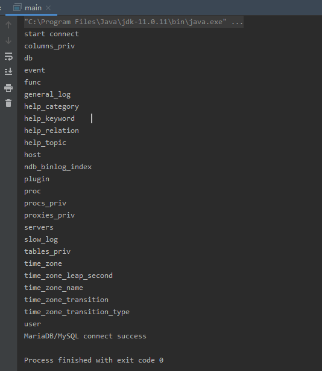
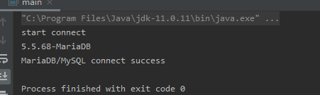
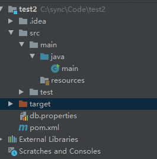

# JDBC

---

Java 中需要调用 JDBC 来对数据库进行操作。

## JDBC概念

Java 数据库连接，（Java Database Connectivity，简称 JDBC）是 Java 语言中用来规范客户端程序如何来访问数据库的应用程序接口，提供了诸如查询和更新数据库中数据的方法。JDBC 也是 Sun Microsystems 的商标。我们通常说的 JDBC 是面向关系型数据库的。

**JDBC实现原理**

Java 通过 java.sql.DriverManager 来管理所有数据库的驱动注册，所以如果想要建立数据库连接需要先在 java.sql.DriverManager 中注册对应的驱动类，然后调用 getConnection 方法才能连接上数据库。

JDBC 定义了一个叫 java.sql.Driver 的接口类负责实现对数据库的连接，所有的数据库驱动包都必须实现这个接口才能够完成数据库的连接操作。java.sql.DriverManager.getConnection(xx) 其实就是间接的调用了 java.sql.Driver 类的 connect 方法实现数据库连接的。数据库连接成功后会返回一个叫做 java.sql.Connection 的数据库连接对象，一切对数据库的查询操作都将依赖于这个 Connection 对象。

---

## JDBC使用

- http://dev.mysql.com/downloads/connector/j/

### maven 依赖

```xml
        <dependency>
            <groupId>mysql</groupId>
            <artifactId>mysql-connector-java</artifactId>
            <version>8.0.25</version>
        </dependency>
```

### DriverManager驱动管理对象功能

注册驱动：
```java
static void registerDriver(Driver driver) :
// 注册与给定的驱动程序 DriverManager 。
```

代码：
```java
Class.forName("com.mysql.jdbc.Driver");
```

获取数据库连接：
```java
static Connection getConnection(String url, String user, String password)
```

代码:
```java
Connection conn = DriverManager.getConnection("jdbc:mysql://127.0.0.1/sql","root","root");
```

### Connection数据库连接对象

获取执行sql 的对象
```java
Statement createStatement()

PreparedStatement  prepareStatement(String sql)
```

代码：
```java
Statement statement = conn.createStatement();
```

### Statement执行sql的对象

1. boolean execute(String sql) ：可以执行任意的 sql

2. int executeUpdate(String sql) ：执行 DML（insert、update、delete）语句、DDL(create，alter、drop) 语句
* 返回值：影响的行数，可以通过这个影响的行数判断 DML 语句是否执行成功 返回值 > 0 的则执行成功，反之，则失败。

3. ResultSet executeQuery(String sql)  ：执行 DQL(select) 语句

### 连接测试

mysql 地址 192.168.141.151 3306 root toor

```java
import java.sql.*;

public class main {
    private Connection conn = null;
    public static void main(String[] args)   {
        new main().connectMariaDB();
    }
    public void connectMariaDB(){
        System.out.println("start connect");
        String conn_str = "jdbc:mysql://192.168.1.1:3306/mysql?"
                + "user=root&password=toor"
                +"&useUnicode=true&characterEncoding=UTF8";
        try {
            Class.forName("com.mysql.cj.jdbc.Driver");
            conn = DriverManager.getConnection(conn_str);
            Statement stmt = conn.createStatement();
            String sql = "show tables;";
            ResultSet result = stmt.executeQuery(sql);
            if (result != null) {
                while (result.next()) {
                    System.out.println(result.getString(1) + "\t");
                }
            }
            System.out.println("MariaDB/MySQL connect success");
        } catch (Exception e) {
            e.printStackTrace();
        }
    }
}
```



### 查询版本

```java
import java.sql.*;

public class main {
    private Connection conn = null;
    public static void main(String[] args)   {
        new main().connectMariaDB();
    }
    public void connectMariaDB(){
        System.out.println("start connect");

        String url = "jdbc:mysql://192.168.141.151:3306/mysql?";//设置数据库的地址 设置编码  支持汉字
        String user="root";//用户名
        String password = "toor";//用户密码

        try {
            Class.forName("com.mysql.cj.jdbc.Driver");
            Connection conn = DriverManager.getConnection(url, user, password);
            Statement stmt = conn.createStatement();
            String sql = "select version()";
            ResultSet result = stmt.executeQuery(sql);
            if (result != null) {
                while (result.next()) {
                    System.out.println(result.getString(1) + "\t");
                }
            }
            System.out.println("MariaDB/MySQL connect success");
        } catch (Exception e) {
            e.printStackTrace();
        }
    }
}
```

或

```java
import java.sql.*;

public class main {
    public static void main(String[] args) throws Exception {
        String mycon = "jdbc:mysql://192.168.1.1:3306/mysql?";
        String user = "root";
        String password = "toor";

        Class.forName("com.mysql.cj.jdbc.Driver");
        Connection connection = DriverManager.getConnection(mycon, user, password);  //建立连接
        String sql = "select version()"; //定义sql语句
        Statement statement = connection.createStatement(); //创建执行sql对象
        ResultSet result = statement.executeQuery(sql);  //执行sql语句
        if (result != null) {
            while (result.next()) {
                System.out.println(result.getString(1) + "\t");
            }
        }
    }
}
```



### 查询遍历表里内容

```java
import java.sql.*;

public static void main(String[] args) throws Exception {
    String mycon = "jdbc:mysql://192.168.1.1:3306";
    String user = "root";
    String password = "toor";

    Class.forName("com.mysql.cj.jdbc.Driver");
    Connection connection = DriverManager.getConnection(mycon, user,password);  //建立连接
    String sql = "select * from users"; //定义sql语句
    Statement statement = connection.createStatement(); //创建执行sql对象
    ResultSet resultSet = statement.executeQuery(sql);  //执行sql语句
    while (resultSet.next()){    //使用next让游标向下移动一行，判断是否为空

        int id = resultSet.getInt(1);  //获取查询id的值,从1开始索引
        String name = resultSet.getString("username");  //获取查询的username字段内容
        String passwd = resultSet.getString("password");  // //获取查询的password字段
        System.out.println(id+name+passwd);
    }
}
```

### 集合存储数据

主类
```java
import java.sql.*;
import java.util.ArrayList;
import java.util.List;

public class main {
    public static void main(String[] args) throws Exception {
        List<Test> list = new main().findAll();
        System.out.println(list);
    }

    public List<Test> findAll() throws Exception {
        Class.forName("com.mysql.jc.jdbc.Driver");
        Connection conn = DriverManager.getConnection("jdbc:mysql://192.168.1.1:3306/", "root", "toor");
        String sql = "select * from users";
        Statement statement = conn.createStatement();
        ResultSet resultSet = statement.executeQuery(sql);
        List<Test> list = new ArrayList<Test>();

        Test test = null;
        while (resultSet.next()){
            int id = resultSet.getInt(1);
            String username = resultSet.getString("username");
            String password = resultSet.getString("password");
            test = new Test();
            test.setId(id);
            test.setUsername(username);
            test.setPassword(password);
            list.add(test);
        }
        return list;
    }
}
```

test 类
```java
import java.util.Date;

public class Test {
    private int id ;
    private String username;
    private String password;

    public int getId() {
        return id;
    }

    @Override
    public String toString() {
        return "Test{" +
                "id=" + id +
                ", username='" + username + '\'' +
                ", password='" + password + '\'' +
                '}';
    }

    public void setId(int id) {
        this.id = id;
    }

    public String getUsername() {
        return username;
    }

    public void setUsername(String username) {
        this.username = username;
    }

    public String getPassword() {
        return password;
    }

    public void setPassword(String password) {
        this.password = password;
    }
}
```

### properties文件

创建 properties文件在目录下



```
driver = com.mysql.cj.jdbc.Driver
databaseName = mydb
user = root
password = toor
dbTable = mysql
url = jdbc:mysql://192.168.1.1:3306/mysql?
```

```java
import java.sql.*;
import java.util.Properties;

public class main {
    public static void main(String[] args) throws Exception {

        String f = "db.properties";
        Properties props = new Properties();
        props.load(new java.io.FileInputStream(f));

        String url = props.getProperty("url");
        String user = props.getProperty("user");
        String password = props.getProperty("password");
        String driver = props.getProperty("driver");

        Class.forName(driver);
        Connection connection = DriverManager.getConnection(url, user, password);  //建立连接
        String sql = "select version()"; //定义sql语句
        Statement statement = connection.createStatement(); //创建执行sql对象
        ResultSet result = statement.executeQuery(sql);  //执行sql语句
        if (result != null) {
            while (result.next()) {
                System.out.println(result.getString(1) + "\t");
            }
        }
    }
}
```

---

## Source & Reference

- https://blog.csdn.net/zhangpeterx/article/details/89424847
- https://www.runoob.com/java/java-mysql-connect.html
- https://blog.csdn.net/zhc_24/article/details/83018728
- https://www.cnblogs.com/nice0e3/p/13507367.html
- https://blog.csdn.net/caigen0001/article/details/103372183
