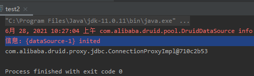
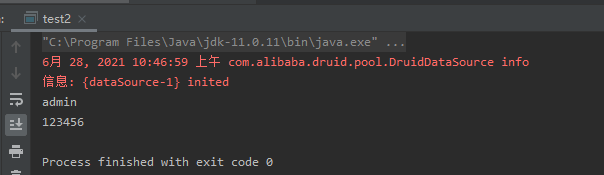

# 数据库连接池

---

jdbc，在每次连接数据库的时候都需要去重新建立对象。可以使用一个连接池，每次使用完后归还给连接池。

## 连接池概述

连接池其实就是一个容器(集合)，存放数据库连接的容器。

当系统初始化好后，容器被创建，容器中会申请一些连接对象，当用户来访问数据库时，从容器中获取连接对象，用户访问完之后，会将连接对象归还给容器。

使用连接池能节约资源使用户访问高效。

数据库连接池是一种复用 Connection 的组件，它可以避免反复创建新连接，提高 JDBC 代码的运行效率；

---

## 连接池实现

### C3P0

- https://sourceforge.net/projects/c3p0/

**maven**

```xml
<!-- https://mvnrepository.com/artifact/c3p0/c3p0 -->
<dependency>
    <groupId>c3p0</groupId>
    <artifactId>c3p0</artifactId>
    <version>0.9.1.2</version>
</dependency>
<dependency>
    <groupId>mysql</groupId>
    <artifactId>mysql-connector-java</artifactId>
    <version>8.0.25</version>
</dependency>
```

将 c3p0-config.xml 放到 src 目录下，并进行配置。
```xml
<c3p0-config>
    <default-config>
        <property name="user">root</property>
        <property name="password">toor</property>
        <property name="driverClass">com.mysql.cj.jdbc.Driver</property>
        <property name="jdbcUrl">jdbc:mysql://192.168.1.1:3306/java?useUnicode=true&amp;serverTimezone=UTC&amp;characterEncoding=UTF-8</property>

        <property name="initialPoolSize">10</property>
        <!--连接池中保留的最大连接数 -->
        <property name="maxPoolSize">50</property>
        <property name="checkoutTimeout">3000</property>
    </default-config>
</c3p0-config>
```

---

### Druid

- https://github.com/alibaba/druid

**简介**

Druid 是阿里巴巴的一个开源项目，号称为监控而生的数据库连接池，在功能、性能、扩展性方面都超过其他，例如 DBCP、C3P0、BoneCP、Proxool、JBoss、DataSource 等连接池

Druid是一个JDBC组件，包含三个部分：
* DruidDriver 代理Driver，能够提供基于Filter－Chain模式的插件体系。
* DruidDataSource 高效管理的数据库连接池。
* SQLParser SQL语法分析

直接把数据库密码写在配置文件中，容易导致安全问题。DruidDriver 和 DruidDataSource 都支持 PasswordCallback。

SQL Parser 是 Druid 的一个重要组成部分，它提供了 MySql、Oracle、Postgresql、SQL-92 的 SQL 的完整支持，这是一个手写的高性能 SQL Parser，支持 Visitor 模式，使得分析 SQL 的抽象语法树很方便。简单 SQL 语句用时 10 微秒以内，复杂 SQL 用时 30 微秒。

通过 Druid 提供的 SQL Parser 可以在 JDBC 层拦截 SQL 做相应处理，比如防御 SQL 注入（WallFilter）、合并统计没有参数化的 SQL(StatFilter 的 mergeSql)、SQL 格式化、分库分表。

**maven**

在 pom.xml 中引入 druid 官方提供的 Spring Boot Starter 组件
```xml
<dependency>
    <groupId>com.alibaba</groupId>
    <artifactId>druid-spring-boot-starter</artifactId>
    <version>1.2.6</version>
</dependency>
```

导入 druid.properties 文件

```
driverClassName=com.mysql.cj.jdbc.Driver
url=jdbc:mysql://192.168.1.1:3306/mysql?characterEncoding=utf-8
username=root
password=toor
filters=stat
initialSize=2
maxActive=300
maxWait=60000
timeBetweenEvictionRunsMillis=60000
minEvictableIdleTimeMillis=300000
validationQuery=SELECT 1
testWhileIdle=true
testOnBorrow=false
testOnReturn=false
poolPreparedStatements=false
maxPoolPreparedStatementPerConnectionSize=200
```

初始化数据池测试
```java
import com.alibaba.druid.pool.DruidDataSourceFactory;

import javax.sql.DataSource;
import java.io.InputStream;
import java.sql.Connection;
import java.util.Properties;

public class test2 {
    public static void main(String[] args) throws Exception {
        Properties pro = new Properties();  //创建properties对象
        InputStream is = test2.class.getClassLoader().getResourceAsStream("druid.properties");   //获取配置文件资源
        pro.load(is);  //加载配置文件
        DataSource dataSource = DruidDataSourceFactory.createDataSource(pro);   //创建连接池对象，并传入配置文件信息
        Connection connection = dataSource.getConnection();    //获取连接对象
        System.out.println(connection);
    }
}
```



JDBCUtils 工具类
```java
import com.alibaba.druid.pool.DruidDataSourceFactory;

import javax.sql.DataSource;
import java.io.IOException;
import java.io.InputStream;
import java.sql.*;
import java.util.Properties;

public class JDBCUtils {
    private static DataSource ds;

    static {
        Properties pro = new Properties();
        InputStream rs = JDBCUtils.class.getClassLoader().getResourceAsStream("druid.properties");
        try {
            pro.load(rs);
            try {
                ds = DruidDataSourceFactory.createDataSource(pro);

            } catch (Exception e) {
                e.printStackTrace();
            }
        } catch (IOException e) {
            e.printStackTrace();
        }
    }
    //返回连接对象
    public static Connection getConnection() throws SQLException {
        return ds.getConnection();
    }
    public  static void close(Statement stmt, Connection conn){
        if (stmt!=null){
            try {
                stmt.close();
            } catch (SQLException throwables) {
                throwables.printStackTrace();
            }

        }
        if (conn!=null){
            try {
                conn.close();
            } catch (SQLException throwables) {
                throwables.printStackTrace();
            }
        }
    }
    //该方法返回定义好的DataSource对象
    public static DataSource getDataSource(){
        return ds;
    }
}
```

查询测试
```java
import java.sql.Connection;
import java.sql.PreparedStatement;
import java.sql.ResultSet;

public class test2 {
    private static JDBCUtils JDBCutiss;

    public static void main(String[] args) throws Exception {

        Connection connection = JDBCutiss.getConnection();//获取连接对象
        String sql = "select * from login where username =?";  //设置sql语句
        PreparedStatement preparedStatement = connection.prepareStatement(sql);//传入sql语句并创建预编译执行对象
        preparedStatement.setString(1,"admin");  //sql语句设置值
        //        System.out.println(sql);
        ResultSet resultSet = preparedStatement.executeQuery();  //执行sql语句
        while (resultSet.next()){
            System.out.println(resultSet.getString("username"));//获取用户账户
            System.out.println(resultSet.getString("password"));//获取密码
        }
        JDBCutiss.close(preparedStatement,connection);
    }
}
```



---

### HikariCP

- https://github.com/brettwooldridge/HikariCP

**maven**

```xml
<dependency>
    <groupId>com.zaxxer</groupId>
    <artifactId>HikariCP</artifactId>
    <version>2.7.1</version>
</dependency>
```

创建一个DataSource实例，这个实例就是连接池
```java
HikariConfig config = new HikariConfig();
config.setJdbcUrl("jdbc:mysql://localhost:3306/test");
config.setUsername("root");
config.setPassword("password");
config.addDataSourceProperty("connectionTimeout", "1000"); // 连接超时：1秒
config.addDataSourceProperty("idleTimeout", "60000"); // 空闲超时：60秒
config.addDataSourceProperty("maximumPoolSize", "10"); // 最大连接数：10
DataSource ds = new HikariDataSource(config);
```

注意创建 DataSource 也是一个非常昂贵的操作，所以通常 DataSource 实例总是作为一个全局变量存储，并贯穿整个应用程序的生命周期。

有了连接池以后，我们如何使用它呢？和前面的代码类似，只是获取 Connection 时，把 DriverManage.getConnection() 改为 ds.getConnection()：
```java
try (Connection conn = ds.getConnection()) { // 在此获取连接
    ...
} // 在此“关闭”连接
```

通过连接池获取连接时，并不需要指定 JDBC 的相关 URL、用户名、口令等信息，因为这些信息已经存储在连接池内部了（创建 HikariDataSource 时传入的 HikariConfig 持有这些信息）。一开始，连接池内部并没有连接，所以，第一次调用 `ds.getConnection()`，会迫使连接池内部先创建一个 `Connection`，再返回给客户端使用。当我们调用 `conn.close()` 方法时（在 `try(resource){...}` 结束处），不是真正 “关闭” 连接，而是释放到连接池中，以便下次获取连接时能直接返回。

因此，连接池内部维护了若干个 `Connection` 实例，如果调用 `ds.getConnection()`，就选择一个空闲连接，并标记它为 “正在使用” 然后返回，如果对 Connection 调用 `close()`，那么就把连接再次标记为 “空闲” 从而等待下次调用。这样一来，我们就通过连接池维护了少量连接，但可以频繁地执行大量的 SQL 语句。

通常连接池提供了大量的参数可以配置，例如，维护的最小、最大活动连接数，指定一个连接在空闲一段时间后自动关闭等，需要根据应用程序的负载合理地配置这些参数。此外，大多数连接池都提供了详细的实时状态以便进行监控。

---

## Source & Reference

- [C3P0线程池的创建与应用](https://blog.csdn.net/hdshds6/article/details/108478834)
- [Maven项目中c3p0连接数据库及实例](https://blog.csdn.net/qq_31992941/article/details/78758694)
- [C3p0数据库连接池的使用](https://cloud.tencent.com/developer/article/1010318)
- [Java学习之数据库连接池](https://www.cnblogs.com/nice0e3/p/13511365.html)
- [大话数据库连接池简史，你都用过几个？](https://cloud.tencent.com/developer/article/1529682)
- [Druid(德鲁伊)数据池配置文件详解以及简单的实现](https://blog.csdn.net/qq_41063182/article/details/82530415)
- [数据库连接池为什么首选Druid](https://cloud.tencent.com/developer/article/1800267)
- [JDBC连接池](https://www.liaoxuefeng.com/wiki/1252599548343744/1321748528103458)
