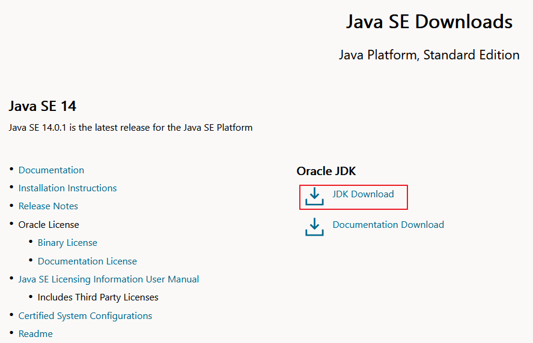
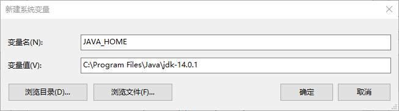
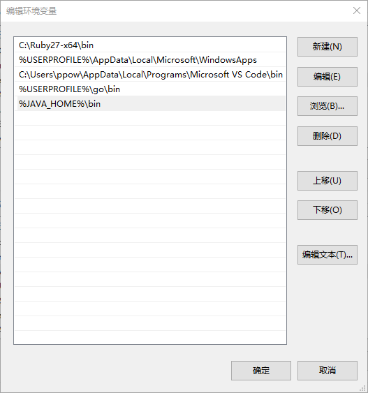
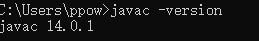
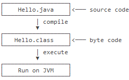

# 安装与使用

---

**下载安装包**

先下载安装 JDK,访问 oracle 官网下载 https://www.oracle.com/java/technologies/javase-downloads.html



**设置环境变量**

安装完 JDK 后，需要设置一个 JAVA_HOME 的环境变量，它指向 JDK 的安装目录。在 Windows 下，它是安装目录，类似：
```
C:\Program Files\Java\jdk-14.0.1
```

新建 JAVA_HOME
```
C:\Program Files\Java\jdk-14.0.1（jdk目录路径）
```



把 JAVA_HOME 的 bin 目录附加到系统环境变量 PATH 上。它长这样：
```
%JAVA_HOME%\bin
```



打开 cmd
```
java -version
javac -version
```



---

**JDK 目录**

在 JAVA_HOME 的 bin 目录下找到很多可执行文件：
- java：这个可执行程序其实就是 JVM，运行 Java 程序，就是启动 JVM，然后让 JVM 执行指定的编译后的代码；
- javac：这是 Java 的编译器，它用于把 Java 源码文件（以 .java 后缀结尾）编译为 Java 字节码文件（以 .class 后缀结尾）；
- jar：用于把一组 .class 文件打包成一个 .jar 文件，便于发布；
- javadoc：用于从 Java 源码中自动提取注释并生成文档；
- jdb：Java 调试器，用于开发阶段的运行调试。

---

**写一个 Java 程序运行测试**

```java
public class Hello {
    public static void main(String[] args) {
        System.out.println("Hello, world!");
    }
}
```

在一个 Java 程序中，你总能找到一个类似：
```java
public class Hello {
    ...
}
```
的定义，这个定义被称为 class（类），这里的类名是 Hello，大小写敏感，class 用来定义一个类，public 表示这个类是公开的，public、class 都是 Java 的关键字，必须小写，Hello 是类的名字，按照习惯，首字母 H 要大写。而花括号 `{}` 中间则是类的定义。

注意到类的定义中，我们定义了一个名为 main 的方法：
```java
    public static void main(String[] args) {
        ...
    }
```

方法是可执行的代码块，一个方法除了方法名 `main`，还有用 `()` 括起来的方法参数，这里的 `main` 方法有一个参数，参数类型是 `String[]`，参数名是 `args`，`public`、`static` 用来修饰方法，这里表示它是一个公开的静态方法，`void` 是方法的返回类型，而花括号 `{}` 中间的就是方法的代码。

方法的代码每一行用 `;` 结束，这里只有一行代码，就是：
```java
    System.out.println("Hello, world!");
```

它用来打印一个字符串到屏幕上。

Java 规定，某个类定义的 `public static void main(String[] args)` 是 Java 程序的固定入口方法，因此，Java 程序总是从 main 方法开始执行。

注意到 Java 源码的缩进不是必须的，但是用缩进后，格式好看，很容易看出代码块的开始和结束，缩进一般是4个空格或者一个 tab。

最后，当我们把代码保存为文件时，文件名必须是 Hello.java，而且文件名也要注意大小写，因为要和我们定义的类名 Hello 完全保持一致。

---

**Java 程序如何运行**

Java 源码本质上是一个文本文件，我们需要先用 javac 把 Hello.java 编译成字节码文件 Hello.class，然后，用 java 命令执行这个字节码文件.



因此，可执行文件 javac 是编译器，而可执行文件 java 就是虚拟机。

在保存 Hello.java 的目录下执行命令
```
javac Hello.java
```

如果源代码无误，上述命令不会有任何输出，而当前目录下会产生一个 Hello.class 文件
```
$ ls
Hello.class	Hello.java
```

第二步，执行 Hello.class，使用命令 java Hello
```
$ java Hello
Hello, world!
```

注意：给虚拟机传递的参数 Hello 是我们定义的类名，虚拟机自动查找对应的 class 文件并执行。

直接运行 java Hello.java 也是可以的,这是 Java 11 新增的一个功能，它可以直接运行一个单文件源码
```
java Hello.java
```

需要注意的是，在实际项目中，单个不依赖第三方库的 Java 源码是非常罕见的，所以，绝大多数情况下，我们无法直接运行一个 Java 源码文件，原因是它需要依赖其他的库。

---

**Source & Reference**
- [java环境变量配置 - zhanghongxian - 博客园](https://www.cnblogs.com/zhanghongxian666/p/11149104.html)
- [安装JDK - 廖雪峰的官方网站](https://www.liaoxuefeng.com/wiki/1252599548343744/1280507291631649)
