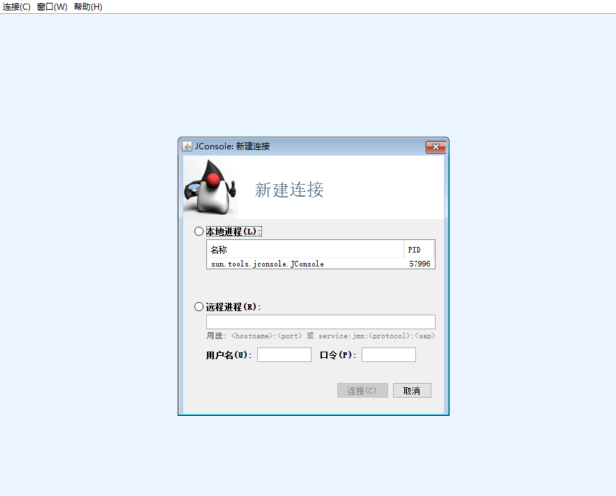
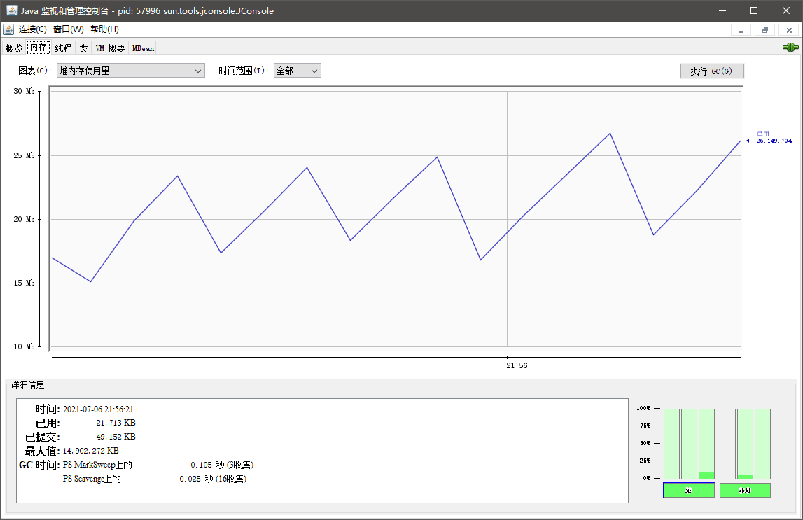
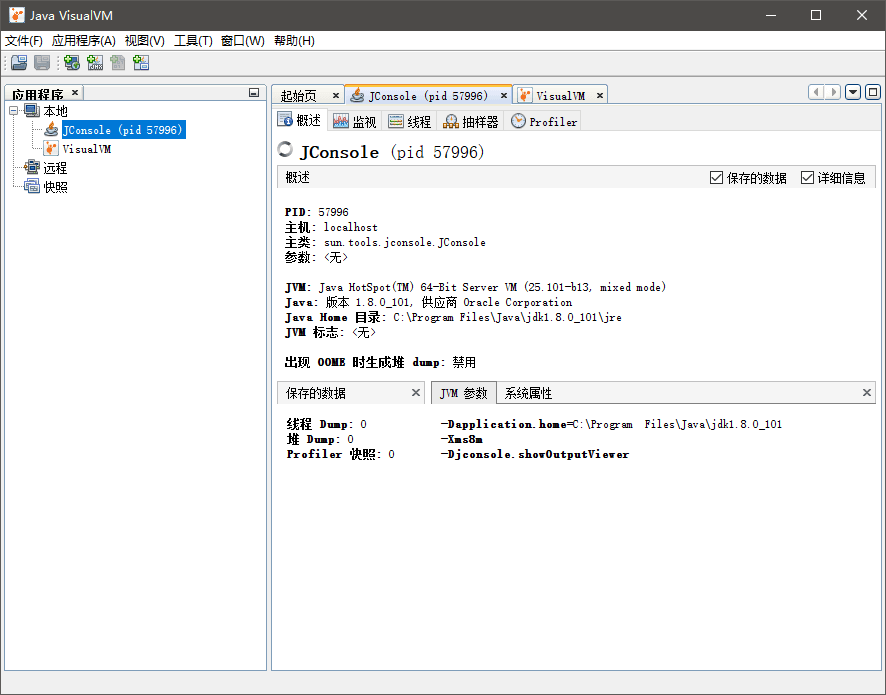
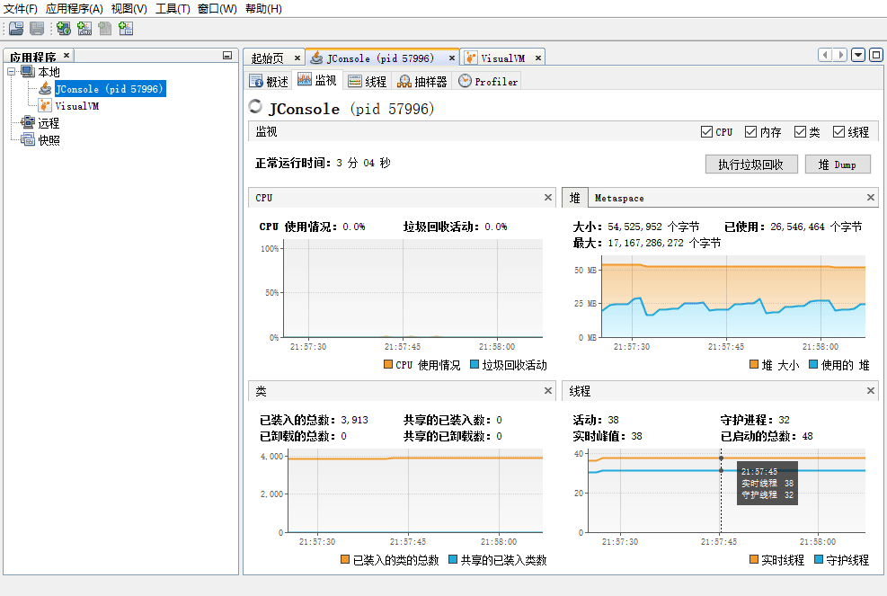
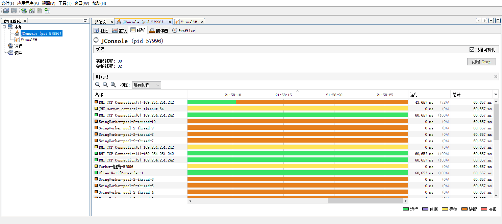
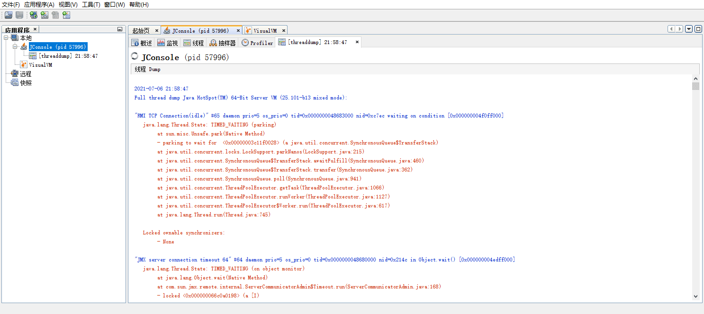
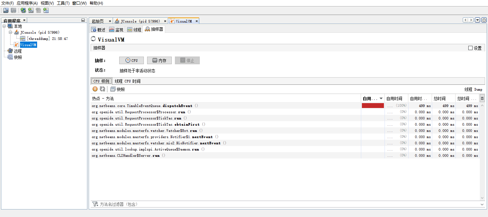

# 工具

---

## jconsole

jconsole 是 JDK 自带的 GUI 工具。jconsole(Java Monitoring and Management Console) 是一种基于 JMX 的可视化监视与管理工具。

jconsole 的管理功能是针对 JMX MBean 进行管理，由于 MBean 可以使用代码、中间件服务器的管理控制台或所有符合 JMX 规范的软件进行访问。

注意：使用 jconsole 的前提是 Java 应用开启 JMX。

### 开启 JMX

Java 应用开启 JMX 后，可以使用 jconsole 或 jvisualvm 进行监控 Java 程序的基本信息和运行情况。

开启方法是，在 java 指令后，添加以下参数：
```java
-Dcom.sun.management.jmxremote=true
-Dcom.sun.management.jmxremote.ssl=false
-Dcom.sun.management.jmxremote.authenticate=false
-Djava.rmi.server.hostname=127.0.0.1        //指定 Java 程序运行的服务器
-Dcom.sun.management.jmxremote.port=18888   //指定 JMX 服务监听端口
```

### 连接 jconsole

如果是本地 Java 进程，jconsole 可以直接绑定连接。

如果是远程 Java 进程，需要连接 Java 进程的 JMX 端口。



### jconsole 界面

进入 jconsole 应用后，可以看到以下 tab 页面。

* 概述 - 显示有关 Java VM 和监视值的概述信息。
* 内存 - 显示有关内存使用的信息。内存页相当于可视化的 jstat 命令。
* 线程 - 显示有关线程使用的信息。
* 类 - 显示有关类加载的信息。
* VM 摘要 - 显示有关 Java VM 的信息。
* MBean - 显示有关 MBean 的信息。



---

## jvisualvm

jvisualvm 是 JDK 自带的 GUI 工具。jvisualvm(All-In-One Java Troubleshooting Tool) 是多合一故障处理工具。它支持运行监视、故障处理、性能分析等功能。

### jvisualvm 概述页面

jvisualvm 概述页面可以查看当前 Java 进程的基本信息，如：JDK 版本、Java 进程、JVM 参数等。



### jvisualvm 监控页面



### jvisualvm 线程页面

jvisualvm 线程页面展示了当前的线程状态。



jvisualvm 还可以生成线程 Dump 文件，帮助进一步分析线程栈信息。



### jvisualvm 抽样器页面

jvisualvm 可以对 CPU、内存进行抽样，帮助我们进行性能分析。



---

## MAT

MAT 即 Eclipse Memory Analyzer Tool 的缩写。

MAT 本身也能够获取堆的二进制快照。该功能将借助 `jps` 列出当前正在运行的 Java 进程，以供选择并获取快照。由于 `jps` 会将自己列入其中，因此你会在列表中发现一个已经结束运行的 `jps` 进程。

MAT 可以独立安装，也可以作为 Eclipse IDE 的插件安装。

- http://www.eclipse.org/mat/downloads.php

### MAT 配置

MAT 解压后，安装目录下有个 `MemoryAnalyzer.ini` 文件。

`MemoryAnalyzer.ini` 中有个重要的参数 `Xmx` 表示最大内存，默认为：`-vmargs -Xmx1024m`

如果试图用 MAT 导入的 dump 文件超过 1024 M，会报错：
```
An internal error occurred during: "Parsing heap dump from XXX"
```

此时，可以适当调整 Xmx 大小。如果设置的 Xmx 数值过大，本机内存不足以支撑，启动 MAT 会报错：
```
Failed to create the Java Virtual Machine
```

---

## Arthas

- https://github.com/alibaba/arthas

Arthas 是 Alibaba 开源的 Java 诊断工具，深受开发者喜爱。在线排查问题，无需重启；动态跟踪 Java 代码；实时监控 JVM 状态。

Arthas 支持 JDK 6+，支持 Linux/Mac/Windows，采用命令行交互模式，同时提供丰富的 Tab 自动补全功能，进一步方便进行问题的定位和诊断。

### 安装

* 使用 arthas-boot(推荐)

    下载 arthas-boot.jar，然后用 java -jar 的方式启动：

    ```
    curl -O https://arthas.aliyun.com/arthas-boot.jar
    java -jar arthas-boot.jar
    ```

    打印帮助信息：

    ```
    java -jar arthas-boot.jar -h
    ```

    如果下载速度比较慢，可以使用 aliyun 的镜像：

    ```
    java -jar arthas-boot.jar --repo-mirror aliyun --use-http
    ```

* 使用 as.sh

    Arthas 支持在 Linux/Unix/Mac 等平台上一键安装
    ```
    curl -L https://arthas.aliyun.com/install.sh | sh
    ```
    上述命令会下载启动脚本文件 as.sh 到当前目录，你可以放在任何地方或将其加入到 $PATH 中。

    直接在 shell 下面执行./as.sh，就会进入交互界面。

    也可以执行./as.sh -h 来获取更多参数信息。

### 使用

参考官方文档

- https://github.com/alibaba/arthas/blob/master/README_CN.md
- https://start.aliyun.com/handson-lab?category=arthas
- https://arthas.aliyun.com/doc/quick-start.html

---

## jps

jps 是虚拟机进程状态工具。它可以显示指定系统内所有的 HotSpot 虚拟机进程状态信息。jps 通过 RMI 协议查询开启了 RMI 服务的远程虚拟机进程状态。

### jps 命令用法

```
jps [option] [hostid]
jps [-help]
```

如果不指定 hostid 就默认为当前主机或服务器。

常用参数：

* option - 选项参数
    * -m - 输出 JVM 启动时传递给 `main()` 的参数。
    * -l - 输出主类的全名，如果进程执行的是 jar 包，输出 jar 路径。
    * -v - 显示传递给 JVM 的参数。
    * -q - 仅输出本地 JVM 进程 ID。
    * -V - 仅输出本地 JVM 标识符。
* hostid - RMI 注册表中注册的主机名。如果不指定 hostid 就默认为当前主机或服务器。

其中 option、hostid 参数也可以不写。

### jps 使用示例

列出本地 Java 进程
```
$ jps
18027 Java2Demo.JAR
18032 jps
18005 jstat
```

列出本地 Java 进程 ID
```
$ jps -q
8841
1292
5398
```

列出本地 Java 进程 ID，并输出主类的全名，如果进程执行的是 jar 包，输出 jar 路径
```
$ jps -l
3002 /opt/jdk1.7.0/demo/jfc/Java2D/Java2Demo.JAR
2857 sun.tools.jstatd.jstatd
```

---

## jstat

命令格式：
```
jstat [option] VMID [interval] [count]
```

常用参数：
* option - 选项参数，用于指定用户需要查询的虚拟机信息
    * -class - 监视类装载、卸载数量、总空间以及类装载所耗费的时间
    * -compiler：显示 JIT 编译的相关信息；
    * -gc：监视 Java 堆状况，包括 Eden 区、两个 survivor 区、老年代、永久代等区的容量、已用空间、GC 时间合计等信息。
    * -gccapacity：显示各个代的容量以及使用情况；
    * -gcmetacapacity：显示 Metaspace 的大小；
    * -gcnew：显示新生代信息；
    * -gcnewcapacity：显示新生代大小和使用情况；
    * -gcold：显示老年代和永久代的信息；
    * -gcoldcapacity：显示老年代的大小；
    * -gcutil：显示垃圾回收统计信息；
    * -gccause：显示垃圾回收的相关信息（通 -gcutil），同时显示最后一次或当前正在发生的垃圾回收的诱因；
    * -printcompilation：输出 JIT 编译的方法信息。
* VMID - 如果是本地虚拟机进程，则 VMID 与 LVMID 是一致的；如果是远程虚拟机进程，那 VMID 的格式应当是：`[protocol:][//]lvmid[@hostname[:port]/servername]`
* interval - 查询间隔
* count - 查询次数

更详细说明可以参考
- https://www.cnblogs.com/yjd_hycf_space/p/7755633.html

### jstat 使用示例

**类加载统计**

使用 jstat -class pid 命令可以查看编译统计信息。
* Loaded - 加载 class 的数量
* Bytes - 所占用空间大小
* Unloaded - 未加载数量
* Bytes - 未加载占用空间
* Time - 时间

查看类加载信息
```
$ jstat -class 7129
Loaded  Bytes  Unloaded  Bytes     Time
 26749 50405.3      873  1216.8      19.75
```

**编译统计**

使用 jstat -compiler pid 命令可以查看编译统计信息。
* Compiled - 编译数量
* Failed - 失败数量
* Invalid - 不可用数量
* Time - 时间
* FailedType - 失败类型
* FailedMethod - 失败的方法

```
$ jstat -compiler 7129
Compiled Failed Invalid   Time   FailedType FailedMethod
   42030      2       0   302.53          1 org/apache/felix/framework/BundleWiringImpl$BundleClassLoader findClass
```

**GC 统计**

使用 jstat -gc pid time 命令可以查看 GC 统计信息。

以 250 毫秒的间隔进行 7 个采样，并显示 -gcutil 选项指定的输出。
```
$ jstat -gcutil 21891 250 7
  S0     S1     E      O      M     CCS    YGC     YGCT    FGC    FGCT     GCT
  0.00  97.02  70.31  66.80  95.52  89.14      7    0.300     0    0.000    0.300
  0.00  97.02  86.23  66.80  95.52  89.14      7    0.300     0    0.000    0.300
  0.00  97.02  96.53  66.80  95.52  89.14      7    0.300     0    0.000    0.300
 91.03   0.00   1.98  68.19  95.89  91.24      8    0.378     0    0.000    0.378
 91.03   0.00  15.82  68.19  95.89  91.24      8    0.378     0    0.000    0.378
 91.03   0.00  17.80  68.19  95.89  91.24      8    0.378     0    0.000    0.378
 91.03   0.00  17.80  68.19  95.89  91.24      8    0.378     0    0.000    0.378
```

以 1 秒的间隔进行 4 个采样，并显示-gc 选项指定的输出。
```
$ jstat -gc 25196 1s 4
 S0C    S1C    S0U    S1U      EC       EU        OC         OU       MC     MU    CCSC   CCSU   YGC     YGCT    FGC    FGCT     GCT
20928.0 20928.0  0.0    0.0   167936.0  8880.5   838912.0   80291.2   106668.0 100032.1 12772.0 11602.2    760   14.332  580   656.218  670.550
20928.0 20928.0  0.0    0.0   167936.0  8880.5   838912.0   80291.2   106668.0 100032.1 12772.0 11602.2    760   14.332  580   656.218  670.550
20928.0 20928.0  0.0    0.0   167936.0  8880.5   838912.0   80291.2   106668.0 100032.1 12772.0 11602.2    760   14.332  580   656.218  670.550
20928.0 20928.0  0.0    0.0   167936.0  8880.5   838912.0   80291.2   106668.0 100032.1 12772.0 11602.2    760   14.332  580   656.218  670.550
```

参数说明：
* S0C：年轻代中 To Survivor 的容量（单位 KB）；
* S1C：年轻代中 From Survivor 的容量（单位 KB）；
* S0U：年轻代中 To Survivor 目前已使用空间（单位 KB）；
* S1U：年轻代中 From Survivor 目前已使用空间（单位 KB）；
* EC：年轻代中 Eden 的容量（单位 KB）；
* EU：年轻代中 Eden 目前已使用空间（单位 KB）；
* OC：Old 代的容量（单位 KB）；
* OU：Old 代目前已使用空间（单位 KB）；
* MC：Metaspace 的容量（单位 KB）；
* MU：Metaspace 目前已使用空间（单位 KB）；
* YGC：从应用程序启动到采样时年轻代中 gc 次数；
* YGCT：从应用程序启动到采样时年轻代中 gc 所用时间 (s)；
* FGC：从应用程序启动到采样时 old 代（全 gc）gc 次数；
* FGCT：从应用程序启动到采样时 old 代（全 gc）gc 所用时间 (s)；
* GCT：从应用程序启动到采样时 gc 用的总时间 (s)。

---

## jmap

jmap 是 Java 内存映像工具。jmap 用于生成堆转储快照（一般称为 heapdump 或 dump 文件）。jmap 不仅能生成 dump 文件，还可以查询 finalize 执行队列、Java 堆和永久代的详细信息，如当前使用率、当前使用的是哪种收集器等。

如果不使用这个命令，还可以使用 `-XX:+HeapDumpOnOutOfMemoryError` 参数来让虚拟机出现 OOM 的时候，自动生成 dump 文件。

### jmap 命令用法

命令格式：
```
jmap [option] pid
```

option 选项参数：
* -dump - 生成堆转储快照。-dump:live 只保存堆中的存活对象。
* -finalizerinfo - 显示在 F-Queue 队列等待执行 finalizer 方法的对象
* -heap - 显示 Java 堆详细信息。
* -histo - 显示堆中对象的统计信息，包括类、实例数量、合计容量。-histo:live 只统计堆中的存活对象。
* -permstat - to print permanent generation statistics
* -F - 当-dump 没有响应时，强制生成 dump 快照

### jstat 使用示例

**生成 heapdump 快照**

dump 堆到文件，format 指定输出格式，live 指明是活着的对象，file 指定文件名
```
$ jmap -dump:live,format=b,file=dump.hprof 28920
Dumping heap to /home/xxx/dump.hprof ...
Heap dump file created
```

dump.hprof 这个后缀是为了后续可以直接用 MAT(Memory Anlysis Tool)等工具打开。

**#查看实例数最多的类**

```
$ jmap -histo 29527 | head -n 6

 num     #instances         #bytes  class name
----------------------------------------------
   1:      13673280     1438961864  [C
   2:       1207166      411277184  [I
   3:       7382322      347307096  [Ljava.lang.Object;
```

**查看指定进程的堆信息**

注意：使用 CMS GC 情况下，jmap -heap PID 的执行有可能会导致 java 进程挂起。
```
$ jmap -heap 12379
Attaching to process ID 12379, please wait...
Debugger attached successfully.
Server compiler detected.
JVM version is 17.0-b16

using thread-local object allocation.
Parallel GC with 6 thread(s)

Heap Configuration:
   MinHeapFreeRatio = 40
   MaxHeapFreeRatio = 70
   MaxHeapSize      = 83886080 (80.0MB)
   NewSize          = 1310720 (1.25MB)
   MaxNewSize       = 17592186044415 MB
   OldSize          = 5439488 (5.1875MB)
   NewRatio         = 2
   SurvivorRatio    = 8
   PermSize         = 20971520 (20.0MB)
   MaxPermSize      = 88080384 (84.0MB)

Heap Usage:
PS Young Generation
Eden Space:
   capacity = 9306112 (8.875MB)
   used     = 5375360 (5.1263427734375MB)
   free     = 3930752 (3.7486572265625MB)
   57.761608714788736% used
From Space:
   capacity = 9306112 (8.875MB)
   used     = 3425240 (3.2665634155273438MB)
   free     = 5880872 (5.608436584472656MB)
   36.80634834397007% used
To Space:
   capacity = 9306112 (8.875MB)
   used     = 0 (0.0MB)
   free     = 9306112 (8.875MB)
   0.0% used
PS Old Generation
   capacity = 55967744 (53.375MB)
   used     = 48354640 (46.11457824707031MB)
   free     = 7613104 (7.2604217529296875MB)
   86.39733629427693% used
PS Perm Generation
   capacity = 62062592 (59.1875MB)
   used     = 60243112 (57.452308654785156MB)
   free     = 1819480 (1.7351913452148438MB)
   97.06831451706046% used
```

---

## jstack

jstack 是 Java 堆栈跟踪工具。jstack 用来打印目标 Java 进程中各个线程的栈轨迹，以及这些线程所持有的锁，并可以生成 java 虚拟机当前时刻的线程快照（一般称为 threaddump 或 javacore 文件）。

线程快照是当前虚拟机内每一条线程正在执行的方法堆栈的集合，生成线程快照的主要目的是定位线程出现长时间停顿的原因，如线程间死锁、死循环、请求外部资源导致的长时间等待等。

`jstack` 通常会结合 `top -Hp pid` 或 `pidstat -p pid -t` 一起查看具体线程的状态，也经常用来排查一些死锁的异常。

线程出现停顿的时候通过 jstack 来查看各个线程的调用堆栈，就可以知道没有响应的线程到底在后台做什么事情，或者等待什么资源。 如果 java 程序崩溃生成 core 文件，jstack 工具可以用来获得 core 文件的 java stack 和 native stack 的信息，从而可以轻松地知道 java 程序是如何崩溃和在程序何处发生问题。另外，jstack 工具还可以附属到正在运行的 java 程序中，看到当时运行的 java 程序的 java stack 和 native stack 的信息, 如果现在运行的 java 程序呈现 hung 的状态，jstack 是非常有用的。

### jstack 命令用法

命令格式：
```
jstack [option] pid
```

option 选项参数
* -F - 当正常输出请求不被响应时，强制输出线程堆栈
* -l - 除堆栈外，显示关于锁的附加信息
* -m - 打印 java 和 jni 框架的所有栈信息

### jstack 使用示例

**找出某 Java 进程中最耗费 CPU 的 Java 线程**

1. 找出 Java 进程

    假设应用名称为 myapp：
    ```
    $ jps | grep myapp
    29527 myapp.jar
    ```

    得到进程 ID 为 21711

2. 找出该进程内最耗费 CPU 的线程，可以使用 ps -Lfp pid 或者 ps -mp pid -o THREAD, tid, time 或者 top -Hp pid

    TIME 列就是各个 Java 线程耗费的 CPU 时间，CPU 时间最长的是线程 ID 为 21742 的线程，用
    ```
    printf "%x\n" 21742
    ```

    得到 21742 的十六进制值为 54ee

3. 使用 jstack 打印线程堆栈信息

    下一步终于轮到 jstack 上场了，它用来输出进程 21711 的堆栈信息，然后根据线程 ID 的十六进制值 grep，如下：
    ```
    $ jstack 21711 | grep 54ee
    "PollIntervalRetrySchedulerThread" prio=10 tid=0x00007f950043e000 nid=0x54ee in Object.wait() [0x00007f94c6eda000]
    ```
    可以看到 CPU 消耗在 PollIntervalRetrySchedulerThread 这个类的 Object.wait()。

    注：上面的例子中，默认只显示了一行信息，但很多时候我们希望查看更详细的调用栈。可以通过指定 `-A <num>` 的方式来显示行数。例如：`jstack -l <pid> | grep <thread-hex-id> -A 10`

3. 分析代码

    定位到下面的代码：
    ```
    // Idle wait
    getLog().info("Thread [" + getName() + "] is idle waiting...");
    schedulerThreadState = PollTaskSchedulerThreadState.IdleWaiting;
    long now = System.currentTimeMillis();
    long waitTime = now + getIdleWaitTime();
    long timeUntilContinue = waitTime - now;
    synchronized(sigLock) {
        try {
            if(!halted.get()) {
                sigLock.wait(timeUntilContinue);
            }
        }
        catch (InterruptedException ignore) {
        }
    }
    ```

    它是轮询任务的空闲等待代码，上面的 `sigLock.wait(timeUntilContinue)` 就对应了前面的 `Object.wait()`。

**生成 threaddump 文件**

可以使用 `jstack -l <pid> > <file-path>` 命令生成 threaddump 文件

生成进程 ID 为 8841 的 Java 进程的 threaddump 文件。
```
jstack -l 8841 > /home/threaddump.txt
```

### thread dump 文件

java thread dump 文件内容见 https://dunwu.github.io/javacore/jvm/jvm-cli-tools.html#_4-2-thread-dump-%E6%96%87%E4%BB%B6

---

## jinfo

jinfo 是 Java 配置信息工具。jinfo 用于实时查看和调整虚拟机运行参数。如传递给 Java 虚拟机的 `-X`（即输出中的 jvm_args）、`-XX` 参数（即输出中的 VM Flags），以及可在 Java 层面通过 System.getProperty 获取的 `-D` 参数（即输出中的 System Properties）。

之前的 `jps -v` 口令只能查看到显示指定的参数，如果想要查看未被显示指定的参数的值就要使用 jinfo 口令。

jinfo 命令格式：
```
jinfo [option] pid
```

option 选项参数：
* -flag - 输出指定 args 参数的值
* -sysprops - 输出系统属性，等同于 `System.getProperties()`

jinfo 使用示例
```
$ jinfo -sysprops 29527
Attaching to process ID 29527, please wait...
Debugger attached successfully.
Server compiler detected.
JVM version is 25.222-b10
...
```

---

## jhat

jhat(JVM Heap Analysis Tool)，是虚拟机堆转储快照分析工具。jhat 与 jmap 搭配使用，用来分析 jmap 生成的 dump 文件。jhat 内置了一个微型的 HTTP/HTML 服务器，生成 dump 的分析结果后，可以在浏览器中查看。

注意：一般不会直接在服务器上进行分析，因为 jhat 是一个耗时并且耗费硬件资源的过程，一般把服务器生成的 dump 文件，用 jvisualvm 、Eclipse Memory Analyzer、IBM HeapAnalyzer 等工具来分析。

命令格式：
```
jhat [dumpfile]
```

---

## Source & Reference

- https://dunwu.github.io/javacore/jvm/jvm-gui-tools.html
- https://dunwu.github.io/javacore/jvm/jvm-cli-tools.html
