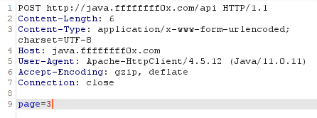
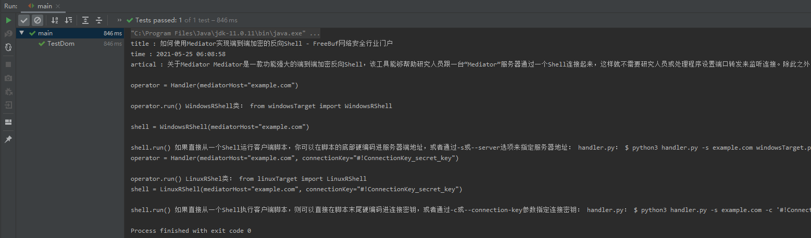

# 爬虫

---

**拆分过程**

请求，过滤(提取)，存储

---

## 爬虫的请求

### maven 依赖

```xml
        <dependency>
            <groupId>org.apache.httpcomponents</groupId>
            <artifactId>httpclient</artifactId>
            <version>4.5.12</version>
        </dependency>
```

### get请求

```java
    public static void main(String[] args) {
        CloseableHttpClient client = HttpClients.createDefault(); //创建httpclient 对象。
        HttpGet httpGet = new HttpGet("https://java.ffffffff0x.com/api");  //创建get请求对象。
        CloseableHttpResponse response = null;
        try {
            response = client.execute(httpGet);   //发送get请求
            if (response.getStatusLine().getStatusCode()==200){
                String s = EntityUtils.toString(response.getEntity(),"utf-8");
                System.out.println(s);
                System.out.println(httpGet);
            }

        } catch (IOException e) {
            e.printStackTrace();
        }finally {
            try {
                response.close();
                client.close();

            } catch (IOException e) {
                e.printStackTrace();
            }

        }
    }
```

### get携带参数请求

```java
    public static void main(String[] args) throws URISyntaxException {
        CloseableHttpClient client = HttpClients.createDefault(); //创建httpclient 对象。
        URIBuilder uriBuilder = new URIBuilder("https://java.ffffffff0x.com/api");   //使用URIBuilder设置地址
        uriBuilder.setParameter("page","2");    //设置传入参数
        HttpGet httpGet = new HttpGet(uriBuilder.build());  //创建get请求对象。
//        https://xz.aliyun.com/?page=1
        CloseableHttpResponse response = null;
        try {
            response = client.execute(httpGet);   //发送get请求
            if (response.getStatusLine().getStatusCode()==200){
                String s = EntityUtils.toString(response.getEntity(),"utf-8");
                System.out.println(s);
                System.out.println(httpGet);

            }

        } catch (IOException e) {
            e.printStackTrace();
        }finally {
            try {
                response.close();
                client.close();

            } catch (IOException e) {
                e.printStackTrace();
            }

        }
    }
```

### post请求

```java
    public static void main(String[] args) {
        CloseableHttpClient client = HttpClients.createDefault();
        HttpPost httpPost = new HttpPost("https://java.ffffffff0x.com/api");
        CloseableHttpResponse response = null;
        try {
            response = client.execute(httpPost);

                String s = EntityUtils.toString(response.getEntity());
                System.out.println(s);
                System.out.println(httpPost);

        } catch (IOException e) {
            e.printStackTrace();
        }
    }
```

在 get 和 post 的请求不携带参数请求当中，get 的请求方式和 post 的请求方式基本类似。但是创建请求对象时，get 请求用的是 HttpGet 来生成对象，而 Post 则是 HttpPost 来生成对象。

### post携带参数请求

```java
    public static void main(String[] args) throws IOException {
        CloseableHttpClient client = HttpClients.createDefault();//创建httpClients对象
        HttpPost httpPost = new HttpPost("http://java.ffffffff0x.com/api"); //设置请求对象
        List<NameValuePair> params = new ArrayList<NameValuePair>();  //声明list集合，存储传入参数
        params.add(new BasicNameValuePair("page","3"));
        UrlEncodedFormEntity formEntity = new UrlEncodedFormEntity(params,"utf-8"); //创建表单的Entity对象，传入params参数
        httpPost.setEntity(formEntity);   //设置表单内容到post包中
        CloseableHttpResponse response  = client.execute(httpPost);
        String s = EntityUtils.toString(response.getEntity());
        System.out.println(s);
        System.out.println(s.length());
        System.out.println(httpPost);
    }
```



### 走代理

```java
        //设置代理IP、端口、协议（请分别替换）
        HttpHost proxy = new HttpHost("127.0.0.1", 1080, "http");

        //把代理设置到请求配置
        RequestConfig defaultRequestConfig = RequestConfig.custom()
                .setProxy(proxy)
                .build();

        //实例化CloseableHttpClient对象
        CloseableHttpClient httpclient = HttpClients.custom().setDefaultRequestConfig(defaultRequestConfig).build();

        //访问目标地址
        HttpGet httpGet = new HttpGet("https://www.google.com");

        //请求返回
        CloseableHttpResponse httpResp = httpclient.execute(httpGet);
        try {
            int statusCode = httpResp.getStatusLine().getStatusCode();
            if (statusCode == HttpStatus.SC_OK) {
                System.out.println("成功");
            }
        } catch (Exception e) {

        } finally {
            httpResp.close();
        }
```

---

### 连接池

如果每次请求都要创建 HttpClient，会有频繁创建和销毁的问题，可以使用连接池来解决这个问题。

创建一个连接池对象：

```java
PoolingHttpClientConnectionManager cm = new PoolingHttpClientConnectionManager();

public void setMaxTotal(int max)
        设置最大连接数

public void setDefaultMaxPerRoute(int max)
        设置每个主机的并发数
```

创建连接池代码

```java
    public static void main(String[] args) {
        PoolingHttpClientConnectionManager cm = new PoolingHttpClientConnectionManager();
        cm.setMaxTotal(100); //设置最大连接数
        cm.setDefaultMaxPerRoute(100);   //设置每个主机的并发数
        doGet(cm);
        doGet(cm);
    }

    private static void doGet(PoolingHttpClientConnectionManager cm) {
        CloseableHttpClient httpClient = HttpClients.custom().setConnectionManager(cm).build();
        HttpGet httpGet = new HttpGet("http://www.baidu.com");
        try {
            CloseableHttpResponse response = httpClient.execute(httpGet);
            String s = EntityUtils.toString(response.getEntity(),"utf-8");
        } catch (IOException e) {
            e.printStackTrace();
        }
    }
```

HttpClient 请求配置

```java
    public static void main(String[] args) throws IOException {
        CloseableHttpClient client = HttpClients.createDefault(); //创建httpclient 对象。
        HttpGet httpGet = new HttpGet("http://www.baidu.com");  //创建get请求对象。
        RequestConfig config = RequestConfig.custom().setConnectTimeout(1000) // 设置创建连接的最长时间
                .setConnectionRequestTimeout(500) //设置获取连接最长时间
                .setSocketTimeout(500).build();  //设置数据传输最长时间

        httpGet.setConfig(config);
        CloseableHttpResponse response  = client.execute(httpGet);
        String s = EntityUtils.toString(response.getEntity());
        System.out.println(s);
    }
```

## 爬虫的提取

### jsoup

jsoup 是一款 Java 的 HTML 解析器，可直接解析某个 URL 地址、HTML 文本内容。它提供了一套非常省力的 API，可通过 DOM，CSS 以及类似于 jQuery 的操作方法来取出和操作数据。

jsoup 的主要功能如下：
* 从一个 URL，文件或字符串中解析 HTML；
* 使用 DOM 或 CSS 选择器来查找、取出数据；
* 可操作 HTML 元素、属性、文本；

**maven 依赖**

```xml
        <dependency>
            <!-- jsoup HTML parser library @ http://jsoup.org/ -->
            <groupId>org.jsoup</groupId>
            <artifactId>jsoup</artifactId>
            <version>1.10.2</version>
        </dependency>
```

来一段爬取论坛 title 的代码
```java
    @Test
    public void testUrl() throws Exception {
        Document doc = Jsoup.parse(new URL("https://home.ffffffff0x.com/"),10000);//设置请求url与超时时间
        String title = doc.getElementsByTag("title").first().text();// //获取title的内容
        System.out.println(title);
    }
```

这里的 first() 代表获取第一个元素，text() 表示获取标签内容

### dom遍历元素

```java
    @Test
    public void TestDom() throws IOException {
        Document doc = Jsoup.parse(new URL("https://ffffffff0x.com/"), 10000);
        String title = doc.getElementsByTag("title").text();
        String h1 = doc.getElementsByTag("h1").text();

        String ex2 = doc.getElementsByClass("ex2").first().text();
        System.out.println("title : "+title);
        System.out.println("h1 : "+h1);
        System.out.println("ex2 : "+ex2);
    }
```

### 爬取文章

```java
    @Test
    public void TestDom() throws IOException {
        String url = "https://www.freebuf.com/articles/network/274294.html";

        Document doc = Jsoup.parse(new URL(url), 10000);
        String title = doc.getElementsByTag("title").text();
        String time = doc.getElementsByClass("author-info").text();
        String artical = doc.getElementsByClass("artical-body").text();

        System.out.println("title : "+title);
        System.out.println("time : "+time);
        System.out.println("artical : "+artical);
    }
```



### 多线程爬取

爬虫类
```java
public class Climbimp implements Runnable {
    private String url ;

    Lock lock = new ReentrantLock();

    public Climbimp(String url, int pages) {
        this.url = url;
    }

    public void run() {
        lock.lock();
        Document doc = null;
        try {
            doc = Jsoup.parse(new URL(url), 10000);
        } catch (IOException e) {
            e.printStackTrace();
        }
        String title = doc.getElementsByTag("title").text();
        String time = doc.getElementsByClass("author-info").text();
        String artical = doc.getElementsByClass("artical-body").text();

        System.out.println("title : "+title);
        //System.out.println("time : "+time);
        //System.out.println("artical : "+artical);

        lock.unlock();

    }
}
```

主类
```java
public class main {

    public static void main(String[] args) {

        int Threadlist_num = 50; //线程数
        String url = "https://www.freebuf.com/articles/network/274294.html";  //url

        Climbimp climbimpl = new Climbimp(url,pages);

        for (int i = 0; i < Threadlist_num; i++) {
            new Thread(climbimpl).start();
        }
    }
}
```

这里执行会访问 50 次 https://www.freebuf.com/articles/network/274294.html , 然后就被 freebuf 封 ip 了😂


---

## Source & Reference

- https://www.cnblogs.com/nice0e3/p/13488064.html
- https://blog.csdn.net/ly6cyh/article/details/77141346
- https://www.cnblogs.com/nice0e3/p/13488064.html
