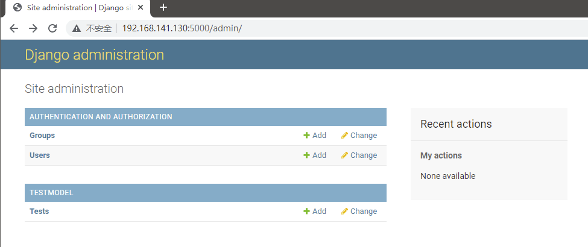

# 基础

---

## 模板

在 testweb 目录底下创建 templates 目录并建立 ffffffff0x.html 文件
```
├── manage.py
├── templates
│   └── ffffffff0x.html
└── testweb
    ├── asgi.py
    ├── __init__.py
    ├── settings.py
    ├── urls.py
    ├── views.py
    └── wsgi.py
```

ffffffff0x.html 内容如下
```html
<h1>{{ hello }}</h1>
```

修改 testweb/settings.py,修改 TEMPLATES 中的 DIRS 为 [os.path.join(BASE_DIR, 'templates')]
```py
import os

# 中间略

TEMPLATES = [
    {
        'BACKEND': 'django.template.backends.django.DjangoTemplates',
        'DIRS': [os.path.join(BASE_DIR, 'templates')],
        'APP_DIRS': True,
        'OPTIONS': {
            'context_processors': [
                'django.template.context_processors.debug',
                'django.template.context_processors.request',
                'django.contrib.auth.context_processors.auth',
                'django.contrib.messages.context_processors.messages',
            ],
        },
    },
]
```

修改 views.py,增加一个新的对象,用于向模板提交数据
```py
from django.shortcuts import render

def ffffffff0x(request):
    context          = {}
    context['hello'] = 'Hello World!'
    return render(request, 'ffffffff0x.html', context)
```

修改 urls.py
```py
from django.urls import path

from . import views

urlpatterns = [
    path('ffffffff0x/', views.ffffffff0x),
]
```

---

### 模板标签

#### 变量

模板语法
```
view：｛"HTML变量名" : "views变量名"｝
HTML：｛｛变量名｝｝
```

修改 views.py
```py
from django.shortcuts import render

def ffffffff0x(request):
  views_name = "ffffffff0x test"
  return  render(request,"ffffffff0x.html", {"name":views_name})
```

修改 templates 中的 ffffffff0x.html
```html
<p>{{ name }}</p>
```

#### 列表

templates 中的 ffffffff0x.html 中,可以用 `.` 索引下标取出对应的元素。

修改 views.py
```py
from django.shortcuts import render

def ffffffff0x(request):
    views_list = ["test1","test2","test3"]
    return render(request, "ffffffff0x.html", {"views_list": views_list})
```

修改 ffffffff0x.html
```html
<p>{{ views_list }}</p>   # 取出整个列表
<p>{{ views_list.0 }}</p> # 取出列表的第一个元素
```

#### 字典

templates 中的 ffffffff0x.html 中,可以用 `.` 键 取出对应的值。

修改 views.py
```py
from django.shortcuts import render

def ffffffff0x(request):
    views_dict = {"name":"ffffffff0x"}
    return render(request, "ffffffff0x.html", {"views_dict": views_dict})
```

修改 ffffffff0x.html
```html
<p>{{ views_dict }}</p>
<p>{{ views_dict.name }}</p>
```

#### 过滤器

模板语法：
```
{{ 变量名 | 过滤器：可选参数 }}
```

模板过滤器可以在变量被显示前修改它,过滤器使用管道字符,如下所示：
```
{{ name|lower }}
```

{{ name }} 变量被过滤器 lower 处理后,文档大写转换文本为小写。

过滤管道可以被套接 ,既是说,一个过滤器管道的输出又可以作为下一个管道的输入：
```
{{ my_list|first|upper }}
```

以上实例将第一个元素并将其转化为大写。

有些过滤器有参数。 过滤器的参数跟随冒号之后并且总是以双引号包含。 例如：
```
{{ bio|truncatewords:"30" }}
```

这个将显示变量 bio 的前30个词。

其他过滤器：
- addslashes : 添加反斜杠到任何反斜杠、单引号或者双引号前面。
- date : 按指定的格式字符串参数格式化 date 或者 datetime 对象,实例：
    ```
    {{ pub_date|date:"F j, Y" }}
    ```
- length : 返回变量的长度。

**default**

default 为变量提供一个默认值。

如果 views 传的变量的布尔值是 false,则使用指定的默认值。

以下值为 false：
```
0  0.0  False  0j  ""  []  ()  set()  {}  None
```

修改 views.py
```py
from django.shortcuts import render

def ffffffff0x(request):
    name =0
    return render(request, "ffffffff0x.html", {"name": name})
```

修改 ffffffff0x.html
```html
{{ name|default:"ffffffff0x" }}
```

**length**

返回对象的长度,适用于字符串和列表。

字典返回的是键值对的数量,集合返回的是去重后的长度。

修改 views.py
```py
from django.shortcuts import render

def ffffffff0x(request):
    name ="ffffffff0x"
    return render(request, "ffffffff0x.html", {"name": name})
```

修改 ffffffff0x.html
```html
{{ name|length}}
```

**filesizeformat**

以更易读的方式显示文件的大小（即'13 KB', '4.1 MB', '102 bytes'等）。

字典返回的是键值对的数量,集合返回的是去重后的长度。

修改 views.py
```py
from django.shortcuts import render

def ffffffff0x(request):
    num=1024
    return render(request, "ffffffff0x.html", {"num": num})
```

修改 ffffffff0x.html
```html
{{ num|filesizeformat}}
```

**date**

根据给定格式对一个日期变量进行格式化。

格式 `Y-m-d H:i:s` 返回 `年-月-日 小时:分钟:秒` 的格式时间。

修改 views.py
```py
from django.shortcuts import render

def ffffffff0x(request):
    import datetime
    now  =datetime.datetime.now()
    return render(request, "ffffffff0x.html", {"time": now})
```

修改 ffffffff0x.html
```html
{{ time|date:"Y-m-d" }}
```

**truncatechars**

如果字符串包含的字符总个数多于指定的字符数量,那么会被截断掉后面的部分。

截断的字符串将以 `...` 结尾。

修改 views.py
```py
from django.shortcuts import render

def ffffffff0x(request):
    views_str = "菜鸟教程"
    return render(request, "ffffffff0x.html", {"views_str": views_str})
```

修改 ffffffff0x.html
```html
{{ views_str|truncatechars:2}}
```

**safe**

将字符串标记为安全,不需要转义。

要保证 views.py 传过来的数据绝对安全,才能用 safe。

和后端 views.py 的 mark_safe 效果相同。

Django 会自动对 views.py 传到HTML文件中的标签语法进行转义,令其语义失效。加 safe 过滤器是告诉 Django 该数据是安全的,不必对其进行转义,可以让该数据语义生效。

修改 views.py
```py
from django.shortcuts import render

def ffffffff0x(request):
    views_str = "<a href='https://www.ffffffff0x.com/'>点击跳转</a>"
    return render(request, "ffffffff0x.html", {"views_str": views_str})
```

修改 ffffffff0x.html
```html
{{ views_str|safe }}
```

#### if/else 标签

基本语法格式如下：
```py

     ... display

```
或者：
```py

   ... display 1

   ... display 2

   ... display 3

```

根据条件判断是否输出。if/else 支持嵌套。

 标签接受 and , or 或者 not 关键字来对多个变量做判断 ,或者对变量取反(not),例如：
```py

     athletes 和 coaches 变量都是可用的。

```

修改 views.py
```py
from django.shortcuts import render

def ffffffff0x(request):
    views_num = 88
    return render(request, "ffffffff0x.html", {"num": views_num})
```

修改 ffffffff0x.html
```py

优秀

合格

不合格

```

#### for 标签

 允许我们在一个序列上迭代。

与 Python 的 for 语句的情形类似,循环语法是 for X in Y ,Y 是要迭代的序列而 X 是在每一个特定的循环中使用的变量名称。

每一次循环中,模板系统会渲染在 `` 和 `` 之间的所有内容。

例如,给定一个运动员列表 athlete_list 变量,我们可以使用下面的代码来显示这个列表：
```py
<ul>

    <li>{{ athlete.name }}</li>

</ul>
```

修改 views.py
```py
from django.shortcuts import render

def ffffffff0x(request):
    views_list = ["ffffffff0x1","ffffffff0x2","ffffffff0x3","ffffffff0x4",]
    return render(request, "ffffffff0x.html", {"views_list": views_list})
```

修改 ffffffff0x.html
```py

{{ i }}

```

增加 reversed 可以使得该列表被反向迭代
```py

{{ i }}

```

**遍历字典**

可以直接用字典 .items 方法,用变量的解包分别获取键和值。

修改 views.py
```py
from django.shortcuts import render

def ffffffff0x(request):
    views_dict = {"name":"ffffffff0x","age":18}
    return render(request, "ffffffff0x.html", {"views_dict": views_dict})
```

修改 ffffffff0x.html
```py

{{ i }}---{{ j }}

```

****

可选的  从句：在循环为空的时候执行（即 in 后面的参数布尔值为 False ）。

修改 views.py
```py
from django.shortcuts import render

def ffffffff0x(request):
  views_list = []
  return render(request, "ffffffff0x.html", {"listvar": views_list})
```

修改 ffffffff0x.html
```py

    {{ forloop.counter0 }}

    空空如也～

```

**ifequal/ifnotequal 标签**

 标签比较两个值,当他们相等时,显示在  和  之中所有的值。

下面的例子比较两个模板变量 user 和 currentuser :
```py

    <h1>Welcome!</h1>

```

和  类似,  支持可选的  标签：8
```py

    <h1>Site News</h1>

    <h1>No News Here</h1>

```

**注释标签**

Django 注释使用 {# #}。
```py
{# 这是一个注释 #}
```

**include 标签**

 标签允许在模板中包含其它的模板的内容。

下面这个例子都包含了 nav.html 模板：
```py

```

#### csrf_token

csrf_token 用于 form 表单中,作用是跨站请求伪造保护。

如果不用｛% csrf_token %｝标签,在用 form 表单时,要再次跳转页面会报 403 权限错误。

用了｛% csrf_token %｝标签,在 form 表单提交数据时,才会成功。

首先,向服务器发送请求,获取登录页面,此时中间件 csrf 会自动生成一个隐藏 input 标签,该标签里的 value 属性的值是一个随机的字符串,用户获取到登录页面的同时也获取到了这个隐藏的 input 标签。

然后,等用户需要用到 form 表单提交数据的时候,会携带这个 input 标签一起提交给中间件 csrf,原因是 form 表单提交数据时,会包括所有的 input 标签,中间件 csrf 接收到数据时,会判断,这个随机字符串是不是第一次它发给用户的那个,如果是,则数据提交成功,如果不是,则返回 403 权限错误。

### 自定义标签和过滤器

在应用目录下创建 templatetags 目录(与 templates 目录同级,目录名只能是 templatetags)。
```
├── manage.py
├── templates
│   └── ffffffff0x.html
├── templatetags
└── testweb
    ├── asgi.py
    ├── __init__.py
    ├── settings.py
    ├── urls.py
    ├── views.py
    └── wsgi.py
```

在 templatetags 目录下创建任意 py 文件,如：my_tags.py
```py
from django import template

register = template.Library()   #register的名字是固定的,不可改变
```

修改 settings.py 文件的 TEMPLATES 选项配置,添加 libraries 配置：
```py
TEMPLATES = [
    {
        'BACKEND': 'django.template.backends.django.DjangoTemplates',
        'DIRS': [BASE_DIR, "/templates",],
        'APP_DIRS': True,
        'OPTIONS': {
            'context_processors': [
                'django.template.context_processors.debug',
                'django.template.context_processors.request',
                'django.contrib.auth.context_processors.auth',
                'django.contrib.messages.context_processors.messages',
            ],
            "libraries":{                          # 添加这边三行配置
                'my_tags':'templatetags.my_tags'   # 添加这边三行配置
            }                                      # 添加这边三行配置
        },
    },
]
```

利用装饰器 @register.filter 自定义过滤器。

> 注意：装饰器的参数最多只能有 2 个。

```py
@register.filter
def my_filter(v1, v2):
    return v1 * v2
```

利用装饰器 @register.simple_tag 自定义标签。
```py
@register.simple_tag
def my_tag1(v1, v2, v3):
    return v1 * v2 * v3
```

在使用自定义标签和过滤器前,要在 html 文件 body 的最上方中导入该 py 文件。
```

```

在 HTML 中使用自定义过滤器。
```
{{ 11|my_filter:22 }}
```

在 HTML 中使用自定义标签。
```

```

语义化标签

在该 py 文件中导入 mark_safe。
```py
from django.utils.safestring import mark_safe
```

定义标签时,用上 mark_safe 方法,令标签语义化,相当于 jQuery 中的 html() 方法。

和前端HTML文件中的过滤器 safe 效果一样。
```py
@register.simple_tag
def my_html(v1, v2):
    temp_html = "<input type='text' id='%s' class='%s' />" %(v1, v2)
    return mark_safe(temp_html)
```

在HTML中使用该自定义标签,在页面中动态创建标签。
```

```

### 配置静态文件

在项目根目录下创建 statics 目录。
```
├── manage.py
├── statics
├── templates
│   └── ffffffff0x.html
├── templatetags
│   ├── my_tags.py
└── testweb
    ├── asgi.py
    ├── __init__.py
    ├── settings.py
    ├── urls.py
    ├── views.py
    └── wsgi.py
```

在 settings 文件的最下方配置添加以下配置：
```py
STATIC_URL = '/static/' # 别名
STATICFILES_DIRS = [
    os.path.join(BASE_DIR, "statics"),
]
```

在 statics 目录下创建 css 目录,js 目录,images 目录,plugins 目录, 分别放 css文件,js文件,图片,插件。

把 bootstrap 框架放入插件目录 plugins。

在模板中使用需要加入  代码,以下实例我们从静态目录中引入图片。

修改 views.py
```py
from django.shortcuts import render

def ffffffff0x(request):
    name ="ffffffff0x"
    return render(request, "ffffffff0x.html", {"name": name})
```

修改 ffffffff0x.html

在 HTML 文件的 head 标签中引入 bootstrap。

> 注意：此时引用路径中的要用配置文件中的别名 static,而不是目录 statics。
```py

{{name}}
<link rel="stylesheet" href="/static/plugins/bootstrap-3.3.7/dist/css/bootstrap.css">
```

### 模板继承

模板可以用继承的方式来实现复用,减少冗余内容。

网页的头部和尾部内容一般都是一致的,我们就可以通过模板继承来实现复用。

父模板用于放置可重复利用的内容,子模板继承父模板的内容,并放置自己的内容。

#### 父模板

标签 block...endblock: 父模板中的预留区域,该区域留给子模板填充差异性的内容,不同预留区域名字不能相同。
```py

预留给子模板的区域,可以设置设置默认内容

```

#### 子模板

子模板使用标签 extends 继承父模板：
```py

```

子模板如果没有设置父模板预留区域的内容,则使用在父模板设置的默认内容,当然也可以都不设置,就为空。

子模板设置父模板预留区域的内容：
```py
{ % block 名称 % }
内容

```

templates 目录中添加 base.html 文件
```html
<!DOCTYPE html>
<html>
<head>
<meta charset="utf-8">
<title>ffffffff0x(ffffffff0x.com)</title>
</head>
<body>
    <h1>Hello World!</h1>
    <p>文字</p>
    
       <p>original</p>
    
</body>
</html>
```

以上代码中,名为 mainbody 的 block 标签是可以被继承者们替换掉的部分。

所有的 `` 标签告诉模板引擎,子模板可以重载这些部分。

ffffffff0x.html 中继承 base.html,并替换特定 block,ffffffff0x.html 修改后的代码如下：
```html



<p>继承了 base.html 文件</p>

```

第一行代码说明 ffffffff0x.html 继承了 base.html 文件。可以看到,这里相同名字的 block 标签用以替换 base.html 的相应 block。

---

## 模型

Django 对各种数据库提供了很好的支持,包括：PostgreSQL、MySQL、SQLite、Oracle。

Django 为这些数据库提供了统一的调用API。 我们可以根据自己业务需求选择不同的数据库。

安装 mysql 驱动
```bash
pip3 install pymysql
```

**Django ORM**

Django 模型使用自带的 ORM。

对象关系映射（Object Relational Mapping,简称 ORM ）用于实现面向对象编程语言里不同类型系统的数据之间的转换。

ORM 在业务逻辑层和数据库层之间充当了桥梁的作用。

ORM 是通过使用描述对象和数据库之间的映射的元数据,将程序中的对象自动持久化到数据库中。

### 数据库配置

搭建一个 mariadb
```bash
bash f8x-dev -mariadb

mysql -u root -p

# 例如我们创建一个名为 f1x 数据库,编码指定为 utf8：
create database f1x default charset=utf8;
```

我们在项目的 settings.py 文件中找到 DATABASES 配置项,将其信息修改为：
```py
DATABASES = {
    'default':
    {
        'ENGINE': 'django.db.backends.mysql',    # 数据库引擎
        'NAME': 'f1x', # 数据库名称
        'HOST': '127.0.0.1', # 数据库地址,本机 ip 地址 127.0.0.1
        'PORT': 3306, # 端口
        'USER': 'root',  # 数据库用户名
        'PASSWORD': 'toor', # 数据库密码
    }
}
```

在与 settings.py 同级目录下的 `__init__.py` 中引入模块和进行配置
```py
import pymysql
pymysql.install_as_MySQLdb()
```

### 定义模型

#### 创建 APP

Django 规定,如果要使用模型,必须要创建一个 app。我们使用以下命令创建一个 TestModel 的 app:
```
python3 manage.py startapp TestModel
```

目录结构如下
```
testweb
├── manage.py
├── statics
├── templates
│   ├── base.html
│   └── ffffffff0x.html
├── templatetags
│   ├── my_tags.py
├── TestModel
│   ├── admin.py
│   ├── apps.py
│   ├── __init__.py
│   ├── migrations
│   │   └── __init__.py
│   ├── models.py
│   ├── tests.py
│   └── views.py
└── testweb
    ├── asgi.py
    ├── __init__.py
    ├── settings.py
    ├── urls.py
    ├── views.py
    └── wsgi.py
```

修改 TestModel/models.py 文件
```py
from django.db import models

class Test(models.Model):
    name = models.CharField(max_length=20)
```

以上的类名代表了数据库表名,且继承了 models.Model,类里面的字段代表数据表中的字段 (name),数据类型则由 CharField（相当于 varchar）、DateField（相当于 datetime）, max_length 参数限定长度。

接下来在 settings.py 中找到 INSTALLED_APPS 这一项,如下：
```py
INSTALLED_APPS = (
    'django.contrib.admin',
    'django.contrib.auth',
    'django.contrib.contenttypes',
    'django.contrib.sessions',
    'django.contrib.messages',
    'django.contrib.staticfiles',
    'TestModel',               # 添加此项
)
```

在命令行中运行：
```bash
python3 manage.py migrate   # 创建表结构
python3 manage.py makemigrations TestModel  # 让 Django 知道我们在我们的模型有一些变更
python3 manage.py migrate TestModel   # 创建表结构
```

看到几行 "Creating table…" 的字样,你的数据表就创建好了。

表名组成结构为：应用名_类名（如：TestModel_test）。

### 数据库操作

修改 urls.py：
```py
from django.urls import path
from . import views,testdb

urlpatterns = [
    path('ffffffff0x/', views.ffffffff0x),
    path('testdb/', testdb.testdb),
]
```

#### 添加数据

添加数据需要先创建对象, 然后再执行 save 函数, 相当于 SQL 中的 INSERT：

接下来我们在 testweb 目录中添加 testdb.py 文件
```py
# -*- coding: utf-8 -*-
from django.http import HttpResponse
from TestModel.models import Test

# 数据库操作
def testdb(request):
    test1 = Test(name='ffffffff0x')
    test1.save()
    return HttpResponse("<p>数据添加成功！</p>")
```

#### 获取数据

Django提供了多种方式来获取数据库的内容
```py
# -*- coding: utf-8 -*-
from django.http import HttpResponse
from TestModel.models import Test

# 数据库操作
def testdb(request):
    # 初始化
    response = ""
    response1 = ""

    # 通过objects这个模型管理器的all()获得所有数据行,相当于SQL中的SELECT * FROM
    list = Test.objects.all()

    # filter相当于SQL中的WHERE,可设置条件过滤结果
    response2 = Test.objects.filter(id=1)

    # 获取单个对象
    response3 = Test.objects.get(id=1)

    # 限制返回的数据 相当于 SQL 中的 OFFSET 0 LIMIT 2;
    Test.objects.order_by('name')[0:2]

    #数据排序
    Test.objects.order_by("id")

    # 上面的方法可以连锁使用
    Test.objects.filter(name="ffffffff0x").order_by("id")

    # 输出所有数据
    for var in list:
        response1 += var.name + " "
    response = response1
    return HttpResponse("<p>" + response + "</p>")
```

### 更新数据

修改数据可以使用 `save()` 或 `update()`:
```py
# -*- coding: utf-8 -*-
from django.http import HttpResponse
from TestModel.models import Test

# 数据库操作
def testdb(request):
    # 修改其中一个id=1的name字段,再save,相当于SQL中的UPDATE
    test1 = Test.objects.get(id=1)
    test1.name = 'Google'
    test1.save()

    # 另外一种方式
    #Test.objects.filter(id=1).update(name='Google')

    # 修改所有的列
    # Test.objects.all().update(name='Google')
    return HttpResponse("<p>修改成功</p>")
```

### 删除数据

删除数据库中的对象只需调用该对象的 `delete()` 方法即可：
```py
# -*- coding: utf-8 -*-
from django.http import HttpResponse
from TestModel.models import Test

# 数据库操作
def testdb(request):
    # 删除id=1的数据
    test1 = Test.objects.get(id=1)
    test1.delete()

    # 另外一种方式
    # Test.objects.filter(id=1).delete()

    # 删除所有数据
    # Test.objects.all().delete()

    return HttpResponse("<p>删除成功</p>")
```

---

## 表单

### HTTP 请求

HTTP协议以"请求－回复"的方式工作。客户发送请求时,可以在请求中附加数据。服务器通过解析请求,就可以获得客户传来的数据,并根据URL来提供特定的服务。

#### GET 方法

testweb 目录中添加 search.py 文件,用于接收用户的请求：
```py
from django.http import HttpResponse
from django.shortcuts import render
# 表单
def search_form(request):
    return render(request, 'search_form.html')

# 接收请求数据
def search(request):
    request.encoding='utf-8'
    if 'q' in request.GET and request.GET['q']:
        message = '你搜索的内容为: ' + request.GET['q']
    else:
        message = '你提交了空表单'
    return HttpResponse(message)
```

在模板目录 templates 中添加 search_form.html 表单：
```html
<!DOCTYPE html>
<html>
<head>
<meta charset="utf-8">
<title>ffffffff0x(ffffffff0x.com)</title>
</head>
<body>
    <form action="/search/" method="get">
        <input type="text" name="q">
        <input type="submit" value="搜索">
    </form>
</body>
</html>
```

修改 urls.py
```py
from django.conf.urls import url
from . import views,testdb,search

urlpatterns = [
    url(r'^hello/$', views.ffffffff0x),
    url(r'^testdb/$', testdb.testdb),
    url(r'^search-form/$', search.search_form),
    url(r'^search/$', search.search),
]
```

#### POST 方法

提交数据时更常用 POST 方法。

用一个 URL 和处理函数,同时显示视图和处理请求。

在 templates 创建 post.html
```html
<!DOCTYPE html>
<html>
<head>
<meta charset="utf-8">
<title>ffffffff0x(ffffffff0x.com)</title>
</head>
<body>
    <form action="/search-post/" method="post">
        
        <input type="text" name="q">
        <input type="submit" value="搜索">
    </form>

    <p>{{ rlt }}</p>
</body>
</html>
```

在模板的末尾,我们增加一个 rlt 记号,为表格处理结果预留位置。

表格后面还有一个  的标签。csrf 全称是 Cross Site Request Forgery。这是 Django 提供的防止伪装提交请求的功能。POST 方法提交的表格,必须有此标签。

在 testweb 目录下新建 search2.py 文件并使用 search_post 函数来处理 POST 请求：
```py
# -*- coding: utf-8 -*-

from django.shortcuts import render
from django.views.decorators import csrf

# 接收POST请求数据
def search_post(request):
    ctx ={}
    if request.POST:
        ctx['rlt'] = request.POST['q']
    return render(request, "post.html", ctx)
```

修改 urls.py
```py
from django.conf.urls import url
from . import views,testdb,search,search2

urlpatterns = [
    url(r'^hello/$', views.hello),
    url(r'^testdb/$', testdb.testdb),
    url(r'^search-form/$', search.search_form),
    url(r'^search/$', search.search),
    url(r'^search-post/$', search2.search_post),
]
```

#### Request 对象

每个视图函数的第一个参数是一个 HttpRequest 对象,就像下面这个 ffffffff0x() 函数:
```py
from django.http import HttpResponse

def ffffffff0x(request):
    return HttpResponse("Hello world")
```

HttpRequest对象包含当前请求URL的一些信息：
- path

    请求页面的全路径,不包括域名—例如, "/hello/"。

- method

    请求中使用的HTTP方法的字符串表示。全大写表示。例如:
    ```py
    if request.method == 'GET':
        do_something()
    elif request.method == 'POST':
        do_something_else()
    ```

- GET

    包含所有 HTTP GET 参数的类字典对象。参见 QueryDict 文档。

- POST

    包含所有 HTTP POST 参数的类字典对象。参见 QueryDict 文档。

    服务器收到空的 POST 请求的情况也是有可能发生的。也就是说,表单 form 通过 HTTP POST 方法提交请求,但是表单中可以没有数据。因此,不能使用语句 if request.POST 来判断是否使用 HTTP POST 方法；应该使用 if request.method == "POST" (参见本表的 method 属性)。

    注意: POST 不包括 file-upload 信息。参见 FILES 属性。

- REQUEST

    为了方便,该属性是 POST 和 GET 属性的集合体,但是有特殊性,先查找 POST 属性,然后再查找 GET 属性。借鉴 PHP's $_REQUEST。

    例如,如果 `GET = {"name": "john"}` 和 `POST = {"age": '34'}` ,则 `REQUEST["name"]` 的值是"john", `REQUEST["age"]` 的值是"34".

    强烈建议使用GET and POST,因为这两个属性更加显式化,写出的代码也更易理解。

- COOKIES

    包含所有cookies的标准Python字典对象。Keys和values都是字符串。

- FILES

    包含所有上传文件的类字典对象。FILES 中的每个 Key 都是 `<input type="file" name="" />` 标签中 name 属性的值. FILES 中的每个 value 同时也是一个标准 Python 字典对象,包含下面三个 Keys:
    - filename: 上传文件名, 用 Python 字符串表示
    - content-type: 上传文件的 Content type
    - content: 上传文件的原始内容
    注意：只有在请求方法是 POST,并且请求页面中 `<form>` 有 `enctype="multipart/form-data"` 属性时 FILES 才拥有数据。否则,FILES 是一个空字典。

- META

    包含所有可用 HTTP 头部信息的字典。 例如:
    - CONTENT_LENGTH
    - CONTENT_TYPE
    - QUERY_STRING: 未解析的原始查询字符串
    - REMOTE_ADDR: 客户端 IP 地址
    - REMOTE_HOST: 客户端主机名
    - SERVER_NAME: 服务器主机名
    - SERVER_PORT: 服务器端口
    META 中这些头加上前缀 HTTP_ 为 Key, 冒号 (:) 后面的为 Value, 例如:
    - HTTP_ACCEPT_ENCODING
    - HTTP_ACCEPT_LANGUAGE
    - HTTP_HOST: 客户发送的 HTTP 主机头信息
    - HTTP_REFERER: referring 页
    - HTTP_USER_AGENT: 客户端的 user-agent 字符串
    - HTTP_X_BENDER: X-Bender 头信息

- user

    是一个 django.contrib.auth.models.User 对象,代表当前登录的用户。

    如果访问用户当前没有登录,user 将被初始化为 django.contrib.auth.models.AnonymousUser 的实例。

    你可以通过 user 的 is_authenticated() 方法来辨别用户是否登录：
    ```py
    if request.user.is_authenticated():
        # Do something for logged-in users.
    else:
        # Do something for anonymous users.
    ```
    只有激活 Django 中的 AuthenticationMiddleware 时该属性才可用

- session

    唯一可读写的属性,代表当前会话的字典对象。只有激活 Django 中的 session 支持时该属性才可用。

- raw_post_data

    原始 HTTP POST 数据,未解析过。 高级处理时会有用处。

Request 对象也有一些有用的方法：

- __getitem__(key)

    返回 GET/POST 的键值, 先取 POST, 后取 GET。如果键不存在抛出 KeyError。
    这是我们可以使用字典语法访问 HttpRequest 对象。
    例如, request["foo"] 等同于先 request.POST["foo"] 然后 request.GET["foo"] 的操作。

- has_key()

    检查 request.GET or request.POST 中是否包含参数指定的 Key。

- get_full_path()

    返回包含查询字符串的请求路径。例如, "/music/bands/the_beatles/?print=true"

- is_secure()

    如果请求是安全的,返回 True,就是说,发出的是 HTTPS 请求。

#### QueryDict对象

在 HttpRequest 对象中, GET 和 POST 属性是 django.http.QueryDict 类的实例。

QueryDict 类似字典的自定义类,用来处理单键对应多值的情况。

QueryDict 实现所有标准的词典方法。还包括一些特有的方法：

- __getitem__

    和标准字典的处理有一点不同,就是,如果 Key 对应多个 Value,__getitem__() 返回最后一个 value。

- __setitem__

    设置参数指定 key 的 value 列表 (一个 Python list)。注意：它只能在一个 mutable QueryDict 对象上被调用(就是通过 copy() 产生的一个 QueryDict 对象的拷贝).

- get()

    如果 key 对应多个 value,get()返回最后一个 value。

- update()

    参数可以是 QueryDict,也可以是标准字典。和标准字典的 update 方法不同,该方法添加字典 items,而不是替换它们:
    ```
    >>> q = QueryDict('a=1')

    >>> q = q.copy() # to make it mutable

    >>> q.update({'a': '2'})

    >>> q.getlist('a')

    ['1', '2']

    >>> q['a'] # returns the last

    ['2']
    ```

- items()

    和标准字典的 items() 方法有一点不同, 该方法使用单值逻辑的__getitem__():
    ```
    >>> q = QueryDict('a=1&a=2&a=3')

    >>> q.items()

    [('a', '3')]
    ```

- values()

    和标准字典的 values() 方法有一点不同, 该方法使用单值逻辑的__getitem__():

---

## 视图

一个视图函数,简称视图,是一个简单的 Python 函数,它接受 Web 请求并且返回 Web 响应。

响应可以是一个 HTML 页面、一个 404 错误页面、重定向页面、XML 文档、或者一张图片...

无论视图本身包含什么逻辑,都要返回响应。代码写在哪里都可以,只要在 Python 目录下面,一般放在项目的 views.py 文件中。

每个视图函数都负责返回一个 HttpResponse 对象,对象中包含生成的响应。

视图层中有两个重要的对象：请求对象(request)与响应对象(HttpResponse)。

### 请求对象: HttpRequest 对象（简称 request 对象）

#### GET

数据类型是 QueryDict,一个类似于字典的对象,包含 HTTP GET 的所有参数。

有相同的键,就把所有的值放到对应的列表里。

取值格式：对象.方法。

get()：返回字符串,如果该键对应有多个值,取出该键的最后一个值。
```py
from django.http import HttpResponse

def ffffffff0x(request):
    name = request.GET.get("name")
    return HttpResponse('姓名：{}'.format(name))
```

#### POST

数据类型是 QueryDict,一个类似于字典的对象,包含 HTTP POST 的所有参数。

常用于 form 表单,form 表单里的标签 name 属性对应参数的键,value 属性对应参数的值。

取值格式： 对象.方法。

get()：返回字符串,如果该键对应有多个值,取出该键的最后一个值。
```py
from django.http import HttpResponse

def ffffffff0x(request):
    name = request.POST.get("name")
    return HttpResponse('姓名：{}'.format(name))
```

**post 请求返回 403**

```py
from django.views.decorators.csrf import csrf_exempt

@csrf_exempt
def ffffffff0x(request):
    '''
    '''
```

当采用客户端象 django 的服务器提交 post 请求时,会得到403,权限异常。

因为 django 针对提交的请求,有校验。所以会如此。

客户端提交的 post 如果不加这段,会出现 403 error

#### body

数据类型是二进制字节流,是原生请求体里的参数内容,在 HTTP 中用于 POST,因为 GET 没有请求体。

在 HTTP 中不常用,而在处理非 HTTP 形式的报文时非常有用,例如：二进制图片、XML、Json 等。
```py
from django.http import HttpResponse

def ffffffff0x(request):
    name = request.body
    print(name)
    return HttpResponse("ffffffff0x")
```

#### path

获取 URL 中的路径部分,数据类型是字符串。
```py
def ffffffff0x(request):
    name = request.path
    print(name)
    return HttpResponse("ffffffff0x")
```

#### method

获取当前请求的方式,数据类型是字符串,且结果为大写。
```py
def ffffffff0x(request):
    name = request.method
    print(name)
    return HttpResponse("ffffffff0x")
```

### 响应对象：HttpResponse 对象

响应对象主要有三种形式：HttpResponse()、render()、redirect()。

HttpResponse(): 返回文本,参数为字符串,字符串中写文本内容。如果参数为字符串里含有 html 标签,也可以渲染。
```py
def ffffffff0x(request):
    # return HttpResponse("ffffffff0x")
    return HttpResponse("<a href='https://www.ffffffff0x.com/'>ffffffff0x</a>")
```

render(): 返回文本,第一个参数为 request,第二个参数为字符串（页面名称）,第三个参数为字典（可选参数,向页面传递的参数：键为页面参数名,值为views参数名）。
```py
def ffffffff0x(request):
    name ="ffffffff0x"
    return render(request,"ffffffff0x.html",{"name":name})
```

redirect()：重定向,跳转新页面。参数为字符串,字符串中填写页面路径。一般用于 form 表单提交后,跳转到新页面。
```py
def ffffffff0x(request):
    return redirect("/index/")
```

render 和 redirect 是在 HttpResponse 的基础上进行了封装：
- render：底层返回的也是 HttpResponse 对象
- redirect：底层继承的是 HttpResponse 对象

---

## 路由

路由简单的来说就是根据用户请求的 URL 链接来判断对应的处理程序,并返回处理结果,也就是 URL 与 Django 的视图建立映射关系。

Django 路由在 urls.py 配置,urls.py 中的每一条配置对应相应的处理方法。
```py
from django.urls import re_path # 用re_path 需要引入
urlpatterns = [
    path('admin/', admin.site.urls),
    path('index/', views.index), # 普通路径
    re_path(r'^articles/([0-9]{4})/$', views.articles), # 正则路径
]
```

### 正则路径中的分组

#### 正则路径中的无名分组

无名分组按位置传参,一一对应。

views 中除了 request,其他形参的数量要与 urls 中的分组数量一致。

urls.py
```py
urlpatterns = [
    path('admin/', admin.site.urls),
    re_path("^index/([0-9]{4})/$", views.index),
]
```

views.py
```py
from django.shortcuts import HttpResponse

def index(request,year):
    print(year) # 一个形参代表路径中一个分组的内容,按顺序匹配
    return HttpResponse('ffffffff0x')
```

#### 正则路径中的有名分组

语法：
```
(?P<组名>正则表达式)
```

有名分组按关键字传参,与位置顺序无关。

views 中除了 request,其他形参的数量要与 urls 中的分组数量一致, 并且 views 中的形参名称要与 urls 中的组名对应。
urls.py
```py
urlpatterns = [
    path('admin/', admin.site.urls),
    re_path(r'^index/([0-9]{4})/([0-9]{2})/$', views.ffffffff0x),
]
```

views.py
```py
from django.shortcuts import HttpResponse
def index(request, year, month):
    print(year,month) # 一个形参代表路径中一个分组的内容,按关键字对应匹配
    return HttpResponse('ffffffff0x')
```

#### 路由分发(include)

存在问题：Django 项目里多个app目录共用一个 urls 容易造成混淆，后期维护也不方便。

解决：使用路由分发（include），让每个app目录都单独拥有自己的 urls。

步骤：
1. 在每个 app 目录里都创建一个 urls.py 文件。
2. 在项目名称目录下的 urls 文件里，统一将路径分发给各个 app 目录。

```py
from django.contrib import admin
from django.urls import path,include # 从 django.urls 引入 include
urlpatterns = [
    path('admin/', admin.site.urls),
    path("app01/", include("app01.urls")),
    path("app02/", include("app02.urls")),
]
```

在各自 app 目录下，写自己的 urls.py 文件，进行路径跳转。

app01 目录 urls.py:
```py
from django.urls import path,re_path
from app01 import views # 从自己的 app 目录引入 views
urlpatterns = [
    re_path(r'^login/(?P<m>[0-9]{2})/$', views.index, ),
]
```

app02 目录 urls.py:
```py
from django.urls import path,re_path
from app02 import views # 从自己的 app 目录引入views
urlpatterns = [
    re_path("^xxx/(?P[0-9]{4})/$", views.xxx),
]
```

在各自 app 目录下的 views.py 文件中写各自的视图函数。

### 反向解析

在 Django 中提供了关于 URL 的映射的解决方案，可以做两个方向的使用

1. 普通解析过程：由客户端的浏览器发起一个 url 请求，Django 根据 url 解析，把 url 中的参数捕获，调用相应的视图，获取相应的数据，然后返回给客户端显示。
2. 反向解析：通过一个视图的名字，再加上一些参数和值，逆向获取相应的 url。简单来说，反向解析 (本质) 就是指通过一些方法，得到一个结果，该结果可以访问到对应的 url 并触发视图函数的运行

反向解析的应用场景，是因为在软件开发初期，url 地址的路径设计可能并不完美，后期需要进行调整，如果项目中很多地方使用了该路径，一旦该路径发生变化，就意味着所有使用该路径的地方都需要进行修改，这是一个非常繁琐的操作。

反向解析一般用在模板中的超链接及视图中的重定向。

因此，解决方案就是在编写一条 `url(regex,view,kwargs=None,name=None)` 时，可以通过参数 `name` 为 `url` 地址的路径部分起一个别名，项目中就可以通过别名来获取这个路径。以后无论路径如何变化别名与路径始终保持一致。这种通过别名获取路径的过程就称为反向解析。

#### 反向解析的示例

示例：登录成功跳转到 index.html 页面

在 urls.py 中
```py
from django.conf.urls import url
from django.contrib import admin
from app01 import views
urlpatterns = [
    url(r'^admin/', admin.site.urls),

    url(r'^login/$', views.login,name='login_page'), # 路径login/的别名为login_page
    url(r'^index/$', views.index,name='index_page'), # 路径index/的别名为index_page
]
```

在 views.py 中
```py
from django.shortcuts import render
from django.shortcuts import reverse # 用于反向解析
from django.shortcuts import redirect #用于重定向页面
from django.shortcuts import HttpResponse

def login(request):
    if request.method == 'GET':
        # 当为get请求时，返回login.html页面,页面中的会被反向解析成路径：/login/
        return render(request, 'login.html')

    # 当为post请求时，可以从request.POST中取出请求体的数据
    name = request.POST.get('name')
    pwd = request.POST.get('pwd')
    if name == 'admin' and pwd == '123456':
        url = reverse('index_page')  # reverse会将别名'index_page'反向解析成路径：/index/
        return redirect(url) # 重定向到/index/
    else:
        return HttpResponse('用户名或密码错误')

def index(request):
    return render(request, 'index.html')
```

login.html
```html
<!DOCTYPE html>
<html lang="en">
<head>
    <meta charset="UTF-8">
    <title>登录页面</title>
</head>
<body>
<!--强调：login_page必须加引号-->
<form action="" method="post">
    <p>用户名：<input type="text" name="name"></p>
    <p>密码：<input type="password" name="pwd"></p>
    <p><input type="submit" value="提交"></p>
</form>
</body>
</html>
```

index.html
```html
<!DOCTYPE html>
<html lang="en">
<head>
    <meta charset="UTF-8">
    <title>首页</title>
</head>
<body>
<h3>我是index页面...</h3>
</body>
</html>
```

会看到登录页面，输入正确的用户名密码后会跳转到 index.html 页面，当修改路由表中匹配路径的正则表达式时，程序其余部分均无需修改

因此，反向解析的一般用法是
```py
# 后端views.py反向解析的使用
from django.shortcuts import render,HttpResponse,redirect,reverse

  	url = reverse('login_page')

# 前端模版login.html文件中，反向解析的使用
 	
```

#### url 分组的反向解析

如果路径中存在分组（无名分组和有名分组）的反向解析，例如
```py
from django.conf.urls import url
from django.contrib import admin
from app01 import views
urlpatterns = [
    url(r'^admin/', admin.site.urls),

    url(r'^aritcle/(\d+)/$',views.article,name='article_page'), #　无名分组
    url(r'^user/(?P<uid>\d+)/$',views.article,name='user_page'), # 有名分组
]
```

对应反向解析的写法是
```py
# 1 针对无名分组，比如要反向解析出：/aritcle/1/ 这种路径，写法如下
在views.py中，反向解析的使用：
	url = reverse('article_page',args=(1,))
在模版login.html文件中，反向解析的使用
	

# 2 针对有名分组，比如要反向解析出：/user/1/ 这种路径，写法如下
在views.py中，反向解析的使用：
	url = reverse('user_page',kwargs={'uid':1})
在模版login.html文件中，反向解析的使用
	
```

---

## Django Admin 管理工具

Django 提供了基于 web 的管理工具。

Django 自动管理工具是 django.contrib 的一部分。你可以在项目的 settings.py 中的 INSTALLED_APPS 看到它：
```py
INSTALLED_APPS = (
    'django.contrib.admin',
    'django.contrib.auth',
    'django.contrib.contenttypes',
    'django.contrib.sessions',
    'django.contrib.messages',
    'django.contrib.staticfiles',
)
```

django.contrib 是一套庞大的功能集，它是 Django 基本代码的组成部分。

### 激活管理工具

通常我们在生成项目时会在 urls.py 中自动设置好，我们只需去掉注释即可。

修改 urls.py
```py
# urls.py
from django.conf.urls import url
from django.contrib import admin

urlpatterns = [
    url(r'^admin/', admin.site.urls),
]
```

当这一切都配置好后，Django 管理工具就可以运行了。

通过命令创建超级用户
```bash
python3 manage.py migrate
python3 manage.py createsuperuser
```

注意,这一步的前提是需要配置好和数据库的连接

输入用户名密码登录

为了让 admin 界面管理某个数据模型，我们需要先注册该数据模型到 admin。比如，我们之前在 TestModel 中已经创建了模型 Test 。修改 TestModel/admin.py:
```py
from django.contrib import admin
from TestModel.models import Test

# Register your models here.
admin.site.register(Test)
```

刷新后即可看到 Testmodel 数据表



### 复杂模型

管理页面的功能强大，完全有能力处理更加复杂的数据模型。

先在 TestModel/models.py 中增加一个更复杂的数据模型：
```py
from django.db import models

# Create your models here.
class Test(models.Model):
    name = models.CharField(max_length=20)

class Contact(models.Model):
    name   = models.CharField(max_length=200)
    age    = models.IntegerField(default=0)
    email  = models.EmailField()
    def __unicode__(self):
        return self.name

class Tag(models.Model):
    contact = models.ForeignKey(Contact, on_delete=models.CASCADE,)
    name    = models.CharField(max_length=50)
    def __unicode__(self):
        return self.name
```

这里有两个表。Tag 以 Contact 为外部键。一个 Contact 可以对应多个 Tag。

我们还可以看到许多在之前没有见过的属性类型，比如 IntegerField 用于存储整数。

在 TestModel/admin.py 注册多个模型并显示
```py
from django.contrib import admin
from TestModel.models import Test,Contact,Tag

# Register your models here.
admin.site.register([Test, Contact, Tag])
```

在以上管理工具我们就能进行复杂模型操作。

然后记得更新表结构

```bash
python3 manage.py makemigrations TestModel
python3 manage.py migrate TestModel
```

---

## Source & Reference

- https://www.runoob.com/django/django-template.html
- https://www.runoob.com/django/django-model.html
- https://www.runoob.com/django/django-views.html
- https://www.ssgeek.com/post/django-zhi-url-fan-xiang-jie-xi/
- https://www.runoob.com/django/django-admin-manage-tool.html
- https://www.liujiangblog.com/course/django/86
