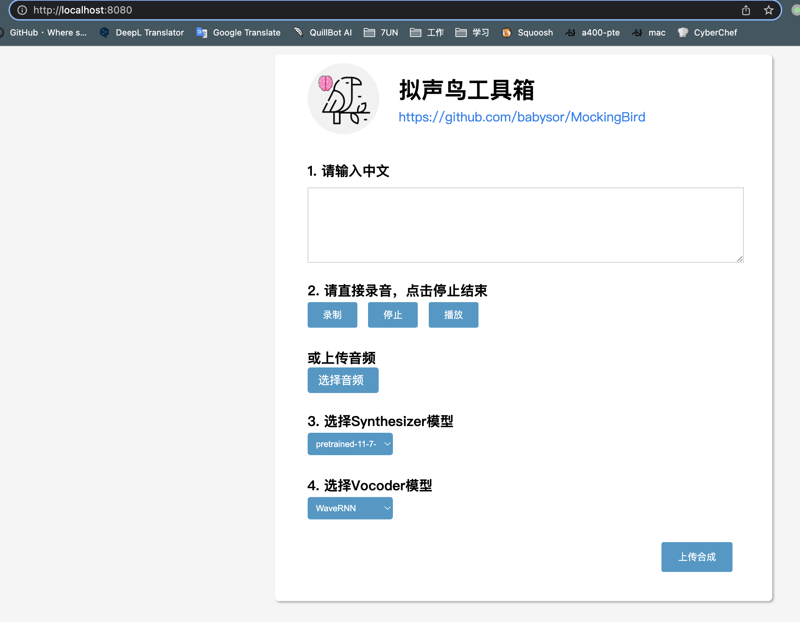
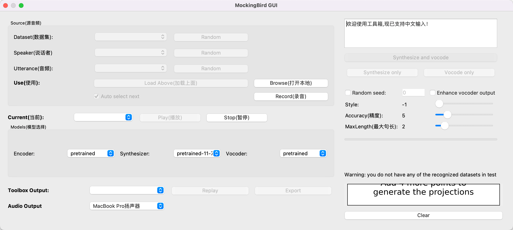

# MockingBird

- https://github.com/babysor/MockingBird

---

**安装 ffmpeg**
```bash
brew install ffmpeg
```

**配置镜像源**
```bash
conda config --add channels https://mirrors.tuna.tsinghua.edu.cn/anaconda/pkgs/free/
conda config --add channels https://mirrors.tuna.tsinghua.edu.cn/anaconda/pkgs/main/
conda config --add channels https://mirrors.tuna.tsinghua.edu.cn/anaconda/cloud/pytorch/
conda config --add channels https://mirrors.tuna.tsinghua.edu.cn/anaconda/cloud/conda-forge/
conda config --set show_channel_urls yes
conda update --all
```

**安装 pyqt5**
```bash
conda install qt pyqt

brew install pyqt5
brew link --overwrite pyqt@5
```

**安装一些 pip 直接装会报错的模块**
```bash
conda install -c conda-forge pytorch
conda install -c conda-forge python-sounddevice umap-learn inflect unidecode
conda install -c conda-forge llvmlite numpy matplotlib
conda install -c conda-forge librosa
conda install -c conda-forge numpy==1.20
conda install numba==0.53
conda install pypinyin
conda install -c conda-forge python-sounddevice
conda uninstall --force portaudio
conda install -c conda-forge python-sounddevice

cd
cd miniforge3/lib
mv libportaudio.2.dylib libportaudio.2.dylib.bak
brew info portaudio
ln -s /opt/homebrew/Cellar/portaudio/19.7.0/lib/libportaudio.dylib libportaudio.2.dylib
ls -al | grep libport
```

**安装依赖模块**
```bash
cd
git clone https://github.com/babysor/MockingBird.git
cd MockingBird

vim requirements.txt
# 进去把 PyQt5 llvmlite umap-learn inflect unidecode numpy 这几个删掉

pip3 install -r requirements.txt    # 安装剩下的依赖
pip3 install SoundFile
```

**安装 webrtcvad-wheels**
```bash
pip3 install webrtcvad-wheels
```

**安装 libsndfile**
```bash
brew install libsndfile
brew install portaudio
```

**下载预训练模型**

这里使用社区提供的模型
- https://pan.baidu.com/s/1iONvRxmkI-t1nHqxKytY3g 百度盘链接 4j5d

下载完后在项目的 synthesizer 下创建个 saved_models 文件夹，把下载的文件放进去

**启动Web程序**
```bash
python3 web.py
```



- MemoryError: Cannot allocate write+execute memory for ffi.callback().
    ```bash
    pip3 uninstall cffi
    pip3 uninstall pyopenssl
    pip3 install pyopenssl
    ```

**启动工具箱**
```bash
mkdir test
python3 demo_toolbox.py -d test
```



**参考**
- https://github.com/babysor/MockingBird/blob/main/README-CN.md
- https://github.com/babysor/MockingBird/issues/65
- https://github.com/babysor/MockingBird/issues/471
- https://mp.weixin.qq.com/s/Gzxm5wyzPPsebv5BQh5EPw
