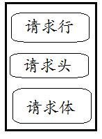
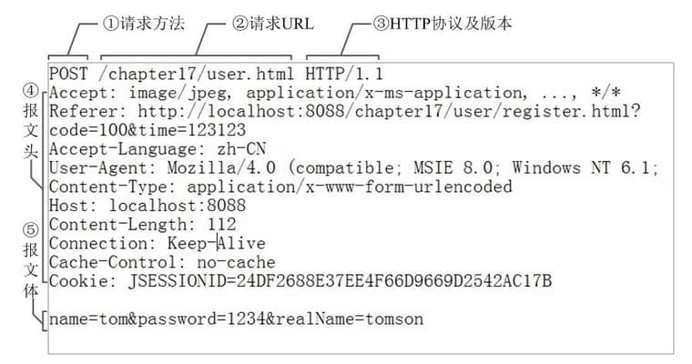
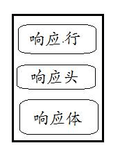
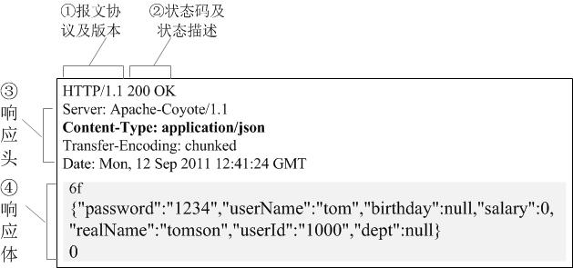

# HTTP 报文

---

# 基础

HTTP 请求报文由3部分组成（请求行+请求头+请求体）：



下面是一个实际的请求报文 ：



- **①** 是请求方法，GET 和 POST 是最常见的 HTTP 方法，除此以外还包括 DELETE、HEAD、OPTIONS、PUT、TRACE。不过，当前的大多数浏览器只支持 GET 和 POST，Spring 3.0 提供了一个 `HiddenHttpMethodFilter` ，允许你通过“_method”的表单参数指定这些特殊的 HTTP 方法（实际上还是通过 POST 提交表单）。服务端配置了 HiddenHttpMethodFilter 后，Spring 会根据 _method 参数指定的值模拟出相应的 HTTP 方法，这样，就可以使用这些 HTTP 方法对处理方法进行映射了。
- **②** 为请求对应的 URL 地址，它和报文头的 Host 属性组成完整的请求 URL，
- **③** 是协议名称及版本号。
- **④** 是 HTTP 的报文头，报文头包含若干个属性，格式为“属性名:属性值”，服务端据此获取客户端的信息。
- **⑤** 是报文体，它将一个页面表单中的组件值通过 `param1=value1&param2=value2` 的键值对形式编码成一个格式化串，它承载多个请求参数的数据。不但报文体可以传递请求参数，请求 URL 也可以通过类似于“/chapter15/user.html? param1=value1&param2=value2”的方式传递请求参数。

对照上面的请求报文，我们把它进一步分解，你可以看到一幅更详细的结构图：


---

HTTP 的响应报文也由三部分组成（响应行+响应头+响应体）：



以下是一个实际的 HTTP 响应报文：



- **①** 报文协议及版本；
- **②** 状态码及状态描述；
- **③** 响应报文头，也是由多个属性组成；
- **④** 响应报文体，即我们真正要的“干货”。

以下是几个常见的状态码 :

- **200 OK** 你最希望看到的，即处理成功！
- **303 See Other**  我把你 redirect 到其它的页面，目标的 URL 通过响应报文头的 Location 告诉你。
- **304 Not Modified**  告诉客户端，你请求的这个资源至你上次取得后，并没有更改，你直接用你本地的缓存吧，我很忙哦，你能不能少来烦我啊！
- **404 Not Found**  你最不希望看到的，即找不到页面。如你在 google 上找到一个页面，点击这个链接返回 404，表示这个页面已经被网站删除了，google 那边的记录只是美好的回忆。
- **500 Internal Server Error**  看到这个错误，你就应该查查服务端的日志了，肯定抛出了一堆异常，别睡了，起来改 BUG 去吧！

更多关于状态码参考 [Speed-Web](../Speed-Web.md#响应状态码) 响应状态码部分

---

# 请求方法

---

根据 HTTP 标准，HTTP 请求可以使用多种请求方法。

HTTP1.0 定义了三种请求方法： GET, POST 和 HEAD 方法。

HTTP1.1 新增了六种请求方法：OPTIONS、PUT、PATCH、DELETE、TRACE 和 CONNECT 方法。

- `GET` : 请求指定的页面信息，并返回实体主体。
- `HEAD` : 类似于 GET 请求，只不过返回的响应中没有具体的内容，用于获取报头
- `POST` : 向指定资源提交数据进行处理请求（例如提交表单或者上传文件）。数据被包含在请求体中。POST 请求可能会导致新的资源的建立和/或已有资源的修改。
- `PUT` : 从客户端向服务器传送的数据取代指定的文档的内容。
- `DELETE` : 请求服务器删除指定的页面。
- `CONNECT` : HTTP/1.1 协议中预留给能够将连接改为管道方式的代理服务器。
- `OPTIONS` : 允许客户端查看服务器的性能。
- `TRACE` : 回显服务器收到的请求，主要用于测试或诊断。
- `PATCH` : 是对 PUT 方法的补充，用来对已知资源进行局部更新 。

---

## POST 请求数据提交格式

服务端通常是根据请求头（headers）中的 Content-Type 字段来获知请求中的消息主体是用何种方式编码，再对主体进行解析。所以说到 POST 提交数据方案，包含了 Content-Type 和消息主体编码方式两部分。

```
快到中午了，张三丰不想去食堂吃饭，于是打电话叫外卖：老板，我要一份[鱼香肉丝]，要 12：30 之前给我送过来哦，我在江湖湖公司研发部，叫张三丰。
```

这里，你要[鱼香肉丝]相当于 HTTP 报文体，而“12：30之前送过来”，你叫“张三丰”等信息就相当于 HTTP 的请求头。它们是一些附属信息，帮忙你和饭店老板顺利完成这次交易。

**application/x-www-form-urlencoded**

最基本的 form 表单结构,用于传递字符参数的键值对,请求结构如下
```
POST  HTTP/1.1
Host: www.demo.com
Cache-Control: no-cache
Postman-Token: 81d7b315-d4be-8ee8-1237-04f3976de032
Content-Type: application/x-www-form-urlencoded

key=value&testKey=testValue
```

请求头中的 Content-Type 设置为 application/x-www-form-urlencoded; 提交的的数据,请求 body 中按照 key1=value1&key2=value2 进行编码,key 和 value 都要进行 urlEncode;

**multipart/form-data**

这是上传文件时,最常见的数据提交方式,看一下请求结构
```
POST  HTTP/1.1
Host: www.demo.com
Cache-Control: no-cache
Postman-Token: 679d816d-8757-14fd-57f2-fbc2518dddd9
Content-Type: multipart/form-data; boundary=----WebKitFormBoundary7MA4YWxkTrZu0gW

------WebKitFormBoundary7MA4YWxkTrZu0gW
Content-Disposition: form-data; name="key"

value
------WebKitFormBoundary7MA4YWxkTrZu0gW
Content-Disposition: form-data; name="testKey"

testValue
------WebKitFormBoundary7MA4YWxkTrZu0gW
Content-Disposition: form-data; name="imgFile"; filename="no-file"
Content-Type: application/octet-stream


<data in here>
------WebKitFormBoundary7MA4YWxkTrZu0gW--
```

首先请求头中的 Content-Type 是 multipart/form-data; 并且会随机生成 一个 boundary, 用于区分请求 body 中的各个数据; 每个数据以 --boundary 开始, 紧接着换行,下面是内容描述信息, 接着换2行, 接着是数据; 然后以 --boundary-- 结尾, 最后换行;

文本数据和文件,图片的内容描述是不相同的
文本参数:
```
Content-Disposition: form-data; name="key"
Content-Type: text/plain; charset=UTF-8
Content-Transfer-Encoding: 8bit
```

文件参数:
```
Content-Disposition: form-data; name="imgFile"; filename="no-file"
Content-Type: application/octet-stream
Content-Transfer-Encoding: binary
```

---

# HTTP headers

**Reference**
- [HTTP头部详解](https://blog.csdn.net/YLBF_DEV/article/details/50266447)
- [HTTP 响应头信息](https://www.runoob.com/http/http-header-fields.html)
- [HTTP 请求头中的 X-Forwarded-For](https://imququ.com/post/x-forwarded-for-header-in-http.html)
- [List of HTTP header fields](https://en.wikipedia.org/wiki/List_of_HTTP_header_fields)

---

通常 HTTP 消息包括客户机向服务器的请求消息和服务器向客户机的响应消息。这两种类型的消息由一个起始行，一个或者多个头域，一个只是头域结束的空行和可选的消息体组成。HTTP 的头域包括通用头，请求头，响应头和实体头四个部分。每个头域由一个域名，冒号（:）和域值三部分组成。域名是大小写无关的，域值前可以添加任何数量的空格符，头域可以被扩展为多行，在每行开始处，使用至少一个空格或制表符。

## 通用头域

通用头域包含请求和响应消息都支持的头域，通用头域包含 `Cache-Control`、 `Connection`、`Date`、`Pragma`、`Transfer-Encoding`、`Upgrade`、`Via`。对通用头域的扩展要求通讯双方都支持此扩展，如果存在不支持的通用头域，一般将会作为实体头域处理。下面简单介绍几个在 UPnP 消息中使用的通用头域。

**Cache-Control 头域**

Cache -Control 指定请求和响应遵循的缓存机制。在请求消息或响应消息中设置 Cache-Control 并不会修改另一个消息处理过程中的缓存处理过程。

请求时的缓存指令包括 `no-cache`、`no-store`、`max-age`、 `max-stale`、`min-fresh`、`only-if-cached`

响应消息中的指令包括
- `Public` 指示响应可被任何缓存区缓存；
- `Private` 指示对于单个用户的整个或部分响应消息，不能被共享缓存处理。这允许服务器仅仅描述当用户的部分响应消息，此响应消息对于其他用户的请求无效；
- `no-cache` 指示请求或响应消息不能缓存；
- `no-store` 用于防止重要的信息被无意的发布。在请求消息中发送将使得请求和响应消息都不使用缓存；
- `max-age` 指示客户机可以接收生存期不大于指定时间（以秒为单位）的响应；
- `min-fresh` 指示客户机可以接收响应时间小于当前时间加上指定时间的响应；
- `max-stale` 指示客户机可以接收超出超时期间的响应消息。如果指定 max-stale 消息的值，那么客户机可以接收超出超时期指定值之内的响应消息。

**Date 头域**

date 头域表示消息发送的时间，时间的描述格式由 rfc822 定义。例如，`Date:Mon,31Dec200104:25:57GMT`。Date 描述的时间表示世界标准时，换算成本地时间，需要知道用户所在的时区。

**Pragma 头域**

Pragma 头域用来包含实现特定的指令，最常用的是 `Pragma:no-cache`。在 HTTP/1.1 协议中，它的含义和 `Cache-Control:no-cache` 相同。

**Connection 头域**

Connection 表示连接状态
- 请求
    ```
    close（告诉 WEB 服务器或者代理服务器，在完成本次请求的响应后，断开连接，不要等待本次连接的后续请求了）。
    keepalive（告诉 WEB 服务器或者代理服务器，在完成本次请求的响应后，保持连接，等待本次连接的后续请求）。
    ```

- 响应
    ```
    close（连接已经关闭）。
    Keep-Alive：如果浏览器请求保持连接，则该头部表明希望 WEB 服务器保持连接多长时间（秒）。例如：Keep-Alive：300
    ```

---

## 请求消息(请求头)

请求消息的第一行为下面的格式：Method Request-URI HTTP-Version

- Method 表示对于 Request-URI 完成的方法，这个字段是大小写敏感的，包括 `OPTIONS`、`GET`、`HEAD`、`POST`、`PUT`、`DELETE`、`TRACE`。方法 `GET` 和 `HEAD` 应该被所有的通用 WEB 服务器支持，其他所有方法的实现是可选的，GET 方法取回由 Request-URI 标识的信息，
- HEAD 方法也是取回由 Request-URI 标识的信息，只是可以在响应时，不返回消息体；
- POST 方法可以请求服务器接收包含在请求中的实体信息，可以用于提交表单，向新闻组、BBS、邮件群组和数据库发送消息。
- Request-URI 表示请求的URL。Request-URI 遵循 URI 格式，在此字段为星号（*）时，说明请求并不用于某个特定的资源地址，而是用于服务器本身。
- HTTP- Version 表示支持的 HTTP 版本，例如为 `HTTP/1.1`。

请求头域允许客户端向服务器传递关于请求或者关于客户机的附加信息。请求头域可能包含下列字段 `Accept`、`Accept-Charset`、`Accept-Encoding`、`Accept-Language`、`Authorization`、`From`、`Host`、`If-Modified-Since`、`If-Match`、`If-None-Match`、`If-Range`、`If-Unmodified-Since`、`Max-Forwards`、 `Proxy-Authorization`、`Range`、`Referer`、`User-Agent`。对请求头域的扩展要求通讯双方都支持，如果存在不支持的请求头域,一般将会作为实体头域处理。

典型的请求消息
```
GET http://download.microtool.de:80/somedata.exe
Host: download.microtool.de
Accept:*/*
Pragma: no-cache
Cache-Control: no-cache
Referer: http://download.microtool.de/
User-Agent:Mozilla/4.04[en](Win95;I;Nav)
Range:bytes=554554-
```

上例第一行表示 HTTP 客户端（可能是浏览器、下载程序）通过 GET 方法获得指定 URL 下的文件。
- Host头域指定请求资源的 Intenet 主机和端口号，必须表示请求 url 的原始服务器或网关的位置。HTTP/1.1 请求必须包含主机头域，否则系统会以 400 状态码返回；
- Accept：告诉 WEB 服务器自己接受什么介质类型，`*/*` 表示任何类型，`type/*` 表示该类型下的所有子类型，type/sub-type。
- Accept-Charset： 浏览器申明自己接收的字符集。
- Authorization：当客户端接收到来自WEB服务器的 WWW-Authenticate 响应时，用该头部来回应自己的身份验证信息给 WEB 服务器。
- Range
    ```
    表示头500个字节：bytes=0-499
    表示第二个500字节：bytes=500-999
    表示最后500个字节：bytes=-500
    表示500字节以后的范围：bytes=500-
    第一个和最后一个字节：bytes=0-0,-1
    同时指定几个范围：bytes=500-600,601-999
    ```
    但是服务器可以忽略此请求头，如果无条件 GET 包含 Range 请求头，响应会以状态码 206（PartialContent）返回而不是以 200 （OK）

---

## 响应消息(响应头)

响应信息如内容类型，类型的长度，服务器信息，设置 Cookie

响应消息的第一行为下面的格式：HTTP-Version Status-Code Reason-Phrase

- HTTP -Version 表示支持的 HTTP 版本，例如为 HTTP/1.1。
- Status-Code 是一个三个数字的结果代码。
    ```
    Status-Code 主要用于机器自动识别，Reason-Phrase 主要用于帮助用户理解。Status-Code 的第一个数字定义响应的类别，后两个数字没有分类的作用。第一个数字可能取5个不同的值
    ```
    - 1xx : 信息响应类，表示接收到请求并且继续处理
    - 2xx : 处理成功响应类，表示动作被成功接收、理解和接受
    - 3xx : 重定向响应类，为了完成指定的动作，必须接受进一步处理
    - 4xx : 客户端错误，客户请求包含语法错误或者是不能正确执行
    - 5xx : 服务端错误，服务器不能正确执行一个正确的请求
- Reason-Phrase 给 Status-Code 提供一个简单的文本描述。

响应头域允许服务器传递不能放在状态行的附加信息，这些域主要描述服务器的信息和 Request-URI 进一步的信息。响应头域包含 `Age`、`Location`、`Proxy-Authenticate`、`Public`、`Retry-After`、`Server`、`Vary`、`Warning`、`WWW-Authenticate`。对响应头域的扩展要求通讯双方都支持，如果存在不支持的响应头 域，一般将会作为实体头域处理。

典型的响应消息：
```
HTTP/1.0 200 OK
Date:Mon,31Dec200104:25:57MGT
Server:Apache/1.3.14(Unix)
Content-type:text/html
Last-modified:Tue,17Apr200106:46:28GMT
Etag:"a030f020ac7c01:1e9f"
Content-length:39725426
Content-range:bytes554554-40279979/40279980
```

Location 响应头用于重定向接收者到一个新 URI 地址。Server 响应头包含处理请求的原始服务器的软件信息。此域能包含多个产品标识和注释，产品标识一般按照重要性排序

---

## 实体消息(实体头和实体)

请求消息和响应消息都可以包含实体信息，实体信息一般由实体头域和实体组成。

实体头域包含关于实体的原信息，实体头包括 `Allow`、`Content-Base`、`Content-Encoding`、`Content-Language`、`Content-Length`、`Content-Location`、`Content-MD5`、`Content-Range`、`Content-Type`、`Etag`、`Expires`、`Last-Modified`、`extension-header`。`extension-header` 允许客户端定义新的实体头，但是这些域可能无法为接受方识别。

- Content-Type 实体头用于向接收方指示实体的介质类型，指定 HEAD 方法送到接收方的实体介质类型，或 GET 方法发送的请求介质类型，表示后面的文档属于什么 MIME 类型。
- Content-Length 表示实际传送的字节数。
- Allow 实体头至服务器支持哪些请求方法（如 GET、POST 等）。
- Content-Range 表示传送的范围，用于指定整个实体中的一部分的插入位置，他也指示了整个实体的长度。在服务器向客户返回一个部分响应，它必须描述响应覆盖的范围和整个实体长度。
    ```
    一般格式：Content-Range:bytes-unitSPfirst-byte-pos-last-byte-pos/entity-legth

    例如，传送头500个字节次字段的形式：Content-Range:bytes0-499/1234 如果一个 http 消息包含此节（例如，对范围请求的响应或对一系列范围的重叠请求）。
    ```
- Content-Encoding 指文档的编码（Encode）方法。实体可以是一个经过编码的字节流，它的编码方式由 Content-Encoding 或 Content-Type 定义，它的长度由 Content-Length 或 Content-Range 定义。

---

**X-Forwarded-For**

通过名字就知道，X-Forwarded-For 是一个 HTTP 扩展头部。HTTP/1.1（RFC 2616）协议并没有对它的定义，它最开始是由 Squid 这个缓存代理软件引入，用来表示 HTTP 请求端真实 IP。如今它已经成为事实上的标准，被各大 HTTP 代理、负载均衡等转发服务广泛使用，并被写入 RFC 7239（Forwarded HTTP Extension）标准之中。

X-Forwarded-For 请求头格式非常简单，就这样：
```
X-Forwarded-For: client, proxy1, proxy2
```

可以看到，XFF 的内容由「英文逗号 + 空格」隔开的多个部分组成，最开始的是离服务端最远的设备 IP，然后是每一级代理设备的 IP。

如果一个 HTTP 请求到达服务器之前，经过了三个代理 Proxy1、Proxy2、Proxy3，IP 分别为 IP1、IP2、IP3，用户真实 IP 为 IP0，那么按照 XFF 标准，服务端最终会收到以下信息：
```
X-Forwarded-For: IP0, IP1, IP2
```

Proxy3 直连服务器，它会给 XFF 追加 IP2，表示它是在帮 Proxy2 转发请求。列表中并没有 IP3，IP3 可以在服务端通过 Remote Address 字段获得。我们知道 HTTP 连接基于 TCP 连接，HTTP 协议中没有 IP 的概念，Remote Address 来自 TCP 连接，表示与服务端建立 TCP 连接的设备 IP，在这个例子里就是 IP3。

Remote Address 无法伪造，因为建立 TCP 连接需要三次握手，如果伪造了源 IP，无法建立 TCP 连接，更不会有后面的 HTTP 请求。不同语言获取 Remote Address 的方式不一样，例如 php 是 $_SERVER["REMOTE_ADDR"]，Node.js 是 req.connection.remoteAddress，但原理都一样。

---

## 实例

**HTTP 请求消息头部实例**
```
Host：rss.sina.com.cn
User-Agent：Mozilla/5、0 (Windows; U; Windows NT 5、1; zh-CN; rv:1、8、1、14) Gecko/20080404 Firefox/2、0、0、14
Accept：text/xml,application/xml,application/xhtml+xml,text/html;q=0、9,text/plain;q=0、8,image/png,*/*;q=0、5
Accept-Language：zh-cn,zh;q=0、5
Accept-Encoding：gzip,deflate
Accept-Charset：gb2312,utf-8;q=0、7,*;q=0、7
Keep-Alive：300
Connection：keep-alive
Cookie：userId=C5bYpXrimdmsiQmsBPnE1Vn8ZQmdWSm3WRlEB3vRwTnRtW           <– Cookie
If-Modified-Since：Sun, 01 Jun 2008 12:05:30 GMT
Cache-Control：max-age=0
```

**HTTP 响应消息头部实例**
```
Status：OK - 200                                        <– 响应状态码，表示 web 服务器处理的结果。
Date：Sun, 01 Jun 2008 12:35:47 GMT
Server：Apache/2、0、61 (Unix)
Last-Modified：Sun, 01 Jun 2008 12:35:30 GMT
Accept-Ranges：bytes
Content-Length：18616
Cache-Control：max-age=120
Expires：Sun, 01 Jun 2008 12:37:47 GMT
Content-Type：application/xml
Age：2
X-Cache：HIT from 236-41、D07071951、sina、com、cn      <– 反向代理服务器使用的 HTTP 头部
Via：1.0 236-41.D07071951.sina.com.cn:80 (squid/2.6.STABLE13)
Connection：close
```

---

## 头部详解

- Accept ：告诉 WEB 服务器自己接受什么介质类型，`*/*` 表示任何类型，`type/*` 表示该类型下的所有子类型，`type/sub-type`。

- Accept-Charset ： 浏览器申明自己接收的字符集

- Accept-Encoding ： 浏览器申明自己接收的编码方法，通常指定压缩方法，是否支持压缩，支持什么压缩方法（gzip，deflate）

- Accept-Language ：浏览器申明自己接收的语言,语言跟字符集的区别：中文是语言，中文有多种字符集，比如 big5，gb2312，gbk 等等。

- Age ：当代理服务器用自己缓存的实体去响应请求时，用该头部表明该实体从产生到现在经过多长时间了。

- Authorization ：当客户端接收到来自 WEB 服务器的 WWW-Authenticate 响应时，用该头部来回应自己的身份验证信息给 WEB 服务器。

- Cache-Control ：请求：no-cache（不要缓存的实体，要求现在从WEB服务器去取） max-age：（只接受 Age 值小于 max-age 值，并且没有过期的对象） max-stale：（可以接受过去的对象，但是过期时间必须小于 max-stale 值）

- min-fresh ：（接受其新鲜生命期大于其当前 Age 跟 min-fresh 值之和的缓存对象） 响应：public(可以用 Cached 内容回应任何用户) private（只能用缓存内容回应先前请求该内容的那个用户） no-cache（可以缓存，但是只有在跟 WEB 服务器验证了其有效后，才能返回给客户端） max-age：（本响应包含的对象的过期时间）
ALL: no-store（不允许缓存）

- Connection ：请求：close（告诉 WEB 服务器或者代理服务器，在完成本次请求的响应后，断开连接，不要等待本次连接的后续请求了）。keepalive（告诉 WEB 服务器或者代理服务器，在完成本次请求的响应后，保持连接，等待本次连接的后续请求）。

- Content-Encoding ：WEB 服务器表明自己使用了什么压缩方法（gzip，deflate）压缩响应中的对象。例如：`Content-Encoding：gzip`

- Content-Language ：WEB 服务器告诉浏览器自己响应的对象的语言。

- Content-Length ： WEB 服务器告诉浏览器自己响应的对象的长度。例如：`Content-Length: 26012`

- Content-Range ： WEB 服务器表明该响应包含的部分对象为整个对象的哪个部分。例如：`Content-Range: bytes 21010-47021/47022`

- Content-Type ： WEB 服务器告诉浏览器自己响应的对象的类型。例如：`Content-Type：application/xml`

- ETag ：就是一个对象（比如 URL）的标志值，就一个对象而言，比如一个 html 文件，如果被修改了，其 Etag 也会别修改，所以 ETag 的作用跟 Last-Modified 的作用差不多，主要供 WEB 服务器判断一个对象是否改变了。比如前一次请求某个 html 文件时，获得了其 ETag，当这次又请求这个文件时，浏览器就会把先前获得的 ETag 值发送给WEB 服务器，然后 WEB 服务器会把这个 ETag 跟该文件的当前 ETag 进行对比，然后就知道这个文件有没有改变了。

- Expired ：WEB 服务器表明该实体将在什么时候过期，对于过期了的对象，只有在跟 WEB 服务器验证了其有效性后，才能用来响应客户请求。是 HTTP/1.0 的头部。例如：`Expires：Sat, 23 May 2009 10:02:12 GMT`

- Host ：客户端指定自己想访问的WEB服务器的域名/IP 地址和端口号。例如：`Host：rss.sina.com.cn`

- If-Match ：如果对象的 ETag 没有改变，其实也就意味著对象没有改变，才执行请求的动作。

- If-None-Match ：如果对象的 ETag 改变了，其实也就意味著对象也改变了，才执行请求的动作。

- If-Modified-Since ：如果请求的对象在该头部指定的时间之后修改了，才执行请求的动作（比如返回对象），否则返回代码304，告诉浏览器该对象没有修改。例如：`If-Modified-Since：Thu,10 Apr 2008 09:14:42 GMT`

- If-Unmodified-Since ：如果请求的对象在该头部指定的时间之后没修改过，才执行请求的动作（比如返回对象）

- If-Range ：浏览器告诉 WEB服务器，如果我请求的对象没有改变，就把我缺少的部分给我，如果对象改变了，就把整个对象给我。浏览器通过发送请求对象的 ETag 或者自己所知道的最后修改时间给 WEB 服务器，让其判断对象是否改变了。总是跟 Range 头部一起使用。

- Last-Modified ：WEB服务器认为对象的最后修改时间，比如文件的最后修改时间，动态页面的最后产生时间等等。例如：`Last-Modified：Tue, 06 May 2008 02:42:43 GMT`

- Location ：WEB服务器告诉浏览器，试图访问的对象已经被移到别的位置了，到该头部指定的位置去取。例如：`Location http://i0.sinaimg.cn/dy/deco/2008/0528/sina0.gif` Location 通常不是直接设置的，而是通过 HttpServletResponse 的 sendRedirect 方法，该方法同时设置状态代码为 302。

- Pramga ：主要使用 Pramga: no-cache，相当于 Cache-Control： no-cache。例如：`Pragma：no-cache`

- Proxy-Authenticate ：代理服务器响应浏览器，要求其提供代理身份验证信息。Proxy-Authorization：浏览器响应代理服务器的身份验证请求，提供自己的身份信息。

- Range ：浏览器（比如 Flashget 多线程下载时）告诉 WEB 服务器自己想取对象的哪部分。例如：`Range:bytes=1173546-`

- Referer ：浏览器向 WEB 服务器表明自己是从哪个网页/URL 获得/点击当前请求中的网址/URL。例如：`Referer：http://www.sina.com/`

- Server : WEB 服务器表明自己是什么软件及版本等信息。例如：`Server：Apache/2.0.61 (Unix)`

- User-Agent : 浏览器表明自己的身份（是哪种浏览器）。 例如：`User-Agent：Mozilla/5.0 (Windows; U; Windows NT 5.1; zh-CN; rv:1.8.1.14) Gecko/20080404 Firefox/2、0、0、14`

- Transfer-Encoding : WEB 服务器表明自己对本响应消息体（不是消息体里面的对象）作了怎样的编码，比如是否分块（chunked）。例如：`Transfer-Encoding:chunked`

- Vary : WEB 服务器用该头部的内容告诉 Cache 服务器，在什么条件下才能用本响应所返回的对象响应后续的请求。假如源WEB服务器在接到第一个请求消息时，其响应消息的头部为： `Content-Encoding: gzip; Vary: Content-Encoding` 那么 Cache 服务器会分析后续请求消息的头部，检查其 Accept-Encoding，是否跟先前响应的 Vary 头部值一致，即是否使用相同的内容编码方法，这样就可以防止 Cache 服务器用自己 Cache 里面压缩后的实体响应给不具备解压能力的浏览器。例如：`Vary：Accept-Encoding`

- Via ：列出从客户端到 OCS 或者相反方向的响应经过了哪些代理服务器，他们用什么协议（和版本）发送的请求。当客户端请求到达第一个代理服务器时，该服务器会在自己发出的请求里面添加 Via 头部，并填上自己的相关信息，当下一个代理服务器收到第一个代理服务器的请求时，会在自己发出的请求里面复制前一个代理服务器的请求的 Via 头部，并把自己的相关信息加到后面，以此类推，当 OCS 收到最后一个代理服务器的请求时，检查 Via 头部，就知道该请求所经过的路由。例如：`Via：1.0 236.D0707195.sina.com.cn:80 (squid/2.6.STABLE13)`

- Refresh : 表示浏览器应该在多少时间之后刷新文档，以秒计。除了刷新当前文档之外，你还可以通过 `setHeader("Refresh", "5; URL=http://host/path")` 让浏览器读取指定的页面。注意这种功能通常是通过设置 HTML 页面 HEAD 区的 `＜META HTTP-EQUIV="Refresh" CONTENT="5;URL=http://host/path"＞` 实现，这是因为，自动刷新或重定向对于那些不能使用 CGI或  Servlet 的 HTML 编写者十分重要。但是，对于 Servlet 来说，直接设置 Refresh 头更加方便。注意 Refresh 的意义是"N 秒之后刷新本页面或访问指定页面"，而不是"每隔N秒刷新本页面或访问指定页面"。因此，连续刷新要求每次都发送一个 Refresh 头，而发送 204 状态代码则可以阻止浏览器继续刷新，不管是使用 Refresh 头还是 `＜META HTTP-EQUIV="Refresh" ...＞`。注意 Refresh 头不属于 HTTP 1.1 正式规范的一部分，而是一个扩展，但 Netscape 和 IE 都支持它。

- Set-Cookie : 设置和页面关联的 Cookie。Servlet 不应使用 `response.setHeader("Set-Cookie", ...)` ，而是应使用 HttpServletResponse 提供的专用方法 addCookie。

- Server : 服务器名字。Servlet 一般不设置这个值，而是由 Web 服务器自己设置。

- WWW-Authenticate : 客户应该在 Authorization 头中提供什么类型的授权信息？在包含 401（Unauthorized）状态行的应答中这个头是必需的。例如，`response.setHeader("WWW-Authenticate", "BASIC realm=＼"executives＼"")` 。注意 Servlet 一般不进行这方面的处理，而是让 Web 服务器的专门机制来控制受密码保护页面的访问（例如 `.htaccess`）。

---

**Reference**
- [HTTP请求行、请求头、请求体详解](https://blog.csdn.net/u010256388/article/details/68491509)
