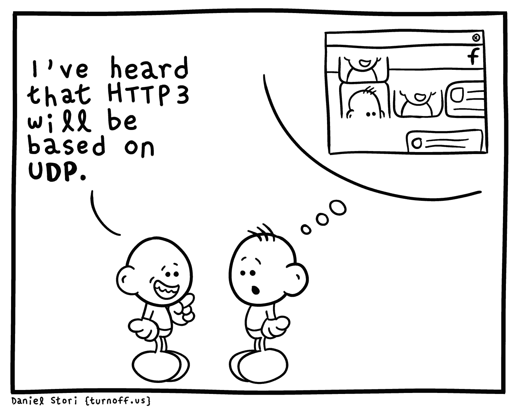

# Speed-Web

    

---

**什么是 Request,Response**

浏览器发送消息给网址所在的服务器，这个过程就叫做 HTTP Request

服务器收到浏览器发送的消息后，能够根据浏览器发送消息的内容，做相应的处理，然后把消息回传给浏览器，这个过程就是 HTTP Response

浏览器收到服务器的 Response 信息后，会对信息进行相应的处理，然后展示

**Request 中包含什么？**

- [请求方式](./HTTP/HTTP报文.md#请求方法)
- 请求 URL

    URL，即统一资源定位符，也就是我们说的网址，统一资源定位符是对可以从互联网上得到的资源的位置和访问方法的一种简洁的表示，是互联网上标准资源的地址。互联网上的每个文件都有一个唯一的 URL，它包含的信息指出文件的位置以及浏览器应该怎么处理它。

    URL的格式由三个部分组成：
    - 第一部分是协议(或称为服务方式)。
    - 第二部分是存有该资源的主机 IP 地址(有时也包括端口号)。
    - 第三部分是主机资源的具体地址，如目录和文件名等。

- [请求头](./HTTP/HTTP报文.md#请求消息(请求头))
- 请求体

    请求是携带的数据，如提交表单数据时候的表单数据（POST）

**Response 中包含了什么**

所有 HTTP 响应的第一行都是状态行，依次是当前 HTTP 版本号，3位数字组成的状态代码，以及描述状态的短语，彼此由空格分隔。

- [响应状态码](#响应状态码)
- [响应头](./HTTP/HTTP报文.md#响应消息(响应头))
- 响应体

    最主要的部分，包含请求资源的内容，如网页 HTMl,图片，二进制数据等

---

## HTTP

**URL**

web 开发中通过英文问号（?）方式在浏览器地址栏中传值时。浏览器是通过 `&` 来区分问号后的参数个数的。 如果出现传值参数中带有 `&` 时，在接受页面就会出现错误，类似如下请求路径：`/next.jsp?param1=hendhs89&furej & param2=sss`

参数 `param1` 中含有转义字符 `&` ，这样会导致被请求页的参数接收错误。

在传值前通过编码处理，可将转义字符转为 16 进制;

| 特殊字符   | URL 中用途                     | 转义方式 |
| - | - | - |
| +         | 表示空格                      | %2B |
| (空格)     | 应换用加号 `+` 或 `%20` 表示  | %20 |
| /         | 分隔目录和子目录               | %2F |
| ?         | 分隔实际的 URL 和参数          | %3F |
| %         | 指定特殊字符                   | %25 |
| #         | 表示书签                      | %23 |
| &         | URL 中指定的参数间的分隔         | %26 |
| =         | URL 中指定参数的值              | %3D |
| !         | URL 中指定参数的值              | %21 |

---

### HTTP报文

- [HTTP 报文](./HTTP/HTTP报文.md)

---

### 响应状态码

- [HTTP 状态码](./HTTP/HTTP状态码.md)

---

### MIME types

在浏览器中显示的内容有 HTML、有 XML、有 GIF、还有 Flash ……那么，浏览器是如何区分它们，决定什么内容用什么形式来显示呢？答案是 MIME Type，也就是该资源的媒体类型。

媒体类型通常是通过 HTTP 协议，由 Web 服务器告知浏览器的，更准确地说，是通过 Content-Type 来表示的，例如: `Content-Type: text/HTML` ，表示内容是 `text/HTML` 类型，也就是超文本文件。MIME type 是一个标准，编写格式和内容都是已经固定好的。

通常只有一些在互联网上获得广泛应用的格式才会获得一个 MIME Type，如果是某个客户端自己定义的格式，一般只能以 `application/x-` 开头。当然，处理本地的文件，在没有人告诉浏览器某个文件的 MIME Type 的情况下，浏览器也会做一些默认的处理。

每个 MIME 类型由两部分组成：前面是数据的大类别（主类型），例如声音 audio、图象 image 等，后面定义具体的种类（子类型）。很多时候，如果在后台服务器没有定义子类型的时候，文本文件默认为 `text/plain` ，而二进制文件则默认为 `application/octet-stream`。

**常见类型**
- text
    - text/html
    - text/css
    - text/javascript
    - text/plain
    - text/markdown

- image
    - image/jpeg
    - image/png
    - image/svg

- video
    - video/mp4

- audio
    - audio/ogg

- application
    - application/json
    - application/xml
    - application/pdf
    - application/octet-stream

- multipart

    `注：multipart 表示具有多个 MIME types 的一组 document. 比如 multipart/form-data 就是通常由 HTTP FORM 的 post 方法发送出的文件表格格式。`
    - multipart/form-data

---

## HTML

- [Speed-HTML](./HTML/Speed-HTML.md)

---

## CSP

**文章**
- [开启CSP网页安全政策防止XSS攻击](https://www.cnblogs.com/leaf930814/p/7368429.html)
- [Content Security Policy 入门教程](https://www.ruanyifeng.com/blog/2016/09/csp.html)
- [内容安全策略 (CSP) - Web 安全](https://developer.mozilla.org/zh-CN/docs/Web/Security/CSP)
- [CSP 策略指令 - Web 安全](https://developer.mozilla.org/zh-CN/docs/Web/Security/CSP/CSP_policy_directives)
