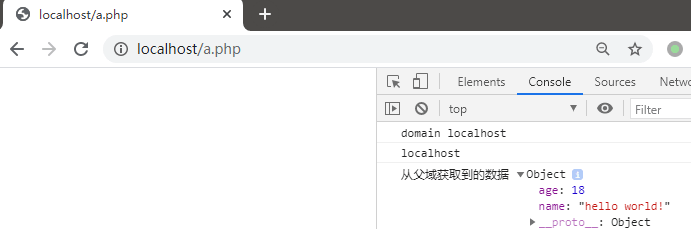
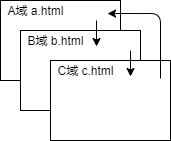

# 同源策略(SOP)

> Same origin policy

---

## 什么是SOP

同源策略（Same origin policy）是一种约定，它是浏览器最核心也最基本的安全功能，如果缺少了同源策略，则浏览器的正常功能可能都会受到影响。可以说 Web 是构建在同源策略基础之上的，浏览器只是针对同源策略的一种实现。

它的核心就在于它认为自任何站点装载的信赖内容是不安全的。当被浏览器半信半疑的脚本运行在沙箱时，它们应该只被允许访问来自同一站点的资源，而不是那些来自其它站点可能怀有恶意的资源。

浏览器的同源策略，限制了来自不同源的“document”或脚本，对当前“document”读取或设置某些属性。

| URL                    | 同源检测结果 |
| - | - |
| 域名(IP)、协议、端口相同      | 成功 |
| 协议不同                | 失败 |
| 端口不同                | 失败 |
| 域名(IP)不同            | 失败 |

另外，同源策略又分为以下两种：
- DOM 同源策略：禁止对不同源页面 DOM 进行操作。这里主要场景是 iframe 跨域的情况，不同域名的 iframe 是限制互相访问的。
- XMLHttpRequest 同源策略：禁止使用 XHR 对象向不同源的服务器地址发起 HTTP 请求。

**为什么要有跨域限制**

因为存在浏览器同源策略，所以才会有跨域问题。跨域限制主要的目的就是为了用户的上网安全。

如果浏览器没有同源策略，会存在什么样的安全问题呢。下面从 DOM 同源策略和 XMLHttpRequest 同源策略来举例说明：

如果没有 DOM 同源策略，也就是说不同域的 iframe 之间可以相互访问，那么黑客可以这样进行攻击：
- 做一个假网站，里面用 iframe 嵌套一个银行网站 http://mybank.com。
- 把 iframe 宽高啥的调整到页面全部，这样用户进来除了域名，别的部分和银行的网站没有任何差别。
- 这时如果用户输入账号密码，我们的主网站可以跨域访问到 http://mybank.com 的 dom 节点，就可以拿到用户的账户密码了。

如果没有 XMLHttpRequest 同源策略，那么黑客可以进行 CSRF（跨站请求伪造） 攻击：
- 用户登录了自己的银行页面 http://mybank.com，http://mybank.com 向用户的 cookie 中添加用户标识。
- 用户浏览了恶意页面 http://evil.com，执行了页面中的恶意 AJAX 请求代码。
- http://evil.com 向 http://mybank.com 发起 AJAX HTTP 请求，请求会默认把 http://mybank.com 对应 cookie 也同时发送过去。
- 银行页面从发送的 cookie 中提取用户标识，验证用户无误，response 中返回请求数据。此时数据就泄露了。
- 而且由于 Ajax 在后台执行，用户无法感知这一过程。

---

# 跨域的解决方法

**业务环境中一些跨域场景**
1. 比如后端开发完一部分业务代码后，提供接口给前端用，在前后端分离的模式下，前后端的域名是不一致的，此时就会发生跨域访问的问题。
2. 程序员在本地做开发，本地的文件夹并不是在一个域下面，当一个文件需要发送 ajax 请求，请求另外一个页面的内容的时候，就会跨域。
3. 电商网站想通过用户浏览器加载第三方快递网站的物流信息。
4. 子站域名希望调用主站域名的用户资料接口，并将数据显示出来。

## CORS（跨域资源共享）

CORS（Cross-origin resource sharing，跨域资源共享）是一个 W3C 标准，定义了在必须访问跨域资源时，浏览器与服务器应该如何沟通。CORS 背后的基本思想，就是使用自定义的 HTTP 头部让浏览器与服务器进行沟通，从而决定请求或响应是应该成功，还是应该失败。

CORS 需要浏览器和服务器同时支持。目前，所有浏览器都支持该功能，IE 浏览器不能低于 IE10。

整个 CORS 通信过程，都是浏览器自动完成，不需要用户参与。对于开发者来说，CORS 通信与同源的 AJAX 通信没有差别，代码完全一样。浏览器一旦发现 AJAX 请求跨源，就会自动添加一些附加的头信息，有时还会多出一次附加的请求，但用户不会有感觉。

因此，实现 CORS 通信的关键是服务器。只要服务器实现了 CORS 接口，就可以跨源通信。

浏览器将 CORS 请求分成两类：简单请求（simple request）和非简单请求（not-so-simple request）。

只要同时满足以下两大条件，就属于简单请求。

1. 请求方法是以下三种方法之一：
    - HEAD
    - GET
    - POST

2. HTTP的头信息不超出以下几种字段：
    - Accept
    - Accept-Language
    - Content-Language
    - Last-Event-ID
    - Content-Type：只限于三个值 application/x-www-form-urlencoded、multipart/form-data、text/plain

凡是不同时满足上面两个条件，就属于非简单请求。

浏览器对这两种请求的处理，是不一样的。

**简单请求**

在请求中需要附加一个额外的 Origin 头部，其中包含请求页面的源信息（协议、域名和端口），以便服务器根据这个头部信息来决定是否给予响应。例如：Origin: http://www.xxx.cn

如果服务器认为这个请求可以接受，就在 Access-Control-Allow-Origin 头部中回发相同的源信息（如果是公共资源，可以回发 * ）。例如：Access-Control-Allow-Origin：http://www.xxx.cn

没有这个头部或者有这个头部但源信息不匹配，浏览器就会驳回请求。正常情况下，浏览器会处理请求。注意，请求和响应都不包含 cookie 信息。

如果需要包含 cookie 信息，ajax 请求需要设置 xhr 的属性 withCredentials 为 true，服务器需要设置响应头部 Access-Control-Allow-Credentials: true。

**非简单请求**

浏览器在发送真正的请求之前，会先发送一个 Preflight 请求给服务器，这种请求使用 OPTIONS 方法，发送下列头部：
- Origin：与简单的请求相同。
- Access-Control-Request-Method: 请求自身使用的方法。
- Access-Control-Request-Headers: （可选）自定义的头部信息，多个头部以逗号分隔。

例如：
```
Origin: http://www.xxx.cn
Access-Control-Request-Method: POST
Access-Control-Request-Headers: NCZ
```

发送这个请求后，服务器可以决定是否允许这种类型的请求。服务器通过在响应中发送如下头部与浏览器进行沟通：
- Access-Control-Allow-Origin：与简单的请求相同。
- Access-Control-Allow-Methods: 允许的方法，多个方法以逗号分隔。
- Access-Control-Allow-Headers: 允许的头部，多个方法以逗号分隔。
- Access-Control-Max-Age: 应该将这个 Preflight 请求缓存多长时间（以秒表示）。
- Access-Control-Allow-Credentials: 是否允许请求带有验证信息，这部分将会在下面详细解释
- Access-Control-Expose-Headers: 允许脚本访问的返回头，请求成功后，脚本可以在 XMLHttpRequest 中访问这些头的信息(貌似 webkit 没有实现这个)

例如：
```
Access-Control-Allow-Origin: http://www.xxx.cn
Access-Control-Allow-Methods: GET, POST
Access-Control-Allow-Headers: NCZ
Access-Control-Max-Age: 1728000
```

一旦服务器通过 Preflight 请求允许该请求之后，以后每次浏览器正常的 CORS 请求，就都跟简单请求一样了。

**优点**
- CORS 通信与同源的 AJAX 通信没有差别，代码完全一样，容易维护。
- 支持所有类型的 HTTP 请求。

**缺点**
- 存在兼容性问题，特别是 IE10 以下的浏览器。
- 第一次发送非简单请求时会多一次请求。

---

## JSONP 跨域

由于 script 标签不受浏览器同源策略的影响，允许跨域引用资源。因此可以通过动态创建 script 标签，然后利用 src 属性进行跨域，这也就是 JSONP 跨域的基本原理。

直接通过下面的例子来说明 JSONP 实现跨域的流程：
```js
// 1. 定义一个 回调函数 handleResponse 用来接收返回的数据
function handleResponse(data) {
    console.log(data);
};

// 2. 动态创建一个 script 标签，并且告诉后端回调函数名叫 handleResponse
var body = document.getElementsByTagName('body')[0];
var script = document.gerElement('script');
script.src = 'http://www.xxxx.com/json?callback=handleResponse';
body.appendChild(script);

// 3. 通过 script.src 请求 `http://www.xxxx.com/json?callback=handleResponse`，
// 4. 后端能够识别这样的 URL 格式并处理该请求，然后返回 handleResponse({"name": "xxxx"}) 给浏览器
// 5. 浏览器在接收到 handleResponse({"name": "xxxx"}) 之后立即执行 ，也就是执行 handleResponse 方法，获得后端返回的数据，这样就完成一次跨域请求了。
```

**优点**
- 使用简便，没有兼容性问题，目前最流行的一种跨域方法。

**缺点**
- 只支持 GET 请求。
- 由于是从其它域中加载代码执行，因此如果其他域不安全，很可能会在响应中夹带一些恶意代码。
- 要确定 JSONP 请求是否失败并不容易。虽然 HTML5 给 script 标签新增了一个 onerror 事件处理程序，但是存在兼容性问题。

---

## HTML 标签跨域

`<script>` `` `<iframe>` `<link>` 等带 src 属性的标签都可以跨域加载资源，而不受同源策略的限制。

每次加载时都会由浏览器发送一次 GET 请求，通过 src 属性加载的资源，浏览器会限制 JavaScript 的权限，使其不能读写返回的内容。

常见标签：
```html
<script src="..."></script>

<video src="..."></video>
<audio src="..."></audio>
<embed src="...">
<frame src="...">
<iframe src="..."></iframe>
<link rel="stylesheet" href="...">
<applet code="..."></applet>
<object data="..." ></object>
```

直接通过下面的例子来说明通过标签实现跨域的流程：
```js
var img = new Image();

// 通过 onload 及 onerror 事件可以知道响应是什么时候接收到的，但是不能获取响应文本
img.onload = img.onerror = function() {
    console.log("Done!");
}

// 请求数据通过查询字符串形式发送
img.src = 'http://www.xxxx.cn/test?name=xxx';
```

在 CSS 中，@font-face 可以引入跨域字体。
```css
<style type="text/css">
    @font-face {
        src: url("http://developer.mozilla.org/@api/deki/files/2934/=VeraSeBd.ttf");
    }
</style>
```

**优点**
- 用于实现跟踪用户点击页面或动态广告曝光次数有较大的优势。

**缺点**
- 只支持 GET 请求。
- 只能浏览器与服务器的单向通信，因为浏览器不能访问服务器的响应文本。

---

## 服务器代理

浏览器有跨域限制，但是服务器不存在跨域问题，所以可以由服务器请求所有域的资源再返回给客户端。

---

## document.domain 跨域

对于主域名相同，而子域名不同的情况，可以使用 document.domain 来跨域。这种方式非常适用于 iframe 跨域的情况。
比如，有一个页面，它的地址是 http://www.xxx.cn/a.html，在这个页面里面有一个 iframe，它的 src 是 http://xxx.cn/b.html。很显然，这个页面与它里面的 iframe 框架是不同域的，所以我们是无法通过在页面中书写 js 代码来获取 iframe 中的东西的。

这个时候，document.domain 就可以派上用场了，我们只要把 http://www.xxx.cn/a.html 和 http://xxx.cn/b.html 这两个页面的 document.domain 都设成相同的域名就可以了。但要注意的是，document.domain 的设置是有限制的，我们只能把 document.domain 设置成自身或更高一级的父域，且主域必须相同。例如：a.b.xxx.cn 中某个文档的 document.domain 可以设成 a.b.xxx.cn、b.xxx.cn 、xxx.cn 中的任意一个，但是不可以设成 c.a.b.xxx.cn ，因为这是当前域的子域，也不可以设成 baidu.com，因为主域已经不相同了。

例如，在页面 http:/localhost/a.php 中设置 document.domain：

```html
<iframe src="http://localhost:81/b.php" id="iframepage" width="100%" height="100%" frameborder="0" scrolling="yes" onLoad="getData"></iframe>

<script>
    window.parentDate = {
        "name": "hello world!",
        "age": 18
    }
    /**
     * 使用document.domain解决iframe父子模块跨域的问题
     */
    let parentDomain = window.location.hostname;
    console.log("domain",parentDomain); //localhost
    document.domain = parentDomain;
</script>


```

在页面 http://localhost:81/b.php 中也设置 document.domain

```html
<script>
    /**
     * 使用document.domain解决iframe父子模块跨域的问题
     */
    console.log(document.domain); //localhost
    let childDomain = document.domain;
    document.domain = childDomain;
    let parentDate = top.parentDate;
    console.log("从父域获取到的数据",parentDate);
    // 此处打印数据为
    // {
    //     "name": "hello world!",
    //     "age": 18
    // }
</script>
```



---

## window.name 跨域

window 对象有个 name 属性，该属性有个特征：即在一个窗口（window）的生命周期内，窗口载入的所有的页面（不管是相同域的页面还是不同域的页面）都是共享一个 window.name 的，每个页面对 window.name 都有读写的权限，window.name 是持久存在一个窗口载入过的所有页面中的，并不会因新页面的载入而进行重置。

假设我们有3个页面，
- a.com/index.html
- a.com/empty.html
- b.com/index.html

1. 在 a.com/index.html 页面中嵌入一个 iframe，设置 src 为 b.com/index.html
2. b.com/index.html 载入后，设置 window.name，然后再使用 location.href='a.com/empty.html' 跳转到与 iframe 外页面同域的页面中。
3. 在 a.com/index.html 页面中，就可以通过 $('iframe').contentWindow.name 来获取 iframe 内页面 a.com/empty.html 的window.name 值了，而这个值正是 b.com/index.html 设置的。

通过下面的例子介绍如何通过 window.name 来跨域获取数据的。

页面 http://www.xxx.cn/a.html 的代码：

```html
<iframe src="http://xxx.cn/b.html" id="myIframe" onload="test()" style="display: none;">
<script>
    // 2. iframe载入 "http://xxx.cn/b.html 页面后会执行该函数
    function test() {
        var iframe = document.getElementById('myIframe');

        // 重置 iframe 的 onload 事件程序，
        // 此时经过后面代码重置 src 之后，
        // http://www.xxx.cn/a.html 页面与该 iframe 在同一个源了，可以相互访问了
        iframe.onload = function() {
            var data = iframe.contentWindow.name; // 4. 获取 iframe 里的 window.name
            console.log(data); // hello world!
        };

        // 3. 重置一个与 http://www.xxx.cn/a.html 页面同源的页面
        iframe.src = 'http://www.xxx.cn/c.html';
    }
</script>
```

页面 http://xxx.cn/b.html 的代码：
```html
<script type="text/javascript">
    // 1. 给当前的 window.name 设置一个 http://www.xxx.cn/a.html 页面想要得到的数据值
    window.name = "hello world!";
</script>
```

---

## window.postMessage 跨域

window.postMessage(message，targetOrigin) 方法是 HTML5 新引进的特性，可以使用它来向其它的 window 对象发送消息，无论这个 window 对象是属于同源或不同源。这个应该就是以后解决 dom 跨域通用方法了。

调用 postMessage 方法的 window 对象是指要接收消息的那一个 window 对象，该方法的第一个参数 message 为要发送的消息，类型只能为字符串；第二个参数 targetOrigin 用来限定接收消息的那个 window 对象所在的域，如果不想限定域，可以使用通配符 *。

需要接收消息的 window 对象，可是通过监听自身的 message 事件来获取传过来的消息，消息内容储存在该事件对象的 data 属性中。

页面 http://www.xxx.cn/a.html 的代码：
```html
<iframe src="http://xxx.cn/b.html" id="myIframe" onload="test()" style="display: none;">
<script>
    // 1. iframe载入 "http://xxx.cn/b.html 页面后会执行该函数
    function test() {
        // 2. 获取 http://xxx.cn/b.html 页面的 window 对象，
        // 然后通过 postMessage 向 http://xxx.cn/b.html 页面发送消息
        var iframe = document.getElementById('myIframe');
        var win = iframe.contentWindow;
        win.postMessage('我是来自 http://www.xxx.cn/a.html 页面的消息', '*');
    }
</script>
```

页面 http://xxx.cn/b.html 的代码：
```html
<script type="text/javascript">
    // 注册 message 事件用来接收消息
    window.onmessage = function(e) {
        e = e || event; // 获取事件对象
        console.log(e.data); // 通过 data 属性得到发送来的消息
    }
</script>
```

---

## location.hash 跨域

location.hash 方式跨域，是子框架修改父框架 src 的 hash 值，通过这个属性进行传递数据，且更改 hash 值，页面不会刷新。但是传递的数据的字节数是有限的。

a.html 欲与 b.html 跨域相互通信，通过中间页 c.html 来实现。 三个页面，不同域之间利用 iframe 的 location.hash 传值，相同域之间直接 js 访问来通信。

具体实现步骤：一开始 a.html 给 b.html 传一个 hash 值，然后 b.html 收到 hash 值后，再把 hash 值传递给 c.html，最后 c.html 将结果放到 a.html 的 hash 值中。



页面 http://www.xxx.cn/a.html 的代码：
```html
<iframe src="http://xxx.cn/b.html" id="myIframe" onload="test()" style="display: none;">
<script>
    // 2. iframe载入 "http://xxx.cn/b.html 页面后会执行该函数
    function test() {
        // 3. 获取通过 http://xxx.cn/b.html 页面设置 hash 值
        var data = window.location.hash;
        console.log(data);
    }
</script>
```

页面 http://xxx.cn/b.html 的代码：
```html
<script type="text/javascript">
    // 1. 设置父页面的 hash 值
    parent.location.hash = "world";
</script>
```

---

## flash

flash 有自己的一套安全策略，服务器可以通过 crossdomain.xml 文件来声明能被哪些域的 SWF 文件访问，SWF 也可以通过 API 来确定自身能被哪些域的 SWF 加载。

- [跨域策略文件](./文件.md#跨域策略文件)
- https://www.adobe.com/devnet/articles/crossdomain_policy_file_spec.html

---

**Source & Reference**
- [浏览器同源策略及跨域的解决方法](https://juejin.im/post/6844903681683357710)
- [同源策略那些事](https://xz.aliyun.com/t/6614)
