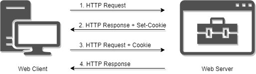
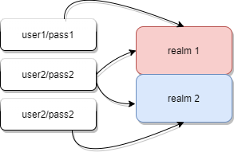

# 认证 & 授权

> 注 : 笔记中拓扑图 xmind 源文件在其图片目录下

---

**相关文章**
- [看完这篇 Session、Cookie、Token，和面试官扯皮就没问题了](https://www.cnblogs.com/cxuanBlog/p/12635842.html)
- [还分不清 Cookie、Session、Token、JWT？](https://zhuanlan.zhihu.com/p/164696755)

---

# 基础

**什么是认证(Authentication)**

验证当前用户的身份，证明“你是你自己”

场景
- 用户名密码登录
- 邮箱发送登录链接
- 手机号接收验证码
- 只要你能收到邮箱/验证码，就默认你是账号的主人

**什么是授权(Authorization)**

用户授予第三方应用访问该用户某些资源的权限

场景
- cookie
- token
- SSO
- OAuth

---

# Cookie

**什么是 Cookie**

Cookie 指某些网站为了辨别用户身份而储存在用户本地终端（Client Side）上的数据（通常经过加密）。

HTTP 协议中的 Cookie 包括 Web Cookie 和浏览器 Cookie，它是服务器发送到 Web 浏览器的一小块数据。服务器发送到浏览器的 Cookie，浏览器会进行存储，并与下一个请求一起发送到服务器。通常，它用于判断两个请求是否来自于同一个浏览器，例如用户保持登录状态。

Cookie 主要用于下面三个目的
- 会话管理
    - 登陆、购物车、游戏得分或者服务器应该记住的其他内容
- 个性化
    - 用户偏好、主题或者其他设置
- 追踪
    - 记录和分析用户行为

**Cookie 的特点**
- HTTP 是无状态的协议（对于事务处理没有记忆能力，每次客户端和服务端会话完成时，服务端不会保存任何会话信息）：每个请求都是完全独立的，服务端无法确认当前访问者的身份信息，无法分辨上一次的请求发送者和这一次的发送者是不是同一个人。所以服务器与浏览器为了进行会话跟踪（知道是谁在访问我），就必须主动的去维护一个状态，这个状态用于告知服务端前后两个请求是否来自同一浏览器。而这个状态需要通过 cookie 或者 session 去实现。
- cookie 存储在客户端： cookie 是服务器发送到用户浏览器并保存在本地的一小块数据，它会在浏览器下次向同一服务器再发起请求时被携带并发送到服务器上。
- cookie 是不可跨域的： 每个 cookie 都会绑定单一的域名，无法在别的域名下获取使用，一级域名和二级域名之间是允许共享使用的（靠的是 domain）。

**Cookie 的类型**

有两种类型的 Cookies，一种是 Session Cookies，一种是 Persistent Cookies，如果 Cookie 不包含到期日期，则将其视为会话 Cookie。会话 Cookie 存储在内存中，永远不会写入磁盘，当浏览器关闭时，此后 Cookie 将永久丢失。如果 Cookie 包含有效期 ，则将其视为持久性 Cookie。在到期指定的日期，Cookie 将从磁盘中删除。

- 会话 Cookies

    会话 Cookie 有个特征，客户端关闭时 Cookie 会删除，因为它没有指定 Expires 或 Max-Age 指令。

    但是，Web 浏览器可能会使用会话还原，这会使大多数会话 Cookie 保持永久状态，就像从未关闭过浏览器一样。

- 永久性 Cookies

    永久性 Cookie 不会在客户端关闭时过期，而是在特定日期（Expires）或特定时间长度（Max-Age）外过期。例如
    ```
    Set-Cookie: id=a3fWa; Expires=Wed, 21 Oct 2015 07:28:00 GMT;
    ```

**HttpOnly 的作用**

会话 Cookie 中缺少 HttpOnly 属性会导致攻击者可以通过程序(JS脚本、Applet等)获取到用户的 Cookie 信息，造成 XSS.

HttpOnly 是微软对 Cookie 做的扩展，该值指定 Cookie 是否可通过客户端脚本访问。

如果在 Cookie 中没有设置 HttpOnly 属性为 true，可能导致 Cookie 被窃取。窃取的 Cookie 可以包含标识站点用户的敏感信息，如 ASP.NET 会话 ID 或 Forms 身份验证票证，攻击者可以重播窃取的 Cookie，以便伪装成用户或获取敏感信息，进行跨站脚本攻击等。

**Cookie 的作用域**

Domain 和 Path 标识定义了 Cookie 的作用域：即 Cookie 应该发送给哪些 URL。

Domain 标识指定了哪些主机可以接受 Cookie。如果不指定，默认为当前主机 (不包含子域名)。如果指定了 Domain，则一般包含子域名。

例如，如果设置 Domain=mozilla.org，则 Cookie 也包含在子域名中（如 developer.mozilla.org）。

例如，设置 Path=/docs，则以下地址都会匹配：
- /docs
- /docs/Web/
- /docs/Web/HTTP

---

# Session

**什么是 Session**

客户端请求服务端，服务端会为这次请求开辟一块内存空间，这个对象便是 Session 对象，存储结构为 ConcurrentHashMap。Session 弥补了 HTTP 无状态特性，服务器可以利用 Session 存储客户端在同一个会话期间的一些操作记录。

session，指的是客户端与服务端维持的一个有状态会话，一种记录服务器和客户端会话状态的机制.

**Session 如何判断是否是同一会话**



- 服务器第一次接收到请求时，开辟了一块 Session 空间（创建了 Session 对象），同时生成一个 sessionId ，并通过响应头的 `Set-Cookie：JSESSIONID=XXXXXXX` 命令，向客户端发送要求设置 Cookie 的响应；
- 客户端收到响应后，在本机客户端设置了一个 `JSESSIONID=XXXXXXX` 的 Cookie 信息，该 Cookie 的过期时间为浏览器会话结束；
- 接下来客户端每次向同一个网站发送请求时，请求头都会带上该 Cookie 信息（包含 sessionId），请求会自动判断此域名下是否存在 Cookie 信息，如果存在自动将 Cookie 信息发送给服务端
- 然后，服务器通过读取请求头中的 Cookie 信息，获取名称为 JSESSIONID 的值，得到此次请求的 sessionId，再根据 SessionID 查找对应的 Session 信息，如果没有找到说明用户没有登录或者登录失效，如果找到 Session 证明用户已经登录可执行后面操作。

**Session 的缺点**

Session 机制有个缺点，比如 A 服务器存储了 Session，就是做了负载均衡后，假如一段时间内 A 的访问量激增，会转发到 B 进行访问，但是 B 服务器并没有存储 A 的 Session，会导致 Session 的失效。

**和 Cookie 的关系**

HTTP 协议是一种无状态协议，即每次服务端接收到客户端的请求时，都是一个全新的请求，服务器并不知道客户端的历史请求记录；Session 和 Cookie 的主要目的就是为了弥补 HTTP 的无状态特性。

session 可以基于 cookie 实现，session 存储在服务器端，sessionId 会被存储到客户端的 cookie 中.

cookie 是一个 http 头部，而 session 是一个虚拟概念。cookie 可以用于实现 session，也可以不。cookie 的用法远大于 session。反过来说，session 也未必需要用 cookie 实现。

---

# HTTP_Basic_Auth

**相关文章**
- [一文读懂HTTP Basic身份认证](https://juejin.im/entry/6844903586405564430)
- [HTTP基本认证](https://zh.wikipedia.org/wiki/HTTP%E5%9F%BA%E6%9C%AC%E8%AE%A4%E8%AF%81)
- [说说HttpClient三种Http Basic Authentication认证方式](https://cloud.tencent.com/developer/article/1499759)
- [HTTP Basic Auth 是怎么样工作的](https://cjting.me/2018/03/31/how-http-basic-auth-work/)

**什么是 HTTP_Basic_Auth**

HTTP Basic Auth 是 HTTP 提供的一种验证方式，因为明文传输用户名和密码，非 HTTPS 环境下很不安全，一般用的非常少。但是在某些情况下用一用还是非常方便的，比如，一些静态站点例如文档系统可以使用 HTTP Basic Auth 进行简单的权限验证。

**优点**
- 基本认证的一个优点是基本上所有流行的网页浏览器都支持基本认证。基本认证很少在可公开访问的互联网网站上使用，有时候会在小的私有系统中使用（如路由器网页管理接口）。后来的机制 HTTP 摘要认证是为替代基本认证而开发的，允许密钥以相对安全的方式在不安全的通道上传输。
- 程序员和系统管理员有时会在可信网络环境中使用基本认证，使用 Telnet 或其他明文网络协议工具手动地测试 Web 服务器。这是一个麻烦的过程，但是网络上传输的内容是人可读的，以便进行诊断。

**流程**

HTTP Basic Auth 使用两个 HTTP Header 实现，分别是 WWW-Authenticate 和 Authorization。

流程如下：
- 客户端请求服务器页面，服务器返回 401 以及 WWW-Authenticate: Basic realm="site"。
- 浏览器弹出对话框，提示用户输入用户名和密码。
- 浏览器再次请求页面，携带 Authorization: Basic <str>，其中，str=base64(username:password)。
- 服务器返回正常页面。

base64 只是一个编码过程，而不是加密过程，因此，HTTP Basic Auth 是在明文传输用户名和密码，中间设备很容易通过检查数据包获取用户名和密码。

**Realm**

WWW-Authenticate 这个头携带了一个 realm 属性，这个属性用来标注页面所属的区域,指当前认证的保护范围,一般情况下不用在意，随便填写或者不填写都可以。

但是，如果你的网站有两个子目录，每个子目录有自己的用户名和密码的话，realm 属性就比较重要了，这个属性会影响浏览器的密码自动填充过程。

同一个 server，访问受限的资源多种多样，比如资金信息、机密文档等。可以针对不同的资源定义不同的 realm，并且只允许特定的用户访问。跟 Linux 下的账户、分组体系很像，如下例子所示。



两个 URL，用户名和密码不相同。
- xxx.com/a : username: a, password: a, realm: whatever
- xxx.com/b : username: b, password: b, realm: whatever

1. 用户访问 /a，浏览器提示输密码，成功进入，浏览器将密码和 realm=whatever 关联
2. 用户访问 /b，浏览器请求，发现 401，同时 realm=whatever，默认使用上一次输入的密码填充
3. 还是 401，浏览器弹框提示用户输入，然后更新 realm=whatever 的密码关联
4. 用户访问 /a，浏览器自动使用 realm=whatever的密码进行填充（应该是缓存了相关信息，知道 /a 需要密码），收到 401，弹框提示用户输入，更新 realm=whatever 的密码关联
5. 用户访问 /b，和上面的流程一样，还是会导致弹框提示用户输入用户名和密码

也就是说，如果两个子目录的用户名和密码不一样，但是 realm 一样的话，会导致在两个子目录进行切换时，不停地输入用户民和密码。

如果 realm 不一样的话，就没有这个问题了，因为浏览器使用 realm 来关联用户名和密码。

---

# JWT

**相关文章**
- [JWT究竟是什么呢?](https://blog.fundebug.com/2018/07/12/what-is-jwt/)
- [五分钟带你了解啥是JWT](https://zhuanlan.zhihu.com/p/86937325)
- [JSON Web Token 入门教程](https://www.ruanyifeng.com/blog/2018/07/json_web_token-tutorial.html)

**什么是 JWT**

JWT，全称 JSON Web Token，是一套开放的以 JSON 为基础的 Token 认证标准。什么是 Token 认证呢？比如，服务器可以生成一个 Token，该 Token 具有 “以管理员身份登录” 的申明，并将其提供给客户端，客户端可以使用该 Token 来证明它是管理员的身份并登入。

简单地说，JWT 是一个字符串，我们在发起网络请求时，将其放在 header 或者 url 中，这样可以保证传递的数据被篡改时能被我们发现，保证安全性。

示例 xxxxx.yyyyy.zzzzz 即为 JWT
```
http://www.example.com/private/?token=xxxxx.yyyyy.zzzzz
```

当收到 JWT 时，可以采用同样的算法和密钥生成签名 signature，如果一致，说明数据没有被篡改。

很重要一点在于，JWT 是用于验证而非加密，任何人即使没有密钥 secret，header 与 payload 中的数据都是可以获取的。

JWT 的 Token 由三部分组成，Header，Payload 与 Signature，它们之间用 “.” 连接, 如下:
```
header.payload.signature
```

## Header

Header 对象用于标识生成签名的算法，其中 “alg” 字段表示签名的加密算法，一般默认是 HMAC SHA256，也有简称为 HS256 的。

“typ”字段表示这个 Token 的类型，JWT 的 Token 统一这里填写的为“JWT”。

alg 为算法的缩写，typ 为类型的缩写
```json
{
    "alg": "HS256",
    "typ": "JWT"
}
```

然后，这个 JSON 被 Base64 编码，形成 JSON Web Token 的第一部分。

## Payload

payload 为 JWT 的第二部分，其 JSON 对象包含一系列键值对(key/value)，存放的是真正需要传递的数据。其中包含声明（要求）。声明是关于实体(通常是用户)和其他数据的声明。声明有三种类型: registered, public 和 private。
- Registered claims : 这里有一组预定义的声明，它们不是强制的，但是推荐。比如：iss (issuer), exp (expiration time), sub (subject), aud (audience)等。
- Public claims : 可以随意定义。
- Private claims : 用于在同意使用它们的各方之间共享信息，并且不是注册的或公开的声明，也可以随意定义。

Registered claims 有特殊含义，比如 iat、exp 等，iat 表示 JWT 生成的实际，而 exp 代表 JWT 过期的时间。开发者可以使用其他非预定义的键用于传输数据。JWT规定了以下7个官方可选字段，但并不强制使用(声明名称都是三个字符)
* iss (issuer)：签发人
* exp (expiration time)：过期时间
* sub (subject)：主题
* aud (audience)：受众
* nbf (Not Before)：生效时间
* iat (Issued At)：签发时间
* jti (JWT ID)：编号

除了上述的7个字段，用户可以在这个部分自定义 Public claims 和 Private claims，例如：

```json
{
  "sub": "123456789",
  "name": "shiroshiro",
  "admin": false
}
```

以上两个字段都要最后经过 Base64 编码转换成字符串后才能当做 JWT Token 使用，但要注意的是 Base64 编码是可逆的，所以说任何人都可读到这两段的内容。

## Signature

signatrue，即签名，是 JWT 的第三部分。它由编码的 header 和 payload，使用用户指定的密钥 secret，采用 header 中指定的哈希算法生成。

signature 是根据 payload 生成的，两者是一一对应的，这样可以保证 payload 的数据不被篡改，除非密钥 secret 泄漏。

首先定义一个密钥，这个密钥由服务器保存，也只有服务器知道，不能泄露给用户。然后使用 Header 里面指定的签名算法生成签名，例如：
```
HMACSHA256(base64UrlEncode(header) + "." + base64UrlEncode(payload), secret)
```

然后将这部分 base64 编码形成 JSON Web Token 第三部分

算出签名后使用 '.' 连接三段字符串，这就是 JWT Token 的结构。

---

# OAuth

OAuth 协议为用户资源的授权提供了一个安全的、开放而又简易的标准。与以往的授权方式不同之处是 OAuth 的授权不会使第三方触及到用户的帐号信息（如用户名与密码），即第三方无需使用用户的用户名与密码就可以申请获得该用户资源的授权，因此 OAuth 是安全的。OAuth 是 Open Authorization 的简写。OAuth 已经有 2.0 版本了，2007 年发布了 OAuth1.0 协议，2011 年发布会了 OAuth2.0，2.0 与 1.0 之间不兼容。OAuth2.0 是目前最流行的授权机制，用来授权第三方应用，获取用户数据。

**相关文章**
- [理解OAuth 2.0](https://www.ruanyifeng.com/blog/2014/05/oauth_2_0.html)
- [OAuth 2.0 的一个简单解释](https://www.ruanyifeng.com/blog/2019/04/oauth_design.html)
- [关于 OAuth2.0 安全性你应该要知道的一些事](https://www.chrisyue.com/security-issue-about-oauth-2-0-you-should-know.html)
- [OAuth 2.0 的四种方式](https://www.ruanyifeng.com/blog/2019/04/oauth-grant-types.html)
- [OAuth2.0 认证](https://mp.weixin.qq.com/s/JYb26bWL99i46Bc77rCKUQ)

**OAuth 的应用举例**

开发者 A 注册某 IT 论坛后，发现可以在信息栏中填写自己的 Github 个人信息和仓库项目，但是他又觉得手工填写十分麻烦，但是直接提供 Github 账户和密码给论坛又是非常危险的事情。开发者 A 发现在该论坛处，可以点击 “导入” 按钮，授权该论坛访问自己的 Github 账户并限制其只具备读权限。这样一来， Github 中的所有仓库和相关信息就可以很方便地被导入到信息栏中，账户隐私信息也不会泄露。

**OAuth 如何授权**

OAuth 的核心就是向第三方应用颁发令牌。

OAuth 引入了一个授权层，用来分离两种不同的角色：客户端和资源所有者。......资源所有者同意以后，资源服务器可以向客户端颁发令牌。客户端通过令牌，去请求数据。

RFC 6749 标准定义了获得令牌的四种授权方式
> 注意，不管哪一种授权方式，第三方应用申请令牌之前，都必须先到系统备案，说明自己的身份，然后会拿到两个身份识别码：客户端 ID（client ID）和客户端密钥（client secret）。这是为了防止令牌被滥用，没有备案过的第三方应用，是不会拿到令牌的。

- 授权码（authorization-code） : 第三方应用先申请一个授权码，然后再用该码获取令牌，适用于所有有 Server 端的应用，如 Web 站点、有 Server 端的手机客户端

    这种方式是最常用的流程，安全性也最高，它适用于那些有后端的 Web 应用。授权码通过前端传送，令牌则是储存在后端，而且所有与资源服务器的通信都在后端完成。这样的前后端分离，可以避免令牌泄漏。

    

    - 第一步

        网站提供一个链接，用户点击后就会跳转到 B 网站，授权用户数据给 A 网站使用。下面就是 A 网站跳转 B 网站的一个示意链接。
        ```
        https://b.com/oauth/authorize?
        response_type=code&
        client_id=CLIENT_ID&
        redirect_uri=CALLBACK_URL&
        scope=read
        ```
        URL 中，`response_type` 参数表示要求返回授权码（code），`client_id` 参数让 B 知道是谁在请求，`redirect_uri` 参数是 B 接受或拒绝请求后的跳转网址，`scope` 参数表示要求的授权范围（这里是只读）。

    - 第二步

        用户跳转后，B 网站会要求用户登录，然后询问是否同意给予 A 网站授权。用户表示同意，这时 B 网站就会跳回 redirect_uri 参数指定的网址。跳转时，会传回一个授权码，就像下面这样。
        ```
        https://a.com/callback?code=AUTHORIZATION_CODE
        ```
        包含以下参数：
        - code：表示授权码，必选项。该码的有效期应该很短，通常设为10分钟，客户端只能使用该码一次，否则会被授权服务器拒绝。该码与客户端 ID 和重定向 URI，是一一对应关系。
        - state：如果客户端的请求中包含这个参数，认证服务器的回应也必须一模一样包含这个参数。

        上面 URL 中，`code` 参数就是授权码。

    - 第三步

        A 网站拿到授权码以后，就可以在后端，向 B 网站请求令牌。
        ```
        https://b.com/oauth/token?
        client_id=CLIENT_ID&
        client_secret=CLIENT_SECRET&
        grant_type=authorization_code&
        code=AUTHORIZATION_CODE&
        redirect_uri=CALLBACK_URL
        ```
        包含以下参数：
        - grant_type：表示使用的授权模式，必选项，此处的值固定为"authorization_code"。
        - code：表示上一步获得的授权码，必选项。
        - redirect_uri：表示重定向 URI，必选项，且必须与第一步中的该参数值保持一致。
        - client_id：表示客户端 ID，必选项。

        上面 URL 中，`client_id` 参数和 `client_secret` 参数用来让 B 确认 A 的身份（`client_secret` 参数是保密的，因此只能在后端发请求），`grant_type` 参数的值是 `AUTHORIZATION_CODE`，表示采用的授权方式是授权码，`code` 参数是上一步拿到的授权码，`redirect_uri` 参数是令牌颁发后的回调网址。

    - 第四步

        B 网站收到请求以后，就会颁发令牌。具体做法是向 redirect_uri 指定的网址，发送一段 JSON 数据。
        ```
        {
        "access_token":"ACCESS_TOKEN",
        "token_type":"bearer",
        "expires_in":2592000,
        "refresh_token":"REFRESH_TOKEN",
        "scope":"read",
        "uid":100101,
        "info":{...}
        }
        ```
        包含以下参数：
        - access_token：表示访问令牌，必选项。
        - token_type：表示令牌类型，该值大小写不敏感，必选项，可以是 bearer 类型或 mac 类型。
        - expires_in：表示过期时间，单位为秒。如果省略该参数，必须其他方式设置过期时间。
        - refresh_token：表示更新令牌，用来获取下一次的访问令牌，可选项。
        - scope：表示权限范围，如果与客户端申请的范围一致，此项可省略。

        上面 JSON 数据中，`access_token` 字段就是令牌，A 网站在后端拿到了。

- 隐藏式/简化模式（implicit）: 允许直接向前端颁发令牌。这种方式没有授权码这个中间步骤，所以称为（授权码）"隐藏式"（implicit）,结合移动应用或 Web App 使用.

    有些 Web 应用是纯前端应用，没有后端。这时就不能用上面的方式了，必须将令牌储存在前端。

    

    - 第一步

        A 网站提供一个链接，要求用户跳转到 B 网站，授权用户数据给 A 网站使用。
        ```
        https://b.com/oauth/authorize?
        response_type=token&
        client_id=CLIENT_ID&
        redirect_uri=CALLBACK_URL&
        scope=read
        ```
        包含以下参数：
        - response_type：表示授权类型，此处的值固定为 "token"，必选项。
        - client_id：表示客户端的 ID，必选项。
        - redirect_uri：表示重定向的 URI，可选项。
        - scope：表示权限范围，可选项。
        - state：表示客户端的当前状态，可以指定任意值，认证服务器会原封不动地返回这个值。

        上面 URL 中，`response_type` 参数为 token，表示要求直接返回令牌。

    - 第二步

        用户跳转到 B 网站，登录后同意给予 A 网站授权。这时，B 网站就会跳回 `redirect_uri` 参数指定的跳转网址，并且把令牌作为 URL 参数，传给 A 网站。
        ```
        https://a.com/callback#token=ACCESS_TOKEN
        ```

        上面 URL 中，token 参数就是令牌，A 网站因此直接在前端拿到令牌。

        注意，令牌的位置是 URL 锚点（fragment），而不是查询字符串（querystring），这是因为 OAuth 2.0 允许跳转网址是 HTTP 协议，因此存在"中间人攻击"的风险，而浏览器跳转时，锚点不会发到服务器，就减少了泄漏令牌的风险。

        这种方式把令牌直接传给前端，是很不安全的。因此，只能用于一些安全要求不高的场景，并且令牌的有效期必须非常短，通常就是会话期间（session）有效，浏览器关掉，令牌就失效了。

- 密码式（password）：如果你高度信任某个应用，RFC 6749 也允许用户把用户名和密码，直接告诉该应用。该应用就使用你的密码，申请令牌，这种方式称为"密码式"（password），例如同个组织的内部或外部应用.

    - 第一步

        A 网站要求用户提供 B 网站的用户名和密码。拿到以后，A 就直接向 B 请求令牌。
        ```
        https://oauth.b.com/token?
        grant_type=password&
        username=USERNAME&
        password=PASSWORD&
        client_id=CLIENT_ID
        ```
        包含以下参数：
        - grant_type：表示授权类型，此处的值固定为"password"，必选项。
        - username：表示用户名，必选项。
        - password：表示用户的密码，必选项。
        - scope：表示权限范围，可选项。

        上面 URL 中，`grant_type` 参数是授权方式，这里的 `password` 表示"密码式"，`username` 和 `password` 是 B 的用户名和密码。

    - 第二步

        B 网站验证身份通过后，直接给出令牌。注意，这时不需要跳转，而是把令牌放在 JSON 数据里面，作为 HTTP 回应，A 因此拿到令牌。

        这种方式需要用户给出自己的用户名/密码，显然风险很大，因此只适用于其他授权方式都无法采用的情况，而且必须是用户高度信任的应用。

- 客户端凭证(client credentials) : 命令行下请求令牌,比如百度 API Store.

    - 第一步

        A 应用在命令行向 B 发出请求。
        ```
        https://oauth.b.com/token?
        grant_type=client_credentials&
        client_id=CLIENT_ID&
        client_secret=CLIENT_SECRET
        ```
        上面 URL 中，`grant_type` 参数等于 `client_credentials` 表示采用凭证式，`client_id` 和 `client_secret` 用来让 B 确认 A 的身份。

    第二步，B 网站验证通过以后，直接返回令牌。

    这种方式给出的令牌，是针对第三方应用的，而不是针对用户的，即有可能多个用户共享同一个令牌。

**令牌的使用**

A 网站拿到令牌以后，就可以向 B 网站的 API 请求数据了。

此时，每个发到 API 的请求，都必须带有令牌。具体做法是在请求的头信息，加上一个 `Authorization` 字段，令牌就放在这个字段里面。
```
curl -H "Authorization: Bearer ACCESS_TOKEN" \
"https://api.b.com"
```
上面命令中，`ACCESS_TOKEN` 就是拿到的令牌。

**更新令牌**

令牌的有效期到了，如果让用户重新走一遍上面的流程，再申请一个新的令牌，很可能体验不好，而且也没有必要。OAuth 2.0 允许用户自动更新令牌。

具体方法是，B 网站颁发令牌的时候，一次性颁发两个令牌，一个用于获取数据，另一个用于获取新的令牌（refresh token 字段）。令牌到期前，用户使用 refresh token 发一个请求，去更新令牌。
```
https://b.com/oauth/token?
  grant_type=refresh_token&
  client_id=CLIENT_ID&
  client_secret=CLIENT_SECRET&
  refresh_token=REFRESH_TOKEN
```
包含以下参数：
- granttype：表示使用的授权模式，此处的值固定为 "refreshtoken"，必选项。
- refresh_token：表示早前收到的更新令牌，必选项。
- scope：表示申请的授权范围，不可以超出上一次申请的范围，如果省略该参数，则表示与上一次一致。

上面 URL 中，`grant_type` 参数为 `refresh_token` 表示要求更新令牌，`client_id` 参数和 `client_secret` 参数用于确认身份，`refresh_token` 参数就是用于更新令牌的令牌。

B 网站验证通过以后，就会颁发新的令牌。

**令牌与密码的区别**

令牌（token）与密码（password）的作用是一样的，都可以进入系统，但是有三点差异。
1. 令牌是短期的，到期会自动失效，用户自己无法修改。密码一般长期有效，用户不修改，就不会发生变化。
2. 令牌可以被数据所有者撤销，会立即失效。以上例而言，屋主可以随时取消快递员的令牌。密码一般不允许被他人撤销。
3. 令牌有权限范围（scope），比如只能访问A应用。对于网络服务来说，只读令牌就比读写令牌更安全。密码一般是完整权限。

上面这些设计，保证了令牌既可以让第三方应用获得权限，同时又随时可控，不会危及系统安全。这就是 OAuth 2.0 的优点。

注意，只要知道了令牌，就能进入系统。系统一般不会再次确认身份，所以令牌必须保密，泄漏令牌与泄漏密码的后果是一样的。 这也是为什么令牌的有效期，一般都设置得很短的原因。
