# gnuplot 学习笔记

> 官网 : http://www.gnuplot.info/

---

# 安装

**windows**

- 下载地址：https://sourceforge.net/projects/gnuplot/
    - 下载完，双击，一路下一步安装即可，安装完后在开始菜单栏里最近添加里可以看到刚刚安装的 gnuplot

        

---

# 常量、操作符和函数

## 数字

gnuplot 表示数字可分成整数、实数及复数三类：

- 整数：gnuplot 与 C 语言相同，采用 4 byte 储存整数。故能表示 -2147483647 至 +2147483647 之间的整数。
- 实数：能表示约 6 或 7 位的有效位数，指数部份为不大于 308 的数字。
- 复数：以 {<real>,<imag>} 表示复数。其中<real>为复数的实数部分，<imag>为虚数部分，此两部分均以实数型态表示。 如 3 + 2i 即以 {3,2} 表示。

gnuplot 储存数字的原则为，若能以整数方式储存则以整数储存数字，不然以实数方式储存，其次以复数方式储存。例如在 gnuplot 执行
```
print 1/3*3
print 1./3*3
```
分别得到 0 和 1.0 的结果。这是因前者使用整数计算，而后者采用实数计算的结果。

执行
```
print 1234.567
print 12345 + 0.56789
print 1.23e300 * 2e6
print 1.23e300 * 2e8
```
分别得到 1234.57、12345.6、2.46e+304 和 undefined value 的结果。这些例子是受到实数的有效位数和所能表现最大数字的限制。这是我们要注意的。

---

## 操作符

gnuplot 的操作符与 C 语言基本相同。 所有的操作均可做用在整数、实数或复数上。

| Symbol | Example | Explanation |
| - | - | - |
| `-` | `-a` | unary minus |
| `~` | `~a` | one's complement |
| `!` | `!a` | logical negation |
| `!` | `a!` | factorial |

| Symbol | Example | Explanation |
| - | - | - |
| `**` | `a**b` | exponentiation |
| `*`  | `a*b`  | multiplication |
| `/`  | `a/b`  | division |
| `%`  | `a%b`  | modulo |
| `+`  | `a+b`  | addition |
| `-`  | `a-b`  | subtraction |
| `==` | `a==b` | equality |
| `!=` | `a!=b` | inequality |
| `&`  | `a&b`   | bitwise AND |
| `^`  | `a^b`   | bitwise exclusive OR |
| `|`  | `a|b`   | bitwise inclusive OR |
| `&&` | `a&&b`  | logical AND |
| `||` | `a||b`  | logical OR |
| `?:` | `a?b:c` | ternary operation |

## 函数

在 gnuplot 中函数的参数可以是整数，实数或是复数。下表是 gnuplot 所提供的函数。

| Function | Auguments | Returns |
| - | - | - |
| abs(x)        | any               | absolute value of x, |x|; same type |
| abs(x)        | complex           | length of x, sqrt( real(x)^2 + imag(x)^2 ) |
| acos(x)       | any               | 1/cos(x) (inverse cosine) in radians |
| Acosh(x)      | any               | cosh−1 x (inverse hyperbolic cosine) in radians |
| arg(x)        | complex           | the phase of x in radians |
| asin(x)       | any               | 1/sin(x) (inverse sin) in radians |
| asinh(x)      | any               | sinh−1 x (inverse hyperbolic sin) in radians |
| atan(x)       | any               | 1/tan(x) (inverse tangent) in radians |
| atan2(y,x)    | int or real       | tan−1(y/x) (inverse tangent) |
| atanh(x)      | any               | tanh−1 x (inverse hyperbolic tangent) in radians |
| besj0(x)      | int or real       | J0 Bessel function of x |
| besj1(x)      | int or real       | J1 Bessel function of x |
| besy0(x)      | int or real       | Y0 Bessel function of x |
| besy1(x)      | int or real       | Y1 Bessel function of x |
| ceil(x)       | any               | smallest integer not less than x (real part) |
| cos(x)        | radians           | cos x, cosine of x |
| cosh(x)       | radians           | cosh x, hyperbolic cosine of x |
| erf(x)        | any               | Erf(real(x)), error function of real(x) |
| erfc(x)       | any               | Erfc(real(x)), 1.0 - error function of real(x) |
| exp(x)        | any               | exponential function of x |
| floor(x)      | any               | largest integer not greater than x (real part) |
| gamma(x)      | any               | Gamma(real(x)),  gamma function of real(x) |
| ibeta(p,q,x)  | any               | Ibeta(real(p,q,x)), ibeta function of real(p,q,x) |
| inverf(x)     | any               | inverse error function of real(x) |
| igamma(a,x)   | any               | Igamma(real(a,x)), igamma function of real(a,x) |
| imag(x)       | complex           | imaginary part of x as a real number |
| invnorm(x)    | any               | inverse normal distribution function of real(x) |
| int(x)        | real              | integer part of x, truncated toward zero |
| lambertw(x)   | real              | Lambert W function |
| lgamma(x)     | any               | Lgamma(real(x)),  lgamma function of real(x) |
| log(x)        | any               | ln(x), natural logarithm (base e) of x |
| log10(x)      | any               | log(x),  logarithm (base 10) of x |
| norm(x)       | any               | normal distribution (Gaussian) function of real(x) |
| rand(x)       | any               | normal distribution (Gaussian) function of real(x) |
| real(x)       | any               | Rand(real(x)),  pseudo random number generator |
| sgn(x)        | any               | real part of x |
| sin(x)        | any               | 1 if x>0, -1 if x<0, 0 if x=0. imag(x) ignored |
| sinh(x)       | radians           | sin(x), sine of x |
| sqrt(x)       | radians           | sinh(x), hyperbolic sine x |
| tan(x)        | any               | sqrt(x),  square root of x |
| tanh(x)       | complex           | tan(x),  tangent of x |
| column(x)     | int               | column x during datafile manipulation. |
| defined(X)    | variable name     | returns 1 if a variable X is defined, 0 otherwise. |
| tm hour(x)    | int               | the hour |
| tm mday(x)    | int               | the day of the month |
| tm min(x)     | int               | the minute |
| tm mon(x)     | int               | the month |
| tm sec(x)     | int               | the second |
| tm wday(x)    | int               | the day of the week |
| tm yday(x)    | int               | the day of the year |
| tm year(x)    | int               | the year |
| valid(x)      | int               | test validity of column(x) during datafile manip. |

**用户自定义函数和常量**

在 gnuplot 中，用户可自定函数。函数可有 1 至 5 个自变量。 其定义函数的语法如下：
```
<function-name> ( <dummy1> {,<dummy2> {, ...}}) = <expression>
```

而用户定义常数的语法如下：
```
<variable-name> = <constant-expression>
```

例如:
```
# 常数 w 为 2。
w = 2
# 常数 q 为小于但最接近 tan(pi/2 - 0.1) 的整数。
q = floor(tan(pi/2 - 0.1))
# 函数 f(x) 为 sin(w*x)，其中 w 为常数。
f(x) = sin(w*x)
# 函数 sinc(x) 为 sin(pi*x)/(pi*x)。
sinc(x) = sin(pi*x)/(pi*x)
# 函数 delta(t) 为脉冲函数。
delta(t) = (t == 0)
# 函数 ramp(t) 当其小于零为零，当其大于零为斜率等于 1 的直线。
ramp(t) = (t > 0) ? t : 0
# 函数 min(a,b) 取两者中较小的数。
min(a,b) = (a < b) ? a : b
comb(n,k) = n!/(k!*(n-k)!)
len3d(x,y,z) = sqrt(x*x+y*y+z*z)
plot f(x) = sin(x*a), a = 0.2, f(x), a = 0.4, f(x)
```

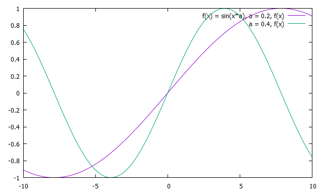

> gnuplot 已定义的常数仅有 pi (pi = 3.14159)

---

# 简单使用

gnuplot 绘制数学函数或数值资料的步骤大体如：

- 定义常数及函数：定义常数及函数，使程式模组化及易于了解。
- 设定绘图环境：gnuplot 绘图之前已预先设定许多绘图参数。
- 绘图：在定义数学函数或设定绘图环境之后，接着就是绘出数学函数或数值资料的图形。gnuplot 提供操作方便的绘图指令——plot (2D) 或 splot (3D)。
- 产生输出结果：在终端上绘出结果后，可经由一些步骤而产生不同输出装置所需的输出。

依照上述过程，可快速地画出图形。剩下的步骤就是细心的调整绘图环境参数或修改函数方程式、常数等，即可得到满意的结果。

**以曲线绘出三角函数 sin(x)**
```
plot sin(x)
```

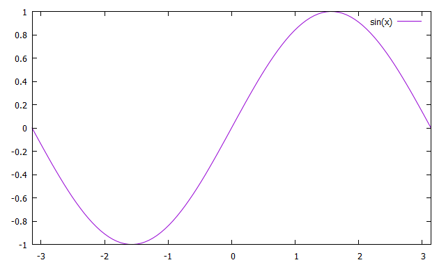

**从 -pi 到 +pi 的 sin(x) 和 cos(x)**
```
set xrange [-pi:pi]
replot cos(x) with points pointtype 2

或

plot [-pi:pi] sin(x), cos(x) with points pointtype 2
```
> replot 命令，它执行先前的 plot 命令。当你绘制曲线图且需要不断对该图进行修改以添加想要的特征时，此命令会非常有用。另外，replot 使你可以添加更多的图。尝试输入 replot cos(x)。依照语法，该命令等同于 plot sin(x), cos(x)。replot 就是获取先前的绘图字符串，添加必要的逗号，然后附加输入给它的其余部分。

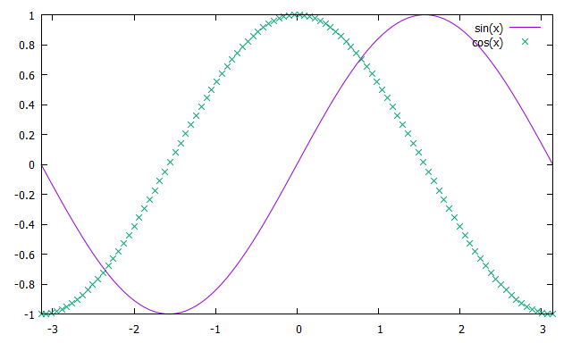

**将数据文件中的数据画出**
```
plot sin(x), '1.txt'
```

其中 1.txt 为一数据文件，每一行描述一点坐标位置。 内容如下，其中 # 后面的内容为注释：
```
# $Id: 1.dat,v 1.1.1.1 1998/04/15 19:16:40 lhecking Exp $
-20.000000 -3.041676
-19.000000 -3.036427
-18.000000 -3.030596
-17.000000 -3.024081
-16.000000 -3.016755
-15.000000 -3.008456
……
```

> 注: 输入 `pwd` 查看当前路径,在当前路径下放入 1.txt


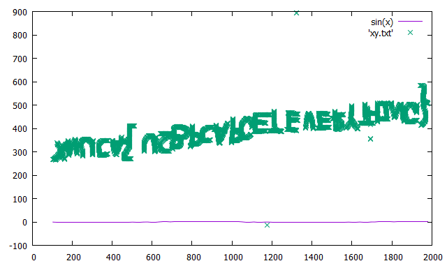

**命名图和坐标轴**
```
set title 'My first graph'
set xlabel 'Angle, in degrees'
set ylabel 'sin(angle)'
plot sin(x)
```

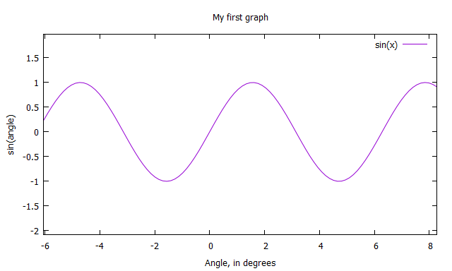

**改变轴上 tic 并设置网格**
```
set title "My first graph"
set xrange [-pi:pi]　　# we want only one cycle
set xtics ('0' 0, '90' pi/2, '-90' -pi/2, '45' pi/4,'-45' -pi/4,'135' 3*pi/4,'-135' -3*pi/4)
set grid
set xlabel 'Angle, in degrees'
set ylabel 'sin(angle)'
plot sin(x)
```

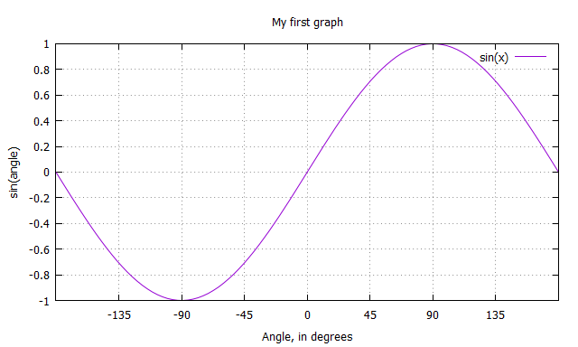

**多条曲线**
```
plot sin(x) with linespoints pointtype 5, cos(x) w boxes lt 4
```

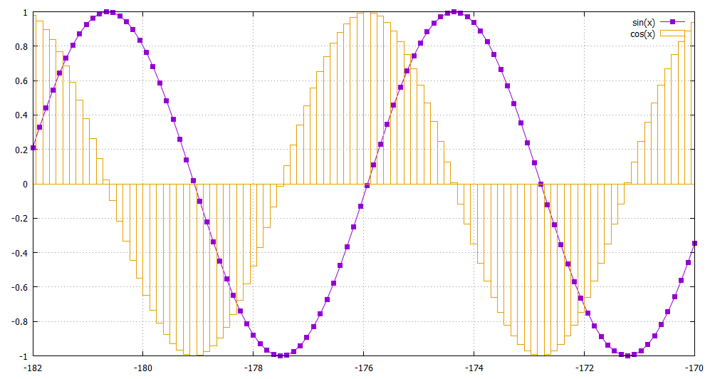

> with 子句使你可以详细而精确地指定线的样式。在本例中，我们说明两种有用的样式。第一种样式 linespoints 通常在对数据绘图时非常有用，它在涉及的每个示例或数据点处标记一个点，并使用线性插值法连接连续的点。这里我们另外指定点类型为 5，它选择终端允许的第五种点。第二种样式 boxes 更适合绘制直方图数据。注意我们如何在 cos(x) 曲线中将 with 缩写成 w。类似地，lt 是 linetype 的缩写，是另一个特定于终端的设置，它选择终端可以绘制的四种线。不必说，你可以使用 pt 代替冗长的 pointtype。如果想在多条线中使用相同的绘图样式（在一个 plot 命令中或在多个 plot 命令中），可以使用 set 命令设置绘图样式：set style function linespoints。要更改用于绘制与函数相对的数据集合的样式，使用 set style data linespoints。

> 当绘制两条或多条曲线时，我们需要关键字或图例来对它们进行区分。默认情况下，关键字在右上角；但是如果它妨碍了图，可以将关键字放到其他位置 。如果愿意，甚至可以放到图外。

**定制图的关键字或图例**
```
set key top left
set key box
plot [-pi:pi] sin(x) title 'sinusoid' with linespoints pointtype 5, cos(x) t 'cosine' w boxes lt 4
```

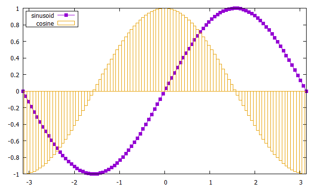

> 上面，我们在同一图中绘制了正弦和余弦曲线。gnuplot 使你还可以绘制多个图，这样它们可以并排显示在同一输出屏幕或文件中。在某些排版系统中，以一个文件的形式包含两个图形比分别包含两个图形要更容易。

**Multiplot 示例**
```
set xrange [-pi:pi]
# gnuplot recommends setting the size and origin before going to multiplot mode
# This sets up bounding boxes and may be required on some terminals
set size 1,1
set origin 0,0

# Done interactively, this takes gnuplot into multiplot mode
set multiplot

# plot the first graph so that it takes a quarter of the screen
set size 0.5,0.5
set origin 0,0.5
plot sin(x)

# plot the second graph so that it takes a quarter of the screen
set size 0.5,0.5
set origin 0,0
plot 1/sin(x)

# plot the third graph so that it takes a quarter of the screen
set size 0.5,0.5
set origin 0.5,0.5
plot cos(x)

# plot the fourth graph so that it takes a quarter of the screen
set size 0.5,0.5
set origin 0.5,0
plot 1/cos(x)

# On some terminals, nothing gets plotted until this command is issued
unset multiplot
# remove all customization
reset
```

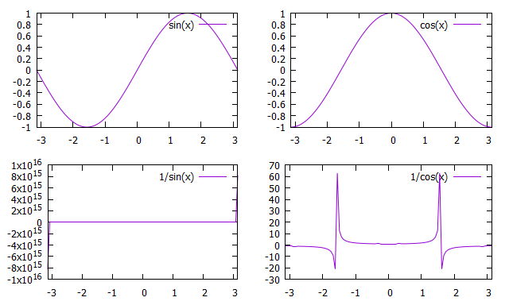

---

# 读取文件

**空格分隔**
```
plot 'data.txt'
```

**逗号分隔**

有时，我们的数据文件中各个数据之间是用逗号作为分隔符的，比如标准的以 “CSV” 为后缀的那种数据文件。如果在逗号之后没有空格分隔，默认情况下 gnuplot 是无法直接读取的。

这时可以有两种方案，第一种是提前处理一下数据文件，比如将逗号替换为空格，随便一个文本处理软件都能很轻松的做这种替换。但是有时我们有很多这样的数据文件，每个都这样处理一下也挺麻烦的。

第二种方法就是在 gnuplot 中给出文件分隔符的信息，让 gnuplot 能够读懂我们的文件。下面将要说的就是这种方法。

比如我们有如下的文件：
```
-3,0.1,0.0001234098
-2.9,0.1062699256,0.0002226299
-2.8,0.1131221719,0.000393669
-2.7,0.1206272618,0.0006823281
-2.6,0.1288659794,0.0011592292
-2.5,0.1379310345,0.0019304541
-2.4,0.1479289941,0.0031511116
-2.3,0.1589825119,0.0050417603
-2.2,0.1712328767,0.0079070541
-2.1,0.1848428835,0.0121551783
-2,0.2,0.0183156389
-1.9,0.2169197397,0.0270518469
-1.8,0.2358490566,0.0391638951
-1.7,0.2570694087,0.0555762126
-1.6,0.2808988764,0.0773047404
-1.5,0.3076923077,0.1053992246
-1.4,0.3378378378,0.1408584209
-1.3,0.3717472119,0.184519524
-1.2,0.4098360656,0.2369277587
-1.1,0.4524886878,0.2981972794
-1,0.5,0.3678794412
-0.9,0.5524861878,0.4448580662
-0.8,0.6097560976,0.527292424
-0.7,0.6711409396,0.6126263942
-0.6,0.7352941176,0.6976763261
-0.5,0.8,0.7788007831
-0.4,0.8620689655,0.852143789
-0.3,0.9174311927,0.9139311853
-0.2,0.9615384615,0.9607894392
-0.1,0.9900990099,0.9900498337
0,1,1
0.1,0.9900990099,0.9900498337
0.2,0.9615384615,0.9607894392
0.3,0.9174311927,0.9139311853
0.4,0.8620689655,0.852143789
0.5,0.8,0.7788007831
0.6,0.7352941176,0.6976763261
0.7,0.6711409396,0.6126263942
0.8,0.6097560976,0.527292424
0.9,0.5524861878,0.4448580662
1,0.5,0.3678794412
1.1,0.4524886878,0.2981972794
1.2,0.4098360656,0.2369277587
1.3,0.3717472119,0.184519524
1.4,0.3378378378,0.1408584209
1.5,0.3076923077,0.1053992246
1.6,0.2808988764,0.0773047404
1.7,0.2570694087,0.0555762126
1.8,0.2358490566,0.0391638951
1.9,0.2169197397,0.0270518469
2,0.2,0.0183156389
2.1,0.1848428835,0.0121551783
2.2,0.1712328767,0.0079070541
2.3,0.1589825119,0.0050417603
2.4,0.1479289941,0.0031511116
2.5,0.1379310345,0.0019304541
2.6,0.1288659794,0.0011592292
2.7,0.1206272618,0.0006823281
2.8,0.1131221719,0.000393669
2.9,0.1062699256,0.0002226299
3,0.1,0.0001234098
```

可以看到，数据有三列，用逗号来分隔，我们下面的例子中之用到前两列。如果直接用如下命令的话得到的不是我们希望的结果。
```
plot 'sample.csv'
```

gnuplot 只解析出了第一列的数据。如果我们告诉 gnuplot 我们的数据有两列会怎样呢？
```
Plot 'sample.csv' using 1:2
```
gnuplot 会报错

正确的方法是这样的：
```
plot 'sample.csv' using 1:2 "%lf,%lf"
```

格式字符串的格式与 C 语言中 scanf 的格式字符串是类似的，实际上 gnuplot 最后就是用的 scanf 函数来读取数据。%lf 表示按照 double 型浮点数类型来读取。需要注意的是 gnuplot 的格式化字符串不支持 %f。

---

# 输出文件

在启动时，终端类型设置为 X11。gnuplot 采用标准设计，可以在多个终端设备上绘图。这包括直接打印到多种打印机中，包括 Epson、HP 和 Imagen 打印机。它甚至可以在伪设备中绘图，如 postscript 和 png。这主要涉及生成输出文件，而不是可查看文件或打印输出。这是将你的图表包含在其他报表中的一种技巧。

**设置输出和终端类型**

```
# gnuplot recommends setting terminal before output
set terminal png

# The output filename
set output 'output.png'
plot sin(x)
```

现在，文件 output.png 中有了刚才绘制的图。

所有终端在能力上都不相同。其中的一些（如 LaTeX）可能不支持文本的旋转，所以如果你像我们前面那样设置 ylabel，在不同的终端中可能显示不一样。换句话说，你可以在 LaTeX 的特定终端中使用 LaTex 命令。例如，set ylabel $sin(\\\\theta)$（注意我们使用两个反斜杠产生一个 LaTex 所需的反斜杠 —— gnuplot 在将双引号中所括的字符串传送到终端驱动程序之前，先对其进行反斜杠处理）。现在，你可以使用 \\input{output.tex} 将输出文件包含在 LaTeX 文件中。要在 PostScript 终端中获得相同的结果，使用相应的 PostScript 命令：{/Symbol q}。在 enhanced PostScript 和 LaTeX 中，你可以使用表示法 x^{superscript} 和 x_{subscript} 得到上标文字。还要注意缩写的终端和输出命令：

**eps 驱动程序的能力**
```
# enhanced PostScript, essentially PostScript with bounding boxes
set term post enh
set out 'gplt.eps'
set xlabel '{/Symbol q_1}
set ylabel 'sin^2({/Symbol q_1})'
plot sin(x)**2
```

---

# 3D绘图

**以纵横各 10 条线组成的网格画出 sin(x)*cos(y) 的图形**
```
splot [-pi:pi] [-pi:pi] sin(x)*cos(y)
```

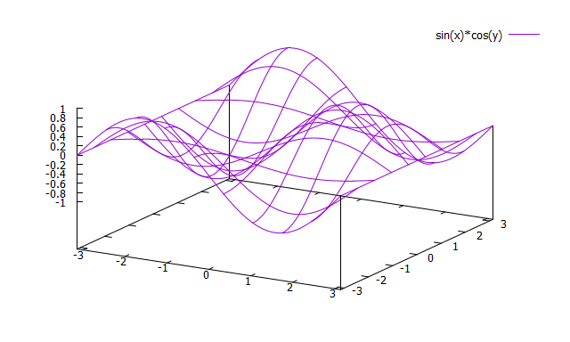

**画等高线图**
```
# 设置三维图表面的网格的数目
set dgrid3d 100,100

# 设置画等高线
set contour

# 设置等高线的疏密和范围，数据从 -0.2 到 0.2 中间每隔 0.01 画一条线
set cntrparam  levels  incremental -0.9,0.1,0.9

# 去掉上面的三维图形
unset surface
set view 0,0
unset key
splot [-pi:pi] [-pi:pi] sin(x)*cos(y)
```

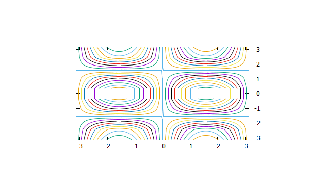

**画 pm3d 图**
```
set pm3d
set isosamples 50,50
splot x**2+y**2
```


```
# 设置视角，（0，0）将投影到底面上去
set view 0,0

# 把z轴上的数字给去掉
unset ztics
unset surface
splot x**2+y**2
reset
```

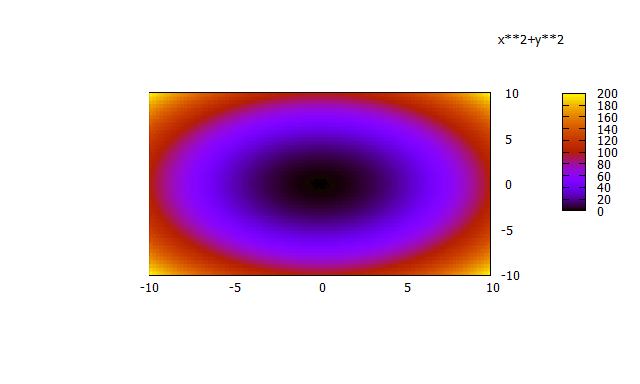

---

# 绘制时间序列图

通常我们利用数据文件绘图时，XY 坐标的值都是实数，也就是我们要绘制图形的函数是 R 到 R 的映射。可有时横轴或纵轴的数据是时间值，时间的格式每次可能还都不太一样。这时我们就需要特殊设置一下 gnuplot 了。

假设我们有数据文件 “timedat.dat”, 文件的内容如下。

```
#日/月/年 值
01/06/93	100
17/08/93	900
04/10/93	1300
11/10/93	300
28/10/93	1000
```

可以看到，横坐标是时间值，需要将这个信息告诉 gnuplot。利用如下的命令。
```
set xdata time
```

告诉 gnuplot 数据文件中的时间格式是什么样
```
set timefmt "%d/%m/%y"
```

读取文件显示
```
plot 'timedat.dat' using 1:2 with points ps 3 pt 6 title ""
```

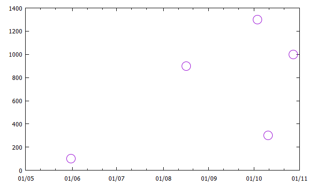

可以看到输出的横坐标只有月份和日期，没有年份信息。如果需要加入年份信息，可以这样设置：
```
set format x "%y/%m/%d"
```

执行先前的 plot 命令
```
replot
```

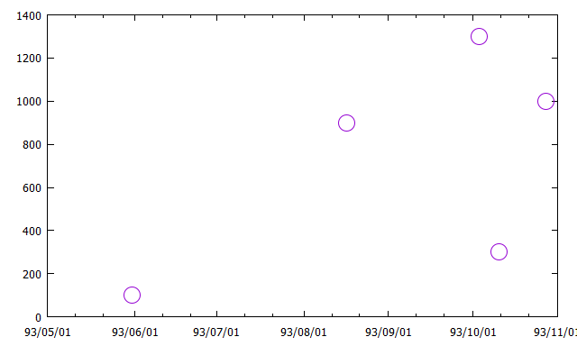

---

# 数据平滑

gnuplot 中可以利用 smooth 关键字实现数据的平滑，平滑的方法有多种，最主要的几种如下：
- unique : unique 的作用是首先将数据点按照 x 的大小关系排序。如果有多个数据点的 x 值相同的话则取这些数据点的平均值。
- frequency : frequency 首先将数据点按照 x 的大小关系排序，但是如果多个数据点的 x 值相同的话则将这些数据点的 y 值叠加。
- bezier : bezier 用 n 次 的 bezier 曲线连接数据点，n 是数据点的个数。曲线保证过头尾两个数据点，但是中间的数据点一般就不会经过了。这样的曲线足够光滑但不能保证通过所有的数据点。
- sbezier : sbezier 相当于首先应用 unique 将数据排序并将相同 x 值的数据取平均，然后应用 bezier。
- csplines : csplines 相当于首先应用 unique 将数据排序并将相同 x 值的数据取平均，然后应用自然样条插值。获得的曲线保证通过所有的数据点 (unique 处理过的数据点)。
- acsplines : acsplines 相当于首先应用 unique 将数据排序并将相同 x 值的数据取平均，然后应用加权的自然样条插值。加权值通过 using 关键字指定。加权后的曲线不一定通过所有的数据点。权值越大就越接近数据点。

下面是一个例子，数据文件 "price.dat"
```
# Average PQR and XYZ stock price (in dollars per share) per calendar year
1975 49 162
1976 52 144
1977 67 140
1978 53 122
1979 67 125
1980 46 117
1981 60 116
1982 50 113
1983 66 96
1984 70 101
1985 91 93
1986 133 92
1987 127 95
1988 136 79
1989 154 78
1990 127 85
1991 147 71
1992 146 54
1993 133 51
1994 144 49
1995 158 43
```

读取文件显示
```
plot "price.dat" using 1:2 with linespoints,"" using 1:2 title "bezier" smooth bezier,"" using 1:2 title "csplines" smooth csplines
```

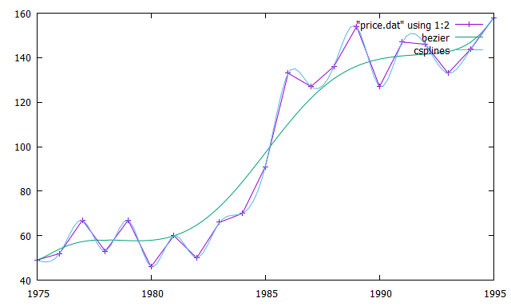

读取文件显示
```
plot [1975:1995][40:160] "price.dat" using 1:2 with points title "price.dat", "" u 1:2:(1) smooth acsplines title "1", "" using 1:2:(1/50.) smooth acsplines title "1/50", "" using 1:2:(50) smooth acsplines  title "50", "" using 1:2:(1/10000.) smooth acsplines title "1/10000"
```

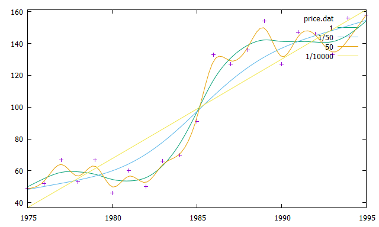

# 绘图环境参数

- 参考 : https://blog.csdn.net/liyuanbhu/article/details/8502461

---

**Source & Reference**
- [win10下gnuplot的安装和使用](https://blog.csdn.net/qq_39516859/article/details/82108976)
- [gnuplot 入门教程](https://blog.csdn.net/liyuanbhu/article/details/8502383)
- [有逼格的画图从gnuplot说起](https://xijunlee.github.io/2016/12/24/2016-12-24-you-bi-ge-de-hua-tu-cong-gnuplotshuo-qi/)
- [gnuplot 入门教程 2](https://blog.csdn.net/liyuanbhu/article/details/8502418)
- [gnuplot 入门教程 3](https://blog.csdn.net/liyuanbhu/article/details/8502450)
- [gnuplot 入门教程 4](https://blog.csdn.net/liyuanbhu/article/details/8502461)
- [gnuplot 读取逗号分隔的数据文件](https://blog.csdn.net/liyuanbhu/article/details/8516417)
- [利用 gnuplot 绘制时间序列图](https://blog.csdn.net/liyuanbhu/article/details/8497582)
- [gnuplot 中的数据平滑](https://blog.csdn.net/liyuanbhu/article/details/7574193)
