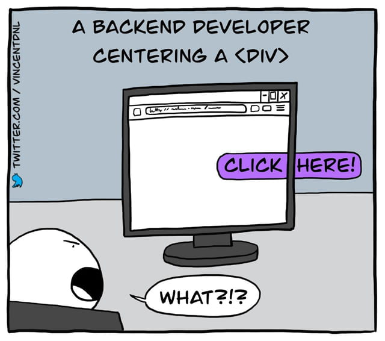

# Speed-HTML

<p align="center">
    <a href="https://twitter.com/vincentdnl/status/1275820987909648384"></a>
</p>

---

# 字符实体

HTML 中的预留字符必须被替换为字符实体。

一些在键盘上找不到的字符也可以使用字符实体来替换。

**HTML 实体**

在 HTML 中，某些字符是预留的。

在 HTML 中不能使用小于号（<）和大于号（>），这是因为浏览器会误认为它们是标签。

如果希望正确地显示预留字符，我们必须在 HTML 源代码中使用字符实体（character entities）。 字符实体类似这样：
```
&entity_name;

或

&#entity_number;
```
如需显示小于号，我们必须这样写：`&lt;` 或 `&#60;` 或 `&#060;`

**不间断空格(Non-breaking Space)**

HTML 中的常用字符实体是不间断空格 `&nbsp;` 。

浏览器总是会截短 HTML 页面中的空格。如果您在文本中写 10 个空格，在显示该页面之前，浏览器会删除它们中的 9 个。如需在页面中增加空格的数量，您需要使用 `&nbsp;` 字符实体。

**常见 HTML 字符实体**

| 显示结果	| 描述	    | 实体名称	| 实体编号 |
| - | - | - | - |
|  	        | 空格	        | `&nbsp;`	            | `&#160;` |
| <	        | 小于号	    | `&lt;`	            | `&#60;` |
| >	        | 大于号	    | `&gt;`	            | `&#62;` |
| &	        | 和号	        | `&amp;`	            | `&#38;` |
| "	        | 引号	        | `&quot;`	             | `&#34;` |
| '	        | 撇号 	        | `&apos;` (IE不支持)	| `&#39;` |
| ￠	        | 分	       | `&cent;`	            | `&#162;` |
| £	        | 镑	        | `&pound;`	            | `&#163;` |
| ¥	        | 人民币/日元	 | `&yen;`	            | `&#165;` |
| €	        | 欧元	        | `&euro;`	            | `&#8364;` |
| §	        | 小节	        | `&sect;`	            | `&#167;` |
| ©	        | 版权	        | `&copy;`	            | `&#169;` |
| ®	        | 注册商标	    | `&reg;`	            | `&#174;` |
| ™	        | 商标	        | `&trade;`	        | `&#8482;` |
| ×	        | 乘号	        | `&times;`	        | `&#215;` |
| ÷	        | 除号	        | `&divide;`	        | `&#247;` |

虽然 html 不区分大小写，但实体字符对大小写敏感。

更多 [字符实体](./HTML字符实体.md)

---

# 元素

在 HTML 中有五类元素
1. 空元素(Void elements),如 `<area>,<br>,<base>` 等等,不能容纳任何内容(因为它们没有闭合标签,没有内容能够放在开始标签和闭合标签中间).
2. 原始文本元素(Raw text elements),有 `<script>` 和 `<style>` , 原始文本元素,可以容纳文本.
3. RCDATA 元素(RCDATA elements),有 `<textarea>` 和 `<title>` , RCDATA 元素,可以容纳文本和字符引用.
4. 外部元素(Foreign elements),例如 `MathML命名空间` 或者 `SVG命名空间` 的元素,外部元素,可以容纳文本、字符引用、CDATA 段、其他元素和注释
5. 基本元素(Normal elements),即除了以上4种元素以外的元素,基本元素,可以容纳文本、字符引用、其他元素和注释

---

# src 属性
## data 地址类型

src 的 data 可以让我们直接在网页上绘制图像,将图片生成数据流形式.Base64 是网络上最常见的用于传输 8Bit 字节代码的编码方式之一,Base64 编码可用于在 HTTP 环境下传递较长的标识信息.

**data 的一些类型**
```
data:,<文本数据>
data:text/plain,<文本数据>
data:text/html,<HTML 代码>
data:text/html;base64,<base64 编码的 HTML 代码>
data:text/css,<CSS 代码>
data:text/css;base64,<base64 编码的 CSS 代码>
data:text/javascript,<Javascript 代码>
data:text/javascript;base64,<base64 编码的 Javascript 代码>
data:image/gif;base64,base64 编码的 gif 图片数据
data:image/png;base64,base64 编码的 png 图片数据
data:image/jpeg;base64,base64 编码的 jpeg 图片数据
data:image/x-icon;base64,base64 编码的 icon 图片数据
```

**Data 语法**
```
data:image/jpg; 声明数据协议及类型名称
base64, 编码形式为 base64
****** base64 编码数据流
```

**使用 data 优劣势**
- data 优势:减少 HTTP 请求
- data 劣势:
    - 转化之后的图片代码通常比图片本身要大.
    - IE8 支持的最大内嵌图片代码为 32768 个字节
    - 以 data 形式插入图片不易于修改和维护.
