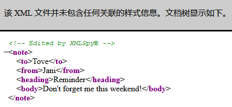
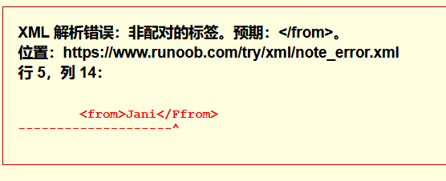
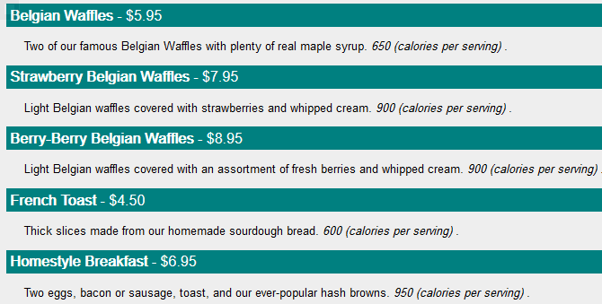

# XML 学习笔记

---

# 概述

XML 用于标记电子文件使其具有结构性的标记语言，可以用来标记数据、定义数据类型，是一种允许用户对自己的标记语言进行定义的源语言。XML 文档结构包括 XML 声明、DTD 文档类型定义（可选）、文档元素。

XML 无所不在.

```xml
<!-- XML声明 -->
<?xml version="1.0" encoding="UTF-8"?>

<!-- 文档类型定义 -->
<!DOCTYPE note[
    <!ELEMENT note (to,from,heading,body)>
    <!ELEMENT to (#PCDATA)>
    <!ELEMENT from (#PCDATA)>
    <!ELEMENT heading (#PCDATA)>
    <!ELEMENT body (#PCDATA)>
]>

<!-- 文档元素 -->
<note>
  <to>Tove</to>
  <from>Jani</from>
  <heading>Reminder</heading>
  <body>Don't forget me this weekend!</body>
</note>
```

---

## 用途

XML 应用于 Web 开发的许多方面，常用于简化数据的存储和共享。

**XML 把数据从 HTML 分离**

如果你需要在 HTML 文档中显示动态数据，那么每当数据改变时将花费大量的时间来编辑 HTML。

通过 XML，数据能够存储在独立的 XML 文件中。这样你就可以专注于使用 HTML/CSS 进行显示和布局，并确保修改底层数据不再需要对 HTML 进行任何的改变。

通过使用几行 JavaScript 代码，你就可以读取一个外部 XML 文件，并更新你的网页的数据内容。

**XML 简化数据共享**

在真实的世界中，计算机系统和数据使用不兼容的格式来存储数据。

XML 数据以纯文本格式进行存储，因此提供了一种独立于软件和硬件的数据存储方法。

这让创建不同应用程序可以共享的数据变得更加容易。

**XML 简化数据传输**

对开发人员来说，其中一项最费时的挑战一直是在互联网上的不兼容系统之间交换数据。

由于可以通过各种不兼容的应用程序来读取数据，以 XML 交换数据降低了这种复杂性。

**XML 简化平台变更**

升级到新的系统（硬件或软件平台），总是非常费时的。必须转换大量的数据，不兼容的数据经常会丢失。

XML 数据以文本格式存储。这使得 XML 在不损失数据的情况下，更容易扩展或升级到新的操作系统、新的应用程序或新的浏览器。

**XML 使你的数据更有用**

不同的应用程序都能够访问你的数据，不仅仅在 HTML 页中，也可以从 XML 数据源中进行访问。

通过 XML，你的数据可供各种阅读设备使用（掌上计算机、语音设备、新闻阅读器等），还可以供盲人或其他残障人士使用。

**XML 用于创建新的互联网语言**

很多新的互联网语言是通过 XML 创建的。

这里有一些实例：
- XHTML
- 用于描述可用的 Web 服务 的 WSDL
- 作为手持设备的标记语言的 WAP 和 WML
- 用于新闻 feed 的 RSS 语言
- 描述资本和本体的 RDF 和 OWL
- 用于描述针针对 Web 的多媒体 的 SMIL

---

## XML 和 HTML 之间的差异

XML 和 HTML 为不同的目的而设计：
- XML 被设计用来传输和存储数据，其焦点是数据的内容。
- HTML 被设计用来显示数据，其焦点是数据的外观。

XML 不会做任何事情
- HTML 旨在显示信息，而 XML 旨在传输信息,XML 不会做任何事情.

通过 XML 你可以发明自己的标签
- 这是因为 XML 语言没有预定义的标签。
- HTML 中使用的标签都是预定义的。HTML 文档只能使用在 HTML 标准中定义过的标签（如 `<p>`、`<h1>` 等等）。
- XML 允许创作者定义自己的标签和自己的文档结构。

XML 不是对 HTML 的替代
- XML 是对 HTML 的补充。
- XML 不会替代 HTML，理解这一点很重要。在大多数 Web 应用程序中，XML 用于传输数据，而 HTML 用于格式化并显示数据。

---

# 语法

XML 的语法规则很简单，且很有逻辑。这些规则很容易学习，也很容易使用。

**XML 文档必须有根元素**

XML 必须包含根元素，它是所有其他元素的父元素，比如以下实例中 root 就是根元素：
```xml
<root>
  <child>
    <subchild>.....</subchild>
  </child>
</root>
```

以下实例中 note 是根元素：
```xml
<?xml version="1.0" encoding="UTF-8"?>
<note>
  <to>Tove</to>
  <from>Jani</from>
  <heading>Reminder</heading>
  <body>Don't forget me this weekend!</body>
</note>
```

**XML 声明**

XML 声明文件的可选部分，如果存在需要放在文档的第一行，如下所示：
```xml
<?xml version="1.0" encoding="utf-8"?>
```
以上实例包含 XML 版本（

UTF-8 也是 HTML5, CSS, JavaScript, PHP, 和 SQL 的默认编码。

**所有的 XML 元素都必须有一个关闭标签**

在 HTML 中，某些元素不必有一个关闭标签：
```xml
<p>This is a paragraph.
<br>
```
在 XML 中，省略关闭标签是非法的。所有元素都必须有关闭标签：
```xml
<p>This is a paragraph.</p>
<br />
```
注释：从上面的实例中，你也许已经注意到 XML 声明没有关闭标签。这不是错误。声明不是 XML 文档本身的一部分，它没有关闭标签。

**XML 标签对大小写敏感**

XML 标签对大小写敏感。标签 `<Letter>` 与标签 `<letter>` 是不同的。

必须使用相同的大小写来编写打开标签和关闭标签：
```xml
<Message>这是错误的</message>
<message>这是正确的</message>
```
注释：打开标签和关闭标签通常被称为开始标签和结束标签。不论你喜欢哪种术语，它们的概念都是相同的。

**XML 必须正确嵌套**

在 HTML 中，常会看到没有正确嵌套的元素：
```xml
<b><i>This text is bold and italic</b></i>
```

在 XML 中，所有元素都必须彼此正确地嵌套：
```xml
<b><i>This text is bold and italic</i></b>
```

在上面的实例中，正确嵌套的意思是：由于 `<i>` 元素是在 `<b>` 元素内打开的，那么它必须在 `<b>` 元素内关闭。

**XML 属性值必须加引号**

与 HTML 类似，XML 元素也可拥有属性（名称/值的对）。

在 XML 中，XML 的属性值必须加引号。

请研究下面的两个 XML 文档。 第一个是错误的，第二个是正确的：
```xml
<note date=12/11/2007>
<to>Tove</to>
<from>Jani</from>
</note>
```
```xml
<note date="12/11/2007">
<to>Tove</to>
<from>Jani</from>
</note>
```
在第一个文档中的错误是，note 元素中的 date 属性没有加引号。

**实体引用**

在 XML 中，一些字符拥有特殊的意义。

如果您把字符 "<" 放在 XML 元素中，会发生错误，这是因为解析器会把它当作新元素的开始。

这样会产生 XML 错误：
```xml
<message>if salary < 1000 then</message>
```

为了避免这个错误，请用实体引用来代替 "<" 字符：
```xml
<message>if salary &lt; 1000 then</message>
```

在 XML 中，有 5 个预定义的实体引用：
| 实体符号   | 字符   | 含义    |
| - | - | - |
| &lt; 	    | < 	| less than |
| &gt; 	    | > 	| greater than |
| &amp; 	| & 	| ampersand |
| &apos; 	| ' 	| apostrophe |
| &quot; 	| " 	| quotation mark |

注释：在 XML 中，只有字符 "<" 和 "&" 确实是非法的。大于号是合法的，但是用实体引用来代替它是一个好习惯。

**XML 中的注释**

在 XML 中编写注释的语法与 HTML 的语法很相似。
```xml
<!-- This is a comment -->
```

**在 XML 中，空格会被保留**

HTML 会把多个连续的空格字符裁减（合并）为一个：

HTML:
```html
Hello           Tove
```
输出结果:
```html
Hello Tove
```

在 XML 中，文档中的空格不会被删减。

**XML 以 LF 存储换行**

在 Windows 应用程序中，换行通常以一对字符来存储：回车符（CR）和换行符（LF）。

在 Unix 和 Mac OSX 中，使用 LF 来存储新行。

在旧的 Mac 系统中，使用 CR 来存储新行。

XML 以 LF 存储换行。

---

# 树结构

XML 文档形成了一种树结构，它从"根部"开始，然后扩展到"枝叶"。

```xml
<?xml version="1.0" encoding="UTF-8"?>
<note>
<to>Tove</to>
<from>Jani</from>
<heading>Reminder</heading>
<body>Don't forget me this weekend!</body>
</note>
```
第一行是 XML 声明。它定义 XML 的版本（1.0）和所使用的编码（UTF-8 : 万国码, 可显示各种语言）。

下一行描述文档的根元素（像在说："本文档是一个便签"）：
```xml
<note>
```

接下来 4 行描述根的 4 个子元素（to, from, heading 以及 body）：
```xml
<to>Tove</to>
<from>Jani</from>
<heading>Reminder</heading>
<body>Don't forget me this weekend!</body>
```
最后一行定义根元素的结尾：
```xml
</note>
```
你可以假设，从这个实例中，XML 文档包含了一张 Jani 写给 Tove 的便签。

XML 文档必须包含根元素。该元素是所有其他元素的父元素。

XML 文档中的元素形成了一棵文档树。这棵树从根部开始，并扩展到树的最底端。

所有的元素都可以有子元素：
```
<root>
<child>
<subchild>.....</subchild>
</child>
</root>
```

父、子以及同胞等术语用于描述元素之间的关系。父元素拥有子元素。相同层级上的子元素成为同胞（兄弟或姐妹）。

所有的元素都可以有文本内容和属性（类似 HTML 中）。

例如:
```xml
<bookstore>
    <book category="COOKING">
        <title lang="en">Everyday Italian</title>
        <author>Giada De Laurentiis</author>
        <year>2005</year>
        <price>30.00</price>
    </book>
    <book category="CHILDREN">
        <title lang="en">Harry Potter</title>
        <author>J K. Rowling</author>
        <year>2005</year>
        <price>29.99</price>
    </book>
    <book category="WEB">
        <title lang="en">Learning XML</title>
        <author>Erik T. Ray</author>
        <year>2003</year>
        <price>39.95</price>
    </book>
</bookstore>
```

实例中的根元素是 `<bookstore>`。文档中的所有 `<book>` 元素都被包含在 `<bookstore>` 中。

`<book>` 元素有 4 个子元素：`<title>`、`<author>`、`<year>`、`<price>`。

---

## XML 文档的构建模块

所有的 XML 文档（以及 HTML 文档）均由以下简单的构建模块构成：
- 元素
    元素是 XML 以及 HTML 文档的主要构建模块，元素可包含文本、其他元素或者是空的。

    实例:
    ```xml
    <body>body text in between</body>
    <message>some message in between</message>
    ```
    空的 HTML 元素的例子是 "hr"、"br" 以及 "img"。

- 属性

    属性可提供有关元素的额外信息
    实例：
    ```xml
    
    ```

- 实体

    实体是用来定义普通文本的变量。实体引用是对实体的引用。

- PCDATA

    PCDATA 的意思是被解析的字符数据（parsed character data）。
    PCDATA 是会被解析器解析的文本。这些文本将被解析器检查实体以及标记。

- CDATA

    CDATA 的意思是字符数据（character data）。
    CDATA 是不会被解析器解析的文本。

---

## 元素

**什么是 XML 元素？**

XML 元素指的是从（且包括）开始标签直到（且包括）结束标签的部分。

一个元素可以包含：
- 其他元素
- 文本
- 属性
- 或混合以上所有...
```xml
<bookstore>
    <book category="CHILDREN">
        <title>Harry Potter</title>
        <author>J K. Rowling</author>
        <year>2005</year>
        <price>29.99</price>
    </book>
    <book category="WEB">
        <title>Learning XML</title>
        <author>Erik T. Ray</author>
        <year>2003</year>
        <price>39.95</price>
    </book>
</bookstore>
```
在上面的实例中，`<bookstore>` 和 `<book>` 都有元素内容，因为他们包含其他元素。`<book>` 元素也有属性（category="CHILDREN"）。`<title>`、`<author>`、`<year>` 和 `<price>` 有文本内容，因为他们包含文本。

**XML 命名规则**

XML 元素必须遵循以下命名规则：
- 名称可以包含字母、数字以及其他的字符
- 名称不能以数字或者标点符号开始
- 名称不能以字母 xml（或者 XML、Xml 等等）开始
- 名称不能包含空格

可使用任何名称，没有保留的字词。

**最佳命名习惯**

使名称具有描述性。使用下划线的名称也很不错：`<first_name>`、`<last_name>`。

名称应简短和简单，比如：`<book_title>`，而不是：`<the_title_of_the_book>`。

避免 "-" 字符。如果您按照这样的方式进行命名："first-name"，一些软件会认为您想要从 first 里边减去 name。

避免 "." 字符。如果您按照这样的方式进行命名："first.name"，一些软件会认为 "name" 是对象 "first" 的属性。

避免 ":" 字符。冒号会被转换为命名空间来使用（稍后介绍）。

XML 文档经常有一个对应的数据库，其中的字段会对应 XML 文档中的元素。有一个实用的经验，即使用数据库的命名规则来命名 XML 文档中的元素。

在 XML 中，éòá 等非英语字母是完全合法的，不过需要留意，您的软件供应商不支持这些字符时可能出现的问题。

**XML 元素是可扩展的**

XML 元素是可扩展，以携带更多的信息。

请看下面的 XML 实例：
```xml
<note>
    <to>Tove</to>
    <from>Jani</from>
    <body>Don't forget me this weekend!</body>
</note>
```
让我们设想一下，我们创建了一个应用程序，可将 `<to>`、`<from>` 以及 `<body>` 元素从 XML 文档中提取出来，并产生以下的输出：
MESSAGE
```
To: Tove
From: Jani

Don't forget me this weekend!
```
想象一下，XML 文档的作者添加的一些额外信息：
```xml
<note>
    <date>2008-01-10</date>
    <to>Tove</to>
    <from>Jani</from>
    <heading>Reminder</heading>
    <body>Don't forget me this weekend!</body>
</note>
```
那么这个应用程序会中断或崩溃吗？

不会。这个应用程序仍然可以找到 XML 文档中的 `<to>`、`<from>` 以及 `<body>` 元素，并产生同样的输出。

XML 的优势之一，就是可以在不中断应用程序的情况下进行扩展。

## 属性

XML 元素具有属性，类似 HTML。

属性（Attribute）提供有关元素的额外信息。

**XML 属性**

在 HTML 中，属性提供有关元素的额外信息：
```xml

<a href="demo.html">
```
属性通常提供不属于数据组成部分的信息。在下面的实例中，文件类型与数据无关，但是对需要处理这个元素的软件来说却很重要：
```xml
<file type="gif">computer.gif</file>
```

**XML 属性必须加引号**

属性值必须被引号包围，不过单引号和双引号均可使用。比如一个人的性别，`person` 元素可以这样写：
```xml
<person sex="female">

```
或者这样也可以：
```xml
<person sex='female'>
```

如果属性值本身包含双引号，您可以使用单引号，就像这个实例：
```xml
<gangster name='George "Shotgun" Ziegler'>
```

或者您可以使用字符实体：
```xml
<gangster name="George &quot;Shotgun&quot; Ziegler">
```

XML 元素 vs. 属性

请看这些实例：

```xml
<person sex="female">
<firstname>Anna</firstname>
<lastname>Smith</lastname>
</person>
```

```xml
<person>
<sex>female</sex>
<firstname>Anna</firstname>
<lastname>Smith</lastname>
</person>
```
在第一个实例中，sex 是一个属性。在第二个实例中，sex 是一个元素。这两个实例都提供相同的信息。

没有什么规矩可以告诉我们什么时候该使用属性，而什么时候该使用元素。我的经验是在 HTML 中，属性用起来很便利，但是在 XML 中，您应该尽量避免使用属性。如果信息感觉起来很像数据，那么请使用元素。

下面的三个 XML 文档包含完全相同的信息：

第一个实例中使用了 date 属性：
```xml
<note date="10/01/2008">
<to>Tove</to>
<from>Jani</from>
<heading>Reminder</heading>
<body>Don't forget me this weekend!</body>
</note>
```

第二个实例中使用了 date 元素：
```xml
<note>
<date>10/01/2008</date>
<to>Tove</to>
<from>Jani</from>
<heading>Reminder</heading>
<body>Don't forget me this weekend!</body>
</note>
```

第三个实例中使用了扩展的 date 元素：
```xml
<note>
<date>
<day>10</day>
<month>01</month>
<year>2008</year>
</date>
<to>Tove</to>
<from>Jani</from>
<heading>Reminder</heading>
<body>Don't forget me this weekend!</body>
</note>
```

**避免 XML 属性？**

因使用属性而引起的一些问题：
- 属性不能包含多个值（元素可以）
- 属性不能包含树结构（元素可以）
- 属性不容易扩展（为未来的变化）

属性难以阅读和维护。请尽量使用元素来描述数据。而仅仅使用属性来提供与数据无关的信息。

不要做这样的蠢事（这不是 XML 应该被使用的方式）：
```xml
<note day="10" month="01" year="2008"
to="Tove" from="Jani" heading="Reminder"
body="Don't forget me this weekend!">
</note>
```

**针对元数据的 XML 属性**

有时候会向元素分配 ID 引用。这些 ID 索引可用于标识 XML 元素，它起作用的方式与 HTML 中 id 属性是一样的。这个实例向我们演示了这种情况：
```xml
<messages>
<note id="501">
<to>Tove</to>
<from>Jani</from>
<heading>Reminder</heading>
<body>Don't forget me this weekend!</body>
</note>
<note id="502">
<to>Jani</to>
<from>Tove</from>
<heading>Re: Reminder</heading>
<body>I will not</body>
</note>
</messages>
```

上面的 id 属性仅仅是一个标识符，用于标识不同的便签。它并不是便签数据的组成部分。

元数据（有关数据的数据）应当存储为属性，而数据本身应当存储为元素。

---

# 格式验证

拥有正确语法的 XML 被称为"形式良好"的 XML。

通过 DTD 验证的 XML 是"合法"的 XML。

**验证 XML 文档**

合法的 XML 文档是"形式良好"的 XML 文档，这也符合文档类型定义（DTD）的规则：
```xml
<?xml version="1.0" encoding="ISO-8859-1"?>
<!DOCTYPE note SYSTEM "Note.dtd">
<note>
<to>Tove</to>
<from>Jani</from>
<heading>Reminder</heading>
<body>Don't forget me this weekend!</body>
</note>
```
在上面的实例中，DOCTYPE 声明是对外部 DTD 文件的引用。下面的段落展示了这个文件的内容。

**XML DTD**

DTD 的目的是定义 XML 文档的结构。它使用一系列合法的元素来定义文档结构：
```xml
<!DOCTYPE note
[
<!ELEMENT note (to,from,heading,body)>
<!ELEMENT to (#PCDATA)>
<!ELEMENT from (#PCDATA)>
<!ELEMENT heading (#PCDATA)>
<!ELEMENT body (#PCDATA)>
]>
```

**XML Schema**

W3C 支持一种基于 XML 的 DTD 代替者，它名为 XML Schema：
```xml
<xs:element name="note">

<xs:complexType>
<xs:sequence>
<xs:element name="to" type="xs:string"/>
<xs:element name="from" type="xs:string"/>
<xs:element name="heading" type="xs:string"/>
<xs:element name="body" type="xs:string"/>
</xs:sequence>
</xs:complexType>

</xs:element>
```

---

## 查看 XML 文件

在所有主流的浏览器中，均能够查看原始的 XML 文件。

不要指望 XML 文件会直接显示为 HTML 页面。

**查看 XML 文件**

```xml
<?xml version="1.0" encoding="ISO-8859-1"?>
<!-- Edited by XMLSpy® -->
<note>
	<to>Tove</to>
	<from>Jani</from>
	<heading>Reminder</heading>
	<body>Don't forget me this weekend!</body>
</note>
```

这个 XML 在浏览器中显示是这样的



XML 文档将显示为代码颜色化的根以及子元素。通过点击元素左侧的加号（+）或减号（ - ），可以展开或收起元素的结构。要查看原始的 XML 源（不包括 + 和 - 符号），选择"查看页面源代码"或从浏览器菜单"查看源文件"。

如果一个错误的XML文件被打开，浏览器会报告错误。



**XML CSS**

通过使用 CSS（Cascading Style Sheets 层叠样式表），您可以添加显示信息到 XML 文档中。

原始 XML


CSS


CSS + XML


下面是 XML 文件的一小部分。第二行把 XML 文件链接到 CSS 文件：
```xml
<?xml version="1.0" encoding="ISO-8859-1"?>
<?xml-stylesheet type="text/css" href="cd_catalog.css"?>
<CATALOG>
<CD>
<TITLE>Empire Burlesque</TITLE>
<ARTIST>Bob Dylan</ARTIST>
<COUNTRY>USA</COUNTRY>
<COMPANY>Columbia</COMPANY>
<PRICE>10.90</PRICE>
<YEAR>1985</YEAR>
</CD>
<CD>
<TITLE>Hide your heart</TITLE>
<ARTIST>Bonnie Tyler</ARTIST>
<COUNTRY>UK</COUNTRY>
<COMPANY>CBS Records</COMPANY>
<PRICE>9.90</PRICE>
<YEAR>1988</YEAR>
</CD>
.
.
.
</CATALOG>
```

使用 CSS 格式化 XML 不是常用的方法,W3C 推荐使用 XSLT.

**XML XSLT**

XSLT 是首选的 XML 样式表语言。

XSLT（eXtensible Stylesheet Language Transformations）远比 CSS 更加完善。

XSLT 是在浏览器显示 XML 文件之前，先把它转换为 HTML：

XSLT 文件


在上面的实例中，当浏览器读取 XML 文件时，XSLT 转换是由浏览器完成的。

在使用 XSLT 来转换 XML 时，不同的浏览器可能会产生不同结果。为了减少这种问题，可以在服务器上进行 XSLT 转换。



---

# XML JavaScript

## XML HTTP Request

**XMLHttpRequest 对象**

XMLHttpRequest 对象用于在后台与服务器交换数据。

创建一个 XMLHttpRequest 对象

所有现代浏览器（IE7+、Firefox、Chrome、Safari 和 Opera）都有内建的 XMLHttpRequest 对象。

创建 XMLHttpRequest 对象的语法：
```js
xmlhttp=new XMLHttpRequest();
```

旧版本的Internet Explorer（IE5和IE6）中使用 ActiveX 对象：
```js
xmlhttp=new ActiveXObject("Microsoft.XMLHTTP");
```

## XML Parser

所有现代浏览器都有内建的 XML 解析器。

XML 解析器把 XML 文档转换为 XML DOM 对象 - 可通过 JavaScript 操作的对象。

**解析 XML 文档**

下面的代码片段把 XML 文档解析到 XML DOM 对象中：
```js
if (window.XMLHttpRequest)
{// code for IE7+, Firefox, Chrome, Opera, Safari
xmlhttp=new XMLHttpRequest();
}
else
{// code for IE6, IE5
xmlhttp=new ActiveXObject("Microsoft.XMLHTTP");
}
xmlhttp.open("GET","books.xml",false);
xmlhttp.send();
xmlDoc=xmlhttp.responseXML;
```

**解析 XML 字符串**

下面的代码片段把 XML 字符串解析到 XML DOM 对象中：
```js
txt="<bookstore><book>";
txt=txt+"<title>Everyday Italian</title>";
txt=txt+"<author>Giada De Laurentiis</author>";
txt=txt+"<year>2005</year>";
txt=txt+"</book></bookstore>";

if (window.DOMParser)
{
parser=new DOMParser();
xmlDoc=parser.parseFromString(txt,"text/xml");
}
else // Internet Explorer
{
xmlDoc=new ActiveXObject("Microsoft.XMLDOM");
xmlDoc.async=false;
xmlDoc.loadXML(txt);
}
```

**跨域访问**

出于安全方面的原因，现代的浏览器不允许跨域的访问。

这意味着，网页以及它试图加载的 XML 文件，都必须位于相同的服务器上。

---

## XML DOM

XML DOM（XML Document Object Model）定义了访问和操作 XML 文档的标准方法。

XML DOM 把 XML 文档作为树结构来查看。

所有元素可以通过 DOM 树来访问。可以修改或删除它们的内容，并创建新的元素。元素，它们的文本，以及它们的属性，都被认为是节点。

**加载一个 XML 文件 - 跨浏览器实例**

下面的实例把 XML 文档（"note.xml"）解析到 XML DOM 对象中，然后通过 JavaScript 提取一些信息：
```html
<!DOCTYPE html>
<html>
<body>
<h1>W3Cschool Internal Note</h1>
<div>
<b>To:</b> <span id="to"></span><br>
<b>From:</b> <span id="from"></span><br>
<b>Message:</b> <span id="message"></span>
</div>

<script>
if (window.XMLHttpRequest)
  {// code for IE7+, Firefox, Chrome, Opera, Safari
  xmlhttp=new XMLHttpRequest();
  }
else
  {// code for IE6, IE5
  xmlhttp=new ActiveXObject("Microsoft.XMLHTTP");
  }
xmlhttp.open("GET","note.xml",false);
xmlhttp.send();
xmlDoc=xmlhttp.responseXML;

document.getElementById("to").innerHTML=xmlDoc.getElementsByTagName("to")[0].childNodes[0].nodeValue;
document.getElementById("from").innerHTML=xmlDoc.getElementsByTagName("from")[0].childNodes[0].nodeValue;
document.getElementById("message").innerHTML=xmlDoc.getElementsByTagName("body")[0].childNodes[0].nodeValue;
</script>

</body>
</html>
```

如需从上面的 XML 文件（"note.xml"）的 `<to>` 元素中提取文本 "Tove"，语法是：
```
getElementsByTagName("to")[0].childNodes[0].nodeValue
```
请注意，即使 XML 文件只包含一个 `<to>` 元素，您仍然必须指定数组索引 `[0]`。这是因为 `getElementsByTagName()` 方法返回一个数组。

**加载一个 XML 字符串 - 跨浏览器实例**

下面的实例把 XML 字符串解析到 XML DOM 对象中，然后通过 JavaScript 提取一些信息：
```html
<!DOCTYPE html>
<html>
<body>
<h1>W3Cschool Internal Note</h1>
<div>
<b>To:</b> <span id="to"></span><br>
<b>From:</b> <span id="from"></span><br>
<b>Message:</b> <span id="message"></span>
</div>

<script>
txt="<note>";
txt=txt+"<to>Tove</to>";
txt=txt+"<from>Jani</from>";
txt=txt+"<heading>Reminder</heading>";
txt=txt+"<body>Don't forget me this weekend!</body>";
txt=txt+"</note>";

if (window.DOMParser)
  {
  parser=new DOMParser();
  xmlDoc=parser.parseFromString(txt,"text/xml");
  }
else // Internet Explorer
  {
  xmlDoc=new ActiveXObject("Microsoft.XMLDOM");
  xmlDoc.async=false;
  xmlDoc.loadXML(txt);
  }

document.getElementById("to").innerHTML=xmlDoc.getElementsByTagName("to")[0].childNodes[0].nodeValue;
document.getElementById("from").innerHTML=xmlDoc.getElementsByTagName("from")[0].childNodes[0].nodeValue;
document.getElementById("message").innerHTML=xmlDoc.getElementsByTagName("body")[0].childNodes[0].nodeValue;
</script>
</body>
</html>
```

---

**Source & Reference**
- [XML 教程](https://www.runoob.com/xml/xml-tutorial.html)
