# 内存

> 注 : 笔记中拓扑图 drawio 源文件在其图片目录下

---

## 简介

计算机的物理内存一般我们指的就是随机存取存储器(Random Access Memory, 简称 RAM)。内存是一种易失性存储载体，它保存处理器主动访问和存储的代码和数据，是一个临时的数据交换空间。大多数的 PC 的内存属于一种动态 RAM(DRAM)。 它是动态变化的，因其利用了电容器在充电和放电状态间的差异来存储数据的比特位。为了维持电容器的状态，动态内存必须周期性刷新 - 这也是内存控制器最典型的任务。

由于计算机的内存 (DRAM) 需要持续供电才能保持数据可持续访问，因此也称为易失性存储。美国普林斯顿大学曾做过关于计算机冷启动攻击的研究，计算机在断电后，在很短的时间内内存的数据就会消失，然而通过液态氮冷却，可以将内存中的数据进行冻结，再通过一些技术方法来解冻并获取原来的内存数据。

RAM 随机存取存储器，也叫主存，与 CPU 直接交换数据的内部存储器，可以随时读写 (刷新时除外)，速度很快，作为操作系统或其他正在运行中的程序的临时数据存储介质。

内存是与 CPU 进行沟通的桥梁，计算机内所有程序的运行都是再内存中的，只要计算机运行，CPU 就会把需要运算的数据调到主存中进行运算，当运算完成后 CPU 将结果传送出来。

主存通过控制芯片与 CPU 进行相连，由可读写的元素构成，每个字节都带有一个地址编号，CPU 通过地址从主存中读取数据和指令，也可以根据地址写入数据。

内存内部由各种 IC 电路组成，可分为三种存储器
- 随机存储器 (RAM) : 内存中最重要的一种，表示既可以从中读取数据，也可以写入数据。当机器关闭时，内存中的信息会丢失。
- 只读存储器 (ROM) : ROM 一般只能用于数据的读取，不能写入数据，但是当机器停电时，这些数据不会丢失。
- 高速缓存 (Cache) : Cache 也是我们经常见到的，它分为一级缓存 (L1 Cache)、二级缓存 (L2 Cache)、三级缓存 (L3 Cache) 这些数据，它位于内存和 CPU 之间，是一个读写速度比内存更快的存储器。当 CPU 向内存写入数据时，这些数据也会被写入高速缓存中。当 CPU 需要读取数据时，会直接从高速缓存中直接读取，当前，如需要的数据在 Cache 中没有，CPU 会再去读取内存中的数据。

内存 IC 是一个完整的结构，它内部也有电源、地址信号、数据信号、控制信号和用于寻址的 IC 引脚来进行数据的读写。

IC 元件的两侧是引脚，IC 的所有引脚，只有两种电压: 0V 和 5V，IC 的这种特性，也就决定了计算机的信息处理只能用 0 和 1 表示。一个引脚可以表示 0 和 1，所以二进制表示方式变成 0101 等。

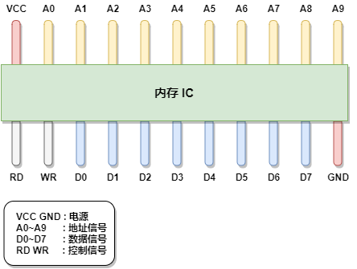

图中 VCC 和 GND 表示电源，A0~A9 是地址信号的引脚，D0~D7 表示的是控制信号、RD 和 WR 都是控制信号，将电源连接到 VCC 和 GND 后，就可以对其他引脚传递 0 和 1 的信号，大多数情况下，+5V 表示 1，0V 表示 0.

内存用来存储数据，图中的内存 IC，D0~D7 表示数据信号，那么一次可以输入输出 8bit=1byte 的数据。A0~A9 是地址信号共 10 个，表示可以指定 0000000000-1111111111 共 2 的 10 次方 = 1024 个地址。每个地址都会存放 1byte 的数据，因此得出内存 IC 的容量为 1KB。

如果我们使用 512MB 的内存，这相当于是 512000(512*1000) 个内存 IC，但正常时不可能有这么多个内存 IC 的。通常情况下，一个内存 IC 会由更多的引脚。

**为什么 32 位计算机内存最多是 4G**

32 位计算机的编号最大是 32 位，也就是 32 个 1 换成 16 进制为 FFFFFFFF，也就是说，32 位计算机内存寻址的最大范围是 FFFFFFFF+1

内存的单位是字节，那内存中能存储的信息最多为：FFFFFFFF+1 字节  即 4G，这也是为什么我们在一个 XP 的系统上面如果物理内存超过 4G 是没有意义的原因。

---

## 内存的读写过程

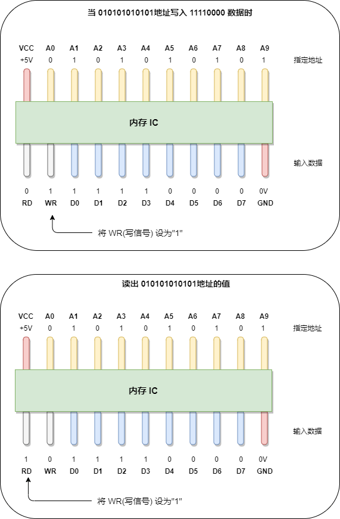

假设我们要向内存 IC 中写入 1byte 的数据的话，它的过程是这样的：
- 首先给 VCC 接通 +5V 的电源，给 GND 接通 0V 的电源，使用 A0~A9 来指定数据的存储场所，然后再把数据的值输入给 D0~D7 的数据信号，并把 WR(write) 的值置为 1，执行完这些操作后，即可以向内存 IC 写入数据。
- 读出数据时，只需要向 A0~A9 的地址信号指定数据的存储场所，然后再将 RD 的值置为 1 即可。
- RD 和 WR 又被称为控制信号。其中当 WR 和 RD 都为 0 时，无法进行写入和读取操作。

程序中的数据不仅只有数值，还有数据类型的概念，从内存上看，就是占用内存大小的意思。即使物理上强制以 1 个字节为单位来逐一读写数据的内存，在程序中，通过指定其数据类型，也能实现以特定字节数为单位进行读写。

例如,下列程序
```c
//定义变量
char a;
short b;
long c;

//变量赋值
a=123;
b=123;
c=123;
```

我们分别声明了三个变量 a,b,c，并给每个变量赋上了相同的 123，这 3 个变量表示内存的特定区域。通过变量，即使不指定物理地址，也可以直接完成读写操作，操作系统会自动为变量分配内存地址。

这 3 个变量分别表示 1 个字节长度的 char，2 个字节长度的 short，表示 4 个字节长度的 long，因此，虽然数据都表示的是 123，但是其存储时所占的内存大小是不一样的，如图。

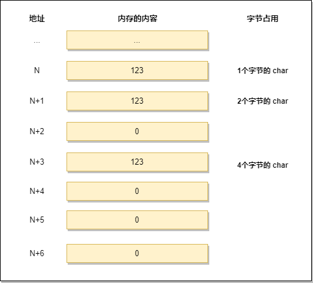

这里的 123 都没有超过每个类型的最大长度，所以 short 和 long 类型所占用的其他内存空间分配的数值是 0。这里我们采用的是低字节序列的方式存储。
- 低字节序列 : 将数据低位存储在内存低位地址。
- 高字节序列 : 将数据的高位存储在内存低位的方式称为高字节序列。

---

## 内存的使用

### 指针

指针是 C 语言中的重要特征，也是一种变量，它表示的不是数据的值，而是内存的地址，通过指针可以读任意内存地址的数据进行读写。

在定义指针时，变量名前面要加一个 `*` 号，例如:
```c
char *d; // char类型的指针 d 定义
short *e; // short类型的指针 e 定义
long *f; // long类型的指针 f 定义
```

以 32 位计算机为例，32 位计算机的内存地址是 4 字节，在这种情况下，指针的长度也是 32 位。但变量 d、e、f 却代表了不同的字节长度。

因为这些数据表示的是从内存中一次读取的字节数，比如 d e f 的值都为 100，那么使用 char 类型时就能够从内存中读写 1byte 的数据，使用 short 类型就能够从内存中读写 2 字节的数据，使用 long 就能够读写 4 字节的数据，如下表

| 类型 | 32位 | 64位 |
| - | - | - |
| char | 1 | 1 |
| short int | 2 | 2 |
| int | 4 | 4 |
| unsigned int | 4 | 4 |
| float | 4 | 4 |
| double | 8 | 8 |
| long | 4 | 8 |
| long long | 8 | 8 |
| unsigned long | 4 | 8 |

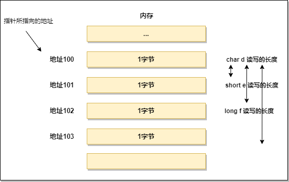

### 数组

数组是指多个相同的数据类型在内存中连续排列的一种形式。作为数组元素的各个数据会通过下标编号来区分，这个编号也叫做索引，如此一来，就可以对指定索引的元素进行读写操作。

这里用 char、short、long 三种元素定义数组，数组的元素用 \[value] 扩起来，里面的值代表的是数组的长度，如下:
```c
char g[100];
short h[100];
long i[100];
```
数组定义的数据类型，也表示一次能够读写的内存大小，char、short、long 分别以 1、2、4 个字节为例进行内存的读写。

数组是内存的实现，数组和内存的物理结构是完全一致的，尤其是在读写 1 个字节的时候，当字节数超过 1 时，只能通过逐个字节来读取，内存的读写过程如下图

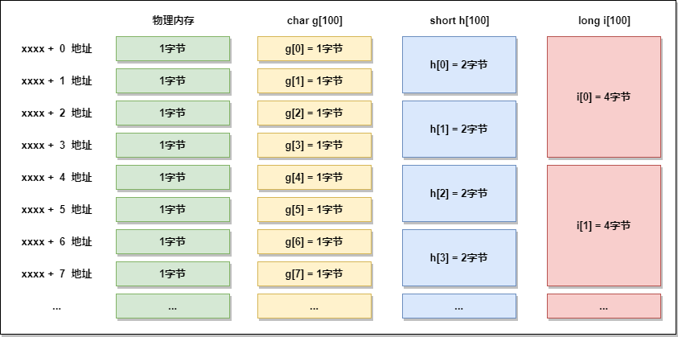

### 栈

栈(stack) 是一种很重要的数据结构，栈采用 LIFO(Last In First Out)即后入先出的方式对内存进行操作，最先放入的数据在栈的最下面，最后放入的数据在栈的最上面，如果要拿数据，要从栈顶开始取，否则无法去除最下面的数据。

栈的数据结构就是这样，你把数据压入栈的操作叫做入栈(push),你把数据从栈取出的操作叫做出栈(pop)，模型图如下:


入栈相当于是增加操作，出栈相当于是删除操作，只不过叫法不一样。栈和内存不同，它不需要指定元素的地址，使用类似如下
```c
//压入数据
Push(123);
Push(456);
Push(789);

//弹出数据
j=Pop();
k=Pop();
l=Pop();
```

在栈中，LIFO 方式表示栈的数组中所保存的最后面的数据会被最先读取出来.

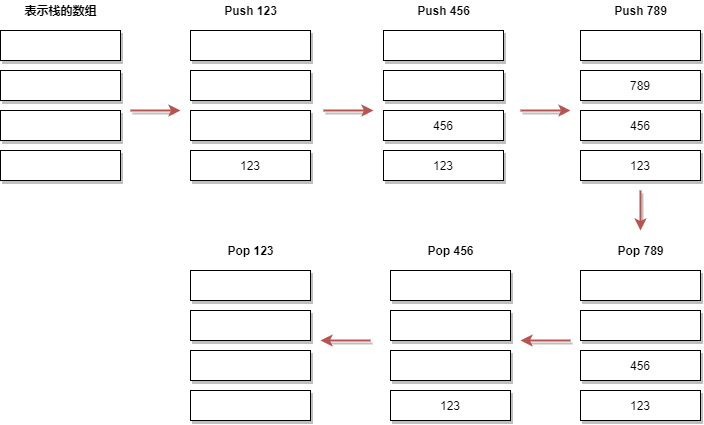

### 队列

**顺序队列**

队列和栈相似但又不同，队列也不需要指定元素的地址，但队列是 FIFO 即先入先出的数据结构。就像排队干饭,先到的人先干到饭，使用类似如下
```c
//往队列中写入数据
EnQueue(123);
EnQueue(456);
EnQueue(789);

//从队列中读出数据
m=DeQueue();
n=DeQueue();
o=DeQueue();
```

向队列中写入数据称为 EnQueue() 入列，从队列中读出数据称为 DeQueue()

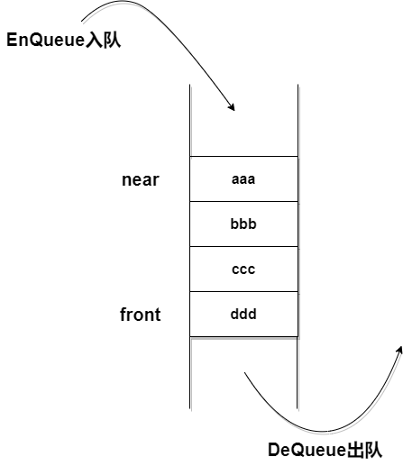

与栈相同，FIFO的方式表示队列中最先保存的数据会被优先读取。


**循环队列**

循环队列一般是以环状缓冲区(ring buffer)的方式实现的，它是一种用于表示一个固定尺寸、头尾相连的缓冲区的数据结构，适合缓存数据流。假如我们要用6个元素的数组来实现一个环形缓冲区，这时可以从起始位置开始有序的存储数据，然后按存储时的顺序把数据读出，在数组的末尾写入数据后，后一个数据就会从缓冲区的头部开始写。这样，数组的末尾和头部就连接起来了。

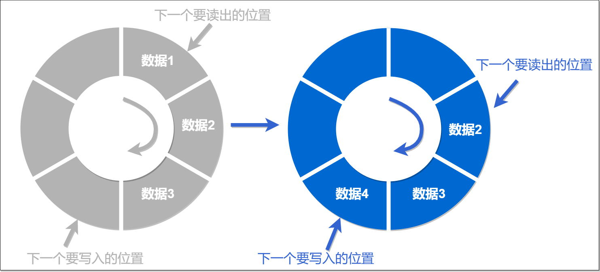

### 链表

通过使用链表，可以高效的对数据元素进行删除和添加操作。

在实现数组的基础上，除了数据的值之外，通过为其附带上下一个元素的索引，即可实现链表。数据的值和下一个元素的地址 (索引) 就构成了一个链表元素。

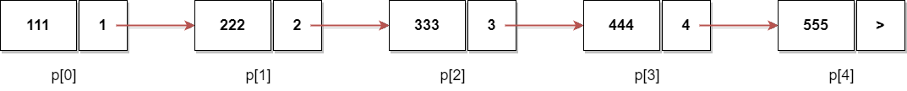

对链表的添加和删除都是非常高效的，如果要删除地址为 p\[2] 的元素，链表变化如下

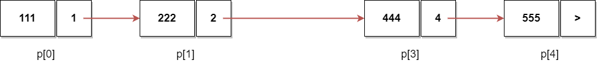

删除地址为 p\[2] 的元素后，直接将链表剔除，并把 p\[2] 前一个位置的元素 p\[1] 的指针域指向 p\[2] 下一个链表元素的数据区即可。

对于新添加进来的链表，需要确定插入位置，比如要在 p\[2] 和 p\[3] 之间插入地址为 p\[6] 的元素，需要将 p\[6] 的前一个位置 p\[2] 的指针域改为 p\[6] 的地址，然后将 p\[6] 的指针域改为 p\[3] 的地址即可。

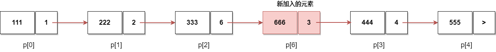

链表的添加不涉及数据的移动，所以链表的添加和删除很快，而数组的添加涉及到数据的移动，所以比较慢，通常用数组来检索数，使用链表来进行添加和删除操作。

### 二叉树

使用二叉树可以高效的对数据进行检索。

二叉树是一种检索效率非常高的数据结构，二叉树是指在链表的基础上往数组追加元素时，考虑到数组的大小关系，将其分为左右两个方向的表现形式，假如保存一个中间值，那么接下来要进行值的写入，就需要和中间值进行比较，确认大小，大的放右边，小的放左边。

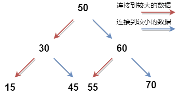

---

### 虚拟内存

计算机中的程序都需要通过内存运行，如果占用内存巨大就会耗尽内存，windows 系统使用虚拟内存技术，通过使用一部分硬盘空间当作内存使用，来确保程序耗尽内存也依然可以有存储空间，虚拟内存在硬盘上的存在形式就是 pagefile.sys 页面文件。

虚拟内存是内存和磁盘交互的第二个媒介，虚拟内存是指把磁盘的一部分作为假象内存使用。是内存管理技术的一种，它使得应用程序认为它拥有连续可用的内存 (一个完整的地址空间)，实际上，它通常被分割成多个物理碎片，还有部分存储在外部磁盘管理器上，必要时进行数据交换。

通过借助虚拟内存，在内存不足时依然可以运行程序，例如只剩 5MB 内存空间的情况下运行 10MB 程序，由于 CPU 只能执行加载到内存中的程序，因此，虚拟内存的空间就需要和内存中的空间进行置换 (swap)，然后运行程序。

**虚拟内存与内存的交换方式**

虚拟内存的方法有分页式和分段式两种。windows 采用的是分页式。该方式指在不考虑程序构造的情况下，把运行的程序按照一定大小的页进行分割，并以页为单位进行置换。在分页式中，我们把磁盘的内存读到内存中称为 Page In，把内存的内容写入磁盘称为 Page Out.Windows 计算机的页大小为 4KB，所以要把应用程序按照 4KB 的页来划分，以页为单位放到磁盘进行 swap.

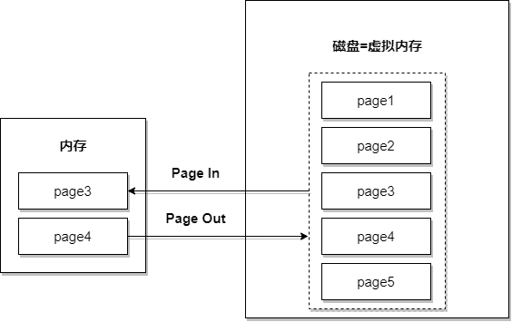

为实现内存功能，windows 在磁盘上提供了虚拟内存使用的分页文件，该文件由 window 生成和管理，大小一般是内存的 1~2 倍。

---

### 节约内存

windows 使用虚拟内存可以一定程度上解决内存不足的问题，但治标不治本，性能上的损失很大。所以一些优化应用程序的技术也非常关键

**通过 DLL 实现函数共有**

DLL(Dynamic Link Library, 动态链接库) 文件在程序运行时可以动态加载 Library 文件，多个应用可以共有同一个 DLL 文件，进而节约内存使用。

例如，编写一个具有某些处理功能的函数 Func(), 应用 A 和 B 都使用这个函数，然后再各自应用中内置 Func() 后同时运行，那么内存中就存在了 Func() 两次。而DLL文件内容可以在运行时被多个应用共有，因此内存中存在 Func() 的程序只有一个。

Windows 系统包含大量的 DLL 文件，有些应用在安装时，DLL 文件也会被追加，应用程序通过这些 DLL 文件运行，节约内存，有些应用更新时，甚至仅更新 DLL 文件。

**通过调用_stdcall 来减少程序文件的大小**

_stdcall 是 standard call(标准调用) 的缩写。windows 提供的 DLL 文件内的函数，基本上都是通过 _stdcall 调用方式完成的，主要可以节约内存。

C 语言特有的调用方法称为 C 调用，默认编写的程序不使用 _stdcall，因为 C 语言所对应的函数传入参数是可变的，只有函数调用方才能知道到底有多少个参数，在这种情况下，栈的清理作业无法进行，不过当函数的参数和数量固定时，指定 _stdcall 是没有任何问题的。

C语言中，调用完函数后，需要人为执行栈清理指令，把不需要的数据从接收和传递函数的参数时使用的内存上的栈区域中清理出去的操作叫做栈清理处理。例如
```c
//函数调用方
void main(){
    int a;
    a=Func(123,456);
}

//被调用方
int Func(int a,int b){
    ...
}
```

代码中，从 main 主函数调用到 Func() 方法，按照默认的设定，栈的清理处理会附加在 main 主函数这一方，在同一个程序中，有可能会多次调用，导致 Func() 进行多次清理，这会造成内存的浪费。

汇编之后的代码如下
```c
push 1C8h                       // 将参数 456(=1C8h)存入栈中
push 7Bh                        // 将参数 123(=7Bh)存入栈中
call @LTD+15 (Func)(00401014)   // 调用 Func 函数
add esp,8                       // 运行栈清理
```

C 语言通过栈来传递函数的参数，使用 push 是往栈中存入数据的指令，pop 是从栈中取出数据的指令。32 位 CPU 中，1 次 push 指令可以存储 4 个字节 (32 位) 的数据。上述代码进行了两次 push，存储了 8 个字节的数据，通过 call 指令调用函数，调用完毕后，栈中存储的数据就不需要了，通过 add esp,8 这个指令，使存储着栈数据的 esp 寄存器前进 8 位(设定为指向高 8 位的地址)，进行数据清理，由于栈在各种情况下都需要使用，因此使用完毕后需要恢复到原始状态，上述操作就是指向栈的清理工作，在 C 语言中，函数的返回值，是通过寄存器而非栈来返回的。

栈执行清理工作，在调用方法处执行清理工作和在反复调用方法处执行清理工作不同，使用 _stdcall 标准调用的方法称为反复调用方法, 在这种情况下执行栈清理开销比较小。

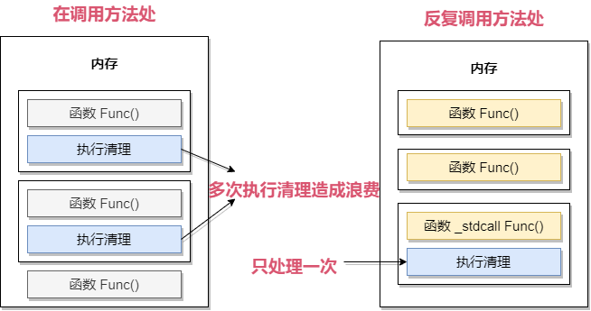

不同方式的调用，清理方式也不同。

---

## 地址空间(Address Space)

CPU 处理器要在执行指令并访问存储与内中的数据，它必须为要访问的数制定一个唯一性地址。地址空间指的就是一组大量的有效地址，可用于去识别存储与有限的内存分配空间中的数据。一个正在运行的程序可以访问的单个连续的地址空间一般称为线性地址空间。基于内存模型及采用的分页模式，我们有时将其称为线性地址，有时称为虚拟地址。通常我们使用物理地址空间来特指处理器请求访问物理内存的地址。这些地址是通过将线性地址转化为物理地址来获得。

---

## 内存分页(Paging)

从抽象意义上来讲页是一个具有固定尺寸的窗口，从逻辑意义上来讲页是具有固定大小的一组连续线性地址的集合。

分页可以将线性地址空间进行虚拟化。它创建了一个执行环境，大量线性地址空间通过用适量的物理内存和磁盘存储进行模拟。每一个 32 位的线性地址空间被分为固定长度的片段，称为页 (Page)，页可以任何顺序将线性地址空间映射为物理内存。当程序尝试访问线性地址时，这样的映射使用了驻留内存的页目录(Page Directory) 及页表 (Page Table) 来实现。

一个页的大小可以指定为 4KB(212=4KB) 的任意倍数，这根据不同的体系结构或操作系统的设置而定，而 x86 架构下的 Windows/Linux 均采用 4KB 大小的分页方式，这就说明 32 位线性地址中必定存在一个 12 位的指示页内偏移量的域。

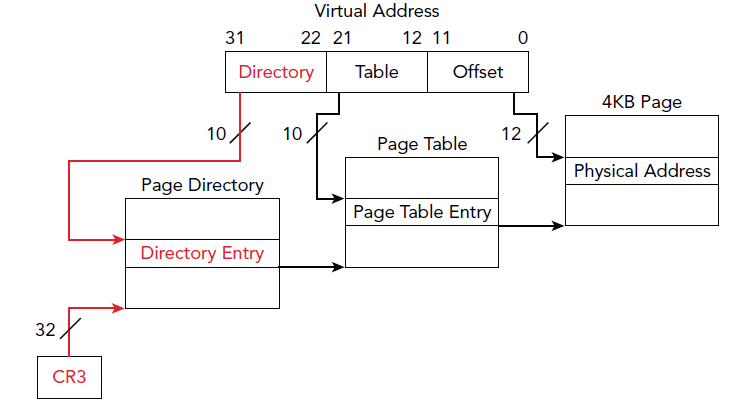

**物理地址扩展**

Intel 公司的 32 位架构的内存分页机制支持物理地址扩展(Physical Address Extension ，简称 PAE), 该扩展支持允许处理器支持超过 4GB 的物理地址空间。

程序虽然仍只能拥有最高 4GB 的线性地址空间，但是内存管理单元可以将那些地址映射为扩展后的 64GB 物理地址空间。对于支持 PAE 功能的系统，线性地址分为四个索引：
- 页目录指针表 (Page directory pointer table, 简称 PDPT)
- 页目录 (Page directory，简称 PD)
- 页表 (Page table，简称 PT)
- 页偏移 (Page offset)

---

## 物理内存中数据的价值

计算机终端及移动终端均使用了 RAM 易失性存储，主要用于数据交换、临时存储等用途。操作系统及各种应用软件均经常需要与物理内存进行数据交互，此外由于内存空间有限，因此计算机系统还可能将内存中的数据缓存到磁盘中，如 pagefile.sys(页交换文件)及 hiberfil.sys(休眠文件)。

内存中有大量的各类数据，结构化及非结构化数据。通过对物理内存镜像可以提取出有价值的数据。常见有价值的数据，包含以下内容：
- 进程列表 (包括恶意程序进程、Rootkit 隐藏进程等)
- 动态链接库 (当前系统或程序加载的动态链接库)
- 打开文件列表 (当前系统打开的文件列表)
- 网络连接 (当前活动的网络连接)
- $MFT 记录 (常驻文件均可以直接提取恢复)
- 注册表 (部分注册表信息，包括系统注册表和用户注册表文件)
- 加密密钥或密码 (如 Windows 账户密码 Hash、BitLocker/SafeBoot/PGP/ TrueCrypt/VeraCrypt 等全盘加密或加密容器的恢复密钥等)
- 聊天记录 (如 QQ 聊天记录片段)
- 互联网访问 (上网记录 URL 地址、网页缓存及 InPrivate 隐私模式访问数据等)
- 电子邮件 (如网页邮件缓存页面)
- 图片及文档等 (尚未保存到磁盘中的图片、文档等文件)

**页交换文件(Pagefile.sys)**

除了使用物理内存 RAM 用于数据交换，Windows 为了能正常工作还使用了各种各样的文件。从 Windows 95 开始，Windows 开始引入了页交换文件 (Pagefile.sys) 来协助内存数据的交换。 Pagefile.sys 是磁盘中的一个文件，它用于将操作系统中的活动数据临时性地进行存储，在必要的情况下，Windows 可将 Pagefile.sys 文件的中数据移动到物理内存中或从内存中将数据移到该文件中，实现数据的临时交换或缓存。从 Pagefile.sys 中获得的数据通常是当前活动的相关信息，也通常与调查相关性较高。

Windows 操作系统最多支持 16 个页交换文件。启用物理地址扩展功能 (PAE) 的 Windows 32 位和 64 位系统的最大页交换文件大小为 16TB。64 位的安腾架构(Itanium)的系统的页交换文件可以支持高达 32TB。 页交换文件大小的默认值为计算机物理内存大小的 1.5 至 3 倍。

Pagefile.sys 用于存储从物理内存中转移过来的数据。 要获得一个正在运行的系统的活动全貌或快照，我们通常除了分析物理内存，还需要分析 pagefile.sys。 部分工具支持同时将物理内存和 pagefile.sys 进行检查分析。通常 pagefile.sys 文件放置于操作系统所在分区，当然用户也完全可能修改高级设置或注册表调整 pagefile.sys 的存储位置。

从 Windows 7 操作系统版本开始，Windows 系统开始支持页交换文件 pagefile.sys 的加密。

启用页交换文件加密

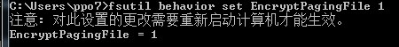

查询页交换文件加密状态

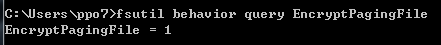

**休眠文件(HiberFil.sys)**

Hiberfil.sys 是当系统休眠时，Windows 将物理内存的数据写入到磁盘生成的一个文件。当系统进入休眠状态后，网络连接将会中断。 当系统重新加电时，hiberfil.sys 文件中的数据重新回写到物理内存中，这也使得从休眠状态恢复到原始状态变得相当快。

休眠文件包含了标准的头部 (PO_MEMORY_IMAGE)，包含了内核上下文与寄存器的相关信息及压缩的数据块。该文件采用了 Xpress 算法(带霍夫曼 Huffman 及 LZ 编码)。 文件头部通常包含了“hibr”、“HIBR”、“wake” 或“WAKE”等特征。 操作系统从休眠状态恢复后，头部就被清零了。清零后的文件头可能导致一些取证软件无法分析该文件。

通过分析 hiberfil.sys 文件的修改时间戳信息，我们可以了解到该系统最后一次休眠的时间。系统中的休眠文件 hiberfil.sys 只有一个。当系统重新休眠时，当前物理内存中的内容将会覆盖原有文件的数据。 要对 hiberfil.sys 进行分析，要求取证工具可以将休眠文件中的数据进行解压为原生数据并进行数据解析。Mattieu Suiche 的 Windows Memory Toolkit 工具 hibr2bin.exe 支持将休眠文件转为原生转储文件。

当取证人员在现场要制作 Windows 操作系统的物理内存镜像时，可能由于内存镜像工具不兼容操作系统导致无法获取物理内存数据。当无法成功制作物理内存镜像时，还可以让系统进入休眠模式，从而用变通的方式获得物理内存中的数据。

要进入休眠模式，首先要让系统启用休眠模式支持。Windows 8 及以上版本的操作系统，默认启用休眠模式支持。取证人员也可以管理员权限进入命令行模式，并输入 powercfg.exe /hibernate ON 来启用休眠模式支持。要让操作系统进入休眠模式，需要输入 shutdown /h .

Vista 以上操作系统在原有支持休眠模式 (Hibernate Mode) 的基础上增加了睡眠模式(Sleep Mode)。睡眠模式状态下，操作系统使用极少的电量保证内存可以继续工作，一旦系统电量不足，系统将保存所有内存数据到磁盘并关闭计算机。而休眠模式状态下，系统关闭，将内存中的数据写入休眠文件 hiberfil.sys 中。

在默认的 Windows 开始菜单中的 “电源” 找不到 “休眠”，可以通过按 Win+X 键，选择“控制面板”，找到“硬件和声音”->“电源选项”->“选择电源按钮的功能”，选择“更改当前不可用的设置”, 在“关机设置” 下将 “休眠” 选项勾选。后续在开始菜单选择 “电源” 即可直接看到 “休眠” 选项。

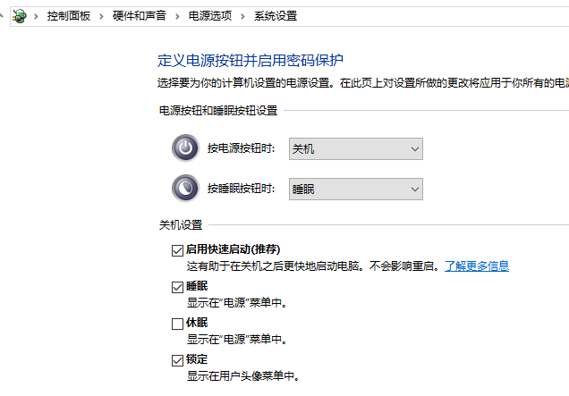

---

## Windows 内存管理

- 内容见 [Windows内存管理笔记](../../Integrated/Windows/笔记/内存管理.md)
