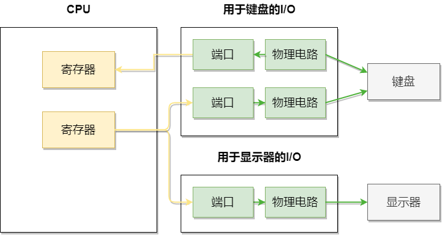
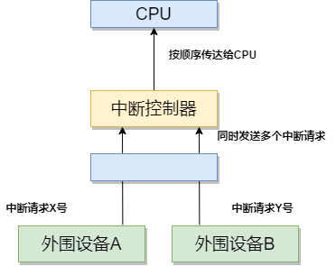
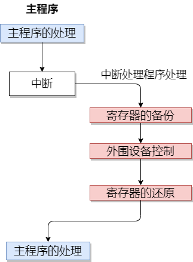
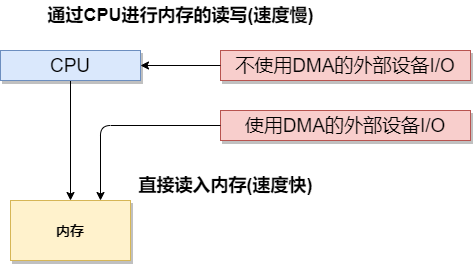
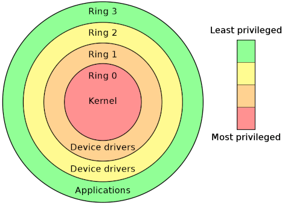

# 操作系统

> 注 : 笔记中拓扑图 drawio 源文件在其图片目录下

---

## API 差异性

应用程序必须根据不同的操作系统类似专门开发，cpu 的类型不同，所对应机器的语言也不同，同样，操作系统不同，应用程序向操作系统传递指令的途径也不同。

应用程序向系统传递指令的途径称为 API。windows 以及 linux 的 API 提供了应用程序可以利用的函数组合。不同的操作系统的 API 是不同的，要将应用程序移植到不同的操作系统，必须要覆盖所用到的 API 部分。

比如键鼠输入、屏幕显示、文件写入等等同外围设备交互的功能都使用 API 实现。

当然有些应用可以通过虚拟机实现多操作系统运行，如 JAVA，java 的源代码编译后生成的不是特定 CPU 使用的本地代码，而是字节码，运行在 JAVA 虚拟机中，java 虚拟机将字节码转换为本地代码执行。

---

## 特征

### windows

windows 有两个版本: 32 位和 64 位

**32 位操作系统**

这里的 32 位表示的是处理效率最高的数据大小，windows 处理数据的基本单位是 32 位。这与一开始在 MS-DOS 等 16 位操作系统不同，因为在 16 位操作系统中处理 32 位数据需要两次，所以一般在 windows 上的应用，最高能处理的数据都是 32 位的。

例如，用 C 语言处理整数数据时，有 8 位的 char 类型，16 位的 short 类型，以及 32 位的 long 类型三种，使用 long 进行处理，会增加内存和磁盘的开销，对性能影响不大。

**通过 API 函数集来提供系统调用**

windows 通过 API 函数集来提供系统调用，API 是联系应用程序和操作系统之间的接口。

当前主流的 32 位 windows API 也称为 Win32 API，当然也有 win16 API 和 Win64 API

API 通过多个 DLL 文件提供，各个 API 的实体都是使用 C 语言编写的函数，所以在 C 环境下，使用 API 更容易，如 API 所用的 MessageBox() 函数就保存在 user32.dll 这个文件中。

**GUI 用户界面**

GUI指图形化用户界面。

**通过 WYSIWYG 实现打印输出**

WYSIWYG 指显示器上输出的内容可以直接通过打印机输出。

**多任务**

windows 通过时钟分割来实现多任务功能，时钟分割指短时间间隔内，多个程序切换运行的方式，在用户看来，像是多个程序在同时运行，其底层是 CPU 时间切片，这也是多线程多任务的核心。

**windowsAPI**

windows 开放了系统调用功能来实现对硬件的控制，在 windows 中，系统调用称为 API,API 就是应用调用的函数，这些函数的实体被存放在 DLL 文件中.

例如加入要在窗口中显示字符串, 就可以使用 windowsAPI 中的 TextOut 函数
```
BOOL TextOut{
    HDC hdc,            // 设备描述表的句柄
    int nXstart,        // 显示字符串的x坐标
    int nYstart,        // 显示字符串的y坐标
    LPCTSTR lpString,   // 指向字符串的指针
    int cbString        // 字符串的文字数
}
```

**IN 指令和 OUT 指令**

windows 控制硬件借助的是输入和输出指令，比较有代表性的就是 IN 和 OUT，这些指令也是汇编的助记符。

IN 指令通过指定的端口号输入数据, OUT 指令则是通过 CPU 寄存器中存储的数据输出到指定端口号的端口。

I/O 控制器中有用于临时保存输入输出数据的内存, 这个内存就是端口，IO 控制器内部的内存，也被称为寄存器，和 CPU 中的不一样，CPU 里的用于进行数据运行，IO 里的用于存数据。

在 I/O 设备内部的 IC 中，有多个端口，由于计算机连接多个设备，因此也有很多 I/O 控制器，一个 I/O 控制器可以控制多个设备，各端口通过端口号进行区分。

端口号也叫做 I/O 地址，IN 和 OUT 指令在端口号指定的端口和 CPU 之间进行数据的输入和输出。



**IRQ**

IRQ 代表中断请求, IRQ 用来暂停当前运行的程序, 并跳转到其他程序运行的必要机制, 该机制被称为中断处理。

从中断处理开始到请求中断的程序运行结束之前, 被中断的程序的处理是停止的, 这种情况就类似于在处理文档的过程中有电话打来, 电话就是中断处理。

实施中断请求的是连接外围设备的 I/O 控制器, 负责实施中断处理的是 CPU，外围设备的中断请求会使用不同于 I/O 端口的其他编号, 该编号称为中断编号, 在控制面板查看驱动器属性时，IRQ 处显示的数值是 06，表示用 06 来识别驱动器发出的请求,

假如有多个外围设备进行中断请求的话，cpu 需要做出选择进行处理，为此，可以在 I/O 控制器和 CPU 中间加入名为中断控制器的 IC 来进行缓存。中断控制器会把多个外围设备发出的中断请求有序的传递给 CPU，中断控制器的功能相当于缓冲.



CPU 在接收到中断请求后, 会把当前正在运行的任务中断，并切换到中断处理程序, 中断处理程序的第一步处理就是把 CPU 所有寄存器的数值保存到内存的栈中，在中断处理程序中完成外围设备的输入和输出后，把栈中保存的数值还原到 CPU 寄存器中，然后继续进行主程序的处理。

如果 CPU 寄存器的数值还没有还原的话，就会影响到主程序的运行，甚至还可能使程序意外停止或发生运行时异常，这是因为主程序在运行过程中，会用到 CPU 寄存器进行处理，如果突然插入其他程序的运行结果，那么必定会收到影响，所以在处理完中断请求后，各个寄存器的值必须要还原，只要寄存器的值不变，主程序就可以继续处理。



**DMA**

DMA 指不通过 CPU 的情况下，外围设备直接和主存进行数据传输。硬盘等硬件设备都用到了 DMA 机制，通过 DMA，大量数据可以在短时间内实现传输。



I/O 端口号、IRQ、DMA 通道是识别外围设备的组合，但 IRQ 和 DMA 通道不是所有外围设备都具备的，I/O 端口所有外围设备都具备，IRQ 只对需要中断处理的外围设备来说是必须的，DMA 通道只对需要 DMA 机制的外围设备来说是必须的，假如多个外围设备都设定成相同端口号、IRQ 和 DMA 通道，计算机会无法工作，会显示设备冲突。

**VRAM**

显示器中的信息一直存储在内存中，该内存称为 VRAM(video RAM)，在程序中，只要向 VRAM 中写入数据，该数据就会在显示器中显示出来，实现该功能的程序，是由操作系统或 BIOS 提供的，并借由中断来进行处理。

**体系结构**

x86 处理器具有 4 个特权级别（称为 rings），用于控制对内存和 CPU 操作的访问。它们的范围从最特权的 Ring 0 到 Ring 3



Windows 仅支持 Rings 0 和 3，分别被分别称为内核和用户模式。 大多数用户活动将发生在 Ring 3 中，但是在调用各种 AP​​I 时应用程序可能会进入 Ring 0 中 - 例如在访问文件系统时需要这样做。
