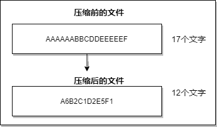
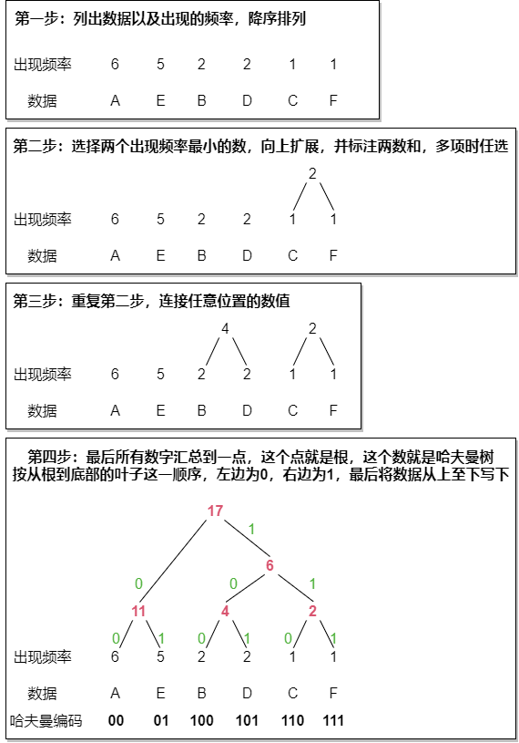

# 算法

> 注 : 笔记中拓扑图 drawio 源文件在其图片目录下

---

## REL算法

例如对 AAAAAABBCDDEEEEEF 这个值进行压缩，就是对相同的字符去重化，以字符*重复次数的方式进行压缩。

这种把文件用数据*重复次数的形式来表示的压缩方法称为 RLE(Run Length Encoding,行程长度编码)算法。

RLE算法只针对连续的字节序列压缩效果比较好，假如是不连续的压缩的容量会比之前还要大。

---

## 哈夫曼算法

哈夫曼算法指，为各压缩对象文件分别构造最佳的编码体系，并以该编码体系为基础进行压缩，因此，用什么样的编码对数据进行分割，就要由各个文件而定。用哈夫曼算法压缩过的文件种，存储着哈夫曼编码信息和压缩过的数据。

借助哈夫曼树的构造编码体系，即使不使用字符区分符号的情况下，也可以构架明确区分的编码体系。

例如对 AAAAAABBCDDEEEEEF 这个值进行压缩

使用哈夫曼数后，出现频率越高的数据所占用的位数越少，枝条连接数据时，我们是从出现频率较低的数据开始的，这意味着出现频率低的数据到达根部的纸条也越多，而纸条多则代表编码的位数增加。
