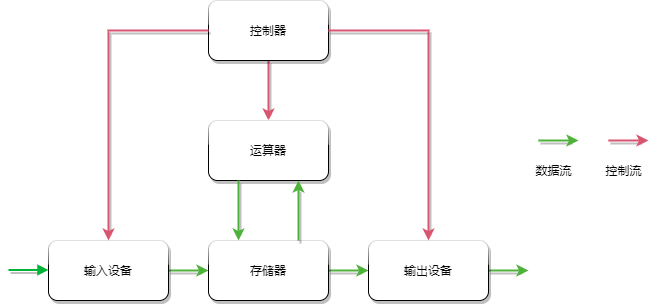
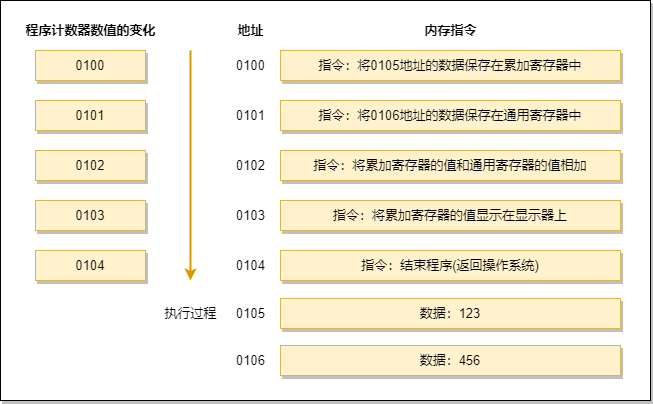
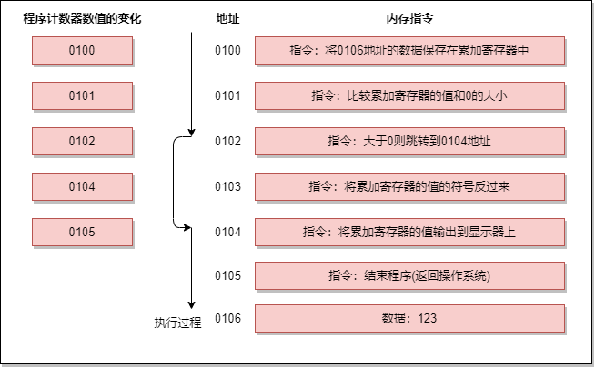
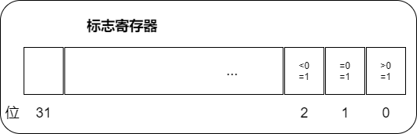
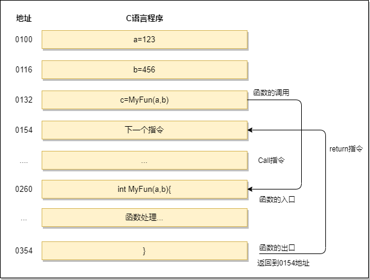
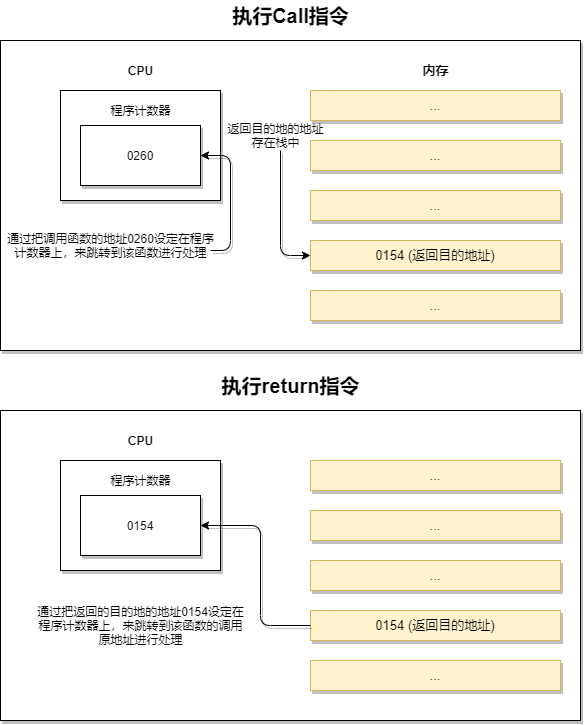
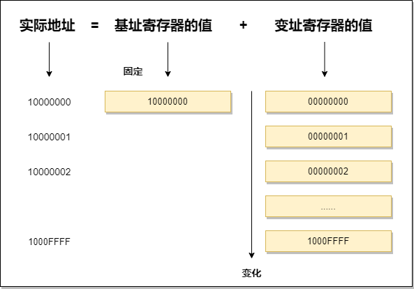
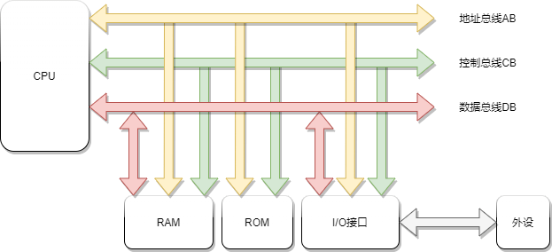
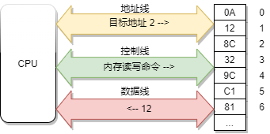
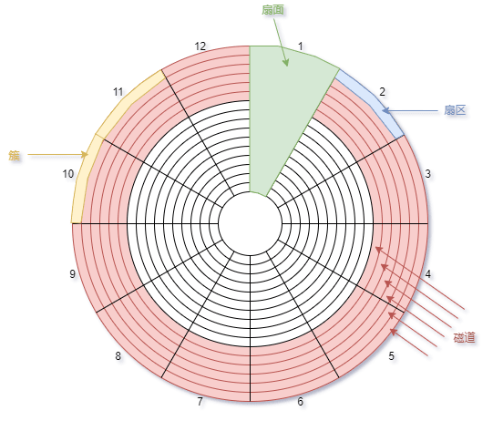

# 计算机组成

> 注 : 笔记中拓扑图 drawio 源文件在其图片目录下

---

# 计算机工作流程

- 存储器：用于存储数据并在需要时提供数据
    - 外部存储器：硬盘、光盘等等
    - 内部存取器：
        - RAM：内存条
        - ROM：BIOS 芯片

- CPU
    - 运算器 ：对数据进行各种算术运算和逻辑运算，即对数据进行加工处理
    - 控制器 ：完成协调和指挥整个计算机系统的操作

---

## CPU

CPU 的核心是从程序或应用程序获取指令并执行计算。此过程可以分为三个关键阶段：提取，解码和执行。

CPU 从系统的 RAM 中提取指令，然后解码该指令的实际内容，然后再由 CPU 的相关部分执行该指令。

在 CPU 的结构中，需要尽量了解寄存器，因为程序是把寄存器作为对象来描述的。

**程序计数器**

程序计数器(Program Counter)是用来存储下一条指令所在单元的地址。

程序执行时 PC 的初值为程序第一条指令的地址，在顺序执行程序时，控制器首先按程序计数器所指出的指令地址从内存中取出一条指令，然后分析和执行该指令，同时将PC的值加1指向下一条要执行的指令。

这是一段进行相加的操作，程序启动，在经过编译解析后会由操作系统把硬盘中的程序复制到内存中，示例中是将 123 和 456 进行相加并将结果输出到显示器上。

实际上每个指令和数据都可能分布在不同的地址上，地址 0100 是程序运行的起始位置。windows 等操作系统把程序从硬盘复制到内存后，会将程序计数器作为设定为起始位置 0100，然后执行程序，每执行一条指令后，程序计数器的数据会增加 1(或者直接指向下一条指令的地址)，然后，CPU 根据程序计数器的数值，从内存中读取命令并执行，程序计数器控制着程序的流程。

**条件分支和循环机制**

高级语言中的条件控制流程主要分为三种：顺序执行、条件分支、循环判断三种，
- 顺序执行时按照地址的内容顺序的执行指令。
- 条件分支是根据条件执行任意地址的指令。
- 循环是重复执行同一地址的指令。

程序的开始过程和顺序流程是一样的，CPU 从 0100 处开始执行命令，在 0100 和 0101 都是顺序执行，PC 的值顺序 + 1，执行到 0102 地址的指令时，判断 0106 的寄存器的数值大于 0，跳转 (jump) 到 0104 地址的指令，将数值输出到显示器中，然后结束程序，0103 的指令被跳过了，这就和我们程序中的 if() 判断是一样的，在不满足条件的情况下，指令会直接跳过。所以 PC 的执行过程也就没有直接 + 1, 而是下一条指令的地址。

**标志寄存器**

条件和循环分支会使用到 jump(跳转指令)，会根据当前的指令来判断是否跳转，上面我们提到了标志寄存器，无论当前累加寄存器的运算结果是正数、负数还是零，标志寄存器都会将其保存 (也负责溢出和奇偶校验)
- 溢出 (overflow): 指运算的结果超过了寄存器的长度范围
- 奇偶校验 (parity check): 指检查运算结果的值是偶数还是奇数

CPU 在进行运算时，标志寄存器的数值会根据当前运算的结果自动设定，运算结果的正、负和零三种状态由标志寄存器的三个位表示。标志寄存器的第一个字节位、第二个字节位、第三个字节位各自的结果都为 1 时，分别代表正数、零和负数。

假设累加寄存器中存储的值 X 和通用寄存器中存储的值 Y 做比较，CPU 会通过减法来进行比较。而无论减法的结果是正数、零还是负数，都会保存到标志寄存器中。结果为正表示 X 比 Y 大，结果为 0 表示 X 和 Y 相等，结果为负表示 X 小于 Y，所以程序的比较指令，在 CPU 内部是做减法运算。

**函数调用机制**

函数调用处理通过把程序计数器的值设定成函数的存储地址来实现的。函数执行跳转指令后，必须进行返回处理，单纯的指令跳转没有意义。

上图中将变量 a、b 分别赋值为 123 和 456，然后调用 MyFun(a,b) 方法，进行指令跳转。图中的地址是将 C 语言编译成机器语言后运行时的地址，由于 1 行 C 程序在编译后通常会变为多行机器语言，所以图中的地址是分散的。在执行完 MyFun(a,b) 指令后，程序会返回到 MyFun(a,b) 的下一条指令，CPU 继续执行下面的指令。

函数的调用和返回很重要的两个指令是 call 和 return 指令，再将函数的入口地址设定到程序计数器之前，call 指令会把调用函数后要执行的指令地址存储在名为栈的主存内。函数处理完毕后，再通过函数的出口来执行 return 指令。return 指令的功能是把保存在栈中的地址设定到程序计数器。MyFun 函数在被调用之前，0154 地址保存在栈中，MyFun 函数处理完成后，会把 0154 的地址保存在程序计数器中。

在一些高级语言的条件或循环语句中，函数调用的处理会转换成 Call 指令，函数结束后的处理会转换成 return 指令

**通过地址或索引实现数组**

通过基址寄存器和变址寄存器，我们可以对主存上的特定区域进行划分，来实现类似数组的操作。

例如，用十六进制将内存中的 00000000-FFFFFFFF 的地址划分出来，那么，凡是该范围的内存地址，只要有一个 32 位的寄存器，便可查看全部地址。但如果要像数组那样分割特定的内存区域以达到连续查看的目的，使用两个寄存器会更加方便。

例如，通过两个寄存器来表示内存的值

数组是指同样长度的数据在内存中进行连续排列的数据构造。用数组名表示数组全部的值，通过索引来区分数组的各个数据元素，例如: a\[0]-a\[4],\[ ] 内的 0-4 就是数组的下标。

### CPU指令执行过程

- 取指令 : 将内存中的指令读取到 CPU 中寄存器的过程，程序寄存器用于存储下一条指令所在的地址。
- 指令译码 : 在取指令完成后，立马进入指令译码阶段，在指令译码阶段，指令译码器按照预定的指令格式，对取回的指令进行拆分和解释，识别区分不同的指令类别以及各种获取操作数的方法。
- 执行指令 : 译码完成后，需要执行这一指令，此阶段是完成指令所规定的各种操作，具体实现指令的功能。
- 访问取数 : 根据指令的需要，有可能需要从内存中提取数据，此阶段根据指令地址码，得到操作数在主存中的地址，并从主存中读取该操作数用于运算。
- 结果写回 : 最后一阶段，把执行指令阶段的运行结果数据 "写回" 到某种存储形式: 结果数据经常被写到 CPU 的内部寄存器中，以便被后续的指令快速的存取。

---

## 内存

- 内容见 [内存](./内存.md)

---

## 存储器

磁盘和内存都具有存储功能，但内存通过电流来实现存储，磁盘通过磁记录技术实现。

内存断电后数据消失，而磁盘中的数据可以长存，内存属于内部存储设备，硬盘属于外部存储设备，两者结合使用。

### 存储单位

8bits=1Bytes 简称 8B 1 比特
- Byte = 8 bit
- Word = 2 Byte = 16 bit
- Dword = 4 Byte = 32 bit
- KB = 1048B(Byte)
- MB = 1024KB
- GB = 1024MB
- TB = 1024GB

买硬盘时,看到标 500G,但实际只有 466G,正常,原因是制作商使用 10 进制单位,500G 代表 500\*1000\*1000\*1000Byte=466GB.

因为硬盘的最小物理量为 512Bytes,最小的组成单位为扇区( sector ),通常计算硬盘容量是看有多少个 sector,所以才用十进制处理,

**位 (bit)**

来自英文 bit, 音译为 "比特", 表示二进制位.

位是计算机内部数据储存的最小单位,是一个二进制位。

**字节 (byte)**

字节来自英文 Byte, 音译为 "拜特", 习惯上用大写的 "B" 表示.

字节是计算机中数据处理的基本单位.

计算机中以字节为单位存储和解释信息, 规定一个字节由八个二进制位构成, 即 1 个字节等于 8 个比特 (1Byte=8bit) .

用字节处理数据时，如果数字小于存储数据的字节数，那么高位用 0 填补，高位和数学中的表示一样，左侧表示高位，右侧表示低位。例如 100111 只有 6 位，高位需要用 0 填充，填充后是 00100111，占一个字节，如果用 16 位表示就是 0000 0000 0010 0111 占两个字节

一般称 32 位和 64 位计算机指的就是处理位数，32 位一次可以表示 4 个字节，64 位一次可以表示 8 个字节的二进制数。

**字**

计算机进行数据处理时, 一次存取、加工和传送的数据长度称为字 (word) . 一个字通常由一个或多个 (一般是字节的整数位) 字节构成. 例如 286 微机的字由 2 个字节组成, 它的字长为 16;486 微机的字由 4 个字节组成, 它的字长为 32 位机.

- WORD 字 16BIT 2字节
- DWORD 双字 32BIT 4字节

---

### 存储单元

存储器被划分成了若干个存储单元，一个存储单元可以存储一个字节，也就是 8 个二进制位，每个存储单元是从 0 开始顺序编号。

对于一个有 128 个存储单元的存储器
- 容量为 128 字节
- 编号为 0~127

每个单元由两部分构成
- 一个是单存储元的内容,用十六进制表示
- 一个是存储单元的地址,用十六进制表示

---

### 总线

CPU 对存储器的读写通过 3 种总线完成.
- 地址总线
- 数据总线
- 控制总线

CPU从编号为2的地址中读取内容，通过控制总线发出读写命令，地址总线确认地址为3，找到后，数据总线传输内容为 12

**地址总线**

地址总线的宽度决定了 CPU 的寻址能力

一个 CPU 有 N 根地址线，则可以说这个 CPU 的地址总线的宽度为 N。这样的 CPU 最多可以寻找 2 的 N 次方个内存单元 (字节)

例如: Intel 8086 是 20根，则寻址能力为 2^20 次方个内存单元(字节) 即 1048576=1M

**数据总线**

数据总线的宽度决定了 CPU 与其他器件进行传送时一次数据传输的容量

一根数据总线可以传输一个 0 或 1, 即 1bit

例如: Intel 8086 是 16根，则一次可以传输的数据为 2B

**控制总线**

控制总线的宽度决定了 CPU 对系统种其他器件的控制能力

---

### 磁盘缓存

每次内存都需要从磁盘中读取数据，必然会读到相同的内容，所以一定会由一个角色负责存储常用的内容，这种称为缓存技术，磁盘缓存指把从磁盘中读出的数据存储到内存的方式，这样一来，当接下来需要读取相同的内容时，就不会再通过实际的磁盘，而是通过磁盘缓存读取。

windows操作系统提供了磁盘缓存技术，但对大多数用户来讲是感受不到磁盘缓存的，并随着技术演进，磁盘缓存实际的使用也越来越少。

---

### 文件系统

**ext4**

ext4 是目前 Debian/Ubuntu/Mint 的默认文件系统，比较常见，它其实是第 4 代扩展文件系统 (Fourth extended filesystem), 是 ext3 的延续。
- ext4 对大文件有着比较好的支持，最大支持 1 EiB 的卷，标准 4Kib 块大小下支持单文件最大 16 TiB
- Extents
- ext4 兼容 ext3, ext2
- ext4 允许对一些文件预留空间 (Persistent pre-allocation)
- Delayed allocation
- 无限制的子目录，Linux 4.12 及以后 largedir 功能使用 3 级 HTree，允许在单目录下拥有大约 6 百万条目
- ext4 使用日志校验和来提高稳定性
- ext4 使用纳秒来管理 timestamp
- Linux kernel 4.1 后加入了透明加密
- ext4 支持默认写屏障，确保了即使写时断电，文件的元信息可以正确写入磁盘

**ZFS**

ZFS 是由 Sun Microsystems 设计的组合文件系统和逻辑卷管理器。ZFS 具有良好的扩展性，可以有效防止数据损坏，对高容量有着良好支持，可以有效压缩数据，有快照功能，有 copy-on-write 特性，支持完整性检查，支持 RAID-Z。ZFS 最初是 Sun 作为 Solaris 内部开发的闭源软件，2005 年跟随着 Solaris 开源。2010 年，Sun 被 Oracle 收购，ZFS 成为 Oracle 的注册商标，Oracle 停止为新的 OpenSolaris 和 ZFS 开发发布更新的源代码，从而有效地将 Oracle 的 ZFS 恢复为封闭源代码。作为回应开源社区建立了 illumos 项目，维护 Solaris 开发，并在 2013 年成立 OpenZFS 继续开源版本的 ZFS 开发。OpenZFS 被广泛用于类 Unix 系统中。

- ZFS 为数据长期存储和扩容而设计
- ZFS 支持存储池，可以建立跨越磁盘的存储池
- copy-on-write, ZFS 文件系统中，新信息会被写入到不同的 block 中，写完成后元数据将更新指向为新信息，这个机制可以保证写过程中即使系统崩溃，旧数据也会保留，这意味着系统崩溃后无需执行 fsck.
- 数据和元数据分开存储，用以校验整个文件系统，在文件发生损坏时及时修复
- 在某些情况下，如果发生错误或不一致，将自动回滚文件系统和数据的最新更改。
- ZFS 有自己的 RAID，RAID-Z 实现
- ZFS 文件系统能够提供最大 16 EiB 文件大小，最大 256 万亿 ZiB 存储

**btrfs**

btrfs 是 b-tree 文件系统的缩写，最初是 Oracle 为 Linux 而设计，遵循着 copy-on-write 原则。btrfs 旨在解决 Linux 文件系统中缺乏 pooling，快照，校验和和完整的多设备跨接的问题。

**XFS**

XFS 是一个高性能 64 bit 日志文件系统， 1993 年由 Silicon Graphics, Inc (SGI) 公司创建，原来是作为该公司 IRIX 操作系统 5.3 版本后的默认文件系统，后在 2001 年被移植到 Linux Kernel，XFS 被大多数的 Linux 发行版支持，XFS 适合用来处理大文件。

---

### 磁盘物理结构

磁盘通过将物理表面划分为多个空间来使用，划分的方式有两种：可变长方式和扇区方式。

可变长方式将物理结构划分成长度可变的空间，扇区方式将磁盘结构划分成固定长度的空间。

一般 windows 都是使用扇区方式，扇区中，把磁盘表面分成若干个同心圆的空间就是磁道，把磁道按照固定大小的存储空间划分就是扇区。

扇区是对磁盘进行物理读写的最小单位，windows 中的磁盘一般是一个扇区 512 个字节，但在逻辑方面对磁盘进行读写的单位是扇区整数倍簇，根据容量的不同，1 簇可以是 512 字节 (1 簇 = 1 扇区)、1KB(1 簇 = 2 扇区)、2KB、4KB、32KB(1 簇 = 64 扇区) 等，簇和扇区的大小是相等的。

不管是硬盘还是软盘，不同的文件是不能存储在同一簇中的，否则会导致只有一方的文件不能删除，所以不论多小的文件，都会占用 1 簇的空间，所以的文件都会占用 1 簇的整数倍的空间。
