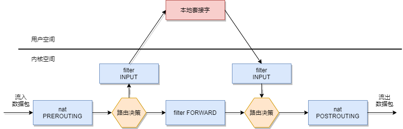

# Iptables

---

## 什么是 iptables

Linux 系统在内核中提供了对报文数据包过滤和修改的官方项目名为 Netfilter，它指的是 Linux 内核中的一个框架，它可以用于在不同阶段将某些钩子函数（hook）作用域网络协议栈。Netfilter 本身并不对数据包进行过滤，它只是允许可以过滤数据包或修改数据包的函数挂接到内核网络协议栈中的适当位置。这些函数是可以自定义的。

iptables 是用户层的工具，它提供命令行接口，能够向 Netfilter 中添加规则策略，从而实现报文过滤，修改等功能。Linux 系统中并不止有 iptables 能够生成防火墙规则，其他的工具如 firewalld 等也能实现类似的功能。

iptables 策略是由一组有序的规则建立的，它告诉内核应该如何处理某些类别的数据包。每一个 iptables 规则应用于一个表中的一个链。一个 iptables 链就是一个规则集，这些规则按序与包含某种特征的数据包进行比较匹配。

## iptables 服务命令

```bash
# 启动服务
/etc/init.d/iptables start
service iptables start

# 停止服务
/etc/init.d/iptables stop
service iptables stop

# 重启服务
/etc/init.d/iptables restart
service iptables restart

# 保存设置
/etc/init.d/iptables save
service iptables save
```

## iptables 常用命令

```bash
iptables -A     # 将一个规则添加到链末尾
iptables -D     # 将指定的链中删除规则
iptables -F     # 将指定的链中删除所有规则
iptables -I     # 将在指定链的指定编号位置插入一个规则
iptables -L     # 列出指定链中所有规则
iptables -t     # nat -L 列出所有 NAT 链中所有规则
iptables -N     # 建立用户定义链
iptables -X     # 删除用户定义链
iptables -P     # 修改链的默认设置，如将 iptables -P INPUT DROP (将 INPUT 链设置为 DROP)
```

## 常见设置参数**

* --dport       指定目标 TCP/IP 端口 如 –dport 80
* --sport       指定源 TCP/IP 端口 如 –sport 80
* -p tcp        指定协议为 tcp
* -p icmp       指定协议为 ICMP
* -p udp        指定协议为 UDP
* -j DROP       拒绝
* -j ACCEPT     允许
* -j REJECT     拒绝并向发出消息的计算机发一个消息
* -j LOG        在 / var/log/messages 中登记分组匹配的记录
* -m mac –mac                   绑定 MAC 地址
* -m limit –limit 1/s 1/m       设置时间策列
* -s 10.10.0.0 或 10.10.0.0/16  指定源地址或地址段
* -d 10.10.0.0 或 10.10.0.0/16  指定目标地址或地址段
* -s ! 10.10.0.0                指定源地址以外的

## iptables 配置文件

```bash
cat /etc/sysconfig/iptables
```

## iptables 表

iptables 默认有 4 个表
* nat 表（地址转换表）
* filter 表（数据过滤表）
* raw 表（状态跟踪表）
* mangle 表（包标记表）

## iptables 链

每个表都有一组内置链，用户还可以添加自定义的链。最重要的内置链是 filter 表中的 INPUT、OUTPUT 和 FORWARD 链。
* INPUT 链（入站规则）
* OUTPUT 链（出站规则）
* FORWARD 链（转发规则）
* PREROUTING 链（路有前规则）
* POSTROUTING 链（路由后规则）



---

## Source & Reference

- https://www.jianshu.com/p/586da7c8fd42
- https://wsgzao.github.io/post/iptables/
