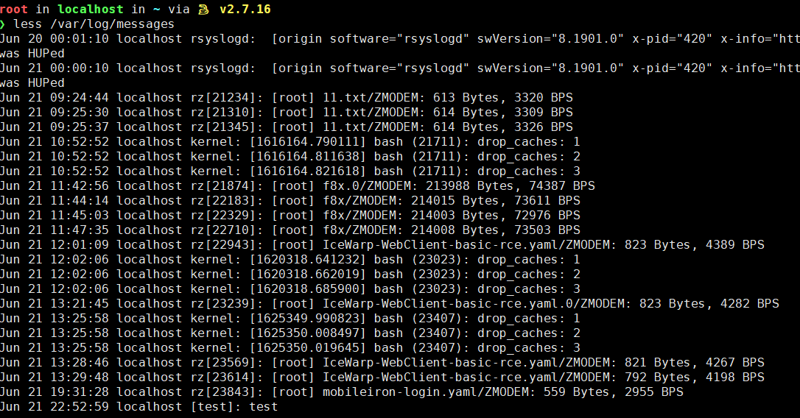

# 日志

---

## 系统日志类型

日志默认存放位置：`/var/log/`

```bash
service auditd status       # 查看日志服务是否开启
more /etc/rsyslog.conf      # 查看日志配置情况
```

### /var/log 下的日志分类

以下是比较常用的几个日志文件:

- `/var/log/message`    : 核心系统日志文件，包含系统启动引导，系统运行状态和大部分错误信息等都会记录到这个文件，因此这个日志是故障诊断的首要查看对象.
- `/var/log/dmesg`      : 核心启动日志，系统启动时会在屏幕显示与硬件有关的信息，这些信息会保存在这个文件里面.
- `/var/log/auth.log` 或 `/var/log/secure` : 存储来自可插拔认证模块(PAM)的日志，包括成功的登录，失败的登录尝试和认证方式。Ubuntu 和 Debian 在 `/var/log/auth.log` 中存储认证信息，而 RedHat 和 CentOS 则在 /var/log/secure 中存储该信息。
- `/var/log/spooler`    : UUCP 和 news 设备相关的日志信息
- `/var/log/cron`       : 与定时任务相关的日志信息
- `/var/log/maillog`    : 记录每一个发送至系统或者从系统发出的邮件活动
- `/var/log/boot`       : 系统引导日志
- `/var/log/wtmp` 和 `/var/run/utmp` : 由多个程序执行，记录用户登录时间
- `/var/log/kern`       : 存储内核的错误和警告数据，这对于排除与定制内核相关的故障尤为实用。
- `/var/log/btmp`       : 记录错误登录日志,这个文件是二进制文件,可以使用 lastb 命令查看
- `/var/log/cups`       : 记录打印信息的日志
- `/var/log/lastlog`    : 记录系统中所有用户最后一次登录时间的日志，这个文件是二进制文件，可以使用 lastlog 命令查看
- `/var/log/rpmpkgs`    : 记录系统中安装各 rpm 包列表信息。

---

### 内核及系统日志

这种日志由 syslog 统一管理，根据其主配置文件 `/etc/syslog.conf` 中的设置决定将内核消息及各种系统程序消息记录到什么位置。 用户日志：这种日志数据用于记录 Linux 系统用户登录及退出系统的相关信息，包括用户名、登录的终端、登录时间、来源主机、正在使用的进程操作等。 程序日志：有些应用程序运会选择自己来独立管理一份日志文件（而不是交给 syslog 服务管理），用于记录本程序运行过程中的各种事件信息。由于这些程序只负责管理自己的日志文件，因此不同的程序所使用的日志记录格式可能会存在极大差异。

> 内核为2.6.18时候使用的是 syslog 服务
> 注: 内核为2.6.32以后 syslog 被命名为 rsyslog，所以配置文件名称也不一样

通过查看 `/etc/rsyslog.conf` ，可查看相关系统日志配置情况。

message 日志，一般内核及大多数系统消息都被记录到公共日志文件 `/var/log/messages` 中，而其他一些程序消息被记录到不同的文件中，日志消息还能够记录到特定的存储设备中，或者直接向用户发送。

secure 是应急中最常用的文件，主要记录系统存取数据的文件，如 POP3、ssh、telnet、ftp 等相关记录，从日志中可看出系统服务是否遭受到安全威胁。

#### syslogd

syslogd 是大部分 Linux 发行版默认的日志守护进程，是一个记录日志的服务，子配置文件位于 /etc/syslog 或 /etc/syslogd，默认配置文件为 /etc/syslog.conf。

从架构来看，这个服务下面有一系列的子服务，例如 mail、cron 等等，这些子服务对外提供日志记录的功能，当其它的程序或服务需要记录日志的时候，就可以直接调用这些子服务将日志记录到指定的地方。

我们编写的代码可以通过 syslog 的接口进行 log，syslog 会通过 socket 将 log 发送给 syslogd，syslogd 在获取到 log 后，会对 log 进行处理，然后根据用户配置，将 log 保存到本地或者发送到其他服务器上去。

最简单的，用 `logger -t '[test]' "test"` 就可以直接日志记录到 message 里：



用 python 记录

```py
import syslog
syslog.syslog("hello")
```

#### rsyslogd

rsyslogd 是 syslogd 的升级版，子配置文件位于 /etc/rsyslog.d，默认配置文件为 /etc/rsyslog.conf，配置语法与 syslogd 的配置文件一致

#### 日志消息的级别

根据日志信息的重要程度不同，分为不同的级别 数字级别越小，优先级越高，消息越重要 级别 英文表示 意义
* 0 EMERG（紧急） 导致主机系统不可用的情况
* 1 ALERT（警告） 必须马上采取解决措施
* 2 CRIT 严重 比较严重的情况
* 3 ERR 错误 运行出现错误
* 4 WARNING 提醒 提醒用户的重要事件
* 5 NOTICE 注意 不会儿影响系统，提醒用户
* 6 INFO 信息 一般信息
* 7 DEBUG 调式 程序调式
* 8 None 没有 不做记录

查看出现的重大的错误
```bash
grep -E -iw "emerg|alert|critical|error" /var/log/messages
```

---

### 用户日志

例如 wtmp

wtmp 日志记录了用户的登录、退出、重启等情况，可以查看系统是否存在异常用户登录，判断攻击者是否已经登录服务器，由于 wtmp 日志为二进制文件，所以利用用 last 命令查看，last -t 20190426120950 ,可查看这个时间之前的日志。

lastlog 命令，用于显示系统中所有用户最近一次登录信息。lastlog 文件在每次有用户登录时被查询。可以使用 lastlog 命令检查某特定用户上次登录的时间，并格式化输出上次登录日志 `/var/log/lastlog` 的内容。它根据 UID 排序显示登录名、端口号（tty）和上次登录时间。如果一个用户从未登录过，lastlog 显示 Never logged。注意需要以 root 身份运行该命令。

---

### 程序日志

应用程序如(HTTP、FTP)等创建的日志

见 [取证](../../../Security/BlueTeam/取证.md#WEB取证) WEB取证部分

---

## 日志工具

### logrotate

> 分割日志工具/日志转储

目前大部分 linux 系统都会默认安装有 logrotate，日志分割工具.而这个工具的功能就是大家在 `/var/log/` 目录下面看到的形如 messages-20181028 样式的日志，在使用 logrotate 进行配置后就可以按照时间或者大小对日志进行分割存储.如果对 `/etc/logrotate.conf` 文件和 `/etc/logrotate.d/` 目录没有改动，可以看到 `/etc/logrotate.conf` 默认配置:

```bash
vim /etc/logrotate.conf

# 按周轮训
weekly
# 保留4周日志备份
rotate 4# 标记分割日志并创建当前日志
create
# 使用时间作为后缀
dateext
# 对 logrotate.d 目录下面的日志种类使用
include /etc/logrotate.d
# 对于wtmp 和 btmp 日志处理在这里进行设置
/var/log/wtmp {
    monthly
    create 0664 root utmp
 minsize 1M
    rotate 1
}
/var/log/btmp {
    missingok
    monthly
    create 0600 root utmp
    rotate 1
}
```

此外，如果你在服务器上面安装了mysql，httpd 或者其他应用服务后，logrotate 它会自动在 `/etc/logrotate.d/` 下面创建对应的日志处理方式，基本是继承 logrotate.conf. 因此，不论是你服务器上面系统日志还是应用日志，面对日志量太大的问题，都可以使用 logrotate 进行设置处理.

---

### rsyslog

> 日志收集工具

rsyslog 是一个可以进行日志转发和收集的工具，利用它可以拥有一台日志收集服务器，从而可以减少客户端日志的压力，对于相关日志的统一也是非常有用的，同时还有相应的前端展示工具来进行日志的查看统计.

rsyslog 不仅可以进行系统日志的收集，同时也支持应用日志的收集，只不过如果收集应用自定义日志的话，需要在客户端机器上面进行设置.因我们业务种类较多，不可能在初始化装机时在业务服务器上面配置相同的应用日志服务.因此，业务可以根据自己的需求，进行相关配置.下面让我们看一下当前我们使用的 rsyslog 服务情况.

`ps aux | grep rsyslog` 查看服务是否正常运行

rsyslog 的配置文件为 `/etc/rsyslog.conf`

查看配置文件内容以了解系统默认的文件位置
```bash
cat /etc/rsyslog.conf | ( grep "*" & grep "/" )
```

```bash
tail -f /var/log/messages

Nov 19 22:41:39 localhost NetworkManager[8790]: <info>  [1637332899.9781] dhcp4 (ens33): state changed bound -> bound
Nov 19 22:41:39 localhost dbus[8636]: [system] Activating via systemd: service name='org.freedesktop.nm_dispatcher' unit='dbus-org.freedesktop.nm-dispatcher.service'
Nov 19 22:41:39 localhost dhclient[9088]: bound to 192.168.141.11 -- renewal in 726 seconds.
Nov 19 22:41:39 localhost systemd: Starting Network Manager Script Dispatcher Service...
Nov 19 22:41:39 localhost dbus[8636]: [system] Successfully activated service 'org.freedesktop.nm_dispatcher'
Nov 19 22:41:39 localhost nm-dispatcher: req:1 'dhcp4-change' [ens33]: new request (3 scripts)
Nov 19 22:41:39 localhost systemd: Started Network Manager Script Dispatcher Service.
Nov 19 22:41:39 localhost nm-dispatcher: req:1 'dhcp4-change' [ens33]: start running ordered scripts...
Nov 19 22:42:57 localhost systemd-logind: New session 3 of user root.
Nov 19 22:42:57 localhost systemd: Started Session 3 of user root.

# 对应的含义
# 时间标签：消息发出的日期时间 主机名 生产消息的计算机的名称 子系统名称：发出消息的应用程序的名称 消息 消息级别的具体内容
```

当我们想把一台服务器变成 rsyslog 日志收集服务器的时候，对这个配置文件进行修改即可,在服务端配置有以下两个地方需要进行修改和配置:

```bash
/etc/rsyslog.conf

# 开启 udp 日志传输模式
$ModLoad imudp
$UDPServerRun 514

# 设置日志收集路径，包括客户端机器名与日志类型
$ActionFileDefaultTemplate RSYSLOG_TraditionalFileFormat
$template RemoteLogs,"/home/syslogs/%HOSTNAME%/%PROGRAMNAME%.log"
*.*  ?RemoteLogs
& ~
```

而在业务机器上面，只需要在配置的末尾，开启日志转发即可:

```bash
/etc/rsyslog.conf

#*.*                @10.21.109.2
#authpriv.*              @@10.101.10.199
*.*             @syslog.sys.srv
```

`@` 表示使用 UDP 进行转发，正好对应服务端开启了 UDP 收集方式.

在经过上面的配置之后，重启 `systemctl restart rsyslog.service` ，这样一个日志收集服务就成功建立了.

在 rsyslog 服务器上面收集到的日志是在配置里面设置好的路径 `/home/syslogs/%HOSTNAME%`

---

### Loganalyzer

- [Loganalyzer](../Power-Linux.md#Loganalyzer)

---

## Source & Reference

- [Linux 日志服务初识](https://toutiao.io/posts/0r1boo/preview)
- [Linux 系统日志小结](https://www.tr0y.wang/2021/06/15/linux-system-log/)
- [linux系统下各种日志文件的介绍，查看，及日志服务配置](https://zhuanlan.zhihu.com/p/298335887)
