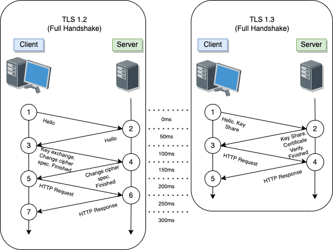

# TLS

> 注 : 笔记中拓扑图 drawio 源文件在其图片目录下

**相关文章 & 参考链接**
- https://blog.zeddyu.info/2021/04/20/tls-poison/
- http://blog.nsfocus.net/tls1-3protocol/
- https://mp.weixin.qq.com/s/uPe5YRIOqWcr4qYors1rFw

---

## 什么是 TLS

传输层安全性协议（英语：Transport Layer Security，缩写：TLS）及其前身安全套接层（英语：Secure Sockets Layer，缩写：SSL）是一种安全协议，目的是为互联网通信提供安全及数据完整性保障。

网景公司（Netscape）在 1994 年推出首版网页浏览器时，推出 HTTPS 协议，以 SSL 进行加密，这是 SSL 的起源。TLS 由此演变而来。TLS 1.0 版的开发实际上始于 SSL 3.1 版，但协议的名称在发布之前进行了更名，以表明它不再与 Netscape 关联。由于这个历史原因，TLS 和 SSL 这两个术语有时会互换使用。

IETF 将 SSL 进行标准化，1999 年公布 TLS 1.0 标准文件（RFC 2246）。随后又公布 TLS 1.1（RFC 4346，2006 年）、TLS 1.2（RFC 5246，2008 年）和 TLS 1.3（RFC 8446，2018 年）。在浏览器、电子邮件、即时通信、VoIP、网络传真等应用程序中，广泛使用这个协议。目前已成为互联网上保密通信的工业标准。

该协议由两层组成： TLS 记录协议（TLS Record）和 TLS 握手协议（TLS Handshake）。

握手协议在记录协议的上层，记录协议是一个分层协议。其中握手协议中还包括了警告协议(alert protocol)。

### TLS Handshake

TLS 握手是启动使用 TLS 加密的通信会话的过程。在 TLS 握手期间，两个通信方交换消息以相互确认，彼此验证，确立它们将使用的加密算法，并就会话密钥达成共识。它定义了消息的格式和交换的顺序。这些可以根据客户端和服务器的需求而变化，也就是说，有几种可能的程序来建立连接。初始交换的结果是 TLS 连接成功（双方都准备好用 TLS 传输应用数据）或发出警报消息。

每当用户通过 HTTPS 导航到网站，并且浏览器首先开始查询网站的源站服务器时，都会进行 TLS 握手。每当其他任何通信使用 HTTPS（包括 API 调用和 HTTPS 上的 DNS 查询）时，也会发生 TLS 握手。通过 TCP 握手打开 TCP 连接后，将发生 TLS 握手。

在 TLS 握手过程中，客户端和服务器一同执行以下操作：
- 指定将要使用的 TLS 版本（TLS 1.0、1.2、1.3 等）
- 决定将要使用哪些密码套件
- 通过服务器的公钥和 SSL 证书颁发机构的数字签名来验证服务器的身份
- 生成会话密钥，以在握手完成后使用对称加密
- 检查是否需要恢复会话

TLS 握手是由客户端和服务器交换的一系列数据报或消息。TLS 握手涉及多个步骤，因为客户端和服务器要交换完成握手和进行进一步对话所需的信息。 TLS 握手的确切步骤将根据所使用的密钥交换算法的类型以及双方支持的密码套件而有所不同，RSA 密钥交换算法最为常用。但是并非所有 TLS 握手均使用非对称加密（公钥和私钥），但并非全都会在生成会话密钥的过程中使用私钥。例如 Diffie-Hellman 握手等。

### TLS Record

TLS Record 协议使用握手过程中创建的密钥来确保应用数据的安全。

记录协议负责保护应用数据的安全，并验证其完整性和来源,它管理以下内容：
- 将传出的消息分为可管理的块
- 重新组合传入的消息
- 压缩外发报文块和解压接收报文块（可选）
- 将信息验证码（Message Authentication Code, MAC）应用到外发信息并使用 MAC 验证接收信息
- 加密外发报文和解密接收报文。

当 TLS Record 协议完成后，发送方从高层接受任意长度的非空数据，对其进行合并或分块处理，然后利用带有辅助数据的认证加密 AEAD （authenticated encryption with associated data）被传到传输控制协议（TCP）层进行传输。

---

### TLS 1.2

#### TLS 1.2 HankShake

由于历史原因，TLS 的前身 SSL 已经被废弃，我们这里介绍下 TLS 1.2

TLS 握手流程如下

1. Client hello: 客户端发送 ClientHello 消息，指定它支持的最高 TLS 协议版本、一个随机数、一个建议的密码套件列表和建议的压缩方法。如果客户端试图执行恢复握手，它可能会发送一个会话 ID 。如果客户端可以使用应用层协议协商，它可能包括一个支持的应用协议列表，例如 HTTP/2 。
2. Server hello: 服务器以 ServerHello 消息作出响应，包含从客户端提供的选择中选择的协议版本、随机数、密码套件和压缩方法。为了确认或允许恢复握手，服务器可以发送一个会话 ID 。选择的协议版本应该是客户端和服务器都支持的最高版本。例如，如果客户端支持 TLS 1.1 版本，服务器支持 1.2 版本，则应选择 1.1 版本；不应选择 1.2 版本。
3. (Optional) Certificate: 服务器向客户端发送证书或证书链。 证书链通常以服务器的公钥证书开始，并以证书颁发机构的根证书结束。 该消息是可选的，但是在需要服务器身份验证时使用。
4. (Optional) Certificate request: 如果服务器必须对客户端进行身份验证，则它将向客户端发送证书请求。 在Internet应用程序中，很少发送此消息。
5. (Optional) Server key exchange: 如果来自证书的公钥信息不足以进行密钥交换，则服务器会向客户端发送服务器密钥交换消息。 例如，在基于Diffie-Hellman（DH）的密码套件中，此消息包含服务器的DH公钥。
6. Server hello done: 服务器告诉客户端它已经完成了其初始协商消息。
7. (Optional)Certificate: 如果服务器从客户端请求证书，则客户端将发送其证书链，就像服务器之前所做的一样。

    Note: 只有少数Internet服务器应用程序要求客户端提供证书。

8. Client key exchange: 客户端生成用于创建用于对称加密的密钥的信息。 对于 RSA ，客户端随后使用服务器的公共密钥对该密钥信息进行加密并将其发送到服务器。 对于基于 DH 的密码套件，此消息包含客户端的 DH 公钥。
9. (Optional) Certificate verify: 如前所述，当客户端出示证书时，此消息由客户端发送。 其目的是允许服务器完成对客户端进行身份验证的过程。 使用此消息时，客户端使用加密哈希函数发送其进行数字签名的信息。 当服务器使用客户端的公共密钥解密此信息时，服务器便能够对客户端进行身份验证。
10. Change cipher spec: 客户端发送一条消息，告知服务器更改为加密模式。
11. Finished: 客户端告诉服务器已准备好开始安全数据通信。
12. Change cipher spec: 服务器发送一条消息，告知客户端更改为加密模式。
13. Finished: 服务器告诉客户端它已准备好开始安全数据通信，握手到此结束。
14. Encrypted data: 客户端和服务器使用对称加密算法和在客户端问候和服务器问候期间协商的加密哈希函数，以及使用客户端在客户端密钥交换期间发送给服务器的秘密密钥进行通信。 此时可以重新协商握手。
15. Close Messages: 在连接结束时，双方都会发送 close_notify Alert 报文，以通知对等方该连接已关闭。

#### TLS 1.2 Session Resumption

完整的 TLS 握手产生的额外延时和计算成本对所有需要安全通信的应用程序牺牲了很多性能代价，为了帮助降低部分成本， TLS 提供了一种机制恢复会话机制，用来恢复或共享多个连接之间的相同协商的秘钥数据。

会话恢复是一个重要的优化部署，简略的握手消除了一个完整的 TLS 握手往返耗时，大大降低了双方的计算成本。

在 TLS 1.2 中， TLS Session Resumption 可以采用 Session ID 和会话票机制来实现。除了性能上的优势外，恢复的会话还可以用于单点登录，因为它保证了原始会话和任何恢复的会话都来自同一个客户端。

##### Session ID

- https://blog.zeddyu.info/2021/04/20/tls-poison/#tls-12-session-resumption---session-id

##### Session Ticket

- https://blog.zeddyu.info/2021/04/20/tls-poison/#tls-12-session-resumption---session-ticket

---

### TLS 1.3

TLS 1.3 可以说是 TLS 1.2 的升级版本，它在 RFC 8446 中定义，于 2018 年 8 月发表。

改进有:
- 减少握手等待时间，将握手时间从 2-RTT 降低到 1-RTT，并且增加 0-RTT 模式。
- 废除 Session ID 和 Session Ticket 会话恢复方式，统一通过 PSK 的方式进行会话恢复，并在 NewSessionTicket 消息中添加过期时间和用于混淆时间的偏移值。

在握手时相对于 TLS 1.2 发生了比较明显的改动：
1. 与 TLS 1.2 握手类似，TLS 1.3 握手以 Client Hello 消息开始，但有一个重要的变化就是客户端发送支持的加密套件列表，并猜测服务器可能选择的密钥协议协议，也会发送它对该特定密钥协议协议的密钥共享。
2. Server 在回复 Server Hello 时，服务器回复它所选择的密钥协议协议，其中也包括服务器的密钥共享、证书以及 Server Finished 。
3. 现在，客户端检查服务器证书，生成密钥，并发送 Client Finished ，之后就可以发送加密数据了。

这样一来，TLS 1.3 握手就节省了整整一个来回和数百毫秒的时间，比 TLS 1.2 握手有了很大的改进。RFC 8446 提供的简要流程图如下：
```
       Client                                           Server

Key  ^ ClientHello
Exch | + key_share*
     | + signature_algorithms*
     | + psk_key_exchange_modes*
     v + pre_shared_key*       -------->
                                                  ServerHello  ^ Key
                                                 + key_share*  | Exch
                                            + pre_shared_key*  v
                                        {EncryptedExtensions}  ^  Server
                                        {CertificateRequest*}  v  Params
                                               {Certificate*}  ^
                                         {CertificateVerify*}  | Auth
                                                   {Finished}  v
                               <--------  [Application Data*]
     ^ {Certificate*}
Auth | {CertificateVerify*}
     v {Finished}              -------->
       [Application Data]      <------->  [Application Data]

              +  Indicates noteworthy extensions sent in the
                 previously noted message.

              *  Indicates optional or situation-dependent
                 messages/extensions that are not always sent.

              {} Indicates messages protected using keys
                 derived from a [sender]_handshake_traffic_secret.

              [] Indicates messages protected using keys
                 derived from [sender]_application_traffic_secret_N.

               Figure 1: Message Flow for Full TLS Handshake
```

TLS 1.2 与 1.3 简要的握手对比如下图所示：



#### PSK

TLS 1.3 用通过预共享密钥（Pre-Shared Key, PSK）恢复会话的概念取代了 1.2 当中的 Session ID 和 Session Ticket 。在最初的握手之后，服务器向客户端发送一个 PSK 标识。 PSK 内容取决于服务器，可能包含一个数据库查询密钥或一个自我加密和自我认证的票据。客户端将此PSK身份与自己的会话密钥一起存储。其中， RFC 8446 定义的 PSK 结构如下所示：
```
      struct {
          opaque identity<1..2^16-1>;
          uint32 obfuscated_ticket_age;
      } PskIdentity;

      opaque PskBinderEntry<32..255>;

      struct {
          PskIdentity identities<7..2^16-1>;
          PskBinderEntry binders<33..2^16-1>;
      } OfferedPsks;

      struct {
          select (Handshake.msg_type) {
              case client_hello: OfferedPsks;
              case server_hello: uint16 selected_identity;
          };
      } PreSharedKeyExtension;
```

在随后的握手中，客户端在给服务器的 ClientHello 消息中提供这个 PSK ，服务器根据 PSK 的内容对票据进行解密，并使用包含的会话密钥和连接状态来恢复会话，或者服务器使用包含的查找密钥在自己的数据库中查找会话密钥和连接状态。 RFC 8446 提供了一个 Session Resumption 的流程图如下：
```
          Client                                               Server

   Initial Handshake:
          ClientHello
          + key_share               -------->
                                                          ServerHello
                                                          + key_share
                                                {EncryptedExtensions}
                                                {CertificateRequest*}
                                                       {Certificate*}
                                                 {CertificateVerify*}
                                                           {Finished}
                                    <--------     [Application Data*]
          {Certificate*}
          {CertificateVerify*}
          {Finished}                -------->
                                    <--------      [NewSessionTicket]
          [Application Data]        <------->      [Application Data]


   Subsequent Handshake:
          ClientHello
          + key_share*
          + pre_shared_key          -------->
                                                          ServerHello
                                                     + pre_shared_key
                                                         + key_share*
                                                {EncryptedExtensions}
                                                           {Finished}
                                    <--------     [Application Data*]
          {Finished}                -------->
          [Application Data]        <------->      [Application Data]

               Figure 3: Message Flow for Resumption and PSK
```

1. 客户端向服务器发送一个带有 key_share 扩展的 ClientHello 消息。该扩展列出了客户端支持的密钥交换加密方法。
2. 服务器用一个带有 key_share 扩展名的 ServerHello 消息进行响应，这个扩展包含了它要用于密钥交换的加密方法，并且服务器将其参数一同发送给客户端。
3. 服务器和客户端都交换认证消息。
4. 服务器向客户端发送 NewSessionTicket 消息，其中包含一个 PSK ，客户端可以通过在 ClientHello 消息的 pre_shared_key 扩展中包含这个 PSK ，用于未来的握手。
5. 客户端和服务器现在可以交换加密的应用数据。
6. 在未来的握手中，客户端向服务器发送一个包含 key_share 和 pre_shared_key 扩展名的 ClientHello 消息。 pre_shared_key 扩展包含 NewTicketSession 消息中发送的 PSK 。
7. 服务器用包含 pre_shared_key 和 key_share 扩展名的 ServerHello 消息作出响应。 pre_shared_key 扩展包含服务器同意使用的 PSK ，并将其参数发送给客户端。
8. 服务器和客户端互相发送 Finished 消息，之后客户端和服务器可以交换加密的应用数据。

案例
- https://blog.zeddyu.info/2021/04/20/tls-poison/#tls-13-session-resumption---psk

####  0-RTT

- https://blog.zeddyu.info/2021/04/20/tls-poison/#tls-13-session-resumption---0-rtt

#### TLS1.3 警告协议

目的是以简单的通知机制告知通信出现异常情况，警告消息通常会携带 Close_notify 异常，在连接关闭的时候报告错误，Alert_Level 字段标识告警的严重程度，可取值 Warning 或者 Fatal，严重程度为 Fatal 时会立即终止当前连接。

---

## TLS Poison

- [TLS Poison](../../../Security/RedTeam/协议安全/Protocol-Exploits.md#tls-poison)

---

## SNI

**什么是 SNI**

随着IPv4地址的短缺，为了让多个域名复用一个IP，在HTTP服务器上引入了虚拟主机的概念。服务器可以根据客户端请求中不同的host，将请求分发给不同的域名（虚拟主机）来处理。

但是，在一个被多个域名（虚拟主机）共享IP的HTTPS服务器中，由于在握手建立之前服务器无法知道客户端请求的是哪个host，所以无法将请求交给特定的虚拟主机。然而，要完成握手，又必须读取虚拟主机中配置的证书信息。

Server name indication（简称，SNI）就是用来解决这个矛盾问题的。SNI要求客户端在与服务器握手时就携带需要访问的域名的host信息。这样，服务器就知道需要用哪个虚拟主机的证书与客户端握手并建立TLS连接。

SNI最早在2004年被提出，目前主流的浏览器、服务器和测试工具都已支持SNI。

**相关文章**
- [SNI可能引发的HTTPS访问异常](https://help.aliyun.com/document_detail/40519.html)

---

## ESNI

**什么是 ESNI**

ESNI 通过加密客户端问候消息的 SNI 部分（仅此部分），来保护 SNI 的私密性。加密仅在通信双方（在此情况下为客户端和服务器）都有用于加密和解密信息的密钥时才起作用，就像两个人只有在都有储物柜密钥时才能使用同一储物柜一样。由于客户端问候消息是在客户端和服务器协商 TLS 加密密钥之前发送的，因此 ESNI 加密密钥必须以其他方式进行传输。

解决方案：公钥加密。Web 服务器在其 DNS 记录中添加一个公钥，这样，当客户端查找正确的服务器地址时，同时能找到该服务器的公钥。这有点像将房门钥匙放在屋外的密码箱中，以便访客可以安全地进入房屋。然后，客户端即可使用公钥来加密 SNI 记录，以便只有特定的服务器才能解密它。（这是简单说明；有关详细的技术说明，请参阅此博客文章。）

假定爱丽丝想访问鲍勃的网站 www.bobisawesome.example.com。像每个负责的网站所有者一样，鲍勃对其网站使用 TLS，以便对往返网站的所有流量进行加密。鲍勃还部署了 ESNI，以进一步保护爱丽丝这样的网站访问者。

当爱丽丝在笔记本电脑的浏览器中输入 https://www.bobisawesome.example.com 时，笔记本电脑将通过以下流程加载网站：
1. 她的笔记本电脑向 DNS 服务器发送查询，以查询网站的 IP 地址。
2. DNS 响应告诉爱丽丝的笔记本电脑要使用哪个 IP 地址才能找到鲍勃的网站，DNS 响应中还包括鲍勃的 ESNI 公钥。
3. 爱丽丝的笔记本电脑向指定的 IP 地址发送客户端问候消息，并使用鲍勃的公钥对消息的 SNI 部分进行加密。
4. 鲍勃的 Web 服务器显示鲍勃的 TLS 证书。
5. TLS 握手继续进行，爱丽丝的笔记本电脑加载 www.bobisawesome.example.com。任何可能正在监视网络的攻击者都无法看到爱丽丝正在访问哪个网站。 *

**相关文章**
- [什么是加密的 SNI？ | ESNI 如何工作](https://www.cloudflare.com/zh-cn/learning/ssl/what-is-encrypted-sni/)
- [ESNI 加密装甲中的最后一个缝隙](https://xiumu.org/note/esni.shtml)

---

## ECH

**什么是 ECH**

加密客户端问候 (ECH) 是 TLS 协议的另一个扩展，它通过加密保护客户端问候的 SNI 部分。但是，与 ESNI 不同的是，ECH 会加密整个客户端问候。

**相关文章**
- [Good-bye ESNI, hello ECH!](https://blog.cloudflare.com/encrypted-client-hello/)
