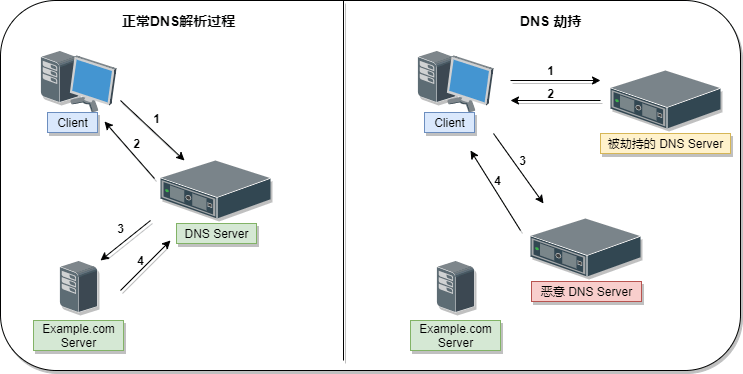

# DNS

> 注 : 笔记中拓扑图 drawio 源文件在其图片目录下

---

## 什么是 DNS

DNS(Domain Name System，域名管理系统) 是因特网的重要基础。它建立在一个分布式数据库基础之上，在这个数据库里，保存了 IP 地址和域名的相互映射关系。

**常用的DNS记录**

- A     ip 地址记录，记录域名对应的 ip 地址
- AAAA  ipv6 地址记录，记录域名对应的 ipv6 地址
- CNAME 别名记录，记录一个主机的别名
- MX    邮件交换记录，记录一个邮件域名对应的 ip 地址
- NS    域名服务器记录，记录该域名由哪台域名服务器解析
- PTR   反向记录，即从 ip 地址到域名的一条记录
- TXT   记录域名的相关文本信息

---

## CAA 记录

**相关文章**
- [证书颁发机构授权（CAA）](https://letsencrypt.org/zh-cn/docs/caa/)

**支持设置 CAA 记录的 DNS 提供商列表**
- https://sslmate.com/caa/support

**辅助工具**
- [CAA 记录生成器](https://sslmate.com/caa/)

**什么是 CAA 记录?**

CAA是一种 DNS 记录，它允许站点所有者指定允许哪些证书颁发机构（CA）颁发包含其域名的证书。

该记录在 2013 年由 RFC 6844标准化，以允许 CA “降低意外颁发证书的风险”。默认情况下，每个公共 CA 在验证申请者的域名控制权后可以为任何在公共 DNS 中的域名颁发证书。 这意味着如果某个 CA 的验证流程出现错误，所有域名都有可能受到影响。 CAA 记录为域名持有者提供了降低这类风险的方法。

**放置 CAA 记录的位置**

可以在主域名或任何深度的子域名上设置 CAA 记录。 例如，如果你有 `www.community.example.com` 这个域名，你可以在该域名、`community.example.com` 或 `example.com` 上设置 CAA 记录。 CA 将从左到右检查每个版本，并在看到任何 CAA 记录后立即停止。 因此，`community.example.com` 上的 CAA 记录优先于 `example.com` 上的记录。 大多数添加 CAA 记录的人都希望将它们添加到注册域名（`example.com`），这样它们对所有子域名均有效。 此外请注意，子域名的 CAA 记录优先于其父域名，无论该记录相比于主域更宽松或更具限制性。 因此，子域名可以放松父域名所施加的限制。

与所有其他 DNS 请求一样，CAA 验证遵循 CNAME 记录。 如果 `www.community.example.com` 被设置为 `web1.example.net` 的 CNAME，CA 将首先请求 `www.community.example.com` 的 CAA 记录，然后发现该域名有一个 CNAME 而不是 CAA 记录后，将请求 `web1.example.net` 的 CAA 记录。 请注意，如果域名具有 CNAME 记录，则根据 DNS 标准它不能拥有任何其他记录。

---

## DNS安全

**相关文章**
- [DNS 安全 | Cloudflare](https://www.cloudflare.com/zh-cn/learning/dns/dns-security/)

**什么是 DNSSEC？**

与许多 Internet 协议一样，在设计 DNS 系统时并未考虑安全性，并且该系统存在一些设计限制。再加上技术进步，这些限制使攻击者很容易出于恶意劫持 DNS 查找，例如将用户发送到可分发恶意软件或收集个人信息的欺诈性网站。DNS 安全扩展 (DNSSEC) 是为缓解此问题而创建的安全协议。DNSSEC 通过对数据进行数字签名来防止攻击，以帮助确保其有效性。为确保进行安全查找，此签名必须在 DNS 查找过程的每个级别进行。

此签名过程类似于人们用笔签署法律文件；此人签署别人无法创建的唯一签名，并且法院专家能够查看该签名并验证文件是否由该人签署的。这些数字签名可确保数据未被篡改。

DNSSEC 在 DNS 的所有层中实施分层数字签名策略。例如，在 `google.com` 查找中，根 DNS 服务器将为 `.COM` 域名服务器签写一个密钥，然后 `.COM` 域名服务器将为 `google.com` 的权威性域名服务器签写一个密钥。

尽管更高的安全性始终是首选的，但 DNSSEC 旨在向后兼容，以确保传统 DNS 查找仍可正确解析，尽管这没有提高安全性。作为整体 Internet 安全策略的一部分，DNSSEC 应与其他安全措施配合使用，例如 SSL/TLS。

DNSSEC 创建了一个父子信任链，该链一直行进到根区域。在 DNS 的任何层上此信任链都不能受损，否则请求将受到中间人攻击。

要闭合信任链，需要对根区域本身进行验证（证明没有篡改或欺诈），这实际上是通过人工干预来完成的。有趣的是，在所谓的“根区域签名仪式”上，来自世界各地的某些人聚集在一起，以公开且经审核的方式签署根 DNSKEY RRset。

**涉及 DNS 的常见攻击有哪些？**

DNSSEC 是一种强大的安全协议，但不幸的是，它当前尚未得到普遍采用。缺乏普及再加上其他可能的漏洞，最重要的是 DNS 是大多数 Internet 请求不可或缺的一部分，这些使 DNS 成为恶意攻击的主要目标。攻击者发现了众多针对和利用 DNS 服务器的方法，以下是一些最常见的方法：

- **DNS 欺骗/缓存中毒** ：这是将伪造的 DNS 数据引入 DNS 解析器缓存中的攻击，其将导致解析器返回域的错误 IP 地址。流量可能会被转移到恶意计算机或攻击者想要的其他任何位置，而不是前往正确网站；通常是用于恶意目的的原始站点副本，例如分发恶意软件或收集登录信息。

- **DNS 隧道** ：这种攻击使用其他协议通过 DNS 查询和响应建立隧道。攻击者可以使用 SSH、TCP 或 HTTP 在大多数防火墙未察觉的情况下将恶意软件或被盗信息传递到 DNS 查询中。

- **DNS 劫持** ：在 DNS 劫持中，攻击者将查询重定向到其他域名服务器。这可通过恶意软件或未经授权的 DNS 服务器修改来实现。尽管其结果与 DNS 欺骗的结果相似，但这是一种截然不同的攻击，因为其目标是域名服务器上网站的 DNS 记录，而不是解析器的高速缓存。

    

- **NXDOMAIN 攻击** ：这是一种 DNS 洪水攻击，攻击者利用请求淹没 DNS 服务器，从而请求不存在的记录，以试图导致合法流量的拒绝服务。这可使用复杂的攻击工具来实现，这些工具可为每个请求自动生成唯一子域。NXDOMAIN 攻击还可将递归解析器作为目标，目标是用垃圾请求填充解析器的高速缓存。

- **随机子域攻击** ：在这种情况下，攻击者向一个合法站点的几个随机的不存在的子域发送 DNS 查询。其目标是为该域的权威性域名服务器创建拒绝服务，从而使其无法从域名服务器查找网站。其副作用是，为攻击者提供服务的 ISP 也可能会受到影响，因为其递归解析器的高速缓存将被加载错误请求。

- **域锁定攻击** ：不良行为者会通过设置特殊域和解析器来与其他合法解析器建立 TCP 连接，从而策划这种攻击形式。当目标解析器发送请求时，这些域会发回缓慢的随机数据包流，从而占用解析器的资源。

- **基于僵尸网络的 CPE 攻击** ：这些攻击是使用 CPE 设备（用户终端设备，这是服务提供商提供的供客户使用的硬件，例如调制解调器、路由器、机顶盒等）进行的。攻击者使 CPE 受损，这些设备成为僵尸网络的一部分，用于对一个站点或域进行随机子域攻击。
