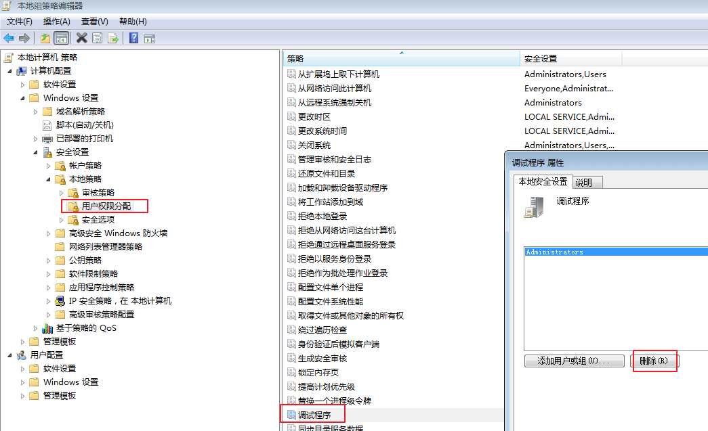
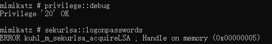
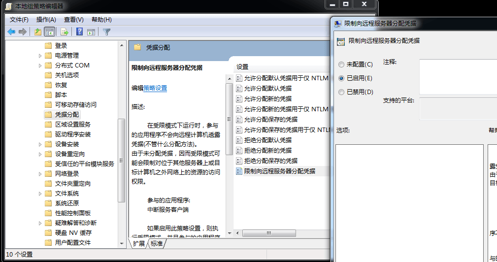
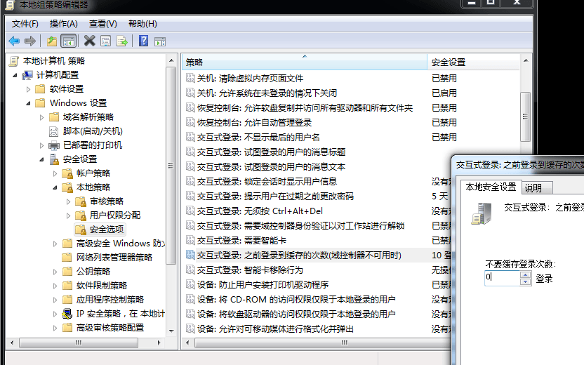
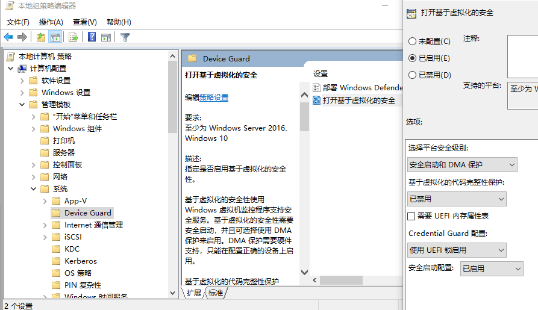
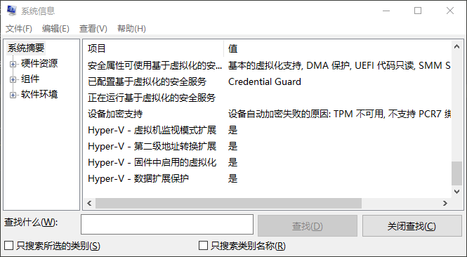
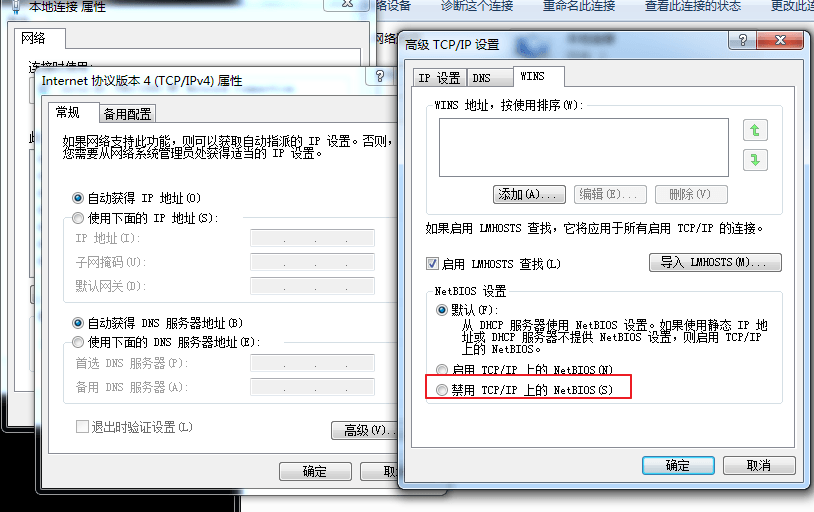
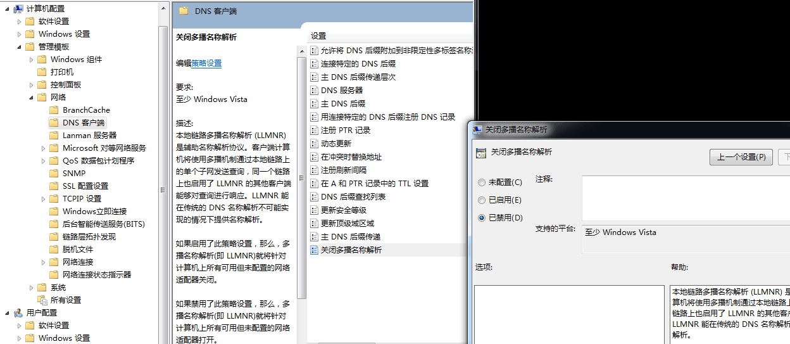

# Secure-Win

<p align="center">
    
</p>

- `windows 加固+维护+应急响应参考`

---

# 大纲

* **[文件](#文件)**
    * [可疑文件](#可疑文件)

* **[系统](#系统)**
    * [开机启动](#开机启动)
    * [账号](#账号)
    * [进程](#进程)
    * [注册表](#注册表)
    * [日志](#日志)
        * [系统日志](#系统日志)
        * [日志工具](#日志工具)
        * [第三方程序日志](#第三方程序日志)

* **[网络](#网络)**
    * [端口](#端口)
    * [RDP](#rdp)
    * [DNS](#dns)
    * [windows系统共享](#windows系统共享)

* **[防御密码抓取](#防御密码抓取)**

* **[防御Responder欺骗](#防御responder欺骗)**

---

# 文件
## 可疑文件

- 回收站
- 浏览器下载目录
- 浏览器历史记录

**最近文件**

开始-运行，输入 `%UserProfile%\Recent`
- `C:\Documents and Settings\Administrator\Recent`
- `C:\Documents and Settings\Default User\Recent`

查看指定时间范围包括上传文件夹的访问请求：
```
findstr /s /m /I “UploadFiles” *.log
```

**临时文件**
- `c:\windows\temp\`

---

# 系统

开启组策略编辑器 `gpedit.msc`

控制面板: <kbd>win</kbd> 输入 `control`

**信息**

系统信息: cmd 输入 `systeminfo`

## 开机启动

开始-运行，输入 `msconfig`

- `(ProfilePath)\Start Menu\Programs\Startup`

**注册表项**

在 cmd 下使用
```
REG query HKEY_LOCAL_MACHINE\Software\Microsoft\Windows\CurrentVersion\Run
REG query HKEY_LOCAL_MACHINE\Software\Microsoft\Windows\CurrentVersion\Runonce
REG query HKEY_LOCAL_MACHINE\Software\Microsoft\Windows\CurrentVersion\policies\Explorer\Run
REG query HKEY_CURRENT_USER\Software\Microsoft\Windows\CurrentVersion\Run
REG query HKEY_CURRENT_USER\Software\Microsoft\Windows\CurrentVersion\RunOnce
REG query HKLM\Software\Microsoft\Windows\CurrentVersion\RunonceEx
```

**服务自启动**

开始-运行，输入 `services.msc`

**计划任务**
- `C:\Windows\System32\Tasks\`
- `C:\Windows\SysWOW64\Tasks\`
- `C:\Windows\tasks\`

开始-运行，输入 `taskschd.msc`

- **cmd 下使用**
    ```
    schtasks
    ```

## 账号

开始-运行，输入 `lusrmgr.msc`

**cmd 下使用**
- `net user` : 显示用户账号信息
- `wmic UserAccount get` : 列出当前系统所有账户

**注册表项**
```
REG query HKEY_LOCAL_MACHINE/SAM/SAM/Domains/Account/Users
```

**查看用户目录**

新建账号会在以下目录生成一个用户目录，查看是否有新建用户目录。
- Window 2003 : `C:\Documents and Settings`
- Window 2008R2 : `C:\Users\`

**查看服务器是否存在隐藏账号、克隆账号**

可以使用 D 盾工具，其集成了对克隆账号检测的功能。

**加固**

- Microsoft本地管理员密码解决方案（LAPS）
    - 参考文章:[Microsoft Local Administrator Password Solution (LAPS)](https://adsecurity.org/?p=1790)

## 进程

开始-运行，输入 `msinfo32` ，依次点击“软件环境→正在运行任务”就可以查看到进程的详细信息，比如进程路径、进程 ID、文件创建日期、启动时间等。

**服务**

开始-运行，输入 `services.msc`

**cmd 下查看可疑进程**
```
tasklist /svc | findstr pid
netstat -ano

wmic process | find "Proccess Id" > proc.csv
wmic process get caption,commandline /value
wmic process where caption=”svchost.exe” get caption,commandline /value
wmic service get name,pathname,processid,startname,status,state /value
wmic process get CreationDate,name,processid,commandline,ExecutablePath /value
wmic process get name,processid,executablepath| findstr "7766"
```

**powershell 下查看可疑进程**
```
Get-WmiObject -Class Win32_Process
Get-WmiObject -Query "select * from win32_service where name='WinRM'" -ComputerName Server01, Server02 | Format-List -Property PSComputerName, Name, ExitCode, Name, ProcessID, StartMode, State, Status
```

**查看可疑的进程及其子进程内容**
- 没有签名验证信息的进程
- 没有描述信息的进程
- 进程的属主
- 进程的路径是否合法
- CPU 或内存资源占用长时间过高的进程

**令牌假冒防御**

禁止 Domain Admins 登录对外且未做安全加固的服务器，因为一旦服务器被入侵，域管理员的令牌可能会被攻击者假冒，从控制 DC。

如果想清除假冒令牌，重启服务器即可。

## 注册表

开始-运行，输入 `regedit`

**cmd 下运行**
```
REG query HKEY_LOCAL_MACHINE\SOFTWARE\Microsoft\Windows NT\CurrentVersion\ProfileList
REG query HKLM\Software\Microsoft\Windows\CurrentVersion\Run\ HKEY_CLASSES_ROOT\exefile\shell\open\command
```

---

## 日志

### 系统日志

系统日志基本知识见 [日志](./笔记/日志.md)

**导出日志**
- 相关文章
    - [Export corrupts Windows Event Log files](https://blog.fox-it.com/2019/06/04/export-corrupts-windows-event-log-files/) - 导出损坏的 Windows 事件日志文件

**恢复 eventlogedit 删除的记录**
- 相关文章
    - [Detection and recovery of NSA’s covered up tracks](https://blog.fox-it.com/2017/12/08/detection-and-recovery-of-nsas-covered-up-tracks/)

- 工具
    - [fox-it/danderspritz-evtx](https://github.com/fox-it/danderspritz-evtx) - 解析 evtx 文件并检测 DanderSpritz eventlogedit 模块的使用

**Windows Defender 日志**
- Windows Defender 应用程序使用 `MpCmdRun.log` 和 `MpSigStub.log` 两个日志文件，在 `C:\Windows\Temp` 文件夹下。该文件夹为默认的 SYSTEM 账户临时文件夹，但是每一个用户都拥有写权限。Administrators （管理员）和 SYSTEM 账户拥有这个文件夹的所有权限，一般用户甚至没有读的权限。

### 日志工具

**Sysmon**
- [Sysmon](../../Security/工具/Sysmon.md)

**logparser**

`logparser` 是一款 windows 日志分析工具，访问这里下载 https://www.microsoft.com/en-us/download/details.aspx?id=24659

- 相关文章
    - [windows安全日志分析之logparser篇](https://wooyun.js.org/drops/windows%E5%AE%89%E5%85%A8%E6%97%A5%E5%BF%97%E5%88%86%E6%9E%90%E4%B9%8Blogparser%E7%AF%87.html)

- 使用

    登录成功的所有事件
    ```
    LogParser.exe -i:EVT -o:DATAGRID "SELECT * FROM c:\Security.evtx where EventID=4624"
    ```

    指定登录时间范围的事件
    ```
    LogParser.exe -i:EVT -o:DATAGRID "SELECT * FROM c:\Security.evtx where TimeGenerated>'2018-06-19 23:32:11' and TimeGenerated<'2018-06-20 23:34:00' and EventID=4624"
    ```

    提取登录成功的用户名和 IP
    ```
    LogParser.exe -i:EVT -o:DATAGRID "SELECT EXTRACT_TOKEN(Message,13,' ') as EventType,TimeGenerated as LoginTime,EXTRACT_TOKEN(Strings,5,'|') as Username,EXTRACT_TOKEN(Message,38,' ') as Loginip FROM c:\Security.evtx where EventID=4624"
    ```

    登录失败的所有事件
    ```
    LogParser.exe -i:EVT -o:DATAGRID "SELECT * FROM c:\Security.evtx where EventID=4625"
    ```

    提取登录失败用户名进行聚合统计
    ```
    LogParser.exe -i:EVT "SELECT EXTRACT_TOKEN(Message,13,' ') as EventType,EXTRACT_TOKEN(Message,19,' ') as user,count(EXTRACT_TOKEN(Message,19,' ')) as Times,EXTRACT_TOKEN(Message,39,' ') as Loginip FROM c:\Security.evtx where EventID=4625 GROUP BY Message”
    ```

    系统历史开关机记录
    ```
    LogParser.exe -i:EVT -o:DATAGRID "SELECT TimeGenerated,EventID,Message FROM c:\System.evtx where EventID=6005 or EventID=6006"
    ```

**LogParser Lizard**

对于 GUI 环境的 Log Parser Lizard，其特点是比较易于使用，甚至不需要记忆繁琐的命令，只需要做好设置，写好基本的 SQL 语句，就可以直观的得到结果。

下载地址 : http://www.lizard-labs.com/log_parser_lizard.aspx

依赖包：Microsoft .NET Framework 4 .5，下载地址：https://www.microsoft.com/en-us/download/details.aspx?id=42642

**Event Log Explorer**

Event Log Explorer 是一款非常好用的 Windows 日志分析工具。可用于查看，监视和分析跟事件记录，包括安全，系统，应用程序和其他微软 Windows 的记录被记载的事件，其强大的过滤功能可以快速的过滤出有价值的信息。

下载地址 : https://event-log-explorer.en.softonic.com/

**Win-Logs-Parse-tool**

Python 开发的解析 windows 日志文件的工具，可采用手动添加文件的方式进行解析，解析后的文件为 XML，HTML 两种格式，HTML 已采用Bootstrap 架进行界面可视化优化，可直接查看重点日志数据，解析后的 HTML 数据文件保存在执行文件下的 logs/ 文件夹下 ( 自动创建 )，XML 数据文件保存在执行文件下的 logs/xml/ 文件夹下，

项目地址 : https://github.com/Clayeee/Win-Logs-Parse-tool

**LogonTracer**

通过可视化和分析 Windows 事件日志来调查恶意 Windows 登录的工具

项目地址 : https://github.com/JPCERTCC/LogonTracer

### 第三方程序日志

**web日志**
- 内容见 [取证](../../Security/笔记/BlueTeam/取证.md#中间件服务器程序日志) 中间件服务器程序日志部分

**数据库日志**
- 内容见 [取证](../../Security/笔记/BlueTeam/取证.md#数据库取证) 数据库取证部分

**应用程序日志**
- 内容见 [取证](../../Security/笔记/BlueTeam/取证.md#应用程序取证) 应用程序取证部分

## 安全设置

### 安全策略

开始-运行，输入 `secpol.msc`

## 设备

### 磁盘管理

- win7

    右键“计算机”，选中“管理”，选择磁盘管理

- win10

    <kbd>win</kbd>+<kbd>x</kbd>,选择 <kbd>磁盘管理</kbd>

---

# 网络

## 端口

查看目前的网络连接，定位可疑的 ESTABLISHED
```
netstat -ano

- CLOSED:无连接活动或正在进行
- LISTEN:监听中等待连接
- SYN_RECV:服务端接收了 SYN
- SYN_SENT:请求连接等待确认
- ESTABLISHED:连接建立数据传输
- FIN_WAIT1:请求中止连接，等待对方 FIN
- FIN_WAIT2:同意中止，请稍候
- ITMED_WAIT:等待所有分组死掉
- CLOSING:两边同时尝试关闭
- TIME_WAIT:另一边已初始化一个释放
- LAST_ACK:等待原来的发向远程 TCP 的连接中断请求的确认
- CLOSE-WAIT:等待关闭连接
```

根据 netstat 定位出的 pid，进行进程定位
```
tasklist  | findstr “PID”
```

---

## RDP

```
quser               显示有关客户端服务器上用户远程桌面会话主机的信息
qwinsta             显示有关服务器中会话远程桌面会话主机的信息
qprocess            显示有关在远程桌面会话主机服务器上运行的进程的信息
```

**防爆破**
- [y11en/BlockRDPBrute](https://github.com/y11en/BlockRDPBrute) - [HIPS]RDP(3389)爆破防护

**连接记录**
- [Windows RDP 连接记录](../../Security/RedTeam/OS安全/Windows安全.md#连接记录)

---

## DNS

很多时候需要通过某个恶意域名来判断主机失陷情况。

**文章**
- [哪个进程在访问这个恶意域名???](https://mp.weixin.qq.com/s/mcK06AOWVkwOVR67_n4OGw)
- [DNS日志记录方法](https://green-m.me/2017/08/21/windows-dns-log/)

**工具**
- **Sysmon**
    - [Sysmon查看DNS记录](../../Security/工具/Sysmon.md#DNS记录)

- **DNSQuerySniffer**

    DNSQuerySniffer 是网络嗅探工具，显示 DNS 查询发送你的系统。每个 DNS 查询，显示以下信息：主机名，端口号，编号查询，请求类型（A，AAAA，NS，和 MX，等等），请求响应时间，时间，响应代码，数量的记录，并返回的 DNS 记录的内容。通过 DNSQuerySniffer 我们先确定访问恶意域名的端口号。这个工具的优点是可以将主机访问过的所有域名记录下来。

    下载地址 : https://www.nirsoft.net/utils/dns_query_sniffer.html

    配合 Process Monitor 可以定位进程

- **[dnsdataview](https://www.nirsoft.net/utils/dns_records_viewer.html)** - 记录 DNS 记录

**DNS cache log**
- 相关文章
    - [开启DNS Client Service日志](http://blog.nsfocus.net/open-dns-client-service-log/)

- 开启命令
    ```
    net stop dnscache

    type nul > %systemroot%\system32\dnsrsvlr.log
    type nul > %systemroot%\system32\dnsrslvr.log
    type nul > %systemroot%\system32\asyncreg.log

    cacls %systemroot%\system32\dnsrsvlr.log /E /G "NETWORK SERVICE":W
    cacls %systemroot%\system32\dnsrslvr.log /E /G "NETWORK SERVICE":W
    cacls %systemroot%\system32\asyncreg.log /E /G "NETWORK SERVICE":W

    net start dnscache
    ```

**ETW consumers**

windows 8.1 和 windows server 2012 R2 及以上版本的操作系统，可以下载补丁直接以标准的 windows 日志格式记录 dns log，windows server 2016 可以直接开启。

微软官方文档 : https://docs.microsoft.com/en-us/previous-versions/windows/it-pro/windows-server-2012-R2-and-2012/dn800669(v=ws.11)

**DNS Client Cached**
- 相关文章
    - [Getting DNS Client Cached Entries with CIM/WMI](https://www.darkoperator.com/blog/2020/1/14/getting-dns-client-cached-entries-with-cimwmi)

- 工具
    - https://github.com/PSGumshoe/PSGumshoe/blob/master/CIM/Get-CimDNSCache.ps1
        ```powershell
        .\Get-CimDNSCache.ps1 # include file
        Get-CimDNSCache -Name *microsoft* -Type A
        ```

---

## windows系统共享

参考文章: [关键证据检索提取-系统共享检查](https://mp.weixin.qq.com/s/5nVnXMTPIpAu59bycwu5Iw)

**net share 查询**

查看系统中所有共享
```
net share
```

关闭默认共享
```
net share IPC$ /del
```

**wmic share查询**

```
wmic share get name,path,status
```

**powershell get-wmiobject查询**

```
get-wmiobject -class Win32_share
```

**开启系统默认共享**

```
# 默认共享开启自动开启，在系统重启的时候自动打开
reg add "HKEY_LOCAL_MACHINE\System\CurrentControlSet\Services\LanmanServer\Parameters" /v AutoShareServer /t REG_DWORD /d 0x01
reg add "HKEY_LOCAL_MACHINE\System\CurrentControlSet\Services\LanmanServer\Parameters" /v AutoShareWks /t REG_DWORD /d 0x01

# IPC$共享开启，设置命名管道设置为0，不限制
reg add "HKEY_LOCAL_MACHINE\SYSTEM\ControlSet001\Control\Lsa" /v restrictanonymous /t REG_DWORD /d 0x00
reg add "HKEY_LOCAL_MACHINE\SYSTEM\CurrentControlSet\Control\Lsa" /v restrictanonymous /t REG_DWORD /d 0x00
reg add "HKEY_LOCAL_MACHINE\SYSTEM\CurrentControlSet\Control\Lsa" /v restrictanonymous /t REG_DWORD /d 0x00
```

**关闭系统共享**

```
# 默认共享（c$、admin$）关闭（2003取消ipc$方式也是这个）
reg add "HKEY_LOCAL_MACHINE\System\CurrentControlSet\Services\LanmanServer\Parameters" /v AutoShareServer /t REG_DWORD /d 0x00
reg add "HKEY_LOCAL_MACHINE\System\CurrentControlSet\Services\LanmanServer\Parameters" /v AutoShareWks /t REG_DWORD /d 0x00
```

**限制 ipc$ 共享**

- 通过限制命名空间限制 ipc$ 共享

    IPC$ 限制使用关闭有些服务，必须要求启动 IPC$ 共享命名管道，特别是一些微软出品的应用软件。如微软的 SQL Server 数据库，必须要启用 IPC$ 共享命名管道。否则的话，数据库就无法正常运行。IPC$ 共享命名管道，也是 SQL Server 数据库与微软服务器操作系统无缝集成的一个通道。“HKEY_LOCAL_MACHINE\SYSTEM\CurrentControlSet\Control\Lsa”。在这一项内容中，有一个叫做 restrictanonymous 的键值。如果设置为 "1"，一个匿名用户仍然可以连接到 IPC$ 共享，但无法通过这种连接得到列举 SAM 帐号和共享信息的权限；在 Windows 2000 中增加了 "2"，未取得匿名权的用户将不能进行 ipc$ 空连接。建议设置为 1。如果上面所说的主键不存在，就新建一个再改键值。
    ```
    reg add "HKEY_LOCAL_MACHINE\SYSTEM\ControlSet001\Control\Lsa" /v restrictanonymous /t REG_DWORD /d 0x01
    reg add "HKEY_LOCAL_MACHINE\SYSTEM\CurrentControlSet\Control\Lsa" /v restrictanonymous /t REG_DWORD /d 0x01
    reg add "HKEY_LOCAL_MACHINE\SYSTEM\CurrentControlSet\Control\Lsa" /v restrictanonymous /t REG_DWORD /d 0x01
    以上注册表关闭IPC$的方式并不能清除共享，只能限制匿名用户枚举sam用户
    ```

- 通过临时关闭服务或删除服务对本次启动的服务进行限制

    限制 ipc$ 共享 / 停止 ipc$ 共享基于的服务 server，但是重启仍然会自动开启，根据资料将 HKEY_LOCAL_MACHINE/SYSTEM/CurrentControlSet/Services/LanmanServer/Parameters 其中的 AutoShareWks 和 AutoShareServer 的值都改成 0，只能在重启后禁止自动打开默认共享，对于 IPC$ 共享并不会起作用。
    ```
    net share ipc$  /delete
    net stop server
    ```

---

## 防火墙

**查询所有防火墙配置**

```
netsh advfirewall show allprofiles  # 查询所有防火墙配置
```

**查询所有连接安全规则**

```
netsh> advfirewall consec show rule name=all
```

**查询所有出入站规则**

```
netsh advfirewall firewall show rule name=all
```

---

# 防御密码抓取

**WDigest 禁用缓存**

WDigest.dll 是在 Windows XP 操作系统中引入的，当时这个协议设计出来是把明文密码存在 lsass 里为了 http 认证的。WDigest 的问题是它将密码存储在内存中，并且无论是否使用它，都会将其存储在内存中。

默认在 win2008 之前是默认启用的。但是在 win2008 之后的系统上，默认是关闭的。如果在 win2008 之前的系统上打了 KB2871997 补丁，那么就可以去启用或者禁用 WDigest。

补丁下载地址
- Windows 7 x86 : https://download.microsoft.com/download/9/8/7/9870AA0C-BA2F-4FD0-8F1C-F469CCA2C3FD/Windows6.1-KB2871997-v2-x86.msu
- Windows 7 x64 : https://download.microsoft.com/download/C/7/7/C77BDB45-54E4-485E-82EB-2F424113AA12/Windows6.1-KB2871997-v2-x64.msu
- Windows Server 2008 R2 x64 Edition : https://download.microsoft.com/download/E/E/6/EE61BDFF-E2EA-41A9-AC03-CEBC88972337/Windows6.1-KB2871997-v2-x64.msu

启用或者禁用WDigest修改注册表位置:
```
HKEY_LOCAL_MACHINE\System\CurrentControlSet\Control\SecurityProviders\WDigest
```
UseLogonCredential 值设置为 0, WDigest不把凭证缓存在内存，mimiktaz抓不到明文；UseLogonCredential 值设置为 1, WDigest把凭证缓存在内存，mimiktaz可以获取到明文。

在注册表中将UseLogonCredential 值设置为 0，或者使用命令
```
reg add HKLM\SYSTEM\CurrentControlSet\Control\SecurityProviders\WDigest /v UseLogonCredential /t REG_DWORD /d 0 /f
reg query HKLM\SYSTEM\CurrentControlSet\Control\SecurityProviders\WDigest /v UseLogonCredential
```

**Debug 权限**

Mimikatz 在获取密码时需要有本地管理员权限，因为它需要与 lsass 进程所交互，需要有调试权限来调试进程，默认情况下本地管理员拥有调试权限，但是这个权限一般情况是很少用得到的，所以可以通过关闭 debug 权限的方法来防范 Mimikatz。



删除上图的 administrators 组，这样管理员也没了 debug 权限。

**LSA Protection**

自 Windows 8.1 开始为 LSA 提供了额外的保护（LSA Protection），以防止读取内存和不受保护的进程注入代码。保护模式要求所有加载到 LSA 的插件都必须使用 Microsoft 签名进行数字签名。 在 LSA Protection 保护模式下，mimikatz 运行 sekurlsa::logonpasswords 抓取密码会报错。

可以通过注册表开启 LSA Protection，注册表位置：HKEY_LOCAL_MACHINE\SYSTEM\CurrentControlSet\Control\Lsa 新建 - DWORD（32）值，名称为 RunAsPPL, 数值为 00000001，然后重启系统生效。

或者使用命令来完成
```
REG ADD "HKLM\SYSTEM\CurrentControlSet\Control\Lsa" /v "RunAsPPL" /t REG_DWORD /d "00000001" /f
```



此操作无法防御直接从 SAM 读取的方法

**受限制的管理模式**

对于 Windows 2012 R2 和 Windows 8.1 之前的旧操作系统，需要先安装补丁 KB2871997。

先在 `HKEY_LOCAL_MACHINE\System\CurrentControlSet\Control\Lsa` 设置 `RunAsPPL` 为 `1` 然后在 `HKEY_LOCAL_MACHINE\System\CurrentControlSet\Control\Lsa` 设置 `DisableRestrictedAdmin` 为 `0` , `DisableRestrictedAdminOutboundCreds` 为 `1` 。

然后需要在域中强制执行 “对远程服务器的凭据限制委派” 策略, 以确保所有出站 RDP 会话都使用 “RestrictedAdmin” 模式, 因此才不会泄露凭据。

具体位置是组策略：计算机配置 -- 管理模板 -- 系统 -- 凭据分配 -- 限制向远程服务器分配凭据，选择已启用.



**禁用凭证缓存**

Domain Cached Credentials 简称 DDC，也叫 mscache。有两个版本，XP/2003 年代的叫第一代，Vasta/2008 之后的是第二代。如果域控制器不可用，那么windows将检查缓存的最后一个密码hash值，这样为以后系统对用户进行身份验证。缓存位置如下：
```
HKEY_LOCAL_MACHINE\SECURITY\Cache
```
在组策略中设置禁用缓存



计算机配置--windows设置--安全设置--本地策略--安全选项 交互式登录：之前登录到缓存的次数（域控制器不可用时） 默认是10，设置为0

**受保护的用户组**

WindowsServer 2012及更高版本使用了引入了一个名为“Protected Users”的新安全组，其他系统需要安装 KB2871997 补丁才会有。

此组使域管理员能够保护本地管理员等有权限的用户,因为属于该组的任何帐户只能通过Kerberos对域进行身份验证。

这将有助于防止NTLS密码哈希值或LSAS中的纯文本凭据泄露给敏感帐户,这些帐户通常是攻击者的目标。

可以在“Active Directory用户和计算机”中找到“Protected Users”安全组。

可以通过执行以下PowerShell命令将帐户添加到“受保护的用户”组中:
```
Add-ADGroupMember -Identity 'Protected Users' -Members administrator
```

**Credential Guard**

在 Windows 10 和 Windows Server 2016 中，Microsoft 启用 Credential Guard（凭据防护），使用基于虚拟化技术来保护和隔离 lsass 进程，以保护凭证。启用 Credential Guard 后，lsass 包含 2 个进程：正常 LSA 进程和隔离 LSA 进程（在 VSM 中运行）。

可以使用组策略启用 Windows Defender 凭据保护：在组策略管理控制台中，在” 计算机配置” -> “管理模板” -> “系统” -> “Device Guard”，打开” 打开基于虚拟化的安全”，选择” 已启用”；

在” 选择平台安全级别” 框中，选择” 安全启动” 或” 安全启动和 DMA 保护”；

在” 凭据保护配置” 框中，选择” 使用 UEFI 锁启用”。如果希望能够远程关闭 Windows Defender Credential Guard，选择” 无锁启用”。



运行 gpupdate /force 强制执行组策略

验证Windows Defender Credential Guard是否运行：

输入 msinfo32.exe，在 ”系统摘要”-> ”已配置基于虚拟化的安全服务”处，可看到显示”Credential Guard”



---

# 防御Responder欺骗

**禁用NetBIOS服务**



**禁用LLMNR**



**Conveigh**

- https://github.com/Kevin-Robertson/Conveigh

**VindicateTool**

- https://github.com/Rushyo/VindicateTool
