# Exchange 搭建

---

**实验环境组成**
- VMware
- 一台 win2016 ,域控(为了你的身心健康着想,不要使用其他版本的 windows server 系统)

---

先搭建好域控和 DNS 服务器

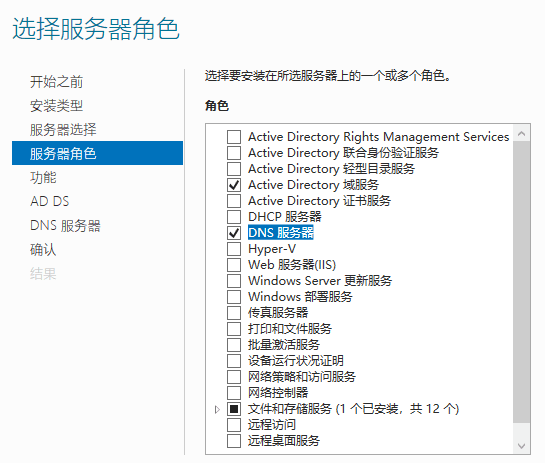

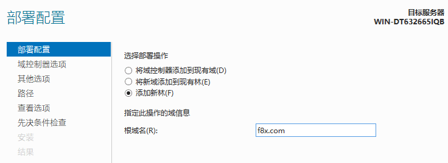

然后一路下一步搭建完毕后,下载 .NET Framework 4.8 和几个依赖
- https://download.visualstudio.microsoft.com/download/pr/014120d7-d689-4305-befd-3cb711108212/0fd66638cde16859462a6243a4629a50/ndp48-x86-x64-allos-enu.exe
- https://www.microsoft.com/download/details.aspx?id=30679
    - 英文版
- https://www.microsoft.com/en-us/download/confirmation.aspx?id=34992
    - 英文版
- https://www.microsoft.com/download/details.aspx?id=40784
    - 英文版

管理员模式运行 powershell 安装所需组件
```
Install-WindowsFeature RSAT-ADDS
```

都安装完毕后重启,一定要重启

然后下载 Exchange Server 2016,运行 setup.exe 安装
- https://www.microsoft.com/zh-cn/download/confirmation.aspx?id=102114

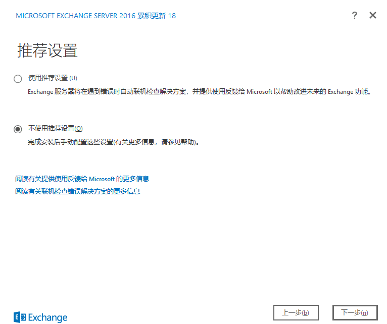

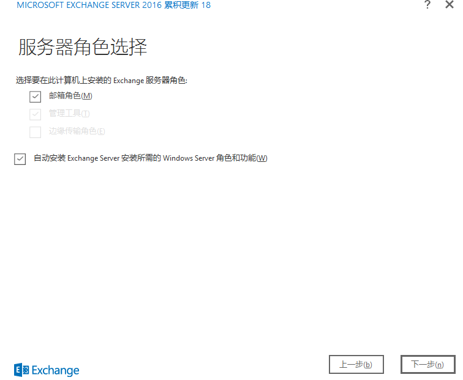

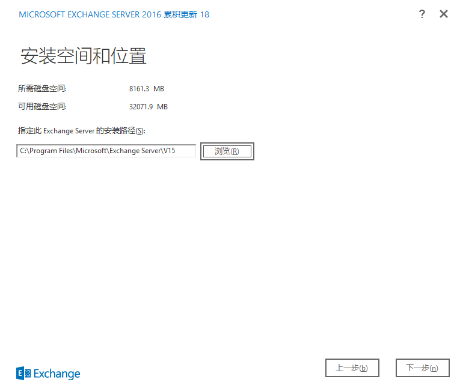

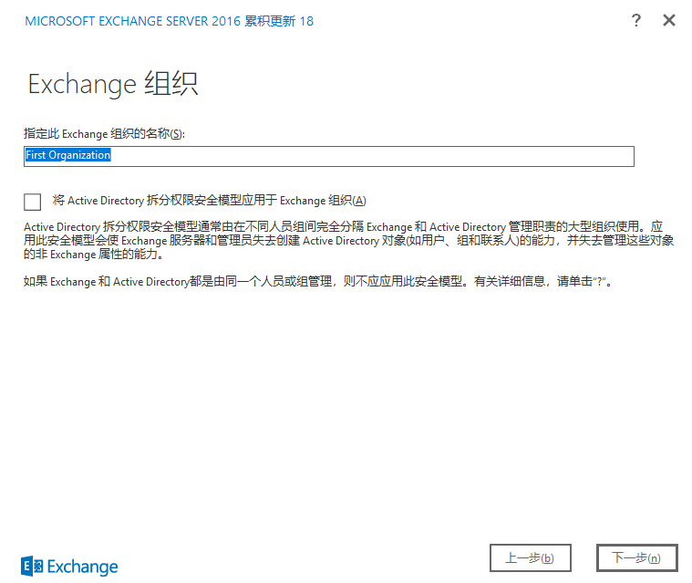

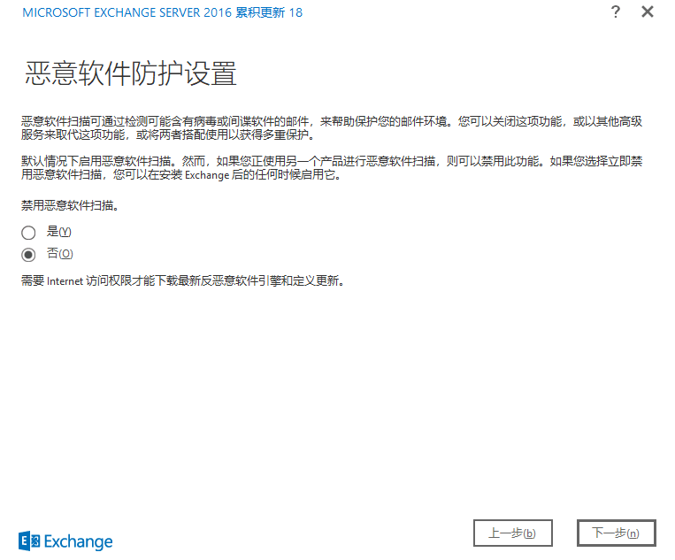

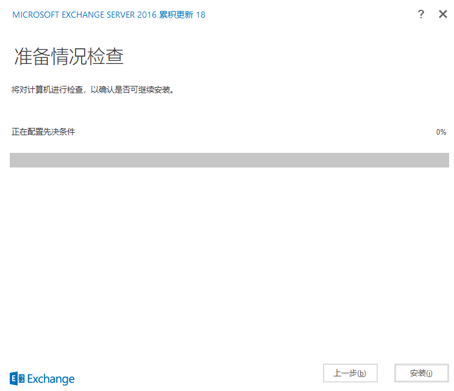

这里会走一个先决条件判断，有可能会失败，按照要求装补丁即可

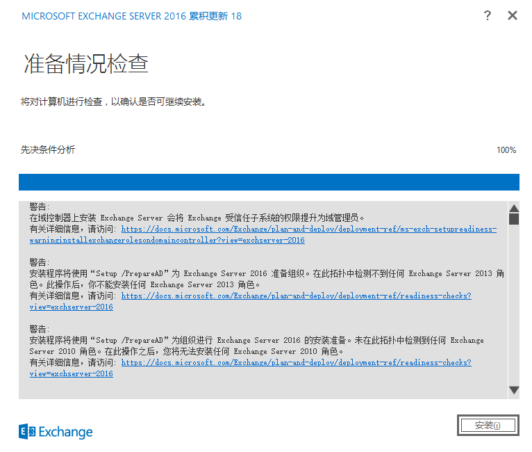

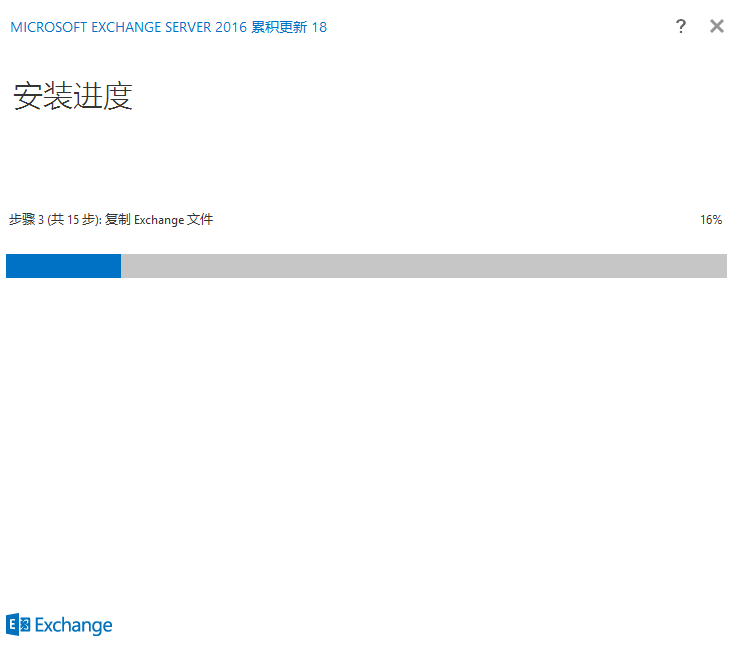

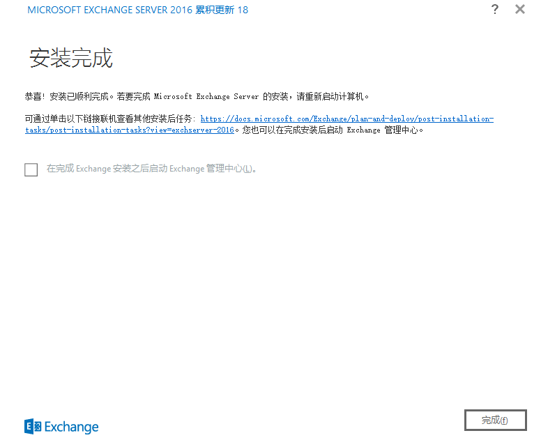

访问本地
- https://localhost/ecp
- https://localhost/owa

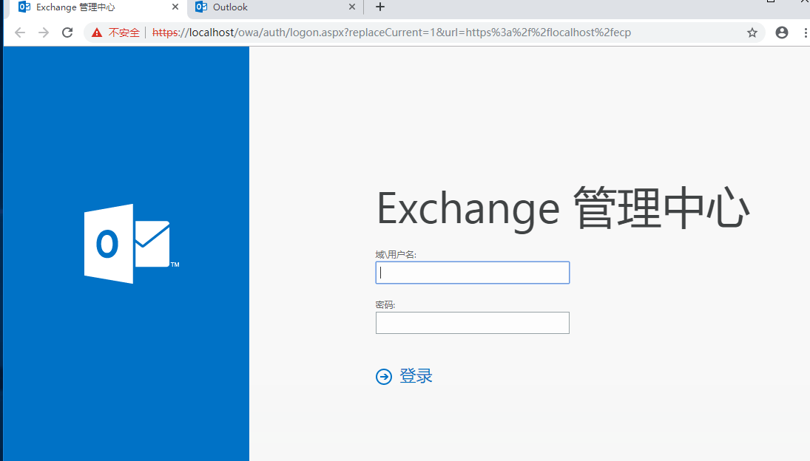

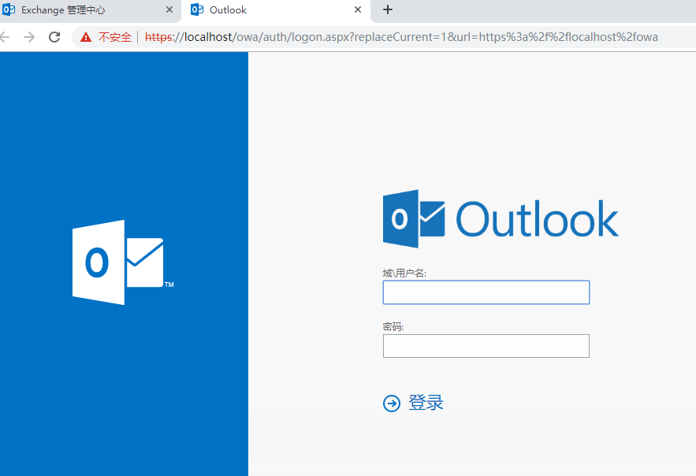

---

**Source & Reference**
- [Exchange Server 2016 正式安装部署](https://blog.csdn.net/zhaowei198311/article/details/107391577)
- [Exchange系列文章——Exchange2019部署安装](https://www.xiaobei.us/archives/775.html)
- [规划和部署 Exchange Server 2019](https://docs.microsoft.com/zh-cn/exchange/plan-and-deploy/plan-and-deploy?view=exchserver-2019)
- [Exchange Server 2019 必备组件](https://docs.microsoft.com/zh-cn/exchange/plan-and-deploy/prerequisites?view=exchserver-2019)
- [Windows 2019 Server issues with Installing Exchange](https://www.reddit.com/r/sysadmin/comments/dg58ft/windows_2019_server_issues_with_installing/)
- [Enable UAC Prompt for Built-in Administrator in Windows 10](https://winaero.com/enable-uac-prompt-built-in-administrator-windows-10/)
- [在sever2019上安装exchange2016出错怎么解决](https://social.technet.microsoft.com/Forums/zh-CN/4f5566df-7b5a-4cd2-b846-27eee41ab230/22312sever2019199782343335013exchange2016209863816924590200403529920915?forum=exchangeserverzhchs)
- [Exchange Server 必备组件 2016](https://docs.microsoft.com/zh-cn/exchange/plan-and-deploy/prerequisites?view=exchserver-2016)
