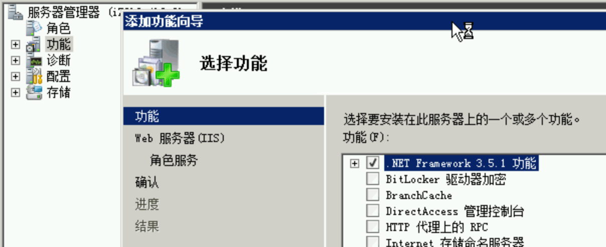
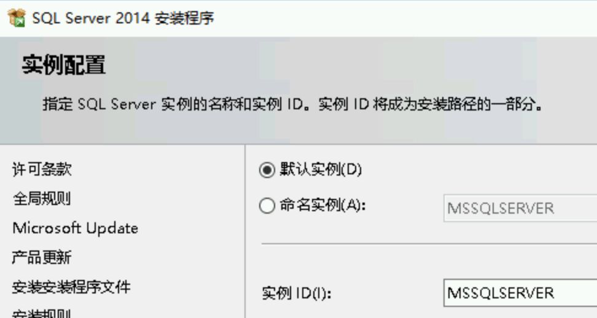
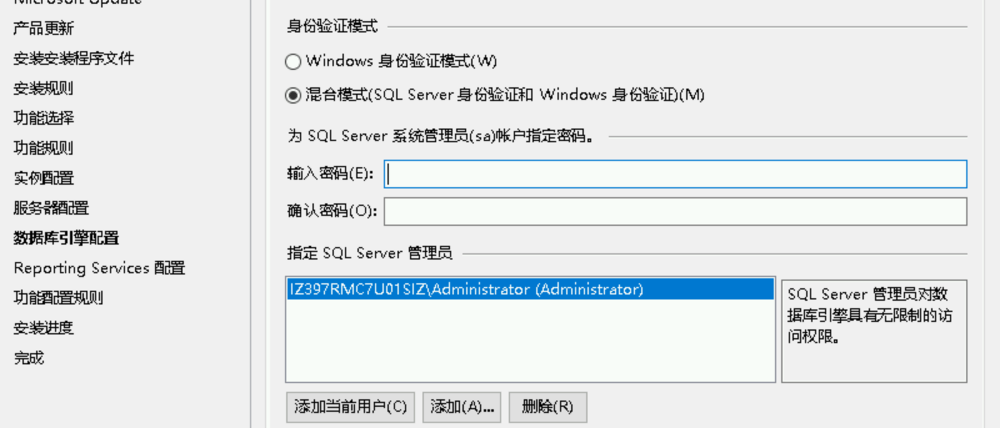
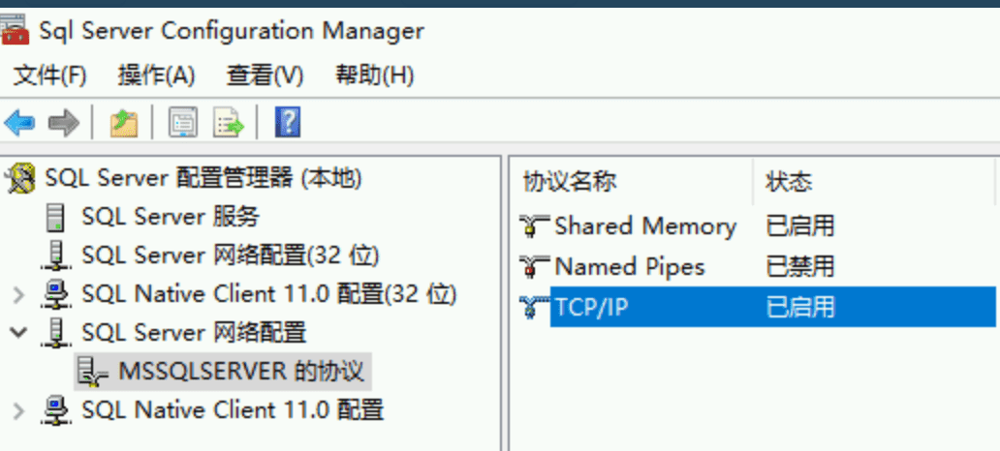
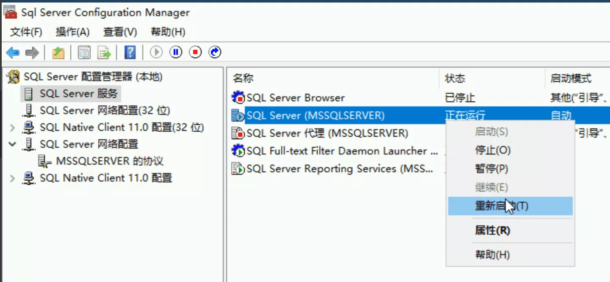
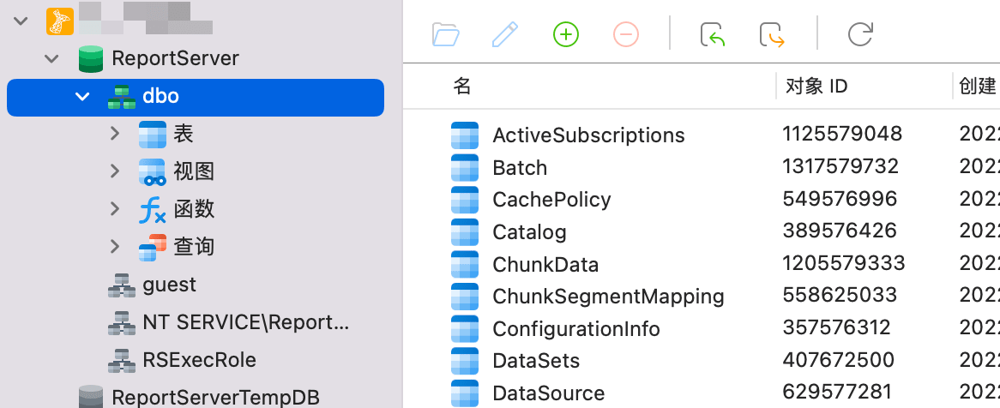

# MSSQL 搭建

---

先通过 ps 脚本安装 chrome

```
set-ExecutionPolicy Unrestricted
curl -o f8x.ps1 https://f8x.io/ps1
Unblock-File .\f8x.ps1
.\f8x.ps1
```

在看到 Successfully installed chrome 的时候就可以 ctrl+c 退出 ps 脚本了

访问 https://www.microsoft.com/zh-CN/download/details.aspx?id=42299 ,下载 SQLEXPRADV_x64_CHS.exe

通过服务器管理器，添加功能，安装 .NET Framework 3.5,安装完毕后,运行 SQLEXPRADV_x64_CHS.exe



一路下一步,选择 默认实例



身份认证模式选择 混合模式,密码自定义,比如这里改为 Abcd1234!!



然后一路下一步即可

安装完毕后，打开 SQL Server 配置管理器

点击 SQL Server 网络配置，启用 tcp/ip，重启 sql server 服务，这样可以远程连接，SqlServer 服务使用两个端口：TCP-1433、UDP-1434。





用工具连接测试



确认可以访问
