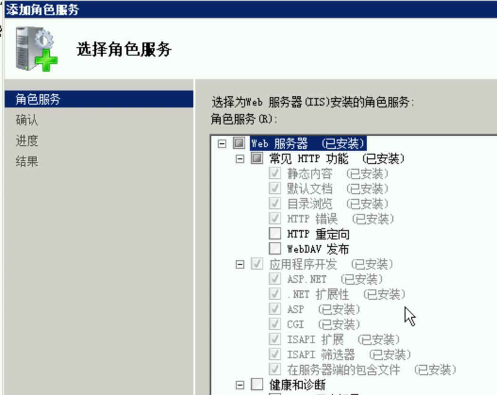
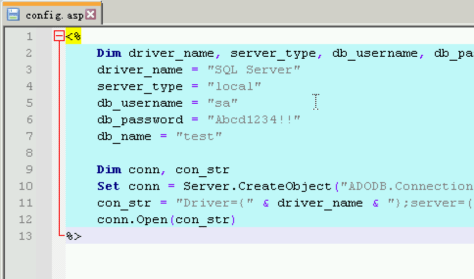
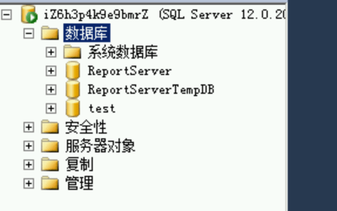
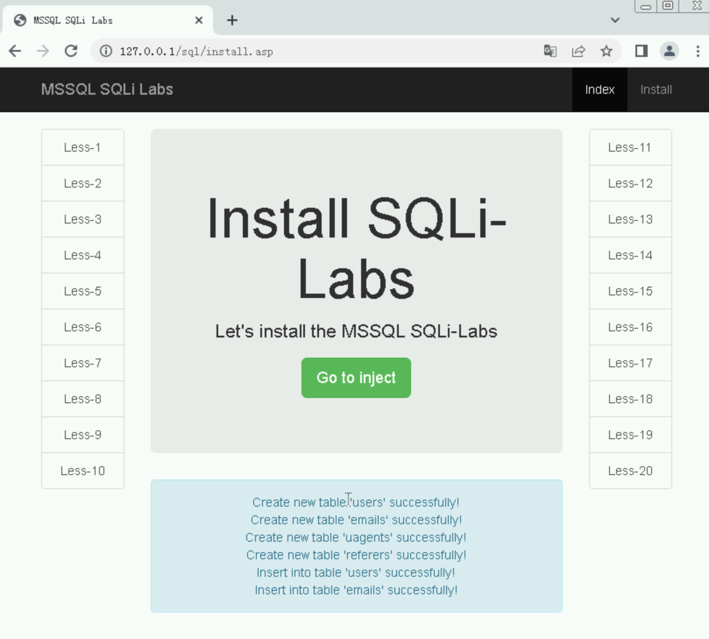

# asp站点搭建

---

服务器管理器, 新增角色，开启 iis 服务,asp,aspx 管理控制台啥的都勾选



访问 http://localhost/ ,确认可以访问即可

以 [Larryxi/MSSQL-SQLi-Labs](https://github.com/Larryxi/MSSQL-SQLi-Labs) 靶场环境搭建为例

```
curl -o MSSQL-SQLi-Labs-master.zip https://github.ffffffff0x.com/https://github.com/No-Github/Archive2/releases/download/0.0.0/MSSQL-SQLi-Labs-master.zip
```

下载解压放到 iis 目录下,比如我这里放到 /sql 文件夹下,修改 config.asp



进入数据库管理工具，在MSSQL数据库中新建一个 test 数据库



访问本地 localhost/sql/install.asp



可以看到初始化配置成功
