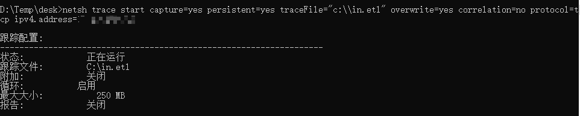
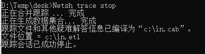
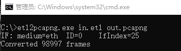

# 本地抓包

---

## 开启记录功能

Windows 系统自带的 netsh 中的 trace 功能能够实现不安装任何第三方依赖库，在命令行下进行抓包

```
netsh trace start capture=yes persistent=yes traceFile="c:\\in.etl" overwrite=yes correlation=no protocol=tcp ipv4.address=192.168.1.1 keywords=ut:authentication
```



- capture=yes： 开启抓包功能
- persistent=yes： 系统重启不关闭抓包功能，只能通过Netsh trace stop关闭
- traceFile： 指定保存记录文件的路径
- overwrite=yes： 如果文件存在，那么对其覆盖
- correlation=no： 不收集关联事件
- protocol=tcp： 抓取TPC协议
- ipv4.address=192.168.62.130： 限定只抓和服务器IP相关的数据包
- keywords=ut:authentication： 关键字为ut:authentication

记得 `ipv4.address=` 改成本机 IP

同级目录下会生成系统的配置文件压缩包，后缀名为.cab

## 关闭记录功能

这里需要手动关闭
```
netsh trace stop
```



## 转换格式

关闭功能后，系统会将捕获到的数据包保存为 etl 结尾的文件

etl 文件无法直接打开，需要借助工具 windows message analyzer 将其转换成. cap 格式 (Wireshark 能够识别)

目前 windows message analyzer 已经不在更新,微软官网也取消了下载链接,并推荐使用 https://github.com/microsoft/etl2pcapng 来代替

```
etl2pcapng.exe in.etl out.pcapng
```



---

## Source & Reference

- [渗透技巧——利用netsh抓取连接文件服务器的NTLMv2 Hash](https://xz.aliyun.com/t/1945)
- [监听445端口抓v2数据](https://xz.aliyun.com/t/8543)
