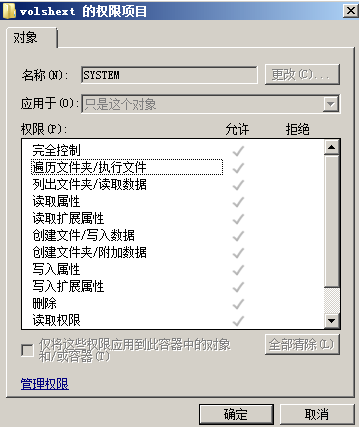
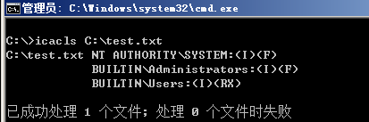
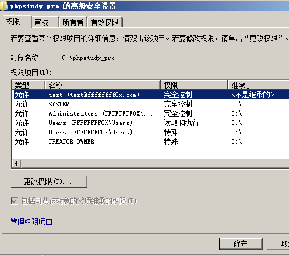

# ACL

---

## 什么是 ACL

windows 系统中的 ACL(Access Control List)，用来表示组与用户权限的列表。比如文件、注册表的权限都包括 ACL，它用来表示哪些组与用户具有操作权限，其实主要是一组规则，定义哪些组与用户等对特定 AD 对象具有哪些权限。

**ACL**

Access Control List，用来表示用户（组）权限的列表，包括 DACL 和 SACL；

**ACE**

Access Control Entry，ACL 中的元素；

**DACL**

Discretionary Access Control List，用来表示安全对象权限的列表；

**SACL**

System Access Control List，用来记录对安全对象访问的日志；

---

具体实现对某个文件进行访问，系统将做以下判断：
- 无 DACL，系统将允许访问，也就是系统内的所有组与用户都没有做限制；
- 有 DACL，无 ACE，系统将拒绝所有访问，也就是系统内的组与用户有限制，但是没有 ACE 也就是不允许任何操作；
- 有 DACL，有 ACE，将就是按照 ACE 的内容去执行相应组与用户的限制，只有对应的 ACE 可以进行操作；

查看文件的 ACL


选择一条 DACL 包含多个 ACE，表示具有的权限如下



---

## 针对 ACL 的操作

### icacls 操作 ACL

查看指定文件的 ACL
```
icacls C:\test.txt
```



其中(OI)代表对象继承 (CI)代表容器继承 (F)代表完全访问：

备份指定文件 (包括当前目录及其子目录中的文件) 的 ACL
```
icacls C:\test.txt /save AclFile /t
```

还原指定文件(包括当前目录及其子目录中的文件)的ACL(注意这里还原的路径需要为先前备份的路径的上一级)
```
icacls C:\ /restore AclFile /t
```

添加用户对指定文件的完全访问权限
```
icacls C:\test.txt /grant test:(OI)(CI)(F) /t
```



移除用户对指定文件(包括当前目录及其子目录中的文件)的完全访问权限
```
icacls C:\test.txt /remove test1 /t
```

---

### powershell 操作 ACL

查看指定路径的ACL
```
Get-Acl -Path 'C:\test'| Format-Table -wrap
```


添加用户 test1 对指定文件的完全访问权限
```
function Add-ACL{
    [CmdletBinding()]
    Param (
        [Parameter(Mandatory = $True)]
        [String]
        [ValidateNotNullOrEmpty()]
        $Path
    )

    $acl = Get-Acl -Path $Path
    $person = [System.Security.Principal.NTAccount]"test1"
    $access = [System.Security.AccessControl.FileSystemRights]"FullControl"
    $inheritance = [System.Security.AccessControl.InheritanceFlags]"ObjectInherit,ContainerInherit"
    $propagation = [System.Security.AccessControl.PropagationFlags]"None"
    $type = [System.Security.AccessControl.AccessControlType]"Allow"
    $rule = New-Object System.Security.AccessControl.FileSystemAccessRule( `
    $person,$access,$inheritance,$propagation,$type)
    $acl.AddAccessRule($rule)
    Set-Acl $Path $acl
}
Add-ACL -Path 'C:\test'
```

移除用户 test1 对指定文件的完全访问权限
```
function Remove-ACL{
    [CmdletBinding()]
    Param (
        [Parameter(Mandatory = $True)]
        [String]
        [ValidateNotNullOrEmpty()]
        $Path
    )

    $acl = Get-Acl -Path $Path
    $person = [System.Security.Principal.NTAccount]"test1"
    $access = [System.Security.AccessControl.FileSystemRights]"FullControl"
    $inheritance = [System.Security.AccessControl.InheritanceFlags]"ObjectInherit,ContainerInherit"
    $propagation = [System.Security.AccessControl.PropagationFlags]"None"
    $type = [System.Security.AccessControl.AccessControlType]"Allow"
    $rule = New-Object System.Security.AccessControl.FileSystemAccessRule( `
    $person,$access,$inheritance,$propagation,$type)
    $acl.RemoveAccessRule($rule)
    Set-Acl $Path $acl
}
Remove-ACL -Path 'C:\test'
```

添加用户test1对指定文件(包括当前目录及其子目录中的文件)的完全访问权限
```
function Add-ACL{
    [CmdletBinding()]
    Param (
        [Parameter(Mandatory = $True)]
        [String]
        [ValidateNotNullOrEmpty()]
        $Path
    )

    $acl = Get-Acl -Path $Path
    $person = [System.Security.Principal.NTAccount]"test1"
    $access = [System.Security.AccessControl.FileSystemRights]"FullControl"
    $inheritance = [System.Security.AccessControl.InheritanceFlags]"None"
    $propagation = [System.Security.AccessControl.PropagationFlags]"None"
    $type = [System.Security.AccessControl.AccessControlType]"Allow"
    $rule = New-Object System.Security.AccessControl.FileSystemAccessRule( `
    $person,$access,$inheritance,$propagation,$type)
    $acl.AddAccessRule($rule)
    Set-Acl $Path $acl
}
Add-ACL -Path 'C:\test'
$fileList = Get-ChildItem 'C:\test' -recurse
Foreach($file in $fileList)
{
    $file.fullname
    Add-ACL -Path $file.fullname
}
```

移除用户test1对指定文件(包括当前目录及其子目录中的文件)的完全访问权限
```
function Remove-ACL{
    [CmdletBinding()]
    Param (
        [Parameter(Mandatory = $True)]
        [String]
        [ValidateNotNullOrEmpty()]
        $Path
    )

    $acl = Get-Acl -Path $Path
    $person = [System.Security.Principal.NTAccount]"test1"
    $access = [System.Security.AccessControl.FileSystemRights]"FullControl"
    $inheritance = [System.Security.AccessControl.InheritanceFlags]"None"
    $propagation = [System.Security.AccessControl.PropagationFlags]"None"
    $type = [System.Security.AccessControl.AccessControlType]"Allow"
    $rule = New-Object System.Security.AccessControl.FileSystemAccessRule( `
    $person,$access,$inheritance,$propagation,$type)
    $acl.RemoveAccessRule($rule)
    Set-Acl $Path $acl
}
Remove-ACL -Path 'C:\test'
$fileList = Get-ChildItem 'C:\test' -recurse
Foreach($file in $fileList)
{
    Remove-ACL -Path $file.fullname
}
```

---

### 注册表操作 ACL

查看指定路径的ACL：
```
Get-Acl -Path 'HKLM:\SAM'| Format-Table -wrap
```

获得Access项的具体内容：
```
$acl = Get-Acl -Path 'HKLM:\SAM'
$acl.Access
```

添加用户test1对指定路径(包括当前注册表项及其子健)的完全访问权限
```
$acl = Get-Acl HKLM:\SAM
$person = [System.Security.Principal.NTAccount]"test1"
$access = [System.Security.AccessControl.RegistryRights]"FullControl"
$inheritance = [System.Security.AccessControl.InheritanceFlags]"ObjectInherit,ContainerInherit"
$propagation = [System.Security.AccessControl.PropagationFlags]"None"
$type = [System.Security.AccessControl.AccessControlType]"Allow"
$rule = New-Object System.Security.AccessControl.RegistryAccessRule( `
$person,$access,$inheritance,$propagation,$type)
$acl.AddAccessRule($rule)
Set-Acl HKLM:\SAM $acl
```

移除用户test1对指定路径(包括当前注册表项及其子健)的完全访问权限
```
$acl = Get-Acl HKLM:\SAM
$person = [System.Security.Principal.NTAccount]"test1"
$access = [System.Security.AccessControl.RegistryRights]"FullControl"
$inheritance = [System.Security.AccessControl.InheritanceFlags]"ObjectInherit,ContainerInherit"
$propagation = [System.Security.AccessControl.PropagationFlags]"None"
$type = [System.Security.AccessControl.AccessControlType]"Allow"
$rule = New-Object System.Security.AccessControl.RegistryAccessRule( `
$person,$access,$inheritance,$propagation,$type)
$acl.RemoveAccessRule($rule)
Set-Acl HKLM:\SAM $acl
```

---

**Source & Reference**
- [关于windows下的ACL与dcsync](https://my.oschina.net/u/4587690/blog/4696089)
- [渗透技巧——Windows下的Access Control List](https://3gstudent.github.io/3gstudent.github.io/%E6%B8%97%E9%80%8F%E6%8A%80%E5%B7%A7-Windows%E4%B8%8B%E7%9A%84Access-Control-List/)
