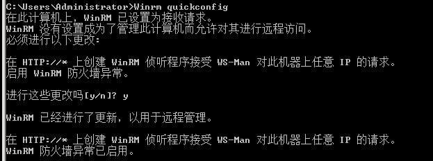
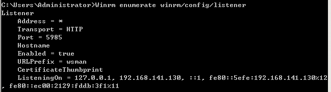
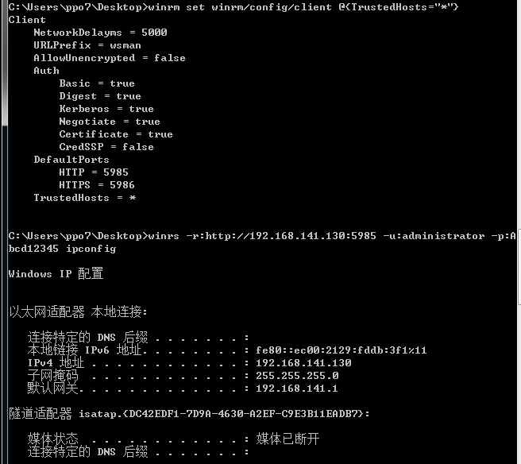

# WinRM

---

**什么是 WinRM**

Windows 远程管理（WinRM）是 WS-Management Protocol 的 Microsoft 实现。

WS-Management 协议是一种基于 SOAP 的防火墙友好协议，旨在用于系统查找和交换管理信息。WS-Management 协议规范的目的是为企业系统提供互操作性和一致性，其对防火墙友好的协议，允许来自不同供应商的硬件和操作系统进行互操作。借助 winrm.exe 和 powershell，管理员可以使用 WS-Management 协议远程执行大多数 Cmd.exe 命令、获取远程机器信息。在内网中，可以借助 WinRM 来进行横向移动或者后门驻留。从 Vista 开始，WinRM 成为 windows 默认组件。其在 2008 开始，作为默认服务启动，但默认不开启监听模式，因此无法接收、发送数据。Winrm quickconfig 命令可快速使用默认设置配置 WinRM。

```
Winrm quickconfig
```



查看 WinRM 当前监听情况
```
Winrm enumerate winrm/config/listener
```



默认监听 5985 端口 (HTTP)，如果配置了 HTTPS，则默认监听 5986 端口。配置 HTTPS 需要自签名证书

默认情况下，WinRM 只允许域内机器连接。

只有设置 TrustedHosts 或者设置了 HTTPS 之后，其他机器才可以连接到 WinRM。设置信任主机
```
winrm set winrm/config/client @{TrustedHosts="*"}
```

`*` 表示允许任意机器连接

**远程执行**

cmd 下,本地也配置允许任意机器连接,然后访问远程主机 winrm
```
winrs -r:http://192.168.141.130:5985 -u:administrator -p:Abcd12345 ipconfig
```



---

**Source & Reference**
- [WinRM利用](https://mp.weixin.qq.com/s/tHsgK2yybqg6AAGLE50vcg)
