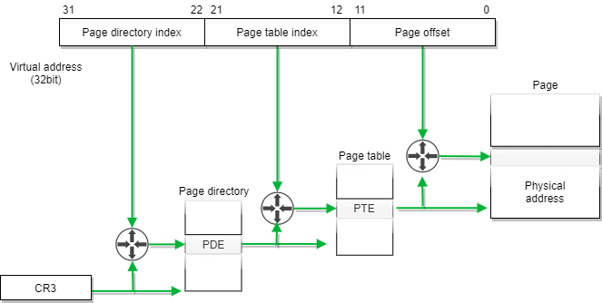
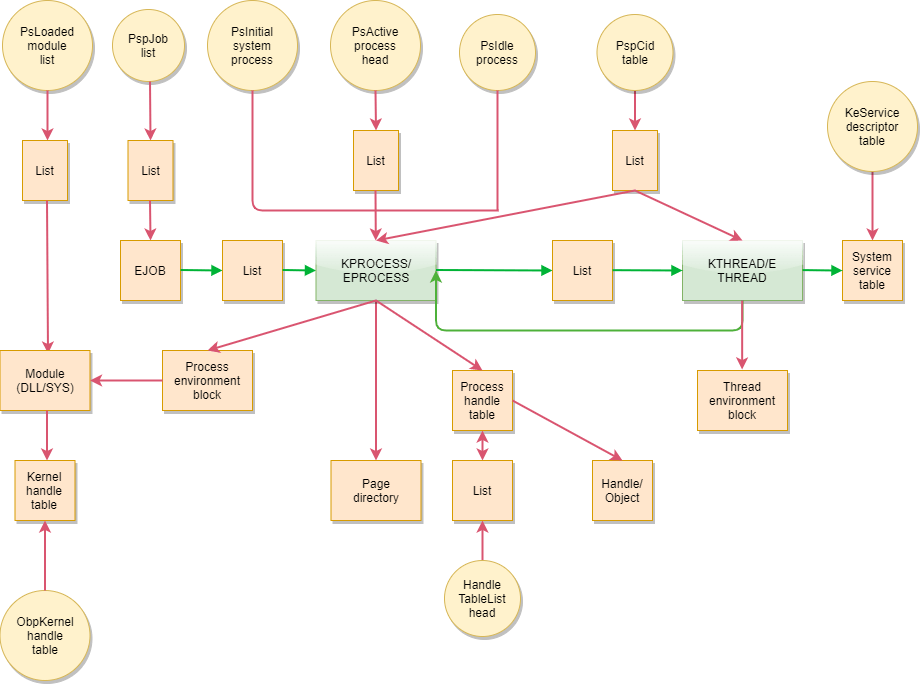

# 内存管理

> 注 : 笔记中拓扑图 drawio 源文件在其图片目录下

---

- 更多内存相关知识点可见 [内存笔记](../../../Develop/计算机基础/内存.md)

Windows 内存管理可概括为三大机制: 虚拟地址空间管理; 物理页面管理; 地址转译和页面交换.

## 虚拟地址空间管理机制

在早期的计算机系统中, 程序员负责管理内存, 后来, 为了减轻程序员的负担, 改由操作系统负责管理内存. 这是程序设计发展史上的一次重要变革. 在多进程运行环境中, 为支持每个进程拥有逻辑上独立的地址空间, 操作系统需使各进程地址空间相互隔离, 互不干扰.

Windows 虚拟地址空间管理目的是实现各进程地址空间隔离, 所以进程所见的是虚拟地址空间. 虚拟地址也称为线性地址, 是 Windows 在保护模式下所使用的逻辑地址, 其空间大小取决于地址总线的宽度, 比如, 在 32 位系统上, 虚拟地址空间大小为 232 字节, 然而 CPU 实际访问的却是物理地址空间. 所谓物理地址, 是 RAM 中存储单元的索引, CPU 通过这组地址线与 RAM 相连, 并通过在这些地址线加上电平信号来读写相应内存单元. 换言之, 在程序设计时使用虚拟地址, 而程序执行时则使用物理地址. 因此, Windows 需要对各进程虚拟地址进行管理, 以便各进程互不干扰地运行于相同的物理内存中.

Windows 的进程虚拟地址空间是通过 VAD 来管理的. VAD 描述的是一段连续的地址空间范围, 被设计为一棵平衡二叉树, 以便 Windows 快速定位一段虚拟地址空间. 随着进程的运行, 不断地有地址范围被保留或提交, 该进程的 VAD 树便逐渐形成. 因此, 借助于 VAD 不仅能够获取进程所使用的虚拟地址空间信息, 还可以获取该进程的其他相关信息.

---

## 物理页面管理机制

由于 Windows 的进程都是在物理内存中执行的，因此 Windows 需要管理物理地址所在的物理内存页面. Windows 系统使用 PFN(page frame number database, 页帧编号数据库) 来描述物理内存各页面的状态. PFN 数据库中的每个 PFN 项对应于一个物理页面, 记录了该页面的使用情况, 包括其状态、对应页表项的地址等信息.

此外, Windows 还维护着一组链表, 分别将相同类型的页面链接起来, 主要包括零化链表、空闲链表、备用链表、修改链表、坏页面链表等. Windows 的虚拟地址转译和页面交换机制是基于这些数据结构实现的.

---

## 地址转译和页面交换机制

Windows 的的地址转译机制，可将进程中所使用的虚拟地址转换为物理内存中的物理地址，从而完成内存数据的定位，为获取内存数据提取支持。

### 地址转译

由于程序使用虚拟地址, 而 CPU 则使用物理地址, 因此, 需借助于 CPU 芯片硬件和操作系统软件配合来实现从虚拟地址到物理地址的转换. 这就是 Windows 系统的虚拟地址转译机制. 转译机制是由 CPU 芯片硬件提供, 而转译中所使用的数据结构则由 Windows 操作系统管理.

Windows 系统采用页式内存管理, 虚拟地址空间是按页 (page) 来管理的, 物理地址空间是按帧 (frame) 来管理的, 页和帧的大小相等. 因此, 进程的虚拟地址页面可实现离散分配, 即, 虚拟地址空间中连续的页面对应于物理地址空间的页帧无需连续.

采用页式内存管理后, 虚拟地址在结构上分为两部分: 页索引和页内偏移. 其中, 页索引是指该虚拟地址在地址映射时的索引编号, 页内偏移则指该地址在页面内部的具体位置. Intel x86 采用分级页表来管理地址映射. 32 位虚拟地址中的页索引部分又被分成页目录索引 (10 位) 和页表索引 (10 位) 两部分.

因此, Intel x86 在解析一个虚拟地址时, 首先根据最高 10 位在页目录中定位其页目录项 PDE(page directory entry), 它指向一个页表; 其次, 根据接下来的 10 位在页表中定位其页表项 PTE(page table entry), 此页表项指定了目标页面的物理地址; 最后, 在此物理地址基础上加上页内偏移量, 得到最终的物理地址. Windows 虚拟地址转译机制如下图所示.

如果 CPU 寄存器中的分页标志位被设置, 那么在执行内存操作机器指令时, CPU 会自动根据页目录和页表中的信息, 把虚拟地址转换成物理地址, 完成该指令操作. 因此, 借由 Windows 的地址转移机制, 可将进程中所使用的虚拟地址转换为物理内存中的物理地址, 从而完成内存数据的定位, 为内存数据获取提供支持.

### Windows页面交换

当进程所需的内存数量大于计算机所安装的 RAM 时, Windows 采用页面交换机制予以处理. Windows 页面交换有两种情况:
- 进程使用了某个尚未得到物理页面的虚拟地址;
    - 这种情况将导致页面换入, 首先由 CPU 触发页面错误异常; 然后, Windows 在页面错误处理例程中为其分配页面, 并设置相关的页表项和页面之间的对应关系; 最后, 进程就可以透明地访问该地址.
- 进程工作集限制其不能拥有更多物理页面.
    - 情况将导致页面换出, 在内存紧缺时, Windows 将不紧急进程的部分代码或数据存放到硬盘文件 Pagefile.sys 中, 腾出物理内存以供他用; 当内存紧缺得以缓解时, 再将硬盘上的进程代码或数据换入内存, 使之继续运行.

由此可见, 页面交换文件是物理内存的一种自然延伸. 就其数据内容而言, 页面交换文件与物理内存是同等的, 只不过受页面调度影响而在不同时刻位于不同物理位置. 所以, 完整的内存数据应包括两部分: 物理内存数据和页面交换文件数据.

### 进程和线程数据结构

在 Windows 中, 进程是系统各种资源的容器, 它定义了一个地址空间作为其基本执行环境; 线程是指令执行序列, 它直接访问所属进程中的资源. 由于 Windows 内核采用层次结构, 进程和线程在微内核层和执行体层上都有对应的数据结构.

Windows 内核使用 NtCreatProcess 函数创建一个进程的过程如下: 首先, 创建一个执行体层进程对象 EPROCESS 和内核层进程对象 KPROCESS; 然后, 创建一个初始的执行体层线程对象 ETHREAD 和内核层线程对象 KTHREAD; 最后, 设置好初始执行环境并参与进程 (线程) 调度.

在微内核层上, 进程和线程的数据结构分别为 KPROCESS 和 KTHREAD, 其中包含了系统资源管理和多控制流并发执行所涉及的基本信息. 进程对象 KPROCESS 提供了线程的基本执行环境, 包括进程地址空间和一组进程范围内公用的参数; 线程对象 KTHREAD 提供了为参与线程调度而必需的各种信息及其维护控制流的状态.

在执行体层上, 进程和线程的数据结构分别为 EPROCESS 和 ETHREAD. 它们涉及操作系统各方面信息, 不仅内嵌了内核层上的进程和线程对象, 而且还包括了更多涉及进程与线程管理的信息. 比如, 在 EPROCESS 中, 包含进程的标识、映像文件、配额限制、锁、与进程的物理内存和虚拟内存相关的成员等; 在 ETHREAD 中, 包含线程的标识、启动地址、执行时间、安全属性等. Windows 内核中的进程与线程间相互关系如下图所示.

由于上述内核数据结构都保存在内存中, 这提示可通过内存取证获取相关进程或线程的信息. 而系统中发生的任何攻击行为, 总是进程 (线程) 执行的结果. 由上图可知, 选择从一个表头出发, 采用顺藤摸瓜的方式, 能够遍历所有 Lists, 枚举出重要信息. 因此, 通过分析、提取此类信息, 能够获取相关攻击行为证据数据. 这也是内存取证的重要依据和理论基础.

---

## Source & Reference

- [内存取证研究与进展](http://www.jos.org.cn/html/2015/5/4821.htm)
