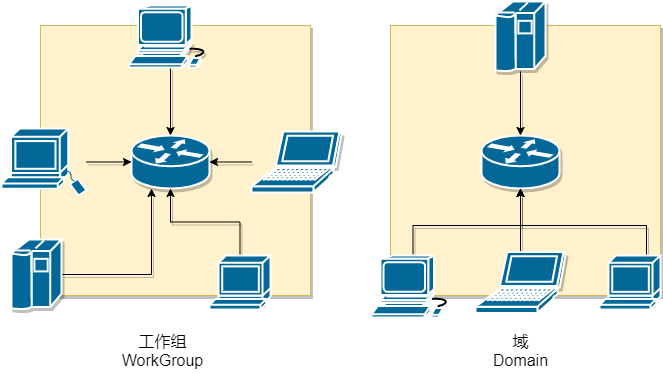
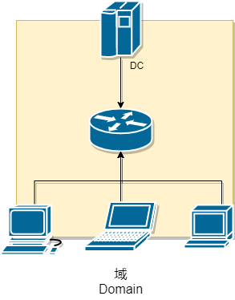
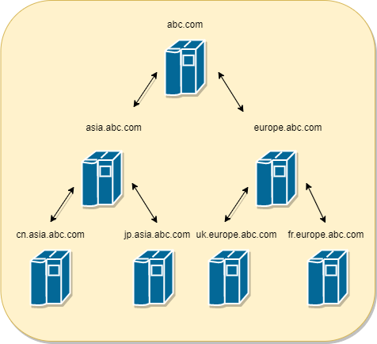
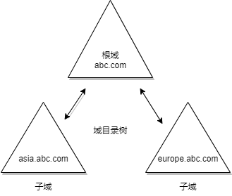
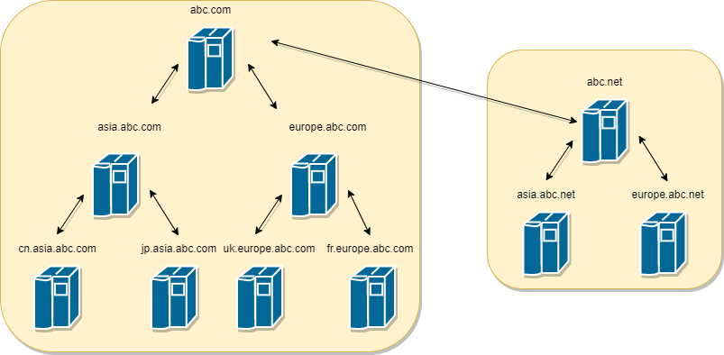
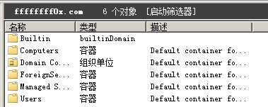

# 域

    

> 注 : 笔记中拓扑图 xmind 源文件在其图片目录下

---

## 大纲

* **[域的原理](#域的原理)**

* **[域结构](#域结构)**
    * [单域](#单域)
    * [域树](#域树)
    * [域林](#域林)
        * [GC 全局编录](#gc)
        * [FSMO](#fsmo)
    * [域信任关系](#域信任关系)

* **[DC 域控](#dc)**
    * [PDC 主域控制器](#pdc)
    * [BDC 辅域控制器](#ndc)
    * [RODC 只读域控制器](#rodc)

* **[AD 活动目录](#ad)**

* **[DNS 域名服务器](#dns域名服务器)**

---

## 前言

**什么是域**

域用来描述一种架构，和“工作组”相对应，是由工作组升级而来的高级架构，域 (Domain)是一个有安全边界的计算机集合 (安全边界，意思是在两个域中，一个域中的用户无法访问另一个域中的资源)。可以简单的把域理解成升级版的“工作组”，相比工作组而言，它有一个更加严格的安全管理控制机制，如果你想访问域内的资源，就必须拥有一个合法的身份登录到该域中,而你对该域内的资源拥有什么样的权限,还需要取决于你在该域中的用户身份。

**域的功能和特点**

- 集中管理，可以集中地管理企业中成千上万分布于异地的计算机和用户
- 便捷的资源访问，能够很容易地定位到域中的资源。用户依次登录就可以访问整个网络资源，集中地身份验证
- 可扩展性，既可以适用于几十台计算机的小规模网络，也可以用于跨国公司

**工作组和域的区别**

工作组是对等网络，域是 B/S 架构，集中式管理

---

## 域的原理

其实可以把域和工作组联系起来理解，在工作组上你一切的设置比如在本机上进行各种策略，用户登录都是登录在本机的，密码是放在本机的数据库来验证的。而如果你的计算机加入域的话，各种策略是域控制器统一设定，用户名和密码也是放到域控制器去验证，也就是说你的账号密码(域用户)可以在同一个域的任何一台计算机登录。

如果说工作组是“免费的旅店”，那么域 (Domain)就是“星级的宾馆”；工作组可以随便出出进进，而域则需要严格控制。“域”的真正含义指的是服务器控制网络上的计算机能否加入计算机组合。一提到组合，势必需要严格的控制。所以实行严格的管理对网络安全是非常必要的。在对等网模式下，任何一台电脑只要接入网络，其他机器就都可以访问共享资源，如共享文件夹等。尽管对等网络上的共享文件可以加访问密码，但是非常容易被破解。

不过在“域”模式下，至少有一台服务器负责每一台联入网络的电脑和用户的验证工作，相当于一个单位的门卫一样，称为域控制器 (Domain Controller，简写为 DC)。

域控制器中包含了这个域内的账户、密码、域内的计算机等信息构成的数据库(AD)。当电脑联入网络时，域控制器首先要鉴别这台电脑是否属于这个域，使用的登录账号是否存在、密码是否正确。如果以上信息有一样不正确，那么域控制器就会拒绝这个用户从这台电脑登录。不能登录，用户就不能访问服务器上有权限保护的资源，他只能以对等网用户的方式访问Windows共享出来的资源，这样就在一定程度上保护了网络上的资源。

要把一台电脑加入域，仅仅使它和服务器在网上邻居中能够相互“看”到是远远不够的，必须要由网络管理员进行相应的设置，把这台电脑加入到域中。这样才能实现文件的共享，集中统一，便于管理

在域控上，即使以域管理员的身份登录，也不能查看域成员的密码，可以给域成员重置密码，但是不能查看到域成员的密码。

---

## 域结构

### 单域

在一般的具有固定地理位置的小公司里，建立一个域就可以满足所需。

---

### 域树

域树指若干个域通过建立信任关系组成的集合。一个域管理员只能管理本域的内部，不能访问或者管理其他的域，二个域之间相互访问则需要建立 信任关系 (Trust Relation)。信任关系是连接在域与域之间的桥梁。父域与子域之间自动建立起了双向信任关系，域树内的父域与子域之间不但可以按需要相互进行管理，还可以跨网分配文件和打印机等设备资源，使不同的域之间实现网络资源的共享与管理，以及相互通信和数据传输。

同一个域树中，父域和子域会自动创建双向信任关系，并且信任关系可传递。所以也就是如下：`abc.com` 自动与 `asia.abc.com` 和 `europe.abc.com` 建立起了双向信任关系，`asia.abc.com` 和 `cn.asia.abc.com` 以及 `europe.abc.com` 与 `fr.europe.abc.com` 自动建立起了双向信任关系。由于信任关系可以传递，所以 `cn.asia.abc.com` 和 `abc.com` 以及 `fr.europe.abc.com` 和 `abc.com` 都自动建立起了双向信任关系。但是 `asia.abc.com` 和 `europe.abc.com` 之间并没有建立起信任关系。所以也就是 `asia.abc.com` 和 `europe.abc.com` 之间不能进行数据共享等操作。他们之间要想进行数据共享等操作，需要手动为他们之间建立信任关系。

**建立域树的好处**

- 如果把不同地理位置的分公司放在同一个域内，那么他们之间信息交互 (包括同步，复制等)所花费的时间会比较长，而且占用的带宽也比较大。因为在同一个域内，信息交互的条目是很多的，而且不压缩；而在域和域之间，信息交互的条目相对较少，而且压缩。
- 子公司可以通过自己的域来管理自己的资源。
- 出于安全策略的考虑，因为每个域都有自己独有的安全策略。比如一个公司的财务部门希望能使用特定的安全策略 (包括帐号密码策略等)，那么可以将财务部门做成一个子域来单独管理

**父域与子域**

在一个域树中，父域可以包含很多子域，子域是相对父域来说的，指域名中的每一个段。子域只能使用父域作为域名的后缀，也就是说在一个域树中，域的名字是连续的。

第一个域称为父域也可以叫根域，各分部的域称为该域的子域。

父域与子域之间默认建立起了双向信任关系。

---

### 域林

域林指若干个域树通过建立信任关系组成的集合。

由一个或多个没有形成连续名称空间的域树组成，林中每个域树都有唯一的名称空间，之间不连续。

可以通过域树之间建立的信任关系来管理和使用整个域林中的资源，从而又保持了原有域自身原有的特性。同一个林中，林根域与其他树根域自动建立双向信任关系. 信任关系可传递.

#### GC

全局编录包含了各个活动目录中每一个对象的最重要的属性，是域林中所有对象的集合。

在域林中，同一域林中的域控制器共享同一个活动目录，这个活动目录是分散存放在各个域的域控制器中的，每个域中的域控制器保存着该域的对象的信息 (用户账号及目录数据库等)。如果一个域中的用户要访问另一个域中的资源，则要先找到另一个域中的资源。为了让用户快速的查找到另一个域内的对象，微软设计了全局编录。全局编录包含了各个活动目录中每一个对象的最重要的属性 (即部分属性)，这样，即使用户或应用程序不知道对象位于哪个域，也可以迅速找到被访问的对象。

#### FSMO

营运主机 (Operation Masters，又称为 Flexible Single Master Operation，即 FSMO)是被设置为担任提供特定角色信息的网域控制站，在每一个活动目录网域中，至少会存在三种营运主机的角色。但对于大型的网络,整个域森林中,存在5种重要的 FSMO 角色.而且这些角色都是唯一的。

- naming master (域命名主机角色) : 域命名主机角色是林范围的角色，每个林一个。此角色用于向林中添加或从林中删除域或应用程序分区。
- infrastructure master (结构主机角色) : 结构主机角色是域范围的角色，每个域一个。此角色供域控制器使用，用于成功运行 adprep /forestprep 命令，以及更新跨域引用的对象的 SID 属性和可分辨名称属性。
- PDC (PDC 模拟器角色) : PDC 模拟器角色是域范围的角色，每个域一个。将数据库更新发送到 Windows NT 备份域控制器的域控制器需要具备这个角色。此外，拥有此角色的域控制器也是某些管理工具的目标，它还可以更新用户帐户密码和计算机帐户密码。
- RID master (RID 主机角色) : RID 主机角色是域范围的角色，每个域一个。此角色用于分配 RID 池，以便新的或现有的域控制器能够创建用户帐户、计算机帐户或安全组。
- schema master (架构主机角色) : 架构主机角色是林范围的角色，每个林一个。此角色用于扩展 Active Directory 林的架构或运行 adprep /domainprep 命令。

---

### 域信任关系

域信任分为单向信任和双向信任。
- 单向信任 : 只能是受信任域访问信任域，而信任域不能访问受信任域。
- 双向信任 : 两个域可以互相访问。

域之间的信任关系，相当于是不同域之间沟通的桥梁。
- 父子信任：父域与子域之间自动建立起了双向信任关系，并且信任关系可以传递。
- 树信任：同一个林中，林根域与其他树根域自动建立双向信任关系。信任关系可传递。
- 快捷方式信任：为了加速认证流程而产生的信任关系。需要管理员手工建立，信任关系可向下传递。
- 林信任：在不更改 AD 结构的情况下，让不同林之间可以相互访问资源。信任关系可向下传递。
- 外部信任/ 跨林快捷方式信任：类似于同林内的快捷方式信任. 单向, 信任关系不可传递：
- 领域信任：为了让 AD 跟非 windows 系统的 kerberos 建立关系而存在的信任。

---

## DC

在域架构中域控是用来管理所有客户端的服务器，它负责每一台联入的电脑和用户的验证工作，域内电脑如果想互相访问首先都得经过它的审核。

域控是域架构的核心，每个域控制器上都包含了 AD 活动目录数据库。

一个域中可能应该要有至少两个域控。一个作为 DC，一个是备份 DC。如果没有第二个备份 DC，那么一旦 DC 瘫痪了，则域内的其他用户就不能登录该域了，因为活动目录的数据库 (包括用户的帐号信息)存储在 DC 中的。而有一台备份域控制器 (BDC)，则至少该域还能正常使用，期间把瘫痪的 DC 恢复了就行了。当域中的一台计算机安装了 AD 后，它就成了域控 DC 了。

### PDC

主域控制器是负责验证域登录和维护域目录数据库的计算机。

### BDC

辅域控制器也叫额外域控制器，是指除第一台域控制器之外的其他域控制器。

一个域只能有一个 PDC，可以有0~若干个 BDC

### RODC

RODC 是 Windows Server 2008 操作系统中的一种新类型的域控制器。借助 RODC，组织可以在无法保证物理安全性的位置中轻松部署域控制器。RODC 承载 Active Directory 域服务 (AD DS) 数据库的只读分区。

**特性**

- 只读 AD DS 数据库

    RODC 上保存了可写域控制器上除帐号密码外的所有对象和属性的只读副本，所有对 AD DS 数据库的更改都只能在可写域控制器上进行，然后再复制给 RODC; 需要对目录进行读取的应用程序可以获取访问权限。请求写入访问的轻型目录应用程序协议（LDAP）应用程序将接收 LDAP 引用响应，该响应将其定向到可写域控制器。

- 单向复制

    因为任何 AD 数据库的更改都不会写入 RODC，所以可写域控制器就不需要从 RODC 上复制任何信息。RODC 只执行正常的入站复制。

- 凭据缓存

    默认情况下，RODC 上除了 RODC 的计算机帐户和特殊账户 krbtgt 之外，不存储用户或计算机凭据。但可以设置密码复制策略将部分用户凭据和计算机凭据从可写域控制器复制到 RODC 并在 RODC 上缓存起来，从而直接服务登录请求。

- 管理员角色分隔

    可以将 RODC 的本地管理权限委派给其他域用户，以分担域管理员的工作。 只读 DNS 可以在 RODC 上安装 DNS，响应名称解析的请求，但该 DNS 也是只读的

---

## AD

Active Directory，活动目录简称 AD，是一个基于 DNS 并以树状的数据结构来组成网络服务存储了有关网络对象的信息，并以此作为基础对目录信息进行合乎逻辑的分层组织，让管理员和用户能够轻松地查找和使用这些信息。通常域都只有一个，在中型或大型的网络中，网域可能会有很多个，或是和其他公司或组织的 AD 相互链接。AD 基于 LDAP。安装了 AD 的服务器称为 DC 域控制器。

如果将企业的内网看成是一本字典，那么内网里的资源就是字典的内容， 活动目录就相当于字典的索引。即活动目录存储的是网络中所有资源的快捷方式，用户通过寻找快捷方式而定位资源。

在活动目录中记录的信息，被分为两大部分，一部分保存在活动目录数据库文件 `NTDS.dit` 中，另一部分保存在被复制的文件系统上。

**逻辑结构**

在活动目录中，管理员可以完全忽略被管理对象的具体地理位置，而将这些对象按照一定的方式放置在不同的容器中。由于这种组织对象的做法不考虑被管理对象的具体地理位置，这种组织框架称为 “逻辑结构”。

活动目录的逻辑结构就包括上面讲到的 组织单元 (OU)、域 (domain)、域树 (tree)、域森林 (forest) 。在域树内的所有域共享一个活动目录，这个活动目录内的数据分散地存储在各个域内，且每一个域只存储该域内的数据。

**活动目录的主要功能**

活动目录为 Microsoft 统一管理的基础平台，其它 ISA、Exchange、SMS 等服务都依赖于这个基础平台。

- 帐号集中管理 ：所有帐号均存在服务器上，方便对帐号的重命名/重置密码。
- 软件集中管理 ：统一推送软件，统一安装网络打印机等。利用软件发布策略分发软件,可以让用户自由选择安装软件。
- 环境集中管理 ：利用 AD 可以统一客户端桌面，IE，TCP/IP 等设置。

**优点**
- 增强安全性 ：统一部署杀毒软件和扫毒任务，集中化管理用户的计算机权限、统一制订用户密码策略等，可监控网络，资料统一管理。
- 更可靠：更少的宕机时间。如：利用 AD 控制用户访问权限，利用群集、负载均衡等技术对文件服务器进行容灾设定，更可靠，宕机时间更少。

**存储方式**

- ntds.dit

    ntds.dit 是 AD 中的数据库文件，它被保存在域控制器 `C:\Windows\NTDS\NTDS.dit` 位置。活动目录的数据库文件（ntds.dit）包含有关活动目录域中所有对象的所有信息，其中包含所有域用户和计算机帐户的密码哈希值。该文件在所有域控制器之间自动同步，它只能被域管理员访问和修改。

    该文件记录的信息有以下三张表：

    - Schema 表 ：这个表中包含了所有可在活动目录创建的对象信息以及他们之间的相互关系。包括各种类型对象的可选及不可选的各种属性。这个表是活动目录数据库中最小的一个表，但是也是最基础的一个表。
    - Link 表 ：Link 表包含所有属性的关联，包括活动目录中所有对象的属性的值。一个用户对象的所有属性的类型，包括每个属性的值及用户所属于的组等信息都属于这个表。这个表要大于 Schema 表，但与 Data 表相比要小。
    - Data 表：活动目录中用户，组，应用程序特殊数据和其他的数据全部保存在 Data 表中。这是活动目录中存储信息最多的一个表，大量的活动目录的资料实际上还是存储在这个表中。

- LDAP

    ldap 是基于 tcp/ip 的轻量级目录访问协议，这种数据库文件后缀都为 `.ldif`,并使用特殊的节点查询语句来获取相应数据。和常规关系型数据库不同的是,ldap 并非按照常规的库、表、字段方式来存储数据，而是按照一种特殊的倒树状结构层级来组织管理数据,此处的树指的就是目录信息树,即 DIT。(目录信息树相当于专门用来进行读操作的数据库。)

    在目录信息树里创建一个条目（entry）时，条目的信息存储在属性（attribute）里，属性又被组合成对象类（objectClass），对象类进一步组成了架构（schema）

    在DIT内部则由N个条目entry所组成,就相当于常规数据库表中每条具体的记录，而条目的内容则是由具有唯一标识名 DN 的属性[Attribute]及属性对应的值[value]所组成的一个集合。

    条目为 ldap 中最基础的操作单位,通常对ldap的增、删、改、查都是以条目为基本单元进行的。

    本地打开 LDAP 编辑器。运行->打开 `adsiedit.msc`（只有域控居于整个域内的配置信息）

**Ntdsutil.exe**

`ntdsutil.exe` 是域控制器自带的域数据库管理工具，从 windows Server 2008 开始就默认自带了。因此我们可以通过 `ntdsutil.exe` 提取出域中所有的域用户信息。以下命令必须在域控上执行：

---

## DNS域名服务器

域控服务器要求 DNS 服务器按名称查找计算机、成员服务器和网络服务。

- 域名解析：DNS 服务器通过其A记录将域名解析成IP地址
- 定位活动目录服务：客户机通过 DNS 服务器上的 SRV 服务记录定位提供某一个服务的计算机

一般情况下，DNS 服务器和域控制器会处在同一台机器上。

**SRV 服务记录**

SRV 服务记录是 DNS 服务器的数据库中支持的一种资源记录的类型，它记录了哪台计算机提供了哪个服务这么一个简单的信息。

一般是为活动目录 AD 设置的应用。DNS 可以独立于活动目录，但是活动目录必须有 DNS 的帮助才能工作。为了活动目录能够正常的工作，DNS 服务器必须支持服务定位 (SRV)资源记录，资源记录把服务名字映射为提供服务的服务器名字。域主机和域控制器使用 SRV 资源记录决定域控制器的 IP 地址和提供服务的服务器IP地址。

---

## 域组

**组的类型**

- 安全组：安全组有安全标识（SID），能够给其授权访问本地资源或网络资源。即能授权访问资源，也可以利用其群发电子邮件
- 通讯组：通迅组没有安全标识（SID），不能授权其访问资源，只能用来群发电子邮件

**组的作用域**

- 本地域组：代表的是对某个资源的访问权限。只能授权其访问本域资源，其他域中的资源不能授权其访问。
- 全局组：创建全局组是为了合并工作职责相似的用户的账户，只能将本域的用户和组添加到全局组。在多域环境中不能合并其他域中的用户。
- 通用组：和全局组的作用一样，目的是根据用户的职责合并用户。与全局组不同的是，在多域环境中它能够合并其他域中的域用户帐户，比如可以把两个域中的经理帐户添加到一个通用组。

**组织单位 OU 的管理**

OU 是 AD 中的容器，可在其中存放用户、组、计算机和其他 OU，而且可以设置组策略

Active Directory 域内的资源是以对象(Object)的形式存在，例如用户、计算机都是对象，而对象是通过属性(Attribute)来描述其特征的，也就是对象本身是一些属性的集合

**容器与组织单位**

容器（Container）与对象相似，它有自己的名称，也是一些属性的集合，不过容器内可以包含其他对象(例如用户、计算机等对象)，还可以包含其他容器。

组织单位(Organization Units，OU)是一个比较特殊的容器，其中除了可以包含其他对象与组织单位之外，还有组策略（Group Policy）的功能。

**默认容器和组织单位**

- Builtin 容器：Builtin 容器是 Active Driectory 默认创建的第一个容器，主要用于保存域中本地安全组。
- Computers 容器：Computers 容器是 Active Driectory 默认创建的第 2 个容器，用于存放 Windows Server 2008 域内所有成员计算机的计算机账号。
- Domain Controllers 组织单位：Domain Controllers 是一个特殊的容器，主要用于保存当前域控制器下创建的所有子域和辅助域。
- Users 容器：Users 容器主要用于保存安装 Active Driectory 时系统自动创建的用户和登录到当前域控制器的所有用户账户。

---

**Source & Reference**
- [内网渗透 | 工作组和域的区别](https://mp.weixin.qq.com/s/5wgCGHrE5MNsKvN9rChBsw)
- [域控理论知识](https://www.cnblogs.com/zoulongbin/p/6027362.html)
- [内网渗透 | Windows域的管理](https://mp.weixin.qq.com/s/YJR951cqqlRiCaczhngfvw)
