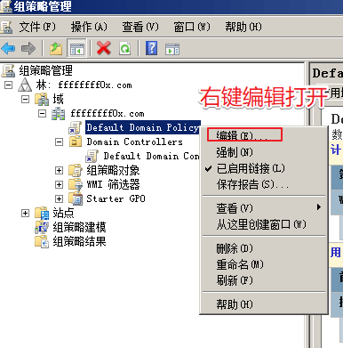

# 组策略

---

**组策略的概念**

组策略（英语：Group Policy）是微软 Windows NT 家族操作系统的一个特性，它可以控制用户帐户和计算机帐户的工作环境。组策略提供了操作系统、应用程序和活动目录中用户设置的集中化管理和配置。组策略的其中一个版本名为本地组策略（缩写“LGPO”或“LocalGPO”），这可以在独立且非域的计算机上管理组策略对象。

通过使用组策略，你可以设置策略设置一次，然后将该设置复制到多台计算机上。 例如，你可以在链接到域的 GPO 中设置多个 Internet Explorer11 安全设置，然后将所有这些设置应用到域中的每台计算机。

根据作用范围不同组策略可划分为多种，并且拥有自己的执行顺序和继承原则。

组策略应用顺序：
- 首先应用本地组策略
- 如果有站点组策略，则应用
- 接着应用域策略
- 最后应用 OU 上的策略
- 如果同一个 OU 上链接了多个 GPO，则按照链接顺序从高到低逐个应用

---

## 本地组策略

### LGP

Local Group Policy，缩写 LGP 或 LocalGPO 是组策略的基础版本，它面向独立且非域的计算机。至少 Windows XP 家庭版中它就已经存在，并且可以应用到域计算机。在 Windows Vista 以前，LGP 可以强制施行组策略对象到单台本地计算机，但不能将策略应用到用户或组。从 Windows Vista 开始，LGP 允许本地组策略管理单个用户和组，并允许使用“GPO Packs”在独立计算机之间备份、导入和导出组策略——组策略容器包含导入策略到目标计算机的所需文件。

## 域策略

当机器安装了域环境的时候,系统管理工具会多出一个功能(组策略管理),通过它，域管理员能够很方便统一地对域内的机器和用户进行统一管理。

域管理员经常会面对一个这样的问题,域成员机子的默认本地管理员密码过于简单，想进行批量修改的时候，这个时候就可以利用组策略来进行任务的批量下发。

1.通过在域中下发脚本来执行
2.在组策略首选项 GPP 中进行设置
3.本地管理员密码解决方案:LAPS(不细说这个内容，这是解决这个问题很好的方案)

首先我们需要了解下 AD 域中两个默认的共享文件夹: SYSVOL NETLOGON

可以用 net share 查看共享文件夹

### NETLOGON

NETLOGON 共享是 SYSVOL 目录中一个文件夹 Scripts 的共享名,顾名思义就是用来保存脚本信息的，是 AD 活动目录安装时候自动创建的。

挂载点: `SYSVOL\domain\SCRIPTS`

---

### SYSVOL

每台 Windows 主机有一个内置的 Administrator 账户以及相关联的密码。大多数组织机构为了安全，可能都会要求更改密码，虽然这种方法的效果并不尽如人意。标准的做法是利用组策略去批量设置工作站的本地 Administrator 密码。但是这样又会出现另一个问题，那就是所有的电脑都会有相同的本地 Administrator 密码。也就是说，如果获取了一个系统的 Administrator 认证凭据，黑客就可以获取他们所有机器的管理权限。

解决办法之一是为认证数据采取 SYSVOL，SYSVOL 是 AD（活动目录）里面一个存储域公共文件服务器副本的共享文件夹，所有的认证用户都可以读取。SYSVOL 包括登录脚本，组策略数据，以及其他域控所需要的域数据，这是因为 SYSVOL 能在所有域控里进行自动同步和共享。

SYSVOL 在域中所有的域控制器之间复制。 Sysvol 文件夹是安装 AD 时创建的，它用来存放 GPO、Script 等信息。同时，存放在 Sysvol 文件夹中的信息，会复制到域中所有 DC 上。

所有的域组策略存储在： `\\<DOMAIN>\SYSVOL\<DOMAIN>\Policies\`

在域中，用户登录（计算机）时，会首先在 SYSVOL 文件查找 GPO 和启动脚本。同时，为了保证系统的正常运行，必须为 SYSVOL 保留足够的空间缓存，而且不能随意删除、改动该文件夹，要不然会出现一些组策略无法启用等报错信息。

该目录由于针对的是域内所有机器和用户，所以域内中的合法用户均可以访问和执行该目录的文件。(普通的域用户也可以)

---

### GPO

`gpmc.msc`

组策略对象，GPO（Group Policy Object），实际上就是组策略设置的集合。你可以用 GPO 来存储不同的组策略信息，然后作用在指定 OU 或者指定作用范围发挥作用。

默认安装完 AD 之后，系统默认会存在两个组策略对象

**Default Domain Policy**

默认域策略

Windows Server 2008 为林中的每个域创建一个默认域策略 GPO。这个域是用于设置一些安全相关策略的主要方法，如密码过期和账户锁定等。

存放的路径: `C:\Windows\SYSVOL\sysvol\test1.local\Policies\{31B2F340-016D-11D2-945F-00C04FB984F9}`

唯一ID(GUID):{31B2F340-016D-11D2-945F-00C04FB984F9} (都是相同的)


**Default Domain Controllers Policy**

默认域控制器策略

管理目标“Domain Controllers”容器，影响“Domain Controllers”容器中的域控制器，域控制器账户单独保存在该容器中。

唯一ID(GUID):｛6AC1786C-016F-11D2-945F-00C04FB984F9｝ (都是相同的)


---

### GPP

在2006年，微软收购了桌面标准的“PolicyMaker”，并重新借此与 win2008 发布了 GPP（组策略首选项）用来完成很多组策略无法进行的系统及用用配置。其中 GPP 最有用的特性，是在某些场景存储和使用凭据，其中包括：
```
映射驱动（Drives.xml）
创建本地用户
数据源（DataSources.xml）
打印机配置（Printers.xml）
创建/更新服务（Services.xml）
计划任务（ScheduledTasks.xml）
更改本地 Administrator 密码
```
这对管理员非常有用，因为 GPP 提供了一个自动化机制，可以作为急需的解决方案（比如脚本）给他们。它提供了有效的方法，利用显式凭据结合组策略部署了计划任务，一次性批量更改了电脑的本地管理的密码。

组策略首选项借助了组策略对象(Group Policy Oject, GPO) 实现了对域中所有资源的管理。




GPP 里面自定义了很多操作，比如本地用户和组的密码控制、计划任务等

---

**Source & Reference**
- [浅析域渗透中的组策略利用](https://xz.aliyun.com/t/7784)
- [内网渗透 | Windows域的管理](https://mp.weixin.qq.com/s/YJR951cqqlRiCaczhngfvw)
