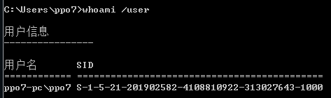
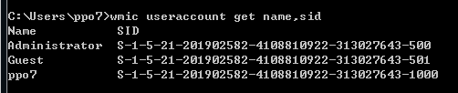

# 角色权限

---

## 用户帐户

在 Windows vista 或是 windows 7中，有两个级别的用户:标准用户和管理员.
- 标准用户是计算机 Users 组的成员;
- 管理员是计算机 Administrators 组的成员.

**Windows 内置用户账户**

权限：System >  Administrator > User > Guest

与windows组件关联的用户账户
- System (本地系统)：为 windows 的核心组件访问文件等资源提供权限
- Local Service (本地服务)：预设的拥有最小权限的本地账户
- Network Service (网络服务)：具有运行网络服务权限的计算机账户

---

## 组账户

组是一些用户的集合

组内的用户自动具备为组所设置的权限

administators 组内的用户，都具备系统管理员的权限，它们拥有对这台计算机最大的控制权限，可以执行整台计算机的管理任务。内置的系统管理员账号 Administrator 就是本地组的成员，而且无法将它从该组删除。如果这台计算机已加入域，则域的 Domain Admins 会自动地加入到该计算机的 Administrators 组内。也就是说，域上的系统管理员在这台计算机上也具备着系统管理员的权限。

Guests 组是提供给没有用户帐户但是需要访问本地计算机内资源的用户使用，该组的成员无法永久地改变其桌面的工作环境。该组最常见的默认成员为用户帐号 Guest。

Power Users 组内的用户具备比 Users 组更多的权利，但是比 Administrators 组拥有的权利更少一些，例如，可以：创建、删除、更改本地用户帐户；创建、删除、管理本地计算机内的共享文件夹与共享打印机；自定义系统设置，例如更改计算机时间、关闭计算机等。但是不可以更改 Administrators，无法夺取文件的所有权、无法备份与还原文件、无法安装删除与删除设备驱动程序、无法管理安全与审核日志。

Users 组内的成员只拥有一些基本的权利，例如运行应用程序，但是他们不能修改操作系统的设置、不能更改其它用户的数据、不能关闭服务器级的计算机。所有添加的本地用户帐户者自动属于 Users 组。如果这台计算机已经加入域，则域的 Domain Users 会自动地被加入到该计算机的 Users 组中。

Remote Desktop Users 组内的成员拥有远程桌面登录的权限。默认 Administrators 组内的成员都拥有远程桌面的权限。

---

## Windows Access Token

Windows Token 其实叫 Access Token(访问令牌)，它是一个描述进程或者线程安全上下文的一个对象。不同的用户登录计算机后， 都会生成一个 Access Token，这个 Token 在用户创建进程或者线程时会被使用，不断的拷贝，这也就解释了 A 用户创建一个进程而该 进程没有 B 用户的权限。

Access Token 种类：
- 主令牌
- 模拟令牌

一般情况下，用户双击运行一个程序，都会拷贝 “explorer.exe” 的 Access Token。

当用户注销后，系统将会使主令牌切换为模拟令牌，不会将令牌清除，只有在重启机器后才会清除。

**Windows Access Token 组成**
- 用户帐户的安全标识符(SID)
- 用户所属的组的 SID
- 用于标识当前登录会话的登录 SID
- 用户或用户组所拥有的权限列表
- 所有者 SID
- 主要组的 SID
- 访问控制列表
- 访问令牌的来源
- 令牌是主要令牌还是模拟令牌
- 限制 SID 的可选列表
- 目前的模拟等级
- 其他统计数据

**SID 安全标识符**

安全标识符是一个唯一的字符串，它可以代表一个账户、一个用户 组、或者是一次登录。通常它还有一个 SID 固定列表，例如  Everyone 这种已经内置的账户，默认拥有固定的 SID。

SID 的表现形式:
- 域 SID-用户 ID
- 计算机 SID-用户 ID
- SID 列表都会存储在域控的 AD 或者计算机本地账户数据库中。

查看用户的SID
```
whoami /user     # 查看系统当前用户的SID
wmic useraccount get name,sid      # 查看所有用户的SID
```





**Windows Access Token 产生过程**

每个进程创建时都会根据登录会话权限由 LSA(Local Security Authority)分配一个 Token(如果 CreaetProcess 时自己指定了 Token, LSA 会用该 Token， 否则就用父进程 Token 的一份拷贝。

---

## Source & Reference

- [彻底理解Windows认证 - 议题解读](https://payloads.online/archivers/2018-11-30/1)
