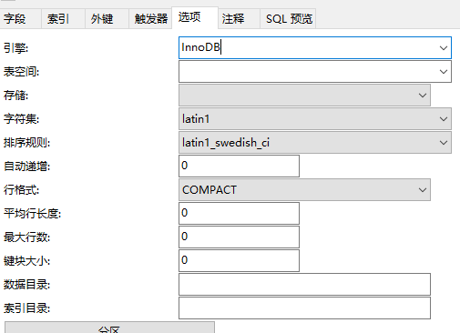

# MySQL大小写问题

**MySQL 查询是不区分大小写的**

Mysql 默认的字符检索策略：
- utf8_general_ci，表示不区分大小写；
- utf8_general_cs表示区分大小写
- utf8_bin 表示二进制比较，同样也区分大小写 。（注意：在 Mysql5.6.10 版本中，不支持 utf8_genral_cs！！！！）

创建表时，直接设置表的 collate 属性为 utf8_general_cs 或者 utf8_bin；如果已经创建表，则直接修改字段的Collation 属性为 utf8_general_cs 或者 utf8_bin。

---

**测试**

新建一个表 test1 ,字段 text,大 A 小 a 2个数据,默认字符集




测试查询语句


可以看到大 A 小 a 都被查询出来了

---

再新建一个表 test2 ,字段 text,大 A 小 a 2个数据,字符集 utf8_bin


测试查询语句


可见,区分了大小写

---

**修改语句**

```
ALTER TABLE xxxxxxxxx DEFAULT CHARACTER SET utf8 COLLATE utf8_bin;
```

---

## Source & Reference

- [Mysql查询英文如何严格区分大小写？](http://www.imooc.com/article/14190)
