# ESXi

---

## 环境搭建

这个安装包，大家用的都是 dell 提供的，然后dell的需要产品服务标签才可以下载，不管，用网友分享的安装包一样可以用
- https://www.dinghui.org/vmware-iso-download.html

vmware 新建虚拟机，操作系统选择 VMware ESX

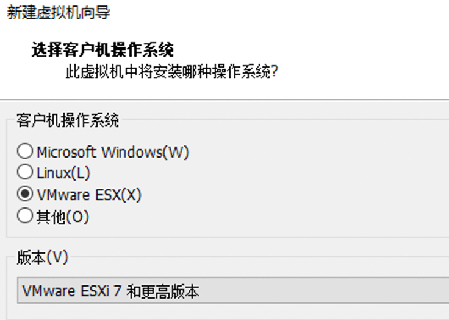

然后一路下一步即可

唯一注意的就是,虚拟机的内存至少选用4G，网络建议选桥接，因为要让 vcenter 能访问到

新建完成后，打开虚拟机

**关于 win10 以后的嵌套虚拟机**

在这一步可能会遇到一个报错 ` 模块 “HV” 启动失败 ` , 查了一下，应该是 windows 的 hyper v 冲突导致的问题

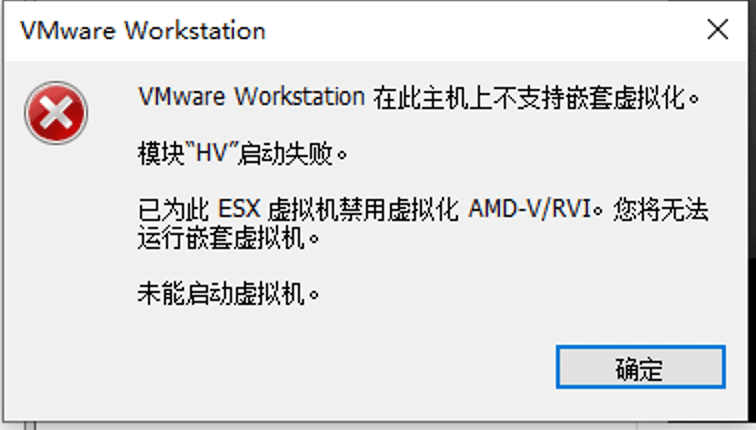

参考文章里的方法得以解决 https://blog.51cto.com/asktom/5039533

如果没有问题可以看到下面的加载页面

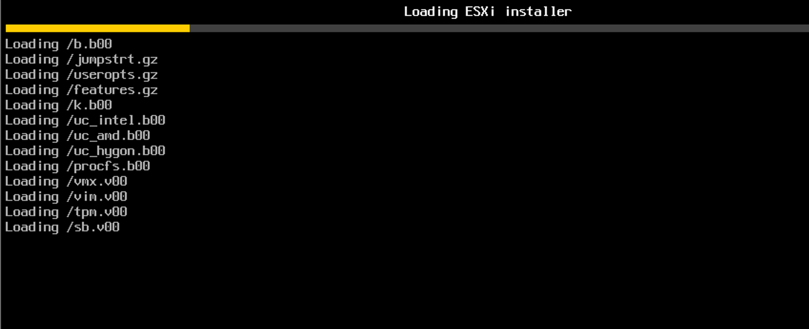

加载 VMkernel 文件

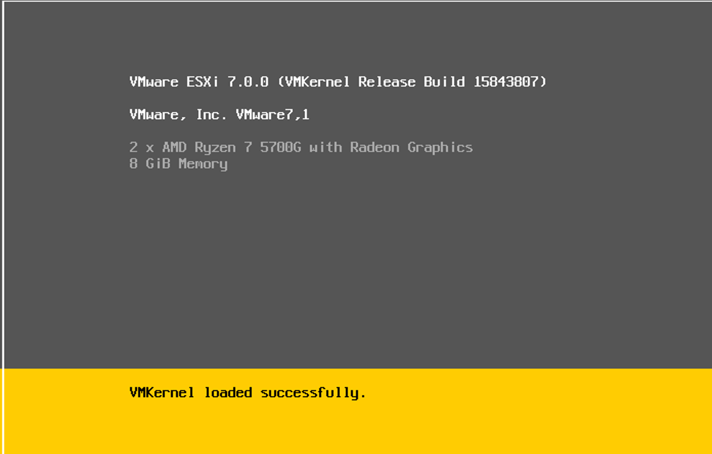

加载文件完成，按 Enter 键开始安装VMware ESXi 7.0

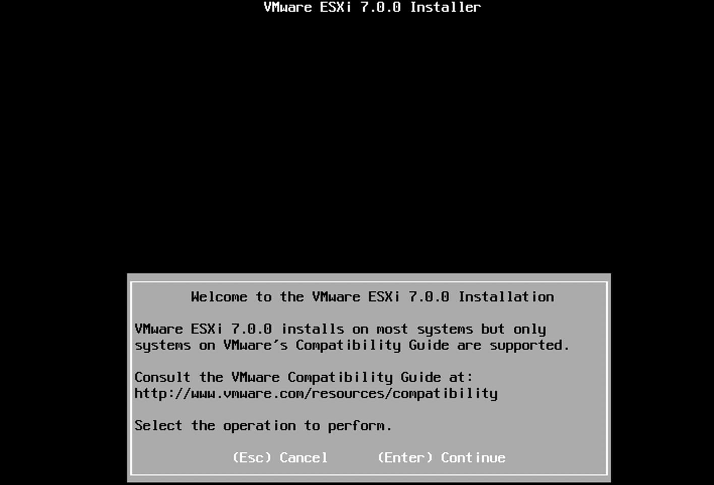

系统出现“End User License Agreement（EULA）”界面，也就是最终用户许可协议，按【F11】键接受“Accept and Continue”，接受许可协议。

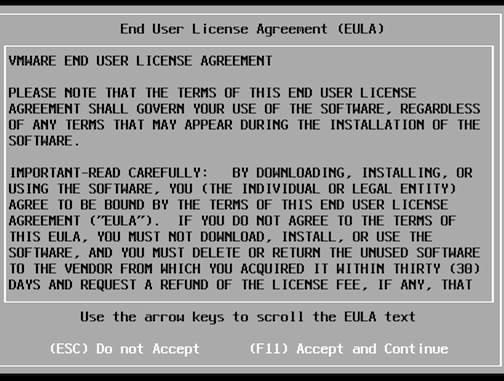

系统提示选择安装VMware ESXi 使用的存储，ESXi支持U盘以及SD卡安装。

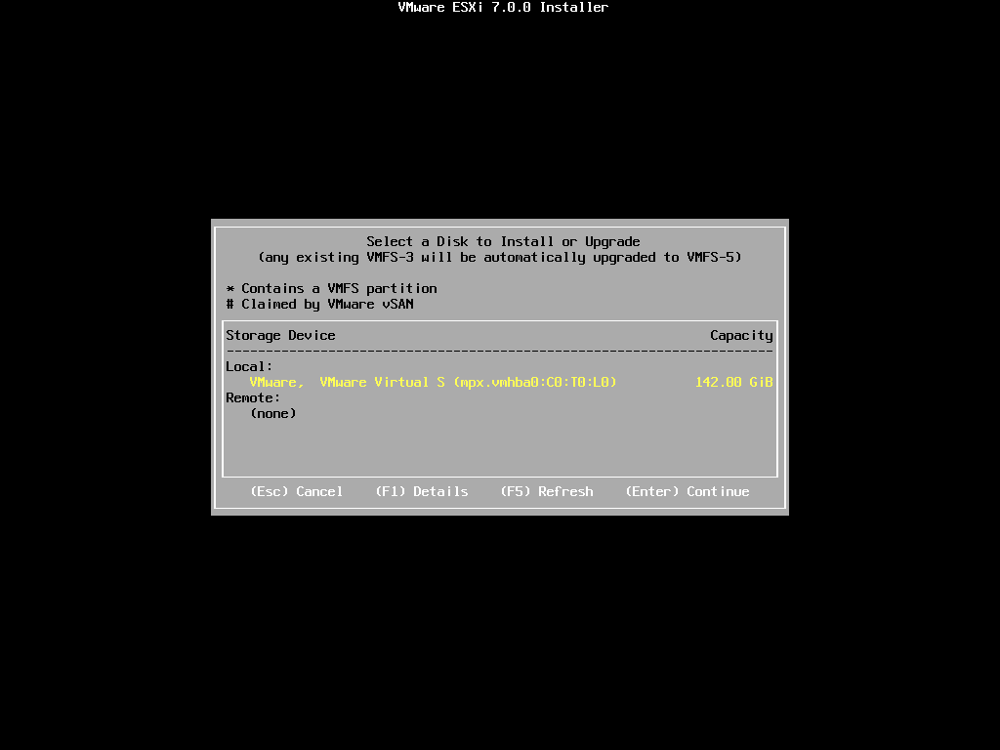

提示选择键盘类型，选择“US Default”，默认美国标准，按【Enter】键继续。系统提示配置root用户的密码，根据实际情况输入，按【Enter】键继续。

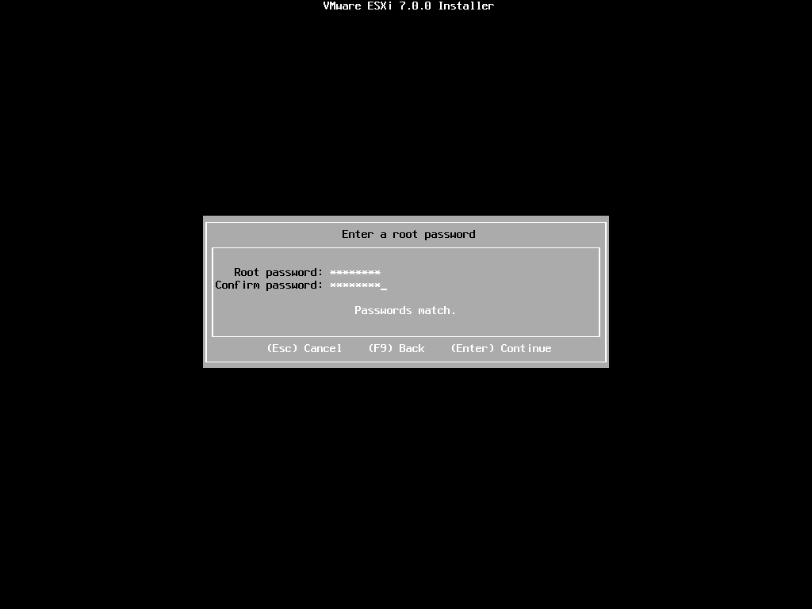

这里配置成 Abcd1234!!

系统提示将安装在刚才选择的存储，按【F11】键开始安装。

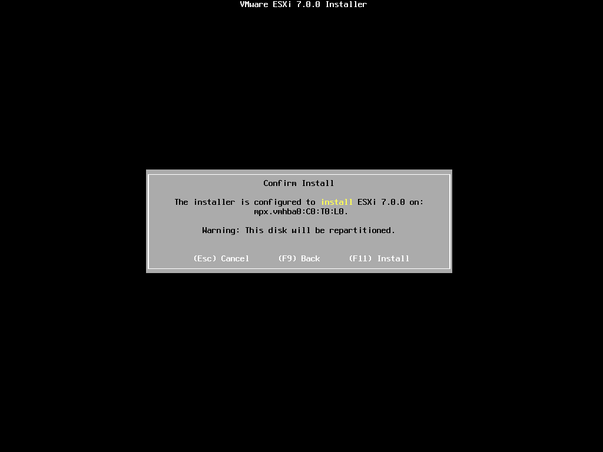

安装的时间取决于服务器的性能，等待一段时间后即可完成 VMware ESXi 7.0 的安装，按【Enter】键重启服务器。

服务器重启完成后，进入 VMware ESXi 7.0 正式界面

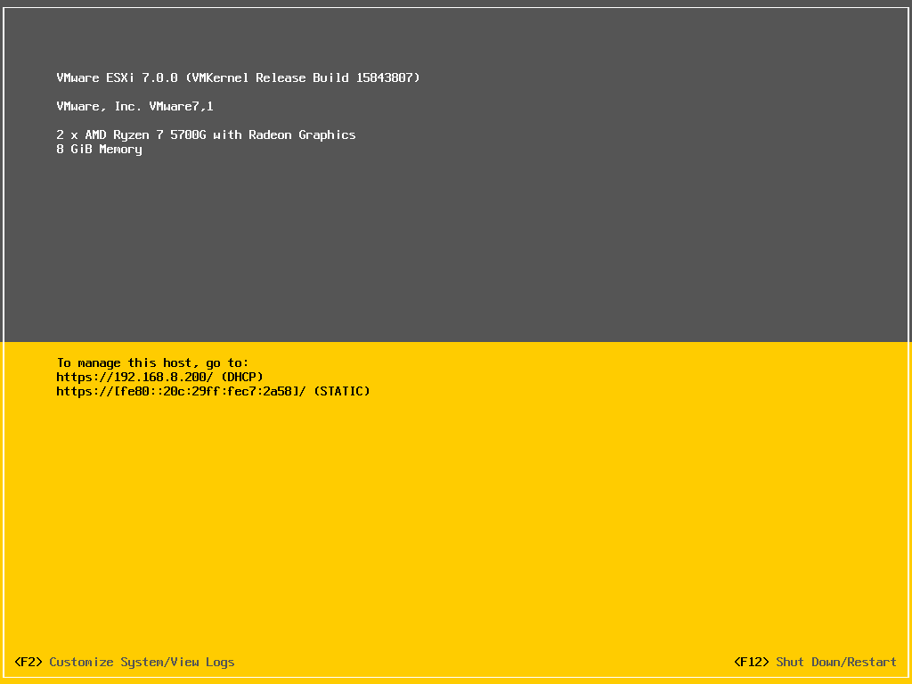

按【F2】键输入 root 用户密码进入主机配置模式。

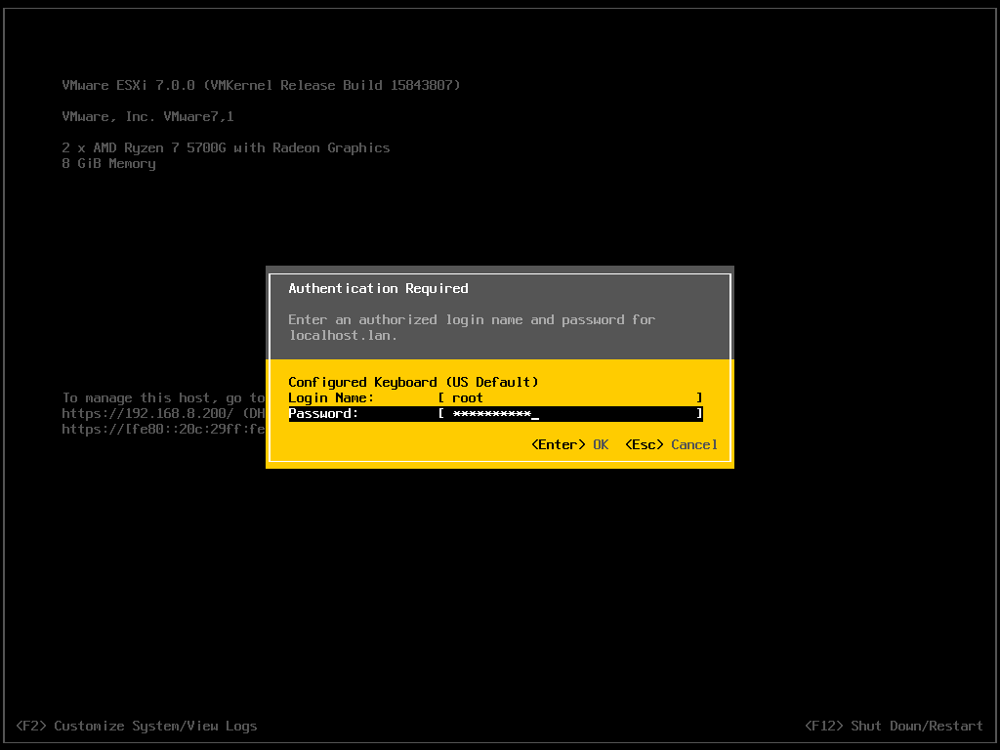

选择 “Configure Management Network” 配置管理网络。

选择 “IPv4 Configuration” 对 IP 进行配置。

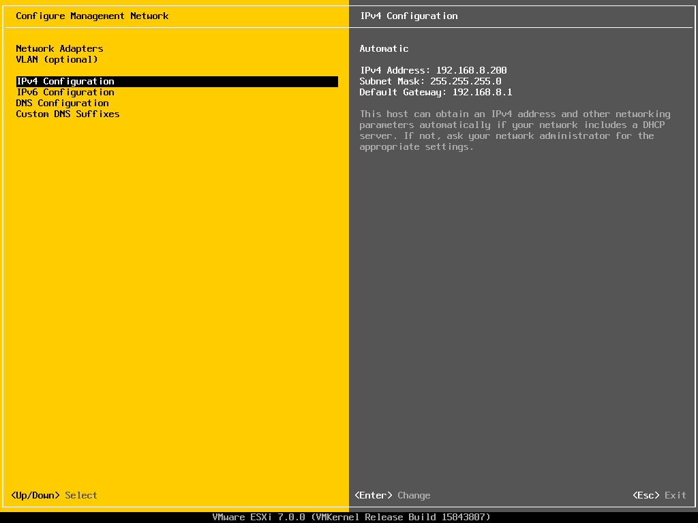

完成主机 IP 配置。

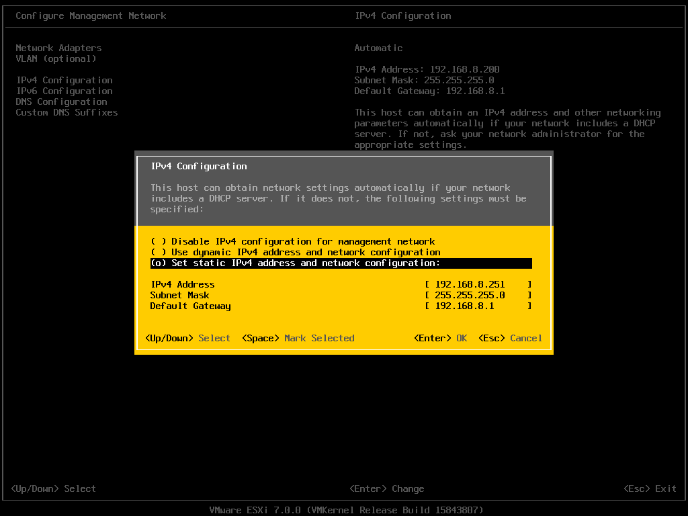

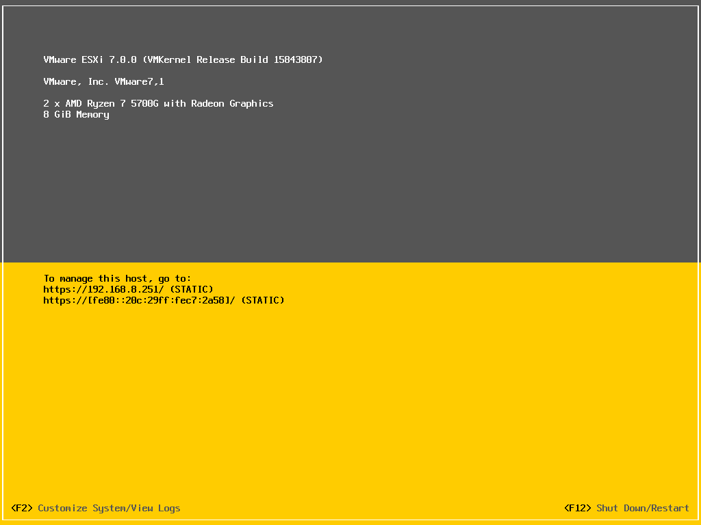

使用浏览器访问 VMware ESXi 7.0 主机测试

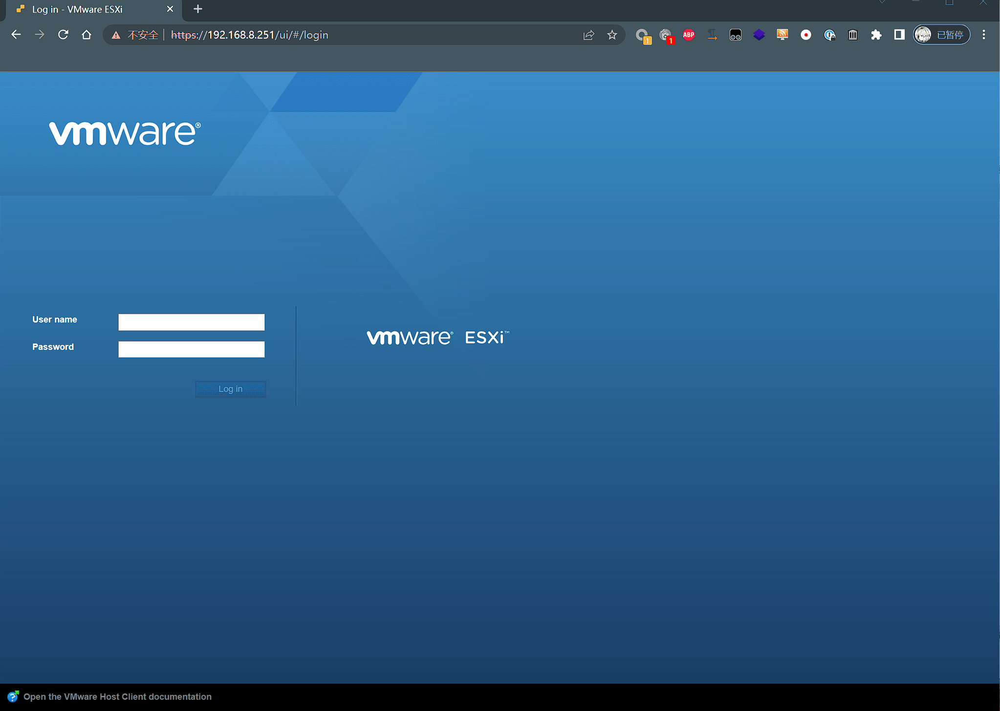

进入 ESXi 7.0 主机操作界面，可以进行基本的配置和操作，比如创建虚拟机，更多的功能实现需要依靠 vCenter Server 来实现。

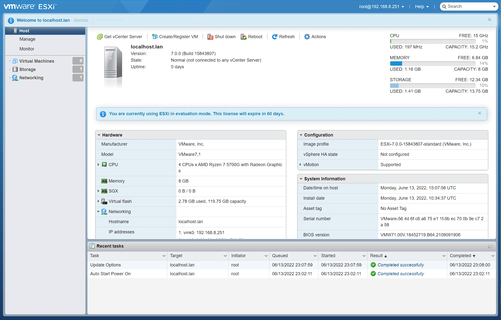

---

## 关于 vcenter 上添加 esxi 报错的问题

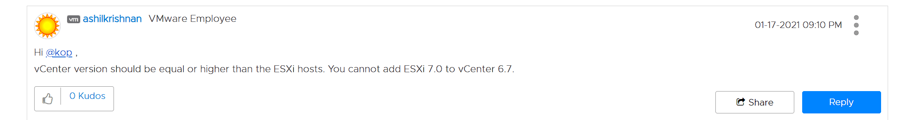

vcenter 版本要大于 esxi,我尼玛。。

---

## Source & Reference
- https://blog.csdn.net/qq_40695642/article/details/108310237
- https://mp.weixin.qq.com/s/S6AUYUev_4p6xTkzY0Ot6g
