# vCenter

---

## 环境搭建

访问 https://customerconnect.vmware.com/patch 下载 iso

下载 VMware-VCSA-all-6.7.0-17028579.iso

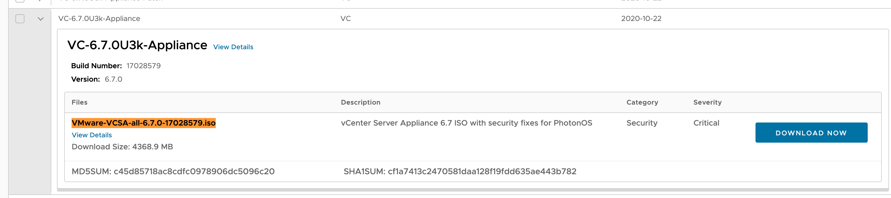

提取里面这个 ova 文件

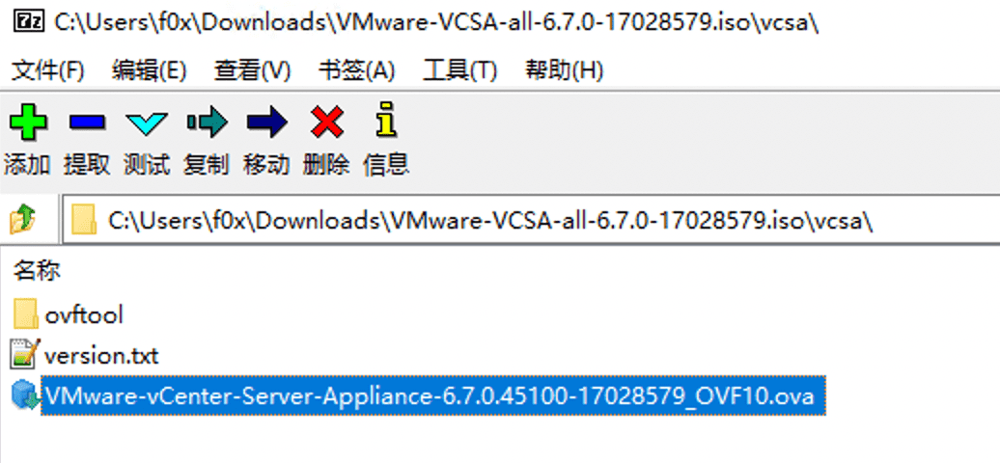

导入到 VMware 虚拟机安装，部署选项选择 Tiny 即可：

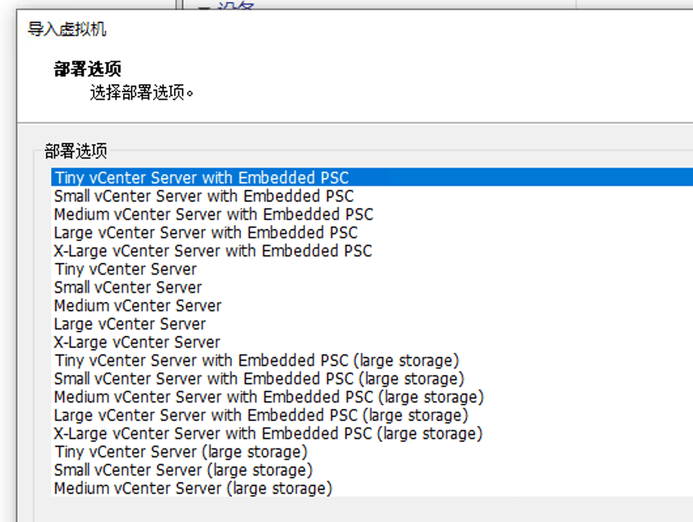

然后按照引导安装，网络配置参考宿主机，设置成相同的网段、相同的网关和 DNS，以便后续顺利访问。

> 首先确认好自己的虚拟机桥接的网卡是哪张，以及桥接的网段 ip 是啥

我这边宿主机 IP 为 192.168.8.130，网关和 DNS 均为 192.168.8.1，子网掩码为 255.255.255.0，那虚拟机设置如下

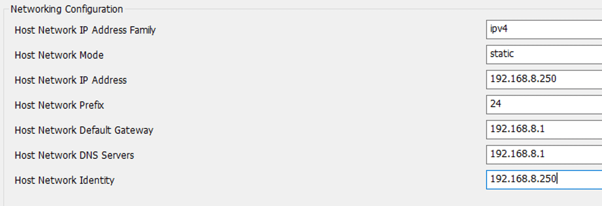

然后配置 sso 密码，和 root 密码，这里为了方便,就配置成 Abcd1234 了.

配置完后，点击导入，进行初始化,稍作等待,即可看到如下的界面

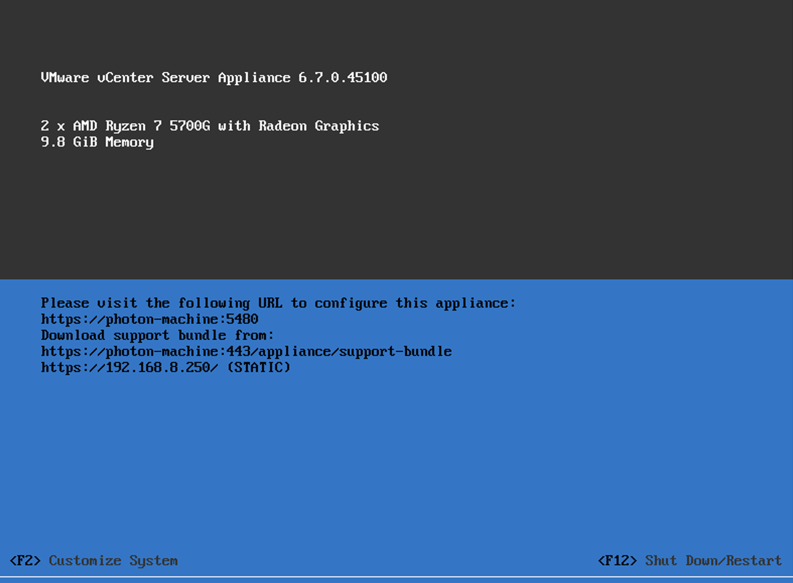

此时域名为 photon-machine，没有对应的 DNS，需要手动修改域名为刚才设置的 IP（192.168.8.250）

按“F2”手动修改域名，“enter”进入网络配置：

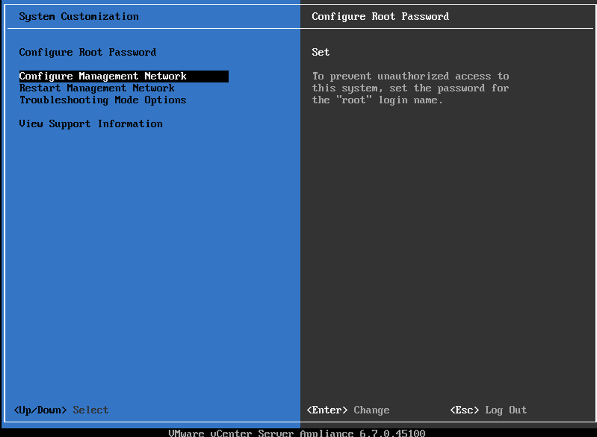

进入 DNS 配置将主机名从默认的 photon-machine 修改为 IP 地址（192.168.8.250）：

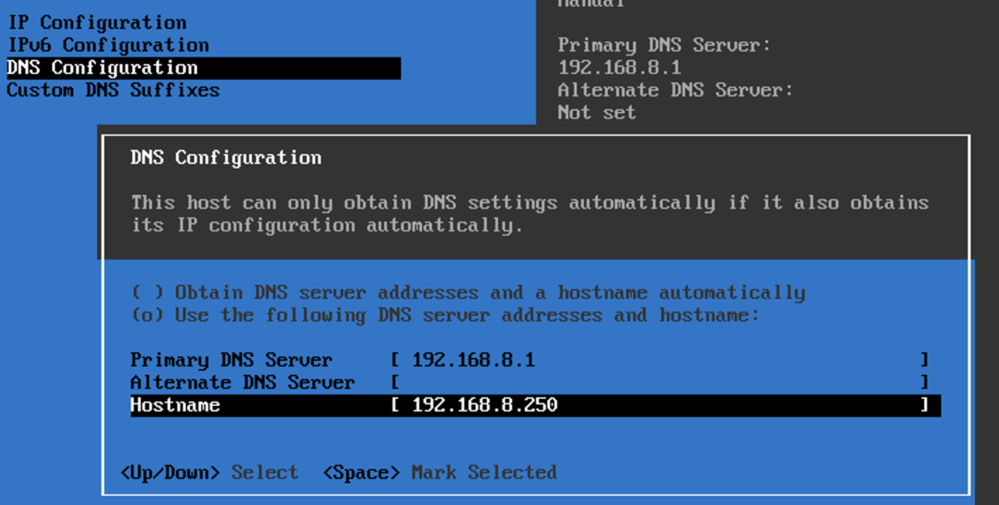

保存，等它自动重启网络

回到开始的页面，这时之前的域名已经变成了 IP：

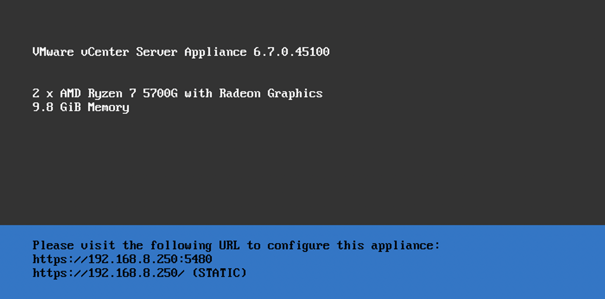

接下来访问 https://192.168.8.250:5480/ 继续配置：

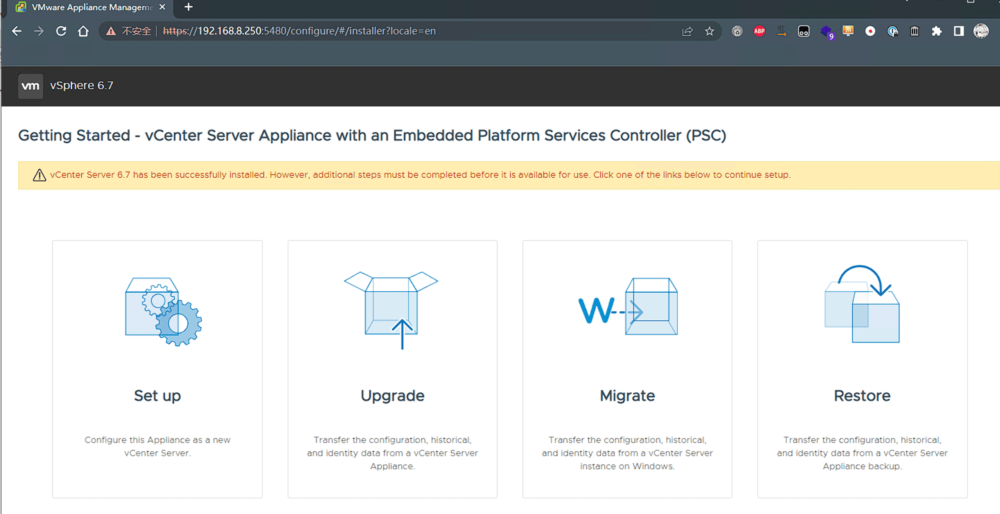

选择设置后用 root 账号登陆, 按照向导继续配置，注意在网络配置阶段把系统名称修改为 IP：

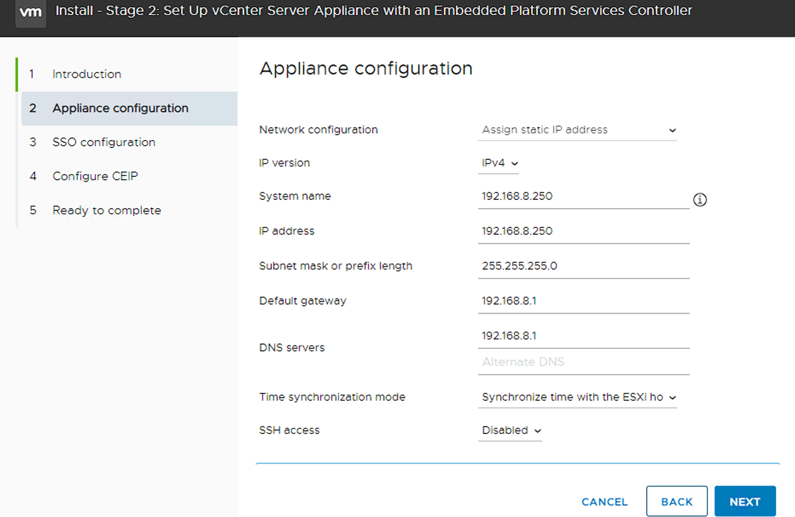

然后设置 SSO 密码，一路下一步

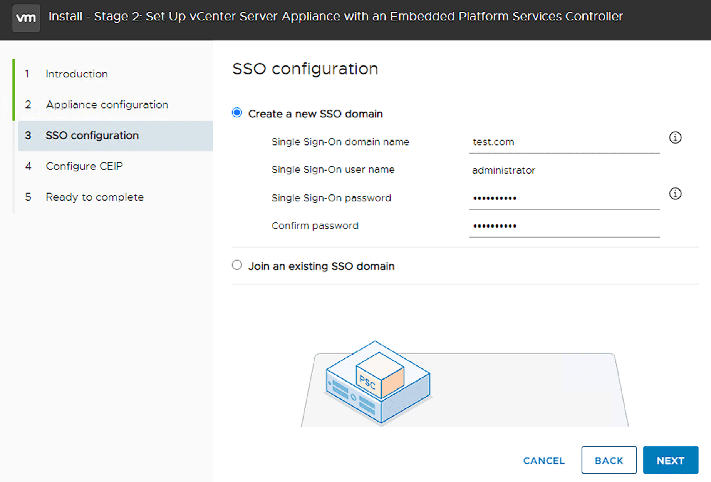

安装完成会打开 443 端口，此时就可以正常访问 vCenter 了

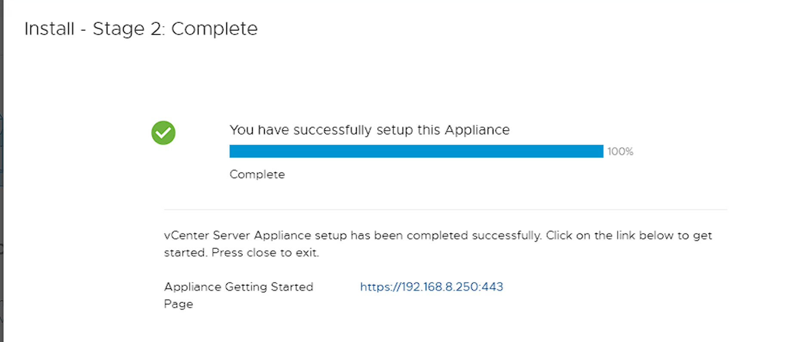

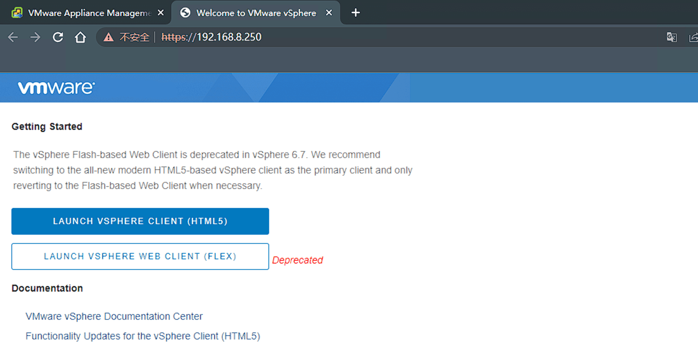

---

## 开启 SSH

vcenter 的 ssh 要在后台配置才能访问

登录 5480 端口上的 vCenter VAMI 登录页面,点击 Access -- Edit.

开启 SSH Login 选项就行了

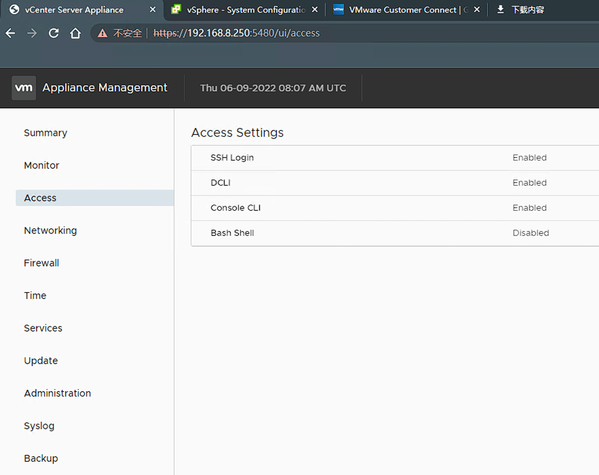

---

## Source & Reference
- [VMware vCenter RCE 漏洞踩坑实录——一个简单的RCE漏洞到底能挖出什么知识](https://mp.weixin.qq.com/s/eamNsLY0uKHXtUw_fiUYxQ)
- https://blog.ukotic.net/2020/08/06/enable-ssh-on-vcenter-server-7/
- https://mp.weixin.qq.com/s/kPoYhbCPZb62t71-jbO1dA
