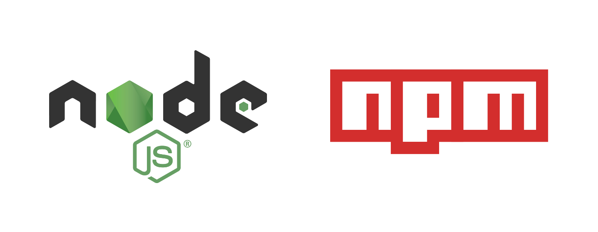

# Misc-Plan

<p align="center">
    <a href="https://twitter.com/mittye97/status/1235824863857659905"></a>
</p>

---

## 激活

> 注意 : Windows 系统和 Microsoft Office 软件都必须是 VOL 版本.

- [Wind4/vlmcsd](https://github.com/Wind4/vlmcsd) - kms 服务器
- [TGSAN/CMWTAT_Digital_Edition](https://github.com/TGSAN/CMWTAT_Digital_Edition) - 数字权利激活工具
- [kkkgo/KMS_VL_ALL](https://github.com/kkkgo/KMS_VL_ALL) - kms 激活脚本

**激活 Windows**

用管理员权限运行 CMD 或 PowerShell,输入如下命令:
```powershell
slmgr /skms xxx.xxx.xxx.xxx
slmgr /ato
slmgr /xpr
```
验证一下是否激活 : `slmgr.vbs -dlv`

**激活 Office**

用管理员权限运行 CMD 或 PowerShell,输入如下命令:
```powershell
# 进入office 安装目录
cd "C:\Program Files(x86)\Microsoft Office\Office16"
# 注册 kms 服务器地址
cscript ospp.vbs /sethst:xxx.xxx.xxx.xxx
# 执行激活
cscript ospp.vbs /act
# 查看状态
CSCRIPT OSPP.VBS /DSTATUS
```

**愉快使用网易云音乐**

- centos 环境

    ```bash
    yum install -y epel-release
    yum install -y nodejs npm
    git clone https://github.com/nondanee/UnblockNeteaseMusic.git
    cd UnblockNeteaseMusic
    npm install forever -g
    npm install
    forever start app.js -p 18080   # 启动
    firewall-cmd --permanent --zone=public --add-port=18080/tcp
    firewall-cmd --reload
    ```

    ```bash
    forever stop app.js             # 关闭服务
    ```

- 客户端

    配置 http 代理 IP:18080

---

## DNS

**快速刷新 DNS 缓存**
```
ipconfig /flushdns
```

**软件方案**
- DnsJumper (windows 下快速配置 DNS)
- [chengr28/Pcap_DNSProxy](https://github.com/chengr28/pcap_dnsproxy) (DNS 代理)
    ```ini
    [DNS]
    Outgoing Protocol = IPv4 + TCP

    [Addresses]
    IPv4 Main DNS Address = 208.67.220.222:443
    IPv4 Alternate DNS Address = 208.67.220.220:53|208.67.222.222:5353
    IPv4 Local Main DNS Address = 119.29.29.29:53
    IPv4 Local Alternate DNS Address = 114.114.115.115:53
    ```
- [jedisct1/dnscrypt-proxy](https://github.com/jedisct1/dnscrypt-proxy) (DNS 代理)
    - [CNMan/dnscrypt-proxy-config](https://github.com/CNMan/dnscrypt-proxy-config)
- [bitbeans/SimpleDnsCrypt](https://github.com/bitbeans/SimpleDnsCrypt) (图形化的 DNS 代理,感觉没上面两个好用)

**自建DNS服务**
- [AdguardTeam](https://github.com/AdguardTeam/AdGuardHome)

**DNS 服务器推荐**
- 国内:223.5.5.5、114.114.114.114
- 全球:208.67.222.222、208.67.220.220、1.1.1.1

---

## 各种代理/源
### Git

<p align="center">
    
</p>

```git
// 查看当前代理设置
git config --global http.proxy
git config --global https.proxy

// 设置当前代理
git config --global http.proxy 'socks5://127.0.0.1:1080'
git config --global https.proxy 'socks5://127.0.0.1:1080'

// 删除 proxy
git config --global --unset http.proxy
git config --global --unset https.proxy
```

### Homebrew

```bash
# brew 程序本身
git -C "$(brew --repo)" remote set-url origin https://mirrors.tuna.tsinghua.edu.cn/git/homebrew/brew.git

# 以下针对 mac OS 系统上的 Homebrew
git -C "$(brew --repo homebrew/core)" remote set-url origin https://mirrors.tuna.tsinghua.edu.cn/git/homebrew/homebrew-core.git
git -C "$(brew --repo homebrew/cask)" remote set-url origin https://mirrors.tuna.tsinghua.edu.cn/git/homebrew/homebrew-cask.git
git -C "$(brew --repo homebrew/cask-fonts)" remote set-url origin https://mirrors.tuna.tsinghua.edu.cn/git/homebrew/homebrew-cask-fonts.git
git -C "$(brew --repo homebrew/cask-drivers)" remote set-url origin https://mirrors.tuna.tsinghua.edu.cn/git/homebrew/homebrew-cask-drivers.git

# 更换后测试工作是否正常
brew update
```

### Docker

<p align="center">
    
</p>

- 阿里云 : https://cr.console.aliyun.com/#/accelerator
- DaoCloud : https://www.daocloud.io/mirror#accelerator-doc
- 中科大 : https://lug.ustc.edu.cn/wiki/mirrors/help/docker
- 网易 : http://hub-mirror.c.163.com

**linux**
```bash
mkdir -p /etc/docker
tee /etc/docker/daemon.json <<-'EOF'
{
  "registry-mirrors": ["https://<你的>.mirror.aliyuncs.com"]
}
EOF
systemctl daemon-reload
systemctl restart docker
```

`docker info` 检查加速器是否生效

**windows**

对于 Windows 10 以上的用户 推荐使用 Docker for Windows
Windows 安装文件:http://mirrors.aliyun.com/docker-toolbox/windows/docker-for-windows/

在系统右下角托盘图标内右键菜单选择 Settings,打开配置窗口后左侧导航菜单选择 Docker Daemon.编辑窗口内的 JSON 串,填写下方加速器地址:
{
  "registry-mirrors": ["https://<你的>.mirror.aliyuncs.com"]
}
编辑完成后点击 Apply 保存按钮,等待 Docker 重启并应用配置的镜像加速器.

### node&js

<p align="center">
    
</p>

```bash
npm install -g nrm
nrm ls
nrm use taobao
nrm test
或
npm config set proxy=http://127.0.0.1:8087
npm config delete proxy  # 取消代理
```

### pip

常用的国内镜像包括:

1. 阿里云 http://mirrors.aliyun.com/pypi/simple/
2. 豆瓣 http://pypi.douban.com/simple/
3. 清华大学 https://pypi.tuna.tsinghua.edu.cn/simple/
4. 中国科学技术大学 http://pypi.mirrors.ustc.edu.cn/simple/
5. 华中科技大学 http://pypi.hustunique.com/

- 临时使用:

    可以在使用 pip 的时候,加上参数 -i 和镜像地址 `https://pypi.tuna.tsinghua.edu.cn/simple`
例如:`pip install -i https://pypi.tuna.tsinghua.edu.cn/simple pandas`,这样就会从清华镜像安装 pandas 库.

- 永久修改,一劳永逸:

    1. Linux 下,修改 ~/.pip/pip.conf (没有就创建一个文件夹及文件.文件夹要加".",表示是隐藏文件夹)
        ```bash
        mkdir -p ~/.pip/
        tee ~/.pip/pip.conf <<-'EOF'
        [global]
        index-url = https://mirrors.aliyun.com/pypi/simple/

        [install]
        trusted-host=mirrors.aliyun.com
        EOF
        ```

    2. windows 下,直接在 user 目录中创建一个 pip 目录,如:C:\Users\xx\pip,然后新建文件 pip.ini,即 %HOMEPATH%\pip\pip.ini,在 pip.ini 文件中输入以下内容:
        ```vim
        [global]
        index-url = https://pypi.tuna.tsinghua.edu.cn/simple
        [install]
        trusted-host = https://pypi.tuna.tsinghua.edu.cn
        ```

### 终端

<p align="center">
    
</p>

- windows

    - cmd
        ```bash
        set http_proxy=http://127.0.0.1:1080 & set https_proxy=http://127.0.0.1:1080
        ```

    - powershell
        ```powershell
        $Env:http_proxy="http://127.0.0.1:1080";$Env:https_proxy="http://127.0.0.1:1080"
        ```

- linux

    - proxychains

        详细安装步骤请移步运维-->Linux-->[Power-Linux.md](../Integrated/Linux/Power-Linux.md##proxychains-ng)
        - 使用方法:

            在需要代理的命令前加上 proxychains4,如 : `proxychains4 wget http://xxx.com/xxx.zip`

        - Tips:

            如果嫌每次命令前加上 proxychain4 麻烦,可以 `proxychains4 bash` 这样 DLL 注入的 bash 里的命令都会走代理.

### GO

**goproxy**

- https://goproxy.io/

- *linux*
    ```bash
    # Go version >= 1.13 (RECOMMENDED)
    go env -w GO111MODULE=on
    go env -w GOPROXY="https://goproxy.io,direct"

    # Go version <= 1.12
    # Enable the go modules feature
    export GO111MODULE="on"
    # Set the GOPROXY environment variable
    export GOPROXY="https://goproxy.io"
    ```

- *windows*
    ```PowerShell
    # Enable the go modules feature
    $env:GO111MODULE="on"
    # Set the GOPROXY environment variable
    $env:GOPROXY="https://goproxy.io"
    ```

**GoLand**

> Setting-->Appearance & Behavior-->System Setting-->HTTP Proxy

---

## vscode

<p align="center">
    
</p>

`谁和我一起吹 vscode 我们就是永远的好朋友🤞`

**Font**
- https://github.com/tonsky/FiraCode
- https://github.com/adobe-fonts/source-code-pro

**配置**
```yml
"editor.fontFamily": "Fira Code Retina",
"editor.fontLigatures": true
```

**Extensions**
- [Bracket Pair Colorizer 2](https://marketplace.visualstudio.com/items?itemName=CoenraadS.bracket-pair-colorizer-2)
- [Chinese (Simplified)](https://marketplace.visualstudio.com/items?itemName=MS-CEINTL.vscode-language-pack-zh-hans)
- [GitLens](https://marketplace.visualstudio.com/items?itemName=eamodio.gitlens)
- [Markdown Preview Enhanced](https://marketplace.visualstudio.com/items?itemName=shd101wyy.markdown-preview-enhanced)
- [vscode-icons](https://marketplace.visualstudio.com/items?itemName=vscode-icons-team.vscode-icons)
- [filesize](https://marketplace.visualstudio.com/items?itemName=mkxml.vscode-filesize)
- [Trailing Spaces](https://marketplace.visualstudio.com/items?itemName=shardulm94.trailing-spaces)
- [background](https://marketplace.visualstudio.com/items?itemName=shalldie.background)
- [background-cover](https://marketplace.visualstudio.com/items?itemName=manasxx.background-cover)
- [Markdown All in One](https://marketplace.visualstudio.com/items?itemName=yzhang.markdown-all-in-one)

---

## notepad++

**Theme**
- https://github.com/chriskempson/tomorrow-theme/tree/master/notepad%2B%2B

---

## ffmpeg

<p align="center">
    
</p>

**视频剪切**
```bash
ffmpeg -ss 00:00:00 -t 00:00:30 -i test.mp4 -vcodec copy -acodec copy output.mp4
* -ss 指定从什么时间开始
* -t 指定需要截取多长时间
* -i 指定输入文件
```

**格式转换**
```bash
ffmpeg -i input.mp4 output.avi
```

**视频合并**
```bash

filelist.txt
    file '0.flv'
    file '1.flv'
    file '2.flv'
    file '3.flv'

ffmpeg -f concat -i filelist.txt -c copy output.mkv
```

**TS 格式转 MP4 格式**
```bash
ffmpeg -i target.ts -c:v libx264 -c:a copy -bsf:a aac_adtstoasc output.mp4
```

**视频压缩**

常规用法
```bash
ffmpeg.exe -i in.mp4 -r 10 -b:a 32k out.mp4
```

其他用法
```bash
ffmpeg -y -i /mnt/sdcard/demo1.mp4 -strict -2 -vcodec libx264 -preset ultrafast -crf 24 -acodec aac -ar 44100 -ac 2 -b:a 96k -s 360x640 -aspect 16:9 /mnt/sdcard/democompress.mp4
```

```bash
ffmpeg -y -i in.mp4 -s 176x144 -vcodec libx264 -vpre fast -b 800000 out.mp4
# in.mp4 是 960 x 540,H.264 / AVC,30fps, 大小为 149.3 MB.
# 转出来的 out.mp4 是 176 x 144,H.264 / AVC,30fps, 大小为 21.0 MB.
#
# y: 当已存在 out.mp4 是, 不提示是否覆盖.
# -i in.mp4: 输入文件名.
# -s 176x144: 输出分辨率.
# -vcodec -libx264: 输出文件使用的编解码器.
# -vpre fast: 使用 libx264 做为编解码器时, 需要带上这个参数.
# -b 800000: 码率, 单位是字节, 不是 k 字节.
# out.mp4: 输出文件名.
# 以上参数的使用细节, ffmpeg 的 help 里有更详细的描述.
```

```bash
ffmpeg -y -i in.out -vcodec xvid -s 176x144 -r 29.97 -b 1500 -acodec aac -ac 2 -ar 48000 -ab 128 -vol 100 -f mp4 out.mp4

# -r 29.97 帧数 (一般用 25 就可以了)
# -b 1500 视频数据流量, 用 - b xxx 表示使用固定码率, 数字可更改; 还可以用动态码率如:-qscale 4 和 - qscale 6,4 的质量比 6 高 (一般用 800 就可以了, 否则文件会很大)
# -acodec aac 音频编码用 AAC
# -ac 2 声道数 1 或 2
# -ar 48000 声音的采样频率
# -ab 128 音频数据流量, 一般选择 32、64、96、128 # -vol 200 200% 的音量, 可更改 (如果源文件声音很小, 可以提升 10 到 20 倍 (1000%~2000%))
```

---

## Jetbrains

**datagrip 离线安装驱动 jar**

提取已经安装的 jar，拷贝数据库驱动文件到另一台电脑的当前用户 .DataGrip2019.2\config\jdbc-drivers 路径地址

重启 DataGrip，左侧的 Database 标签页 -> + 按钮 -> Driver and Data Source ，选中指定数据库类型，点击 Switch to ver. xxx 即可

---

## win10

**关闭晃动窗口最小化**

运行 gpedit.msc 打开组策略编辑器，展开 用户配置 -> 管理模版 -> 桌面，可以在右边区域找到 “关闭 Aero Shake 窗口最小化鼠标手势” 的项目，它的默认状态为 “未配置”，在未配置的情况下，Aero Shake 的功能是默认开启的, 设置为“已启用” 即可

**audiodg 无响应**

```
psexec.exe -accepteula -s -i -d cmd.exe
net stop audiosrv
net start audiosrv
```
