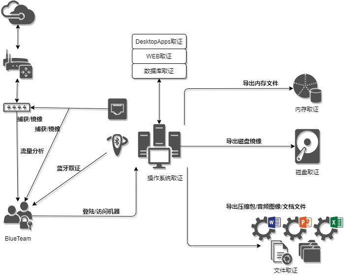
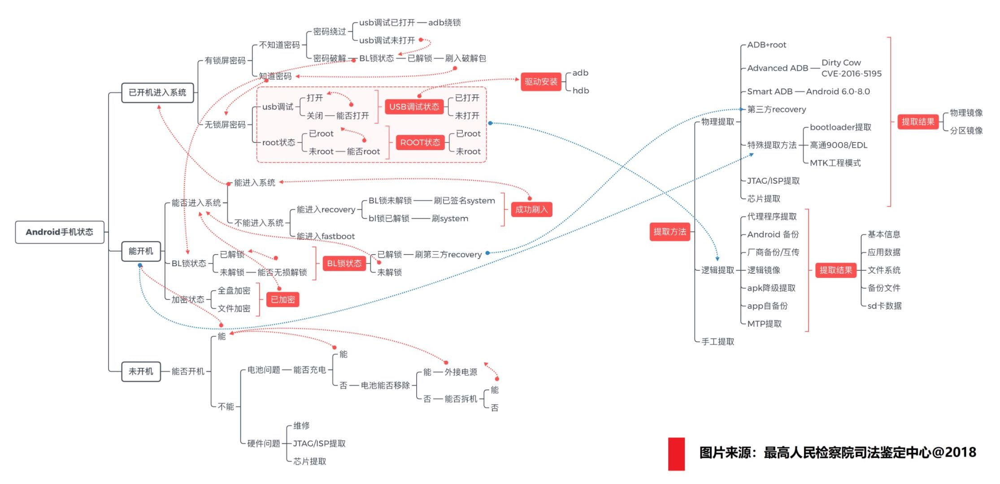
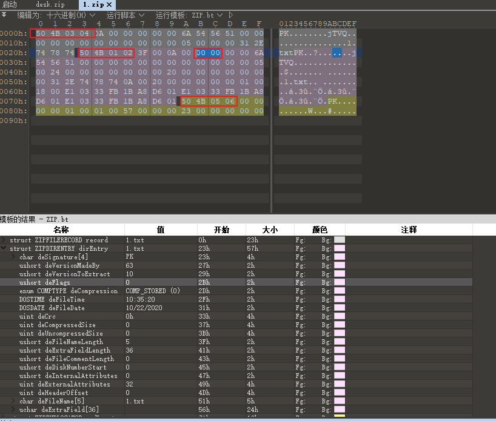
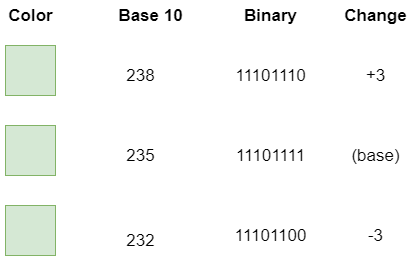

# 取证

<p align="center">
    
</p>

> 注 : 笔记中拓扑图 xmind 源文件在其图片目录下

---

## 免责声明

`本文档仅供学习和研究使用,请勿使用文中的技术源码用于非法用途,任何人造成的任何负面影响,与本人无关.`

---

# 大纲

* **[操作系统取证](#操作系统取证)**
    * [Android](#android)
    * [Windows](#windows)
    * [Linux](#linux)

* **[文件取证](#文件取证)**
    * [压缩包](#压缩包)
        * [爆破压缩包](#爆破压缩包)
        * [伪加密](#伪加密)
        * [明文攻击](#明文攻击)
        * [CRC32碰撞](#crc32碰撞)
    * [视频](#视频)
        * [Deegger_Embedder](#deegger_embedder)
    * [图片](#图片)
        * [png](#png)
            * [LSB隐写](#lsb隐写)
        * [jpg](#jpg)
        * [GIF](#gif)
        * [exif](#exif)
        * [Steghide](#steghide)
        * [PixelJihad](#pixeljihad)
        * [盲水印](#盲水印)
    * [音频](#音频)
        * [隐写工具](#隐写工具)
        * [LSB音频隐写](#LSB音频隐写)
    * [文本](#文本)
    * [电子文档](#电子文档)
        * [Office](#Office)
            * [爆破Office加密](#爆破Office加密)
        * [PDF](#pdf)
            * [爆破PDF加密](#爆破PDF加密)
    * [html](#html)

* **[网络取证](#网络取证)**

* **[USB取证](#USB取证)**

* **[蓝牙取证](#蓝牙取证)**

* **[磁盘取证](#磁盘取证)**

* **[内存取证](#内存取证)**

* **[应用程序取证](#应用程序取证)**
    * [浏览器取证](#浏览器取证)
    * [其他软件](#其他软件)

* **[WEB取证](#WEB取证)**
    * [中间件配置](#中间件配置)
    * [中间件服务器程序日志](#中间件服务器程序日志)

* **[数据库取证](#数据库取证)**
    * [mysql](#mysql)
    * [mssql](#mssql)
    * [Oracle](#oracle)

---

**相关文章**
- [暗网取证研究](https://mp.weixin.qq.com/s/_kObp0peUyajqnDACJDlqg)

---

# 操作系统取证

**相关文章**
- [关键证据检索提取-系统共享检查](https://mp.weixin.qq.com/s/5nVnXMTPIpAu59bycwu5Iw)
- [关键证据检索提取-防火墙规则检查](https://mp.weixin.qq.com/s/MQbyphGTAF-IvKYG6IFuxg)

## Android



## Windows

- [Windows加固+维护+应急响应参考](../../Integrated/Windows/Secure-Win.md)

**通用取证工具**
- [The Sleuth Kit (TSK)](https://www.sleuthkit.org/) - 一套强大的数字调查、取证工具集合

**系统日志**
- 本部分内容见 [Secure-Win](../../Integrated/Windows/Secure-Win.md#日志) 日志部分

**DNS**
- 本部分内容见 [Secure-Win](../../Integrated/Windows/Secure-Win.md#dns) DNS 部分

**动作记录**

- 相关文章
    - [powershell历史运行命令取证](https://blog.m1kh.com/index.php/archives/425/)

- 相关工具
    - [Device Cleanup Tool](https://www.uwe-sieber.de/misc_tools_e.html) - 查看电脑连接过的设备
    - [LastActivityView](https://www.nirsoft.net/utils/computer_activity_view.html) - 最近你干什么了
    - [OpenSaveFilesView](https://www.nirsoft.net/utils/open_save_files_view.html) - 显示文件打开、保存记录
    - [TurnedOnTimesView](https://www.nirsoft.net/utils/computer_turned_on_times.html) - 快速查看系统开关机时间
    - [uknowsec/loginlog_windows](https://github.com/uknowsec/loginlog_windows) - 读取登录过本机的登录失败或登录成功的所有计算机信息

- 剪切板内容
    ```powershell
    # 获取剪切板文本内容（只能获取当前复制内容）
    powershell get-clipboard

    # 获取文件内容（非文本类型）
    powershell Get-Clipboard -format FileDropList
    ```

- 历史命令
    - powershell 历史命令记录 : `%appdata%\Microsoft\Windows\PowerShell\PSReadline\ConsoleHost_history.txt`

        ```powershell
        # 查看存放位置
        Get-PSReadlineOption
        powershell Get-PSReadlineOption
        ```

        ```powershell
        # 查看存放位置2
        Get-History
        Get-History | Format-List -Property *
        ```

        ```powershell
        # 直接查看 powershell 历史命令
        powershell Get-Content (Get-PSReadlineOption).HistorySavePath

        # 清除 powershell 历史记录
        powershell Remove-Item (Get-PSReadlineOption).HistorySavePath
        ```

    - cmd 历史记录

        ```bash
        # 直接查看 cmd 历史命令
        doskey /h

        # 清除 cmd 历史记录
        doskey /reinstall
        ```

**RDP**
- 本部分内容见 [Windows 安全](../RedTeam/OS安全/Windows安全.md#rdp)

**BitLocker**
- 本部分内容见 [Windows 安全](../RedTeam/OS安全/Windows安全.md#bitlocker)

**认证**
- 本部分内容见 [Windows 安全](../RedTeam/OS安全/Windows安全.md#认证)

**蓝牙**
- 相关工具
    - [bluetoothview](https://www.nirsoft.net/utils/bluetooth_viewer.html) - 监控周围的蓝牙设备

**无线**
- 相关工具
    - [wifihistoryview](https://www.nirsoft.net/utils/wifi_history_view.html) - Wi-Fi 连接历史记录
    - [wirelesskeyview](https://www.nirsoft.net/utils/wireless_key.html)- 查看本地 wifi 密码

**NTFS 记录**
- 相关工具
    - [jschicht/UsnJrnl2Csv](https://github.com/jschicht/UsnJrnl2Csv)

**ntfs 数据流**
- 相关工具
    - NtfsStreamsEditor

- Tips
    - 如果使用 7z 进行解压,无法进行恢复 !!!! 建议使用 winrar 解压

## Linux

- [日志](../../Integrated/Linux/笔记/日志.md)
- [Linux基本信息查询命令](../../Integrated/Linux/笔记/信息.md)
- [Linux加固+维护+应急响应参考](../../Integrated/Linux/Secure-Linux.md)

**相关文章**
- [linux应急响应手册](https://blog.m1kh.com/index.php/archives/61/)

**unhide**

Linux 取证工具，能够发现那些借助 rootkit、LKM 及其它技术隐藏的进程和 TCP/UDP 端口。
```bash
apt-get install unhide
或
yum install unhide

unhide [options] test_list
unhide proc
unhide sys
unhide quick
```

---

# 文件取证

**文件取证常用工具**
- [binwalk](https://github.com/ReFirmLabs/binwalk) - 固件分析工具
    - kali 自带, 递归提取 `binwalk -Me xxx.bin`
- foremost - 文件分离工具 - 有时 binwalk 跑不出来可以试试,挺好用的
    - kali 不一定自带, `foremost -i 1.png`
- strings
    ```bash
	strings start.bin | grep -a "pass"
	strings .* | grep -a "root"
	strings -o start.bin 		# 获取所有 ASCII 字符偏移
    ```

**相关文章**
- [CTF-MISC隐写总结](https://www.freebuf.com/articles/others-articles/266884.html)

**CTF writup**
- [OpenToAll CTF2015 - Gone (Forensics) ](https://ctf.rip/opentoall-ctf2015-gone-forensics/) - 知识点 : ext4修复+AES解密
- [write-ups-2015/opentoall-ctf-2015/forensics/gone at master](https://github.com/ctfs/write-ups-2015/tree/master/opentoall-ctf-2015/forensics/gone) - 同上

## 压缩包

**相关文章**
- [ctf-wiki/zip.md at master · ctf-wiki/ctf-wiki](https://github.com/ctf-wiki/ctf-wiki/blob/master/docs/misc/archive/zip.md)
- [【CTF 攻略】CTF比赛中关于zip的总结](https://www.anquanke.com/post/id/86211)
- [给你压缩包却不给你密码的人到底在想什么](https://veritas501.space/2017/06/23/%E7%BB%99%E4%BD%A0%E5%8E%8B%E7%BC%A9%E5%8C%85%E5%8D%B4%E4%B8%8D%E7%BB%99%E4%BD%A0%E5%AF%86%E7%A0%81%E7%9A%84%E4%BA%BA%E5%88%B0%E5%BA%95%E5%9C%A8%E6%83%B3%E4%BB%80%E4%B9%88/)
- [RAR文件格式分析](https://sp4n9x.github.io/2020/04/10/RAR%E6%96%87%E4%BB%B6%E6%A0%BC%E5%BC%8F%E5%88%86%E6%9E%90/)

### 爆破压缩包

**相关工具**
- [Hashcat](../安全工具/Hashcat.md#爆破压缩包)
- [pyrofex/breakzip](https://gitlab.com/pyrofex/breakzip) - 用于破解使用弱加密的加密压缩文件的实用工具。
- archpr(Advanced Archive Password Recovery) - 一个灵活的，适用于 ZIP 和 RAR 档案的高度优化的口令恢复工具。
- Ziperello - zip 爆破工具
- fcrackzip
    ```bash
    fcrackzip -v -u -D -p rockyou.txt sample.zip

    # -u : use-unzip 有助于误报
    # -D ： 选择字典模式
    # -p : 选择字典文件
    # -v : 详细
    ```
- rarcrack - 支持爆破 rar、zip、7z 三种类型
    ```bash
    apt install -y rarcrack

    rarcrack aaa.rar --threads 50 --type rar
    rarcrack aaa.7z --threads 50 --type 7z
    ```
- [cRARk for 7-Zip](http://www.crark.net/crark-7zip.html)
- hashcat、John the Ripper
- [7z2hashcat](https://github.com/philsmd/7z2hashcat) - 从受密码保护的.7z存档（和.sfx文件）中提取信息
    ```bash
    # 7z2hashcat.pl 比 7z2john.pl 好用
    ```
- [john](https://github.com/openwall/john)

### 伪加密

**相关工具**
- ZipCenOp

**相关文章**
- [关于压缩包伪加密的相关问题](https://mochu.blog.csdn.net/article/details/120151522)

**zip**



- 50 4B 03 04 为数据区头文件标记,这里 deFlags 位改为 09 00 可变成伪加密
- 50 4B 01 02 为目录区头文件标记,后面的 deFlags 是加密标记,将 00 00 改为 09 00 可变成伪加密
- 50 4B 05 06 为目录区结束文件标记

**rar**

伪加密只发生在 RAR5.0 以前的版本中

在 RAR 的第 24 个字节，也就是 010 Editor 显示的文件结构中的 ubyte PASSWORD_ENCRYPTED 字段，修改其字段为 1 即可实现 RAR 伪加密

或者修改第11个字节，也就是010 Editor显示的文件结构中的ubyte BLOCK_HEADERS_ENCRYPTED字段的值。修改为1即可造成RAR伪加密。

### 明文攻击

- [ZIP明文攻击](./实验/ZIP明文攻击.md)

### CRC32碰撞

CRC32：CRC 本身是 “冗余校验码” 的意思，CRC32 则标识会产生一个 32bit（8 位十六进制）的校验值。

CRC 校验实用程序库，在数据存储和数据通讯领域，为了保证数据的正确，就不得不采用检错的手段。

在诸多检错手段中，CRC 是最著名的一种。CRC 的全称是循环冗余校验。

在产生 CRC32 时，源数据块的每一位都参与了运算，因此即使数据块中只有一位发生改变也会得到不同的 CRC32 值，利用这个原理我们可以直接爆破出加密文件中的内容。

每个文件都有唯一的 CRC32 值，即便数据中一个 bit 发生变化，也会导致 CRC32 值不同。若是知道一段数据的长度和 CRC32 值，便可穷举数据，与其 CRC32 对照，以此达到暴力猜解的目的。但限于 CPU 的能力，通常只适用于较小文本文件。

**相关工具**
- [theonlypwner/crc32](https://github.com/theonlypwner/crc32)
    ```
    python crc32.py reverse crc32密文(16进制形式)
    ```

---

## 视频

**分析工具**
- [kinovea](https://www.kinovea.org/) - 帮助捕获、放慢速度、研究、比较、注释。

### Deegger_Embedder

**相关工具**
- [DeEgger Embedder](http://www.zasi.org/DeEgger-Embedder.php)

---

## 图片

**相关文章**
- [CTF中常见图片隐写](http://zjw.dropsec.xyz/uncategorized/2016/08/18/CTF%E4%B8%AD%E5%B8%B8%E8%A7%81%E5%9B%BE%E7%89%87%E9%9A%90%E5%86%99.html)
- [隐写术总结](http://drops.xmd5.com/static/drops/tips-4862.html)
- [Steganography](http://datagenetics.com/blog/march12012/index.html)
- [misc-stegaBasic](https://www.jianshu.com/p/fe7a5fff2a95)

**在线分析工具**
- [Forensically, free online photo forensics tools](https://29a.ch/photo-forensics/)

**隐写分析工具**
- Stegsolve - 隐写图片查看的利器
    * [stegsolve使用方法](https://www.cnblogs.com/cat47/p/11483478.html)
        * File Format:文件格式
        * Data Extract:数据提取
        * Steregram Solve:立体视图 可以左右控制偏移
        * Frame Browser:帧浏览器
        * Image Combiner:拼图，图片拼接
- [stegosuite](https://stegosuite.org/) - 一个用 Java 编写的免费和开源的图片隐写工具。使用 Stegosuite，你可以轻松地隐藏图像文件中的信息。
- [zsteg](https://github.com/zed-0xff/zsteg) - 图片隐写信息快速检测工具,可以检测PNG和BMP图片里的隐写数据。
    ```bash
    gem install zsteg
    zsteg 1.png --all
    ```
- [bannsec/stegoVeritas](https://github.com/bannsec/stegoVeritas)
    ```bash
    pip3 install stegoveritas
    stegoveritas_install_deps

    stegoveritas test.png
    ```
- OurSecret

**writup**
- [[IceCTF 2016] [Stega 100 - Pretty Pixels] Write Up](https://0x90r00t.com/2016/08/26/icectf-2016-stega-100-pretty-pixels-write-up/) - 知识点 : 图片隐写
- [CTF 图像隐写Python脚本处理](https://mp.weixin.qq.com/s/hTtMn53H4PbrK-7x_Ff2_w)

**Tips**
- exif 信息
- 十六进制下搜文件头 `89504E47` 搜文件头数据块 `IHDR`
- strings 查看可见字符
- 有些会修改图片宽高，直接010打开改大点试试
- 2张图试试 xor
- crc
    - http://www.ip33.com/crc.html

---

### png

**png文件分析工具**
- [pngcheck](http://www.libpng.org/pub/png/apps/pngcheck.html)

#### LSB隐写

> LSB(英文 least significant bit)即最低有效位，位于二进制数的最右侧。图像的每一个像素点都是由 RGB（红、绿、蓝）三原色组成，每个颜色占8位(如#FFFFFF)。由于修改最后1位对人眼不敏感，这样一个像素点就可以携带3位信息。应用 LSB 算法的图像格式需为无损压缩数据格式，例如图像中的 bmp、png 格式和音频的 wav 格式。



修改十进制中的最低位,颜色看起来几乎没有变化,我们就可以修改最低位的信息，实现隐写。

**LSB 隐写专用工具**
- [livz/cloacked-pixel](https://github.com/livz/cloacked-pixel) - LSB 隐写和检测
    ```bash
    python2 lsb.py extract samples/orig.jpg-stego.png out p@$5w0rD
    ```
- [RobinDavid/LSB-Steganography](https://github.com/RobinDavid/LSB-Steganography) - 使用最低有效位将隐写文件转换为图像。
    ```bash
    python3 LSBSteg.py decode -i <input> -o <output>
    ```

**相关文章**
- [隐写技巧——PNG文件中的LSB隐写](https://3gstudent.github.io/%E9%9A%90%E5%86%99%E6%8A%80%E5%B7%A7-PNG%E6%96%87%E4%BB%B6%E4%B8%AD%E7%9A%84LSB%E9%9A%90%E5%86%99/)

---

### jpg

**jpg文件分析工具**
- [JPHS](http://io.acad.athabascau.ca/~grizzlie/Comp607/programs.htm)

**隐写工具**
- [Silenteye](https://achorein.github.io/silenteye/)
- [matthewgao/F5-steganography](https://github.com/matthewgao/F5-steganography)
    ```bash
    # 加密
    java Embed lopez.bmp lopez.jpg -c "" -e bin.noise -p pleasechangethispassphrasetoyourown

    # 解密
    java Extract 123456.jpg -p [password]/[空]
    ```
- [FreeFileCamouflage](http://www.myportablesoftware.com/freefilecamouflage.aspx)
- [crorvick/outguess](https://github.com/crorvick/outguess)
    ```bash
    git clone https://github.com/crorvick/outguess
    cd outguess
    ./configure && make && make install

    # 加密
    outguess -k "my secret key" -d hidden.txt demo.jpg out.jpg

    # 解密
    outguess -k "my secret key" -r out.jpg hidden.txt

    outguess -r out.jpg hidden.txt
    ```
- [resurrecting-open-source-projects/outguess](https://github.com/resurrecting-open-source-projects/outguess)

---

### GIF

**分割每一帧**

```bash
convert test.gif out.png
```

**分析每一帧的时间间隔**

```bash
apt install graphicsmagick-imagemagick-compat

identify -format "%s %T \n" test.gif
```

**横向合成**

```bash
montage flag*.png -tile x1 -geometry +0+0 a.png
# -tile 是拼接时每行和每列的图片数，这里用 x1，就是只一行
# -geometry 是首选每个图和边框尺寸，我们边框为 0，图照原始尺寸即可
# * 的意思指的所有的. png
```

---

### exif

> 可交换图像文件格式（英语：Exchangeable image file format，官方简称Exif），是专门为数码相机的照片设定的，可以记录数码照片的属性信息和拍摄数据。Exif信息是可以被任意编辑的，因此只有参考的功能。

**相关文章**
- [Explainer: how law enforcement decodes your photos](http://theconversation.com/explainer-how-law-enforcement-decodes-your-photos-78828) - 作者描述了关于数字调查者如何拆解数码照片，寻找关于制造和模型线索的过程。

**相关工具**
- [ExifTool](https://www.sno.phy.queensu.ca/~phil/exiftool/) - 用于读取，写入和编辑各种文件中的 exif 信息的工具
    ```bash
    exiftool xxx.jpg
    ```
- [EXIF信息查看器](https://exif.tuchong.com/)
- [ExifShot App](https://exifshot.com/app/)
- [如何为老照片添加 Exif 日期数据？](https://www.appinn.com/how-to-add-exif-date-for-old-picture/)

---

### Steghide

- [steghide](http://steghide.sourceforge.net/)
    ```bash
    apt-get install steghide

    steghide info x.jpg                                 # 查看图片中的嵌入信息
    steghide extract -sf x.jpg -p password              # 提取信息
    steghide embed -cf x.jpg -ef xxx.txt -p password    # 隐藏信息
    ```

### PixelJihad

- [PixelJihad](https://github.com/oakes/PixelJihad) - 一个 JavaScript 隐写工具
- http://tools.jb51.net/aideddesign/img_add_info

---

### 盲水印

一般是给2张相同的图片的场景

- [chishaxie/BlindWaterMark](https://github.com/chishaxie/BlindWaterMark)
    ```bash
    python2 bwm.py decode hui.png hui_with_wm.png wm_from_hui.png
    ```

---

## 音频

**音频隐写通用工具**
- [Detect DTMF Tones](http://dialabc.com/sound/detect/index.html) - 分析音频录音，并提供一些统计数字、图表和表格，显示数据中包含了哪些 DTMF 音调，以及在哪里。
- [Audacity](https://sourceforge.net/projects/audacity/) - 一款易于使用的多轨音频编辑器和记录器
- [MP3stego](https://www.petitcolas.net/steganography/mp3stego/) - MP3Stego 将在压缩过程中隐藏 MP3 文件中的信息。
    ```bash
    decode.exe -X test.mp3 -P test
    ```
- morse2ascii - 分析音频中的莫斯电码(虚拟机里需要有声音)
    ```bash
    apt-get install morse2ascii

    morse2ascii xxx.wav
    ```

**CTF writup**
- [音频隐写 MP3stego+wav隐写+题目](https://m3tar.github.io/2017/08/20/%E9%9F%B3%E9%A2%91%E9%9A%90%E5%86%99-MP3stego-wav%E9%9A%90%E5%86%99-%E9%A2%98%E7%9B%AE/) - MP3stego+频谱图+猪圈密码

**Tips**
- 将波形进一步转化为 01 字符串试试
- 音频中的频谱隐写是将字符串隐藏在频谱中，此类音频通常会有一个较明显的特征，听起来是一段杂音或者比较刺耳。

### deepsound

- https://deepsound.en.uptodown.com/windows

### LSB音频隐写

- [Silenteye](https://achorein.github.io/silenteye/) - 针对 wav 文件的隐写

### sstv 音频图像

- 相关工具
    - [RX-SSTV](http://users.belgacom.net/hamradio/rxsstv.htm)
        - 如果无虚拟输入源,需要下载安装一个 https://vac.muzychenko.net/cn/download.htm

### DTMF拨号音识别

- 相关工具
    - [dtmf2num](https://aluigi.altervista.org/mytoolz.htm#dtmf2num)
        ```
        dtmf2num.exe test.wav
        ```

---

## 文本

**Unicode Text Steganography**
- [Unicode Text Steganography Encoders/Decoders](https://www.irongeek.com/i.php?page=security/unicode-steganography-homoglyph-encoder)
- [Unicode Steganography with Zero-Width Characters](https://330k.github.io/misc_tools/unicode_steganography.html)

---

## 电子文档

**相关文章**
- [Misc 总结 ----隐写术之电子文档隐写](https://xz.aliyun.com/t/1883)

### Office

**相关文章**
- [PowerPoint — What data is beneath the surface?](https://medium.com/@osint/owerpoint-what-data-is-beneath-the-surface-2eb000ef95fb) - 介绍了几种在ppt中隐藏图片的小技巧
- [如何从 Microsoft Office 文档中完全删除那些暴露你身份的元数据？](https://www.iyouport.org/%e5%a6%82%e4%bd%95%e4%bb%8e-microsoft-office-%e6%96%87%e6%a1%a3%e4%b8%ad%e5%ae%8c%e5%85%a8%e5%88%a0%e9%99%a4%e9%82%a3%e4%ba%9b%e6%9a%b4%e9%9c%b2%e4%bd%a0%e8%ba%ab%e4%bb%bd%e7%9a%84%e5%85%83%e6%95%b0/)

**word 隐藏文本**
- 文件->选项->显示->勾选隐藏文字


**word、xml 转换**
- 提取信息时,将 word 转化成 xml,查看额外信息
- .doc -> 后缀改为.zip -> 解压 ->.xml

#### 爆破Office加密

**相关工具**
- [Hashcat](../安全工具/Hashcat.md#爆破office)

**破解 ppt**
- 相关工具
    - Advanced Office Password Recovery

### PDF

**PDF 隐写取证工具**
- [PDF Parser](https://github.com/smalot/pdfparser)
    - [Demo | PDF Parser](https://www.pdfparser.org/demo)
- [jesparza/peepdf](https://github.com/jesparza/peepdf)
- [wbStego4.3open](http://www.bailer.at/wbstego/pr_4ix0.htm) - BMP、RLE、TXT、ASC、XML、PDF、HTML 格式都有可能
    - wbStego4open 会把插入数据中的每一个 ASCII 码转换为二进制形式，然后把每一个二进制数字再替换为十六进制的 20 或者 09，20 代表 0，09 代表 1。这些转换后的十六进制数据被嵌入到 PDF 文件中。查看用 wbStego4open 修改后的文件内容，会发现文件中已混入了很多由 20 和 09 组成的 8 位字节。
- pdfinfo - kali 自带
    ```bash
    # pdf属性
    pdfinfo test.pdf

    # 查看pdf隐藏文本
    pdftotext test.pdf
    ```

**CTF writup**
- [[XDCTF](MISC)OWASP](https://www.jianshu.com/p/3aaa632ebfea)

**Tips**
* 不可见的图层
* Adobe 的元数据格式‘XMP’
* Adobe 的 XMP 元数据
* PDF 的‘增量生成’功能允许保留用户不可见的前版本信息
* 白色的文字或背景图
* 图片背后的文字信息
* 图层后面被覆盖的另一个图层
* 不显示的注释层。

#### 爆破PDF加密

**相关文章**
- [使用pdfcrack破解PDF密码(Linux)](http://topspeedsnail.com/crack-pdf-password-use-pdfcrack/)
- [PDF文件密码破解](https://mp.weixin.qq.com/s/EH7Z_mJvuWxtbQdcXf3h4w)

**获取 hash**
- [PDF hash Extractor - instantly](https://www.onlinehashcrack.com/tools-pdf-hash-extractor.php)
- john 的脚本
    ```bash
    cd /usr/share/john/
    ./pdf2john.pl xxx.pdf
    ```

**相关工具**
- [Hashcat](../安全工具/Hashcat.md#爆破pdf文件)

### html

**snow隐写**
- http://fog.misty.com/cgi/snow

---

# 网络取证

**tcpdump 常用**
```bash
tcpdump -n -r test.pcapng
```

**tshark 常用**
```bash
tshark -r test.pcap -T fields -e data > out.txt
```

**去重**
```
cat out.txt | uniq > out2.txt
```

## 流量分析

- 内容见 [流量分析](./实验/流量分析.md)

## TTL 隐写

IP 报文在路由间穿梭的时候每经过一个路由，TTL 就会减 1，当 TTL 为 0 的时候，该报文就会被丢弃。

TTL 所占的位数是 8 位，也就是 0-255 的范围，但是在大多数情况下通常只需要经过很小的跳数就能完成报文的转发，

远远比上限 255 小得多，所以我们可以用 TTL 值的前两位来进行传输隐藏数据。

如：须传送 H 字符，只需把 H 字符换成二进制，每两位为一组，每次填充到 TTL 字段的开头两位并把剩下的 6 位设置为 1（xx111111），这样发 4 个 IP 报文即可传送 1 个字节。

TTL隐写中用到四个值：00 111111（63）,01 111111（127）,10 111111（191）,11 111111（255）,解密的时候只取前两位，然后转换成ascii

**CTF Writeup**
- [[SWPU2019]Network](https://www.cnblogs.com/yunqian2017/p/14671031.html)

---

# USB取证

- 内容见 [USB取证](./笔记/USB取证.md)

---

# 蓝牙取证


---

# 磁盘取证

- 内容见 [磁盘取证](./笔记/磁盘取证.md)

---

# 内存取证

- 内容见 [内存取证](./笔记/内存取证.md)

---

# 应用程序取证

**相关文章**
- [内网软件密码离线解密](https://mp.weixin.qq.com/s/l6rSLBrluAkRrB0rYPcdLg)

## 浏览器取证

**相关工具**
- [obsidianforensics/hindsight](https://github.com/obsidianforensics/hindsight) - chrome历史访问记录取证工具(真是不给人留条活路)
- [x899/chrome_password_grabber](https://github.com/x899/chrome_password_grabber) - 从 Chrome 获取未加密的“保存的密码”
- [m0rv4i/SharpCookieMonster](https://github.com/m0rv4i/SharpCookieMonster) - 从 Chrome 中提取 cookie
- [djhohnstein/SharpChromium](https://github.com/djhohnstein/SharpChromium) - 用于从 Chromium 系列浏览器中获取 Cookie、访问历史、网站登录凭据等敏感信息的工具
- [QAX-A-Team/BrowserGhost](https://github.com/QAX-A-Team/BrowserGhost) - 一个抓取浏览器密码的工具
- [wekillpeople/browser-dumpwd](https://github.com/wekillpeople/browser-dumpwd) - 使用 sqlite3 lib 转储浏览器密码（chrome，firefox）。
- [moonD4rk/HackBrowserData](https://github.com/moonD4rk/HackBrowserData) - 一款可全平台运行的浏览器数据导出解密工具。
- [SD-XD/Catch-Browser](https://github.com/SD-XD/Catch-Browser)

---

## 其他软件

**相关工具**
- [Arvanaghi/SessionGopher](https://github.com/Arvanaghi/SessionGopher) - 使用 WMI 提取 WinSCP、PuTTY、SuperPuTTY、FileZilla 和 Microsoft remote Desktop 等远程访问工具保存的会话信息的 ps 脚本
- [uknowsec/SharpDecryptPwd](https://github.com/uknowsec/SharpDecryptPwd) - 对密码已保存在 Windwos 系统上的部分程序进行解析,包括：Navicat,TeamViewer,FileZilla,WinSCP,Xmangager 系列产品(Xshell,Xftp)。

**向日葵**
- 向日葵客户端运行过程中的日志文件保存路径: `C:\Program Files (x86)\Oray\SunLogin\SunloginClient\log`
- 向日葵的免安装版会在 `C:\ProgramData\Oray\SunloginClient\` 默认路径下生成 `config.ini` 配置文件，配置文件中的 fastcodehistroy 值以 base64 编码形式存储着向日葵历史连接记录
- [向日葵软件在渗透测试中的应用](https://mp.weixin.qq.com/s/5qzYynZI0bdaUnld0GhA4Q)
- [wafinfo/Sunflower_get_Password](https://github.com/wafinfo/Sunflower_get_Password) - 一款针对向日葵的识别码和验证码提取工具

**Xmanager**
- [HyperSine/how-does-Xmanager-encrypt-password](https://github.com/HyperSine/how-does-Xmanager-encrypt-password)
- xshell 默认是不开启会话日志记录的
- 会话日志文件夹路径 : `C:\Users\<user>\Documents\NetSarang Computer\6\Xshell\Logs`
- 5.x会话文件夹路径 : `C:\Users\<user>\Documents\NetSarang\Xshell\Sessions`
- 6.x会话文件夹路径 : `C:\Users\<user>\Documents\NetSarang Computer\6\Xshell\Sessions`

**SecureCRT**
- [HyperSine/how-does-SecureCRT-encrypt-password](https://github.com/HyperSine/how-does-SecureCRT-encrypt-password)

**Teamviewer**
- 连接日志文件路径 : `C:\Program Files (x86)\TeamViewer\Connections_incoming.txt`

**MobaXterm**
- [HyperSine/how-does-MobaXterm-encrypt-password](https://github.com/HyperSine/how-does-MobaXterm-encrypt-password)
- [xillwillx/MobaXterm-Decryptor](https://github.com/xillwillx/MobaXterm-Decryptor)

**UltraVNC Server**
- `c:\Program Files\uvnc bvba\UltraVNC\ultravnc.ini`
    - `vncpwd.exe -k <hash>`

**TightVNC Server**
- `HKEY_LOCAL_MACHINE\SOFTWARE\TightVNC\Server`
- `HKEY_CURRENT_USER\SOFTWARE\TigerVNC\WinVNC4`

**RealVNC Server**
- `HKEY_LOCAL_MACHINE\SOFTWARE\RealVNC\vncserver`

**WinSCP**
- `HKCU\Software\Martin Prikryl\WinSCP 2\Sessions`
- [anoopengineer/winscppasswd](https://github.com/anoopengineer/winscppasswd)

**Remote Desktop Organizer**
- [Hzllaga/RDODecrypt](https://github.com/Hzllaga/RDODecrypt) - Remote Desktop Organizer 密码破解

**FileZilla**
- `C:\Users\<user>\AppDataoaming\FileZilla\recentservers.xml`

**Foxmail**
- [Foxmail Password Decryptor](https://securityxploded.com/foxmail-password-decryptor.php)
    - 解密 Foxmail 安装目录下的 Storage 目录中的 Account.rec0 文件

**Navicat**
- [HyperSine/how-does-navicat-encrypt-password](https://github.com/HyperSine/how-does-navicat-encrypt-password)
- 数据库连接记录 : `HKEY_CURRENT_USER\Software\PremiumSoft\Navicat\Servers\`
- 当前用户的所有连接记录 : `HKEY_CURRENT_USER\Software\PremiumSoft`

**Mysql**
- 离线解密(mysql5.0)

    1. 将目标 Mysql data 目录下的 user.frm ,user.MYD ,user.MYI 文件托回
    2. 本地安装 MySQL Server，装完之后立即停掉服务，将拖回来的那三个文件分别丢到 C:\Program Files\MySQL\MySQL Server\data\mysql 目录下进行替换
    3. 修改 Mysql 服务配置文件 C:\Program Files\MySQL\MySQL Server\my.ini 在 mysqld 配置项下添加如下配置，之后启动 Mysql 服务
    ```
    skip-grant-tables
    ```
    4. 无需密码直接登录 mysql 执行, 即可拿到完整的密码 hash
    ```
    mysql> select user,password,host from mysql.user;
    ```

**PLSQL**
- 离线解密

    1. PLSQL Developer默认连接账密保存位置位于当前用户如下路径的user.prefs文件中，账号和密码的加密方式比较简单，只是简单异或
        ```
        C:\Users\<username>\AppData\Roaming\PLSQL Developer\Preferences\<username>\
        C:\Program Files\PLSQL Developer\Preferences\<username>\
        C:\Program Files (x86)\PLSQL Developer\Preferences\<username>\
        ```

    2. user.prefs文件需关注LogonHistory和CurrentConnections下的内容，每一行都代表一条单独的连接记录
    3. 将 LogonHistoryCurrentConnections 下的内容原样粘回本地，在代码中替换，解密即可
        ```c#
        using System;
        using System.Collections.Generic; using System.IO;
        public class Program
        {
        public static void Main() {
        var values = new List<int>(); var ret = string.Empty;
        string scrambled = "xxxxxxxxxxxxxxxxxxxxxxxxxxxxxxxxxxxxxxxxxxxxxxxxxxxxxxxxxxxxx"; for (var i = 0; i < scrambled.Length; i += 4)
        {
        values.Add(Convert.ToInt32(scrambled.Substring(i, 4))); }
        var key = values[0]; values.RemoveAt(0);
        for (var i = 0; i < values.Count; i++) {
        var val = values[i] - 1000;

        var mask = key + (10 * (i + 1));
        ret += (char)((val ^ mask) >> 4); }
        Console.WriteLine(ret); }
        }
        ```

---

# WEB取证

**相关文章**
- [比敌人更了解敌人 [ 取证入门 web篇 ]](https://www.freebuf.com/column/147929.html)
- [记一次IIS劫持处置](https://www.freebuf.com/articles/web/222060.html)

---

## 中间件配置

**临时目录**

- IIS
    - IIS 临时压缩文件 : C:\inetpub\temp\IIS Temporary Compressed Files\WEBUI\$^_gzip_D^\WEB\WEBUI\UPLOAD

- Linux
    - `/tmp`

**IIS**

- `C:\Windows\System32\inetsrv\config`

**NGINX**

- 目录 : `/etc/nginx/conf.d/`

**httpd**

- 目录 : `/etc/httpd/conf/`

---

## 中间件服务器程序日志

部分内容来自项目 <sup>[[theLSA/emergency-response-checklist](https://github.com/theLSA/emergency-response-checklist) 和 Tide 团队安全文章]</sup>

**辅助工具**
- [JeffXue/web-log-parser](https://github.com/JeffXue/web-log-parser) - 开源的分析 web 日志工具，采用 python 语言开发，具有灵活的日志格式配置。
- 360星图
- [TurboWay/bigdata_practice](https://github.com/TurboWay/bigdata_practice) - nginx 日志分析可视化

**辅助命令**
```bash
# 统计请求ip
awk '{print $1}' access.log | sort | uniq -c | sort -rn | more

# 状态码统计
cat access.log  |awk '{print $9}'|sort|uniq -c|sort -rn

# 200 ok URL 统计
grep "183.6.56.66" access.log |  awk '{if ($9==200) print $1,$7,$9}'

# 查看并统计200的状态码及ip（去重后）
cat access.log  | awk '{if ($9=200) print $1,$7,$9}'|sort|uniq -c|sort -rn | head -20

# sql注入事件
more access.log | egrep "%20select%20|%20and%201=1|%20and%201=2|%20exec|%27exec| information_schema.tables|%20information_schema.tables|%20where%20|%20union%20|%20SELECT%20|%2ctable_name%20|cmdshell|%20table_schema|order%20by|select"

# 扫目录行为
more access.log | egrep "\.zip|\.rar|\.mdb|\.inc|\.sql|\.config|\.bak|/login.inc.php|/.svn/|/mysql/|config.inc.php|\.bak|wwwroot|网站备份|/gf_admin/|/DataBackup/|/Web.config|/web.config|/1.txt|/test.txt|www.zip|www.tar|admin"

# webshell事件
more access.log | egrep "eval|%eval|%execute|%3binsert|%20makewebtaski%20|/div.asp|/1.asp|/1.jsp|/1.php|/1.aspx|xiaoma.jsp|tom.jsp|py.jsp|k8cmd.jsp|/k8cmd|ver007.jsp|ver008.jsp|ver007|ver008|%if|\.aar|\.php3|\.php4|\.php5|\.pht|\.phm|\.phml|\.php2|\.phtm|shell.php|\.Php"

# 基础攻击事件
more access.log | egrep "/passwd|%00|/win.ini|/my.ini|/MetaBase.xml|/web.xml|/ServUDaemon.ini|ssh|alert|<script>|include|filename|\.sh"
```

**IIS**

`C:\WINDOWS\system32\LogFiles` : 日志内容包括访问域名时间、ip、访问 url 等信息。

**httpd**
- `/etc/httpd/logs/`

**apache**

apache 日志一般分为 `access_log` 和 `error_log` 两种，通过查看 `httpd.conf` 文件查看 apache 日志路径：
```bash
grep -i "CustomLog" /etc/httpd/conf/httpd.conf
grep -i "ErrorLog" /etc/httpd/conf/httpd.conf
```
- Linux : `/usr/local/apache/logs/`
- Linux : `/var/log/apache2`
- Windows : `apache/logs/`
- `access_log` : 访问日志,记录所有对 apache 服务器进行请求的访问
- `error_log` : 错误日志,记录下任何错误的处理请求，通常服务器出现什么错误，可对该日志进行查看

**nginx**

nginx 的日志主要分为 `access.log`、`error.log` 两种，可通过查看 `nginx.conf` 文件来查找相关日志路径
- `/var/log/nginx/access.log` : 主要记录访问日志，记录访问客户端 ip 地址、访问时间、访问页面等信息。
- `/var/log/nginx/error.log` : 主要记录一些错误信息。

**tomcat**

tomcat 日志默认路径：在安装目录下的 logs 文件夹下
- 如果在安装中默认修改了日志存储位置，可在 `conf/logging.properties` 文件中查看
- `catalina.out` : 运行中的日志，主要记录运行中产生的一些信息，尤其是一些异常错误日志信息
- `catalina.Y-M-D.log` : 是 tomcat 自己运行的一些日志，这些日志还会输出到 `catalina.out`，但是应用向 console 输出的日志不会输出到 `catalina.{yyyy-MM-dd}.log`
- `host-manager.xx.log` : 管理日志
- `localhost.xx.log` : 程序异常没有被捕获的时候抛出的地方，Tomcat 下内部代码丢出的日志(jsp 页面内部错误的异常，`org.apache.jasper.runtime.HttpJspBase.service` 类丢出的，日志信息就在该文件!)应用初始化(listener,filter, servlet)未处理的异常最后被 tomcat 捕获而输出的日志，而这些未处理异常最终会导致应用无法启动。
- `manager.xx.log`
- `localhost_access_log` : 主要记录访问日志信息，记录访问的的时间、ip 地址等信息，也是应急中经常用到的日志信息

**weblogic**

weblogic 在安装结束后默认开启了日志记录功能，默认配置情况下，weblogic 会有3种日志，分别是 `accesslog`, `Server log` 和 `domain log`，WebLogic8.x 和 9 及以后的版本目录结构有所不同。

- `domain_name/servers/server_name/logs/`
- `$MW_HOME` 是 WebLogic 的安装目录
- `<domain_name>` 是域的实际名称，是在创建域的时候指定的
- `<server_name>` 是 Server 的实际名称，是在创建 Server 的时候指定的
- `<adminserver_name>` 是 Admin Server 的实际名称，是在创建 Admin Server 的时候指定的。

WebLogic 9及以后版本：
- `domain log` : 主要记录了一个 domain 的运行情况，一个 domain 中的各个 weblogic server 可以把它们的一些信息（如：严重错误）发送到 AdminServer 上，AdminServer 把这些信息传递到 domain.log 上.
    ```
    $MW_HOME\user_projects\domains\<domain_name>\servers\<adminserver_name>\logs\<domain_name>.log
    ```
- `server log` : 主要用于服务器的一般日志记录，比如 weblogic 的启动、关闭、部署应用等相关记录，日志格式：依次为时间戳，严重程度，子系统，计算机名，服务器名，线程 ID.
    ```
    $MW_HOME\user_projects\domains\<domain_name>\servers\<server_name>\logs\<server_name>.log
    ```
- `access log` : 主要记录 http 请求，默认情况下日志记录处于启用状态，服务器将 http 请求保存在单独的日志文件中，日志主要记录了 http 请求请求 ip 地址、请求时间、访问页面、响应状态等信息.
    ```
    $MW_HOME\user_projects\domains\<domain_name>\servers\<server_name>\logs\access.log
    ```

WebLogic 8.x版本:
- `access log`
    ```
    $MW_HOME\user_projects\domains\<domain_name>\<server_name>\access.log
    ```
- `server log`
    ```
    $MW_HOME\user_projects\domains\<domain_name>\<server_name>\<server_name>.log
    ```
- `domain log`
    ```
    $MW_HOME\user_projects\domains\<domain_name>\<domain_name>.log
    ```

**jboss**
- LOG4J 配置默认 `Deploy/conf/` 如 `jboss/server/default/conf/jboss-log4j.xml`

---

# 数据库取证

部分内容来自项目 <sup>[[theLSA/emergency-response-checklist](https://github.com/theLSA/emergency-response-checklist) 和 Tide 团队安全文章]</sup>

**misc**
- `mysql\lib\plugin` 目录的异常文件
- select * from mysql.func 的异常
- mssql 检查 xp_cmdshell 等存储过程
- 异常数据库登录
- 数据库用户弱口令
- 注意 mysqld 配置文件

---

## mysql

**mysql 日志**

- `/root/.mysql_history`
- 错误日志：默认开启，hostname.err
- 查询日志：记录用户的所有操作。默认关闭，general_log_file（常见 getshell 手法）
- 慢查询日志：记录执行时间超过指定时间的查询语句，slow_query_log_file（慢查询 getshell）
- 事务日志：ib_logfile0
- 二进制日志：记录修改数据或有可能引起数据改变的 mysql 语句，log_bin，默认在数据目录，如 mysql-bin.000001
- `ErrorLog` : 记录 Mysql 运行过程中的 Error、Warning、Note 等信息，系统出错或者某条记录出问题可以查看 Error 日志；
- `GenaralQuery Log` ：记录 mysql 的日常日志，包括查询、修改、更新等的每条 sql；
    ```sql
    show variables like '%general%';        -- 查看log配置信息
    SET GLOBAL general_log = 'On';          -- 开启日志
    SET GLOBAL general_log_file = '/var/lib/mysql/mysql.log';  -- 指定日志文件路径
    ```
- `Binary Log` ：二进制日志，包含一些事件，这些事件描述了数据库的改动，如建表、数据改动等，主要用于备份恢复、回滚操作等；
- `Slow QueryLog*` ：记录 Mysql 慢查询的日志；
- mysql 相关命令
    ```sql
    status;
    show global variables like '%log%';
    show global variables like '%gene%';
    show master status;
    systemmore /mydata/data/stu18_slow.log;
    showbinary logs;
    showmaster logs;
    showbinlog events in 'mysql-bin.000011';
    show processlist;
    ```
- 更多 mysql 日志类型可参考 https://www.jianshu.com/p/db19a1d384bc
- 有哪些IP在爆破？
    ```bash
    grep  "Access denied" mysql.log |cut -d "'" -f4|uniq -c|sort -nr
    ```
- 爆破用户名字典都有哪些？
    ```bash
    grep  "Access denied" mysql.log |cut -d "'" -f2|uniq -c|sort -nr
    ```

---

## mssql

**mssql 日志**

SQL Server 日志记录了完整的 SQL Server 数据库运行的状态信息，并以消息的形式记录系统级、应用级操作。

可以使用 SQL Server Management Studio 中的日志文件查看器来访问有关在以下日志中捕获的错误和事件的信息：

SQL Server Management Studio 连接 sqlserver 数据库，查看与常规 SQL Server 活动相关的日志。

登录到 SQL Server Management Studio，依次点击 管理--SQL Server 日志

- exec xp_readerrorlog
- object Explorer-Management-SQL Server logs-view-logs
- SQL Server 2008： R2\MSSQL10_50.MSSQLSERVER\MSSQL\Log\ERRORLOG
- 查询最近一次启动 sqlserver 时间：
    ```sql
    select sqlserver_start_time fromsys.dm_os_sys_info;
    ```
- 历史 sql 记录查询：SQLServer 并没有这样的实现，只有 `sys.dm_exec_query_stats` 缓存了一部分 (sql server 服务开启后执行的语句，某些不被缓存执行计划的语句并不记录)。
- Sqlserver 开启日志审计功能可参考 https://blog.51cto.com/gaowenlong/1908381

- xp_cmdshell在mssql2005之后的版本中是默认禁止的，查看xp_cmdshell是否被启用。
    ```
    Exec master.dbo.xp_cmdshell 'whoami'
    ```

---

## Oracle

**Oracle 日志**

- 查看日志 : SQL> show parameter dump
- 查看 v$diag_info 系统视图 : SQL> select * from v$diag_info;
- 查询 bdump 参数，来找到 alert 日志位置 : show parameter background_dump_dest

Oracle 日志文件分为两种：重做日志文件（redo log file）、归档日志文件，其中重做日志文件主要记录了数据库的操作过程，可以在进行数据库恢复时，将重做日志文件在还原的数据库上进行执行，以达到数据库的最新状态。

Oracle 数据库默认只是对数据库的登录情况记录，但是不对数据库的查询记录统计，可通过 `show parameter audit`，查看审计功能是否开启，若 audit_sys_operations 值为 DB。

开启审计功能
```
alter system set audit_sys_operations=TRUEscope=spfile;
alter system set audit_trail=db,extendedscope=spfile;
```
重启实例即可,开启后会把审计内容记录到 sys 库的 `AUD$` 表中

数据库连接日志
```
cat /opt/oracle/diag/tnslsnr/localhost/listener/trace/listener.log
```
