# ClamAV 部署

> 笔记内容由 [Lorna Dane](https://github.com/tonyscy) 提供,仅做部分内容排版修改

---

## ubuntu

**安装**

```bash
apt-get install clamav
apt-get install clamtk  # 图形化界面，可以不装
```

*安装完成之后查看版本信息*


*尝试运行*


接下来就是下载最新的病毒库。

可以使用 `freshclam -v` 来直接下载，但是通常情况下网络都非常不稳定，很可能导致多次下载一次都不成功。

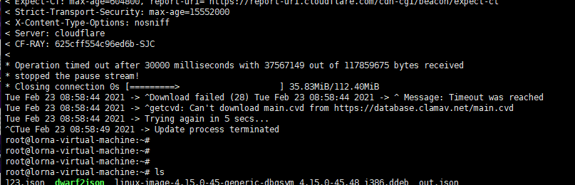

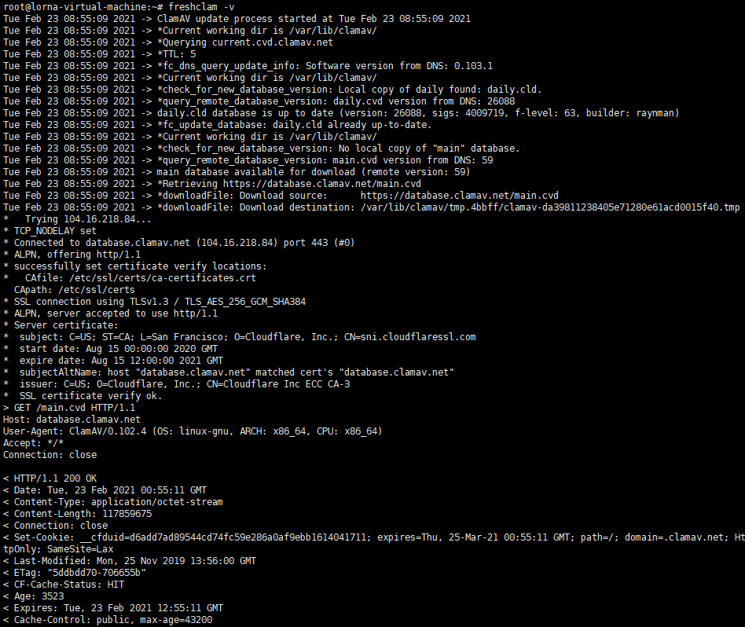

所以我们需要手动下载病毒库。

```bash
wget http://database.clamav.net/main.cvd
wget http://database.clamav.net/daily.cvd
```

下载完成之后放入 clamAV 指定的文件夹。

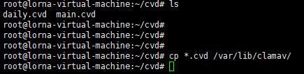

再次使用更新完的 clamAV

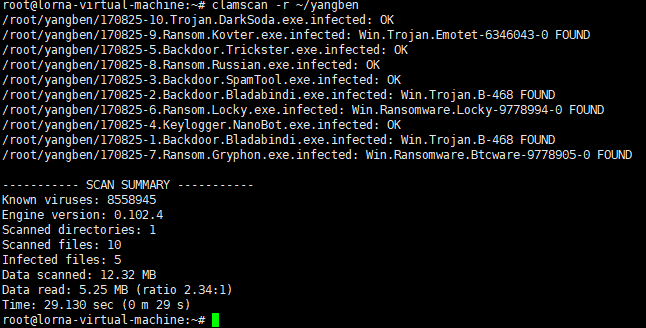

---

## centos7

```bash
yum -y install epel-release             # 安装epel
yum install -y clamav clamav-update     # 安装ClamAV
```

在通常情况下，centos 中安装完 clamAV 不能直接使用，使用 `clamscan -v` 可以看到以下报错。

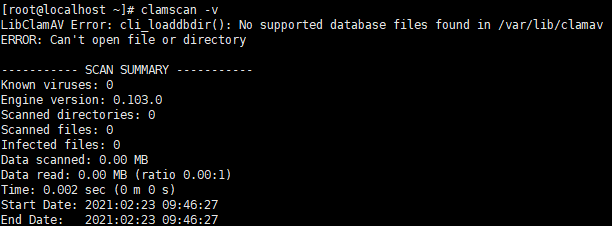

这时需要 `freshclam` 来安装最新病毒库。

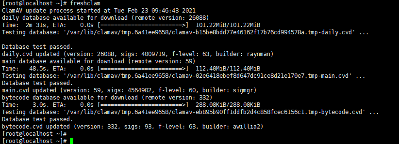

可以看到已经可以扫描了

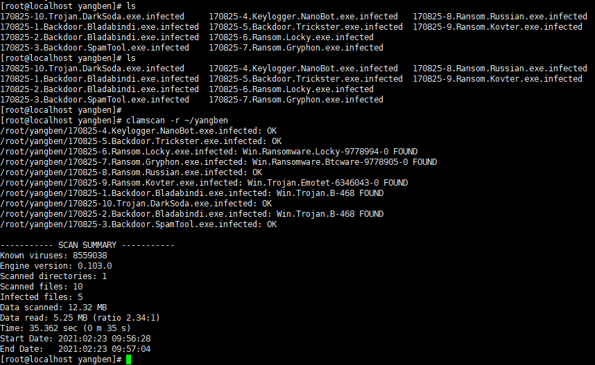

---

## Fedora

使用 yum 直接安装

```bash
yum install -y clamav clamav-update     # 安装ClamAV
```

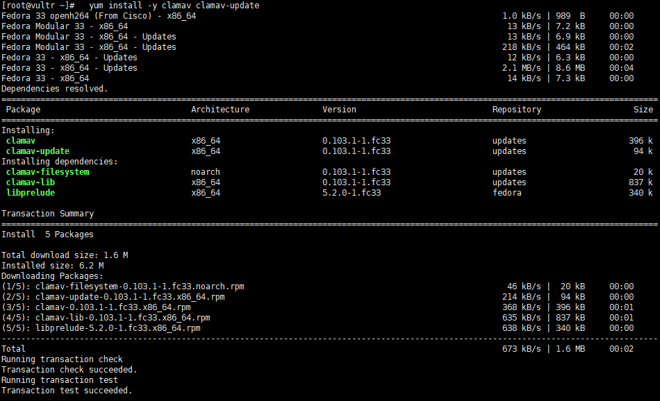

和 centos 一样，也需要更新病毒库后才可以使用。

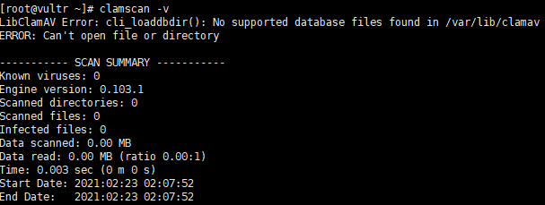

使用 `freshclam` 来更新病毒库。

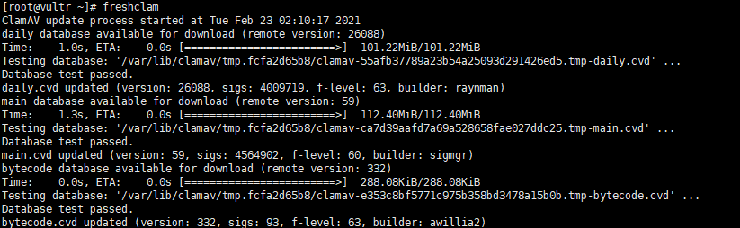

扫描

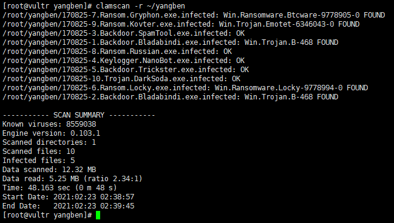

---

## debian

安装

```bash
apt-get install clamav
```

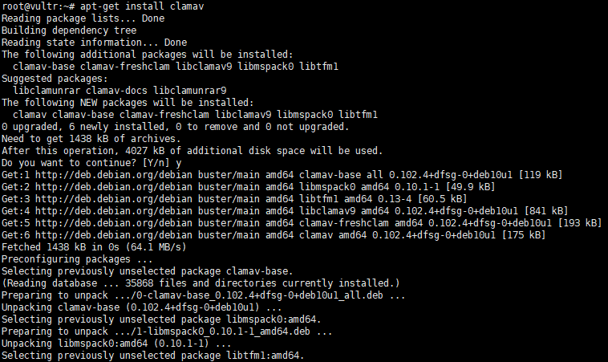

更新

```bash
freshclam -v
```

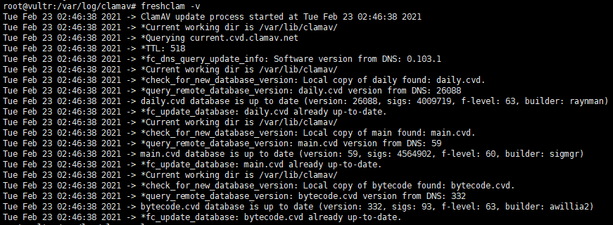

扫描

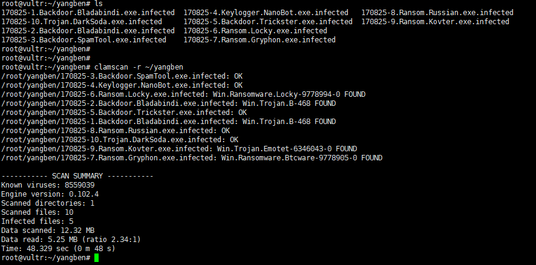
